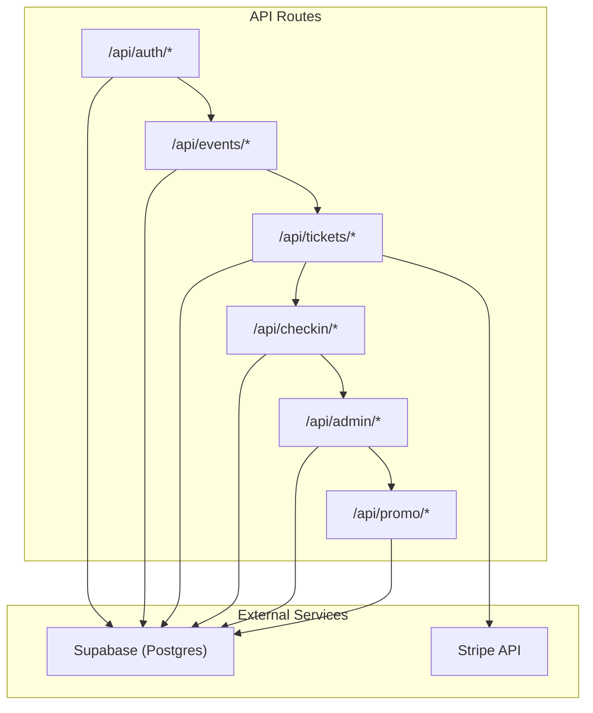
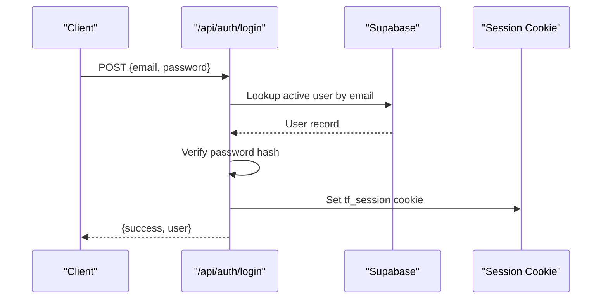
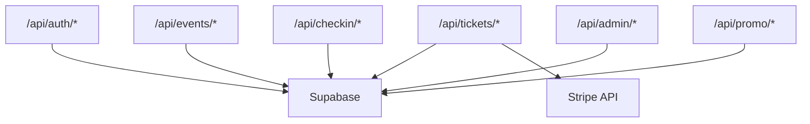

# API Reference

<cite>
**Referenced Files in This Document**
- [login.js](file://pages/api/auth/login.js)
- [logout.js](file://pages/api/auth/logout.js)
- [me.js](file://pages/api/auth/me.js)
- [events_index.js](file://pages/api/events/index.js)
- [events_id.js](file://pages/api/events/[id].js)
- [tickets_purchase.js](file://pages/api/tickets/purchase.js)
- [tickets_stripe_success.js](file://pages/api/tickets/stripe-success.js)
- [checkin_scan.js](file://pages/api/checkin/scan.js)
- [checkin_stats.js](file://pages/api/checkin/stats.js)
- [admin_attendees.js](file://pages/api/admin/attendees.js)
- [admin_staff.js](file://pages/api/admin/staff.js)
- [admin_stats.js](file://pages/api/admin/stats.js)
- [promo_create.js](file://pages/api/promo/create.js)
- [promo_list.js](file://pages/api/promo/list.js)
- [promo_validate.js](file://pages/api/promo/validate.js)
</cite>

## Table of Contents
1. Introduction
2. Project Structure
3. Core Components
4. Architecture Overview
5. Detailed Component Analysis
6. Dependency Analysis
7. Performance Considerations
8. Troubleshooting Guide
9. Conclusion
10. Appendices

## Introduction
This document provides a complete RESTful API reference for TicketFlow, covering authentication, events, ticket purchases and payments, check-in operations, admin utilities, and promotional codes. It includes HTTP methods, URL patterns, request/response schemas, authentication requirements, error handling strategies, rate limiting considerations, versioning guidance, common use cases, client implementation guidelines, performance tips, security considerations, input validation, response formatting standards, debugging recommendations, and monitoring approaches.

## Project Structure
TicketFlow exposes its API via Next.js API routes under pages/api. Each endpoint is implemented as an asynchronous handler that reads the HTTP method, validates inputs, enforces authorization, interacts with Supabase, and returns JSON responses. Authentication uses session cookies and role-based access control. Payments integrate Stripe Checkout for secure card payments.

[No sources needed since this diagram shows conceptual workflow, not actual code structure]

## Core Components
- Authentication: Session-based login/logout and current user retrieval using cookies and role checks.
- Events: CRUD endpoints for event management with role-based protection.
- Tickets: Purchase flow supporting multiple payment methods and Stripe Checkout integration; success webhook to finalize tickets.
- Check-in: QR scan entry validation and recording with staff context.
- Admin: Attendee listing, staff management, and aggregated statistics.
- Promo: Create, list, and validate promotional codes.

Key behaviors:
- All protected endpoints enforce roles via requireRole.
- Public endpoints include GET /api/events (published only) and /api/promo/validate.
- Responses are consistently structured with either data payloads or error objects.
- Errors return appropriate HTTP status codes and a JSON error field.

**Section sources**
- [login.js:1-31](file://pages/api/auth/login.js#L1-L31)
- [logout.js:1-5](file://pages/api/auth/logout.js#L1-L5)
- [me.js:1-19](file://pages/api/auth/me.js#L1-L19)
- [events_index.js:1-42](file://pages/api/events/index.js#L1-L42)
- [events_id.js:1-42](file://pages/api/events/[id].js#L1-L42)
- [tickets_purchase.js:1-123](file://pages/api/tickets/purchase.js#L1-L123)
- [tickets_stripe_success.js:1-55](file://pages/api/tickets/stripe-success.js#L1-L55)
- [checkin_scan.js:1-44](file://pages/api/checkin/scan.js#L1-L44)
- [checkin_stats.js:1-31](file://pages/api/checkin/stats.js#L1-L31)
- [admin_attendees.js:1-29](file://pages/api/admin/attendees.js#L1-L29)
- [admin_staff.js:1-28](file://pages/api/admin/staff.js#L1-L28)
- [admin_stats.js:1-41](file://pages/api/admin/stats.js#L1-L41)
- [promo_create.js:1-23](file://pages/api/promo/create.js#L1-L23)
- [promo_list.js:1-15](file://pages/api/promo/list.js#L1-L15)
- [promo_validate.js:1-27](file://pages/api/promo/validate.js#L1-L27)

## Architecture Overview
The API follows a layered approach:
- Route handlers parse requests, validate inputs, and enforce authorization.
- Data access is performed through Supabase client calls.
- Payment processing delegates to Stripe Checkout for secure transactions.
- Consistent error and response formats simplify client integration.

**Diagram sources**
- [login.js:1-31](file://pages/api/auth/login.js#L1-L31)

**Section sources**
- [login.js:1-31](file://pages/api/auth/login.js#L1-L31)
- [me.js:1-19](file://pages/api/auth/me.js#L1-L19)

## Detailed Component Analysis

### Authentication Endpoints (/api/auth/*)
- POST /api/auth/login
  - Purpose: Authenticate user and issue session cookie.
  - Auth: None (public).
  - Request body: email, password.
  - Response: { success: boolean, user: { id, email, full_name, role } }.
  - Errors: 400 missing fields, 401 invalid credentials, 500 server error.
  - Notes: Sets HttpOnly SameSite=Lax cookie tf_session with 7-day expiry.

- POST /api/auth/logout
  - Purpose: Clear session cookie.
  - Auth: None (public).
  - Response: { success: boolean }.
  - Errors: None expected.

- GET /api/auth/me
  - Purpose: Retrieve current authenticated user profile.
  - Auth: Required (valid tf_session cookie).
  - Response: { user: object|null }.
  - Errors: 401 unauthorized, 500 server error.

Security considerations:
- Passwords are verified against stored hashes.
- Session tokens are set as HttpOnly cookies to mitigate XSS.
- Role-based middleware protects subsequent endpoints.

**Section sources**
- [login.js:1-31](file://pages/api/auth/login.js#L1-L31)
- [logout.js:1-5](file://pages/api/auth/logout.js#L1-L5)
- [me.js:1-19](file://pages/api/auth/me.js#L1-L19)

### Event Management Endpoints (/api/events/*)
- GET /api/events
  - Purpose: List published events with ticket types.
  - Auth: None (public).
  - Response: { events: array }.
  - Errors: 500 database errors.

- POST /api/events
  - Purpose: Create a new event (draft).
  - Auth: super_admin or organiser.
  - Request body: event_name, slug, date, venue (required), time, description, poster_image, theme_color, capacity.
  - Response: { event: object }.
  - Errors: 400 missing fields or DB error, 401/403 unauthorized, 500 server error.

- GET /api/events/{id}
  - Purpose: Fetch a single event by ID with ticket types.
  - Auth: None (public).
  - Response: { event: object }.
  - Errors: 404 not found, 500 server error.

- PUT /api/events/{id}
  - Purpose: Update event details.
  - Auth: super_admin or organiser.
  - Request body: Fields to update (id, organiser_id, created_at stripped server-side).
  - Response: { event: object }.
  - Errors: 400 DB error, 401/403 unauthorized, 500 server error.

- DELETE /api/events/{id}
  - Purpose: Delete an event.
  - Auth: super_admin or organiser.
  - Response: { success: boolean }.
  - Errors: 400 DB error, 401/403 unauthorized, 500 server error.

Input validation:
- Slug normalization applied on create/update.
- Required fields enforced on create.

**Section sources**
- [events_index.js:1-42](file://pages/api/events/index.js#L1-L42)
- [events_id.js:1-42](file://pages/api/events/[id].js#L1-L42)

### Ticket Processing Endpoints (/api/tickets/*)
- POST /api/tickets/purchase
  - Purpose: Initiate ticket purchase with optional promo code and payment method selection.
  - Auth: None (public).
  - Request body: eventId, ticketTypeId, quantity, buyerName, buyerEmail, buyerPhone (optional), paymentMethod, promoCode (optional).
  - Behavior:
    - Validates ticket type availability and applies promo discount if valid.
    - If paymentMethod is stripe: creates Stripe Checkout session and returns checkoutUrl.
    - Else: creates tickets immediately, updates sold counts, records payment (status depends on method).
  - Response:
    - Stripe path: { checkoutUrl: string }.
    - Non-Stripe path: { success: boolean, tokens: array, orderId: string }.
  - Errors: 400 missing fields or insufficient stock, 404 ticket type not found, 500 server error.

- GET /api/tickets/stripe-success
  - Purpose: Finalize ticket creation after successful Stripe payment.
  - Auth: None (public).
  - Query params: session_id.
  - Behavior: Retrieves Stripe session, verifies payment status, creates tickets, updates sold counts, records payment, redirects to first ticket page.
  - Redirects: To homepage with error query on failure; to /ticket/{token} on success.
  - Errors: Internal errors handled via redirect to error states.

Error handling strategy:
- Stripe success flow handles non-paid sessions gracefully.
- Invalid event or processing failures redirect with descriptive error parameters.

**Section sources**
- [tickets_purchase.js:1-123](file://pages/api/tickets/purchase.js#L1-L123)
- [tickets_stripe_success.js:1-55](file://pages/api/tickets/stripe-success.js#L1-L55)

### Check-in Endpoints (/api/checkin/*)
- POST /api/checkin/scan
  - Purpose: Validate and process ticket check-in at event gate.
  - Auth: super_admin, organiser, or gate_staff.
  - Request body: token, eventId, method (default qr_scan), deviceInfo (optional).
  - Behavior:
    - Locates ticket for event and validates state (not cancelled/refunded/already used).
    - Marks ticket as checked-in and logs check-in with staff context.
  - Response:
    - Valid: { valid: true, reason: "SUCCESS", message, ticket: { buyer_name, ticket_type, buyer_phone } }.
    - Invalid: { valid: false, reason, message[, ticket] }.
  - Errors: 400 missing fields, 401/403 unauthorized, 500 server error.

- GET /api/checkin/stats
  - Purpose: Retrieve check-in statistics for an event.
  - Auth: super_admin, organiser, or gate_staff.
  - Query params: eventId (required).
  - Response: { total, checkedIn, capacity, eventName, recent: array }.
  - Errors: 400 missing eventId, 401/403 unauthorized, 500 server error.

Performance considerations:
- Recent check-ins limited to 20 entries.
- Aggregations use head queries for counts to reduce payload size.

**Section sources**
- [checkin_scan.js:1-44](file://pages/api/checkin/scan.js#L1-L44)
- [checkin_stats.js:1-31](file://pages/api/checkin/stats.js#L1-L31)

### Admin Operation Endpoints (/api/admin/*)
- GET /api/admin/attendees
  - Purpose: List attendees for an event with optional search across name, email, phone, token.
  - Auth: super_admin, organiser, or gate_staff.
  - Query params: eventId (required), search (optional).
  - Response: { attendees: array }.
  - Errors: 400 missing eventId, 500 server error.

- GET /api/admin/staff
  - Purpose: List gate staff users.
  - Auth: super_admin or organiser.
  - Response: { staff: array }.

- POST /api/admin/staff
  - Purpose: Create a new gate staff user with hashed password.
  - Auth: super_admin or organiser.
  - Request body: full_name, email, password (required), phone (optional).
  - Response: { staff: object }.
  - Errors: 400 missing fields or DB error, 401/403 unauthorized, 500 server error.

- GET /api/admin/stats
  - Purpose: Aggregate revenue, tickets sold, and per-event breakdown.
  - Auth: super_admin or organiser.
  - Response: { totalRevenue, totalTicketsSold, totalEvents, events: array }.
  - Behavior: Filters events by organizer for non-super admins; aggregates payments and tickets.
  - Errors: 401/403 unauthorized, 500 server error.

**Section sources**
- [admin_attendees.js:1-29](file://pages/api/admin/attendees.js#L1-L29)
- [admin_staff.js:1-28](file://pages/api/admin/staff.js#L1-L28)
- [admin_stats.js:1-41](file://pages/api/admin/stats.js#L1-L41)

### Promotional Code Endpoints (/api/promo/*)
- POST /api/promo/create
  - Purpose: Create a new promo code for an event.
  - Auth: super_admin or organiser.
  - Request body: event_id, code, discount_percent (required), max_uses (optional), expires_at (optional).
  - Response: { promo: object }.
  - Errors: 400 missing fields or DB error, 401/403 unauthorized, 500 server error.

- GET /api/promo/list
  - Purpose: List all promo codes for an event.
  - Auth: super_admin or organiser.
  - Query params: eventId (required).
  - Response: { promos: array }.
  - Errors: 400 missing eventId, 401/403 unauthorized, 500 server error.

- POST /api/promo/validate
  - Purpose: Validate a promo code for an event without side effects.
  - Auth: None (public).
  - Request body: code, eventId (required).
  - Response:
    - Valid: { valid: true, promo: { code, discount_percent } }.
    - Invalid: { valid: false, error }.
  - Errors: 400 missing fields, 500 server error.

Validation rules:
- Codes normalized to uppercase and trimmed.
- Checks for activity, usage limits, and expiration.

**Section sources**
- [promo_create.js:1-23](file://pages/api/promo/create.js#L1-L23)
- [promo_list.js:1-15](file://pages/api/promo/list.js#L1-L15)
- [promo_validate.js:1-27](file://pages/api/promo/validate.js#L1-L27)

## Dependency Analysis
The API relies on two primary external dependencies:
- Supabase for data persistence and querying.
- Stripe for secure payment processing.

**Diagram sources**
- [tickets_purchase.js:1-123](file://pages/api/tickets/purchase.js#L1-L123)
- [tickets_stripe_success.js:1-55](file://pages/api/tickets/stripe-success.js#L1-L55)

**Section sources**
- [tickets_purchase.js:1-123](file://pages/api/tickets/purchase.js#L1-L123)
- [tickets_stripe_success.js:1-55](file://pages/api/tickets/stripe-success.js#L1-L55)

## Performance Considerations
- Use HEAD queries for counts where possible to minimize payload (as seen in check-in stats).
- Limit result sets for recent data (e.g., last 20 check-ins).
- Avoid unnecessary joins; select only required fields.
- Cache frequently accessed public data at the CDN or application layer when appropriate.
- For high-throughput scenarios, consider rate limiting at the API gateway level.

[No sources needed since this section provides general guidance]

## Troubleshooting Guide
Common issues and resolutions:
- Authentication failures: Ensure tf_session cookie is present and valid; verify role permissions.
- Missing fields: Validate request bodies against documented schemas before sending.
- Database errors: Inspect error messages returned from Supabase; ensure constraints and indexes are correct.
- Stripe payment failures: Confirm session_id is provided; verify payment_status is paid before finalizing tickets.
- Promo code validation: Check activation status, usage limits, and expiration dates.

Debugging recommendations:
- Log request payloads and responses in development.
- Use browser dev tools to inspect cookies and network traffic.
- Monitor Supabase logs and Stripe dashboard for transaction details.

Monitoring approaches:
- Track error rates and latency for each endpoint.
- Alert on failed Stripe sessions and database errors.
- Observe check-in throughput and queue lengths during events.

**Section sources**
- [login.js:1-31](file://pages/api/auth/login.js#L1-L31)
- [tickets_stripe_success.js:1-55](file://pages/api/tickets/stripe-success.js#L1-L55)
- [checkin_scan.js:1-44](file://pages/api/checkin/scan.js#L1-L44)

## Conclusion
TicketFlow’s API provides a robust, secure, and scalable foundation for event management, ticket sales, and check-in operations. By following the documented schemas, authentication flows, and error handling strategies, clients can implement reliable integrations. Adopting the recommended performance and security practices will ensure smooth operation under load and protect sensitive data.

[No sources needed since this section summarizes without analyzing specific files]

## Appendices

### Authentication and Authorization
- Session-based authentication via HttpOnly cookies.
- Role-based access control for protected endpoints.
- Recommended client behavior:
  - Store and send cookies automatically for same-site requests.
  - Handle 401 responses by prompting re-authentication.

**Section sources**
- [login.js:1-31](file://pages/api/auth/login.js#L1-L31)
- [me.js:1-19](file://pages/api/auth/me.js#L1-L19)

### Input Validation Standards
- Normalize strings (trim, lowercase/uppercase as needed).
- Enforce required fields and data types.
- Sanitize inputs to prevent injection attacks.

**Section sources**
- [events_index.js:1-42](file://pages/api/events/index.js#L1-L42)
- [promo_validate.js:1-27](file://pages/api/promo/validate.js#L1-L27)

### Error Handling Strategy
- Return consistent JSON error objects with descriptive messages.
- Use appropriate HTTP status codes (400, 401, 403, 404, 500).
- Avoid exposing internal stack traces in production.

**Section sources**
- [events_id.js:1-42](file://pages/api/events/[id].js#L1-L42)
- [checkin_scan.js:1-44](file://pages/api/checkin/scan.js#L1-L44)

### Rate Limiting and Versioning
- Implement rate limiting at the API gateway or reverse proxy to prevent abuse.
- Version the API by prefixing routes (e.g., /api/v1/*) when introducing breaking changes.
- Communicate deprecations and migration paths to clients.

[No sources needed since this section provides general guidance]

### Security Considerations
- Enforce HTTPS for all endpoints.
- Validate and sanitize all inputs.
- Protect secrets (Stripe keys, Supabase credentials) via environment variables.
- Apply least-privilege roles and restrict sensitive operations.

[No sources needed since this section provides general guidance]

### Common Use Cases
- User login and profile retrieval.
- Creating and publishing events.
- Purchasing tickets with Stripe Checkout.
- Scanning tickets at the gate and retrieving attendance stats.
- Managing staff and viewing administrative reports.
- Creating and validating promotional codes.

[No sources needed since this section provides general guidance]