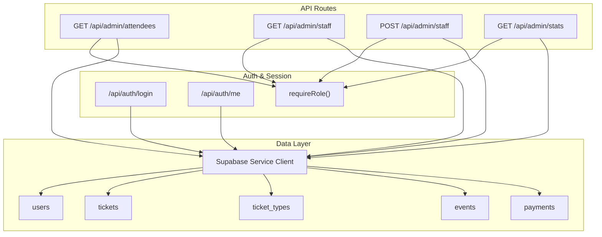
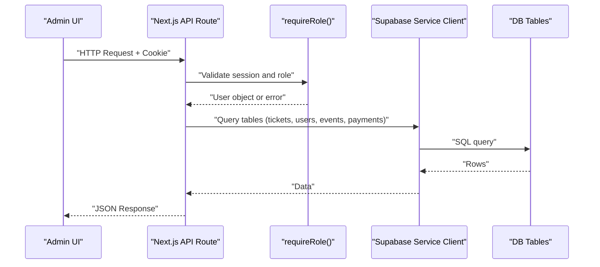
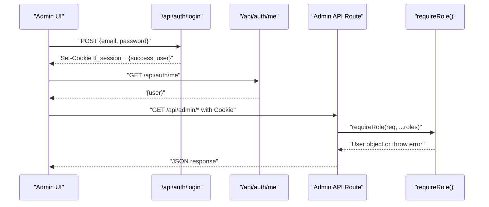
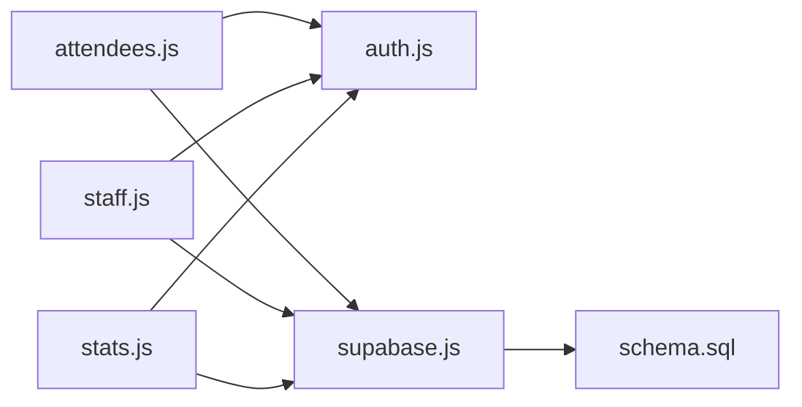
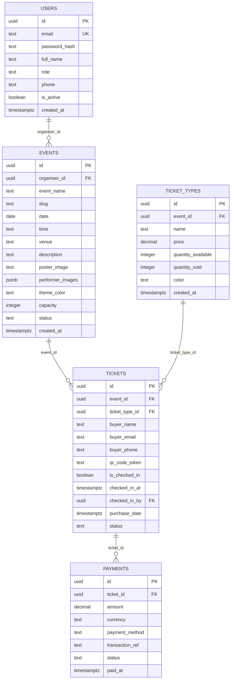

# Admin API

<cite>
**Referenced Files in This Document**
- [attendees.js](file://pages/api/admin/attendees.js)
- [staff.js](file://pages/api/admin/staff.js)
- [stats.js](file://pages/api/admin/stats.js)
- [auth.js](file://lib/auth.js)
- [supabase.js](file://lib/supabase.js)
- [schema.sql](file://supabase/schema.sql)
- [me.js](file://pages/api/auth/me.js)
- [login.js](file://pages/api/auth/login.js)
- [reports.js](file://pages/admin/reports.js)
- [AdminLayout.js](file://components/AdminLayout.js)
</cite>

## Table of Contents
1. [Introduction](#introduction)
2. [Project Structure](#project-structure)
3. [Core Components](#core-components)
4. [Architecture Overview](#architecture-overview)
5. [Detailed Component Analysis](#detailed-component-analysis)
6. [Dependency Analysis](#dependency-analysis)
7. [Performance Considerations](#performance-considerations)
8. [Troubleshooting Guide](#troubleshooting-guide)
9. [Conclusion](#conclusion)
10. [Appendices](#appendices)

## Introduction
This document provides API documentation for TicketFlow’s administrative endpoints used to manage attendees, staff, and analytics. It focuses on:
- GET /api/admin/attendees: Retrieve attendee lists with filtering by event and search across buyer fields and QR token.
- GET /api/admin/staff: List gate staff and create new staff accounts (POST).
- GET /api/admin/stats: Aggregate analytics including revenue, tickets sold, and per-event breakdowns.

Authorization is enforced via role-based checks. The endpoints require an authenticated session cookie and specific roles. Data is accessed through a Supabase service client configured server-side.

## Project Structure
The admin APIs are implemented as Next.js API routes under pages/api/admin. Authentication and authorization utilities reside in lib/auth.js, while database access uses a service-role Supabase client from lib/supabase.js. The schema defines the core tables used by these endpoints.

**Diagram sources**
- [attendees.js:1-29](file://pages/api/admin/attendees.js#L1-L29)
- [staff.js:1-28](file://pages/api/admin/staff.js#L1-L28)
- [stats.js:1-41](file://pages/api/admin/stats.js#L1-L41)
- [auth.js:1-47](file://lib/auth.js#L1-L47)
- [supabase.js:1-23](file://lib/supabase.js#L1-L23)
- [schema.sql:1-166](file://supabase/schema.sql#L1-L166)
- [me.js:1-19](file://pages/api/auth/me.js#L1-L19)
- [login.js:1-31](file://pages/api/auth/login.js#L1-L31)

**Section sources**
- [attendees.js:1-29](file://pages/api/admin/attendees.js#L1-L29)
- [staff.js:1-28](file://pages/api/admin/staff.js#L1-L28)
- [stats.js:1-41](file://pages/api/admin/stats.js#L1-L41)
- [auth.js:1-47](file://lib/auth.js#L1-L47)
- [supabase.js:1-23](file://lib/supabase.js#L1-L23)
- [schema.sql:1-166](file://supabase/schema.sql#L1-L166)
- [me.js:1-19](file://pages/api/auth/me.js#L1-L19)
- [login.js:1-31](file://pages/api/auth/login.js#L1-L31)

## Core Components
- Authorization middleware: requireRole enforces authentication and role checks using a session cookie.
- Database client: getServiceClient returns a Supabase client initialized with a service role key for server-side operations.
- Admin UI integration: Reports and Staff pages consume these endpoints to render dashboards and management interfaces.

Key responsibilities:
- Attendees endpoint filters tickets by event and supports text search across multiple fields.
- Staff endpoint lists gate_staff users and allows creating new staff accounts with hashed passwords.
- Stats endpoint aggregates revenue and ticket metrics across events visible to the current user.

**Section sources**
- [auth.js:1-47](file://lib/auth.js#L1-L47)
- [supabase.js:1-23](file://lib/supabase.js#L1-L23)
- [reports.js:1-610](file://pages/admin/reports.js#L1-L610)
- [AdminLayout.js:1-194](file://components/AdminLayout.js#L1-L194)

## Architecture Overview
The admin API follows a simple request-response pattern:
- Client sends HTTP requests with a session cookie set by login.
- Each route validates the session and required roles via requireRole.
- Data is fetched using Supabase service client queries against relevant tables.
- Responses return structured JSON payloads suitable for dashboard rendering or CSV export.

**Diagram sources**
- [attendees.js:1-29](file://pages/api/admin/attendees.js#L1-L29)
- [staff.js:1-28](file://pages/api/admin/staff.js#L1-L28)
- [stats.js:1-41](file://pages/api/admin/stats.js#L1-L41)
- [auth.js:1-47](file://lib/auth.js#L1-L47)
- [supabase.js:1-23](file://lib/supabase.js#L1-L23)

## Detailed Component Analysis

### GET /api/admin/attendees
Purpose:
- Retrieve attendees (tickets) for a specified event.
- Filter by eventId; optional search across buyer_name, buyer_email, buyer_phone, qr_code_token.

Authorization:
- Requires one of: super_admin, organiser, gate_staff.

Request:
- Method: GET
- Query parameters:
  - eventId (required): UUID of the event.
  - search (optional): string to match against buyer_name, buyer_email, buyer_phone, qr_code_token (case-insensitive partial match).

Response:
- Success: { attendees: Array } where each attendee includes ticket details and related ticket_type info (name, color, price).
- Errors:
  - 405 if method not GET.
  - 400 if eventId missing.
  - 500 for database errors.

Notes:
- Results are ordered by purchase_date descending.
- No pagination is implemented; large datasets may be returned without limits.

Common tasks:
- Export attendee list to CSV by fetching all records and transforming into rows.
- Search for a specific attendee by email or QR code token.

Example usage:
- Fetch attendees for event X: GET /api/admin/attendees?eventId=UUID
- Search attendees by email: GET /api/admin/attendees?eventId=UUID&search=user@example.com

**Section sources**
- [attendees.js:1-29](file://pages/api/admin/attendees.js#L1-L29)
- [schema.sql:59-73](file://supabase/schema.sql#L59-L73)

### GET /api/admin/staff
Purpose:
- List gate_staff users.
- Create a new gate_staff account.

Authorization:
- Requires one of: super_admin, organiser.

Requests:
- GET: Returns { staff: Array } with id, email, full_name, phone, is_active, created_at for gate_staff users, ordered by created_at descending.
- POST: Creates a new gate_staff user.
  - Body fields:
    - full_name (required)
    - email (required, normalized to lowercase and trimmed)
    - password (required, hashed server-side)
    - phone (optional)

Response:
- GET success: { staff: Array }
- POST success: 201 with { staff: UserObject }
- Errors:
  - 400 for missing required fields or validation errors.
  - 500 for database errors.

Notes:
- Passwords are hashed using bcrypt before storage.
- New accounts are created with role 'gate_staff' and is_active true.

Common tasks:
- Bulk import staff by iterating POST calls (not atomic; consider batching at application level).
- Toggle active status via direct database updates outside this endpoint (not exposed here).

Example usage:
- List staff: GET /api/admin/staff
- Create staff: POST /api/admin/staff with JSON body containing full_name, email, password, phone (optional)

**Section sources**
- [staff.js:1-28](file://pages/api/admin/staff.js#L1-L28)
- [auth.js:1-47](file://lib/auth.js#L1-L47)
- [schema.sql:10-19](file://supabase/schema.sql#L10-L19)

### GET /api/admin/stats
Purpose:
- Provide comprehensive analytics and reporting data.
- Aggregates total revenue, total tickets sold, total events, and per-event breakdowns (sold, checkedIn).

Authorization:
- Requires one of: super_admin, organiser.
- For non-super_admin users, only their own events are included.

Request:
- Method: GET
- No query parameters currently supported.

Response:
- { totalRevenue, totalTicketsSold, totalEvents, events: Array }
- Each event includes id, event_name, status, date, capacity plus computed sold and checkedIn counts.

Notes:
- Revenue is calculated from completed payments linked to tickets belonging to the user’s events.
- Tickets counted as sold exclude cancelled and refunded statuses.
- Per-event breakdown computes sold and checkedIn based on ticket statuses.

Common tasks:
- Dashboard integration: Render summary cards and charts using the provided totals and per-event stats.
- CSV export: Transform events array into rows for Event, Status, Date, Sold, Checked In.

Example usage:
- Fetch stats: GET /api/admin/stats

**Section sources**
- [stats.js:1-41](file://pages/api/admin/stats.js#L1-L41)
- [schema.sql:24-40](file://supabase/schema.sql#L24-L40)
- [schema.sql:59-73](file://supabase/schema.sql#L59-L73)
- [schema.sql:91-102](file://supabase/schema.sql#L91-L102)

### Authorization Flow
Authentication and authorization are handled via cookies and role checks:
- Login sets a session cookie with userId and role.
- requireRole extracts the session, validates expiration, and ensures the user has one of the allowed roles.
- Admin UI components enforce role checks on page load and redirect unauthorized users.

**Diagram sources**
- [login.js:1-31](file://pages/api/auth/login.js#L1-L31)
- [me.js:1-19](file://pages/api/auth/me.js#L1-L19)
- [auth.js:1-47](file://lib/auth.js#L1-L47)
- [AdminLayout.js:1-194](file://components/AdminLayout.js#L1-L194)

**Section sources**
- [login.js:1-31](file://pages/api/auth/login.js#L1-L31)
- [me.js:1-19](file://pages/api/auth/me.js#L1-L19)
- [auth.js:1-47](file://lib/auth.js#L1-L47)
- [AdminLayout.js:1-194](file://components/AdminLayout.js#L1-L194)

## Dependency Analysis
The admin endpoints depend on:
- lib/auth.js for session parsing and role enforcement.
- lib/supabase.js for service-role database access.
- Database schema defining users, tickets, ticket_types, events, and payments.

**Diagram sources**
- [attendees.js:1-29](file://pages/api/admin/attendees.js#L1-L29)
- [staff.js:1-28](file://pages/api/admin/staff.js#L1-L28)
- [stats.js:1-41](file://pages/api/admin/stats.js#L1-L41)
- [auth.js:1-47](file://lib/auth.js#L1-L47)
- [supabase.js:1-23](file://lib/supabase.js#L1-L23)
- [schema.sql:1-166](file://supabase/schema.sql#L1-L166)

**Section sources**
- [attendees.js:1-29](file://pages/api/admin/attendees.js#L1-L29)
- [staff.js:1-28](file://pages/api/admin/staff.js#L1-L28)
- [stats.js:1-41](file://pages/api/admin/stats.js#L1-L41)
- [auth.js:1-47](file://lib/auth.js#L1-L47)
- [supabase.js:1-23](file://lib/supabase.js#L1-L23)
- [schema.sql:1-166](file://supabase/schema.sql#L1-L166)

## Performance Considerations
- Attendees endpoint:
  - No pagination; large event datasets can result in heavy responses. Consider adding limit and offset parameters in future iterations.
  - Search uses ILIKE patterns across multiple columns; ensure appropriate indexes exist on buyer_email and qr_code_token (already present in schema).
- Stats endpoint:
  - Uses parallel queries for payments and tickets; performance scales with number of events and tickets.
  - Non-super_admin users filter by organiser_id to reduce dataset size.
- Staff endpoint:
  - Lists only gate_staff users; minimal overhead unless many users exist.
- General:
  - Use service-role client carefully; avoid exposing sensitive operations to clients.
  - Implement caching or rate limiting at the API layer if needed for high traffic.

[No sources needed since this section provides general guidance]

## Troubleshooting Guide
Common issues and resolutions:
- 401 Not authenticated:
  - Ensure the session cookie tf_session is present and valid.
  - Verify login flow sets the cookie correctly.
- 403 Insufficient permissions:
  - Check that the user’s role matches one of the required roles for the endpoint.
- 400 Missing required fields:
  - For POST /api/admin/staff, include full_name, email, password.
  - For GET /api/admin/attendees, include eventId.
- 500 Database errors:
  - Inspect Supabase logs and ensure environment variables (NEXT_PUBLIC_SUPABASE_URL, NEXT_PUBLIC_SUPABASE_ANON_KEY, SUPABASE_SERVICE_ROLE_KEY) are configured.

Operational tips:
- Validate inputs on the client side to reduce 400 errors.
- Log errors in API routes for debugging.
- Use /api/auth/me to verify current user context when diagnosing permission issues.

**Section sources**
- [auth.js:1-47](file://lib/auth.js#L1-L47)
- [staff.js:1-28](file://pages/api/admin/staff.js#L1-L28)
- [attendees.js:1-29](file://pages/api/admin/attendees.js#L1-L29)
- [stats.js:1-41](file://pages/api/admin/stats.js#L1-L41)
- [supabase.js:1-23](file://lib/supabase.js#L1-L23)

## Conclusion
TicketFlow’s admin API provides essential endpoints for managing attendees, staff, and analytics. Authorization is enforced via role-based checks, and data access leverages Supabase with a service-role client. While functional, the endpoints lack pagination and advanced filtering; consider extending them for scalability and richer querying capabilities. Integration with the admin UI demonstrates practical usage for dashboards and reports.

[No sources needed since this section summarizes without analyzing specific files]

## Appendices

### Data Models Used by Admin Endpoints

**Diagram sources**
- [schema.sql:10-19](file://supabase/schema.sql#L10-L19)
- [schema.sql:24-40](file://supabase/schema.sql#L24-L40)
- [schema.sql:45-54](file://supabase/schema.sql#L45-L54)
- [schema.sql:59-73](file://supabase/schema.sql#L59-L73)
- [schema.sql:91-102](file://supabase/schema.sql#L91-L102)

### Example Administrative Tasks
- Export attendee list:
  - Fetch GET /api/admin/attendees?eventId=UUID, transform to CSV rows, and download.
- Add gate staff:
  - POST /api/admin/staff with full_name, email, password, phone (optional).
- View analytics dashboard:
  - Fetch GET /api/admin/stats and render totals and per-event breakdowns.

[No sources needed since this section provides general guidance]