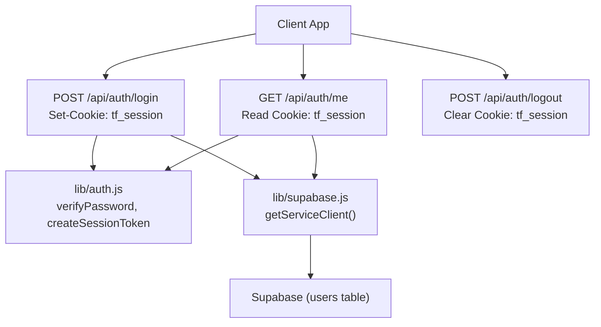
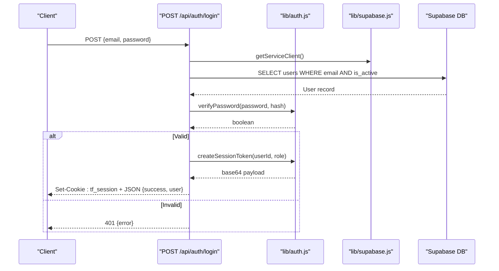
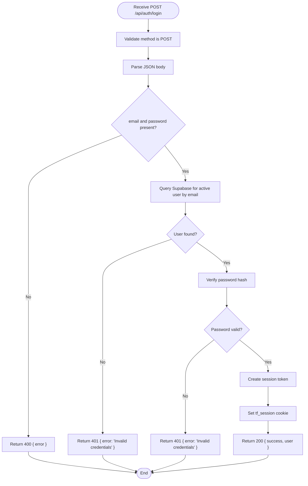
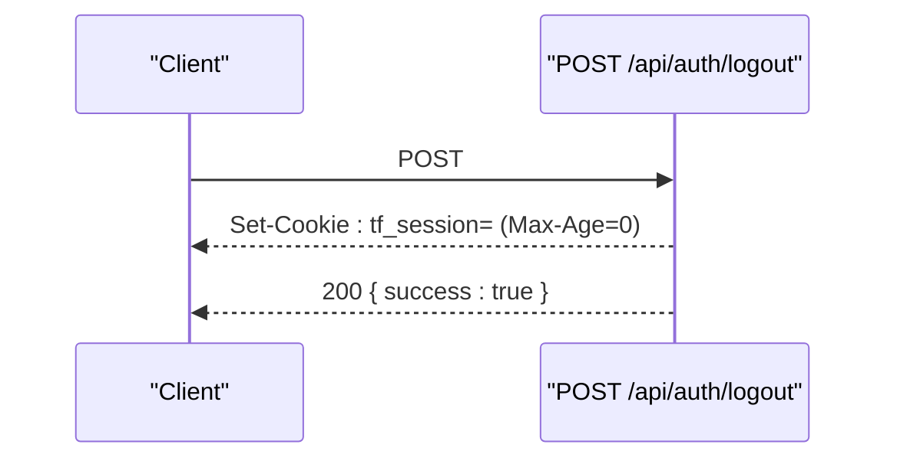
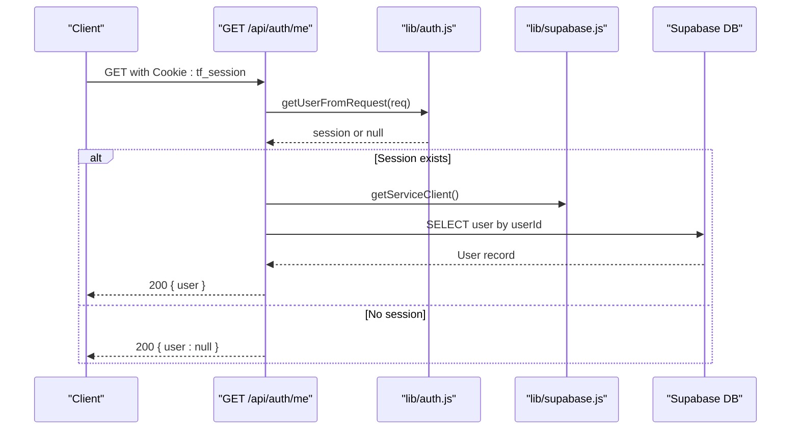
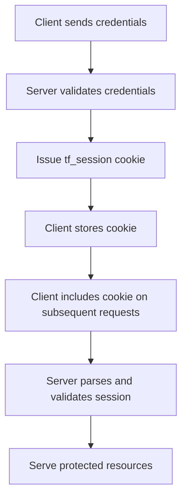
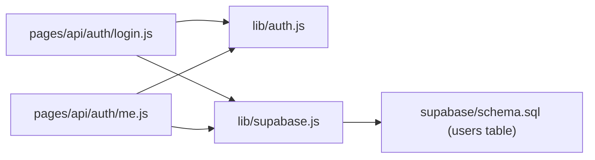

# Authentication API

<cite>
**Referenced Files in This Document**
- [login.js](file://pages/api/auth/login.js)
- [logout.js](file://pages/api/auth/logout.js)
- [me.js](file://pages/api/auth/me.js)
- [auth.js](file://lib/auth.js)
- [supabase.js](file://lib/supabase.js)
- [schema.sql](file://supabase/schema.sql)
- [login.js](file://pages/admin/login.js)
</cite>

## Table of Contents
1. [Introduction](#introduction)
2. [Project Structure](#project-structure)
3. [Core Components](#core-components)
4. [Architecture Overview](#architecture-overview)
5. [Detailed Component Analysis](#detailed-component-analysis)
6. [Dependency Analysis](#dependency-analysis)
7. [Performance Considerations](#performance-considerations)
8. [Troubleshooting Guide](#troubleshooting-guide)
9. [Conclusion](#conclusion)
10. [Appendices](#appendices)

## Introduction
This document provides API documentation for TicketFlow’s authentication endpoints:
- POST /api/auth/login: Authenticate a user with email and password, issue an HttpOnly session cookie, and return basic user info.
- POST /api/auth/logout: Terminate the current session by clearing the session cookie.
- GET /api/auth/me: Retrieve the currently authenticated user’s profile using the session cookie.

The implementation uses a custom session token stored in an HttpOnly cookie and a Supabase service client to access the users table. Passwords are hashed and verified server-side.

## Project Structure
The authentication feature spans three API routes and shared libraries:
- pages/api/auth/login.js: Login endpoint handler
- pages/api/auth/logout.js: Logout endpoint handler
- pages/api/auth/me.js: Current user retrieval endpoint
- lib/auth.js: Password hashing/verification, session token creation/parsing, and cookie-based user extraction
- lib/supabase.js: Supabase client configuration (including service role client)
- supabase/schema.sql: Database schema including the users table used by login and me endpoints
- pages/admin/login.js: Example client that calls the login endpoint

**Diagram sources**
- [login.js:1-31](file://pages/api/auth/login.js#L1-L31)
- [logout.js:1-5](file://pages/api/auth/logout.js#L1-L5)
- [me.js:1-19](file://pages/api/auth/me.js#L1-L19)
- [auth.js:1-47](file://lib/auth.js#L1-L47)
- [supabase.js:1-23](file://lib/supabase.js#L1-L23)
- [schema.sql:10-19](file://supabase/schema.sql#L10-L19)

**Section sources**
- [login.js:1-31](file://pages/api/auth/login.js#L1-L31)
- [logout.js:1-5](file://pages/api/auth/logout.js#L1-L5)
- [me.js:1-19](file://pages/api/auth/me.js#L1-L19)
- [auth.js:1-47](file://lib/auth.js#L1-L47)
- [supabase.js:1-23](file://lib/supabase.js#L1-L23)
- [schema.sql:10-19](file://supabase/schema.sql#L10-L19)
- [login.js:1-67](file://pages/admin/login.js#L1-L67)

## Core Components
- POST /api/auth/login
  - Purpose: Authenticate a user by email and password; set an HttpOnly session cookie and return minimal user data.
  - Request body: JSON object with email and password fields.
  - Success response: JSON with success flag and a user object containing id, email, full_name, and role.
  - Error responses:
    - 400 Bad Request when required fields are missing.
    - 401 Unauthorized for invalid credentials or inactive accounts.
    - 500 Internal Server Error on unexpected failures.
- POST /api/auth/logout
  - Purpose: Clear the session cookie to terminate the current session.
  - Response: JSON with success flag.
- GET /api/auth/me
  - Purpose: Return the current user’s profile based on the session cookie.
  - Success response: JSON with a user object (id, email, full_name, role, phone) if authenticated; otherwise user is null.
  - Error responses:
    - 401 Unauthorized when no valid session is present.
    - 500 Internal Server Error on unexpected failures.

Security notes:
- Session cookie name: tf_session
- Cookie flags: Path=/, HttpOnly, SameSite=Lax, Max-Age=7 days
- Passwords are hashed and verified server-side using bcrypt.
- The service role client is used for database reads during authentication flows.

**Section sources**
- [login.js:1-31](file://pages/api/auth/login.js#L1-L31)
- [logout.js:1-5](file://pages/api/auth/logout.js#L1-L5)
- [me.js:1-19](file://pages/api/auth/me.js#L1-L19)
- [auth.js:1-47](file://lib/auth.js#L1-L47)
- [supabase.js:1-23](file://lib/supabase.js#L1-L23)
- [schema.sql:10-19](file://supabase/schema.sql#L10-L19)

## Architecture Overview
The authentication flow relies on Next.js API routes, a shared auth library, and Supabase for data access.

**Diagram sources**
- [login.js:1-31](file://pages/api/auth/login.js#L1-L31)
- [auth.js:1-47](file://lib/auth.js#L1-L47)
- [supabase.js:1-23](file://lib/supabase.js#L1-L23)
- [schema.sql:10-19](file://supabase/schema.sql#L10-L19)

## Detailed Component Analysis

### POST /api/auth/login
- Validates HTTP method and presence of email/password.
- Queries Supabase for an active user by normalized email.
- Verifies password against stored hash.
- Creates a session token and sets an HttpOnly cookie.
- Returns minimal user data.

Request
- Method: POST
- URL: /api/auth/login
- Content-Type: application/json
- Body schema:
  - email: string (required)
  - password: string (required)

Response
- 200 OK: JSON { success: true, user: { id, email, full_name, role } }
- 400 Bad Request: JSON { error: "Email and password required" }
- 401 Unauthorized: JSON { error: "Invalid credentials" }
- 500 Internal Server Error: JSON { error: "Login failed" }

Cookie handling
- Sets tf_session cookie with Path=/, HttpOnly, SameSite=Lax, Max-Age=7 days.

**Diagram sources**
- [login.js:1-31](file://pages/api/auth/login.js#L1-L31)
- [auth.js:1-47](file://lib/auth.js#L1-L47)

**Section sources**
- [login.js:1-31](file://pages/api/auth/login.js#L1-L31)
- [auth.js:1-47](file://lib/auth.js#L1-L47)

### POST /api/auth/logout
- Clears the session cookie to terminate the current session.
- Returns a simple success response.

Request
- Method: POST
- URL: /api/auth/logout

Response
- 200 OK: JSON { success: true }

Cookie handling
- Clears tf_session cookie by setting Max-Age=0.

**Diagram sources**
- [logout.js:1-5](file://pages/api/auth/logout.js#L1-L5)

**Section sources**
- [logout.js:1-5](file://pages/api/auth/logout.js#L1-L5)

### GET /api/auth/me
- Reads the tf_session cookie from the request.
- Parses and validates the session token.
- If valid, fetches user details from Supabase and returns them.
- If not authenticated, returns user as null.

Request
- Method: GET
- URL: /api/auth/me
- Headers: Cookie: tf_session=<token>

Response
- 200 OK: JSON { user: { id, email, full_name, role, phone } } when authenticated
- 200 OK: JSON { user: null } when not authenticated
- 500 Internal Server Error: JSON { user: null } on unexpected failures

**Diagram sources**
- [me.js:1-19](file://pages/api/auth/me.js#L1-L19)
- [auth.js:1-47](file://lib/auth.js#L1-L47)
- [supabase.js:1-23](file://lib/supabase.js#L1-L23)
- [schema.sql:10-19](file://supabase/schema.sql#L10-L19)

**Section sources**
- [me.js:1-19](file://pages/api/auth/me.js#L1-L19)
- [auth.js:1-47](file://lib/auth.js#L1-L47)
- [supabase.js:1-23](file://lib/supabase.js#L1-L23)
- [schema.sql:10-19](file://supabase/schema.sql#L10-L19)

### Conceptual Overview
The authentication system uses a simple session model:
- Credentials are validated server-side.
- A session token is encoded into a base64 payload and stored in an HttpOnly cookie.
- Subsequent requests include the cookie automatically; the server parses and validates it to identify the user.

[No sources needed since this diagram shows conceptual workflow, not actual code structure]

## Dependency Analysis
Authentication endpoints depend on:
- lib/auth.js for password verification, session token creation/parsing, and cookie-based user extraction.
- lib/supabase.js for database access via Supabase clients (service role key).
- supabase/schema.sql defines the users table schema used by login and me endpoints.

**Diagram sources**
- [login.js:1-31](file://pages/api/auth/login.js#L1-L31)
- [me.js:1-19](file://pages/api/auth/me.js#L1-L19)
- [auth.js:1-47](file://lib/auth.js#L1-L47)
- [supabase.js:1-23](file://lib/supabase.js#L1-L23)
- [schema.sql:10-19](file://supabase/schema.sql#L10-L19)

**Section sources**
- [login.js:1-31](file://pages/api/auth/login.js#L1-L31)
- [me.js:1-19](file://pages/api/auth/me.js#L1-L19)
- [auth.js:1-47](file://lib/auth.js#L1-L47)
- [supabase.js:1-23](file://lib/supabase.js#L1-L23)
- [schema.sql:10-19](file://supabase/schema.sql#L10-L19)

## Performance Considerations
- Password hashing uses bcrypt with a cost factor suitable for server-side operations; ensure rate limiting is applied at the API layer to mitigate brute-force attempts.
- Database queries select only necessary fields to reduce payload size.
- Session tokens are short-lived (7 days) and stored in HttpOnly cookies to minimize exposure.
- Avoid excessive logging of sensitive data such as passwords or tokens.

[No sources needed since this section provides general guidance]

## Troubleshooting Guide
Common issues and resolutions:
- Missing fields on login: Ensure both email and password are provided in the request body.
- Invalid credentials: Confirm the user exists, is active, and the password matches the stored hash.
- Session not recognized: Verify the tf_session cookie is present and not expired; check browser cookie settings and SameSite/Lax behavior.
- CORS and cookie transmission: When making cross-origin requests, ensure credentials are included and cookies are allowed.
- Environment variables: Confirm Supabase URLs and keys are configured correctly for service role access.

**Section sources**
- [login.js:1-31](file://pages/api/auth/login.js#L1-L31)
- [me.js:1-19](file://pages/api/auth/me.js#L1-L19)
- [auth.js:1-47](file://lib/auth.js#L1-L47)
- [supabase.js:1-23](file://lib/supabase.js#L1-L23)

## Conclusion
TicketFlow’s authentication API provides a straightforward, secure approach using server-side password verification and HttpOnly session cookies. Clients should handle cookie storage and inclusion automatically and implement robust error handling for 400 and 401 responses. For production environments, consider adopting a dedicated authentication provider or framework to enhance security and scalability.

[No sources needed since this section summarizes without analyzing specific files]

## Appendices

### API Reference Summary
- POST /api/auth/login
  - Request: { email: string, password: string }
  - Responses: 200 { success, user }, 400 { error }, 401 { error }, 500 { error }
  - Cookie: Sets tf_session (HttpOnly, SameSite=Lax, Max-Age=7 days)
- POST /api/auth/logout
  - Request: None
  - Responses: 200 { success: true }
  - Cookie: Clears tf_session (Max-Age=0)
- GET /api/auth/me
  - Request: Cookie: tf_session
  - Responses: 200 { user: object|null }, 500 { user: null }

**Section sources**
- [login.js:1-31](file://pages/api/auth/login.js#L1-L31)
- [logout.js:1-5](file://pages/api/auth/logout.js#L1-L5)
- [me.js:1-19](file://pages/api/auth/me.js#L1-L19)

### Client Implementation Guidelines
- Use fetch or axios with credentials enabled for cross-origin requests.
- Automatically include cookies on all requests after successful login.
- Handle 401 responses by redirecting to login or refreshing the session.
- Store user state locally after login for UI purposes, but always validate sessions server-side.

Example patterns:
- Login form submission: Send POST with JSON body and navigate upon success.
- Protected route guard: Call GET /api/auth/me before rendering protected content.
- Logout flow: Call POST /api/auth/logout and clear local state.

**Section sources**
- [login.js:1-67](file://pages/admin/login.js#L1-L67)

### Security Considerations
- Cookies:
  - tf_session is HttpOnly to prevent client-side script access.
  - SameSite=Lax mitigates CSRF risks while allowing top-level navigation.
  - Max-Age=7 days limits session lifetime.
- Tokens:
  - Session payload is base64-encoded and contains expiration; treat as opaque and do not expose to clients.
- Passwords:
  - Stored hashes are used; never log or transmit plaintext passwords.
- Database:
  - Service role key is used server-side only; keep environment variables secure.

**Section sources**
- [auth.js:1-47](file://lib/auth.js#L1-L47)
- [supabase.js:1-23](file://lib/supabase.js#L1-L23)