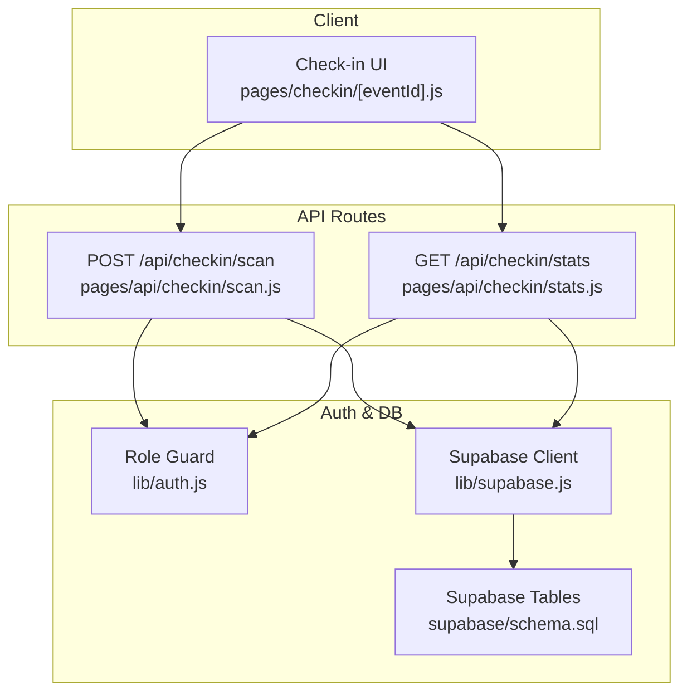
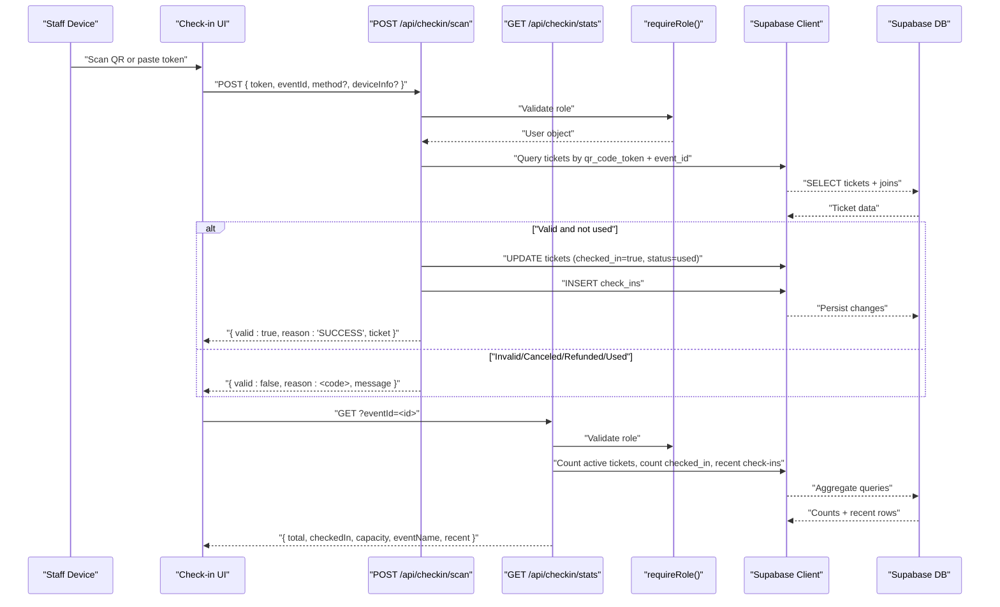
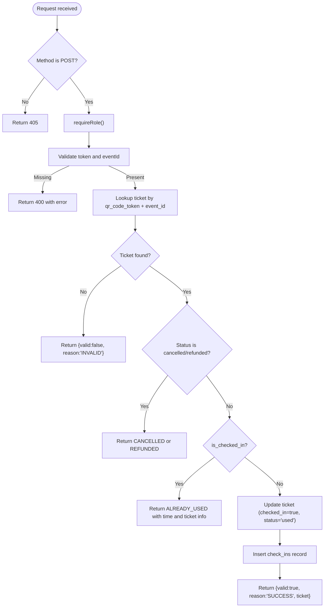
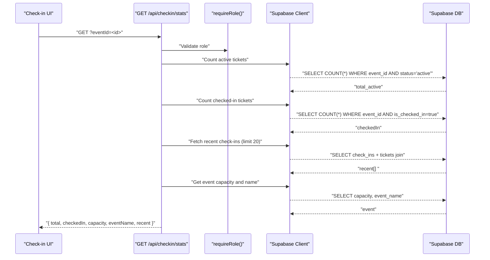
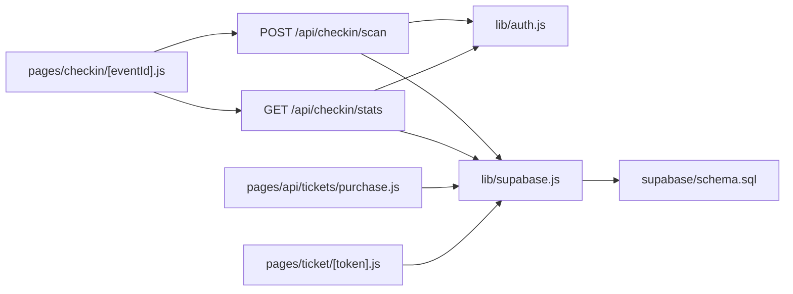

# Check-in API

<cite>
**Referenced Files in This Document**
- [scan.js](file://pages/api/checkin/scan.js)
- [stats.js](file://pages/api/checkin/stats.js)
- [schema.sql](file://supabase/schema.sql)
- [supabase.js](file://lib/supabase.js)
- [auth.js](file://lib/auth.js)
- [purchase.js](file://pages/api/tickets/purchase.js)
- [ticket page](file://pages/ticket/[token].js)
- [check-in UI](file://pages/checkin/[eventId].js)
</cite>

## Table of Contents
1. [Introduction](#introduction)
2. [Project Structure](#project-structure)
3. [Core Components](#core-components)
4. [Architecture Overview](#architecture-overview)
5. [Detailed Component Analysis](#detailed-component-analysis)
6. [Dependency Analysis](#dependency-analysis)
7. [Performance Considerations](#performance-considerations)
8. [Troubleshooting Guide](#troubleshooting-guide)
9. [Conclusion](#conclusion)
10. [Appendices](#appendices)

## Introduction
This document provides API documentation for TicketFlow’s check-in and attendance tracking endpoints:
- POST /api/checkin/scan: Validates QR codes and processes attendee check-ins.
- GET /api/checkin/stats: Retrieves real-time check-in statistics and attendance metrics.

It covers request/response schemas, validation logic, duplicate entry prevention, error handling, and practical workflows for event staff using the check-in interface.

## Project Structure
The check-in functionality is implemented as Next.js API routes backed by Supabase tables defined in the schema. Authentication and authorization are handled via a role-based middleware. The client-side check-in UI polls stats and calls the scan endpoint.

**Diagram sources**
- [scan.js:1-44](file://pages/api/checkin/scan.js#L1-L44)
- [stats.js:1-31](file://pages/api/checkin/stats.js#L1-L31)
- [auth.js:1-47](file://lib/auth.js#L1-L47)
- [supabase.js:1-23](file://lib/supabase.js#L1-L23)
- [schema.sql:59-86](file://supabase/schema.sql#L59-L86)

**Section sources**
- [scan.js:1-44](file://pages/api/checkin/scan.js#L1-L44)
- [stats.js:1-31](file://pages/api/checkin/stats.js#L1-L31)
- [schema.sql:59-86](file://supabase/schema.sql#L59-L86)
- [supabase.js:1-23](file://lib/supabase.js#L1-L23)
- [auth.js:1-47](file://lib/auth.js#L1-L47)

## Core Components
- POST /api/checkin/scan
  - Purpose: Validate a ticket token (QR code content) and process check-in if valid.
  - Authorization: Requires authenticated user with roles super_admin, organiser, or gate_staff.
  - Request body fields:
    - token: string (required) — unique ticket identifier used in QR codes.
    - eventId: string (required) — UUID of the event to validate against.
    - method: string (optional, default 'qr_scan') — indicates scanning method.
    - deviceInfo: string (optional) — optional device metadata logged with the check-in.
  - Validation logic:
    - Lookup ticket by qr_code_token and event_id.
    - Reject invalid tickets, cancelled/refunded tickets, and already-checked-in tickets.
    - On success, mark ticket as checked_in, set timestamp, assign checker, update status to used, and log a check-in record.
  - Response formats:
    - Success: { valid: true, reason: 'SUCCESS', message: 'Welcome! Entry granted.', ticket: { buyer_name, ticket_type, buyer_phone } }
    - Invalid: { valid: false, reason: 'INVALID', message: 'Ticket not found or not for this event' }
    - Cancelled: { valid: false, reason: 'CANCELLED', message: 'Ticket has been cancelled' }
    - Refunded: { valid: false, reason: 'REFUNDED', message: 'Ticket has been refunded' }
    - Already used: { valid: false, reason: 'ALREADY_USED', message: 'Already checked in at <time>', ticket: { buyer_name, ticket_type, checked_in_at } }
    - Error: { error: '<message>' } with appropriate HTTP status.

- GET /api/checkin/stats
  - Purpose: Retrieve real-time check-in statistics and recent activity for an event.
  - Authorization: Requires authenticated user with roles super_admin, organiser, or gate_staff.
  - Query parameters:
    - eventId: string (required) — UUID of the event.
  - Response fields:
    - total: number — active tickets count plus already checked-in tickets for the event.
    - checkedIn: number — count of tickets marked as checked_in for the event.
    - capacity: number — event capacity from events table.
    - eventName: string — name of the event.
    - recent: array — last 20 check-ins including ticket holder and type.
  - Error responses:
    - Missing eventId: { error: 'eventId required' }
    - Server errors: { error: '<message>' }

**Section sources**
- [scan.js:1-44](file://pages/api/checkin/scan.js#L1-L44)
- [stats.js:1-31](file://pages/api/checkin/stats.js#L1-L31)

## Architecture Overview
The check-in flow involves authentication, database queries, and state updates. The stats endpoint aggregates counts and recent entries.

**Diagram sources**
- [scan.js:1-44](file://pages/api/checkin/scan.js#L1-L44)
- [stats.js:1-31](file://pages/api/checkin/stats.js#L1-L31)
- [auth.js:1-47](file://lib/auth.js#L1-L47)
- [supabase.js:1-23](file://lib/supabase.js#L1-L23)
- [schema.sql:59-86](file://supabase/schema.sql#L59-L86)

## Detailed Component Analysis

### POST /api/checkin/scan
- Input validation:
  - Ensures token and eventId are present; otherwise returns 400 with error message.
- Authorization:
  - Uses requireRole to enforce super_admin, organiser, or gate_staff.
- Ticket lookup:
  - Queries tickets by qr_code_token and event_id; includes related ticket_types and events for display.
- State checks:
  - If status is 'cancelled' or 'refunded', returns corresponding invalid reasons.
  - If is_checked_in is true, returns ALREADY_USED with previous check-in time and ticket details.
- Update on success:
  - Sets is_checked_in = true, recorded timestamp, staff userId, and status = 'used'.
  - Inserts a check_ins record with method and optional device_info.
- Responses:
  - Returns structured JSON with reason codes and contextual messages.

**Diagram sources**
- [scan.js:1-44](file://pages/api/checkin/scan.js#L1-L44)

**Section sources**
- [scan.js:1-44](file://pages/api/checkin/scan.js#L1-L44)

### GET /api/checkin/stats
- Input validation:
  - Ensures eventId query parameter is present; otherwise returns 400 with error message.
- Authorization:
  - Uses requireRole to enforce super_admin, organiser, or gate_staff.
- Data aggregation:
  - Counts active tickets for the event.
  - Counts checked-in tickets for the event.
  - Fetches last 20 check-ins with ticket details.
  - Retrieves event capacity and name.
- Response composition:
  - total = active count + checkedIn count.
  - checkedIn = checked-in count.
  - capacity and eventName from events table.
  - recent array of recent check-ins.

**Diagram sources**
- [stats.js:1-31](file://pages/api/checkin/stats.js#L1-L31)

**Section sources**
- [stats.js:1-31](file://pages/api/checkin/stats.js#L1-L31)

### QR Code Validation Patterns
- Token format:
  - Tokens are UUIDs generated during ticket purchase and stored in tickets.qr_code_token.
  - QR codes encode a URL pointing to the ticket page with the token appended.
- Validation approach:
  - The scan endpoint validates by exact match on qr_code_token and event_id.
  - No additional pattern parsing is performed; uniqueness is enforced by the database.

**Section sources**
- [purchase.js:1-123](file://pages/api/tickets/purchase.js#L1-L123)
- [ticket page:1-257](file://pages/ticket/[token].js#L1-L257)
- [schema.sql:59-73](file://supabase/schema.sql#L59-L73)

### Duplicate Entry Prevention
- Mechanism:
  - The is_checked_in flag prevents re-checking the same ticket.
  - The status field transitions from 'active' to 'used' upon successful check-in.
  - A separate check_ins table records each check-in event, enabling auditability.
- Behavior:
  - Attempting to check in an already-used ticket returns ALREADY_USED with prior check-in time and ticket details.

**Section sources**
- [schema.sql:59-86](file://supabase/schema.sql#L59-L86)
- [scan.js:1-44](file://pages/api/checkin/scan.js#L1-L44)

### Real-time Updates
- Polling interval:
  - The check-in UI polls GET /api/checkin/stats every 10 seconds to refresh metrics and recent entries.
- Immediate refresh:
  - After a successful scan, the UI triggers an immediate stats refresh to reflect updated totals and recent activity.

**Section sources**
- [check-in UI:1-200](file://pages/checkin/[eventId].js#L1-L200)
- [stats.js:1-31](file://pages/api/checkin/stats.js#L1-L31)

### Error Handling
- Common error scenarios:
  - Missing required fields (token, eventId, eventId query param).
  - Unauthorized access (missing session or insufficient role).
  - Database errors (connection issues, constraint violations).
- Response patterns:
  - 400 Bad Request for missing inputs.
  - 401/403 for authentication/authorization failures.
  - Structured JSON with reason codes for business logic errors.
  - Generic error objects for server-side exceptions.

**Section sources**
- [auth.js:1-47](file://lib/auth.js#L1-L47)
- [scan.js:1-44](file://pages/api/checkin/scan.js#L1-L44)
- [stats.js:1-31](file://pages/api/checkin/stats.js#L1-L31)

## Dependency Analysis
The endpoints depend on authentication, Supabase client configuration, and database schema.

**Diagram sources**
- [scan.js:1-44](file://pages/api/checkin/scan.js#L1-L44)
- [stats.js:1-31](file://pages/api/checkin/stats.js#L1-L31)
- [auth.js:1-47](file://lib/auth.js#L1-L47)
- [supabase.js:1-23](file://lib/supabase.js#L1-L23)
- [schema.sql:59-86](file://supabase/schema.sql#L59-L86)
- [purchase.js:1-123](file://pages/api/tickets/purchase.js#L1-L123)
- [ticket page:1-257](file://pages/ticket/[token].js#L1-L257)
- [check-in UI:1-200](file://pages/checkin/[eventId].js#L1-L200)

**Section sources**
- [scan.js:1-44](file://pages/api/checkin/scan.js#L1-L44)
- [stats.js:1-31](file://pages/api/checkin/stats.js#L1-L31)
- [auth.js:1-47](file://lib/auth.js#L1-L47)
- [supabase.js:1-23](file://lib/supabase.js#L1-L23)
- [schema.sql:59-86](file://supabase/schema.sql#L59-L86)

## Performance Considerations
- Index usage:
  - The schema defines indexes on tickets(qr_code_token), tickets(event_id), and check_ins(event_id) to optimize lookups and aggregations.
- Query efficiency:
  - Stats endpoint uses head queries for counts and limits recent results to 20 rows.
- Network overhead:
  - UI polling every 10 seconds balances responsiveness with server load; consider adaptive intervals based on traffic.
- Concurrency:
  - Ensure database transactions handle concurrent check-ins safely; current implementation updates and inserts sequentially per request.

[No sources needed since this section provides general guidance]

## Troubleshooting Guide
- Authentication issues:
  - Verify session cookie presence and role permissions; ensure service role key is configured for server-side operations.
- Missing parameters:
  - Confirm token and eventId are provided in scan requests; confirm eventId query parameter in stats requests.
- Invalid tickets:
  - Check that the token matches a ticket for the specified event; verify ticket status is not cancelled/refunded.
- Duplicate scans:
  - If ALREADY_USED is returned, inspect checked_in_at and ticket details; ensure correct event context.
- Database connectivity:
  - Validate environment variables for Supabase URL and keys; check network reachability and credentials.

**Section sources**
- [auth.js:1-47](file://lib/auth.js#L1-L47)
- [supabase.js:1-23](file://lib/supabase.js#L1-L23)
- [scan.js:1-44](file://pages/api/checkin/scan.js#L1-L44)
- [stats.js:1-31](file://pages/api/checkin/stats.js#L1-L31)

## Conclusion
TicketFlow’s check-in APIs provide robust validation, secure authorization, and real-time monitoring capabilities. The scan endpoint enforces strict validation and prevents duplicate entries, while the stats endpoint offers actionable metrics for event staff. Proper indexing and efficient queries support scalability, and clear error responses facilitate troubleshooting.

[No sources needed since this section summarizes without analyzing specific files]

## Appendices

### Request/Response Schemas

- POST /api/checkin/scan
  - Request body:
    - token: string (required)
    - eventId: string (required)
    - method: string (optional, default 'qr_scan')
    - deviceInfo: string (optional)
  - Success response:
    - valid: boolean
    - reason: string ('SUCCESS')
    - message: string
    - ticket: object { buyer_name, ticket_type, buyer_phone }
  - Failure responses:
    - INVALID: { valid: false, reason: 'INVALID', message }
    - CANCELLED: { valid: false, reason: 'CANCELLED', message }
    - REFUNDED: { valid: false, reason: 'REFUNDED', message }
    - ALREADY_USED: { valid: false, reason: 'ALREADY_USED', message, ticket: { buyer_name, ticket_type, checked_in_at } }
    - ERROR: { error: string }

- GET /api/checkin/stats
  - Query parameters:
    - eventId: string (required)
  - Response:
    - total: number
    - checkedIn: number
    - capacity: number
    - eventName: string
    - recent: array of { scanned_at, tickets: { buyer_name, ticket_types: { name } }, ... }

**Section sources**
- [scan.js:1-44](file://pages/api/checkin/scan.js#L1-L44)
- [stats.js:1-31](file://pages/api/checkin/stats.js#L1-L31)

### Example Workflows

- QR scan workflow:
  - Staff opens the check-in UI for the event.
  - Scans the QR code or pastes the token into the input field.
  - The UI sends a POST request to /api/checkin/scan with token and eventId.
  - The API validates the ticket and updates its status if valid.
  - The UI refreshes stats to show updated totals and recent entries.

- Monitoring approach:
  - The UI polls /api/checkin/stats every 10 seconds to keep metrics current.
  - After each scan, the UI triggers an immediate stats refresh to reflect changes instantly.
  - Staff can observe today’s entries and remaining capacity in real time.

**Section sources**
- [check-in UI:1-200](file://pages/checkin/[eventId].js#L1-L200)
- [stats.js:1-31](file://pages/api/checkin/stats.js#L1-L31)
- [scan.js:1-44](file://pages/api/checkin/scan.js#L1-L44)