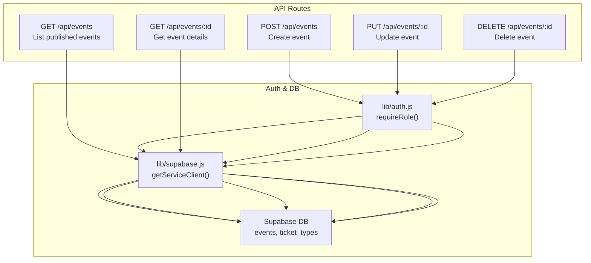
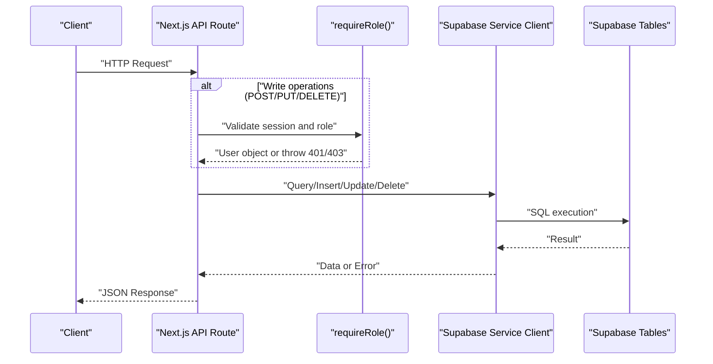
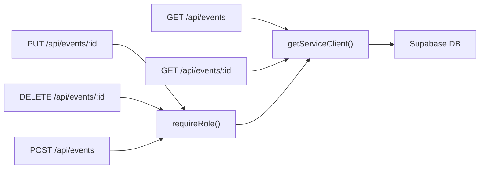
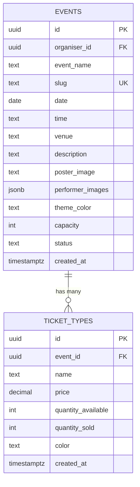

# Events API

<cite>
**Referenced Files in This Document**
- [pages/api/events/index.js](file://pages/api/events/index.js)
- [pages/api/events/[id].js](file://pages/api/events/[id].js)
- [lib/supabase.js](file://lib/supabase.js)
- [lib/auth.js](file://lib/auth.js)
- [supabase/schema.sql](file://supabase/schema.sql)
</cite>

## Table of Contents
1. [Introduction](#introduction)
2. [Project Structure](#project-structure)
3. [Core Components](#core-components)
4. [Architecture Overview](#architecture-overview)
5. [Detailed Component Analysis](#detailed-component-analysis)
6. [Dependency Analysis](#dependency-analysis)
7. [Performance Considerations](#performance-considerations)
8. [Troubleshooting Guide](#troubleshooting-guide)
9. [Conclusion](#conclusion)
10. [Appendices](#appendices)

## Introduction
This document describes the TicketFlow Events API endpoints that manage event data. It covers:
- GET /api/events for listing events (currently returns published events; filtering and pagination are not implemented yet)
- GET /api/events/[id] for retrieving a specific event with its ticket types
- PUT /api/events/[id] for updating an event (requires authentication and role authorization)
- DELETE /api/events/[id] for deleting an event (requires authentication and role authorization)

It also includes request/response schemas, validation rules, authorization requirements, error handling patterns, and examples of common frontend usage.

## Project Structure
The Events API is implemented as Next.js API routes under pages/api/events. The database schema is defined in supabase/schema.sql, and Supabase clients are configured in lib/supabase.js. Authentication and role checks are provided by lib/auth.js.

**Diagram sources**
- [pages/api/events/index.js:1-42](file://pages/api/events/index.js#L1-L42)
- [pages/api/events/[id].js:1-42](file://pages/api/events/[id].js#L1-L42)
- [lib/supabase.js:1-23](file://lib/supabase.js#L1-L23)
- [lib/auth.js:1-47](file://lib/auth.js#L1-L47)

**Section sources**
- [pages/api/events/index.js:1-42](file://pages/api/events/index.js#L1-L42)
- [pages/api/events/[id].js:1-42](file://pages/api/events/[id].js#L1-L42)
- [lib/supabase.js:1-23](file://lib/supabase.js#L1-L23)
- [lib/auth.js:1-47](file://lib/auth.js#L1-L47)
- [supabase/schema.sql:1-166](file://supabase/schema.sql#L1-L166)

## Core Components
- Event listing endpoint (GET /api/events): Returns all published events with their ticket types, ordered by date ascending. No filtering or pagination parameters are currently processed.
- Event detail endpoint (GET /api/events/[id]): Returns a single event by id along with its ticket types.
- Event update endpoint (PUT /api/events/[id]): Updates fields on an existing event. Requires authentication and either super_admin or organiser role. Certain fields are protected from client updates.
- Event deletion endpoint (DELETE /api/events/[id]): Deletes an event by id. Requires authentication and either super_admin or organiser role.

Authorization:
- GET endpoints are public for published events via Supabase Row Level Security policies.
- POST/PUT/DELETE require a valid session cookie and roles super_admin or organiser enforced by requireRole().

Database access:
- All endpoints use the service role client to bypass RLS where needed and ensure admin operations succeed.

**Section sources**
- [pages/api/events/index.js:1-42](file://pages/api/events/index.js#L1-L42)
- [pages/api/events/[id].js:1-42](file://pages/api/events/[id].js#L1-L42)
- [lib/auth.js:1-47](file://lib/auth.js#L1-L47)
- [lib/supabase.js:1-23](file://lib/supabase.js#L1-L23)
- [supabase/schema.sql:120-142](file://supabase/schema.sql#L120-L142)

## Architecture Overview
The Events API follows a simple serverless route pattern:
- Incoming HTTP requests hit Next.js API handlers.
- Handlers validate roles using requireRole() when necessary.
- Database operations are executed through Supabase’s service role client.
- Responses are returned as JSON objects with consistent shapes.

**Diagram sources**
- [pages/api/events/index.js:1-42](file://pages/api/events/index.js#L1-L42)
- [pages/api/events/[id].js:1-42](file://pages/api/events/[id].js#L1-L42)
- [lib/auth.js:1-47](file://lib/auth.js#L1-L47)
- [lib/supabase.js:1-23](file://lib/supabase.js#L1-L23)

## Detailed Component Analysis

### GET /api/events
- Purpose: List published events with associated ticket types.
- Authorization: Public (RLS allows reading published events).
- Query parameters: None currently supported. Filtering by status, date range, and search are not implemented. Pagination is not implemented.
- Sorting: Ordered by date ascending.
- Response shape: { events: Event[] }

Request example:
- GET /api/events

Response schema:
- events: array of Event objects

Event object fields (from schema):
- id: UUID
- organiser_id: UUID (nullable)
- event_name: TEXT
- slug: TEXT (unique)
- date: DATE
- time: TEXT (nullable)
- venue: TEXT
- description: TEXT (nullable)
- poster_image: TEXT (nullable)
- performer_images: JSONB (default [])
- theme_color: TEXT (default '#e94560')
- capacity: INTEGER (default 0)
- status: TEXT (enum: draft, published, sold_out, completed, cancelled)
- created_at: TIMESTAMPTZ

Ticket types included:
- id: UUID
- event_id: UUID (FK to events.id)
- name: TEXT
- price: DECIMAL(10,2)
- quantity_available: INTEGER
- quantity_sold: INTEGER
- color: TEXT
- created_at: TIMESTAMPTZ

Error handling:
- On database errors: 500 with { error: message }

Notes:
- Filtering by status, date range, and search are not implemented in this endpoint.
- Pagination is not implemented.

**Section sources**
- [pages/api/events/index.js:1-42](file://pages/api/events/index.js#L1-L42)
- [supabase/schema.sql:24-54](file://supabase/schema.sql#L24-L54)

### GET /api/events/[id]
- Purpose: Retrieve a specific event by id, including its ticket types.
- Authorization: Public (RLS allows reading published events; if the event is not published, it may be filtered out by policy).
- Path parameter: id (UUID)
- Response shape: { event: Event }

Request example:
- GET /api/events/{id}

Response schema:
- event: Event object with nested ticket_types array

Error handling:
- Not found: 404 with { error: "Event not found" }
- Database errors: 400 with { error: message }

**Section sources**
- [pages/api/events/[id].js:1-42](file://pages/api/events/[id].js#L1-L42)
- [supabase/schema.sql:24-54](file://supabase/schema.sql#L24-L54)

### PUT /api/events/[id]
- Purpose: Update an existing event.
- Authorization: Requires authenticated user with role super_admin or organiser.
- Path parameter: id (UUID)
- Allowed updates: Any event fields except id, organiser_id, and created_at (these are stripped before update). Slug values are normalized to lowercase with hyphens replacing spaces.
- Response shape: { event: Event }

Request body:
- Partial Event object containing fields to update

Validation:
- Protected fields (id, organiser_id, created_at) are removed server-side.
- Slug normalization applied if present.

Error handling:
- Unauthorized: 401 with { error: "Not authenticated" }
- Forbidden: 403 with { error: "Insufficient permissions" }
- Validation/database errors: 400 with { error: message }

**Section sources**
- [pages/api/events/[id].js:1-42](file://pages/api/events/[id].js#L1-L42)
- [lib/auth.js:1-47](file://lib/auth.js#L1-L47)

### DELETE /api/events/[id]
- Purpose: Delete an event by id.
- Authorization: Requires authenticated user with role super_admin or organiser.
- Path parameter: id (UUID)
- Response shape: { success: true }

Error handling:
- Unauthorized: 401 with { error: "Not authenticated" }
- Forbidden: 403 with { error: "Insufficient permissions" }
- Database errors: 400 with { error: message }

**Section sources**
- [pages/api/events/[id].js:1-42](file://pages/api/events/[id].js#L1-L42)
- [lib/auth.js:1-47](file://lib/auth.js#L1-L47)

### POST /api/events (for completeness)
- Purpose: Create a new event.
- Authorization: Requires authenticated user with role super_admin or organiser.
- Request body required fields: event_name, slug, date, venue. Others optional with defaults.
- Response shape: { event: Event }

Validation:
- Missing required fields return 400 with { error: "Missing required fields" }.
- Slug is normalized to lowercase with hyphens replacing spaces.
- Default values: theme_color defaults to '#e94560', capacity defaults to 0, status defaults to 'draft'.

Error handling:
- Unauthorized: 401 with { error: "Not authenticated" }
- Forbidden: 403 with { error: "Insufficient permissions" }
- Validation/database errors: 400 with { error: message }

**Section sources**
- [pages/api/events/index.js:1-42](file://pages/api/events/index.js#L1-L42)
- [lib/auth.js:1-47](file://lib/auth.js#L1-L47)

## Dependency Analysis
The Events API depends on:
- Supabase client configuration for service role access.
- Authentication utilities for session parsing and role enforcement.
- Database schema defining events and ticket_types tables and RLS policies.

**Diagram sources**
- [pages/api/events/index.js:1-42](file://pages/api/events/index.js#L1-L42)
- [pages/api/events/[id].js:1-42](file://pages/api/events/[id].js#L1-L42)
- [lib/supabase.js:1-23](file://lib/supabase.js#L1-L23)
- [lib/auth.js:1-47](file://lib/auth.js#L1-L47)

**Section sources**
- [pages/api/events/index.js:1-42](file://pages/api/events/index.js#L1-L42)
- [pages/api/events/[id].js:1-42](file://pages/api/events/[id].js#L1-L42)
- [lib/supabase.js:1-23](file://lib/supabase.js#L1-L23)
- [lib/auth.js:1-47](file://lib/auth.js#L1-L47)
- [supabase/schema.sql:120-142](file://supabase/schema.sql#L120-L142)

## Performance Considerations
- Current GET /api/events does not implement filtering or pagination, which can lead to large payloads if many events exist. Consider adding query parameters for status, date range, search, and pagination (limit/offset) to reduce payload size and improve response times.
- Ordering by date is already applied; additional indexes on frequently filtered columns (status, date) are present in the schema.
- Using the service role client bypasses RLS; ensure proper authorization checks remain in place for write operations.

[No sources needed since this section provides general guidance]

## Troubleshooting Guide
Common issues and resolutions:
- 401 Not authenticated: Ensure the request includes a valid tf_session cookie with a non-expired token.
- 403 Insufficient permissions: Verify the user’s role is super_admin or organiser for write operations.
- 404 Event not found: Check the id parameter and confirm the event exists and is accessible via RLS policies.
- 400 Bad request: Validate required fields for creation/update and ensure correct field names and types.
- 500 Internal server error: Indicates a database error; check Supabase logs and environment variables for service role key configuration.

**Section sources**
- [lib/auth.js:1-47](file://lib/auth.js#L1-L47)
- [pages/api/events/[id].js:1-42](file://pages/api/events/[id].js#L1-L42)
- [pages/api/events/index.js:1-42](file://pages/api/events/index.js#L1-L42)

## Conclusion
The Events API provides core CRUD operations for managing events, with public read access for published events and protected write operations requiring appropriate roles. While GET /api/events currently lacks filtering and pagination, the schema and architecture support future enhancements to meet frontend needs for efficient querying and browsing.

[No sources needed since this section summarizes without analyzing specific files]

## Appendices

### Data Model Overview

**Diagram sources**
- [supabase/schema.sql:24-54](file://supabase/schema.sql#L24-L54)

### Example Requests and Responses

- Create event (POST /api/events)
  - Request body fields: event_name, slug, date, venue, plus optional fields like time, description, poster_image, theme_color, capacity.
  - Success response: { event: Event }
  - Errors: 400 for missing fields, 401/403 for auth issues

- Get event details (GET /api/events/[id])
  - Success response: { event: Event }
  - Errors: 404 if not found, 400 for DB errors

- Update event (PUT /api/events/[id])
  - Request body: partial Event object
  - Success response: { event: Event }
  - Errors: 401/403 for auth, 400 for DB/validation errors

- Delete event (DELETE /api/events/[id])
  - Success response: { success: true }
  - Errors: 401/403 for auth, 400 for DB errors

Note: Filtering and pagination are not implemented for GET /api/events. Future enhancements should add query parameters such as status, dateFrom, dateTo, search, limit, offset.

**Section sources**
- [pages/api/events/index.js:1-42](file://pages/api/events/index.js#L1-L42)
- [pages/api/events/[id].js:1-42](file://pages/api/events/[id].js#L1-L42)
- [supabase/schema.sql:24-54](file://supabase/schema.sql#L24-L54)