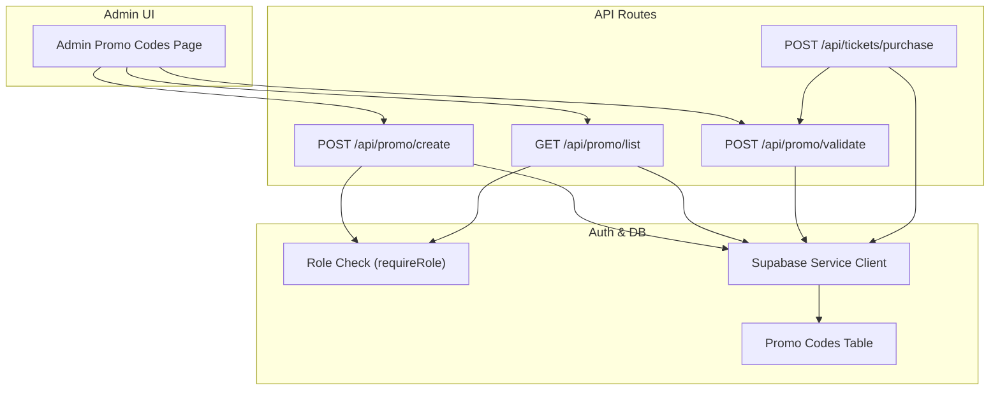
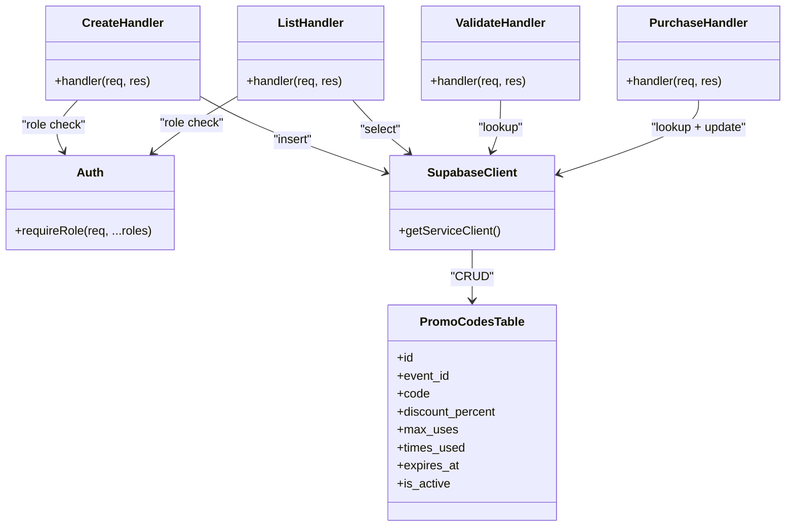
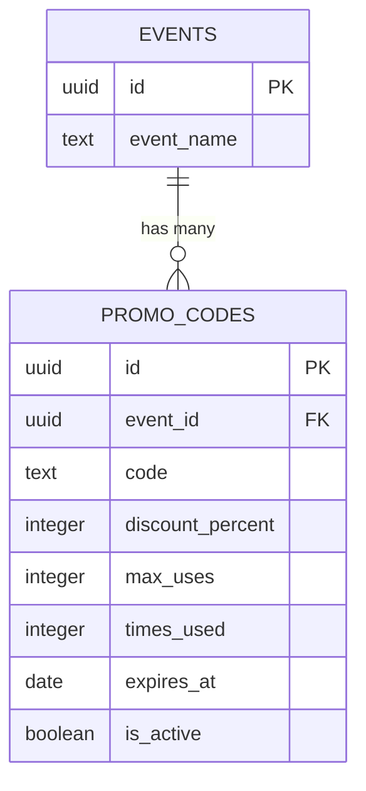

# Promotions API

<cite>
**Referenced Files in This Document**
- [create.js](file://pages/api/promo/create.js)
- [list.js](file://pages/api/promo/list.js)
- [validate.js](file://pages/api/promo/validate.js)
- [purchase.js](file://pages/api/tickets/purchase.js)
- [auth.js](file://lib/auth.js)
- [supabase.js](file://lib/supabase.js)
- [schema.sql](file://supabase/schema.sql)
- [promo-codes.js](file://pages/admin/promo-codes.js)
</cite>

## Table of Contents
1. [Introduction](#introduction)
2. [Project Structure](#project-structure)
3. [Core Components](#core-components)
4. [Architecture Overview](#architecture-overview)
5. [Detailed Component Analysis](#detailed-component-analysis)
6. [Dependency Analysis](#dependency-analysis)
7. [Performance Considerations](#performance-considerations)
8. [Troubleshooting Guide](#troubleshooting-guide)
9. [Conclusion](#conclusion)
10. [Appendices](#appendices)

## Introduction
This document provides comprehensive API documentation for TicketFlow’s promotional code management endpoints. It covers:
- Creating new promotional codes with discount configurations, usage limits, and expiration dates
- Listing available promotional codes per event
- Validating promotional codes during ticket purchase, including discount calculations and usage validation
- Lifecycle management, validation rules, error handling, and integration patterns with the ticket purchase flow

The APIs are implemented as Next.js serverless routes backed by Supabase. Authentication is enforced via role-based checks for administrative endpoints, while validation is designed to be used by both admin flows and the public ticket purchase process.

## Project Structure
Promotional code functionality spans three API routes and integrates with the ticket purchase flow:
- POST /api/promo/create — Create a new promo code (admin-only)
- GET /api/promo/list — List promo codes for an event (admin-only)
- POST /api/promo/validate — Validate a promo code (public-facing)
- Integration point: POST /api/tickets/purchase applies promo discounts during checkout



**Diagram sources**
- [create.js:1-23](file://pages/api/promo/create.js#L1-L23)
- [list.js:1-15](file://pages/api/promo/list.js#L1-L15)
- [validate.js:1-27](file://pages/api/promo/validate.js#L1-L27)
- [purchase.js:1-123](file://pages/api/tickets/purchase.js#L1-L123)
- [auth.js:1-47](file://lib/auth.js#L1-L47)
- [supabase.js:1-23](file://lib/supabase.js#L1-L23)
- [schema.sql:105-117](file://supabase/schema.sql#L105-L117)

**Section sources**
- [create.js:1-23](file://pages/api/promo/create.js#L1-L23)
- [list.js:1-15](file://pages/api/promo/list.js#L1-L15)
- [validate.js:1-27](file://pages/api/promo/validate.js#L1-L27)
- [purchase.js:1-123](file://pages/api/tickets/purchase.js#L1-L123)
- [auth.js:1-47](file://lib/auth.js#L1-L47)
- [supabase.js:1-23](file://lib/supabase.js#L1-L23)
- [schema.sql:105-117](file://supabase/schema.sql#L105-L117)

## Core Components
- POST /api/promo/create
  - Purpose: Create a new promotional code for an event
  - Access: Requires super_admin or organiser role
  - Inputs: event_id, code, discount_percent, max_uses (optional), expires_at (optional)
  - Behavior: Normalizes code to uppercase, sets default times_used to 0 and is_active to true, persists to promo_codes table
  - Outputs: Created promo object
  - Errors: Missing fields, database errors, unauthorized access

- GET /api/promo/list
  - Purpose: Retrieve all promo codes for a given event
  - Access: Requires super_admin or organiser role
  - Inputs: eventId query parameter
  - Behavior: Returns promo codes ordered by creation time descending
  - Outputs: Array of promo codes
  - Errors: Missing eventId, unauthorized access

- POST /api/promo/validate
  - Purpose: Validate a promo code before applying it to a purchase
  - Access: Public (no authentication required)
  - Inputs: code, eventId
  - Behavior: Checks existence, active status, usage limit, and expiration; returns discount details if valid
  - Outputs: Validation result with discount info
  - Errors: Invalid code, expired, usage limit reached, server errors

- Integration with POST /api/tickets/purchase
  - Applies promo discount inline when provided
  - Increments times_used atomically on successful application
  - Computes discounted price and passes discount metadata through payment session

**Section sources**
- [create.js:1-23](file://pages/api/promo/create.js#L1-L23)
- [list.js:1-15](file://pages/api/promo/list.js#L1-L15)
- [validate.js:1-27](file://pages/api/promo/validate.js#L1-L27)
- [purchase.js:27-41](file://pages/api/tickets/purchase.js#L27-L41)

## Architecture Overview
The promotions system follows a clear separation of concerns:
- Admin endpoints enforce role-based authorization using requireRole
- Database interactions use a service-role client for privileged operations
- Validation endpoint is intentionally public to support pre-checks during checkout
- The purchase flow integrates promo logic directly, ensuring consistent discount application and usage tracking

```mermaid
sequenceDiagram
participant Admin as "Admin UI"
participant Create as "POST /api/promo/create"
participant List as "GET /api/promo/list"
participant Validate as "POST /api/promo/validate"
participant Purchase as "POST /api/tickets/purchase"
participant Auth as "requireRole"
participant DB as "Supabase Service Client"
participant Table as "promo_codes"
Admin->>Create : Create promo code
Create->>Auth : Verify role (super_admin|organiser)
Auth-->>Create : Authorized
Create->>DB : Insert promo_code
DB-->>Create : Created promo
Create-->>Admin : { promo }
Admin->>List : Fetch promos for event
List->>Auth : Verify role
Auth-->>List : Authorized
List->>DB : Select promos by event_id
DB-->>List : Array of promos
List-->>Admin : { promos }
Admin->>Validate : Pre-validate code
Validate->>DB : Lookup active promo by code+event
DB-->>Validate : Promo or null
Validate-->>Admin : { valid, promo? }
Admin->>Purchase : Submit purchase with promoCode
Purchase->>DB : Validate promo inline
DB-->>Purchase : Promo details
Purchase->>DB : Increment times_used
DB-->>Purchase : Updated counts
Purchase-->>Admin : Checkout URL or success
```

**Diagram sources**
- [create.js:1-23](file://pages/api/promo/create.js#L1-L23)
- [list.js:1-15](file://pages/api/promo/list.js#L1-L15)
- [validate.js:1-27](file://pages/api/promo/validate.js#L1-L27)
- [purchase.js:27-41](file://pages/api/tickets/purchase.js#L27-L41)
- [auth.js:38-46](file://lib/auth.js#L38-L46)
- [supabase.js:15-23](file://lib/supabase.js#L15-L23)
- [schema.sql:105-117](file://supabase/schema.sql#L105-L117)

## Detailed Component Analysis

### POST /api/promo/create
- Authorization: Enforced via requireRole with allowed roles super_admin and organiser
- Input validation: Ensures event_id, code, and discount_percent are present
- Data normalization: Code is uppercased and trimmed; discount_percent cast to number; max_uses defaults to 100 if omitted; times_used initialized to 0; is_active set to true
- Persistence: Inserts into promo_codes table and returns the created record
- Error handling: Returns 400 for missing fields or database errors; catches exceptions and returns appropriate status

Request
- Method: POST
- Path: /api/promo/create
- Headers: Content-Type: application/json
- Body:
  - event_id: string (required)
  - code: string (required; normalized to uppercase)
  - discount_percent: number (required; 1–100 enforced by schema)
  - max_uses: number (optional; defaults to 100)
  - expires_at: date string (optional)

Response
- Success (201): { promo: object }
- Error (400): { error: string }
- Error (401/403): { error: string } for unauthorized/insufficient permissions
- Error (500): { error: string } for unexpected failures

Validation Rules
- Required fields: event_id, code, discount_percent
- Unique constraint: (event_id, code) enforced at DB level
- Discount range: 1–100 enforced by schema

Error Handling
- Missing fields return 400
- Database insertion errors return 400 with message
- Unauthorized requests throw with 401 or 403

Integration Notes
- Admin UI calls this endpoint to create codes and refresh the list afterward

**Section sources**
- [create.js:1-23](file://pages/api/promo/create.js#L1-L23)
- [auth.js:38-46](file://lib/auth.js#L38-L46)
- [schema.sql:105-117](file://supabase/schema.sql#L105-L117)

### GET /api/promo/list
- Authorization: Enforced via requireRole with allowed roles super_admin and organiser
- Query parameters: eventId (required)
- Behavior: Retrieves all promo codes for the specified event, ordered by created_at descending
- Response: { promos: array }

Request
- Method: GET
- Path: /api/promo/list
- Query:
  - eventId: string (required)

Response
- Success (200): { promos: array }
- Error (400): { error: string } for missing eventId
- Error (401/403): { error: string } for unauthorized/insufficient permissions
- Error (500): { error: string } for unexpected failures

Usage Pattern
- Admin UI selects an event and loads associated promo codes to display and manage

**Section sources**
- [list.js:1-15](file://pages/api/promo/list.js#L1-L15)
- [auth.js:38-46](file://lib/auth.js#L38-L46)

### POST /api/promo/validate
- Authorization: None (public endpoint)
- Purpose: Validate a promo code and return discount details without modifying state
- Inputs: code, eventId
- Validation Logic:
  - Normalize code to uppercase and trim
  - Find active promo matching event_id and code
  - Ensure times_used < max_uses
  - Ensure not expired (if expires_at is set)
- Response:
  - If valid: { valid: true, promo: { code, discount_percent } }
  - If invalid: { valid: false, error: string }

Request
- Method: POST
- Path: /api/promo/validate
- Body:
  - code: string (required)
  - eventId: string (required)

Response
- Success (200): { valid: boolean, promo?: object, error?: string }
- Error (500): { error: string } for unexpected failures

Validation Rules
- Active promo must exist for the event
- Usage limit must not be reached
- Expiration must not have passed

Error Handling
- Returns explicit messages for invalid, expired, and usage-limited codes
- Catches unexpected errors and returns 500

Integration Notes
- Can be used by the frontend to provide immediate feedback before purchase submission
- Purchase flow performs its own validation and increments usage atomically

**Section sources**
- [validate.js:1-27](file://pages/api/promo/validate.js#L1-L27)

### Integration with POST /api/tickets/purchase
- Promo application:
  - If promoCode is provided, lookup active promo for the event
  - Validate usage limit and expiration inline
  - Apply discount_percent to unit price
  - Increment times_used upon successful application
- Discount calculation:
  - discountedPrice = unitPrice * (1 - discount_percent / 100)
- Payment flow:
  - For Stripe: includes discount in metadata and line item amount
  - For other methods: records discounted amount in payments

Request
- Method: POST
- Path: /api/tickets/purchase
- Body includes:
  - eventId, ticketTypeId, quantity, buyerName, buyerEmail, buyerPhone (optional), paymentMethod, promoCode (optional)

Response
- Success (200):
  - Stripe: { checkoutUrl: string }
  - Other methods: { success: true, tokens: array, orderId: string }
- Error (400/404/500): { error: string }

Lifecycle Management
- Promo codes are created via admin endpoints
- Validation ensures correctness before purchase
- Purchase increments usage atomically to prevent overuse
- Expiration and activity flags control availability

**Section sources**
- [purchase.js:27-41](file://pages/api/tickets/purchase.js#L27-L41)
- [purchase.js:43-76](file://pages/api/tickets/purchase.js#L43-L76)
- [purchase.js:78-117](file://pages/api/tickets/purchase.js#L78-L117)

## Dependency Analysis
Key dependencies and relationships:
- All promo endpoints depend on Supabase service client for privileged operations
- Admin endpoints rely on requireRole for authorization
- Purchase flow depends on promo validation and updates times_used
- Schema enforces constraints on discount_percent and uniqueness of (event_id, code)



**Diagram sources**
- [create.js:1-23](file://pages/api/promo/create.js#L1-L23)
- [list.js:1-15](file://pages/api/promo/list.js#L1-L15)
- [validate.js:1-27](file://pages/api/promo/validate.js#L1-L27)
- [purchase.js:1-123](file://pages/api/tickets/purchase.js#L1-L123)
- [auth.js:38-46](file://lib/auth.js#L38-L46)
- [supabase.js:15-23](file://lib/supabase.js#L15-L23)
- [schema.sql:105-117](file://supabase/schema.sql#L105-L117)

**Section sources**
- [auth.js:38-46](file://lib/auth.js#L38-L46)
- [supabase.js:15-23](file://lib/supabase.js#L15-L23)
- [schema.sql:105-117](file://supabase/schema.sql#L105-L117)

## Performance Considerations
- Use service-role client only where necessary; avoid unnecessary reads/writes
- Keep promo lookups scoped by event_id and code to leverage unique constraints
- Avoid redundant validations; prefer single authoritative path (purchase flow) for incrementing times_used
- Consider caching frequently accessed promo lists in the admin UI to reduce repeated queries

[No sources needed since this section provides general guidance]

## Troubleshooting Guide
Common issues and resolutions:
- Missing required fields: Ensure event_id, code, and discount_percent are provided for create; eventId for list; code and eventId for validate
- Unauthorized access: Confirm user has super_admin or organiser role for admin endpoints
- Invalid promo code: Verify code exists, is active, matches event_id, and is not expired
- Usage limit reached: times_used equals or exceeds max_uses; adjust limits or allow reuse if appropriate
- Expired promo code: expires_at is in the past; extend expiration or create a new code
- Database errors: Check Supabase connectivity and environment variables; ensure service role key is configured

**Section sources**
- [create.js:9-21](file://pages/api/promo/create.js#L9-L21)
- [list.js:8-13](file://pages/api/promo/list.js#L8-L13)
- [validate.js:6-25](file://pages/api/promo/validate.js#L6-L25)
- [auth.js:38-46](file://lib/auth.js#L38-L46)
- [supabase.js:1-23](file://lib/supabase.js#L1-L23)

## Conclusion
TicketFlow’s promotional code system provides robust creation, listing, and validation capabilities integrated seamlessly into the ticket purchase workflow. Role-based security protects administrative operations, while public validation supports user-friendly pre-checks. Clear validation rules and error responses ensure predictable behavior across the lifecycle of promo codes.

[No sources needed since this section summarizes without analyzing specific files]

## Appendices

### Data Model: Promo Codes


**Diagram sources**
- [schema.sql:105-117](file://supabase/schema.sql#L105-L117)
- [schema.sql:24-40](file://supabase/schema.sql#L24-L40)

### Admin UI Integration
The admin page demonstrates typical usage patterns:
- Fetch events and existing promos
- Create new promo codes via POST /api/promo/create
- Refresh promo list via GET /api/promo/list
- Display usage metrics and expiration status

**Section sources**
- [promo-codes.js:1-106](file://pages/admin/promo-codes.js#L1-L106)