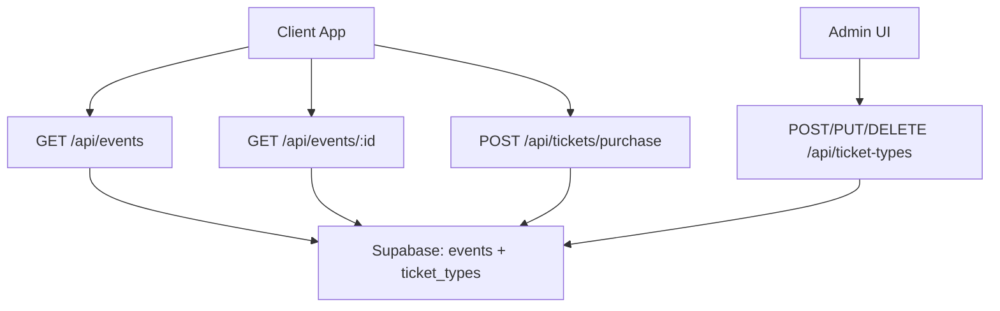
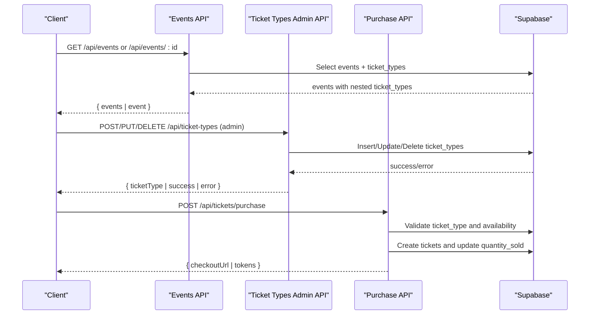
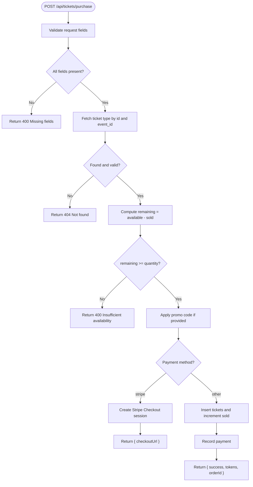
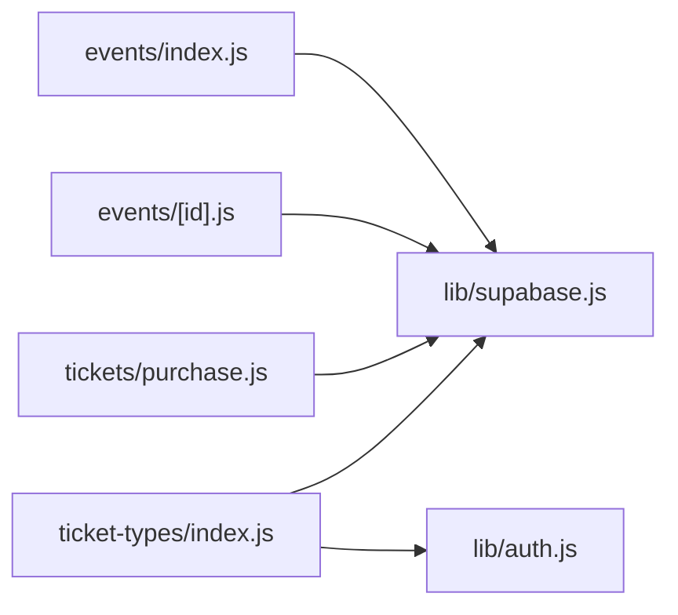

# Ticket Types API

<cite>
**Referenced Files in This Document**
- [pages/api/ticket-types/index.js](file://pages/api/ticket-types/index.js)
- [pages/api/events/index.js](file://pages/api/events/index.js)
- [pages/api/events/[id].js](file://pages/api/events/[id].js)
- [pages/api/tickets/purchase.js](file://pages/api/tickets/purchase.js)
- [lib/supabase.js](file://lib/supabase.js)
- [supabase/schema.sql](file://supabase/schema.sql)
</cite>

## Table of Contents
1. [Introduction](#introduction)
2. [Project Structure](#project-structure)
3. [Core Components](#core-components)
4. [Architecture Overview](#architecture-overview)
5. [Detailed Component Analysis](#detailed-component-analysis)
6. [Dependency Analysis](#dependency-analysis)
7. [Performance Considerations](#performance-considerations)
8. [Troubleshooting Guide](#troubleshooting-guide)
9. [Conclusion](#conclusion)

## Introduction
This document provides API documentation for TicketFlow’s ticket type management endpoints with a focus on retrieving available ticket types for events, including pricing, availability status, and purchase restrictions. It explains how clients can filter by event ID, how real-time availability is reflected during purchases, and how to integrate ticket type data into the ticket purchase flow. It also covers error handling patterns and caching strategies for high-traffic events.

Note: The current GET endpoint for listing ticket types is implemented via the Events API, which returns events along with their associated ticket types. A dedicated GET /api/ticket-types endpoint is not present; instead, POST/PUT/DELETE are supported for administrative operations.

## Project Structure
The relevant parts of the codebase include:
- Event APIs that return events with nested ticket types
- Ticket purchase API that validates ticket types and updates availability
- Supabase client utilities for server-side access
- Database schema defining ticket types and relationships

**Diagram sources**
- [pages/api/events/index.js:1-42](file://pages/api/events/index.js#L1-L42)
- [pages/api/events/[id].js:1-42](file://pages/api/events/[id].js#L1-L42)
- [pages/api/tickets/purchase.js:1-123](file://pages/api/tickets/purchase.js#L1-L123)
- [pages/api/ticket-types/index.js:1-49](file://pages/api/ticket-types/index.js#L1-L49)
- [supabase/schema.sql:44-54](file://supabase/schema.sql#L44-L54)

**Section sources**
- [pages/api/events/index.js:1-42](file://pages/api/events/index.js#L1-L42)
- [pages/api/events/[id].js:1-42](file://pages/api/events/[id].js#L1-L42)
- [pages/api/ticket-types/index.js:1-49](file://pages/api/ticket-types/index.js#L1-L49)
- [pages/api/tickets/purchase.js:1-123](file://pages/api/tickets/purchase.js#L1-L123)
- [supabase/schema.sql:44-54](file://supabase/schema.sql#L44-L54)

## Core Components
- Events API (list): Returns published events with nested ticket types, enabling clients to discover available ticket types per event.
- Events API (by id): Returns a single event with all its ticket types.
- Ticket Purchase API: Validates ticket type existence, checks availability, applies promo discounts, creates tickets, and updates sold counts.
- Ticket Types Admin API: Supports creating, updating, and deleting ticket types (requires authentication).
- Supabase Client: Provides service-role client for server-side database access.

Key responsibilities:
- Expose ticket type metadata (name, price, color) and availability (quantity_available, quantity_sold) through event endpoints.
- Enforce availability constraints at purchase time.
- Maintain ticket type records via admin endpoints.

**Section sources**
- [pages/api/events/index.js:1-42](file://pages/api/events/index.js#L1-L42)
- [pages/api/events/[id].js:1-42](file://pages/api/events/[id].js#L1-L42)
- [pages/api/tickets/purchase.js:1-123](file://pages/api/tickets/purchase.js#L1-L123)
- [pages/api/ticket-types/index.js:1-49](file://pages/api/ticket-types/index.js#L1-L49)
- [lib/supabase.js:1-23](file://lib/supabase.js#L1-L23)

## Architecture Overview
The system uses Next.js API routes backed by Supabase. Public clients retrieve ticket types via event endpoints. Administrative clients manage ticket types directly. Purchases validate availability and update state atomically.

**Diagram sources**
- [pages/api/events/index.js:1-42](file://pages/api/events/index.js#L1-L42)
- [pages/api/events/[id].js:1-42](file://pages/api/events/[id].js#L1-L42)
- [pages/api/ticket-types/index.js:1-49](file://pages/api/ticket-types/index.js#L1-L49)
- [pages/api/tickets/purchase.js:1-123](file://pages/api/tickets/purchase.js#L1-L123)

## Detailed Component Analysis

### GET /api/events (List Published Events with Ticket Types)
- Purpose: Retrieve published events with their ticket types for discovery and selection.
- Method: GET
- Response fields:
  - events: array of event objects
  - Each event includes ticket_types array with fields: id, name, price, quantity_available, quantity_sold, color
- Filtering:
  - Only published events are returned by default.
  - Clients can filter locally by event_id if needed after fetching.
- Availability:
  - Real-time availability is derived from quantity_available and quantity_sold.
  - Remaining = quantity_available - quantity_sold.

Request example:
- GET /api/events

Response example:
- { events: [ { id, slug, date, venue, description, poster_image, theme_color, capacity, status, ticket_types: [ { id, name, price, quantity_available, quantity_sold, color }, ... ] }, ... ] }

Error handling:
- On database errors, returns 500 with an error message.

**Section sources**
- [pages/api/events/index.js:1-42](file://pages/api/events/index.js#L1-L42)
- [supabase/schema.sql:44-54](file://supabase/schema.sql#L44-L54)

### GET /api/events/:id (Single Event with Ticket Types)
- Purpose: Retrieve a specific event and its full set of ticket types.
- Method: GET
- Path parameter: id (event UUID)
- Response fields:
  - event: object containing event details and ticket_types array
- Availability:
  - Derived from ticket_types.quantity_available and ticket_types.quantity_sold.

Request example:
- GET /api/events/{eventId}

Response example:
- { event: { id, slug, date, venue, description, poster_image, theme_color, capacity, status, ticket_types: [ { id, name, price, quantity_available, quantity_sold, color }, ... ] } }

Error handling:
- 404 if event not found.
- 500 on database errors.

**Section sources**
- [pages/api/events/[id].js:1-42](file://pages/api/events/[id].js#L1-L42)
- [supabase/schema.sql:44-54](file://supabase/schema.sql#L44-L54)

### POST /api/tickets/purchase (Validate and Purchase Tickets)
- Purpose: Validate ticket type availability, apply promo codes, create tickets, and update sold counts.
- Method: POST
- Request body fields:
  - eventId: UUID of the event
  - ticketTypeId: UUID of the ticket type
  - quantity: number of tickets
  - buyerName: string
  - buyerEmail: string
  - buyerPhone: optional string
  - paymentMethod: string (e.g., stripe, ecocash)
  - promoCode: optional string
- Validation:
  - Ensures required fields are present.
  - Verifies ticket type exists and belongs to the specified event.
  - Checks remaining availability (quantity_available - quantity_sold >= quantity).
- Promo code:
  - If provided and valid, applies discount and increments usage count.
- Payment methods:
  - Stripe: returns checkout URL with metadata including tokens and discount.
  - Other methods: creates tickets immediately and records payment.
- Response:
  - For Stripe: { checkoutUrl }
  - For others: { success: true, tokens: [uuid,...], orderId: uuid }

Error handling:
- 400 for missing fields or insufficient availability.
- 404 if ticket type not found.
- 500 on internal errors.

**Diagram sources**
- [pages/api/tickets/purchase.js:1-123](file://pages/api/tickets/purchase.js#L1-L123)

**Section sources**
- [pages/api/tickets/purchase.js:1-123](file://pages/api/tickets/purchase.js#L1-L123)

### POST /api/ticket-types (Create Ticket Type)
- Purpose: Create a new ticket type for an event (admin only).
- Method: POST
- Authentication: Requires super_admin or organiser role.
- Request body fields:
  - event_id: UUID
  - name: string
  - price: number
  - quantity_available: integer
  - color: optional string (defaults to #e94560)
- Response:
  - 201 with { ticketType: { id, event_id, name, price, quantity_available, quantity_sold: 0, color } }
- Error handling:
  - 400 for missing required fields or database errors.
  - 401/403 for unauthorized requests.

**Section sources**
- [pages/api/ticket-types/index.js:1-49](file://pages/api/ticket-types/index.js#L1-L49)
- [lib/auth.js:1-47](file://lib/auth.js#L1-L47)

### PUT /api/ticket-types (Update Ticket Type)
- Purpose: Update an existing ticket type (admin only).
- Method: PUT
- Authentication: Requires super_admin or organiser role.
- Request body fields:
  - id: UUID (required)
  - Any subset of updatable fields (name, price, quantity_available, color)
- Response:
  - 200 with { ticketType: updated object }
- Error handling:
  - 400 for missing id or database errors.
  - 401/403 for unauthorized requests.

**Section sources**
- [pages/api/ticket-types/index.js:1-49](file://pages/api/ticket-types/index.js#L1-L49)
- [lib/auth.js:1-47](file://lib/auth.js#L1-L47)

### DELETE /api/ticket-types (Delete Ticket Type)
- Purpose: Delete a ticket type (admin only).
- Method: DELETE
- Authentication: Requires super_admin or organiser role.
- Request body fields:
  - id: UUID
- Response:
  - 200 with { success: true }
- Error handling:
  - 400 for database errors.
  - 401/403 for unauthorized requests.

**Section sources**
- [pages/api/ticket-types/index.js:1-49](file://pages/api/ticket-types/index.js#L1-L49)
- [lib/auth.js:1-47](file://lib/auth.js#L1-L47)

### Data Model: Ticket Types
- Table: ticket_types
- Fields:
  - id: UUID primary key
  - event_id: UUID foreign key to events
  - name: text
  - price: decimal(10,2)
  - quantity_available: integer
  - quantity_sold: integer
  - color: text
  - created_at: timestamp

Relationships:
- One-to-many with tickets (each ticket references a ticket type).
- Access controlled by RLS policy allowing public read when the parent event is published.

**Section sources**
- [supabase/schema.sql:44-54](file://supabase/schema.sql#L44-L54)
- [supabase/schema.sql:134-139](file://supabase/schema.sql#L134-L139)

## Dependency Analysis
- Events API depends on Supabase service client to query events and join ticket_types.
- Ticket Purchase API depends on Supabase to validate ticket types, check availability, create tickets, and update sold counts.
- Ticket Types Admin API depends on Supabase and auth middleware for role enforcement.
- Supabase client configuration centralizes environment variables for URL and keys.

**Diagram sources**
- [pages/api/events/index.js:1-42](file://pages/api/events/index.js#L1-L42)
- [pages/api/events/[id].js:1-42](file://pages/api/events/[id].js#L1-L42)
- [pages/api/tickets/purchase.js:1-123](file://pages/api/tickets/purchase.js#L1-L123)
- [pages/api/ticket-types/index.js:1-49](file://pages/api/ticket-types/index.js#L1-L49)
- [lib/supabase.js:1-23](file://lib/supabase.js#L1-L23)
- [lib/auth.js:1-47](file://lib/auth.js#L1-L47)

**Section sources**
- [pages/api/events/index.js:1-42](file://pages/api/events/index.js#L1-L42)
- [pages/api/events/[id].js:1-42](file://pages/api/events/[id].js#L1-L42)
- [pages/api/tickets/purchase.js:1-123](file://pages/api/tickets/purchase.js#L1-L123)
- [pages/api/ticket-types/index.js:1-49](file://pages/api/ticket-types/index.js#L1-L49)
- [lib/supabase.js:1-23](file://lib/supabase.js#L1-L23)
- [lib/auth.js:1-47](file://lib/auth.js#L1-L47)

## Performance Considerations
- Caching strategies:
  - Cache event listings with ticket types at CDN or edge layer for short TTL (e.g., 1–5 minutes) to reduce database load during high traffic.
  - Use cache-busting or invalidation on ticket type updates (POST/PUT/DELETE) to keep availability fresh.
- Query optimization:
  - Prefer fetching a single event by id when displaying a specific event page to minimize payload size.
  - Leverage Supabase indexes defined in schema for fast lookups (event status, slug, etc.).
- Concurrency:
  - Purchase endpoint performs availability checks and updates in sequence; consider transactional guarantees at the database level if needed to prevent race conditions under heavy load.
- Frontend optimizations:
  - Debounce rapid user interactions (e.g., quantity changes) before calling purchase.
  - Display optimistic UI states while awaiting server responses.

[No sources needed since this section provides general guidance]

## Troubleshooting Guide
Common errors and resolutions:
- Missing required fields:
  - Ensure eventId, ticketTypeId, quantity, buyerName, and buyerEmail are provided in purchase requests.
- Ticket type not found:
  - Verify ticketTypeId matches an existing ticket type for the given eventId.
- Insufficient availability:
  - Check quantity_available vs quantity_sold; ensure requested quantity does not exceed remaining stock.
- Unauthorized access:
  - Admin endpoints require super_admin or organiser roles; verify session token and cookie headers.
- Database errors:
  - Review Supabase logs and ensure environment variables (URL, anon key, service role key) are correctly configured.

**Section sources**
- [pages/api/tickets/purchase.js:1-123](file://pages/api/tickets/purchase.js#L1-L123)
- [pages/api/ticket-types/index.js:1-49](file://pages/api/ticket-types/index.js#L1-L49)
- [lib/auth.js:1-47](file://lib/auth.js#L1-L47)
- [lib/supabase.js:1-23](file://lib/supabase.js#L1-L23)

## Conclusion
TicketFlow exposes ticket type information primarily through the Events API, returning nested ticket types for each published event. The purchase endpoint enforces availability and integrates with payment providers, ensuring accurate real-time updates. Administrative endpoints allow managing ticket types securely. For high-traffic scenarios, implement caching and careful invalidation to balance freshness and performance.

[No sources needed since this section summarizes without analyzing specific files]