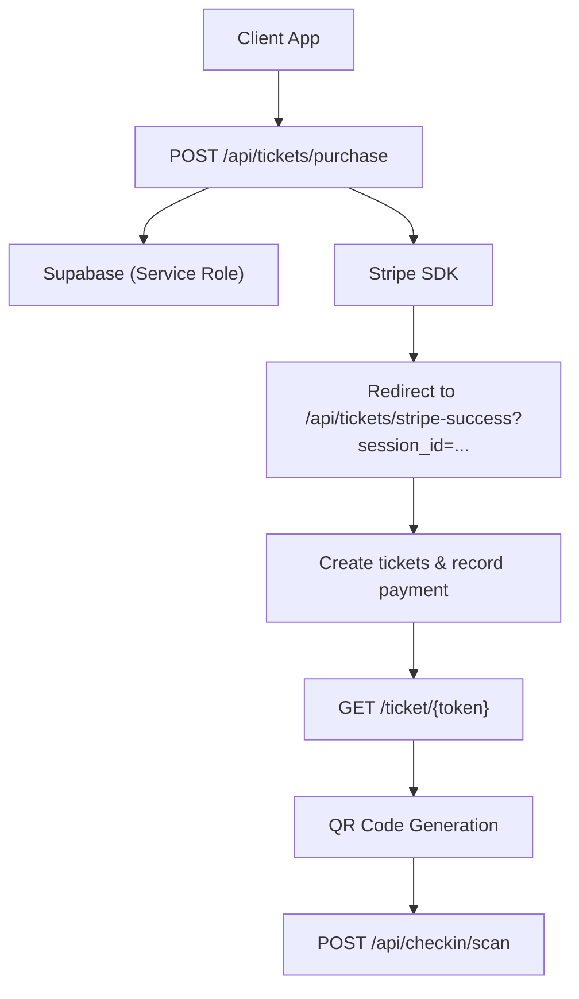
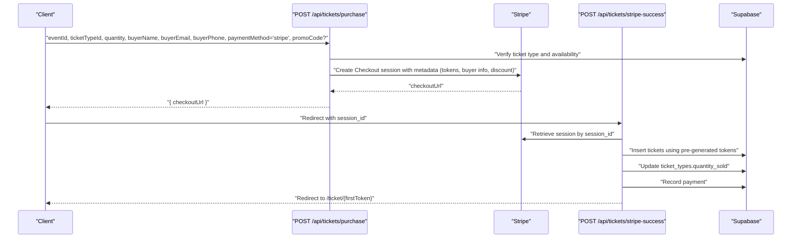
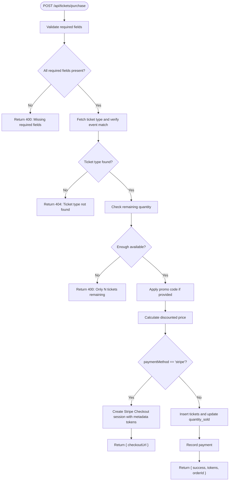
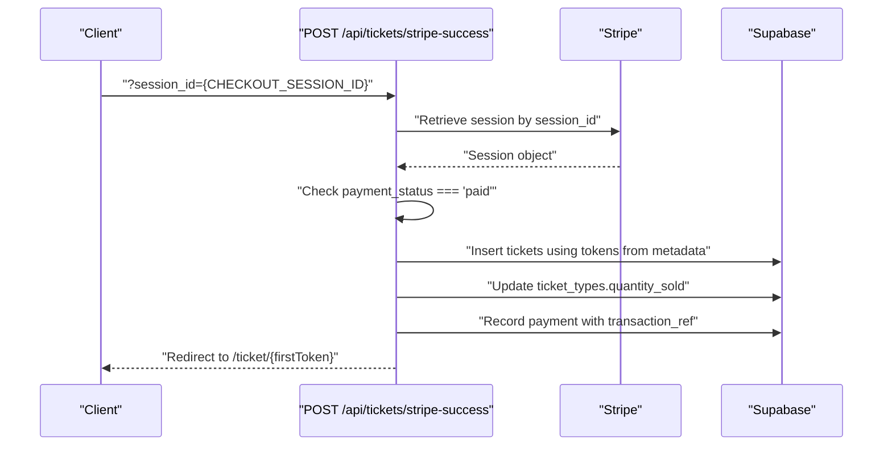
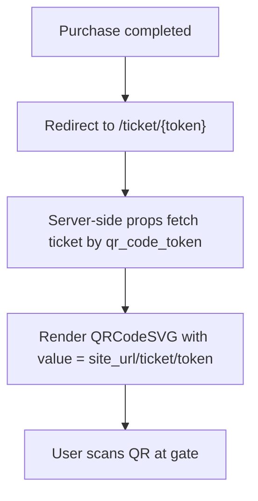
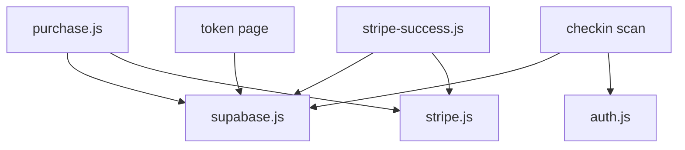

# Tickets API

<cite>
**Referenced Files in This Document**
- [purchase.js](file://pages/api/tickets/purchase.js)
- [stripe-success.js](file://pages/api/tickets/stripe-success.js)
- [stripe.js](file://lib/stripe.js)
- [supabase.js](file://lib/supabase.js)
- [schema.sql](file://supabase/schema.sql)
- [token page](file://pages/ticket/[token].js)
- [checkin scan](file://pages/api/checkin/scan.js)
- [auth.js](file://lib/auth.js)
</cite>

## Table of Contents
1. [Introduction](#introduction)
2. [Project Structure](#project-structure)
3. [Core Components](#core-components)
4. [Architecture Overview](#architecture-overview)
5. [Detailed Component Analysis](#detailed-component-analysis)
6. [Dependency Analysis](#dependency-analysis)
7. [Performance Considerations](#performance-considerations)
8. [Troubleshooting Guide](#troubleshooting-guide)
9. [Conclusion](#conclusion)
10. [Appendices](#appendices)

## Introduction
This document provides comprehensive API documentation for TicketFlow’s ticket processing endpoints, focusing on:
- POST /api/tickets/purchase: Initiating ticket purchases with Stripe integration and alternative payment methods
- POST /api/tickets/stripe-success: Handling Stripe payment confirmation and generating tickets
It also covers payment flow examples, webhook handling patterns, error responses, inventory management, QR code generation, security considerations, transaction validation, and idempotency recommendations.

## Project Structure
The ticket purchase and confirmation flows are implemented as Next.js API routes under pages/api/tickets. Database interactions use Supabase via a service role client. Stripe is integrated through the official SDK. QR codes are generated on the client side using a React component when rendering the ticket page.

**Diagram sources**
- [purchase.js:1-123](file://pages/api/tickets/purchase.js#L1-L123)
- [stripe-success.js:1-55](file://pages/api/tickets/stripe-success.js#L1-L55)
- [token page:1-257](file://pages/ticket/[token].js#L1-L257)
- [checkin scan:1-44](file://pages/api/checkin/scan.js#L1-L44)

**Section sources**
- [purchase.js:1-123](file://pages/api/tickets/purchase.js#L1-L123)
- [stripe-success.js:1-55](file://pages/api/tickets/stripe-success.js#L1-L55)
- [supabase.js:1-23](file://lib/supabase.js#L1-L23)
- [schema.sql:45-117](file://supabase/schema.sql#L45-L117)

## Core Components
- POST /api/tickets/purchase
  - Validates required fields
  - Verifies ticket type availability
  - Applies promo codes if provided
  - Creates Stripe Checkout session for card payments or creates tickets immediately for other methods
  - Returns checkout URL or tokens/orderId
- POST /api/tickets/stripe-success
  - Retrieves Stripe session by session_id
  - Confirms payment status
  - Generates tickets from pre-created tokens stored in metadata
  - Records payment and updates inventory
  - Redirects to the first ticket page

**Section sources**
- [purchase.js:1-123](file://pages/api/tickets/purchase.js#L1-L123)
- [stripe-success.js:1-55](file://pages/api/tickets/stripe-success.js#L1-L55)

## Architecture Overview
The purchase flow uses Stripe Checkout to offload payment processing securely. The success endpoint finalizes the purchase by creating tickets and recording payments. QR codes are generated client-side for display and scanning at check-in.

**Diagram sources**
- [purchase.js:1-123](file://pages/api/tickets/purchase.js#L1-L123)
- [stripe-success.js:1-55](file://pages/api/tickets/stripe-success.js#L1-L55)

## Detailed Component Analysis

### POST /api/tickets/purchase
- Purpose: Initiate ticket purchase; supports Stripe Checkout and immediate creation for non-Stripe methods
- Request body schema:
  - eventId: string (required)
  - ticketTypeId: string (required)
  - quantity: number (required)
  - buyerName: string (required)
  - buyerEmail: string (required)
  - buyerPhone: string (optional)
  - paymentMethod: string (required; e.g., 'stripe', 'ecocash', 'paypal')
  - promoCode: string (optional)
- Behavior:
  - Validates presence of required fields
  - Fetches ticket type and checks remaining availability
  - Applies promo code discount if valid and active
  - For Stripe:
    - Pre-generates UUID tokens per ticket quantity
    - Creates a Stripe Checkout session with line items and metadata containing tokens and buyer details
    - Returns checkoutUrl
  - For other methods:
    - Immediately inserts tickets into database
    - Updates quantity_sold
    - Records payment with appropriate status
    - Returns success with tokens and orderId
- Error responses:
  - 400 Missing required fields
  - 400 Only N tickets remaining
  - 404 Ticket type not found
  - 500 Purchase failed. Please try again.

**Diagram sources**
- [purchase.js:1-123](file://pages/api/tickets/purchase.js#L1-L123)

**Section sources**
- [purchase.js:1-123](file://pages/api/tickets/purchase.js#L1-L123)

### POST /api/tickets/stripe-success
- Purpose: Finalize Stripe payment and generate tickets
- Query parameters:
  - session_id: string (required)
- Behavior:
  - Retrieves Stripe session and verifies payment_status === 'paid'
  - Extracts metadata (eventId, ticketTypeId, quantity, buyerName, buyerEmail, buyerPhone, tokens, discount)
  - Inserts tickets using pre-generated tokens
  - Updates ticket_types.quantity_sold
  - Records payment with transaction_ref from Stripe
  - Redirects to the first ticket page
- Error handling:
  - Redirects to root with error query parameter if session invalid or payment not paid
  - Redirects to root with processing_failed on exceptions

**Diagram sources**
- [stripe-success.js:1-55](file://pages/api/tickets/stripe-success.js#L1-L55)

**Section sources**
- [stripe-success.js:1-55](file://pages/api/tickets/stripe-success.js#L1-L55)

### QR Code Generation Process
- Implementation:
  - QR codes are rendered client-side using a React SVG component
  - The QR value encodes the ticket URL: site_url + /ticket/{qr_code_token}
  - The token is unique per ticket and stored in the tickets table
- Usage:
  - After successful purchase, users are redirected to /ticket/{token}
  - The page fetches ticket details and renders the QR code
  - Users can copy link, print, or share via WhatsApp/email

**Diagram sources**
- [token page:1-257](file://pages/ticket/[token].js#L1-L257)

**Section sources**
- [token page:1-257](file://pages/ticket/[token].js#L1-L257)

### Inventory Management
- Availability check:
  - Remaining tickets calculated as quantity_available - quantity_sold
  - Purchase blocked if insufficient stock
- Updates:
  - On successful non-Stripe payment: increment quantity_sold immediately
  - On Stripe success: increment quantity_sold after ticket creation
- Data model:
  - ticket_types table tracks quantity_available and quantity_sold

**Section sources**
- [purchase.js:1-123](file://pages/api/tickets/purchase.js#L1-L123)
- [schema.sql:45-54](file://supabase/schema.sql#L45-L54)

### Payment Flow Examples
- Stripe Checkout flow:
  - Client calls POST /api/tickets/purchase with paymentMethod='stripe'
  - Server returns checkoutUrl
  - Client redirects user to Stripe Checkout
  - On success, Stripe redirects to /api/tickets/stripe-success?session_id=...
  - Server validates payment and creates tickets
- Non-Stripe flow:
  - Client calls POST /api/tickets/purchase with paymentMethod='ecocash' or 'paypal'
  - Server creates tickets immediately and records payment
  - Response includes tokens and orderId

[No sources needed since this section summarizes workflows already covered above]

### Webhook Handling Patterns
- Current implementation:
  - No dedicated webhook endpoint exists in the repository
  - Payment confirmation relies on redirect-based success flow
- Recommended pattern:
  - Implement a secure webhook endpoint (e.g., POST /api/webhooks/stripe)
  - Verify webhook signature using Stripe SDK
  - Handle events like checkout.session.completed
  - Ensure idempotency by checking existing payments/tickets before creating duplicates
  - Update payment status and reconcile discrepancies

[No sources needed since this section provides general guidance]

### Security Considerations
- Authentication and authorization:
  - Admin endpoints use requireRole to enforce roles
  - Service role client used for server-side operations
- Stripe integration:
  - Use secret key only on server-side
  - Validate payment_status before creating tickets
- Input validation:
  - Required fields validated before processing
  - Promo codes validated for activity and expiration
- Token uniqueness:
  - qr_code_token is unique per ticket
  - UUIDs used for tokens to prevent collisions

**Section sources**
- [auth.js:1-47](file://lib/auth.js#L1-L47)
- [supabase.js:1-23](file://lib/supabase.js#L1-L23)
- [schema.sql:59-73](file://supabase/schema.sql#L59-L73)

### Transaction Validation and Idempotency
- Current state:
  - No explicit idempotency keys or duplicate prevention mechanisms
  - Stripe success endpoint assumes single execution per session
- Recommendations:
  - Add idempotency keys to purchase requests
  - Store processed session_ids to prevent duplicate ticket creation
  - Use database transactions to ensure atomicity
  - Implement webhook handlers with idempotent logic

[No sources needed since this section provides general guidance]

## Dependency Analysis
The ticket processing system depends on:
- Supabase for data persistence and queries
- Stripe SDK for payment processing
- React components for QR code rendering
- Auth utilities for role-based access control

**Diagram sources**
- [purchase.js:1-123](file://pages/api/tickets/purchase.js#L1-L123)
- [stripe-success.js:1-55](file://pages/api/tickets/stripe-success.js#L1-L55)
- [supabase.js:1-23](file://lib/supabase.js#L1-L23)
- [stripe.js:1-6](file://lib/stripe.js#L1-L6)
- [token page:1-257](file://pages/ticket/[token].js#L1-L257)
- [checkin scan:1-44](file://pages/api/checkin/scan.js#L1-L44)
- [auth.js:1-47](file://lib/auth.js#L1-L47)

**Section sources**
- [purchase.js:1-123](file://pages/api/tickets/purchase.js#L1-L123)
- [stripe-success.js:1-55](file://pages/api/tickets/stripe-success.js#L1-L55)
- [supabase.js:1-23](file://lib/supabase.js#L1-L23)
- [stripe.js:1-6](file://lib/stripe.js#L1-L6)

## Performance Considerations
- Database queries:
  - Single-row selects for ticket types and tickets
  - Batch insert for multiple tickets
- Stripe API calls:
  - Checkout session creation and retrieval
- QR code generation:
  - Client-side rendering avoids server load
- Optimization opportunities:
  - Cache frequently accessed event and ticket type data
  - Implement connection pooling for database operations
  - Use background jobs for non-critical tasks like email notifications

[No sources needed since this section provides general guidance]

## Troubleshooting Guide
Common issues and resolutions:
- Missing required fields:
  - Ensure all required fields are included in purchase request
- Insufficient inventory:
  - Check remaining tickets and adjust quantity
- Invalid ticket type:
  - Verify ticketTypeId matches an existing type for the event
- Stripe payment failures:
  - Check payment_status in success endpoint
  - Verify Stripe session configuration
- Duplicate ticket creation:
  - Implement idempotency measures
- QR code not displaying:
  - Verify qr_code_token is correctly stored and accessible

**Section sources**
- [purchase.js:1-123](file://pages/api/tickets/purchase.js#L1-L123)
- [stripe-success.js:1-55](file://pages/api/tickets/stripe-success.js#L1-L55)

## Conclusion
TicketFlow’s ticket processing system provides a robust foundation for managing ticket sales with Stripe integration. The current implementation focuses on redirect-based payment confirmation and client-side QR code generation. Future enhancements should include webhook support, idempotency measures, and enhanced security validations to ensure reliable and secure payment processing.

[No sources needed since this section summarizes without analyzing specific files]

## Appendices

### API Reference Summary

#### POST /api/tickets/purchase
- **Request Body:**
  - eventId: string (required)
  - ticketTypeId: string (required)
  - quantity: number (required)
  - buyerName: string (required)
  - buyerEmail: string (required)
  - buyerPhone: string (optional)
  - paymentMethod: string (required)
  - promoCode: string (optional)
- **Success Responses:**
  - Stripe: { checkoutUrl: string }
  - Other methods: { success: boolean, tokens: string[], orderId: string }
- **Error Responses:**
  - 400: Missing required fields, insufficient inventory
  - 404: Ticket type not found
  - 500: Purchase failed

#### POST /api/tickets/stripe-success
- **Query Parameters:**
  - session_id: string (required)
- **Behavior:**
  - Validates Stripe session and payment status
  - Creates tickets and records payment
  - Redirects to ticket page
- **Error Handling:**
  - Redirects with error parameters for failures

**Section sources**
- [purchase.js:1-123](file://pages/api/tickets/purchase.js#L1-L123)
- [stripe-success.js:1-55](file://pages/api/tickets/stripe-success.js#L1-L55)

### Database Schema Reference
Key tables involved in ticket processing:
- events: Event information and status
- ticket_types: Ticket pricing and availability
- tickets: Individual ticket records with QR tokens
- payments: Payment records linked to tickets
- promo_codes: Discount codes and usage tracking

**Section sources**
- [schema.sql:24-117](file://supabase/schema.sql#L24-L117)