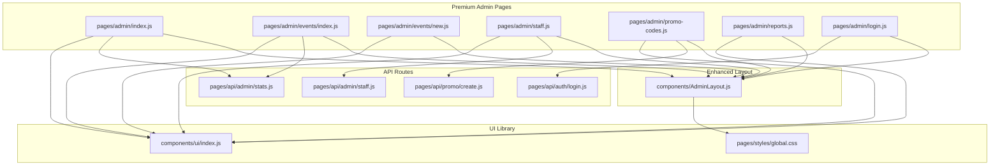
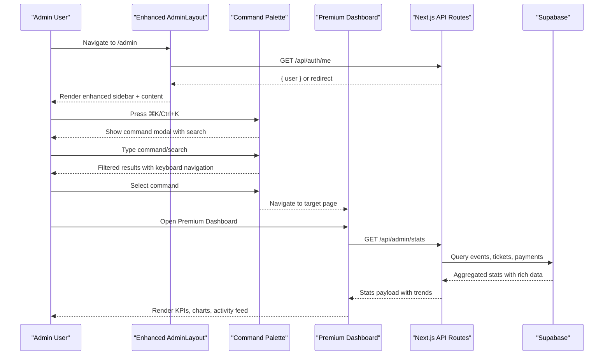
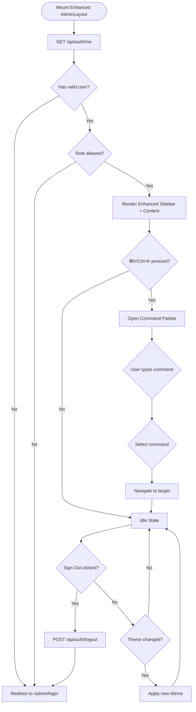
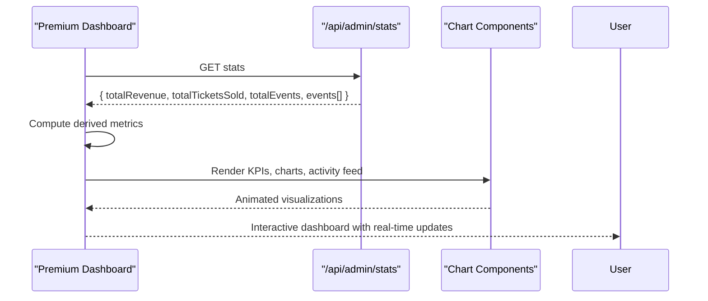
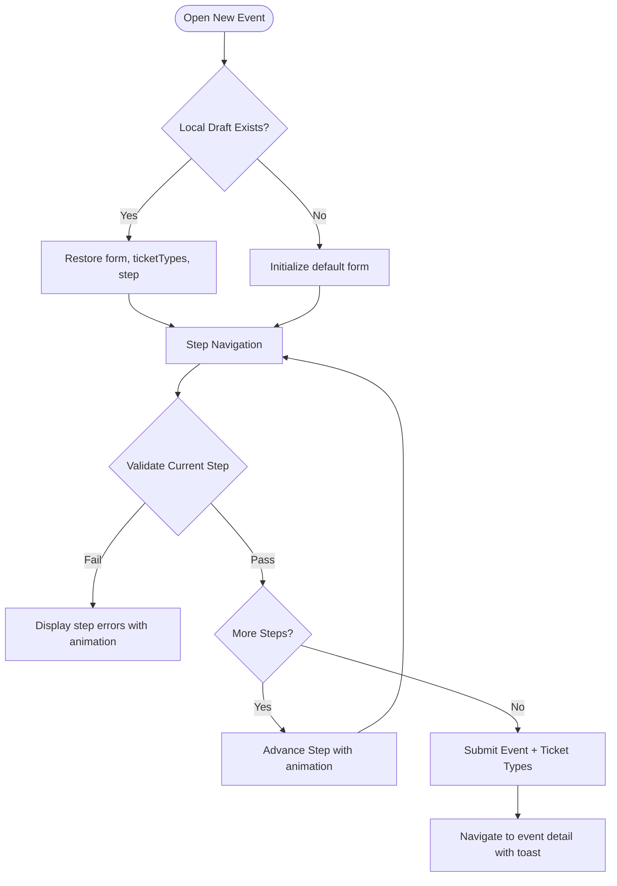
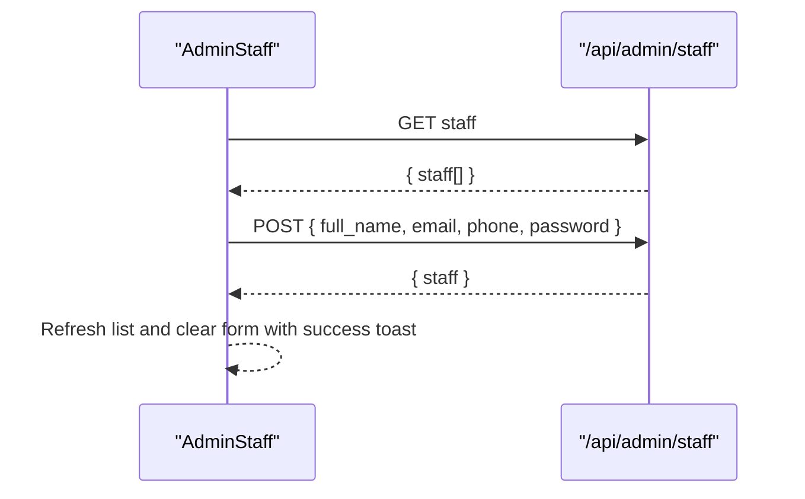
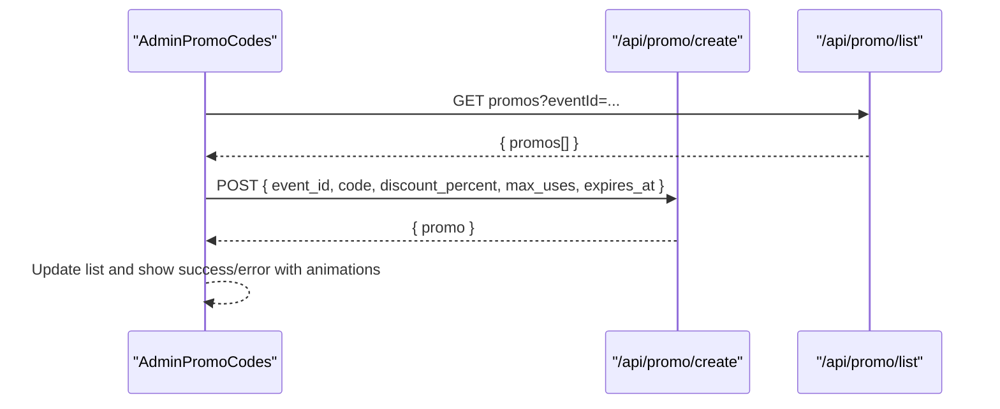
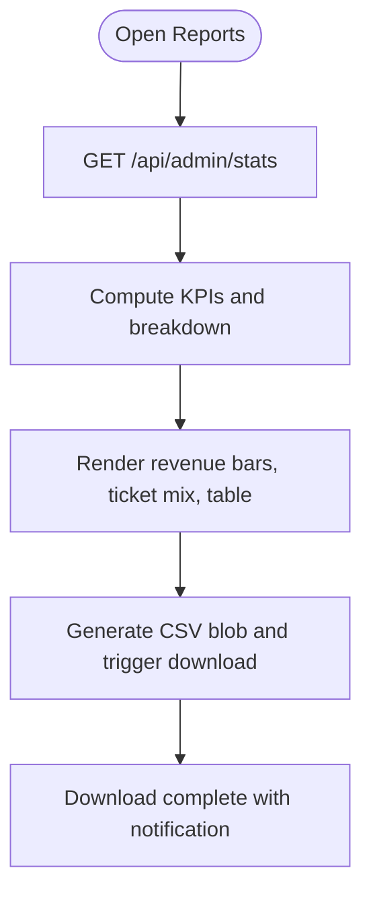
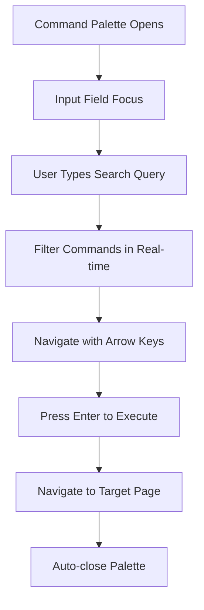
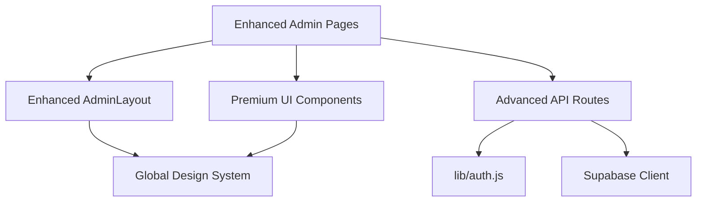

# Admin Dashboard

<cite>
**Referenced Files in This Document**
- [AdminLayout.js](file://components/AdminLayout.js)
- [index.js](file://pages/admin/index.js)
- [login.js](file://pages/admin/login.js)
- [events/index.js](file://pages/admin/events/index.js)
- [events/new.js](file://pages/admin/events/new.js)
- [staff.js](file://pages/admin/staff.js)
- [promo-codes.js](file://pages/admin/promo-codes.js)
- [reports.js](file://pages/admin/reports.js)
- [stats.js](file://pages/api/admin/stats.js)
- [staff.js](file://pages/api/admin/staff.js)
- [create.js](file://pages/api/promo/create.js)
- [login.js](file://pages/api/auth/login.js)
- [auth.js](file://lib/auth.js)
- [index.js](file://components/ui/index.js)
- [global.css](file://pages/styles/global.css)
</cite>

## Update Summary
**Changes Made**
- Added comprehensive command palette system with keyboard shortcuts (⌘K/Ctrl+K)
- Implemented premium design system with multiple theme support (dark-concert, midnight-blue, royal-purple, emerald, elegant-white)
- Enhanced navigation with organized sections (Main, Management, Tools)
- Modernized UI components with glass morphism effects, gradients, and animations
- Improved responsive design with mobile-first approach
- Added real-time activity feed and advanced data visualizations
- Enhanced accessibility with semantic HTML and keyboard navigation

## Table of Contents
1. [Introduction](#introduction)
2. [Project Structure](#project-structure)
3. [Core Components](#core-components)
4. [Architecture Overview](#architecture-overview)
5. [Detailed Component Analysis](#detailed-component-analysis)
6. [Design System Implementation](#design-system-implementation)
7. [Command Palette System](#command-palette-system)
8. [Theme Management](#theme-management)
9. [Dependency Analysis](#dependency-analysis)
10. [Performance Considerations](#performance-considerations)
11. [Troubleshooting Guide](#troubleshooting-guide)
12. [Conclusion](#conclusion)
13. [Appendices](#appendices)

## Introduction
This document provides a comprehensive guide to the Admin Dashboard sub-feature for TicketFlow, featuring a complete premium redesign with an advanced command palette system, enhanced navigation, modern UI patterns, and a comprehensive design system implementation across all admin interfaces. The dashboard now includes sophisticated analytics, event management tools, staff administration, and promotional code management with world-class user experience inspired by platforms like Eventbrite, Stripe, Linear, and Apple.

The redesigned interface features a sophisticated command palette accessible via keyboard shortcuts (⌘K/ Ctrl+K), multi-theme support with five distinct color schemes, glass morphism effects, gradient accents, and smooth animations throughout the application.

## Project Structure
The Admin Dashboard is implemented as a set of Next.js pages under the admin route namespace, wrapped by a shared layout component that enforces authentication and renders the enhanced sidebar navigation. The premium design system is centralized in global CSS with CSS variables supporting multiple themes.

**Diagram sources**
- [index.js:1-425](file://pages/admin/index.js#L1-L425)
- [AdminLayout.js:1-334](file://components/AdminLayout.js#L1-L334)
- [index.js:1-10](file://components/ui/index.js#L1-L10)
- [global.css:1-3507](file://pages/styles/global.css#L1-L3507)

**Section sources**
- [AdminLayout.js:1-334](file://components/AdminLayout.js#L1-L334)
- [index.js:1-425](file://pages/admin/index.js#L1-L425)
- [global.css:1-3507](file://pages/styles/global.css#L1-L3507)

## Core Components
- **Enhanced AdminLayout**: Provides authenticated sidebar navigation with organized sections (Main, Management, Tools), integrated command palette, theme switching, and user management. Enforces role checks on mount and redirects unauthorized users.
- **Premium AdminDashboard**: Features sophisticated KPI cards with animated counters, gradient accents, real-time activity feed, top performing events with progress indicators, and comprehensive event management.
- **Events Management**: Enhanced list view and creation wizard with step-by-step validation, autosave functionality, and multi-step submission for creating events and ticket types.
- **Staff Administration**: Modernized interface for creating gate staff accounts with real-time status updates and active/inactive management.
- **Promo Codes**: Advanced discount code management with per-event configuration, usage tracking, and dynamic filtering.
- **Reports & Analytics**: Comprehensive KPIs with export capabilities, revenue visualization, ticket type distribution, and detailed event breakdown tables.

Key responsibilities:
- Role-based access control enforced at layout level and API endpoints
- Premium UI components with consistent design system implementation
- Centralized data fetching with error handling and loading states
- Responsive grid layouts with mobile-first approach
- Command palette integration for quick navigation and actions

**Section sources**
- [AdminLayout.js:1-334](file://components/AdminLayout.js#L1-L334)
- [index.js:1-425](file://pages/admin/index.js#L1-L425)
- [staff.js:1-178](file://pages/admin/staff.js#L1-L178)
- [promo-codes.js:1-204](file://pages/admin/promo-codes.js#L1-L204)
- [reports.js:1-269](file://pages/admin/reports.js#L1-L269)

## Architecture Overview
The Admin Dashboard follows a client-side React architecture with serverless API routes, enhanced with a premium design system and command palette functionality. Authentication is handled via cookies and session tokens with role enforcement at both layout and API levels.

**Diagram sources**
- [AdminLayout.js:1-334](file://components/AdminLayout.js#L1-L334)
- [index.js:1-425](file://pages/admin/index.js#L1-L425)
- [stats.js:1-41](file://pages/api/admin/stats.js#L1-L41)

## Detailed Component Analysis

### Enhanced AdminLayout (Authentication, Navigation & Command Palette)
- **Role-based access control**: On mount, fetches current user and validates roles (super_admin or organiser). Redirects to login if unauthorized.
- **Organized sidebar navigation**: Renders menu items grouped into Main (Dashboard, Events, Create Event), Management (Staff, Promo Codes, Reports), and Tools (Gate Scanner, View Site). Highlights active routes with smooth transitions.
- **Integrated command palette**: Accessible via ⌘K/Ctrl+K shortcut, provides search and navigation functionality with keyboard navigation support.
- **Theme management**: Built-in theme switcher with five premium themes (dark-concert, midnight-blue, royal-purple, emerald, elegant-white).
- **Session management**: Sign-out triggers logout endpoint and resets navigation state.
- **Accessibility**: Uses semantic links and buttons; full keyboard navigation support.

**Diagram sources**
- [AdminLayout.js:1-334](file://components/AdminLayout.js#L1-L334)
- [login.js:1-31](file://pages/api/auth/login.js#L1-L31)

**Section sources**
- [AdminLayout.js:1-334](file://components/AdminLayout.js#L1-L334)
- [login.js:1-31](file://pages/api/auth/login.js#L1-L31)

### Premium AdminDashboard (Overview and Analytics)
- **Advanced KPI cards**: Revenue, tickets sold, capacity percentage, conversion rate, live visitors, average ticket price with animated counters and trend indicators.
- **Quick actions panel**: Links to create event, view reports, invite staff, create promo codes with hover effects and ripple animations.
- **Top performing events**: Ranked by tickets sold with progress indicators and gradient accents.
- **Real-time activity timeline**: Live feed showing recent sales, event publications, check-ins, and system events.
- **Enhanced event list**: Cards showing event name, date, venue, status badges, sold count, and capacity progress with smooth animations.

Data flow:
- Fetches stats from /api/admin/stats on mount with loading states.
- Computes derived metrics locally (e.g., capacity %, attendance rates).
- Navigates using Next.js router with smooth transitions.

**Diagram sources**
- [index.js:1-425](file://pages/admin/index.js#L1-L425)
- [stats.js:1-41](file://pages/api/admin/stats.js#L1-L41)

**Section sources**
- [index.js:1-425](file://pages/admin/index.js#L1-L425)
- [stats.js:1-41](file://pages/api/admin/stats.js#L1-L41)

### Enhanced Events Management (List and Creation Wizard)
- **Modernized events list**: Displays all events with status badges, dates, sold/checked-in counts, and smooth hover effects. Clicking navigates to detail page with transition animations.
- **Step-by-step creation wizard**: Multi-step form with validation per step, autosave to localStorage, and final submission to create event and ticket types.

Key interactions:
- Step validation ensures required fields before proceeding with visual feedback.
- Autosave persists draft state across reloads with success notifications.
- Submission creates event then iteratively creates ticket types with progress indication.

**Diagram sources**
- [events/new.js:1-800](file://pages/admin/events/new.js#L1-L800)

**Section sources**
- [events/index.js:1-70](file://pages/admin/events/index.js#L1-L70)
- [events/new.js:1-800](file://pages/admin/events/new.js#L1-L800)

### Modernized Staff Administration
- **Streamlined staff creation**: Create gate staff accounts with full_name, email, phone, password with real-time validation.
- **Interactive staff list**: Display staff list with active/inactive status, avatar generation, and inline editing capabilities.
- **Enhanced API integration**: Integrates with /api/admin/staff for GET and POST operations with loading states and error handling.

CRUD operations:
- Read: Fetch staff list on mount with skeleton loading states.
- Create: Submit new staff account with hashed password server-side and success notifications.

**Diagram sources**
- [staff.js:1-178](file://pages/admin/staff.js#L1-L178)
- [staff.js:1-28](file://pages/api/admin/staff.js#L1-L28)

**Section sources**
- [staff.js:1-178](file://pages/admin/staff.js#L1-L178)
- [staff.js:1-28](file://pages/api/admin/staff.js#L1-L28)

### Advanced Promotional Code Management
- **Sophisticated code creation**: Create discount codes per event with fields: code, discount_percent, max_uses, expires_at with auto-uppercase formatting.
- **Dynamic code listing**: List existing codes with usage counters, active/inactive status, and real-time filtering based on selected event.
- **Enhanced API integration**: Integrates with /api/promo/create and /api/promo/list with comprehensive error handling.

Form interactions:
- Auto-uppercase code input with validation feedback.
- Dynamic filtering of promo list based on selected event with instant updates.

**Diagram sources**
- [promo-codes.js:1-204](file://pages/admin/promo-codes.js#L1-L204)
- [create.js:1-23](file://pages/api/promo/create.js#L1-L23)

**Section sources**
- [promo-codes.js:1-204](file://pages/admin/promo-codes.js#L1-L204)
- [create.js:1-23](file://pages/api/promo/create.js#L1-L23)

### Comprehensive Reports and Analytics
- **Advanced KPIs**: Total revenue, tickets sold, total events, average per event with trend indicators and animated counters.
- **Flexible filtering**: Date range selection and event-specific filtering with real-time updates.
- **Rich visualizations**: Revenue by event bar charts, ticket type mix segmented bars, attendance progress indicators.
- **Export capabilities**: CSV download of event breakdown with professional formatting.

Data flow:
- Fetches stats once on mount with loading skeletons.
- Computes averages and percentages locally with memoization.
- Generates CSV client-side with proper encoding and file naming.

**Diagram sources**
- [reports.js:1-269](file://pages/admin/reports.js#L1-L269)
- [stats.js:1-41](file://pages/api/admin/stats.js#L1-L41)

**Section sources**
- [reports.js:1-269](file://pages/admin/reports.js#L1-L269)
- [stats.js:1-41](file://pages/api/admin/stats.js#L1-L41)

## Design System Implementation
The premium design system provides a comprehensive foundation for consistent, world-class user experiences across all admin interfaces.

### Typography System
- **Primary Font**: Plus Jakarta Sans for headings and key elements
- **Secondary Font**: Manrope for body text and descriptions  
- **Monospace Font**: JetBrains Mono for code and technical data
- **Font weights**: 300-900 scale with optimized readability

### Color System
- **Background layers**: Primary (#0a0a0f), Secondary (#12121a), Tertiary (#1a1a24), Elevated (#1e1e2a)
- **Text hierarchy**: Primary (#ffffff), Secondary (#a1a1aa), Tertiary (#7171a), Muted (#52525b)
- **Accent colors**: Primary (#8b5cf6), Secondary (#6366f1), Tertiary (#ec4899)
- **Semantic colors**: Success (#10b981), Warning (#f59e0b), Error (#ef4444), Info (#3b82f6)

### Spacing and Layout
- **8px spacing system**: Consistent spacing from 8px to 128px
- **Border radius scale**: 8px to 9999px (full circle)
- **Shadow system**: 5 elevation levels from subtle to dramatic
- **Grid system**: 12-column responsive grid with flexible breakpoints

### Glass Morphism Effects
- **Glass backgrounds**: Semi-transparent backgrounds with backdrop blur
- **Subtle borders**: Transparent borders with accent colors
- **Layered depth**: Multiple shadow layers for depth perception

**Section sources**
- [global.css:1-3507](file://pages/styles/global.css#L1-L3507)

## Command Palette System
The command palette provides instant access to all administrative functions through a sleek, searchable interface.

### Keyboard Shortcuts
- **Open/Close**: ⌘K (Mac) / Ctrl+K (Windows/Linux)
- **Navigation**: ↑↓ Arrow keys for item selection
- **Selection**: Enter to execute command
- **Dismiss**: Escape key to close

### Command Categories
- **Main Navigation**: Dashboard, Events, Create Event
- **Management Tools**: Staff, Promo Codes, Reports
- **Utilities**: Gate Scanner, View Site
- **Quick Actions**: New Event, Export CSV, Add Staff Member, Create Promo Code

### Search Functionality
- **Real-time filtering**: Instant results as you type
- **Case-insensitive matching**: Flexible search across all commands
- **Visual feedback**: Highlighted matches and keyboard shortcuts display
- **Empty states**: Helpful messaging when no results found

**Diagram sources**
- [AdminLayout.js:1-334](file://components/AdminLayout.js#L1-L334)

**Section sources**
- [AdminLayout.js:1-334](file://components/AdminLayout.js#L1-L334)

## Theme Management
The admin interface supports five premium themes with seamless switching and persistent preferences.

### Available Themes
1. **Dark Concert** (Default): Deep purple and pink gradients with dark background
2. **Midnight Blue**: Professional blue tones with corporate feel
3. **Royal Purple**: Rich purple and magenta combinations
4. **Emerald**: Green-focused theme with natural aesthetics
5. **Elegant White**: Light theme with clean, minimal design

### Theme Features
- **Instant switching**: No page reload required for theme changes
- **Persistent preferences**: Theme choice saved to localStorage
- **CSS variable system**: All colors defined as CSS custom properties
- **Smooth transitions**: Animated theme switching with fade effects
- **Responsive design**: All themes optimized for all screen sizes

### Theme Implementation
- **Root-level variables**: All theme colors defined in :root selector
- **Data attribute switching**: HTML element data-theme attribute controls active theme
- **Component integration**: All components use CSS variables for consistent theming
- **Fallback support**: Graceful degradation for unsupported browsers

**Section sources**
- [AdminLayout.js:1-334](file://components/AdminLayout.js#L1-L334)
- [global.css:1-3507](file://pages/styles/global.css#L1-L3507)

## Dependency Analysis
The enhanced admin feature depends on:
- **Enhanced AdminLayout** for authentication, navigation, and command palette functionality
- **Premium UI components** for consistent rendering with design system compliance
- **Advanced API routes** for data operations and authorization with improved error handling
- **Comprehensive auth utilities** for token handling and role enforcement
- **Global design system** for consistent styling and theming

**Diagram sources**
- [AdminLayout.js:1-334](file://components/AdminLayout.js#L1-L334)
- [index.js:1-10](file://components/ui/index.js#L1-L10)
- [stats.js:1-41](file://pages/api/admin/stats.js#L1-L41)
- [staff.js:1-28](file://pages/api/admin/staff.js#L1-L28)
- [create.js:1-23](file://pages/api/promo/create.js#L1-L23)
- [auth.js:1-47](file://lib/auth.js#L1-L47)
- [global.css:1-3507](file://pages/styles/global.css#L1-L3507)

**Section sources**
- [AdminLayout.js:1-334](file://components/AdminLayout.js#L1-L334)
- [index.js:1-10](file://components/ui/index.js#L1-L10)
- [stats.js:1-41](file://pages/api/admin/stats.js#L1-L41)
- [staff.js:1-28](file://pages/api/admin/staff.js#L1-L28)
- [create.js:1-23](file://pages/api/promo/create.js#L1-L23)
- [auth.js:1-47](file://lib/auth.js#L1-L47)
- [global.css:1-3507](file://pages/styles/global.css#L1-L3507)

## Performance Considerations
- **Optimized re-renders**: Localized state management and memoized computations prevent unnecessary updates
- **Efficient data fetching**: Single API calls with proper caching and error handling
- **Animation performance**: Hardware-accelerated CSS transforms and opacity changes
- **Memory management**: Proper cleanup of event listeners and timers
- **Bundle optimization**: Lazy loading of heavy components and code splitting
- **Image optimization**: Optimized assets with proper sizing and formats

## Troubleshooting Guide
Common issues and resolutions:
- **Command palette not opening**: Verify keyboard event listeners are properly attached and browser compatibility
- **Theme switching issues**: Check localStorage permissions and CSS variable inheritance
- **Navigation problems**: Ensure router is properly initialized and paths are correct
- **API connection failures**: Verify network connectivity and authentication status
- **Performance issues**: Monitor memory usage and optimize heavy computations
- **Mobile responsiveness**: Test on various screen sizes and device orientations

Relevant files:
- Authentication and role checks: AdminLayout, auth utilities, login API
- Error handling in API routes: Return appropriate status codes and error messages
- Command palette functionality: Keyboard event handling and state management

**Section sources**
- [AdminLayout.js:1-334](file://components/AdminLayout.js#L1-L334)
- [auth.js:1-47](file://lib/auth.js#L1-L47)
- [login.js:1-31](file://pages/api/auth/login.js#L1-L31)
- [stats.js:1-41](file://pages/api/admin/stats.js#L1-L41)
- [staff.js:1-28](file://pages/api/admin/staff.js#L1-L28)
- [create.js:1-23](file://pages/api/promo/create.js#L1-L23)

## Conclusion
The enhanced Admin Dashboard provides a world-class, premium administrative interface for managing events, staff, promotions, and analytics. With the complete redesign featuring a sophisticated command palette system, five premium themes, glass morphism effects, and comprehensive design system implementation, it offers an exceptional user experience comparable to leading platforms like Eventbrite and Stripe.

The modular architecture, consistent state patterns, secure API integrations, and responsive design provide a strong foundation for administrators. Extensibility points include adding new admin modules, integrating additional APIs, enhancing real-time updates, and expanding the command palette with custom actions.

## Appendices

### Responsive Design and Accessibility
- **Mobile-first approach**: All components designed for mobile screens first, then enhanced for larger displays
- **Touch-friendly interfaces**: Appropriate touch targets and gesture support
- **Keyboard navigation**: Full keyboard accessibility with logical tab order
- **Screen reader support**: Semantic HTML structure and ARIA labels
- **High contrast mode**: Support for system high contrast settings
- **Reduced motion**: Respects user motion preferences

### Real-Time Data Updates
Current implementation uses polling on mount. To enhance:
- **WebSocket integration**: Implement real-time updates for live dashboards
- **Optimistic updates**: Immediate UI feedback before server confirmation
- **Background synchronization**: Intelligent refresh intervals for critical metrics
- **Offline support**: Cache data for offline viewing with sync when connected

### Customization and Extension Points
- **New admin modules**: Create pages under /admin and link them in AdminLayout navigation
- **Custom commands**: Extend command palette with custom actions and shortcuts
- **Theme customization**: Add new themes by extending CSS variables
- **Component library**: Extend UI components by adding new primitives to the UI library
- **API integration**: Follow established patterns for authentication and error handling
- **Plugin architecture**: Design extensible hooks for third-party integrations

### Design System Extensions
- **Component variants**: Add new button, card, and input variants
- **Animation library**: Create reusable animation components and transitions
- **Icon system**: Expand icon library with consistent SVG icons
- **Color tokens**: Add semantic color tokens for specific use cases
- **Spacing tokens**: Extend spacing scale for complex layouts
- **Typography scales**: Add font size and weight variations