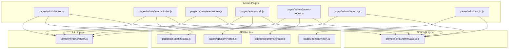
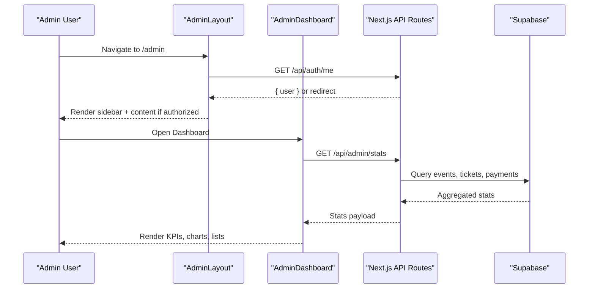
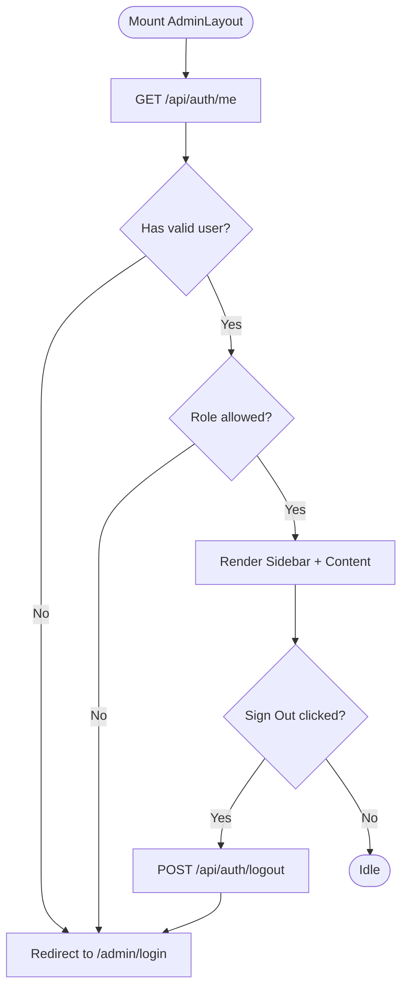
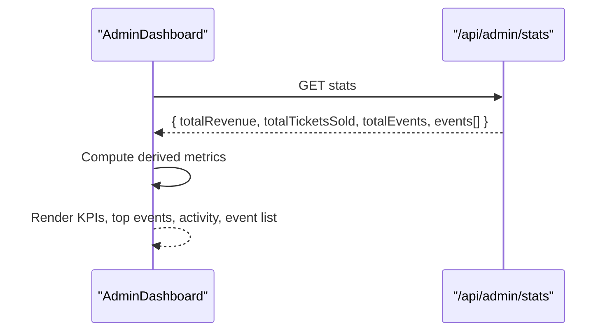
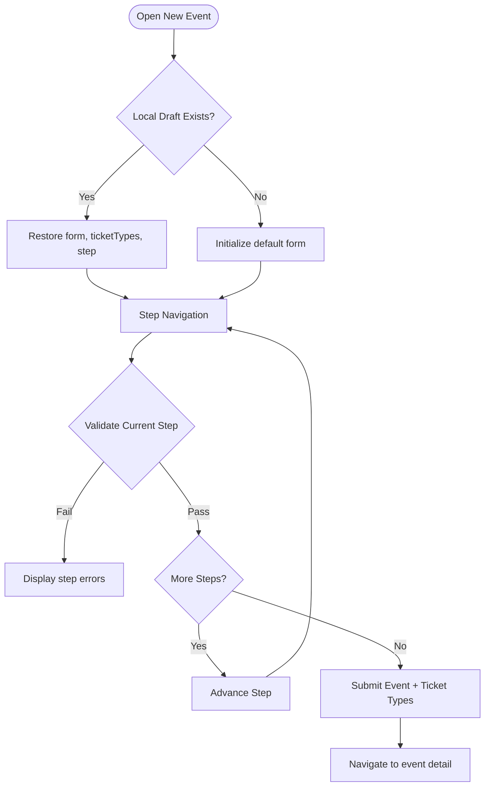
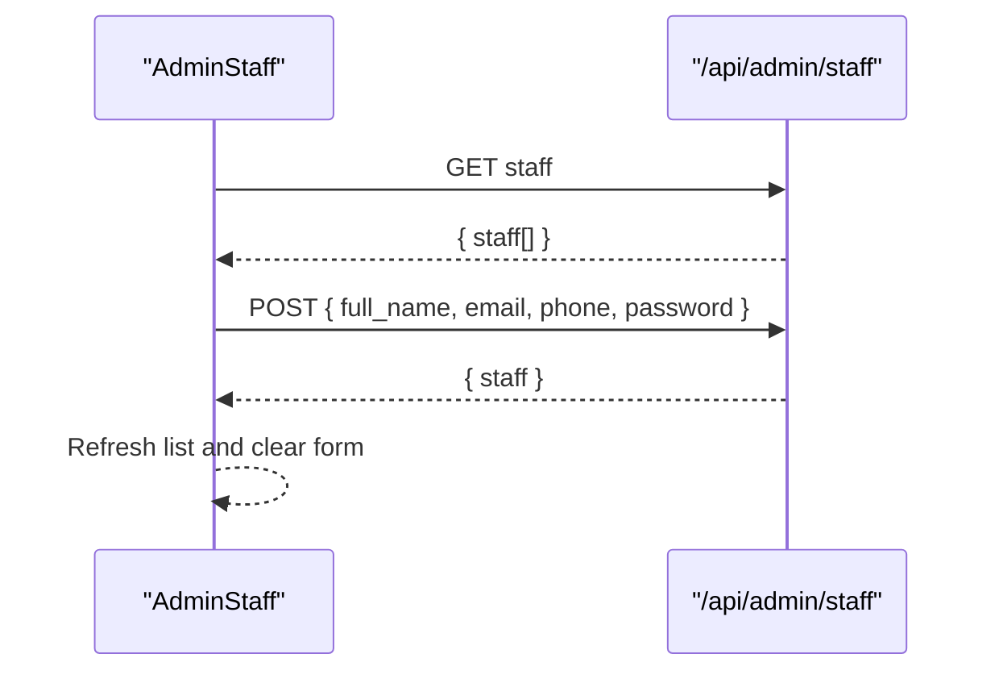
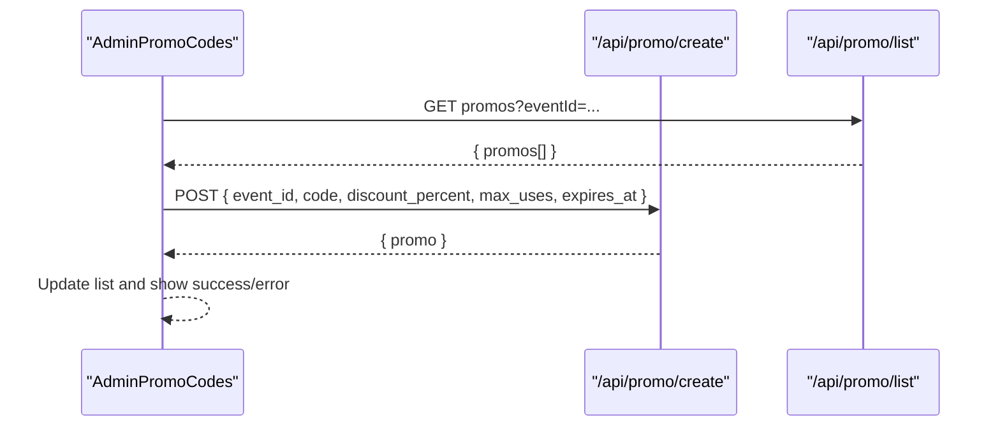
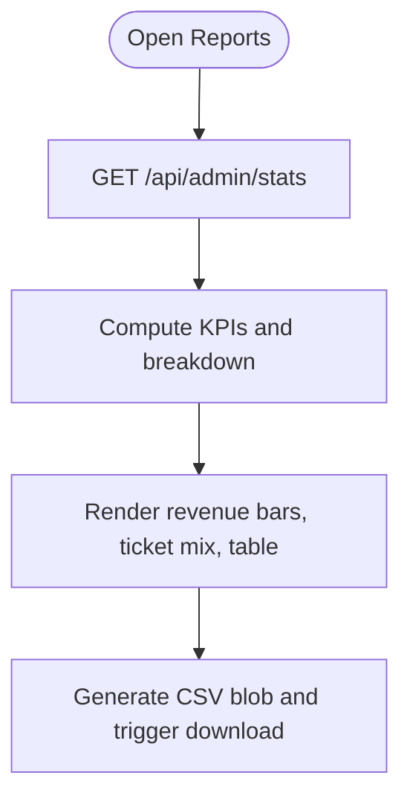
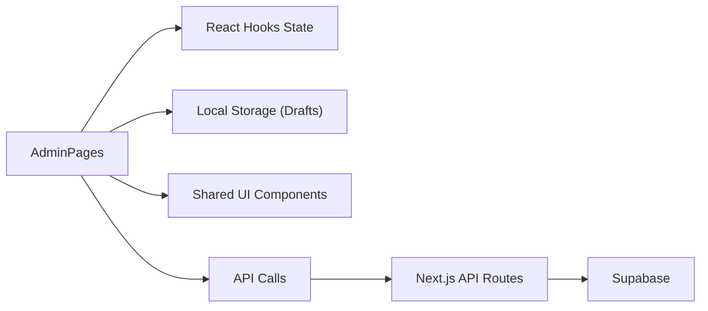
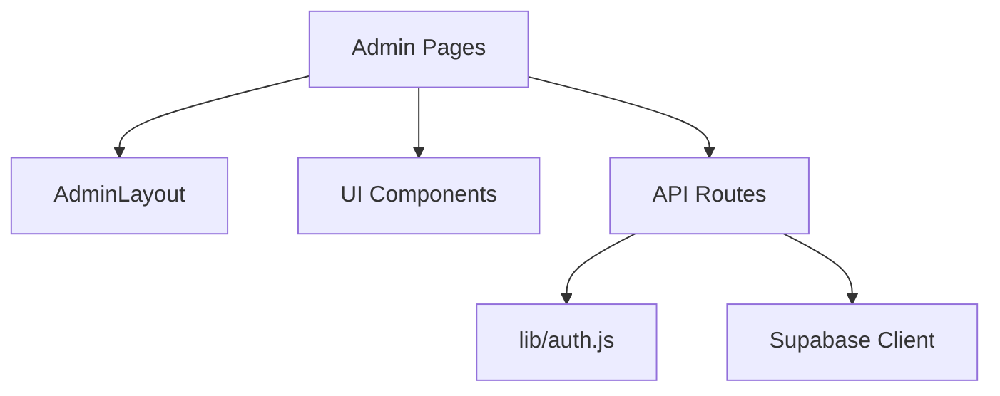

# Admin Dashboard

<cite>
**Referenced Files in This Document**
- [AdminLayout.js](file://components/AdminLayout.js)
- [index.js](file://pages/admin/index.js)
- [login.js](file://pages/admin/login.js)
- [events/index.js](file://pages/admin/events/index.js)
- [events/new.js](file://pages/admin/events/new.js)
- [staff.js](file://pages/admin/staff.js)
- [promo-codes.js](file://pages/admin/promo-codes.js)
- [reports.js](file://pages/admin/reports.js)
- [stats.js](file://pages/api/admin/stats.js)
- [staff.js](file://pages/api/admin/staff.js)
- [create.js](file://pages/api/promo/create.js)
- [login.js](file://pages/api/auth/login.js)
- [auth.js](file://lib/auth.js)
- [index.js](file://components/ui/index.js)
</cite>

## Table of Contents
1. [Introduction](#introduction)
2. [Project Structure](#project-structure)
3. [Core Components](#core-components)
4. [Architecture Overview](#architecture-overview)
5. [Detailed Component Analysis](#detailed-component-analysis)
6. [Dependency Analysis](#dependency-analysis)
7. [Performance Considerations](#performance-considerations)
8. [Troubleshooting Guide](#troubleshooting-guide)
9. [Conclusion](#conclusion)
10. [Appendices](#appendices)

## Introduction
This document provides a comprehensive guide to the Admin Dashboard sub-feature for TicketFlow. It explains the administrative interface design, navigation structure, and role-based access controls. It also documents the dashboard overview with analytics, event management tools, staff administration, and promotional code management. Concrete examples of data visualization, form interactions, and CRUD operations are included. The document further clarifies relationships between admin modules, shared state management patterns, responsive design considerations, accessibility compliance, user experience optimization, backend API integration, real-time update strategies, customization options, and extension points for additional administrative features.

## Project Structure
The Admin Dashboard is implemented as a set of Next.js pages under the admin route namespace, wrapped by a shared layout component that enforces authentication and renders the sidebar navigation. UI primitives are centralized in a shared UI library. Backend logic is exposed via Next.js API routes that enforce role-based access and interact with the database through Supabase.

**Diagram sources**
- [index.js:1-585](file://pages/admin/index.js#L1-L585)
- [AdminLayout.js:1-194](file://components/AdminLayout.js#L1-L194)
- [index.js:1-10](file://components/ui/index.js#L1-L10)
- [stats.js:1-41](file://pages/api/admin/stats.js#L1-L41)
- [staff.js:1-28](file://pages/api/admin/staff.js#L1-L28)
- [create.js:1-23](file://pages/api/promo/create.js#L1-L23)
- [login.js:1-31](file://pages/api/auth/login.js#L1-L31)

**Section sources**
- [AdminLayout.js:1-194](file://components/AdminLayout.js#L1-L194)
- [index.js:1-585](file://pages/admin/index.js#L1-L585)
- [index.js:1-10](file://components/ui/index.js#L1-L10)

## Core Components
- AdminLayout: Provides authenticated sidebar navigation, user info, sign-out, and content area. Enforces role checks on mount and redirects unauthorized users.
- AdminDashboard (pages/admin/index.js): Displays key metrics, quick actions, top events, recent activity, and an event list. Fetches aggregated stats from the backend.
- Events Management: List view and creation wizard with step-by-step validation, autosave to local storage, and multi-step submission to create events and ticket types.
- Staff Administration: Create gate staff accounts and display active/inactive status; integrates with the staff API.
- Promo Codes: Create discount codes per event, list existing codes, and manage attributes like discount percentage, max uses, and expiry.
- Reports & Analytics: Aggregated KPIs, revenue bars, ticket type mix, and detailed event breakdown table with export capabilities.

Key responsibilities:
- Role-based access control enforced at layout level and API endpoints.
- Shared UI components for consistent look-and-feel.
- Centralized data fetching and error handling patterns.
- Responsive grid layouts and accessible form elements.

**Section sources**
- [AdminLayout.js:1-194](file://components/AdminLayout.js#L1-L194)
- [index.js:1-585](file://pages/admin/index.js#L1-L585)
- [events/index.js:1-70](file://pages/admin/events/index.js#L1-L70)
- [events/new.js:1-800](file://pages/admin/events/new.js#L1-L800)
- [staff.js:1-97](file://pages/admin/staff.js#L1-L97)
- [promo-codes.js:1-106](file://pages/admin/promo-codes.js#L1-L106)
- [reports.js:1-610](file://pages/admin/reports.js#L1-L610)

## Architecture Overview
The Admin Dashboard follows a client-side React architecture with serverless API routes. Authentication is handled via cookies and session tokens. Role enforcement occurs both in the layout and API handlers. Data flows from Supabase through API routes to the frontend components.

**Diagram sources**
- [AdminLayout.js:1-194](file://components/AdminLayout.js#L1-L194)
- [index.js:1-585](file://pages/admin/index.js#L1-L585)
- [stats.js:1-41](file://pages/api/admin/stats.js#L1-L41)

## Detailed Component Analysis

### AdminLayout (Authentication and Navigation)
- Role-based access control: On mount, fetches current user and validates roles super_admin or organiser. Redirects to login if unauthorized.
- Sidebar navigation: Renders menu items for Overview, Events, Gate Staff, Promo Codes, and Reports. Highlights active route.
- Session management: Sign-out triggers logout endpoint and resets navigation.
- Accessibility: Uses semantic links and buttons; keyboard navigable.

**Diagram sources**
- [AdminLayout.js:1-194](file://components/AdminLayout.js#L1-L194)
- [login.js:1-31](file://pages/api/auth/login.js#L1-L31)

**Section sources**
- [AdminLayout.js:1-194](file://components/AdminLayout.js#L1-L194)
- [login.js:1-31](file://pages/api/auth/login.js#L1-L31)

### AdminDashboard (Overview and Analytics)
- KPI cards: Revenue, tickets sold, capacity %, conversion rate, live visitors, average ticket price.
- Quick actions: Links to create event, view reports, invite staff, create promo code.
- Top performing events: Ranked by tickets sold with progress indicators.
- Recent activity timeline: Mocked entries for demonstration.
- Event list: Cards showing event name, date, venue, status badge, sold count, and capacity progress.

Data flow:
- Fetches stats from /api/admin/stats on mount.
- Computes derived metrics locally (e.g., capacity %).
- Navigates using Next.js router.

**Diagram sources**
- [index.js:1-585](file://pages/admin/index.js#L1-L585)
- [stats.js:1-41](file://pages/api/admin/stats.js#L1-L41)

**Section sources**
- [index.js:1-585](file://pages/admin/index.js#L1-L585)
- [stats.js:1-41](file://pages/api/admin/stats.js#L1-L41)

### Events Management (List and Creation Wizard)
- Events list: Displays all events with status badges, dates, sold/checked-in counts. Clicking navigates to detail page.
- Creation wizard: Multi-step form with validation per step, autosave to localStorage, and final submission to create event and ticket types.

Key interactions:
- Step validation ensures required fields before proceeding.
- Autosave persists draft state across reloads.
- Submission creates event then iteratively creates ticket types.

**Diagram sources**
- [events/new.js:1-800](file://pages/admin/events/new.js#L1-L800)

**Section sources**
- [events/index.js:1-70](file://pages/admin/events/index.js#L1-L70)
- [events/new.js:1-800](file://pages/admin/events/new.js#L1-L800)

### Staff Administration
- Create gate staff accounts with full_name, email, phone, password.
- Display staff list with active/inactive status.
- Integrates with /api/admin/staff for GET and POST operations.

CRUD operations:
- Read: Fetch staff list on mount.
- Create: Submit new staff account with hashed password server-side.

**Diagram sources**
- [staff.js:1-97](file://pages/admin/staff.js#L1-L97)
- [staff.js:1-28](file://pages/api/admin/staff.js#L1-L28)

**Section sources**
- [staff.js:1-97](file://pages/admin/staff.js#L1-L97)
- [staff.js:1-28](file://pages/api/admin/staff.js#L1-L28)

### Promotional Code Management
- Create discount codes per event with fields: code, discount_percent, max_uses, expires_at.
- List existing codes with usage counters and active/inactive status.
- Integrates with /api/promo/create and /api/promo/list.

Form interactions:
- Auto-uppercase code input.
- Dynamic filtering of promo list based on selected event.

**Diagram sources**
- [promo-codes.js:1-106](file://pages/admin/promo-codes.js#L1-L106)
- [create.js:1-23](file://pages/api/promo/create.js#L1-L23)

**Section sources**
- [promo-codes.js:1-106](file://pages/admin/promo-codes.js#L1-L106)
- [create.js:1-23](file://pages/api/promo/create.js#L1-L23)

### Reports and Analytics
- KPIs: Total revenue, tickets sold, total events, average per event.
- Filters: Date range and event selection.
- Visualizations: Revenue by event bar chart, ticket type mix segmented bar, attendance progress.
- Export: CSV download of event breakdown.

Data flow:
- Fetches stats once on mount.
- Computes averages and percentages locally.
- Generates CSV client-side.

**Diagram sources**
- [reports.js:1-610](file://pages/admin/reports.js#L1-L610)
- [stats.js:1-41](file://pages/api/admin/stats.js#L1-L41)

**Section sources**
- [reports.js:1-610](file://pages/admin/reports.js#L1-L610)
- [stats.js:1-41](file://pages/api/admin/stats.js#L1-L41)

### Conceptual Overview
The admin modules share common patterns:
- State management via React hooks within each page.
- Local storage used for draft persistence in complex forms.
- Consistent UI components from the shared library.
- API calls encapsulated in page-level effects and handlers.

[No sources needed since this diagram shows conceptual workflow, not actual code structure]

## Dependency Analysis
The admin feature depends on:
- AdminLayout for authentication and navigation.
- UI components for consistent rendering.
- API routes for data operations and authorization.
- Auth utilities for token handling and role enforcement.

**Diagram sources**
- [AdminLayout.js:1-194](file://components/AdminLayout.js#L1-L194)
- [index.js:1-10](file://components/ui/index.js#L1-L10)
- [stats.js:1-41](file://pages/api/admin/stats.js#L1-L41)
- [staff.js:1-28](file://pages/api/admin/staff.js#L1-L28)
- [create.js:1-23](file://pages/api/promo/create.js#L1-L23)
- [auth.js:1-47](file://lib/auth.js#L1-L47)

**Section sources**
- [AdminLayout.js:1-194](file://components/AdminLayout.js#L1-L194)
- [index.js:1-10](file://components/ui/index.js#L1-L10)
- [stats.js:1-41](file://pages/api/admin/stats.js#L1-L41)
- [staff.js:1-28](file://pages/api/admin/staff.js#L1-L28)
- [create.js:1-23](file://pages/api/promo/create.js#L1-L23)
- [auth.js:1-47](file://lib/auth.js#L1-L47)

## Performance Considerations
- Minimize re-renders by keeping state localized and avoiding unnecessary prop drilling.
- Use skeleton loaders for perceived performance during data fetching.
- Debounce autosave to reduce writes to local storage.
- Batch API requests where possible (e.g., parallel queries in stats endpoint).
- Avoid heavy computations on render; compute derived values in effects or memoized functions.

[No sources needed since this section provides general guidance]

## Troubleshooting Guide
Common issues and resolutions:
- Unauthorized access: Ensure session cookie is present and role is allowed. Check /api/auth/me and AdminLayout redirection logic.
- Missing data: Verify API responses and handle empty arrays gracefully. Add fallbacks for derived metrics.
- Form validation errors: Inspect step-specific validation rules and ensure error messages are displayed.
- Network errors: Implement retry logic and user-friendly error states.

Relevant files:
- Authentication and role checks: AdminLayout, auth utilities, login API.
- Error handling in API routes: Return appropriate status codes and error messages.

**Section sources**
- [AdminLayout.js:1-194](file://components/AdminLayout.js#L1-L194)
- [auth.js:1-47](file://lib/auth.js#L1-L47)
- [login.js:1-31](file://pages/api/auth/login.js#L1-L31)
- [stats.js:1-41](file://pages/api/admin/stats.js#L1-L41)
- [staff.js:1-28](file://pages/api/admin/staff.js#L1-L28)
- [create.js:1-23](file://pages/api/promo/create.js#L1-L23)

## Conclusion
The Admin Dashboard provides a robust, role-secured interface for managing events, staff, promotions, and analytics. It leverages shared UI components, consistent state patterns, and secure API integrations. With responsive design, accessible forms, and clear data visualizations, it offers a strong foundation for administrators. Extensibility points include adding new admin pages, integrating additional APIs, and enhancing real-time updates.

[No sources needed since this section summarizes without analyzing specific files]

## Appendices

### Responsive Design and Accessibility
- Responsive grids adapt to various screen sizes using CSS variables and flexible layouts.
- Accessible inputs use labels, placeholders, and focus states.
- Keyboard navigation supported throughout sidebar and forms.

[No sources needed since this section provides general guidance]

### Real-Time Data Updates
Current implementation uses polling on mount. To enhance:
- Implement WebSocket or Server-Sent Events for live dashboards.
- Introduce optimistic updates for better UX.
- Use background refresh intervals for critical metrics.

[No sources needed since this section provides general guidance]

### Customization and Extension Points
- Add new admin modules by creating pages under /admin and linking them in AdminLayout navigation.
- Extend UI components by adding new primitives to the UI library.
- Integrate additional APIs by following established patterns for authentication and error handling.

[No sources needed since this section provides general guidance]