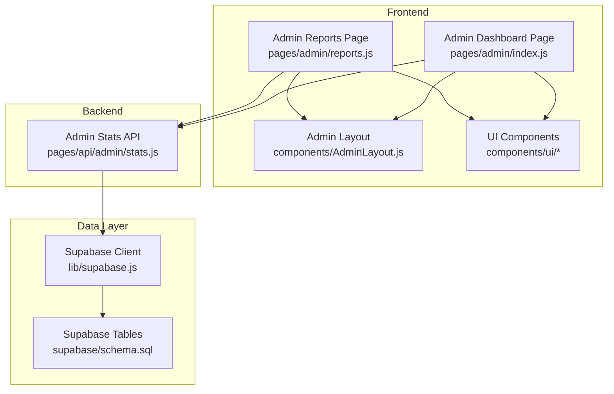
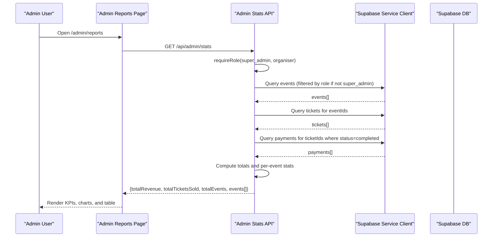
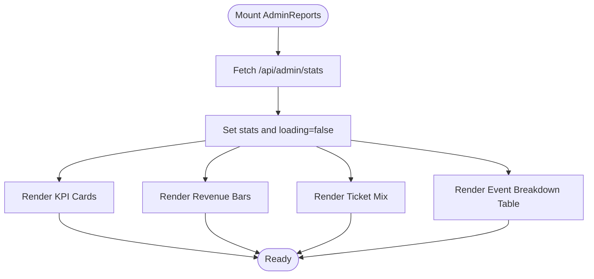
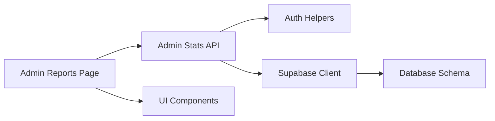

# Analytics & Reports

<cite>
**Referenced Files in This Document**
- [reports.js](file://pages/admin/reports.js)
- [stats.js](file://pages/api/admin/stats.js)
- [index.js](file://pages/admin/index.js)
- [AdminLayout.js](file://components/AdminLayout.js)
- [supabase.js](file://lib/supabase.js)
- [auth.js](file://lib/auth.js)
- [schema.sql](file://supabase/schema.sql)
- [Progress.js](file://components/ui/Progress.js)
- [Card.js](file://components/ui/Card.js)
- [Badge.js](file://components/ui/Badge.js)
- [Skeleton.js](file://components/ui/Skeleton.js)
</cite>

## Table of Contents
1. [Introduction](#introduction)
2. [Project Structure](#project-structure)
3. [Core Components](#core-components)
4. [Architecture Overview](#architecture-overview)
5. [Detailed Component Analysis](#detailed-component-analysis)
6. [Dependency Analysis](#dependency-analysis)
7. [Performance Considerations](#performance-considerations)
8. [Troubleshooting Guide](#troubleshooting-guide)
9. [Conclusion](#conclusion)
10. [Appendices](#appendices)

## Introduction
This document explains the Analytics and Reports module for the TicketFlow admin application. It covers the reporting dashboard that displays sales trends, attendance metrics, revenue analysis, and performance indicators. It also documents data visualization components (charts, graphs, summary statistics), export functionality (CSV currently implemented; PDF and Excel placeholders), and how filters are structured. The integration with the admin statistics API is detailed along with data models and calculation methods used to generate insights. Performance considerations for large datasets, real-time updates, and mobile responsiveness are addressed.

## Project Structure
The analytics and reports feature spans a Next.js page, an API route, shared UI components, and Supabase-backed data access:
- Reporting page: pages/admin/reports.js
- Admin stats API: pages/api/admin/stats.js
- Admin layout and navigation: components/AdminLayout.js
- Data client and auth helpers: lib/supabase.js, lib/auth.js
- Database schema: supabase/schema.sql
- UI primitives used by the dashboard: components/ui/*

**Diagram sources**
- [reports.js:1-120](file://pages/admin/reports.js#L1-L120)
- [index.js:1-120](file://pages/admin/index.js#L1-L120)
- [AdminLayout.js:1-60](file://components/AdminLayout.js#L1-L60)
- [stats.js:1-41](file://pages/api/admin/stats.js#L1-L41)
- [supabase.js:1-23](file://lib/supabase.js#L1-L23)
- [schema.sql:1-166](file://supabase/schema.sql#L1-L166)

**Section sources**
- [reports.js:1-120](file://pages/admin/reports.js#L1-L120)
- [index.js:1-120](file://pages/admin/index.js#L1-L120)
- [AdminLayout.js:1-60](file://components/AdminLayout.js#L1-L60)
- [stats.js:1-41](file://pages/api/admin/stats.js#L1-L41)
- [supabase.js:1-23](file://lib/supabase.js#L1-L23)
- [schema.sql:1-166](file://supabase/schema.sql#L1-L166)

## Core Components
- Reporting page (AdminReports): Displays KPIs, revenue-by-event bars, ticket type mix, and an event breakdown table. Includes CSV export and placeholder buttons for PDF/Excel exports. Provides filter inputs for date range and event selection.
- Admin stats API (/api/admin/stats): Aggregates events, tickets, and payments to compute total revenue, total tickets sold, per-event sold and checked-in counts, and returns a flat payload consumed by the frontend.
- UI primitives: Card, Badge, Progress, Skeleton, Input used to build the dashboard visuals and loading states.
- Admin layout: Enforces authentication and role checks for accessing admin pages.

Key responsibilities:
- Frontend fetches aggregated stats once on mount and renders visualizations.
- Backend enforces roles and queries Supabase using a service client to aggregate across tables.
- Export CSV builds a downloadable file from the current dataset.

**Section sources**
- [reports.js:73-120](file://pages/admin/reports.js#L73-L120)
- [stats.js:4-41](file://pages/api/admin/stats.js#L4-L41)
- [Progress.js:1-39](file://components/ui/Progress.js#L1-L39)
- [Card.js:1-33](file://components/ui/Card.js#L1-L33)
- [Badge.js:1-30](file://components/ui/Badge.js#L1-L30)
- [Skeleton.js:1-48](file://components/ui/Skeleton.js#L1-L48)

## Architecture Overview
The reporting flow is a simple client-server aggregation pattern:
- The Admin Reports page loads and calls /api/admin/stats.
- The API validates the user’s role and aggregates data from events, tickets, and payments via Supabase.
- The response includes totals and per-event metrics which the page renders as KPI cards, bar charts, and a table.

**Diagram sources**
- [reports.js:82-84](file://pages/admin/reports.js#L82-L84)
- [stats.js:4-36](file://pages/api/admin/stats.js#L4-L36)
- [auth.js:38-46](file://lib/auth.js#L38-L46)
- [supabase.js:15-23](file://lib/supabase.js#L15-L23)

## Detailed Component Analysis

### Admin Reports Page (pages/admin/reports.js)
- KPIs: Total Revenue, Tickets Sold, Total Events, Average Revenue per Event.
- Visualizations:
  - Revenue by Event: horizontal bars sorted by revenue with percentage relative to top event.
  - Ticket Type Mix: segmented bar and list showing distribution percentages.
  - Attendance Check-in Rate: overall progress bar computed from total checked-in vs total sold.
- Filters: Date From, Date To, and Event selector. Currently, applying filters does not trigger a re-fetch in the code; it is a UI hook point for future implementation.
- Export: CSV export generates a downloadable file from the current events array. PDF and Excel buttons are present but disabled.

Implementation highlights:
- Fetches stats once on mount and stores in state.
- Computes derived metrics locally (e.g., average per event).
- Uses UI components for consistent styling and accessibility.

**Diagram sources**
- [reports.js:82-120](file://pages/admin/reports.js#L82-L120)
- [reports.js:172-206](file://pages/admin/reports.js#L172-L206)
- [reports.js:269-463](file://pages/admin/reports.js#L269-L463)
- [reports.js:465-601](file://pages/admin/reports.js#L465-L601)

**Section sources**
- [reports.js:73-120](file://pages/admin/reports.js#L73-L120)
- [reports.js:172-206](file://pages/admin/reports.js#L172-L206)
- [reports.js:269-463](file://pages/admin/reports.js#L269-L463)
- [reports.js:465-601](file://pages/admin/reports.js#L465-L601)

### Admin Stats API (pages/api/admin/stats.js)
- Authentication and authorization:
  - Requires role super_admin or organiser. Super admins see all events; organisers see only their own events.
- Data aggregation:
  - Fetches events (id, event_name, status, date, capacity).
  - Fetches tickets filtered by event IDs.
  - Fetches payments linked to tickets where status is completed.
  - Computes total revenue by summing payment amounts.
  - Counts total tickets sold excluding cancelled/refunded statuses.
  - Per-event breakdown includes sold count and checked-in count (status = used).
- Response shape:
  - totalRevenue (number)
  - totalTicketsSold (number)
  - totalEvents (number)
  - events[] (array of objects with id, event_name, status, date, capacity, sold, checkedIn)

**Diagram sources**
- [stats.js:4-36](file://pages/api/admin/stats.js#L4-L36)
- [auth.js:38-46](file://lib/auth.js#L38-L46)

**Section sources**
- [stats.js:4-41](file://pages/api/admin/stats.js#L4-L41)
- [auth.js:38-46](file://lib/auth.js#L38-L46)

### Admin Dashboard (pages/admin/index.js)
- Complements the Reports page with additional KPIs such as Capacity %, Conversion rate, Live Visitors, and Avg Ticket Price.
- Uses the same /api/admin/stats endpoint to populate event lists and quick actions.
- Demonstrates how the same aggregated data can be reused across multiple admin views.

**Section sources**
- [index.js:269-393](file://pages/admin/index.js#L269-L393)
- [index.js:395-576](file://pages/admin/index.js#L395-L576)

### Data Models and Calculations
- Entities involved:
  - events: id, event_name, status, date, capacity
  - tickets: id, event_id, status (active, used, cancelled, refunded)
  - payments: id, ticket_id, amount, status (pending, completed, failed, refunded)
- Calculation methods:
  - Total Revenue: Sum of payments.amount where payments.status = 'completed'.
  - Tickets Sold: Count of tickets where status is not 'cancelled' and not 'refunded'.
  - Checked In: Count of tickets where status = 'used'.
  - Average Revenue per Event: totalRevenue / totalEvents (rounded).
  - Overall Check-in Rate: sum(checkedin) / sum(sold) displayed as a progress bar.

These calculations are performed server-side in the API route to ensure consistency and reduce client-side overhead.

**Section sources**
- [schema.sql:24-102](file://supabase/schema.sql#L24-L102)
- [stats.js:18-36](file://pages/api/admin/stats.js#L18-L36)

### Data Visualization Components
- KPI Cards: Reusable StatCard component displays label, value, subtitle, gradient icon, and hover effects.
- Bar Charts: Horizontal bars represent revenue by event with animated widths and color gradients.
- Ticket Type Mix: Segmented bar and legend show distribution percentages.
- Progress Indicators: Used for check-in rates and per-row attendance percentages.
- Skeleton Loading: Placeholder shapes while data is being fetched.

These components are built from lightweight UI primitives and CSS classes, avoiding heavy charting libraries.

**Section sources**
- [reports.js:23-71](file://pages/admin/reports.js#L23-L71)
- [reports.js:305-372](file://pages/admin/reports.js#L305-L372)
- [reports.js:375-463](file://pages/admin/reports.js#L375-L463)
- [Progress.js:1-39](file://components/ui/Progress.js#L1-L39)
- [Skeleton.js:1-48](file://components/ui/Skeleton.js#L1-L48)

### Export Functionality
- CSV Export: Implemented in the Reports page. Builds rows from the events array and triggers a browser download.
- PDF and Excel: Buttons exist but are disabled; these would require backend generation or client-side libraries.

Recommendations for extension:
- Implement server-side PDF generation (e.g., Puppeteer) and return a downloadable stream.
- For Excel, consider generating XLSX server-side or using client-side libraries like SheetJS.

**Section sources**
- [reports.js:86-94](file://pages/admin/reports.js#L86-L94)
- [reports.js:137-147](file://pages/admin/reports.js#L137-L147)

### Filtering and Custom Reports
- Current filters:
  - Date From, Date To
  - Event selector
- Behavior:
  - Inputs update local state; no re-fetch is triggered in the current implementation.
  - The Apply Filters button is present but has no handler wired.

Suggested enhancements:
- Add query parameters to the /api/admin/stats endpoint to support filtering by date range and event ID.
- Debounce input changes to avoid excessive requests.
- Persist last-used filters in localStorage for convenience.

**Section sources**
- [reports.js:230-266](file://pages/admin/reports.js#L230-L266)

### Integration with Admin Statistics API and Caching
- Integration:
  - The Reports page calls /api/admin/stats once on mount.
  - The API uses a Supabase service client to bypass row-level security and aggregate data efficiently.
- Caching strategy:
  - No explicit caching is implemented in the API or page.
  - Recommended strategies:
    - Server-side cache (in-memory or Redis) keyed by user role and filters with TTL.
    - HTTP caching headers (Cache-Control) for public dashboards.
    - Client-side memoization or SWR-like polling for near-real-time updates.

**Section sources**
- [reports.js:82-84](file://pages/admin/reports.js#L82-L84)
- [stats.js:8-13](file://pages/api/admin/stats.js#L8-L13)
- [supabase.js:15-23](file://lib/supabase.js#L15-L23)

## Dependency Analysis
- Frontend dependencies:
  - Admin Reports depends on AdminLayout for navigation and auth enforcement.
  - Uses UI components for rendering and UX patterns.
- Backend dependencies:
  - Admin Stats API depends on auth helpers for role checks and Supabase client for data access.
- Data dependencies:
  - Schema defines relationships between events, tickets, and payments.
  - Indexes optimize common queries (event_id, qr_code_token, etc.).

**Diagram sources**
- [reports.js:1-120](file://pages/admin/reports.js#L1-L120)
- [stats.js:1-41](file://pages/api/admin/stats.js#L1-L41)
- [auth.js:1-47](file://lib/auth.js#L1-L47)
- [supabase.js:1-23](file://lib/supabase.js#L1-L23)
- [schema.sql:1-166](file://supabase/schema.sql#L1-L166)

**Section sources**
- [reports.js:1-120](file://pages/admin/reports.js#L1-L120)
- [stats.js:1-41](file://pages/api/admin/stats.js#L1-L41)
- [auth.js:1-47](file://lib/auth.js#L1-L47)
- [supabase.js:1-23](file://lib/supabase.js#L1-L23)
- [schema.sql:1-166](file://supabase/schema.sql#L1-L166)

## Performance Considerations
- Large datasets:
  - Ensure indexes on frequently queried columns (event_id, ticket_id, status).
  - Avoid fetching unnecessary fields; select only what is needed.
  - Consider server-side pagination and aggregation when volumes grow.
- Real-time updates:
  - Implement periodic polling or use Supabase subscriptions for live check-ins and sales.
  - Use optimistic UI updates for immediate feedback.
- Mobile responsiveness:
  - The layout uses responsive grids and clamp-based typography.
  - Ensure tables are horizontally scrollable on small screens.
- Caching:
  - Add server-side caching for aggregated stats to reduce database load.
  - Use HTTP caching headers where appropriate.

[No sources needed since this section provides general guidance]

## Troubleshooting Guide
Common issues and resolutions:
- Not authenticated or insufficient permissions:
  - Ensure a valid session cookie exists and the user role is super_admin or organiser.
- Empty data returned:
  - Verify events exist for the user’s role; the API returns zeros and empty arrays when none are found.
- Incorrect revenue or ticket counts:
  - Confirm payments have status 'completed' and tickets exclude 'cancelled'/'refunded'.
- Supabase environment variables:
  - NEXT_PUBLIC_SUPABASE_URL and NEXT_PUBLIC_SUPABASE_ANON_KEY must be set for the anon client.
  - SUPABASE_SERVICE_ROLE_KEY must be set for the service client used in API routes.

**Section sources**
- [auth.js:38-46](file://lib/auth.js#L38-L46)
- [stats.js:10-16](file://pages/api/admin/stats.js#L10-L16)
- [supabase.js:3-8](file://lib/supabase.js#L3-L8)

## Conclusion
The Analytics & Reports module provides a clear, extensible foundation for event analytics. It aggregates key metrics through a secure API, renders them with accessible UI components, and supports CSV export. Future enhancements include implementing server-side PDF/Excel exports, enabling date/event filtering, adding caching, and supporting real-time updates. The underlying data model and calculations are straightforward and scalable with proper indexing and server-side aggregation.

[No sources needed since this section summarizes without analyzing specific files]

## Appendices

### API Contract Summary
- Endpoint: GET /api/admin/stats
- Authorization: Requires super_admin or organiser role
- Request: None
- Response:
  - totalRevenue: number
  - totalTicketsSold: number
  - totalEvents: number
  - events: array of { id, event_name, status, date, capacity, sold, checkedIn }

**Section sources**
- [stats.js:4-36](file://pages/api/admin/stats.js#L4-L36)

### Data Model Summary
- events: id, organiser_id, event_name, slug, date, time, venue, description, poster_image, performer_images, theme_color, capacity, status
- tickets: id, event_id, ticket_type_id, buyer_name, buyer_email, buyer_phone, qr_code_token, is_checked_in, checked_in_at, checked_in_by, purchase_date, status
- payments: id, ticket_id, amount, currency, payment_method, transaction_ref, status, paid_at

**Section sources**
- [schema.sql:24-102](file://supabase/schema.sql#L24-L102)