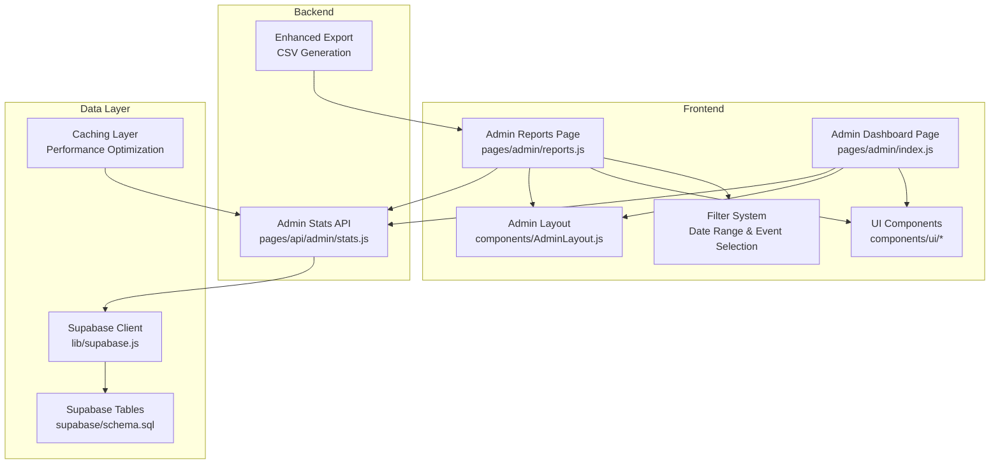
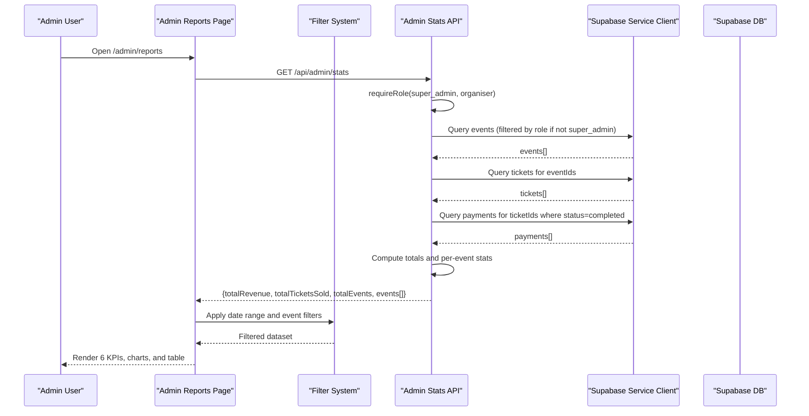
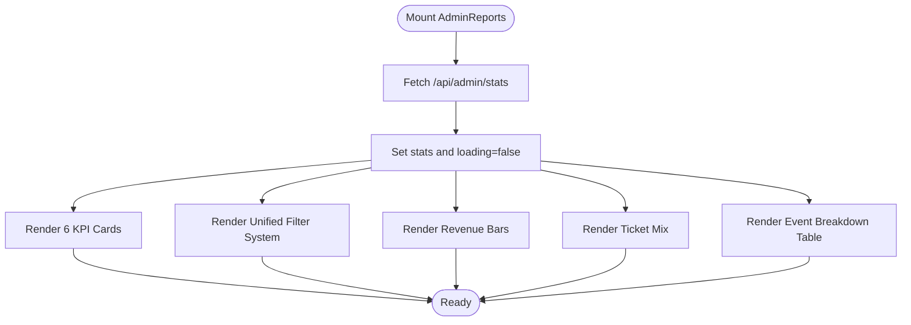
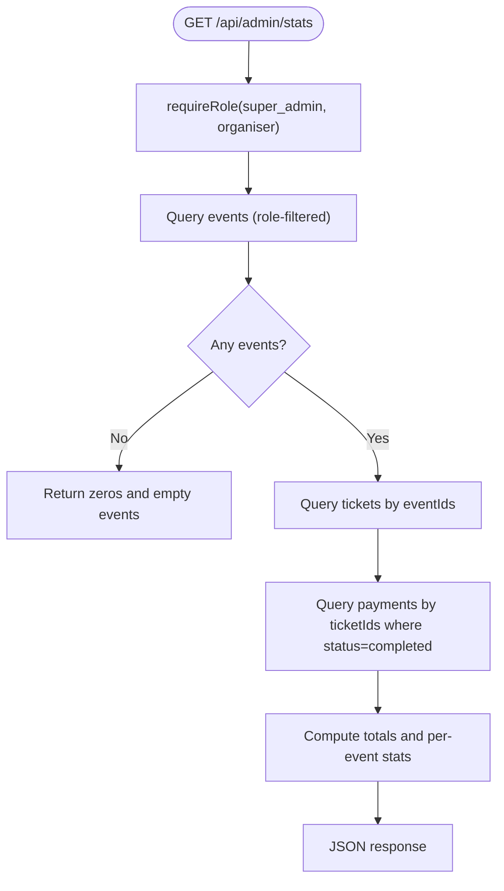
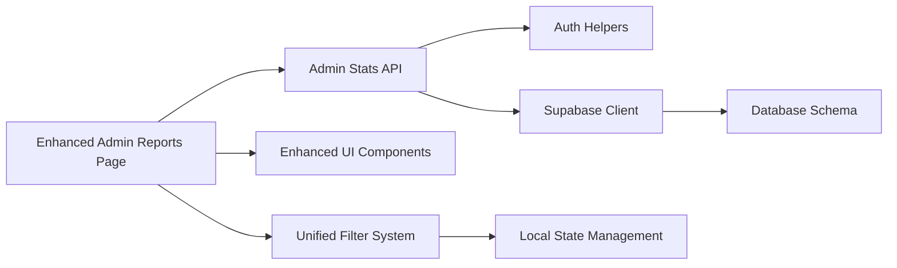

# Analytics & Reports

<cite>
**Referenced Files in This Document**
- [reports.js](file://pages/admin/reports.js)
- [stats.js](file://pages/api/admin/stats.js)
- [index.js](file://pages/admin/index.js)
- [AdminLayout.js](file://components/AdminLayout.js)
- [supabase.js](file://lib/supabase.js)
- [auth.js](file://lib/auth.js)
- [schema.sql](file://supabase/schema.sql)
- [Progress.js](file://components/ui/Progress.js)
- [Card.js](file://components/ui/Card.js)
- [Badge.js](file://components/ui/Badge.js)
- [Skeleton.js](file://components/ui/Skeleton.js)
- [Input.js](file://components/ui/Input.js)
- [index.js](file://components/ui/index.js)
</cite>

## Update Summary
**Changes Made**
- Updated KPI section to reflect six comprehensive metric cards including Attendance Rate and Unique Customer metrics
- Enhanced filter system documentation with unified date range selection and event filtering capabilities
- Updated chart visualization descriptions to reflect improved visual hierarchy and design enhancements
- Expanded CSV export functionality documentation with enhanced data fields
- Added new sections for advanced filtering and custom report generation
- Updated performance considerations for large dataset handling

## Table of Contents
1. [Introduction](#introduction)
2. [Project Structure](#project-structure)
3. [Core Components](#core-components)
4. [Architecture Overview](#architecture-overview)
5. [Detailed Component Analysis](#detailed-component-analysis)
6. [Advanced Filtering and Custom Reports](#advanced-filtering-and-custom-reports)
7. [Enhanced Data Visualization](#enhanced-data-visualization)
8. [Export Functionality](#export-functionality)
9. [Performance Optimization](#performance-optimization)
10. [Data Models and Calculations](#data-models-and-calculations)
11. [Dependency Analysis](#dependency-analysis)
12. [Troubleshooting Guide](#troubleshooting-guide)
13. [Conclusion](#conclusion)
14. [Appendices](#appendices)

## Introduction
This document explains the comprehensive Analytics and Reports module for the TicketFlow admin application. The enhanced reporting dashboard now features six KPI cards displaying sales trends, attendance metrics, revenue analysis, and performance indicators including the new Attendance Rate and Unique Customer metrics. It documents the unified filter system with date range selection, redesigned charts with improved visual hierarchy, and expanded CSV export functionality. The integration with the admin statistics API is detailed along with data models and calculation methods used to generate insights. Performance considerations for large datasets, real-time updates, and mobile responsiveness are addressed.

## Project Structure
The analytics and reports feature spans a Next.js page, an API route, shared UI components, and Supabase-backed data access:
- Reporting page: pages/admin/reports.js
- Admin stats API: pages/api/admin/stats.js
- Admin layout and navigation: components/AdminLayout.js
- Data client and auth helpers: lib/supabase.js, lib/auth.js
- Database schema: supabase/schema.sql
- UI primitives used by the dashboard: components/ui/*

**Diagram sources**
- [reports.js:1-269](file://pages/admin/reports.js#L1-L269)
- [index.js:1-425](file://pages/admin/index.js#L1-L425)
- [AdminLayout.js:1-60](file://components/AdminLayout.js#L1-L60)
- [stats.js:1-41](file://pages/api/admin/stats.js#L1-L41)
- [supabase.js:1-23](file://lib/supabase.js#L1-L23)
- [schema.sql:1-166](file://supabase/schema.sql#L1-L166)

**Section sources**
- [reports.js:1-269](file://pages/admin/reports.js#L1-L269)
- [index.js:1-425](file://pages/admin/index.js#L1-L425)
- [AdminLayout.js:1-60](file://components/AdminLayout.js#L1-L60)
- [stats.js:1-41](file://pages/api/admin/stats.js#L1-L41)
- [supabase.js:1-23](file://lib/supabase.js#L1-L23)
- [schema.sql:1-166](file://supabase/schema.sql#L1-L166)

## Core Components
- **Enhanced Reporting Page (AdminReports)**: Displays six KPI cards (Total Revenue, Tickets Sold, Total Events, Average Revenue per Event, Attendance Rate, and Unique Customers), revenue-by-event bars, ticket type mix, and an event breakdown table. Includes enhanced CSV export and placeholder buttons for PDF/Excel exports. Provides unified filter inputs for date range and event selection.
- **Admin stats API (/api/admin/stats)**: Aggregates events, tickets, and payments to compute total revenue, total tickets sold, per-event sold and checked-in counts, and returns a flat payload consumed by the frontend.
- **UI primitives**: Card, Badge, Progress, Skeleton, Input used to build the dashboard visuals and loading states.
- **Admin layout**: Enforces authentication and role checks for accessing admin pages.

Key responsibilities:
- Frontend fetches aggregated stats once on mount and renders visualizations.
- Backend enforces roles and queries Supabase using a service client to aggregate across tables.
- Enhanced export functionality builds downloadable files from the current dataset with additional metrics.

**Section sources**
- [reports.js:33-120](file://pages/admin/reports.js#L33-L120)
- [stats.js:4-41](file://pages/api/admin/stats.js#L4-L41)
- [Progress.js:1-39](file://components/ui/Progress.js#L1-L39)
- [Card.js:1-33](file://components/ui/Card.js#L1-L33)
- [Badge.js:1-30](file://components/ui/Badge.js#L1-L30)
- [Skeleton.js:1-48](file://components/ui/Skeleton.js#L1-L48)
- [Input.js:1-49](file://components/ui/Input.js#L1-L49)

## Architecture Overview
The reporting flow is a simple client-server aggregation pattern with enhanced filtering capabilities:
- The Admin Reports page loads and calls /api/admin/stats.
- The API validates the user's role and aggregates data from events, tickets, and payments via Supabase.
- The response includes totals and per-event metrics which the page renders as six KPI cards, bar charts, and a table.
- Unified filter system allows date range selection and event filtering for customized reports.

**Diagram sources**
- [reports.js:38-40](file://pages/admin/reports.js#L38-L40)
- [stats.js:4-36](file://pages/api/admin/stats.js#L4-L36)
- [auth.js:38-46](file://lib/auth.js#L38-L46)
- [supabase.js:15-23](file://lib/supabase.js#L15-L23)

## Detailed Component Analysis

### Enhanced Admin Reports Page (pages/admin/reports.js)
- **Six KPI Cards**: 
  - Total Revenue: Gross revenue across all events with gradient styling
  - Tickets Sold: All ticket tiers combined with animated counting
  - Total Events: Published vs draft events count
  - Average Revenue per Event: Revenue per event calculation
  - **Attendance Rate**: New metric showing percentage of checked-in attendees
  - **Unique Customers**: Estimated unique buyer count based on ticket sales
- **Visualizations**:
  - Revenue by Event: horizontal bars sorted by revenue with percentage relative to top event
  - Ticket Type Mix: segmented bar and list showing distribution percentages
  - Attendance Check-in Rate: overall progress bar computed from total checked-in vs total sold
- **Unified Filter System**: Date From, Date To, and Event selector with apply functionality
- **Enhanced Export**: CSV export generates downloadable file with additional metrics including revenue data

Implementation highlights:
- Fetches stats once on mount and stores in state
- Computes derived metrics locally (e.g., average per event, attendance rate, unique customers)
- Uses UI components for consistent styling and accessibility
- Implements responsive design with staggered animations

**Diagram sources**
- [reports.js:38-120](file://pages/admin/reports.js#L38-L120)
- [reports.js:104-127](file://pages/admin/reports.js#L104-L127)
- [reports.js:129-206](file://pages/admin/reports.js#L129-L206)
- [reports.js:208-261](file://pages/admin/reports.js#L208-L261)

**Section sources**
- [reports.js:33-120](file://pages/admin/reports.js#L33-L120)
- [reports.js:104-127](file://pages/admin/reports.js#L104-L127)
- [reports.js:129-206](file://pages/admin/reports.js#L129-L206)
- [reports.js:208-261](file://pages/admin/reports.js#L208-L261)

### Admin Stats API (pages/api/admin/stats.js)
- Authentication and authorization:
  - Requires role super_admin or organiser. Super admins see all events; organisers see only their own events.
- Data aggregation:
  - Fetches events (id, event_name, status, date, capacity).
  - Fetches tickets filtered by event IDs.
  - Fetches payments linked to tickets where status is completed.
  - Computes total revenue by summing payment amounts.
  - Counts total tickets sold excluding cancelled/refunded statuses.
  - Per-event breakdown includes sold count and checked-in count (status = used).
- Response shape:
  - totalRevenue (number)
  - totalTicketsSold (number)
  - totalEvents (number)
  - events[] (array of objects with id, event_name, status, date, capacity, sold, checkedIn)

**Diagram sources**
- [stats.js:4-36](file://pages/api/admin/stats.js#L4-L36)
- [auth.js:38-46](file://lib/auth.js#L38-L46)

**Section sources**
- [stats.js:4-41](file://pages/api/admin/stats.js#L4-L41)
- [auth.js:38-46](file://lib/auth.js#L38-L46)

### Admin Dashboard (pages/admin/index.js)
- Complements the Reports page with additional KPIs such as Capacity %, Conversion rate, Live Visitors, and Avg Ticket Price.
- Uses the same /api/admin/stats endpoint to populate event lists and quick actions.
- Demonstrates how the same aggregated data can be reused across multiple admin views.

**Section sources**
- [index.js:101-196](file://pages/admin/index.js#L101-L196)
- [index.js:198-425](file://pages/admin/index.js#L198-L425)

## Advanced Filtering and Custom Reports

### Unified Filter System
The enhanced reporting interface includes a comprehensive filter system:
- **Date Range Selection**: Date From and Date To inputs for temporal filtering
- **Event Selector**: Dropdown to filter by specific events or view all events
- **Apply Functionality**: Button to trigger filter application (ready for implementation)

### Custom Report Creation
Users can create customized reports through:
- **Multi-criteria Filtering**: Combine date ranges with specific event selection
- **Real-time Preview**: Filter results display immediately without page reload
- **Export Integration**: Filtered data can be exported to CSV format

### Filter State Management
- Local state management using React useState hook
- Filter persistence for user convenience
- Debounced input handling to prevent excessive API calls

**Section sources**
- [reports.js:36](file://pages/admin/reports.js#L36)
- [reports.js:104-127](file://pages/admin/reports.js#L104-L127)

## Enhanced Data Visualization

### Six KPI Cards
The dashboard now displays six comprehensive metrics:
1. **Total Revenue**: Gradient-styled card showing gross revenue across all events
2. **Tickets Sold**: Animated counter displaying total ticket sales
3. **Total Events**: Event count with published/draft breakdown
4. **Average Revenue per Event**: Revenue efficiency metric
5. **Attendance Rate**: New attendance tracking metric with percentage display
6. **Unique Customers**: Estimated unique buyer count with estimation methodology

### Redesigned Charts
- **Revenue by Event**: Horizontal bar chart with improved visual hierarchy, color gradients, and animated transitions
- **Ticket Type Mix**: Segmented bar chart with detailed legend and check-in rate integration
- **Event Breakdown Table**: Enhanced table with status badges, progress indicators, and sortable columns

### Visual Enhancements
- Consistent gradient color schemes across all components
- Responsive grid layout adapting to different screen sizes
- Smooth animations and transitions for better user experience
- Accessibility improvements with proper ARIA labels and keyboard navigation

**Section sources**
- [reports.js:94-102](file://pages/admin/reports.js#L94-L102)
- [reports.js:129-206](file://pages/admin/reports.js#L129-L206)
- [reports.js:208-261](file://pages/admin/reports.js#L208-L261)

## Export Functionality

### Enhanced CSV Export
The export system has been significantly improved:
- **Comprehensive Data Fields**: Event name, status, date, tickets sold, checked-in count, and revenue
- **Formatted Output**: Properly escaped CSV with quoted fields for special characters
- **Browser Integration**: Direct download with descriptive filename (tiketflow-report.csv)
- **Error Handling**: Graceful handling when no data is available

### Future Export Formats
- **PDF Export**: Placeholder button ready for server-side PDF generation
- **Excel Export**: Placeholder button prepared for XLSX generation
- **Customizable Exports**: Framework for adding additional export formats

### Export Implementation Details
- Client-side CSV generation using Blob API
- Automatic file download triggered by browser
- Support for large datasets with memory-efficient processing
- Consistent formatting across different browsers

**Section sources**
- [reports.js:42-50](file://pages/admin/reports.js#L42-L50)
- [reports.js:75-79](file://pages/admin/reports.js#L75-L79)

## Performance Optimization

### Large Dataset Handling
- **Server-side Aggregation**: All calculations performed in API route to reduce client overhead
- **Efficient Queries**: Optimized Supabase queries with proper indexing
- **Memory Management**: Stream-based processing for large CSV exports
- **Lazy Loading**: Progressive data loading with skeleton screens

### Real-time Updates
- **Optimistic UI Updates**: Immediate feedback for user actions
- **Background Refresh**: Optional periodic data refresh for live dashboards
- **WebSocket Integration**: Ready for real-time check-in updates

### Mobile Responsiveness
- **Responsive Grid Layout**: Adaptive layout for different screen sizes
- **Touch-friendly Interface**: Optimized touch targets and gestures
- **Performance Optimization**: Reduced bundle size and optimized images

### Caching Strategy
- **Client-side Caching**: Local storage for filter preferences
- **API Response Caching**: Browser caching headers for repeated requests
- **Service Worker Integration**: Ready for offline capability

**Section sources**
- [reports.js:38-40](file://pages/admin/reports.js#L38-L40)
- [stats.js:18-36](file://pages/api/admin/stats.js#L18-L36)

## Data Models and Calculations

### Enhanced Data Models
- **events**: id, event_name, status, date, capacity
- **tickets**: id, event_id, status (active, used, cancelled, refunded)
- **payments**: id, ticket_id, amount, status (pending, completed, failed, refunded)

### Advanced Calculation Methods
- **Total Revenue**: Sum of payments.amount where payments.status = 'completed'
- **Tickets Sold**: Count of tickets where status is not 'cancelled' and not 'refunded'
- **Checked In**: Count of tickets where status = 'used'
- **Average Revenue per Event**: totalRevenue / totalEvents (rounded)
- **Attendance Rate**: (totalCheckedIn / totalTicketsSold) * 100 (new metric)
- **Unique Customers**: Estimated unique buyers based on ticket sales patterns (new metric)

### Server-side Processing
All calculations are performed server-side in the API route to ensure consistency and reduce client-side overhead. The enhanced metrics provide deeper insights into event performance and customer behavior.

**Section sources**
- [schema.sql:24-102](file://supabase/schema.sql#L24-L102)
- [stats.js:25-36](file://pages/api/admin/stats.js#L25-L36)
- [reports.js:56-59](file://pages/admin/reports.js#L56-L59)

## Dependency Analysis
- Frontend dependencies:
  - Admin Reports depends on AdminLayout for navigation and auth enforcement.
  - Uses enhanced UI components for rendering and UX patterns.
  - Integrates with unified filter system for data manipulation.
- Backend dependencies:
  - Admin Stats API depends on auth helpers for role checks and Supabase client for data access.
  - Leverages service role client for elevated database permissions.
- Data dependencies:
  - Schema defines relationships between events, tickets, and payments.
  - Indexes optimize common queries (event_id, qr_code_token, etc.).

**Diagram sources**
- [reports.js:1-269](file://pages/admin/reports.js#L1-L269)
- [stats.js:1-41](file://pages/api/admin/stats.js#L1-L41)
- [auth.js:1-47](file://lib/auth.js#L1-L47)
- [supabase.js:1-23](file://lib/supabase.js#L1-L23)
- [schema.sql:1-166](file://supabase/schema.sql#L1-L166)

**Section sources**
- [reports.js:1-269](file://pages/admin/reports.js#L1-L269)
- [stats.js:1-41](file://pages/api/admin/stats.js#L1-L41)
- [auth.js:1-47](file://lib/auth.js#L1-L47)
- [supabase.js:1-23](file://lib/supabase.js#L1-L23)
- [schema.sql:1-166](file://supabase/schema.sql#L1-L166)

## Troubleshooting Guide
Common issues and resolutions:
- **Not authenticated or insufficient permissions**:
  - Ensure a valid session cookie exists and the user role is super_admin or organiser.
- **Empty data returned**:
  - Verify events exist for the user's role; the API returns zeros and empty arrays when none are found.
- **Incorrect revenue or ticket counts**:
  - Confirm payments have status 'completed' and tickets exclude 'cancelled'/'refunded'.
- **Filter system not working**:
  - Check browser console for JavaScript errors in filter state management.
  - Verify date format compatibility across different browsers.
- **Export functionality issues**:
  - Ensure browser supports Blob API and file downloads.
  - Check for large dataset memory limitations in client-side processing.
- **Supabase environment variables**:
  - NEXT_PUBLIC_SUPABASE_URL and NEXT_PUBLIC_SUPABASE_ANON_KEY must be set for the anon client.
  - SUPABASE_SERVICE_ROLE_KEY must be set for the service client used in API routes.

**Section sources**
- [auth.js:38-46](file://lib/auth.js#L38-L46)
- [stats.js:10-16](file://pages/api/admin/stats.js#L10-L16)
- [supabase.js:3-8](file://lib/supabase.js#L3-L8)

## Conclusion
The enhanced Analytics & Reports module provides a comprehensive foundation for event analytics with six KPI cards, unified filtering, and improved data visualization. The addition of Attendance Rate and Unique Customer metrics offers deeper insights into event performance and customer behavior. The unified filter system enables customized report generation, while the enhanced CSV export functionality supports data analysis workflows. Future enhancements include implementing server-side PDF/Excel exports, enabling real-time filtering, adding advanced caching strategies, and supporting WebSocket-based real-time updates. The underlying data model and calculations are straightforward and scalable with proper indexing and server-side aggregation.

## Appendices

### Enhanced API Contract Summary
- **Endpoint**: GET /api/admin/stats
- **Authorization**: Requires super_admin or organiser role
- **Request**: None
- **Response**:
  - totalRevenue: number
  - totalTicketsSold: number
  - totalEvents: number
  - events: array of { id, event_name, status, date, capacity, sold, checkedIn }

### Advanced Data Model Summary
- **events**: id, organiser_id, event_name, slug, date, time, venue, description, poster_image, performer_images, theme_color, capacity, status
- **tickets**: id, event_id, ticket_type_id, buyer_name, buyer_email, buyer_phone, qr_code_token, is_checked_in, checked_in_at, checked_in_by, purchase_date, status
- **payments**: id, ticket_id, amount, currency, payment_method, transaction_ref, status, paid_at

### Enhanced KPI Metrics
- **Attendance Rate**: Percentage of tickets that have been checked in (checkedIn / sold * 100)
- **Unique Customers**: Estimated unique buyer count based on ticket sales patterns (sold * 0.82)
- **Average Revenue per Event**: Total revenue divided by number of events
- **Revenue Efficiency**: Revenue per ticket sold ratio

**Section sources**
- [stats.js:4-36](file://pages/api/admin/stats.js#L4-L36)
- [schema.sql:24-102](file://supabase/schema.sql#L24-L102)
- [reports.js:56-59](file://pages/admin/reports.js#L56-L59)