# Dashboard Overview

<cite>
**Referenced Files in This Document**
- [pages/admin/index.js](file://pages/admin/index.js)
- [components/AdminLayout.js](file://components/AdminLayout.js)
- [pages/api/admin/stats.js](file://pages/api/admin/stats.js)
- [components/ui/Skeleton.js](file://components/ui/Skeleton.js)
- [components/ui/Card.js](file://components/ui/Card.js)
- [components/ui/Progress.js](file://components/ui/Progress.js)
- [components/ui/Badge.js](file://components/ui/Badge.js)
- [components/ui/Button.js](file://components/ui/Button.js)
- [components/ui/index.js](file://components/ui/index.js)
- [pages/styles/global.css](file://pages/styles/global.css)
- [lib/auth.js](file://lib/auth.js)
</cite>

## Update Summary
**Changes Made**
- Updated KPI cards section to reflect new 8-card layout with Total Revenue, Tickets Sold, Available Tickets, Attendance Rate, Active Events, Capacity Used, Avg Ticket Price, and Conversion Rate
- Added detailed documentation for animated counter components and gradient accent system
- Enhanced quick actions panel documentation with new action types
- Updated chart components section to include revenue bar charts and ticket mix donut charts
- Expanded activity timeline documentation with real-time feed functionality
- Enhanced responsive grid layout system documentation with CSS Grid implementation
- Updated loading states documentation with skeleton component variants
- Improved error handling patterns documentation
- Enhanced API integration documentation with real-time data refresh mechanisms

## Table of Contents
1. [Introduction](#introduction)
2. [Project Structure](#project-structure)
3. [Core Components](#core-components)
4. [Architecture Overview](#architecture-overview)
5. [Detailed Component Analysis](#detailed-component-analysis)
6. [Dependency Analysis](#dependency-analysis)
7. [Performance Considerations](#performance-considerations)
8. [Troubleshooting Guide](#troubleshooting-guide)
9. [Conclusion](#conclusion)

## Introduction
The Admin Dashboard provides a centralized, real-time overview for administrators to monitor event performance and key business indicators. The redesigned interface features 8 premium KPI cards displaying Total Revenue, Tickets Sold, Available Tickets, Attendance Rate, Active Events, Capacity Used, Average Ticket Price, and Conversion Rate. Each card includes animated counters, gradient accents, and trend indicators. Administrators can quickly perform common tasks via the enhanced Quick Actions panel (create events, scan tickets, view reports, manage staff, create promo codes, export data). The dashboard also highlights top performing events with progress indicators and shows a recent activity timeline with live updates. The layout uses a responsive CSS Grid system with glassmorphism effects, includes skeleton loading states, and integrates with an admin statistics API endpoint for real-time data visualization.

## Project Structure
The dashboard is implemented as a Next.js page that composes reusable UI components and renders within the Admin Layout. Data is fetched from a server-side API route that enforces role-based access and aggregates metrics from the database.

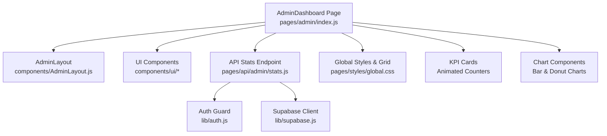

**Diagram sources**
- [pages/admin/index.js](file://pages/admin/index.js)
- [components/AdminLayout.js](file://components/AdminLayout.js)
- [pages/api/admin/stats.js](file://pages/api/admin/stats.js)
- [lib/auth.js](file://lib/auth.js)
- [pages/styles/global.css](file://pages/styles/global.css)

**Section sources**
- [pages/admin/index.js](file://pages/admin/index.js)
- [components/AdminLayout.js](file://components/AdminLayout.js)
- [pages/api/admin/stats.js](file://pages/api/admin/stats.js)
- [lib/auth.js](file://lib/auth.js)
- [pages/styles/global.css](file://pages/styles/global.css)

## Core Components
- **Enhanced KPI Cards**: 8 premium stat cards with gradient backgrounds, animated counters, trend indicators, and icon badges. Metrics include Total Revenue ($), Tickets Sold (count), Available Tickets (remaining capacity), Attendance Rate (%), Active Events (published count), Capacity Used (%), Average Ticket Price ($), and Conversion Rate (%).
- **Quick Actions Panel**: Enhanced shortcut cards with 6 primary actions: Create Event, Scan Tickets, View Reports, Manage Staff, Promo Codes, and Export Data. Each card features unique icons, background colors, and navigates to corresponding admin routes.
- **Top Performing Events**: Ranked list of events by tickets sold, each showing rank badges, progress bars indicating sold vs capacity, and click-to-navigate functionality.
- **Recent Activity Timeline**: Real-time feed showing sales, publications, check-ins, revenue milestones, customer registrations, and refund requests with type-specific icons and timestamps.
- **Revenue Chart**: Bar chart displaying monthly revenue performance with gradient bars and hover tooltips.
- **Ticket Mix Chart**: Donut chart showing distribution across ticket types (General, VIP, Early Bird, Student) with color-coded legend.

These components are built using shared UI primitives like Card, Badge, Progress, Button, and Skeleton with premium styling.

**Section sources**
- [pages/admin/index.js](file://pages/admin/index.js)
- [components/ui/Card.js](file://components/ui/Card.js)
- [components/ui/Badge.js](file://components/ui/Badge.js)
- [components/ui/Progress.js](file://components/ui/Progress.js)
- [components/ui/Button.js](file://components/ui/Button.js)
- [components/ui/Skeleton.js](file://components/ui/Skeleton.js)

## Architecture Overview
The dashboard follows a client-server pattern with real-time data visualization:
- The AdminDashboard component mounts and immediately calls the /api/admin/stats endpoint.
- The stats API enforces authentication and roles, then aggregates metrics across events, tickets, and payments.
- The response populates the 8 KPI cards, top events, activity sections, and chart components.
- The AdminLayout handles navigation, command palette, and user session checks before rendering the page content.
- Real-time updates are simulated through dynamic activity items and animated transitions.

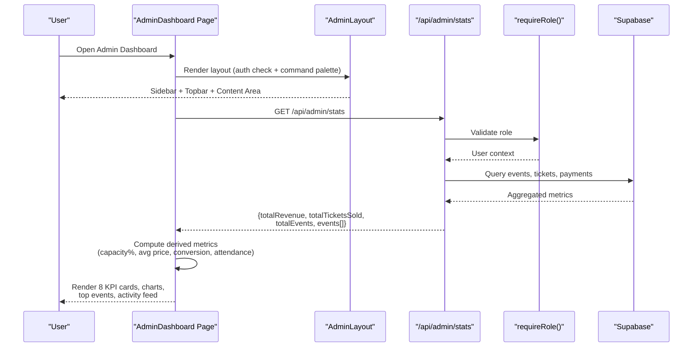

**Diagram sources**
- [pages/admin/index.js](file://pages/admin/index.js)
- [components/AdminLayout.js](file://components/AdminLayout.js)
- [pages/api/admin/stats.js](file://pages/api/admin/stats.js)
- [lib/auth.js](file://lib/auth.js)

## Detailed Component Analysis

### Enhanced KPI Cards System
- **Purpose**: Present 8 high-level KPIs at a glance with visual emphasis and real-time updates.
- **Metrics Displayed**: Total Revenue, Tickets Sold, Available Tickets, Attendance Rate, Active Events, Capacity Used, Average Ticket Price, and Conversion Rate.
- **Visual Features**: Gradient backgrounds (8 unique gradients), animated counters with pulse effects, trend indicators (up/down arrows), icon badges, and hover animations.
- **Data Source**: Derived from stats payload with client-side calculations for percentages and averages.

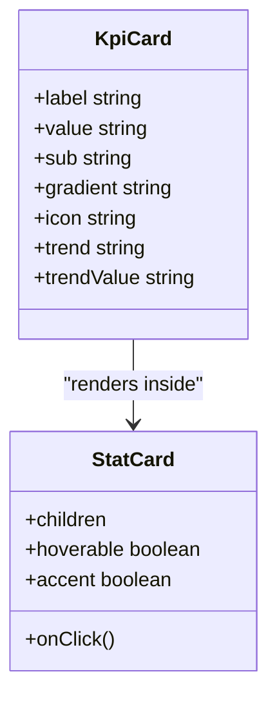

**Diagram sources**
- [pages/admin/index.js](file://pages/admin/index.js)
- [components/ui/Card.js](file://components/ui/Card.js)

**Section sources**
- [pages/admin/index.js](file://pages/admin/index.js)
- [components/ui/Card.js](file://components/ui/Card.js)

### Quick Actions Panel Enhancement
- **Purpose**: Provide fast access to 6 frequent administrative tasks with enhanced visual design.
- **Actions Available**:
  - Create Event → navigates to /admin/events/new
  - Scan Tickets → navigates to /checkin
  - View Reports → navigates to /admin/reports
  - Manage Staff → navigates to /admin/staff
  - Promo Codes → navigates to /admin/promo-codes
  - Export Data → navigates to /admin/reports
- **Interaction**: Clicking a card triggers client-side routing via Next.js router with ripple effects.
- **Visual Design**: Each action has unique icon, background color, title, subtitle, and arrow indicator.

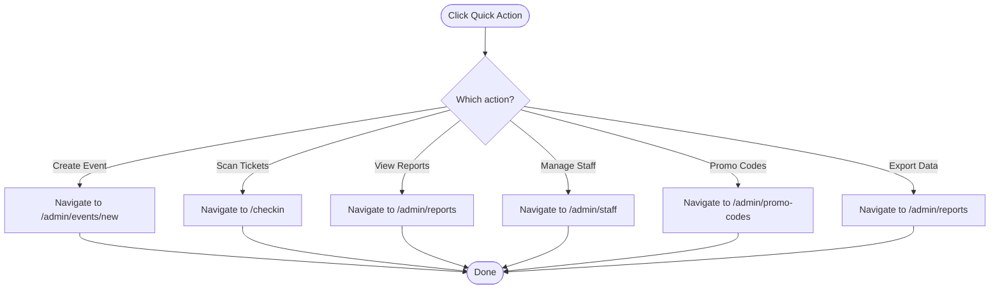

**Diagram sources**
- [pages/admin/index.js](file://pages/admin/index.js)

**Section sources**
- [pages/admin/index.js](file://pages/admin/index.js)

### Chart Components System
- **Revenue Bar Chart**: Displays monthly revenue performance with gradient bars, hover tooltips showing values, and responsive height scaling.
- **Ticket Mix Donut Chart**: Shows distribution across ticket types with conic-gradient visualization, center total display, and color-coded legend.
- **Interactive Features**: Hover effects, value tooltips, smooth animations, and responsive sizing.

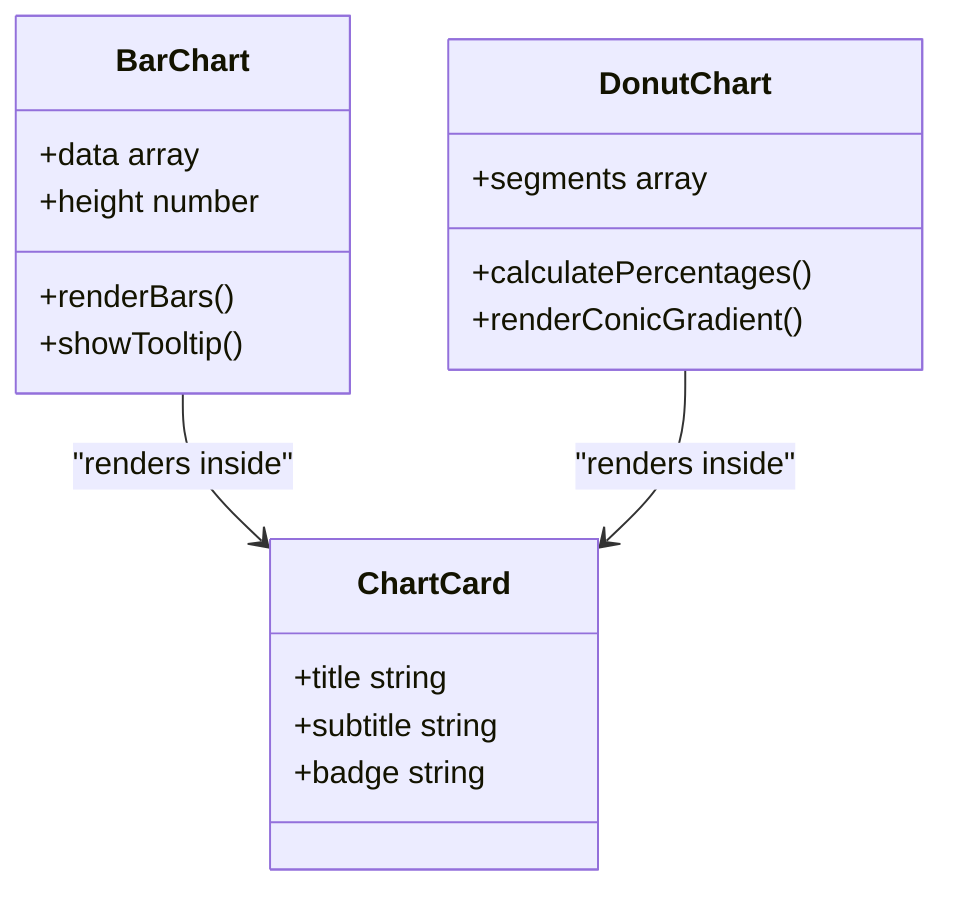

**Diagram sources**
- [pages/admin/index.js](file://pages/admin/index.js)

**Section sources**
- [pages/admin/index.js](file://pages/admin/index.js)

### Recent Activity Timeline Enhancement
- **Purpose**: Show real-time operational events with dynamic content generation.
- **Activity Types**: Ticket sales, event publishing, check-ins, revenue milestones, customer registrations, and refund requests.
- **Visual Elements**: Type-specific icons, colored backgrounds, timestamps, and descriptive text.
- **Real-time Simulation**: Dynamic content generation with random values and timestamps to simulate live updates.

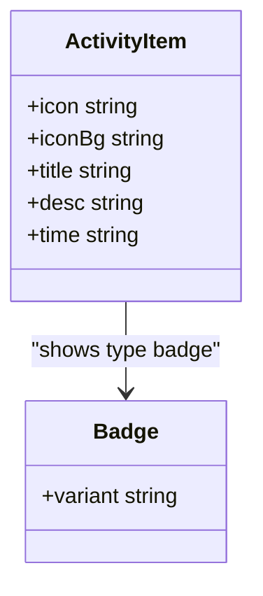

**Diagram sources**
- [pages/admin/index.js](file://pages/admin/index.js)
- [components/ui/Badge.js](file://components/ui/Badge.js)

**Section sources**
- [pages/admin/index.js](file://pages/admin/index.js)
- [components/ui/Badge.js](file://components/ui/Badge.js)

### Responsive Grid Layout System
- **Implementation**: Uses CSS Grid with auto-fit and minmax functions for fluid, responsive layouts.
- **Grid Patterns**: 
  - KPI Grid: `repeat(auto-fit, minmax(220px, 1fr))` for 8 KPI cards
  - Quick Actions: `repeat(auto-fit, minmax(200px, 1fr))` for action cards
  - Chart Layout: 12-column grid system with 7/5 column splits
- **Breakpoints**: Inline styles define responsive behavior across different screen sizes.
- **Styling**: Global CSS variables provide consistent spacing, typography, and glassmorphism effects.

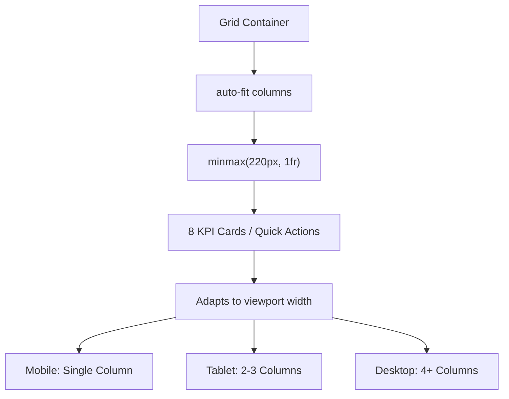

**Diagram sources**
- [pages/admin/index.js](file://pages/admin/index.js)
- [pages/styles/global.css](file://pages/styles/global.css)

**Section sources**
- [pages/admin/index.js](file://pages/admin/index.js)
- [pages/styles/global.css](file://pages/styles/global.css)

### Loading States with Skeleton Components
- **Purpose**: Provide immediate visual feedback while data loads with premium skeleton animations.
- **Implementation**: Custom skeleton placeholders render in place of KPI cards, charts, and panels until API responses arrive.
- **Variants**: Supports text, title, card, circle, button, and custom shapes with shimmer animations.
- **Animation**: Staggered fade-in animations with 0.05s delays between elements for smooth loading experience.

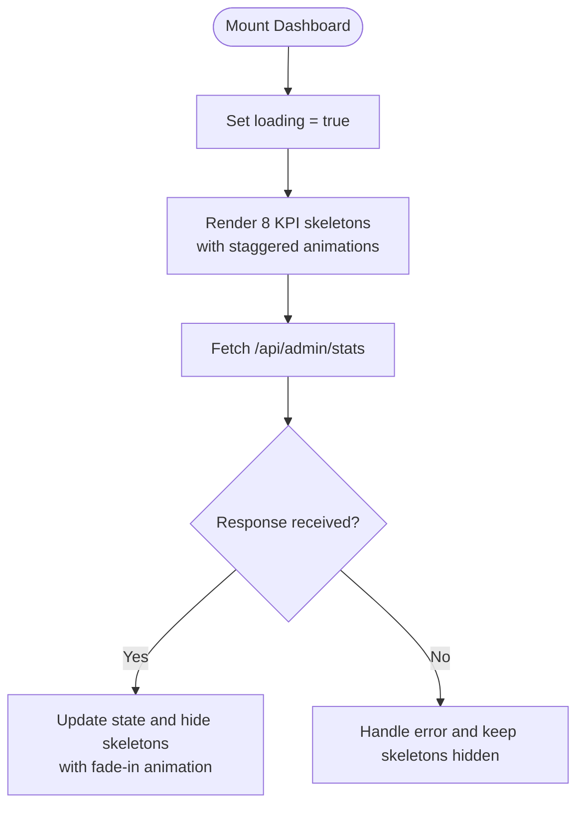

**Diagram sources**
- [pages/admin/index.js](file://pages/admin/index.js)
- [components/ui/Skeleton.js](file://components/ui/Skeleton.js)

**Section sources**
- [pages/admin/index.js](file://pages/admin/index.js)
- [components/ui/Skeleton.js](file://components/ui/Skeleton.js)

### Error Handling Patterns
- **Frontend**: The stats fetch uses try/catch-like behavior to ensure the UI remains stable even if the request fails; loading state is cleared on error.
- **Backend**: The stats API returns appropriate HTTP status codes and JSON error messages when authentication or authorization fails.
- **Auth Guard**: The AdminLayout verifies user roles and redirects unauthorized users to the login page.
- **Graceful Degradation**: Empty states handled with friendly messages and call-to-action buttons.

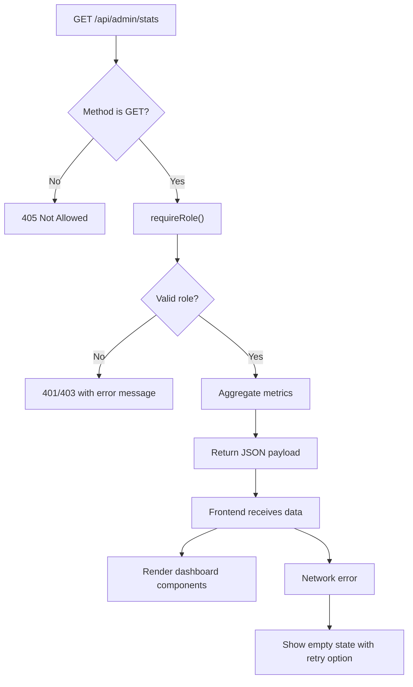

**Diagram sources**
- [pages/api/admin/stats.js](file://pages/api/admin/stats.js)
- [lib/auth.js](file://lib/auth.js)
- [components/AdminLayout.js](file://components/AdminLayout.js)

**Section sources**
- [pages/api/admin/stats.js](file://pages/api/admin/stats.js)
- [lib/auth.js](file://lib/auth.js)
- [components/AdminLayout.js](file://components/AdminLayout.js)

### Integration with Admin Statistics API and Data Refresh
- **Data Source**: The dashboard fetches aggregated metrics from /api/admin/stats on mount with comprehensive error handling.
- **Payload Structure**: Includes totalRevenue, totalTicketsSold, totalEvents, and per-event breakdowns (sold, checkedIn, capacity, revenue).
- **Client-side Calculations**: Computes derived metrics including capacity percentage, average ticket price, conversion rate, and attendance rate.
- **Refresh Mechanism**: Currently loads once on mount; additional refresh strategies (polling, manual refresh) can be added by re-invoking the fetch call.
- **Real-time Updates**: Activity feed simulates live updates with dynamic content generation.

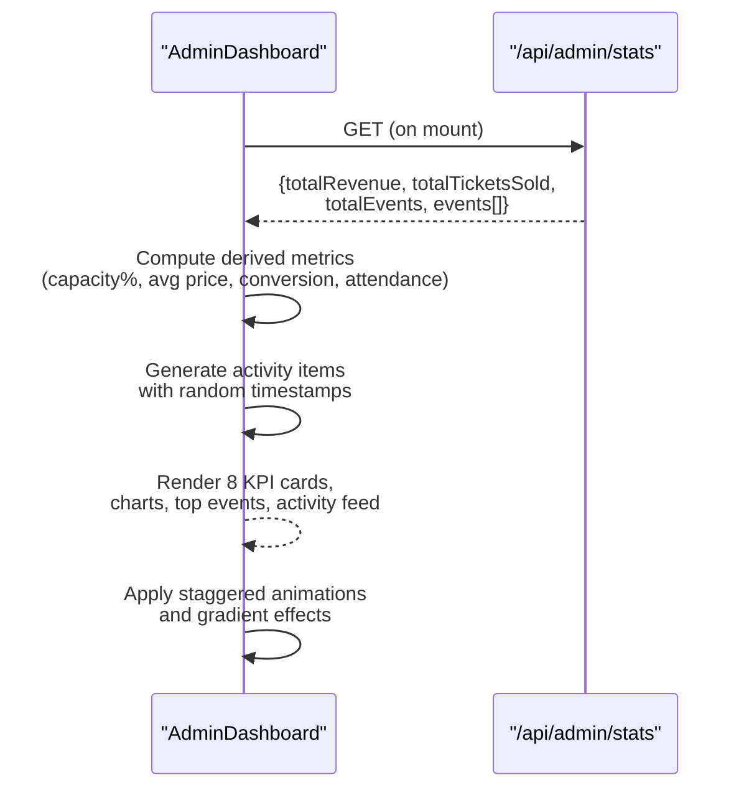

**Diagram sources**
- [pages/admin/index.js](file://pages/admin/index.js)
- [pages/api/admin/stats.js](file://pages/api/admin/stats.js)

**Section sources**
- [pages/admin/index.js](file://pages/admin/index.js)
- [pages/api/admin/stats.js](file://pages/api/admin/stats.js)

## Dependency Analysis
The dashboard depends on several core modules with enhanced component relationships:
- **UI Primitives**: Card, Badge, Progress, Button, Skeleton are exported from the UI index and used throughout the dashboard with premium styling.
- **Layout**: AdminLayout wraps the page and manages navigation, command palette, and authentication.
- **API**: The stats endpoint relies on auth utilities and Supabase client to aggregate data.
- **Charts**: Custom chart components (BarChart, DonutChart) handle data visualization.
- **Animations**: CSS animations and transitions provide smooth user interactions.

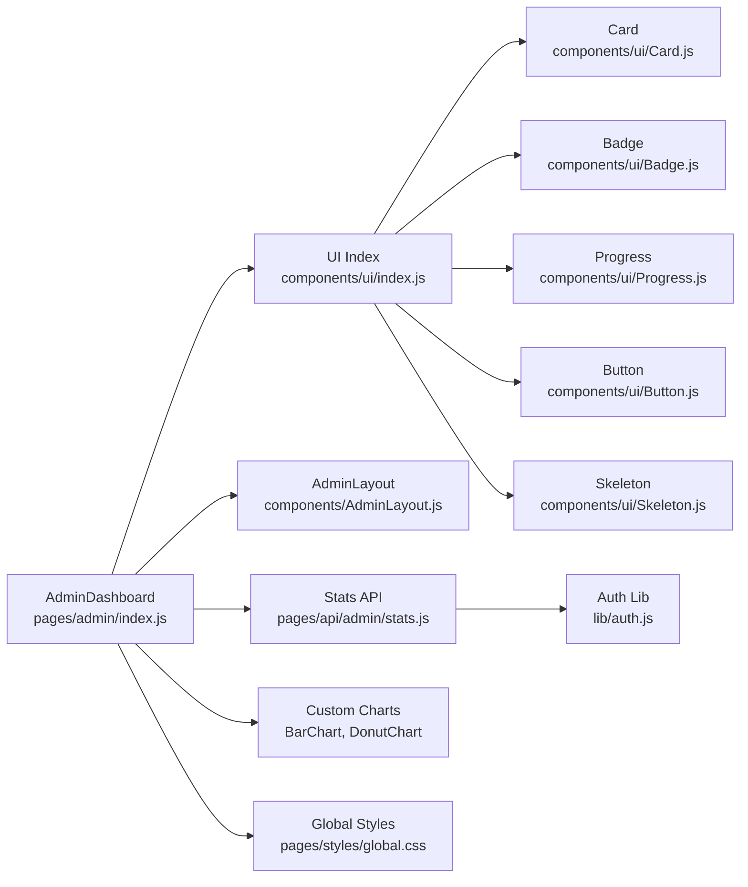

**Diagram sources**
- [components/ui/index.js](file://components/ui/index.js)
- [components/ui/Card.js](file://components/ui/Card.js)
- [components/ui/Badge.js](file://components/ui/Badge.js)
- [components/ui/Progress.js](file://components/ui/Progress.js)
- [components/ui/Button.js](file://components/ui/Button.js)
- [components/ui/Skeleton.js](file://components/ui/Skeleton.js)
- [components/AdminLayout.js](file://components/AdminLayout.js)
- [pages/api/admin/stats.js](file://pages/api/admin/stats.js)
- [lib/auth.js](file://lib/auth.js)
- [pages/styles/global.css](file://pages/styles/global.css)

**Section sources**
- [components/ui/index.js](file://components/ui/index.js)
- [components/AdminLayout.js](file://components/AdminLayout.js)
- [pages/api/admin/stats.js](file://pages/api/admin/stats.js)
- [lib/auth.js](file://lib/auth.js)
- [pages/styles/global.css](file://pages/styles/global.css)

## Performance Considerations
- **Minimal re-renders**: The dashboard computes derived metrics locally after receiving the API payload, avoiding unnecessary server calls.
- **Efficient queries**: The stats API aggregates data in parallel where possible to reduce latency.
- **UI responsiveness**: CSS Grid and skeleton components improve perceived performance during loading.
- **Animations**: Subtle animations enhance UX without impacting performance significantly.
- **Memory management**: Proper cleanup of event listeners and intervals in useEffect hooks.
- **Bundle optimization**: Lazy loading of heavy components and efficient import statements.

## Troubleshooting Guide
- **Authentication issues**: If the dashboard redirects to login, verify the user's role and session token. The AdminLayout enforces role checks against allowed roles.
- **Empty metrics**: If stat cards show zeros, confirm that events, tickets, and payments exist in the database and that the stats API returns non-empty arrays.
- **Network errors**: Ensure the /api/admin/stats endpoint is reachable and returns valid JSON. Inspect browser network logs for 4xx/5xx responses.
- **UI not updating**: Verify that the fetch callback sets the loading state correctly and that derived metrics are computed from the returned payload.
- **Chart rendering issues**: Check that chart data arrays are properly formatted and contain valid numeric values.
- **Animation problems**: Ensure CSS animations are not blocked by browser settings or conflicting styles.
- **Responsive layout issues**: Verify viewport meta tags and test across different screen sizes.

**Section sources**
- [components/AdminLayout.js](file://components/AdminLayout.js)
- [pages/api/admin/stats.js](file://pages/api/admin/stats.js)
- [pages/admin/index.js](file://pages/admin/index.js)

## Conclusion
The Admin Dashboard offers a robust, visually engaging interface for administrators to monitor event performance and execute key tasks efficiently. The redesigned interface features 8 premium KPI cards with animated counters, gradient accents, and real-time statistics visualization. Its modular architecture, clear data flow, and responsive design make it easy to maintain and extend. With solid error handling, skeleton loading states, and interactive chart components, it delivers a smooth user experience while integrating seamlessly with backend services. The enhanced quick actions panel and activity timeline provide intuitive navigation and real-time insights for effective event management.