# Dashboard Overview

<cite>
**Referenced Files in This Document**
- [pages/admin/index.js](file://pages/admin/index.js)
- [components/AdminLayout.js](file://components/AdminLayout.js)
- [pages/api/admin/stats.js](file://pages/api/admin/stats.js)
- [components/ui/Skeleton.js](file://components/ui/Skeleton.js)
- [components/ui/Card.js](file://components/ui/Card.js)
- [components/ui/Progress.js](file://components/ui/Progress.js)
- [components/ui/Badge.js](file://components/ui/Badge.js)
- [components/ui/Button.js](file://components/ui/Button.js)
- [components/ui/index.js](file://components/ui/index.js)
- [pages/styles/global.css](file://pages/styles/global.css)
- [lib/auth.js](file://lib/auth.js)
</cite>

## Table of Contents
1. [Introduction](#introduction)
2. [Project Structure](#project-structure)
3. [Core Components](#core-components)
4. [Architecture Overview](#architecture-overview)
5. [Detailed Component Analysis](#detailed-component-analysis)
6. [Dependency Analysis](#dependency-analysis)
7. [Performance Considerations](#performance-considerations)
8. [Troubleshooting Guide](#troubleshooting-guide)
9. [Conclusion](#conclusion)

## Introduction
The Admin Dashboard provides a centralized, real-time overview for administrators to monitor event performance and key business indicators. It presents stat cards for total revenue, tickets sold, capacity percentage, conversion rate, live visitors, and average ticket price. Administrators can quickly perform common tasks via the Quick Actions panel (create events, view reports, invite staff, manage promo codes). The dashboard also highlights top performing events with progress indicators and shows a recent activity timeline with live updates. The layout is responsive using a CSS grid system, includes skeleton loading states, and integrates with an admin statistics API endpoint to fetch data on load.

## Project Structure
The dashboard is implemented as a Next.js page that composes reusable UI components and renders within the Admin Layout. Data is fetched from a server-side API route that enforces role-based access and aggregates metrics from the database.

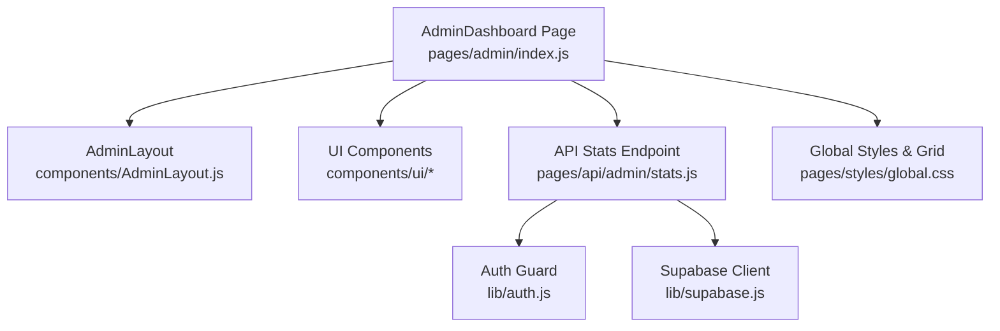

**Diagram sources**
- [pages/admin/index.js](file://pages/admin/index.js)
- [components/AdminLayout.js](file://components/AdminLayout.js)
- [pages/api/admin/stats.js](file://pages/api/admin/stats.js)
- [lib/auth.js](file://lib/auth.js)
- [pages/styles/global.css](file://pages/styles/global.css)

**Section sources**
- [pages/admin/index.js](file://pages/admin/index.js)
- [components/AdminLayout.js](file://components/AdminLayout.js)
- [pages/api/admin/stats.js](file://pages/api/admin/stats.js)
- [lib/auth.js](file://lib/auth.js)
- [pages/styles/global.css](file://pages/styles/global.css)

## Core Components
- Stat Cards: Display key metrics with gradient accents and icons. Metrics include Total Revenue, Tickets Sold, Capacity %, Conversion, Live Visitors, and Avg Ticket Price.
- Quick Actions Panel: Shortcut cards to Create Event, View Reports, Invite Staff, and Create Promo Code. Each card navigates to the corresponding admin route.
- Top Performing Events: Ranked list of events by tickets sold, each showing a progress bar indicating sold vs capacity.
- Recent Activity Timeline: A feed of recent events such as sales, publications, check-ins, and new event creation.
- Event Rows: List of all events with status badges, date, venue, and a progress indicator for capacity.

These components are built using shared UI primitives like Card, Badge, Progress, Button, and Skeleton.

**Section sources**
- [pages/admin/index.js](file://pages/admin/index.js)
- [components/ui/Card.js](file://components/ui/Card.js)
- [components/ui/Badge.js](file://components/ui/Badge.js)
- [components/ui/Progress.js](file://components/ui/Progress.js)
- [components/ui/Button.js](file://components/ui/Button.js)
- [components/ui/Skeleton.js](file://components/ui/Skeleton.js)

## Architecture Overview
The dashboard follows a client-server pattern:
- The AdminDashboard component mounts and immediately calls the /api/admin/stats endpoint.
- The stats API enforces authentication and roles, then aggregates metrics across events, tickets, and payments.
- The response populates the stat cards, top events, and activity sections.
- The AdminLayout handles navigation and user session checks before rendering the page content.

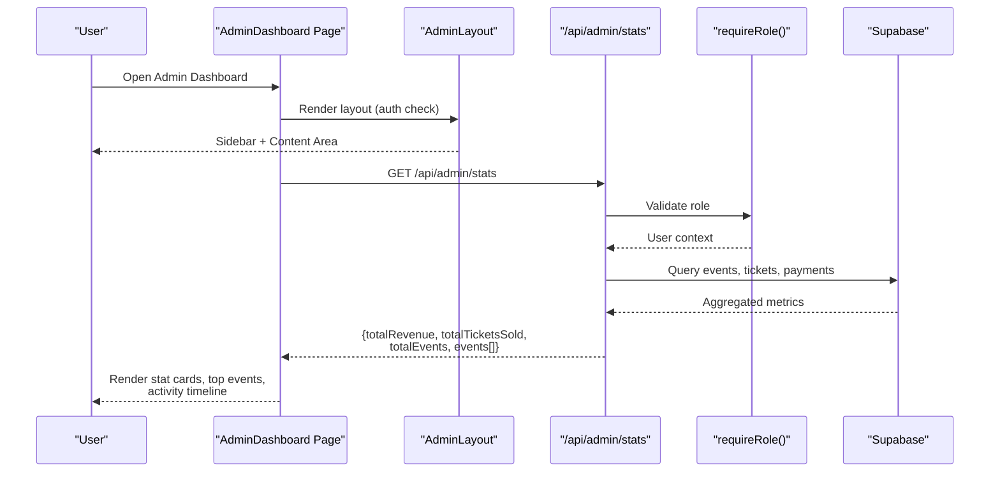

**Diagram sources**
- [pages/admin/index.js](file://pages/admin/index.js)
- [components/AdminLayout.js](file://components/AdminLayout.js)
- [pages/api/admin/stats.js](file://pages/api/admin/stats.js)
- [lib/auth.js](file://lib/auth.js)

## Detailed Component Analysis

### Stat Cards
- Purpose: Present high-level KPIs at a glance with visual emphasis.
- Behavior: Values are derived from the stats payload; some metrics are computed client-side (e.g., capacity percentage, average ticket price, conversion rate).
- Visuals: Gradient backgrounds, icon badges, and optional pulse animation for emphasis.

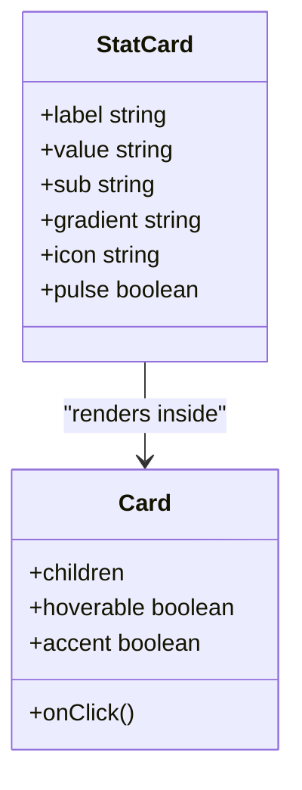

**Diagram sources**
- [pages/admin/index.js](file://pages/admin/index.js)
- [components/ui/Card.js](file://components/ui/Card.js)

**Section sources**
- [pages/admin/index.js](file://pages/admin/index.js)
- [components/ui/Card.js](file://components/ui/Card.js)

### Quick Actions Panel
- Purpose: Provide fast access to frequent administrative tasks.
- Actions:
  - Create Event → navigates to /admin/events/new
  - View Reports → navigates to /admin/reports
  - Invite Staff → navigates to /admin/staff
  - Create Promo Code → navigates to /admin/promo-codes
- Interaction: Clicking a card triggers client-side routing via Next.js router.

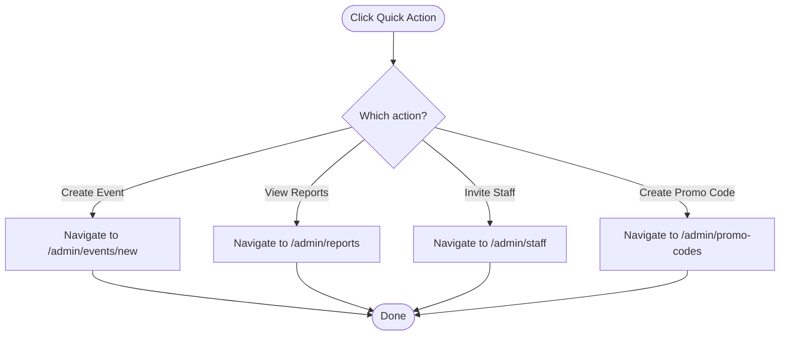

**Diagram sources**
- [pages/admin/index.js](file://pages/admin/index.js)

**Section sources**
- [pages/admin/index.js](file://pages/admin/index.js)

### Top Performing Events
- Purpose: Highlight the best-selling events by number of tickets sold.
- Behavior: Events are sorted by sold count; top three are displayed with rank badges and progress bars reflecting sold vs capacity.
- Interaction: Clicking an event navigates to its admin detail page.

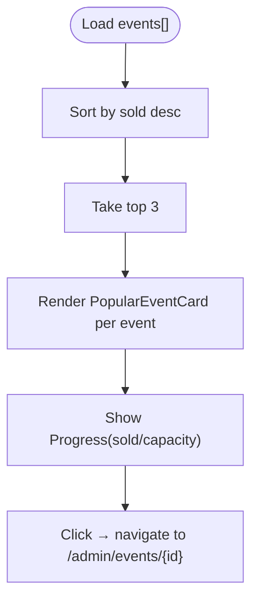

**Diagram sources**
- [pages/admin/index.js](file://pages/admin/index.js)
- [components/ui/Progress.js](file://components/ui/Progress.js)

**Section sources**
- [pages/admin/index.js](file://pages/admin/index.js)
- [components/ui/Progress.js](file://components/ui/Progress.js)

### Recent Activity Timeline
- Purpose: Show recent operational events such as ticket sales, event publishing, check-ins, and new event creation.
- Behavior: Displays items with type-specific icons and badges, timestamps, and short descriptions.
- Real-time aspect: Items are generated dynamically to simulate live updates.

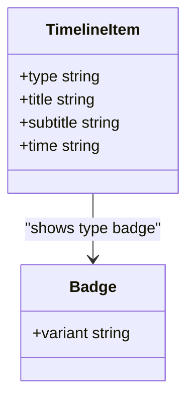

**Diagram sources**
- [pages/admin/index.js](file://pages/admin/index.js)
- [components/ui/Badge.js](file://components/ui/Badge.js)

**Section sources**
- [pages/admin/index.js](file://pages/admin/index.js)
- [components/ui/Badge.js](file://components/ui/Badge.js)

### Responsive Grid Layout System
- Implementation: Uses CSS Grid with auto-fit and minmax to create a fluid, responsive layout for stat cards and quick actions.
- Breakpoints: Inline styles define column spans for different screen sizes (e.g., md and lg), enabling flexible layouts across devices.
- Styling: Global CSS variables and utility classes provide consistent spacing, typography, and glassmorphism effects.

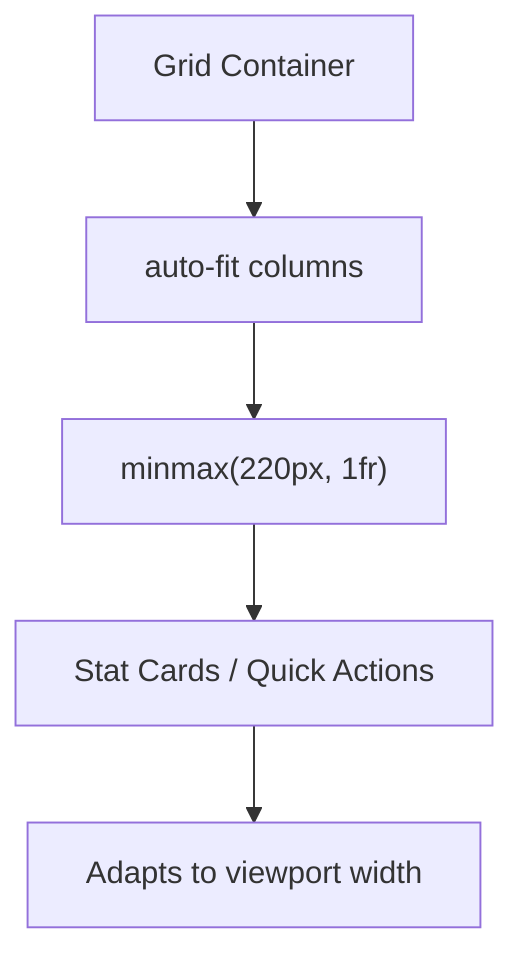

**Diagram sources**
- [pages/admin/index.js](file://pages/admin/index.js)
- [pages/styles/global.css](file://pages/styles/global.css)

**Section sources**
- [pages/admin/index.js](file://pages/admin/index.js)
- [pages/styles/global.css](file://pages/styles/global.css)

### Loading States with Skeleton Components
- Purpose: Provide immediate visual feedback while data loads.
- Implementation: Skeleton placeholders render in place of stat cards and larger panels until the API response arrives.
- Variants: Supports text, title, card, circle, button, and custom shapes.

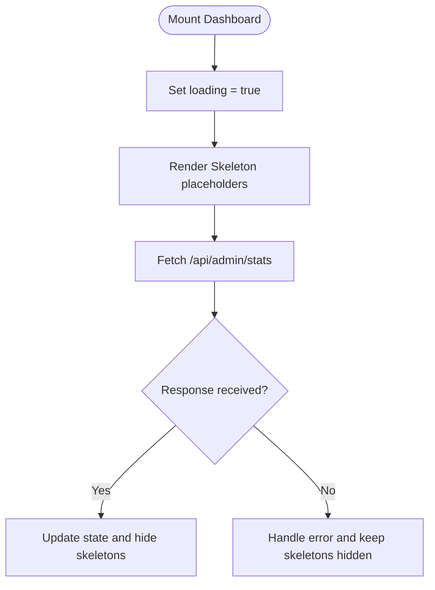

**Diagram sources**
- [pages/admin/index.js](file://pages/admin/index.js)
- [components/ui/Skeleton.js](file://components/ui/Skeleton.js)

**Section sources**
- [pages/admin/index.js](file://pages/admin/index.js)
- [components/ui/Skeleton.js](file://components/ui/Skeleton.js)

### Error Handling Patterns
- Frontend: The stats fetch uses try/catch-like behavior to ensure the UI remains stable even if the request fails; loading state is cleared on error.
- Backend: The stats API returns appropriate HTTP status codes and JSON error messages when authentication or authorization fails.
- Auth Guard: The AdminLayout verifies user roles and redirects unauthorized users to the login page.

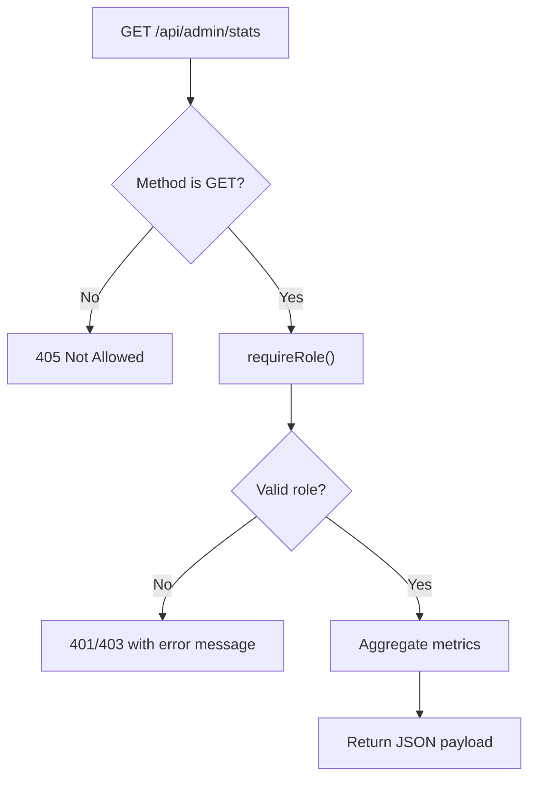

**Diagram sources**
- [pages/api/admin/stats.js](file://pages/api/admin/stats.js)
- [lib/auth.js](file://lib/auth.js)
- [components/AdminLayout.js](file://components/AdminLayout.js)

**Section sources**
- [pages/api/admin/stats.js](file://pages/api/admin/stats.js)
- [lib/auth.js](file://lib/auth.js)
- [components/AdminLayout.js](file://components/AdminLayout.js)

### Integration with Admin Statistics API and Data Refresh
- Data Source: The dashboard fetches aggregated metrics from /api/admin/stats on mount.
- Payload: Includes total revenue, total tickets sold, total events, and per-event breakdowns (sold, checked-in).
- Refresh Mechanism: Currently loads once on mount; additional refresh strategies (polling, manual refresh) can be added by re-invoking the fetch call.

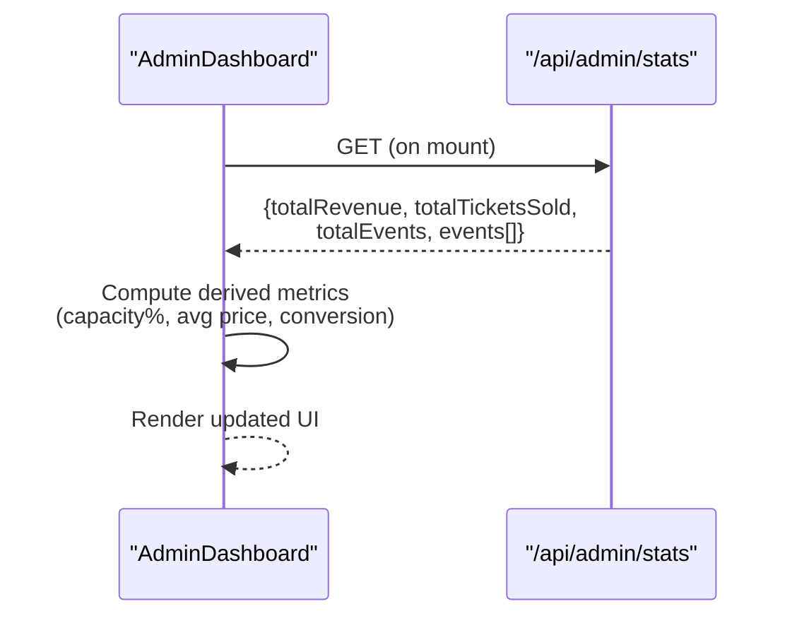

**Diagram sources**
- [pages/admin/index.js](file://pages/admin/index.js)
- [pages/api/admin/stats.js](file://pages/api/admin/stats.js)

**Section sources**
- [pages/admin/index.js](file://pages/admin/index.js)
- [pages/api/admin/stats.js](file://pages/api/admin/stats.js)

## Dependency Analysis
The dashboard depends on several core modules:
- UI Primitives: Card, Badge, Progress, Button, Skeleton are exported from the UI index and used throughout the dashboard.
- Layout: AdminLayout wraps the page and manages navigation and authentication.
- API: The stats endpoint relies on auth utilities and Supabase client to aggregate data.

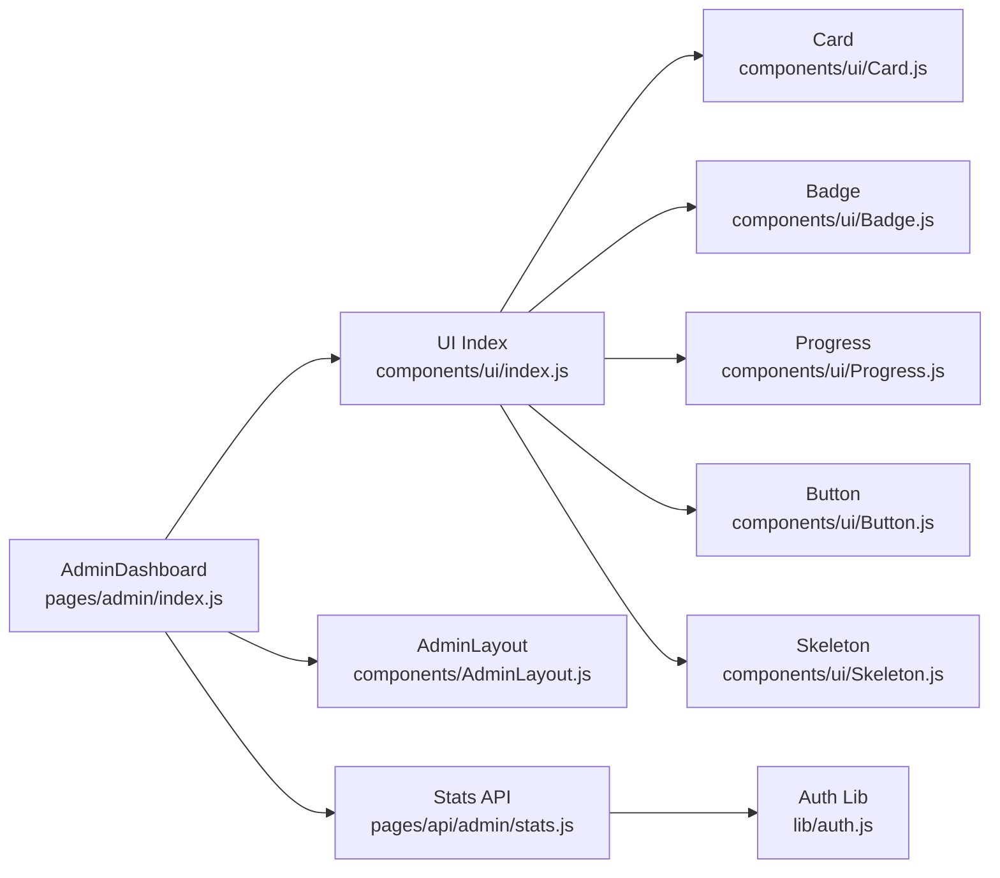

**Diagram sources**
- [components/ui/index.js](file://components/ui/index.js)
- [components/ui/Card.js](file://components/ui/Card.js)
- [components/ui/Badge.js](file://components/ui/Badge.js)
- [components/ui/Progress.js](file://components/ui/Progress.js)
- [components/ui/Button.js](file://components/ui/Button.js)
- [components/ui/Skeleton.js](file://components/ui/Skeleton.js)
- [components/AdminLayout.js](file://components/AdminLayout.js)
- [pages/api/admin/stats.js](file://pages/api/admin/stats.js)
- [lib/auth.js](file://lib/auth.js)

**Section sources**
- [components/ui/index.js](file://components/ui/index.js)
- [components/AdminLayout.js](file://components/AdminLayout.js)
- [pages/api/admin/stats.js](file://pages/api/admin/stats.js)
- [lib/auth.js](file://lib/auth.js)

## Performance Considerations
- Minimal re-renders: The dashboard computes derived metrics locally after receiving the API payload, avoiding unnecessary server calls.
- Efficient queries: The stats API aggregates data in parallel where possible to reduce latency.
- UI responsiveness: CSS Grid and skeleton components improve perceived performance during loading.
- Animations: Subtle animations enhance UX without impacting performance significantly.

[No sources needed since this section provides general guidance]

## Troubleshooting Guide
- Authentication issues: If the dashboard redirects to login, verify the user’s role and session token. The AdminLayout enforces role checks against allowed roles.
- Empty metrics: If stat cards show zeros, confirm that events, tickets, and payments exist in the database and that the stats API returns non-empty arrays.
- Network errors: Ensure the /api/admin/stats endpoint is reachable and returns valid JSON. Inspect browser network logs for 4xx/5xx responses.
- UI not updating: Verify that the fetch callback sets the loading state correctly and that derived metrics are computed from the returned payload.

**Section sources**
- [components/AdminLayout.js](file://components/AdminLayout.js)
- [pages/api/admin/stats.js](file://pages/api/admin/stats.js)
- [pages/admin/index.js](file://pages/admin/index.js)

## Conclusion
The Admin Dashboard offers a robust, visually engaging interface for administrators to monitor event performance and execute key tasks efficiently. Its modular architecture, clear data flow, and responsive design make it easy to maintain and extend. With solid error handling and skeleton loading states, it delivers a smooth user experience while integrating seamlessly with backend services.

[No sources needed since this section summarizes without analyzing specific files]