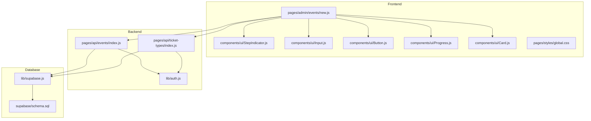
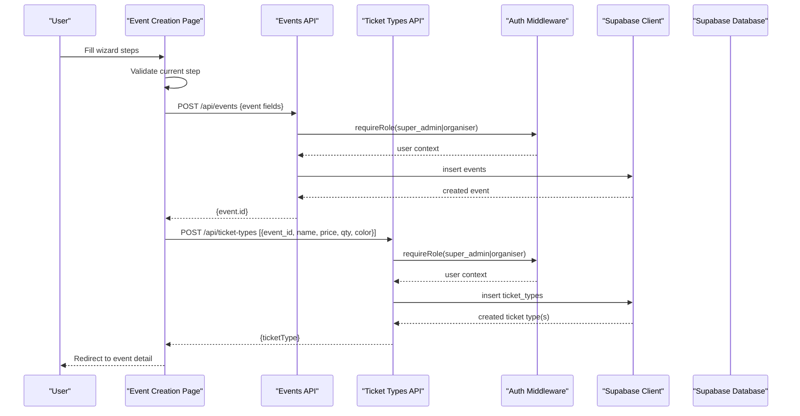
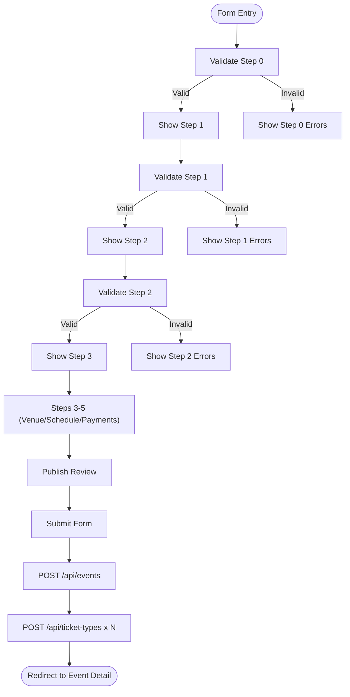
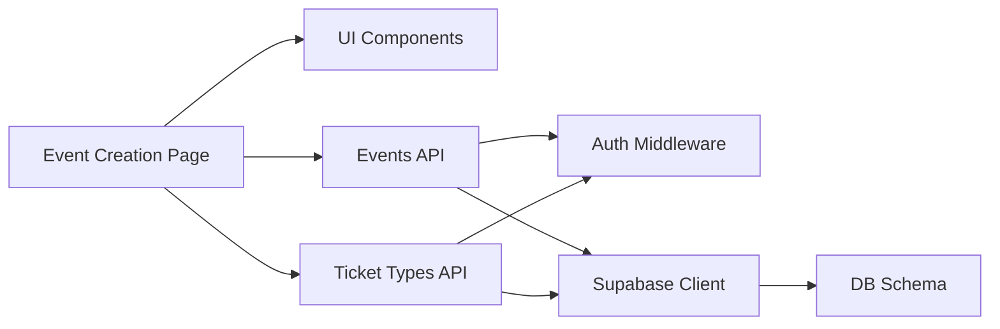

# Event Creation Interface

<cite>
**Referenced Files in This Document**
- [new.js](file://pages/admin/events/new.js)
- [StepIndicator.js](file://components/ui/StepIndicator.js)
- [Input.js](file://components/ui/Input.js)
- [Button.js](file://components/ui/Button.js)
- [Progress.js](file://components/ui/Progress.js)
- [Card.js](file://components/ui/Card.js)
- [global.css](file://pages/styles/global.css)
- [events/index.js](file://pages/api/events/index.js)
- [ticket-types/index.js](file://pages/api/ticket-types/index.js)
- [supabase.js](file://lib/supabase.js)
- [auth.js](file://lib/auth.js)
- [schema.sql](file://supabase/schema.sql)
</cite>

## Table of Contents
1. [Introduction](#introduction)
2. [Project Structure](#project-structure)
3. [Core Components](#core-components)
4. [Architecture Overview](#architecture-overview)
5. [Detailed Component Analysis](#detailed-component-analysis)
6. [Dependency Analysis](#dependency-analysis)
7. [Performance Considerations](#performance-considerations)
8. [Troubleshooting Guide](#troubleshooting-guide)
9. [Conclusion](#conclusion)

## Introduction
This document explains the Event Creation Interface used by organizers to create new events through a multi-step wizard. It covers:
- Basic information entry (event name, URL slug, date/time, venue, description)
- Branding and capacity configuration
- Ticket type creation with pricing, quantity limits, and color customization
- Venue details and accessibility notes
- Schedule and payment settings
- Form validation rules, error handling, and user feedback
- State management including autosave to local storage
- Data submission to backend APIs and persistence via Supabase
- Responsive design patterns and accessibility considerations

## Project Structure
The event creation feature is implemented as a Next.js page with reusable UI components and server-side API routes that persist data to Supabase.

**Diagram sources**
- [new.js:1-1067](file://pages/admin/events/new.js#L1-L1067)
- [StepIndicator.js:1-24](file://components/ui/StepIndicator.js#L1-L24)
- [Input.js:1-49](file://components/ui/Input.js#L1-L49)
- [Button.js:1-74](file://components/ui/Button.js#L1-L74)
- [Progress.js:1-39](file://components/ui/Progress.js#L1-L39)
- [Card.js:1-33](file://components/ui/Card.js#L1-L33)
- [events/index.js:1-42](file://pages/api/events/index.js#L1-L42)
- [ticket-types/index.js:1-49](file://pages/api/ticket-types/index.js#L1-L49)
- [supabase.js:1-23](file://lib/supabase.js#L1-L23)
- [auth.js:1-47](file://lib/auth.js#L1-L47)
- [schema.sql:1-166](file://supabase/schema.sql#L1-L166)

**Section sources**
- [new.js:1-1067](file://pages/admin/events/new.js#L1-L1067)
- [events/index.js:1-42](file://pages/api/events/index.js#L1-L42)
- [ticket-types/index.js:1-49](file://pages/api/ticket-types/index.js#L1-L49)
- [supabase.js:1-23](file://lib/supabase.js#L1-L23)
- [auth.js:1-47](file://lib/auth.js#L1-L47)
- [schema.sql:1-166](file://supabase/schema.sql#L1-L166)

## Core Components
- Multi-step wizard orchestration and state management live in the event creation page.
- Reusable UI primitives provide consistent input, button, progress, step indicator, and card behaviors.
- Backend endpoints enforce role-based access and persist data to Supabase tables defined in the schema.

Key responsibilities:
- Wizard steps and navigation
- Field-level and step-level validation
- Autosave draft to local storage
- Submitting event and ticket types to APIs
- Displaying errors and success states

**Section sources**
- [new.js:1-1067](file://pages/admin/events/new.js#L1-L1067)
- [Input.js:1-49](file://components/ui/Input.js#L1-L49)
- [Button.js:1-74](file://components/ui/Button.js#L1-L74)
- [StepIndicator.js:1-24](file://components/ui/StepIndicator.js#L1-L24)
- [Progress.js:1-39](file://components/ui/Progress.js#L1-L39)
- [Card.js:1-33](file://components/ui/Card.js#L1-L33)

## Architecture Overview
The interface follows a client-server architecture:
- The frontend manages form state, validation, and user interactions.
- On submit, it calls the events API to create an event record.
- Then it creates one or more ticket types linked to the created event.
- All database operations use Supabase clients configured for admin service roles on the server side.

**Diagram sources**
- [new.js:137-185](file://pages/admin/events/new.js#L137-L185)
- [events/index.js:18-37](file://pages/api/events/index.js#L18-L37)
- [ticket-types/index.js:7-23](file://pages/api/ticket-types/index.js#L7-L23)
- [auth.js:39-46](file://lib/auth.js#L39-L46)
- [supabase.js:10-22](file://lib/supabase.js#L10-L22)

## Detailed Component Analysis

### Event Creation Wizard (Multi-step Form)
- Steps include Basic Info, Branding, Tickets, Venue, Schedule, Payments, Publish.
- Each step renders specific inputs and validations.
- Navigation uses Previous/Continue buttons; final step submits the form.
- Autosave persists form state, ticket types, and current step to local storage with debounced updates.

Validation highlights:
- Step 0 requires event name, slug, date, and venue.
- Step 1 requires positive capacity.
- Step 2 requires at least one complete ticket type with name, non-negative price, and positive quantity.
- Errors are scoped per step and displayed inline.

State management:
- Centralized form object and ticket types array.
- Helper functions update fields and auto-generate slug from event name.
- Local storage autosave with status indicator.

Submission flow:
- Validates current step, disables further navigation if invalid.
- Creates event via POST to /api/events.
- Creates multiple ticket types via parallel POST requests to /api/ticket-types.
- Clears autosave and navigates to the event detail page.

**Diagram sources**
- [new.js:104-135](file://pages/admin/events/new.js#L104-L135)
- [new.js:137-185](file://pages/admin/events/new.js#L137-L185)

**Section sources**
- [new.js:6-14](file://pages/admin/events/new.js#L6-L14)
- [new.js:31-52](file://pages/admin/events/new.js#L31-L52)
- [new.js:62-84](file://pages/admin/events/new.js#L62-L84)
- [new.js:86-102](file://pages/admin/events/new.js#L86-L102)
- [new.js:104-135](file://pages/admin/events/new.js#L104-L135)
- [new.js:137-185](file://pages/admin/events/new.js#L137-L185)

### Basic Information Step
Fields:
- Event Name (required)
- URL Slug (required, auto-generated from event name but editable)
- Date (required)
- Start Time (optional)
- Venue (required)
- Description (optional, markdown-friendly)

Validation:
- Required fields enforced during step validation.
- Error messages shown below each field.

Accessibility:
- Labels associated with inputs.
- aria-invalid set when errors exist.

**Section sources**
- [new.js:383-441](file://pages/admin/events/new.js#L383-L441)
- [Input.js:1-49](file://components/ui/Input.js#L1-L49)

### Branding and Capacity Step
Fields:
- Poster Image URL (optional) with preview
- Theme Color picker and hex input
- Total Capacity (required, must be positive)
- Theme presets for quick selection

Behavior:
- Live image preview with fallback on load error.
- Color presets update theme color instantly.

**Section sources**
- [new.js:443-557](file://pages/admin/events/new.js#L443-L557)

### Ticket Type Configuration
Features:
- Dynamic list of ticket tiers with add/remove controls.
- Each tier includes name, price, quantity available, and color.
- Validation ensures at least one complete tier exists before proceeding.

Data model mapping:
- Fields map to ticket_types table columns: name, price, quantity_available, color.

User feedback:
- Inline error banner if no valid ticket tier is present.

**Section sources**
- [new.js:559-672](file://pages/admin/events/new.js#L559-L672)
- [schema.sql:45-54](file://supabase/schema.sql#L45-L54)

### Venue Details Step
Fields:
- Venue Description (optional)
- Latitude and Longitude (optional)
- Parking & Transportation info (optional)
- Accessibility Notes (optional)

Design:
- Placeholder area for map preview.
- Current venue badge displays selected venue.

**Section sources**
- [new.js:674-751](file://pages/admin/events/new.js#L674-L751)

### Schedule Step
Fields:
- Event Date confirmation
- Doors Open time
- Start Time confirmation
- End Time
- Schedule Notes (optional)

Visualization:
- Timeline summary showing doors open, start, and end times.

**Section sources**
- [new.js:753-819](file://pages/admin/events/new.js#L753-L819)

### Payments Step
Configuration:
- Stripe Connect integration status display
- Accepted payment methods checkboxes (cards, mobile money, bank transfer, cash)
- Refund policy textarea

Notes:
- Payment processing handled externally; this step configures options.

**Section sources**
- [new.js:821-907](file://pages/admin/events/new.js#L821-L907)

### Publish Review Step
Summary:
- Displays event title, date/time, venue, number of ticket tiers, total tickets, price range, and capacity.
- Allows editing any previous step directly from review cards.
- Status selection: Save as Draft or Publish Now.

**Section sources**
- [new.js:909-1064](file://pages/admin/events/new.js#L909-L1064)

### UI Components
- StepIndicator: Visual stepper with active/done states and labels.
- Input: Accessible input with label, helper text, and error styling.
- Button: Variants, sizes, loading state, and full-width support.
- Progress: Linear progress bar with optional percentage label.
- Card: Glassmorphism card with hover lift and accent border option.

**Section sources**
- [StepIndicator.js:1-24](file://components/ui/StepIndicator.js#L1-L24)
- [Input.js:1-49](file://components/ui/Input.js#L1-L49)
- [Button.js:1-74](file://components/ui/Button.js#L1-L74)
- [Progress.js:1-39](file://components/ui/Progress.js#L1-L39)
- [Card.js:1-33](file://components/ui/Card.js#L1-L33)

### Backend Integration
Events API:
- Accepts POST to create an event with required fields validated server-side.
- Returns created event with id.

Ticket Types API:
- Accepts POST to create ticket types linked to an event.
- Supports PUT and DELETE for managing ticket types.

Authentication:
- Role-based middleware enforces super_admin or organiser roles.

Supabase Client:
- Admin client uses service role key for server-side operations.

Schema:
- Defines events and ticket_types tables with constraints and indexes.

**Section sources**
- [events/index.js:1-42](file://pages/api/events/index.js#L1-L42)
- [ticket-types/index.js:1-49](file://pages/api/ticket-types/index.js#L1-L49)
- [auth.js:39-46](file://lib/auth.js#L39-L46)
- [supabase.js:1-23](file://lib/supabase.js#L1-L23)
- [schema.sql:24-54](file://supabase/schema.sql#L24-L54)

## Dependency Analysis
The event creation workflow depends on several modules:

**Diagram sources**
- [new.js:1-1067](file://pages/admin/events/new.js#L1-L1067)
- [events/index.js:1-42](file://pages/api/events/index.js#L1-L42)
- [ticket-types/index.js:1-49](file://pages/api/ticket-types/index.js#L1-L49)
- [auth.js:1-47](file://lib/auth.js#L1-L47)
- [supabase.js:1-23](file://lib/supabase.js#L1-L23)
- [schema.sql:1-166](file://supabase/schema.sql#L1-L166)

**Section sources**
- [new.js:1-1067](file://pages/admin/events/new.js#L1-L1067)
- [events/index.js:1-42](file://pages/api/events/index.js#L1-L42)
- [ticket-types/index.js:1-49](file://pages/api/ticket-types/index.js#L1-L49)
- [auth.js:1-47](file://lib/auth.js#L1-L47)
- [supabase.js:1-23](file://lib/supabase.js#L1-L23)
- [schema.sql:1-166](file://supabase/schema.sql#L1-L166)

## Performance Considerations
- Debounced autosave reduces frequent writes to local storage.
- Parallel creation of ticket types improves submission performance.
- Server-side validation prevents unnecessary retries and network overhead.
- Minimal re-renders due to localized state updates within components.

[No sources needed since this section provides general guidance]

## Troubleshooting Guide
Common issues and resolutions:
- Missing required fields: Ensure event name, slug, date, and venue are provided in Basic Info.
- Invalid capacity: Provide a positive integer for capacity in Branding.
- No valid ticket tier: Add at least one ticket type with name, price, and quantity.
- Authentication failures: Confirm session cookie and role permissions for organizer or super_admin.
- Network errors: Check API responses and ensure environment variables for Supabase are configured.

Error handling mechanisms:
- Inline field errors displayed under inputs.
- Step-level error banners for ticket configuration.
- Global error card for submission failures.
- Loading indicators prevent duplicate submissions.

**Section sources**
- [new.js:104-135](file://pages/admin/events/new.js#L104-L135)
- [new.js:137-185](file://pages/admin/events/new.js#L137-L185)
- [events/index.js:18-37](file://pages/api/events/index.js#L18-L37)
- [ticket-types/index.js:7-23](file://pages/api/ticket-types/index.js#L7-L23)
- [auth.js:39-46](file://lib/auth.js#L39-L46)
- [supabase.js:6-8](file://lib/supabase.js#L6-L8)

## Conclusion
The Event Creation Interface provides a robust, accessible, and responsive multi-step form for organizing events. It combines clear validation, user feedback, and reliable backend integration with Supabase to persist event and ticket data. The modular UI components and well-defined API contracts make the system maintainable and extensible for future enhancements such as real-time updates and advanced scheduling features.

[No sources needed since this section summarizes without analyzing specific files]