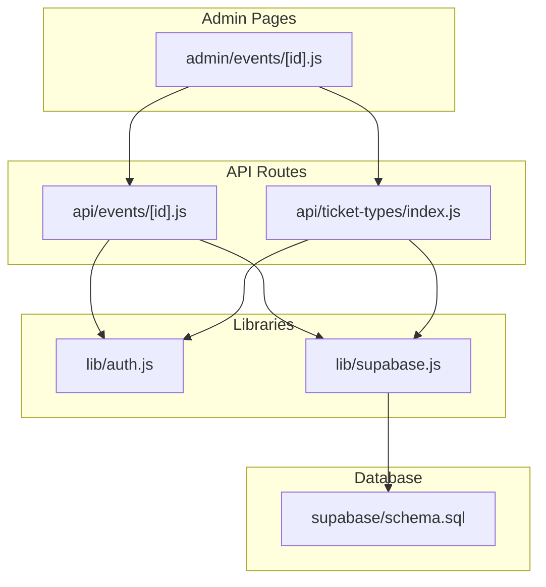
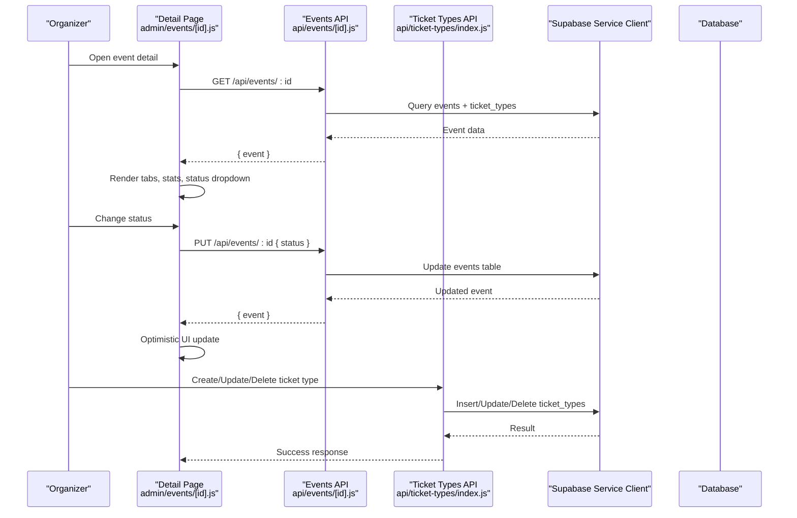
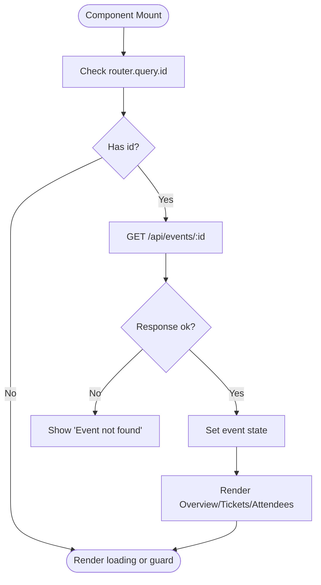
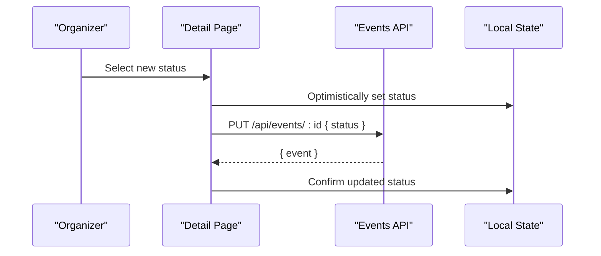
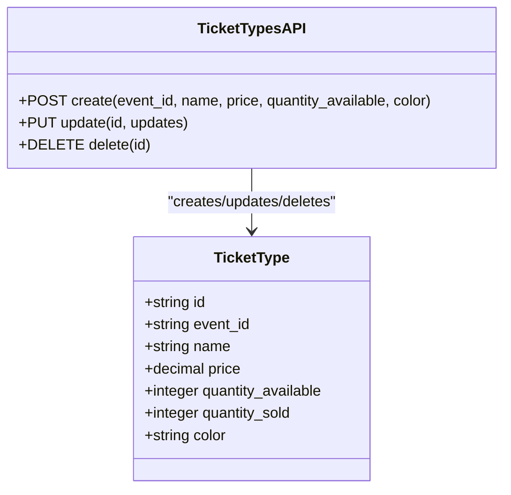
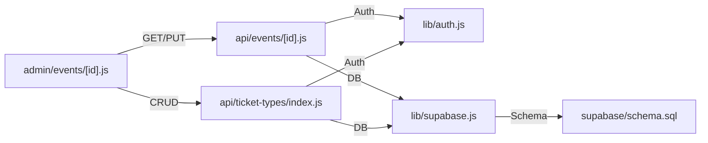

# Event Editing Interface

<cite>
**Referenced Files in This Document**
- [pages/admin/events/[id].js](file://pages/admin/events/[id].js)
- [pages/api/events/[id].js](file://pages/api/events/[id].js)
- [pages/api/ticket-types/index.js](file://pages/api/ticket-types/index.js)
- [components/AdminLayout.js](file://components/AdminLayout.js)
- [lib/auth.js](file://lib/auth.js)
- [lib/supabase.js](file://lib/supabase.js)
- [supabase/schema.sql](file://supabase/schema.sql)
</cite>

## Table of Contents
1. [Introduction](#introduction)
2. [Project Structure](#project-structure)
3. [Core Components](#core-components)
4. [Architecture Overview](#architecture-overview)
5. [Detailed Component Analysis](#detailed-component-analysis)
6. [Dependency Analysis](#dependency-analysis)
7. [Performance Considerations](#performance-considerations)
8. [Troubleshooting Guide](#troubleshooting-guide)
9. [Conclusion](#conclusion)

## Introduction
This document explains the Event Editing Interface for TicketFlow, focusing on how Next.js parameterized routes ([id]) load existing event data and how organizers can manage event properties, status, scheduling, venue details, and ticket types. It covers data fetching patterns, optimistic UI updates, validation, error handling, API integration, and strategies for real-time synchronization and conflict resolution.

## Project Structure
The editing workflow spans a few key files:
- A detail page that loads an existing event by ID and provides quick status changes and navigation to the full editor.
- An API route that handles GET/PUT/DELETE for events with role-based authorization.
- A ticket types API route for CRUD operations on ticket tiers.
- Shared layout and auth utilities.
- Database schema defining constraints and relationships.

**Diagram sources**
- [pages/admin/events/[id].js](file://pages/admin/events/[id].js)
- [pages/api/events/[id].js](file://pages/api/events/[id].js)
- [pages/api/ticket-types/index.js](file://pages/api/ticket-types/index.js)
- [lib/auth.js](file://lib/auth.js)
- [lib/supabase.js](file://lib/supabase.js)
- [supabase/schema.sql](file://supabase/schema.sql)

**Section sources**
- [pages/admin/events/[id].js](file://pages/admin/events/[id].js)
- [pages/api/events/[id].js](file://pages/api/events/[id].js)
- [pages/api/ticket-types/index.js](file://pages/api/ticket-types/index.js)
- [components/AdminLayout.js](file://components/AdminLayout.js)
- [lib/auth.js](file://lib/auth.js)
- [lib/supabase.js](file://lib/supabase.js)
- [supabase/schema.sql](file://supabase/schema.sql)

## Core Components
- Dynamic routing with Next.js parameterized route [id] to fetch and display an existing event.
- Status management dropdown (draft, published, sold_out, completed, cancelled) with immediate optimistic update.
- Tabs for overview, ticket types, and attendees.
- Navigation to the comprehensive edit form for full property editing.
- API endpoints for event updates and ticket type management.

Key responsibilities:
- pages/admin/events/[id].js: Loads event data, renders tabs, manages status updates, and navigates to the editor.
- pages/api/events/[id].js: Serves GET/PUT/DELETE for events with role checks and slug normalization.
- pages/api/ticket-types/index.js: Creates, updates, and deletes ticket types with validation.
- lib/auth.js: Role enforcement for protected actions.
- lib/supabase.js: Service-role client for server-side DB access.
- supabase/schema.sql: Enforces allowed statuses and relationships.

**Section sources**
- [pages/admin/events/[id].js](file://pages/admin/events/[id].js)
- [pages/api/events/[id].js](file://pages/api/events/[id].js)
- [pages/api/ticket-types/index.js](file://pages/api/ticket-types/index.js)
- [lib/auth.js](file://lib/auth.js)
- [lib/supabase.js](file://lib/supabase.js)
- [supabase/schema.sql](file://supabase/schema.sql)

## Architecture Overview
The editing interface follows a clear client-server flow:
- Client reads event data via GET /api/events/:id.
- Client updates event status via PUT /api/events/:id with role checks.
- Client manages ticket types via POST/PUT/DELETE /api/ticket-types.
- Server uses Supabase service-role client to enforce RLS and persist changes.

**Diagram sources**
- [pages/admin/events/[id].js](file://pages/admin/events/[id].js)
- [pages/api/events/[id].js](file://pages/api/events/[id].js)
- [pages/api/ticket-types/index.js](file://pages/api/ticket-types/index.js)
- [lib/supabase.js](file://lib/supabase.js)

## Detailed Component Analysis

### Dynamic Routing and Data Loading
- The detail page uses Next.js dynamic routing with [id] to resolve the event identifier from the URL.
- On mount, it fetches the event and its ticket types from the events API.
- If the event is not found, a friendly message is shown; otherwise, the component renders tabs and stats.

**Diagram sources**
- [pages/admin/events/[id].js](file://pages/admin/events/[id].js)
- [pages/api/events/[id].js](file://pages/api/events/[id].js)

**Section sources**
- [pages/admin/events/[id].js](file://pages/admin/events/[id].js)
- [pages/api/events/[id].js](file://pages/api/events/[id].js)

### Status Management (Draft, Published, Sold Out, Completed, Cancelled)
- The detail page exposes a status dropdown that triggers a PUT request to update the event’s status.
- Optimistic UI updates the local state immediately while the request is in flight.
- The API enforces roles and normalizes slugs when present.

**Diagram sources**
- [pages/admin/events/[id].js](file://pages/admin/events/[id].js)
- [pages/api/events/[id].js](file://pages/api/events/[id].js)

**Section sources**
- [pages/admin/events/[id].js](file://pages/admin/events/[id].js)
- [pages/api/events/[id].js](file://pages/api/events/[id].js)
- [supabase/schema.sql](file://supabase/schema.sql)

### Comprehensive Edit Form Integration
- From the detail page, organizers can navigate to the full editor at /admin/events/edit/:id.
- The editor supports multi-step configuration including basic info, branding, tickets, venue, schedule, payments, and publish steps.
- While the detailed editor implementation is extensive, the integration points are:
  - Navigating to the editor with the event id.
  - Saving changes through the same events API (PUT).
  - Managing ticket types via the ticket types API.

Note: The current repository includes a robust “New Event” wizard and the detail page. The edit path is referenced in the detail page for convenience. When implementing the edit form, mirror the creation flow but populate fields from the fetched event and use PUT to persist changes.

**Section sources**
- [pages/admin/events/[id].js](file://pages/admin/events/[id].js)

### Ticket Type Management
- Organizers can add, modify, or remove ticket types using the ticket types API.
- The API validates required fields and persists changes with proper role checks.
- In the detail view, ticket types are displayed with sales progress and revenue summaries.

**Diagram sources**
- [pages/api/ticket-types/index.js](file://pages/api/ticket-types/index.js)
- [supabase/schema.sql](file://supabase/schema.sql)

**Section sources**
- [pages/api/ticket-types/index.js](file://pages/api/ticket-types/index.js)
- [supabase/schema.sql](file://supabase/schema.sql)

### Venue and Scheduling Updates
- Venue and schedule fields are part of the event model and editor steps.
- Updates should be sent via PUT /api/events/:id with the relevant fields (e.g., venue, time, doors_open, end_time).
- Ensure consistent formatting and validation before submission.

**Section sources**
- [supabase/schema.sql](file://supabase/schema.sql)

### Data Fetching on Component Mount
- The detail page fetches event data on mount using useEffect and router query parameters.
- Attendee data is loaded conditionally when the attendees tab is active, supporting search filtering.

**Section sources**
- [pages/admin/events/[id].js](file://pages/admin/events/[id].js)

### Optimistic UI Updates and Conflict Resolution
- Status changes apply locally before server confirmation to improve responsiveness.
- For robustness, consider:
  - Re-fetching the event after mutations to reconcile state.
  - Showing transient feedback (loading indicators, toasts).
  - Handling errors gracefully and reverting optimistic changes if needed.

**Section sources**
- [pages/admin/events/[id].js](file://pages/admin/events/[id].js)

### Form Validation, Error Boundaries, and UX Optimization
- Validation occurs per step in the editor to guide users through required fields.
- Error messages are surfaced inline and at the top of the form.
- UX enhancements include autosave drafts, progress indicators, and contextual help text.

**Section sources**
- [pages/admin/events/new.js](file://pages/admin/events/new.js)

### Real-Time Synchronization Capabilities
- The current implementation uses HTTP requests for data persistence.
- To enable real-time sync:
  - Use Supabase subscriptions to listen for changes on events and ticket_types tables.
  - Update local state reactively when changes occur from other clients.
  - Debounce writes and handle conflicts by preferring server state or merge strategies.

[No sources needed since this section provides general guidance]

## Dependency Analysis
The following diagram shows how components and APIs depend on each other:

**Diagram sources**
- [pages/admin/events/[id].js](file://pages/admin/events/[id].js)
- [pages/api/events/[id].js](file://pages/api/events/[id].js)
- [pages/api/ticket-types/index.js](file://pages/api/ticket-types/index.js)
- [lib/auth.js](file://lib/auth.js)
- [lib/supabase.js](file://lib/supabase.js)
- [supabase/schema.sql](file://supabase/schema.sql)

**Section sources**
- [pages/admin/events/[id].js](file://pages/admin/events/[id].js)
- [pages/api/events/[id].js](file://pages/api/events/[id].js)
- [pages/api/ticket-types/index.js](file://pages/api/ticket-types/index.js)
- [lib/auth.js](file://lib/auth.js)
- [lib/supabase.js](file://lib/supabase.js)
- [supabase/schema.sql](file://supabase/schema.sql)

## Performance Considerations
- Minimize re-renders by keeping local state minimal and derived where possible.
- Use conditional fetching (e.g., only load attendees when the tab is active).
- Debounce input changes in large forms to reduce unnecessary network calls.
- Cache frequently accessed data (e.g., event metadata) in memory during the session.
- Prefer batched updates for ticket types to reduce round trips.

[No sources needed since this section provides general guidance]

## Troubleshooting Guide
Common issues and resolutions:
- Authentication failures: Ensure the user has the required role (super_admin or organiser). The API enforces roles via requireRole.
- Not found responses: Verify the event id exists and matches the database record.
- Validation errors: Check required fields for ticket types and event updates.
- Network errors: Inspect fetch responses and handle non-ok statuses gracefully.
- Slug normalization: Ensure slugs are lowercase and hyphenated as expected by the API.

**Section sources**
- [pages/api/events/[id].js](file://pages/api/events/[id].js)
- [pages/api/ticket-types/index.js](file://pages/api/ticket-types/index.js)
- [lib/auth.js](file://lib/auth.js)

## Conclusion
The Event Editing Interface combines Next.js dynamic routing, robust API endpoints, and a structured editor workflow to empower organizers to manage events comprehensively. By leveraging optimistic UI updates, clear validation, and secure role-based access, the system delivers a responsive and reliable editing experience. Extending with real-time synchronization and enhanced conflict resolution will further improve collaboration and consistency across multiple editors.