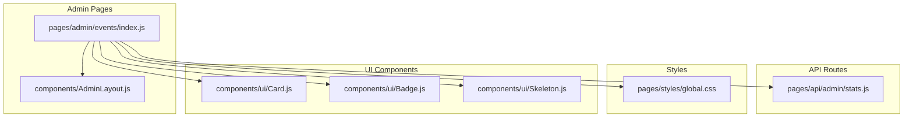
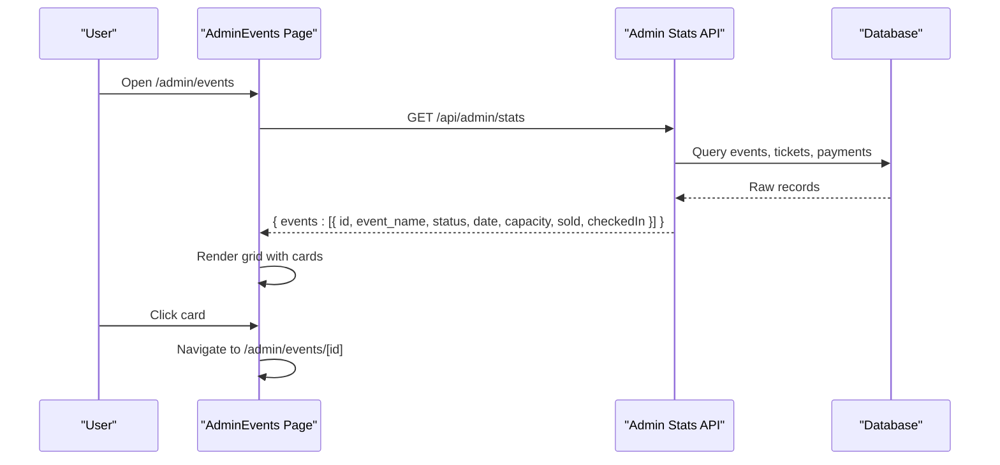
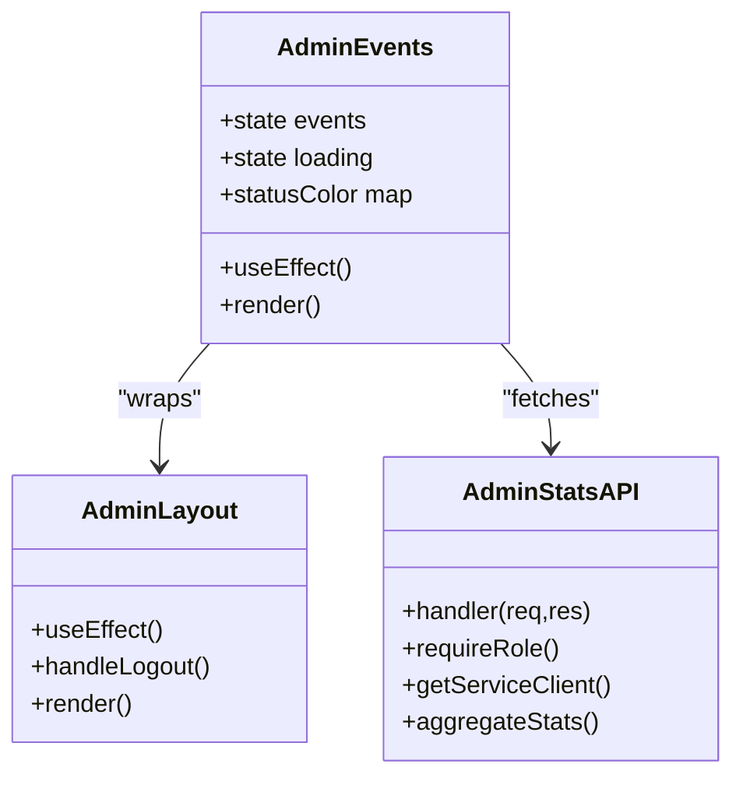

# Event Listing Interface

<cite>
**Referenced Files in This Document**
- [pages/admin/events/index.js](file://pages/admin/events/index.js)
- [pages/api/admin/stats.js](file://pages/api/admin/stats.js)
- [components/AdminLayout.js](file://components/AdminLayout.js)
- [pages/styles/global.css](file://pages/styles/global.css)
- [components/ui/Card.js](file://components/ui/Card.js)
- [components/ui/Badge.js](file://components/ui/Badge.js)
- [components/ui/Skeleton.js](file://components/ui/Skeleton.js)
</cite>

## Table of Contents
1. [Introduction](#introduction)
2. [Project Structure](#project-structure)
3. [Core Components](#core-components)
4. [Architecture Overview](#architecture-overview)
5. [Detailed Component Analysis](#detailed-component-analysis)
6. [Dependency Analysis](#dependency-analysis)
7. [Performance Considerations](#performance-considerations)
8. [Troubleshooting Guide](#troubleshooting-guide)
9. [Conclusion](#conclusion)
10. [Appendices](#appendices)

## Introduction
This document explains the Event Listing Interface used in the admin area to display a responsive grid of event cards. Each card shows the event name, status badge with color coding, formatted date, ticket sales metrics (sold and checked-in), and interactive hover effects. The interface fetches data from an admin stats API endpoint and navigates users to individual event editing pages when a card is clicked. It also covers loading states, empty state handling, accessibility considerations for keyboard navigation and screen readers, and the CSS Grid layout strategy using auto-fill and minmax.

## Project Structure
The Event Listing Interface is implemented as a Next.js page under the admin section. It uses:
- A dedicated page component that renders the events grid
- An admin layout wrapper for authentication and navigation
- An API route that aggregates event statistics from the database
- Global styles defining responsive grids and UI components

**Diagram sources**
- [pages/admin/events/index.js:1-70](file://pages/admin/events/index.js#L1-L70)
- [components/AdminLayout.js:1-194](file://components/AdminLayout.js#L1-L194)
- [pages/api/admin/stats.js:1-41](file://pages/api/admin/stats.js#L1-L41)
- [pages/styles/global.css:1390-1400](file://pages/styles/global.css#L1390-L1400)
- [components/ui/Card.js:1-33](file://components/ui/Card.js#L1-L33)
- [components/ui/Badge.js:1-30](file://components/ui/Badge.js#L1-L30)
- [components/ui/Skeleton.js:1-48](file://components/ui/Skeleton.js#L1-L48)

**Section sources**
- [pages/admin/events/index.js:1-70](file://pages/admin/events/index.js#L1-L70)
- [components/AdminLayout.js:1-194](file://components/AdminLayout.js#L1-L194)
- [pages/api/admin/stats.js:1-41](file://pages/api/admin/stats.js#L1-L41)
- [pages/styles/global.css:1390-1400](file://pages/styles/global.css#L1390-L1400)

## Core Components
- AdminEvents page: Fetches events via the admin stats API, manages loading state, renders the grid, handles click-to-edit navigation, and formats dates and status colors inline.
- AdminLayout: Wraps the page with authentication checks and sidebar navigation.
- Stats API: Aggregates per-event sold and checked-in counts and returns them alongside basic event metadata.
- Global CSS: Provides responsive grid utilities and shared UI classes for cards, badges, skeletons, and empty states.
- UI primitives: Card, Badge, Skeleton are available for consistent styling across the app.

Key responsibilities:
- Data fetching and state management occur in the page component.
- Layout and navigation are handled by the admin layout.
- Styling and responsiveness are centralized in global CSS.
- Reusable UI elements are encapsulated in small components.

**Section sources**
- [pages/admin/events/index.js:1-70](file://pages/admin/events/index.js#L1-L70)
- [components/AdminLayout.js:1-194](file://components/AdminLayout.js#L1-L194)
- [pages/api/admin/stats.js:1-41](file://pages/api/admin/stats.js#L1-L41)
- [pages/styles/global.css:1390-1400](file://pages/styles/global.css#L1390-L1400)
- [components/ui/Card.js:1-33](file://components/ui/Card.js#L1-L33)
- [components/ui/Badge.js:1-30](file://components/ui/Badge.js#L1-L30)
- [components/ui/Skeleton.js:1-48](file://components/ui/Skeleton.js#L1-L48)

## Architecture Overview
The Event Listing Interface follows a simple client-server pattern within Next.js:
- Client-side page requests the admin stats API on mount.
- Server-side API queries the database for events, tickets, and payments, then computes per-event metrics.
- The page renders a responsive grid of cards based on the returned data.

**Diagram sources**
- [pages/admin/events/index.js:10-12](file://pages/admin/events/index.js#L10-L12)
- [pages/api/admin/stats.js:4-36](file://pages/api/admin/stats.js#L4-L36)

**Section sources**
- [pages/admin/events/index.js:10-12](file://pages/admin/events/index.js#L10-L12)
- [pages/api/admin/stats.js:4-36](file://pages/api/admin/stats.js#L4-L36)

## Detailed Component Analysis

### AdminEvents Page
Responsibilities:
- Fetches events from the admin stats API on component mount.
- Manages loading state and renders either a loading message, an empty state, or the events grid.
- Displays each event card with:
  - Event name
  - Status badge with color coding
  - Formatted date
  - Sold tickets count
  - Checked-in count
- Handles click-to-edit navigation to the event’s edit page.

Responsive grid implementation:
- Uses CSS Grid with repeat(auto-fill, minmax(300px, 1fr)) to create a fluid layout that adapts to container width.
- Cards have hover effects that change border color and apply a subtle lift transform.

Loading and empty states:
- While loading, displays a centered text indicator.
- When no events exist, shows a friendly empty state with an illustration and a call-to-action button to create the first event.

Status color coding:
- Inline mapping defines colors for published, draft, sold_out, completed, cancelled statuses.

Date formatting:
- Dates are formatted using locale-aware formatting to show month, day, and year.

Accessibility considerations:
- Interactive cards use pointer cursor and mouse events; ensure focusability and keyboard support by adding tabIndex and keyboard handlers if needed.
- For screen readers, consider aria-labels on clickable cards and semantic headings.

Click navigation:
- Clicking a card navigates to the edit page using the router with the event’s id.

**Section sources**
- [pages/admin/events/index.js:1-70](file://pages/admin/events/index.js#L1-L70)

### AdminStats API
Responsibilities:
- Validates request method and user role.
- Queries events, tickets, and payments to compute total revenue, total tickets sold, total events, and per-event breakdown including sold and checked-in counts.
- Returns structured JSON for the client to render.

Data aggregation logic:
- Filters tickets by non-cancelled and non-refunded statuses to count sold tickets.
- Counts tickets with “used” status for checked-in.
- Computes total revenue from completed payments.

Error handling:
- Returns appropriate HTTP status codes and error messages on exceptions.

**Section sources**
- [pages/api/admin/stats.js:1-41](file://pages/api/admin/stats.js#L1-L41)

### AdminLayout
Responsibilities:
- Enforces authentication and role checks for super_admin and organiser roles.
- Renders sidebar navigation and main content area.
- Redirects unauthorized users to login.

Integration with the Events page:
- The AdminEvents page is wrapped by AdminLayout to provide consistent navigation and access control.

**Section sources**
- [components/AdminLayout.js:1-194](file://components/AdminLayout.js#L1-L194)

### Global Styles and Responsive Grid
Key CSS Grid patterns:
- .tf-events-grid uses repeat(auto-fill, minmax(320px, 1fr)) for responsive columns.
- .tf-dash-grid mirrors this pattern for dashboard sections.
- Media queries adjust layouts for smaller screens, collapsing grids to single-column where appropriate.

Shared UI classes:
- .tf-card and .glass-card define base card styles with hover transitions.
- .tf-badge variants provide consistent badge styling.
- .tf-skeleton provides shimmer placeholders for loading states.
- .tf-empty-state styles center empty content with icons and descriptions.

**Section sources**
- [pages/styles/global.css:1390-1400](file://pages/styles/global.css#L1390-L1400)
- [pages/styles/global.css:2275-2285](file://pages/styles/global.css#L2275-L2285)
- [pages/styles/global.css:1430-1475](file://pages/styles/global.css#L1430-L1475)
- [pages/styles/global.css:528-560](file://pages/styles/global.css#L528-L560)
- [pages/styles/global.css:728-768](file://pages/styles/global.css#L728-L768)

### UI Components
- Card: Accepts children, className, style, hoverable, glass, lift, accent, onClick, and forwards props. Applies glass or standard card classes and optional lift effect.
- Badge: Supports multiple variants (primary, success, warning, danger, info, glass, ghost) and can include an icon slot.
- Skeleton: Renders shimmer placeholders with configurable variant, dimensions, and count.

These components are available for reuse but the current AdminEvents page implements its own inline styles and rendering logic for the events grid.

**Section sources**
- [components/ui/Card.js:1-33](file://components/ui/Card.js#L1-L33)
- [components/ui/Badge.js:1-30](file://components/ui/Badge.js#L1-L30)
- [components/ui/Skeleton.js:1-48](file://components/ui/Skeleton.js#L1-L48)

## Dependency Analysis
The Event Listing Interface depends on:
- Next.js Router for navigation
- React hooks for state and side effects
- Supabase client for database queries in the API route
- Authentication middleware to enforce roles

**Diagram sources**
- [pages/admin/events/index.js:1-70](file://pages/admin/events/index.js#L1-L70)
- [pages/api/admin/stats.js:1-41](file://pages/api/admin/stats.js#L1-L41)
- [components/AdminLayout.js:1-194](file://components/AdminLayout.js#L1-L194)

**Section sources**
- [pages/admin/events/index.js:1-70](file://pages/admin/events/index.js#L1-L70)
- [pages/api/admin/stats.js:1-41](file://pages/api/admin/stats.js#L1-L41)
- [components/AdminLayout.js:1-194](file://components/AdminLayout.js#L1-L194)

## Performance Considerations
- Data fetching occurs once on mount; avoid unnecessary re-renders by keeping state minimal.
- Use parallel queries in the API route to reduce latency when aggregating tickets and payments.
- Prefer CSS-based hover effects for smooth interactions without JavaScript overhead.
- Consider implementing skeleton loaders instead of plain text for better perceived performance.
- Debounce or throttle any future search/filter operations if added later.

[No sources needed since this section provides general guidance]

## Troubleshooting Guide
Common issues and resolutions:
- No events displayed:
  - Verify the API returns events array and that the user has sufficient permissions.
  - Check network tab for errors from the stats endpoint.
- Incorrect status colors:
  - Ensure the status values match the expected keys (published, draft, sold_out, completed, cancelled).
- Date not formatting correctly:
  - Confirm the date field is a valid ISO string or timestamp.
- Navigation not working:
  - Ensure the router is imported and the event id exists.
- Accessibility problems:
  - Add tabIndex and onKeyDown handlers to make cards keyboard accessible.
  - Provide aria-labels for screen readers to describe card actions.

**Section sources**
- [pages/api/admin/stats.js:4-36](file://pages/api/admin/stats.js#L4-L36)
- [pages/admin/events/index.js:10-12](file://pages/admin/events/index.js#L10-L12)

## Conclusion
The Event Listing Interface provides a clean, responsive admin view of events with clear status indicators, ticket sales metrics, and intuitive interactions. It leverages CSS Grid for adaptability, integrates with a robust stats API for accurate metrics, and supports essential UX patterns like loading and empty states. With minor enhancements for accessibility and reusable UI components, it offers a solid foundation for managing events efficiently.

[No sources needed since this section summarizes without analyzing specific files]

## Appendices

### Status Color Coding Reference
- published: green tone
- draft: amber tone
- sold_out: red tone
- completed: gray tone
- cancelled: red tone

These mappings are defined inline in the page component and applied to status badges.

**Section sources**
- [pages/admin/events/index.js:14](file://pages/admin/events/index.js#L14)

### Date Formatting Example
Dates are formatted using locale-aware options to display month abbreviation, day, and year.

**Section sources**
- [pages/admin/events/index.js:48](file://pages/admin/events/index.js#L48)

### Responsive Grid Behavior
- Desktop and tablet: multi-column grid with minimum card width of 300–320px.
- Mobile: single-column layout via media queries.

**Section sources**
- [pages/admin/events/index.js:38](file://pages/admin/events/index.js#L38)
- [pages/styles/global.css:1390-1400](file://pages/styles/global.css#L1390-L1400)
- [pages/styles/global.css:1510-1515](file://pages/styles/global.css#L1510-L1515)

### Accessibility Recommendations
- Make cards focusable with tabIndex="0".
- Add onKeyDown handler to trigger navigation on Enter or Space.
- Include aria-label describing the action (e.g., “Edit event”).
- Ensure sufficient contrast for status badges and text.

[No sources needed since this section provides general guidance]