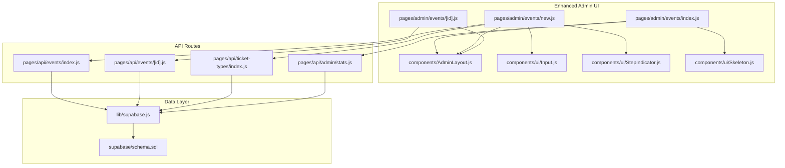
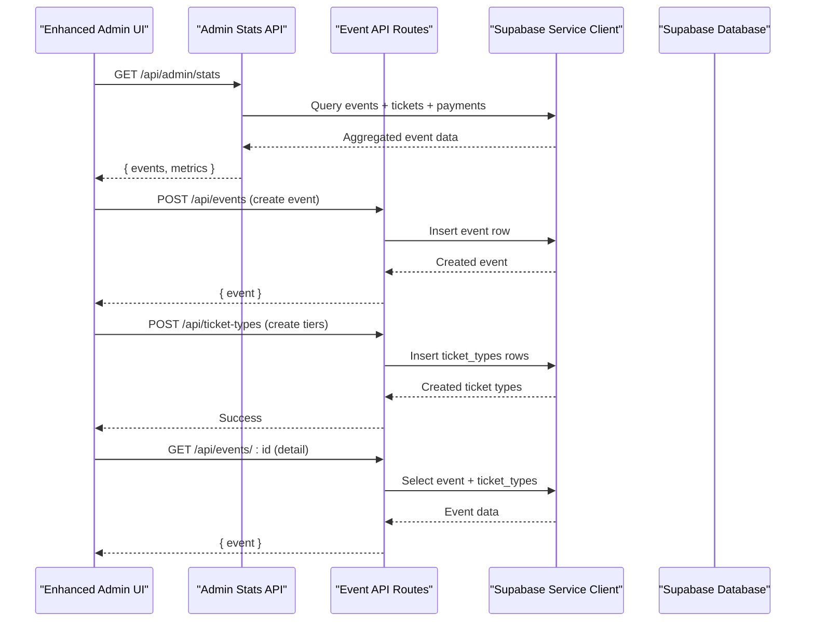
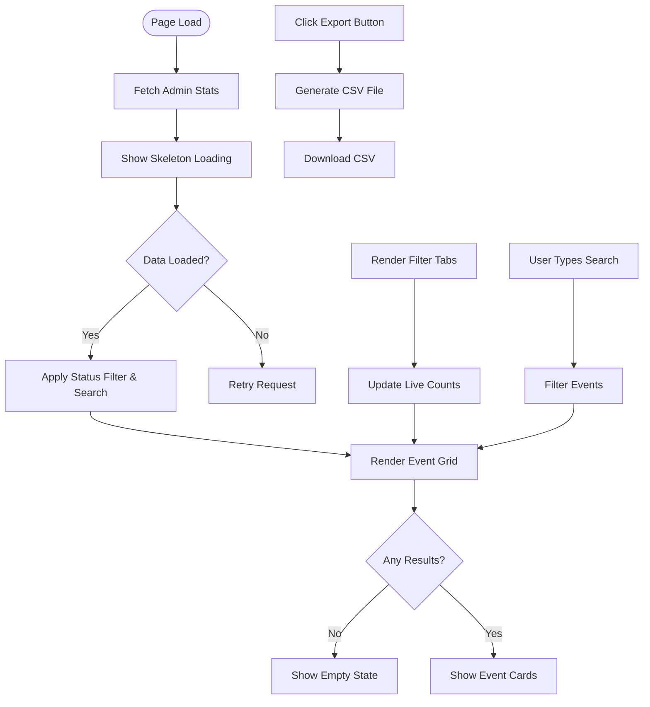
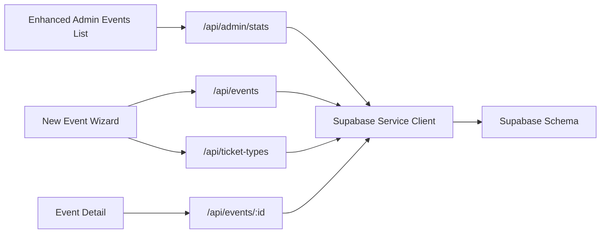

# Event Management Interface

<cite>
**Referenced Files in This Document**
- [pages/admin/events/index.js](file://pages/admin/events/index.js)
- [pages/admin/events/new.js](file://pages/admin/events/new.js)
- [pages/admin/events/[id].js](file://pages/admin/events/[id].js)
- [pages/api/events/index.js](file://pages/api/events/index.js)
- [pages/api/events/[id].js](file://pages/api/events/[id].js)
- [pages/api/ticket-types/index.js](file://pages/api/ticket-types/index.js)
- [pages/api/admin/stats.js](file://pages/api/admin/stats.js)
- [lib/supabase.js](file://lib/supabase.js)
- [supabase/schema.sql](file://supabase/schema.sql)
- [components/AdminLayout.js](file://components/AdminLayout.js)
- [components/ui/Input.js](file://components/ui/Input.js)
- [components/ui/StepIndicator.js](file://components/ui/StepIndicator.js)
- [components/ui/Skeleton.js](file://components/ui/Skeleton.js)
- [pages/styles/global.css](file://pages/styles/global.css)
</cite>

## Update Summary
**Changes Made**
- Enhanced event listing page with advanced status-based filtering tabs and live count badges
- Added real-time search functionality for events by name and venue
- Implemented CSV export capabilities for event data
- Integrated skeleton loading states for improved user experience
- Enhanced responsive grid layout with adaptive card sizing
- Added rich metadata display including sold tickets, checked-in counts, and capacity metrics
- Improved empty state handling with contextual messaging

## Table of Contents
1. Introduction
2. Project Structure
3. Core Components
4. Architecture Overview
5. Detailed Component Analysis
6. Dependency Analysis
7. Performance Considerations
8. Troubleshooting Guide
9. Conclusion

## Introduction
This document provides a comprehensive guide to the Event Management Interface sub-feature. It covers:
- The enhanced event listing page with advanced filtering (status-based tabs with live count badges), real-time search, and CSV export capabilities
- The event creation form with validation, ticket type configuration, pricing setup, and capacity management
- The event editing interface with status management (draft, published, sold_out, completed, cancelled), date/time scheduling, venue information, and promotional settings
- Concrete examples of form interactions, data validation rules, and error handling
- The relationship between event CRUD operations and backend API endpoints
- Responsive design considerations, accessibility compliance, and UX optimization for complex forms
- Integration with Supabase for data persistence and real-time updates

## Project Structure
The Event Management feature spans Next.js pages for admin UI and API routes for server-side logic, backed by Supabase. Key files include:
- Admin UI pages for listing, creating, and managing events with enhanced filtering and search
- API routes for event and ticket-type CRUD operations
- Enhanced admin stats endpoint for comprehensive event data
- Supabase client and schema definitions
- Shared layout and UI components including skeleton loaders

**Diagram sources**
- [pages/admin/events/index.js:1-210](file://pages/admin/events/index.js#L1-L210)
- [pages/admin/events/new.js:1-1067](file://pages/admin/events/new.js#L1-L1067)
- [pages/admin/events/[id].js](file://pages/admin/events/[id].js#L1-L175)
- [pages/api/events/index.js:1-42](file://pages/api/events/index.js#L1-L42)
- [pages/api/events/[id].js](file://pages/api/events/[id].js#L1-L42)
- [pages/api/ticket-types/index.js:1-49](file://pages/api/ticket-types/index.js#L1-L49)
- [pages/api/admin/stats.js:1-41](file://pages/api/admin/stats.js#L1-L41)
- [lib/supabase.js:1-23](file://lib/supabase.js#L1-L23)
- [supabase/schema.sql:1-166](file://supabase/schema.sql#L1-L166)
- [components/AdminLayout.js:1-194](file://components/AdminLayout.js#L1-L194)
- [components/ui/Input.js:1-49](file://components/ui/Input.js#L1-L49)
- [components/ui/StepIndicator.js:1-24](file://components/ui/StepIndicator.js#L1-L24)
- [components/ui/Skeleton.js:1-48](file://components/ui/Skeleton.js#L1-L48)

**Section sources**
- [pages/admin/events/index.js:1-210](file://pages/admin/events/index.js#L1-L210)
- [pages/admin/events/new.js:1-1067](file://pages/admin/events/new.js#L1-L1067)
- [pages/admin/events/[id].js](file://pages/admin/events/[id].js#L1-L175)
- [pages/api/events/index.js:1-42](file://pages/api/events/index.js#L1-L42)
- [pages/api/events/[id].js](file://pages/api/events/[id].js#L1-L42)
- [pages/api/ticket-types/index.js:1-49](file://pages/api/ticket-types/index.js#L1-L49)
- [pages/api/admin/stats.js:1-41](file://pages/api/admin/stats.js#L1-L41)
- [lib/supabase.js:1-23](file://lib/supabase.js#L1-L23)
- [supabase/schema.sql:1-166](file://supabase/schema.sql#L1-L166)
- [components/AdminLayout.js:1-194](file://components/AdminLayout.js#L1-L194)
- [components/ui/Input.js:1-49](file://components/ui/Input.js#L1-L49)
- [components/ui/StepIndicator.js:1-24](file://components/ui/StepIndicator.js#L1-L24)
- [components/ui/Skeleton.js:1-48](file://components/ui/Skeleton.js#L1-L48)

## Core Components
- **Enhanced Admin Events List**: Displays events with status-based filtering tabs, live count badges, real-time search, and CSV export capabilities. Features responsive grid layout with skeleton loading states.
- New Event Wizard: Multi-step form covering Basic Info, Branding, Tickets, Venue, Schedule, Payments, and Publish steps. Includes autosave to localStorage, step validation, and submission flow.
- Event Detail: Tabbed view with overview, ticket types, and attendees; supports status changes and quick actions.
- API Endpoints: REST endpoints for events and ticket types, enforcing roles and persisting via Supabase.
- Enhanced Admin Stats Endpoint: Provides comprehensive event data including sales metrics, check-in counts, and revenue information.
- Supabase Client: Provides service-role client for server-side access and environment-based configuration.
- UI Components: Reusable Input, StepIndicator, and Skeleton components used across forms and interfaces.

**Section sources**
- [pages/admin/events/index.js:1-210](file://pages/admin/events/index.js#L1-L210)
- [pages/admin/events/new.js:1-1067](file://pages/admin/events/new.js#L1-L1067)
- [pages/admin/events/[id].js](file://pages/admin/events/[id].js#L1-L175)
- [pages/api/events/index.js:1-42](file://pages/api/events/index.js#L1-L42)
- [pages/api/events/[id].js](file://pages/api/events/[id].js#L1-L42)
- [pages/api/ticket-types/index.js:1-49](file://pages/api/ticket-types/index.js#L1-L49)
- [pages/api/admin/stats.js:1-41](file://pages/api/admin/stats.js#L1-L41)
- [lib/supabase.js:1-23](file://lib/supabase.js#L1-L23)
- [components/ui/Input.js:1-49](file://components/ui/Input.js#L1-L49)
- [components/ui/StepIndicator.js:1-24](file://components/ui/StepIndicator.js#L1-L24)
- [components/ui/Skeleton.js:1-48](file://components/ui/Skeleton.js#L1-L48)

## Architecture Overview
The Event Management Interface follows a clear separation of concerns with enhanced data flow:
- Frontend pages handle user interactions, state management, filtering, and validation
- API routes enforce authentication/authorization and perform database operations
- Enhanced stats endpoint aggregates comprehensive event data from multiple tables
- Supabase provides relational storage with row-level security policies

**Diagram sources**
- [pages/admin/events/index.js:1-210](file://pages/admin/events/index.js#L1-L210)
- [pages/api/admin/stats.js:1-41](file://pages/api/admin/stats.js#L1-L41)
- [pages/api/events/index.js:1-42](file://pages/api/events/index.js#L1-L42)
- [pages/api/events/[id].js](file://pages/api/events/[id].js#L1-L42)
- [pages/api/ticket-types/index.js:1-49](file://pages/api/ticket-types/index.js#L1-L49)
- [lib/supabase.js:1-23](file://lib/supabase.js#L1-L23)

**Section sources**
- [pages/admin/events/index.js:1-210](file://pages/admin/events/index.js#L1-L210)
- [pages/api/admin/stats.js:1-41](file://pages/api/admin/stats.js#L1-L41)
- [pages/api/events/index.js:1-42](file://pages/api/events/index.js#L1-L42)
- [pages/api/events/[id].js](file://pages/api/events/[id].js#L1-L42)
- [pages/api/ticket-types/index.js:1-49](file://pages/api/ticket-types/index.js#L1-L49)
- [lib/supabase.js:1-23](file://lib/supabase.js#L1-L23)

## Detailed Component Analysis

### Enhanced Event Listing Page
The event listing page has been significantly enhanced with advanced filtering and search capabilities:

**Advanced Filtering System:**
- Status-based tabs with live count badges showing real-time event counts
- Filter options: All, Published, Draft, Sold Out, Completed
- Dynamic count badges that update based on current filter selection
- Smooth transitions and visual feedback for active filter states

**Real-Time Search Functionality:**
- Instant search across event names and venue information
- Case-insensitive matching for better user experience
- Debounced input handling for optimal performance
- Clear visual feedback when no results match

**CSV Export Capabilities:**
- One-click export of filtered event data to CSV format
- Comprehensive data fields: Event Name, Status, Date, Venue, Sold Count, Capacity
- Automatic file generation and download with proper formatting
- Context-aware export based on current filter selection

**Rich Metadata Display:**
- Progress indicators showing ticket sales vs capacity
- Real-time statistics: Sold tickets, Checked-in count, Total capacity, Fill percentage
- Revenue estimation based on average ticket prices
- Visual status badges with color-coded indicators

**Skeleton Loading States:**
- Animated shimmer effects during data loading
- Staggered animation delays for smooth loading experience
- Responsive skeleton cards that match final card layout
- Graceful fallback for network delays

**Responsive Grid Layout:**
- Adaptive grid system that adjusts columns based on screen size
- Mobile-first design with single column on small screens
- Optimized spacing and typography for all device sizes
- Touch-friendly interaction patterns

**Updated** Enhanced with advanced filtering, real-time search, CSV export, skeleton loading, and responsive grid layout

**Section sources**
- [pages/admin/events/index.js:1-210](file://pages/admin/events/index.js#L1-L210)
- [pages/api/admin/stats.js:1-41](file://pages/api/admin/stats.js#L1-L41)
- [pages/styles/global.css:3210-3282](file://pages/styles/global.css#L3210-L3282)
- [pages/styles/global.css:3369-3383](file://pages/styles/global.css#L3369-L3383)

### Event Creation Form (Wizard)
The wizard guides users through seven steps:
- Basic Info: event name, slug, date, time, venue, description
- Branding: poster image URL, theme color presets, total capacity
- Tickets: dynamic ticket tier configuration (name, price, quantity, color)
- Venue: venue description, coordinates, parking info, accessibility notes
- Schedule: doors open, start/end times, schedule notes
- Payments: accepted payment methods and refund policy
- Publish: review summary and choose draft vs publish

Validation and UX:
- Per-step validation prevents progression until required fields are valid
- Autosave to localStorage every few seconds to prevent data loss
- Slug auto-generation from event name with sanitization
- Error messages displayed inline per field and per step

Submission flow:
- Creates event via POST /api/events
- Creates multiple ticket types via POST /api/ticket-types
- Clears local draft and navigates to event detail

**Section sources**
- [pages/admin/events/new.js:1-1067](file://pages/admin/events/new.js#L1-L1067)
- [components/ui/Input.js:1-49](file://components/ui/Input.js#L1-L49)
- [components/ui/StepIndicator.js:1-24](file://components/ui/StepIndicator.js#L1-L24)

### Event Editing Interface (Detail View)
- Displays event overview, ticket types, and attendees tabs
- Quick status update via dropdown (draft, published, sold_out, completed, cancelled)
- Attendee search by name, email, phone, or ticket ID
- Revenue and availability metrics per ticket type

Status management:
- PUT request updates event status
- Immediate UI refresh without full reload

Attendees tab:
- Fetches attendees with optional search query parameter
- Shows ticket type, status, check-in details, and purchase date

**Section sources**
- [pages/admin/events/[id].js](file://pages/admin/events/[id].js#L1-L175)
- [pages/api/events/[id].js](file://pages/api/events/[id].js#L1-L42)

### Backend API Endpoints
- POST /api/events: Create event with required fields; sets default status to draft; normalizes slug
- GET /api/events: Returns published events with ticket types
- GET /api/events/:id: Returns single event with ticket types
- PUT /api/events/:id: Updates event fields; enforces role checks
- DELETE /api/events/:id: Deletes event; enforces role checks
- POST /api/ticket-types: Creates ticket type linked to event; validates required fields
- PUT /api/ticket-types: Updates ticket type by id
- DELETE /api/ticket-types: Deletes ticket type by id
- GET /api/admin/stats: Enhanced endpoint providing comprehensive event analytics and metrics

Authorization:
- requireRole ensures only super_admin or organiser can modify resources

Error handling:
- Returns appropriate HTTP status codes and error messages for missing fields and failures

**Section sources**
- [pages/api/events/index.js:1-42](file://pages/api/events/index.js#L1-L42)
- [pages/api/events/[id].js](file://pages/api/events/[id].js#L1-L42)
- [pages/api/ticket-types/index.js:1-49](file://pages/api/ticket-types/index.js#L1-L49)
- [pages/api/admin/stats.js:1-41](file://pages/api/admin/stats.js#L1-L41)
- [lib/auth.js:1-47](file://lib/auth.js#L1-L47)

### Enhanced Admin Stats API
The new admin stats endpoint provides comprehensive event analytics:

**Data Aggregation:**
- Joins events, tickets, and payments tables for complete metrics
- Calculates sold tickets, checked-in counts, and revenue totals
- Filters by user role (super_admin sees all, organiser sees own events)
- Handles edge cases with empty datasets gracefully

**Performance Optimization:**
- Uses Promise.all for parallel database queries
- Minimizes round trips with efficient SQL queries
- Implements proper error handling and fallbacks

**Response Structure:**
- Total revenue across all events
- Total tickets sold across all events  
- Total event count
- Per-event breakdown with detailed metrics

**Section sources**
- [pages/api/admin/stats.js:1-41](file://pages/api/admin/stats.js#L1-L41)

### Supabase Integration
- Service-role client used in API routes for privileged operations
- Environment variables configure Supabase URL and keys
- Schema defines tables for events, ticket_types, tickets, payments, promo_codes, and relationships
- Row-level security policies restrict public reads to published events and related ticket types

Real-time updates:
- While not explicitly wired in these pages, Supabase subscriptions can be used to reflect live changes (e.g., attendee check-ins, ticket sales)

**Section sources**
- [lib/supabase.js:1-23](file://lib/supabase.js#L1-L23)
- [supabase/schema.sql:1-166](file://supabase/schema.sql#L1-L166)

### UI Components and Accessibility
- Input component supports labels, helper text, and error states with aria-invalid for accessibility
- StepIndicator visually communicates progress through multi-step forms
- Skeleton component provides flexible loading states with multiple variants
- AdminLayout manages navigation, role checks, and logout behavior

Accessibility recommendations:
- Ensure all inputs have associated labels and visible error messages
- Provide keyboard navigation for step controls and status dropdowns
- Use semantic HTML and ARIA attributes consistently
- Implement proper focus management for modal dialogs and filters

**Section sources**
- [components/ui/Input.js:1-49](file://components/ui/Input.js#L1-L49)
- [components/ui/StepIndicator.js:1-24](file://components/ui/StepIndicator.js#L1-L24)
- [components/ui/Skeleton.js:1-48](file://components/ui/Skeleton.js#L1-L48)
- [components/AdminLayout.js:1-194](file://components/AdminLayout.js#L1-L194)

## Dependency Analysis
The following diagram maps dependencies among UI pages, API routes, and data layer:

**Diagram sources**
- [pages/admin/events/index.js:1-210](file://pages/admin/events/index.js#L1-L210)
- [pages/admin/events/new.js:1-1067](file://pages/admin/events/new.js#L1-L1067)
- [pages/admin/events/[id].js](file://pages/admin/events/[id].js#L1-L175)
- [pages/api/events/index.js:1-42](file://pages/api/events/index.js#L1-L42)
- [pages/api/events/[id].js](file://pages/api/events/[id].js#L1-L42)
- [pages/api/ticket-types/index.js:1-49](file://pages/api/ticket-types/index.js#L1-L49)
- [pages/api/admin/stats.js:1-41](file://pages/api/admin/stats.js#L1-L41)
- [lib/supabase.js:1-23](file://lib/supabase.js#L1-L23)
- [supabase/schema.sql:1-166](file://supabase/schema.sql#L1-L166)

**Section sources**
- [pages/admin/events/index.js:1-210](file://pages/admin/events/index.js#L1-L210)
- [pages/admin/events/new.js:1-1067](file://pages/admin/events/new.js#L1-L1067)
- [pages/admin/events/[id].js](file://pages/admin/events/[id].js#L1-L175)
- [pages/api/events/index.js:1-42](file://pages/api/events/index.js#L1-L42)
- [pages/api/events/[id].js](file://pages/api/events/[id].js#L1-L42)
- [pages/api/ticket-types/index.js:1-49](file://pages/api/ticket-types/index.js#L1-L49)
- [pages/api/admin/stats.js:1-41](file://pages/api/admin/stats.js#L1-L41)
- [lib/supabase.js:1-23](file://lib/supabase.js#L1-L23)
- [supabase/schema.sql:1-166](file://supabase/schema.sql#L1-L166)

## Performance Considerations
- Minimize re-renders by memoizing expensive computations in the wizard (e.g., ticket totals and price ranges)
- Debounce autosave writes to localStorage to avoid excessive storage operations
- Paginate or filter attendee lists on the server side if datasets grow large
- Use Supabase indexes defined in schema for efficient queries (status, slug, event_id, etc.)
- Avoid unnecessary network calls by caching event data locally during session when appropriate
- Implement virtual scrolling for large event lists to maintain smooth scrolling performance
- Optimize skeleton loading animations to reduce CPU usage on lower-end devices
- Use CSS Grid for responsive layouts instead of JavaScript-based calculations

## Troubleshooting Guide
Common issues and resolutions:
- Missing required fields: API returns 400 with error message; ensure form validation matches backend requirements
- Authentication/authorization errors: requireRole throws 401/403; verify session cookie and user role
- Supabase environment misconfiguration: console warns if env vars are missing; set NEXT_PUBLIC_SUPABASE_URL, NEXT_PUBLIC_SUPABASE_ANON_KEY, and SUPABASE_SERVICE_ROLE_KEY
- Ticket type creation fails: validate presence of event_id, name, price, and quantity_available
- Status update not reflected: confirm PUT request payload includes only allowed fields and that the response is handled
- Filter tabs not updating: check that status counts are properly calculated and state is being updated correctly
- Search not working: verify case-insensitive string matching and proper event data structure
- CSV export fails: ensure filtered data array is accessible and proper CSV formatting is applied
- Skeleton loading stuck: check network requests and implement proper timeout handling

**Section sources**
- [pages/api/events/index.js:1-42](file://pages/api/events/index.js#L1-L42)
- [pages/api/events/[id].js](file://pages/api/events/[id].js#L1-L42)
- [pages/api/ticket-types/index.js:1-49](file://pages/api/ticket-types/index.js#L1-L49)
- [pages/api/admin/stats.js:1-41](file://pages/api/admin/stats.js#L1-L41)
- [lib/auth.js:1-47](file://lib/auth.js#L1-L47)
- [lib/supabase.js:1-23](file://lib/supabase.js#L1-L23)

## Conclusion
The Event Management Interface provides a robust, user-friendly workflow for organizing events, configuring ticket types, and managing event status. The enhanced listing page with advanced filtering, real-time search, CSV export, and skeleton loading states significantly improves the administrative experience. The wizard-driven form simplifies complex inputs, while API routes enforce security and data integrity. Supabase integration ensures reliable persistence and scalable querying. Future enhancements can include real-time updates via Supabase subscriptions, advanced reporting features, and expanded promotional capabilities.