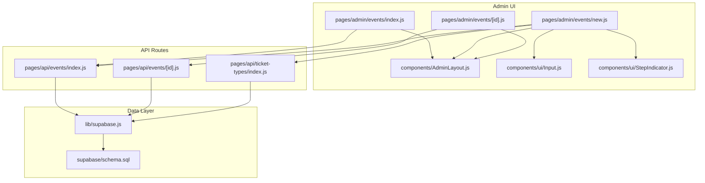
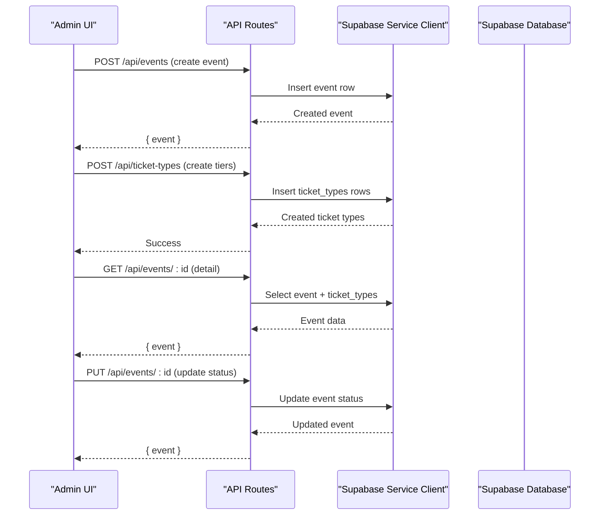
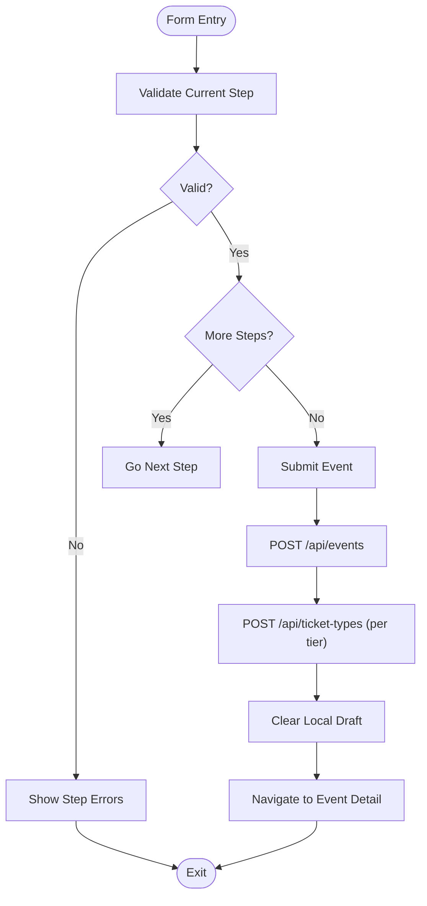
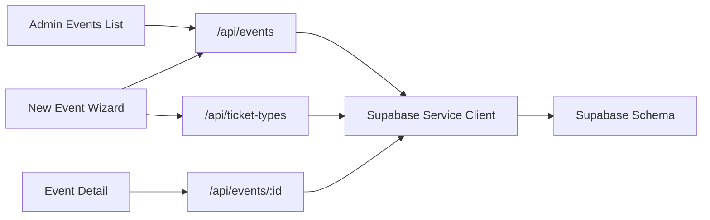

# Event Management Interface

<cite>
**Referenced Files in This Document**
- [pages/admin/events/index.js](file://pages/admin/events/index.js)
- [pages/admin/events/new.js](file://pages/admin/events/new.js)
- [pages/admin/events/[id].js](file://pages/admin/events/[id].js)
- [pages/api/events/index.js](file://pages/api/events/index.js)
- [pages/api/events/[id].js](file://pages/api/events/[id].js)
- [pages/api/ticket-types/index.js](file://pages/api/ticket-types/index.js)
- [lib/supabase.js](file://lib/supabase.js)
- [supabase/schema.sql](file://supabase/schema.sql)
- [components/AdminLayout.js](file://components/AdminLayout.js)
- [components/ui/Input.js](file://components/ui/Input.js)
- [components/ui/StepIndicator.js](file://components/ui/StepIndicator.js)
</cite>

## Table of Contents
1. Introduction
2. Project Structure
3. Core Components
4. Architecture Overview
5. Detailed Component Analysis
6. Dependency Analysis
7. Performance Considerations
8. Troubleshooting Guide
9. Conclusion

## Introduction
This document provides a comprehensive guide to the Event Management Interface sub-feature. It covers:
- The event listing page with filtering, sorting, and search capabilities
- The event creation form with validation, ticket type configuration, pricing setup, and capacity management
- The event editing interface with status management (draft, published, sold_out, completed, cancelled), date/time scheduling, venue information, and promotional settings
- Concrete examples of form interactions, data validation rules, and error handling
- The relationship between event CRUD operations and backend API endpoints
- Responsive design considerations, accessibility compliance, and UX optimization for complex forms
- Integration with Supabase for data persistence and real-time updates

## Project Structure
The Event Management feature spans Next.js pages for admin UI and API routes for server-side logic, backed by Supabase. Key files include:
- Admin UI pages for listing, creating, and managing events
- API routes for event and ticket-type CRUD
- Supabase client and schema definitions
- Shared layout and UI components

**Diagram sources**
- [pages/admin/events/index.js:1-70](file://pages/admin/events/index.js#L1-L70)
- [pages/admin/events/new.js:1-1067](file://pages/admin/events/new.js#L1-L1067)
- [pages/admin/events/[id].js](file://pages/admin/events/[id].js#L1-L175)
- [pages/api/events/index.js:1-42](file://pages/api/events/index.js#L1-L42)
- [pages/api/events/[id].js](file://pages/api/events/[id].js#L1-L42)
- [pages/api/ticket-types/index.js:1-49](file://pages/api/ticket-types/index.js#L1-L49)
- [lib/supabase.js:1-23](file://lib/supabase.js#L1-L23)
- [supabase/schema.sql:1-166](file://supabase/schema.sql#L1-L166)
- [components/AdminLayout.js:1-194](file://components/AdminLayout.js#L1-L194)
- [components/ui/Input.js:1-49](file://components/ui/Input.js#L1-L49)
- [components/ui/StepIndicator.js:1-24](file://components/ui/StepIndicator.js#L1-L24)

**Section sources**
- [pages/admin/events/index.js:1-70](file://pages/admin/events/index.js#L1-L70)
- [pages/admin/events/new.js:1-1067](file://pages/admin/events/new.js#L1-L1067)
- [pages/admin/events/[id].js](file://pages/admin/events/[id].js#L1-L175)
- [pages/api/events/index.js:1-42](file://pages/api/events/index.js#L1-L42)
- [pages/api/events/[id].js](file://pages/api/events/[id].js#L1-L42)
- [pages/api/ticket-types/index.js:1-49](file://pages/api/ticket-types/index.js#L1-L49)
- [lib/supabase.js:1-23](file://lib/supabase.js#L1-L23)
- [supabase/schema.sql:1-166](file://supabase/schema.sql#L1-L166)
- [components/AdminLayout.js:1-194](file://components/AdminLayout.js#L1-L194)
- [components/ui/Input.js:1-49](file://components/ui/Input.js#L1-L49)
- [components/ui/StepIndicator.js:1-24](file://components/ui/StepIndicator.js#L1-L24)

## Core Components
- Admin Events List: Displays events with status badges, basic stats, and navigation to create or edit events.
- New Event Wizard: Multi-step form covering Basic Info, Branding, Tickets, Venue, Schedule, Payments, and Publish steps. Includes autosave to localStorage, step validation, and submission flow.
- Event Detail: Tabbed view with overview, ticket types, and attendees; supports status changes and quick actions.
- API Endpoints: REST endpoints for events and ticket types, enforcing roles and persisting via Supabase.
- Supabase Client: Provides service-role client for server-side access and environment-based configuration.
- UI Components: Reusable Input and StepIndicator used across forms.

**Section sources**
- [pages/admin/events/index.js:1-70](file://pages/admin/events/index.js#L1-L70)
- [pages/admin/events/new.js:1-1067](file://pages/admin/events/new.js#L1-L1067)
- [pages/admin/events/[id].js](file://pages/admin/events/[id].js#L1-L175)
- [pages/api/events/index.js:1-42](file://pages/api/events/index.js#L1-L42)
- [pages/api/events/[id].js](file://pages/api/events/[id].js#L1-L42)
- [pages/api/ticket-types/index.js:1-49](file://pages/api/ticket-types/index.js#L1-L49)
- [lib/supabase.js:1-23](file://lib/supabase.js#L1-L23)
- [components/ui/Input.js:1-49](file://components/ui/Input.js#L1-L49)
- [components/ui/StepIndicator.js:1-24](file://components/ui/StepIndicator.js#L1-L24)

## Architecture Overview
The Event Management Interface follows a clear separation of concerns:
- Frontend pages handle user interactions, state, and validation
- API routes enforce authentication/authorization and perform database operations
- Supabase provides relational storage with row-level security policies

**Diagram sources**
- [pages/api/events/index.js:1-42](file://pages/api/events/index.js#L1-L42)
- [pages/api/events/[id].js](file://pages/api/events/[id].js#L1-L42)
- [pages/api/ticket-types/index.js:1-49](file://pages/api/ticket-types/index.js#L1-L49)
- [lib/supabase.js:1-23](file://lib/supabase.js#L1-L23)

**Section sources**
- [pages/api/events/index.js:1-42](file://pages/api/events/index.js#L1-L42)
- [pages/api/events/[id].js](file://pages/api/events/[id].js#L1-L42)
- [pages/api/ticket-types/index.js:1-49](file://pages/api/ticket-types/index.js#L1-L49)
- [lib/supabase.js:1-23](file://lib/supabase.js#L1-L23)

## Detailed Component Analysis

### Event Listing Page
- Displays a responsive grid of event cards with name, date, status badge, tickets sold, and checked-in counts.
- Navigation to create new events and navigate into detail views.
- Data source: fetches from an admin stats endpoint; currently returns a list of events for display.

Key behaviors:
- Loading states and empty-state messaging
- Status color mapping for visual clarity
- Click-to-navigate to event detail

Limitations and enhancements:
- Filtering, sorting, and search are not implemented on this page; consider adding client-side filters for status and date, and a search input for event names.

**Section sources**
- [pages/admin/events/index.js:1-70](file://pages/admin/events/index.js#L1-L70)

### Event Creation Form (Wizard)
The wizard guides users through seven steps:
- Basic Info: event name, slug, date, time, venue, description
- Branding: poster image URL, theme color presets, total capacity
- Tickets: dynamic ticket tier configuration (name, price, quantity, color)
- Venue: venue description, coordinates, parking info, accessibility notes
- Schedule: doors open, start/end times, schedule notes
- Payments: accepted payment methods and refund policy
- Publish: review summary and choose draft vs publish

Validation and UX:
- Per-step validation prevents progression until required fields are valid
- Autosave to localStorage every few seconds to prevent data loss
- Slug auto-generation from event name with sanitization
- Error messages displayed inline per field and per step

Submission flow:
- Creates event via POST /api/events
- Creates multiple ticket types via POST /api/ticket-types
- Clears local draft and navigates to event detail

**Diagram sources**
- [pages/admin/events/new.js:1-1067](file://pages/admin/events/new.js#L1-L1067)
- [pages/api/events/index.js:1-42](file://pages/api/events/index.js#L1-L42)
- [pages/api/ticket-types/index.js:1-49](file://pages/api/ticket-types/index.js#L1-L49)

**Section sources**
- [pages/admin/events/new.js:1-1067](file://pages/admin/events/new.js#L1-L1067)
- [components/ui/Input.js:1-49](file://components/ui/Input.js#L1-L49)
- [components/ui/StepIndicator.js:1-24](file://components/ui/StepIndicator.js#L1-L24)

### Event Editing Interface (Detail View)
- Displays event overview, ticket types, and attendees tabs
- Quick status update via dropdown (draft, published, sold_out, completed, cancelled)
- Attendee search by name, email, phone, or ticket ID
- Revenue and availability metrics per ticket type

Status management:
- PUT request updates event status
- Immediate UI refresh without full reload

Attendees tab:
- Fetches attendees with optional search query parameter
- Shows ticket type, status, check-in details, and purchase date

**Section sources**
- [pages/admin/events/[id].js](file://pages/admin/events/[id].js#L1-L175)
- [pages/api/events/[id].js](file://pages/api/events/[id].js#L1-L42)

### Backend API Endpoints
- POST /api/events: Create event with required fields; sets default status to draft; normalizes slug
- GET /api/events: Returns published events with ticket types
- GET /api/events/:id: Returns single event with ticket types
- PUT /api/events/:id: Updates event fields; enforces role checks
- DELETE /api/events/:id: Deletes event; enforces role checks
- POST /api/ticket-types: Creates ticket type linked to event; validates required fields
- PUT /api/ticket-types: Updates ticket type by id
- DELETE /api/ticket-types: Deletes ticket type by id

Authorization:
- requireRole ensures only super_admin or organiser can modify resources

Error handling:
- Returns appropriate HTTP status codes and error messages for missing fields and failures

**Section sources**
- [pages/api/events/index.js:1-42](file://pages/api/events/index.js#L1-L42)
- [pages/api/events/[id].js](file://pages/api/events/[id].js#L1-L42)
- [pages/api/ticket-types/index.js:1-49](file://pages/api/ticket-types/index.js#L1-L49)
- [lib/auth.js:1-47](file://lib/auth.js#L1-L47)

### Supabase Integration
- Service-role client used in API routes for privileged operations
- Environment variables configure Supabase URL and keys
- Schema defines tables for events, ticket_types, tickets, payments, promo_codes, and relationships
- Row-level security policies restrict public reads to published events and related ticket types

Real-time updates:
- While not explicitly wired in these pages, Supabase subscriptions can be used to reflect live changes (e.g., attendee check-ins, ticket sales)

**Section sources**
- [lib/supabase.js:1-23](file://lib/supabase.js#L1-L23)
- [supabase/schema.sql:1-166](file://supabase/schema.sql#L1-L166)

### UI Components and Accessibility
- Input component supports labels, helper text, and error states with aria-invalid for accessibility
- StepIndicator visually communicates progress through multi-step forms
- AdminLayout manages navigation, role checks, and logout behavior

Accessibility recommendations:
- Ensure all inputs have associated labels and visible error messages
- Provide keyboard navigation for step controls and status dropdowns
- Use semantic HTML and ARIA attributes consistently

**Section sources**
- [components/ui/Input.js:1-49](file://components/ui/Input.js#L1-L49)
- [components/ui/StepIndicator.js:1-24](file://components/ui/StepIndicator.js#L1-L24)
- [components/AdminLayout.js:1-194](file://components/AdminLayout.js#L1-L194)

## Dependency Analysis
The following diagram maps dependencies among UI pages, API routes, and data layer:

**Diagram sources**
- [pages/admin/events/index.js:1-70](file://pages/admin/events/index.js#L1-L70)
- [pages/admin/events/new.js:1-1067](file://pages/admin/events/new.js#L1-L1067)
- [pages/admin/events/[id].js](file://pages/admin/events/[id].js#L1-L175)
- [pages/api/events/index.js:1-42](file://pages/api/events/index.js#L1-L42)
- [pages/api/events/[id].js](file://pages/api/events/[id].js#L1-L42)
- [pages/api/ticket-types/index.js:1-49](file://pages/api/ticket-types/index.js#L1-L49)
- [lib/supabase.js:1-23](file://lib/supabase.js#L1-L23)
- [supabase/schema.sql:1-166](file://supabase/schema.sql#L1-L166)

**Section sources**
- [pages/admin/events/index.js:1-70](file://pages/admin/events/index.js#L1-L70)
- [pages/admin/events/new.js:1-1067](file://pages/admin/events/new.js#L1-L1067)
- [pages/admin/events/[id].js](file://pages/admin/events/[id].js#L1-L175)
- [pages/api/events/index.js:1-42](file://pages/api/events/index.js#L1-L42)
- [pages/api/events/[id].js](file://pages/api/events/[id].js#L1-L42)
- [pages/api/ticket-types/index.js:1-49](file://pages/api/ticket-types/index.js#L1-L49)
- [lib/supabase.js:1-23](file://lib/supabase.js#L1-L23)
- [supabase/schema.sql:1-166](file://supabase/schema.sql#L1-L166)

## Performance Considerations
- Minimize re-renders by memoizing expensive computations in the wizard (e.g., ticket totals and price ranges)
- Debounce autosave writes to localStorage to avoid excessive storage operations
- Paginate or filter attendee lists on the server side if datasets grow large
- Use Supabase indexes defined in schema for efficient queries (status, slug, event_id, etc.)
- Avoid unnecessary network calls by caching event data locally during session when appropriate

[No sources needed since this section provides general guidance]

## Troubleshooting Guide
Common issues and resolutions:
- Missing required fields: API returns 400 with error message; ensure form validation matches backend requirements
- Authentication/authorization errors: requireRole throws 401/403; verify session cookie and user role
- Supabase environment misconfiguration: console warns if env vars are missing; set NEXT_PUBLIC_SUPABASE_URL, NEXT_PUBLIC_SUPABASE_ANON_KEY, and SUPABASE_SERVICE_ROLE_KEY
- Ticket type creation fails: validate presence of event_id, name, price, and quantity_available
- Status update not reflected: confirm PUT request payload includes only allowed fields and that the response is handled

**Section sources**
- [pages/api/events/index.js:1-42](file://pages/api/events/index.js#L1-L42)
- [pages/api/events/[id].js](file://pages/api/events/[id].js#L1-L42)
- [pages/api/ticket-types/index.js:1-49](file://pages/api/ticket-types/index.js#L1-L49)
- [lib/auth.js:1-47](file://lib/auth.js#L1-L47)
- [lib/supabase.js:1-23](file://lib/supabase.js#L1-L23)

## Conclusion
The Event Management Interface provides a robust, user-friendly workflow for organizing events, configuring ticket types, and managing event status. The wizard-driven form simplifies complex inputs, while API routes enforce security and data integrity. Supabase integration ensures reliable persistence and scalable querying. Future enhancements can include advanced filtering and search on the listing page, real-time updates via Supabase subscriptions, and expanded promotional features.

[No sources needed since this section summarizes without analyzing specific files]