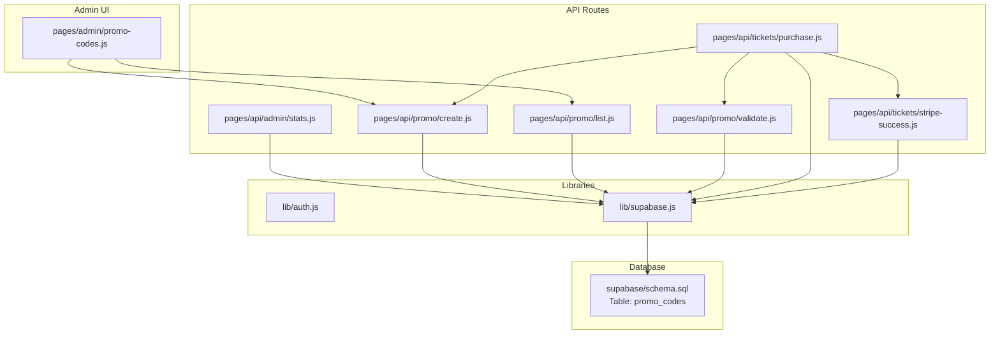
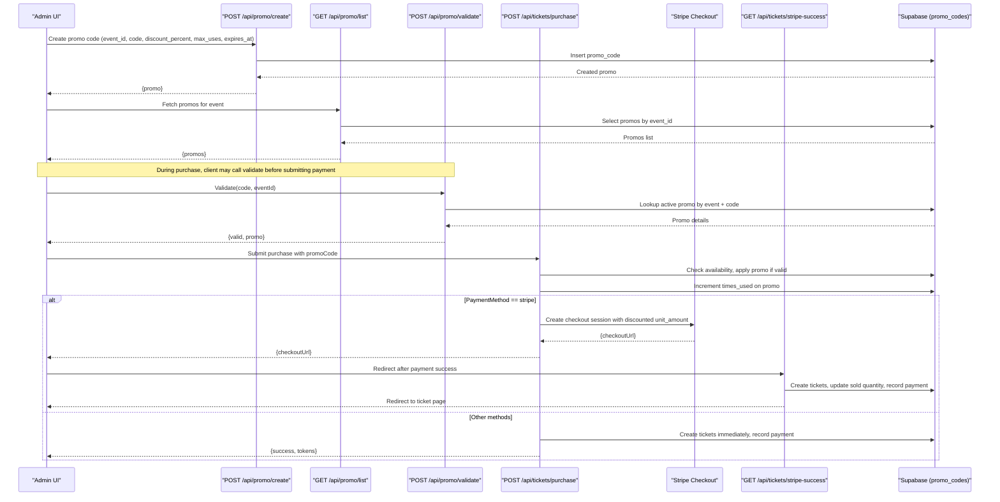
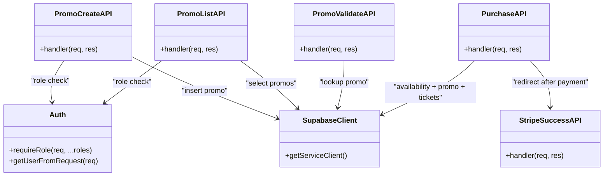

# Promo Code Management

<cite>
**Referenced Files in This Document**
- [promo-codes.js](file://pages/admin/promo-codes.js)
- [create.js](file://pages/api/promo/create.js)
- [list.js](file://pages/api/promo/list.js)
- [validate.js](file://pages/api/promo/validate.js)
- [purchase.js](file://pages/api/tickets/purchase.js)
- [stripe-success.js](file://pages/api/tickets/stripe-success.js)
- [schema.sql](file://supabase/schema.sql)
- [auth.js](file://lib/auth.js)
- [supabase.js](file://lib/supabase.js)
- [stats.js](file://pages/api/admin/stats.js)
</cite>

## Table of Contents
1. [Introduction](#introduction)
2. [Project Structure](#project-structure)
3. [Core Components](#core-components)
4. [Architecture Overview](#architecture-overview)
5. [Detailed Component Analysis](#detailed-component-analysis)
6. [Dependency Analysis](#dependency-analysis)
7. [Performance Considerations](#performance-considerations)
8. [Troubleshooting Guide](#troubleshooting-guide)
9. [Conclusion](#conclusion)
10. [Appendices](#appendices)

## Introduction
This document explains the Promo Code Management system within TicketFlow. It covers how promotional codes are created, listed, validated during ticket purchases, and tracked for usage. It also documents integration points with the purchase flow and payment processing, security considerations, and the complete API surface for promo code operations. The system supports percentage-based discounts scoped to events, with usage limits and expiration dates.

## Project Structure
Promo code functionality spans an admin UI page and three server-side API routes, backed by a Supabase database schema. The purchase flow integrates promo validation and discount application directly into ticket creation and payment handling.

**Diagram sources**
- [promo-codes.js:1-106](file://pages/admin/promo-codes.js#L1-L106)
- [create.js:1-23](file://pages/api/promo/create.js#L1-L23)
- [list.js:1-15](file://pages/api/promo/list.js#L1-L15)
- [validate.js:1-27](file://pages/api/promo/validate.js#L1-L27)
- [purchase.js:1-123](file://pages/api/tickets/purchase.js#L1-L123)
- [stripe-success.js:1-55](file://pages/api/tickets/stripe-success.js#L1-L55)
- [stats.js:1-41](file://pages/api/admin/stats.js#L1-L41)
- [auth.js:1-47](file://lib/auth.js#L1-L47)
- [supabase.js:1-23](file://lib/supabase.js#L1-L23)
- [schema.sql:105-117](file://supabase/schema.sql#L105-L117)

**Section sources**
- [promo-codes.js:1-106](file://pages/admin/promo-codes.js#L1-L106)
- [create.js:1-23](file://pages/api/promo/create.js#L1-L23)
- [list.js:1-15](file://pages/api/promo/list.js#L1-L15)
- [validate.js:1-27](file://pages/api/promo/validate.js#L1-L27)
- [purchase.js:1-123](file://pages/api/tickets/purchase.js#L1-L123)
- [stripe-success.js:1-55](file://pages/api/tickets/stripe-success.js#L1-L55)
- [stats.js:1-41](file://pages/api/admin/stats.js#L1-L41)
- [auth.js:1-47](file://lib/auth.js#L1-L47)
- [supabase.js:1-23](file://lib/supabase.js#L1-L23)
- [schema.sql:105-117](file://supabase/schema.sql#L105-L117)

## Core Components
- Admin Promo Codes UI: Creates new promo codes per event, lists existing codes, and shows basic usage metrics (times used vs max uses, expiration, active status).
- Create Promo Code API: Validates role permissions, inserts a new promo code record with defaults and constraints.
- List Promo Codes API: Returns all promo codes for a given event, ordered by creation time.
- Validate Promo Code API: Checks validity against event scope, activity, usage limit, and expiration.
- Purchase Flow Integration: Applies promo discount when provided, updates usage counters, computes discounted price, and proceeds to payment or ticket issuance.
- Stripe Success Handler: Finalizes tickets after successful payment, using metadata including discount applied.
- Database Schema: Defines the promo_codes table with constraints and relationships to events.

**Section sources**
- [promo-codes.js:1-106](file://pages/admin/promo-codes.js#L1-L106)
- [create.js:1-23](file://pages/api/promo/create.js#L1-L23)
- [list.js:1-15](file://pages/api/promo/list.js#L1-L15)
- [validate.js:1-27](file://pages/api/promo/validate.js#L1-L27)
- [purchase.js:1-123](file://pages/api/tickets/purchase.js#L1-L123)
- [stripe-success.js:1-55](file://pages/api/tickets/stripe-success.js#L1-L55)
- [schema.sql:105-117](file://supabase/schema.sql#L105-L117)

## Architecture Overview
The promo code system is event-scoped and integrated tightly with the purchase pipeline. Admins create and manage codes via the UI; the purchase flow validates and applies discounts atomically where possible. Payment providers receive the final discounted amount through checkout sessions or direct payment records.

**Diagram sources**
- [create.js:1-23](file://pages/api/promo/create.js#L1-L23)
- [list.js:1-15](file://pages/api/promo/list.js#L1-L15)
- [validate.js:1-27](file://pages/api/promo/validate.js#L1-L27)
- [purchase.js:1-123](file://pages/api/tickets/purchase.js#L1-L123)
- [stripe-success.js:1-55](file://pages/api/tickets/stripe-success.js#L1-L55)
- [schema.sql:105-117](file://supabase/schema.sql#L105-L117)

## Detailed Component Analysis

### Admin Promo Codes Interface
- Creation form fields:
  - Event selection (required)
  - Code input (normalized to uppercase)
  - Discount percent (percentage-based discount)
  - Max uses (defaulting to 100 if not provided)
  - Expiration date (optional)
- Listing displays:
  - Code string
  - Discount percent
  - Usage count vs max uses
  - Expiration date (if set)
  - Active/inactive status

Behavior highlights:
- On submit, the UI calls the create API with normalized code and form values.
- After creation, it reloads the list filtered by selected event.
- Errors and success messages are displayed inline.

**Section sources**
- [promo-codes.js:1-106](file://pages/admin/promo-codes.js#L1-L106)
- [create.js:1-23](file://pages/api/promo/create.js#L1-L23)
- [list.js:1-15](file://pages/api/promo/list.js#L1-L15)

### Create Promo Code API
- Authorization: Requires super_admin or organiser roles.
- Input validation: Requires event_id, code, discount_percent; optional max_uses and expires_at.
- Data normalization: Code is uppercased and trimmed; numeric fields cast appropriately; default times_used set to 0; is_active set to true.
- Response: Returns created promo object.

Constraints enforced by schema:
- Unique constraint on (event_id, code)
- discount_percent between 1 and 100

**Section sources**
- [create.js:1-23](file://pages/api/promo/create.js#L1-L23)
- [auth.js:38-46](file://lib/auth.js#L38-L46)
- [schema.sql:105-117](file://supabase/schema.sql#L105-L117)

### List Promo Codes API
- Authorization: Requires super_admin or organiser roles.
- Filtering: By event_id query parameter.
- Ordering: By created_at descending.
- Response: Array of promo codes for the specified event.

**Section sources**
- [list.js:1-15](file://pages/api/promo/list.js#L1-L15)
- [auth.js:38-46](file://lib/auth.js#L38-L46)

### Validate Promo Code API
- Input: code and eventId required.
- Validation logic:
  - Lookup active promo matching event_id and code.
  - Reject if times_used >= max_uses.
  - Reject if expired (expires_at < current date).
- Response:
  - Valid: { valid: true, promo: { code, discount_percent } }
  - Invalid: { valid: false, error: message }

Note: This endpoint does not increment usage; usage is incremented during purchase.

**Section sources**
- [validate.js:1-27](file://pages/api/promo/validate.js#L1-L27)

### Purchase Flow Integration
- Availability check: Ensures requested quantity is available for the ticket type.
- Promo application:
  - If promoCode provided, looks up active promo for the event and code.
  - Validates usage limit and expiration inline.
  - If valid, increments times_used and calculates discounted unit price.
- Payment handling:
  - For Stripe: creates checkout session with discounted unit_amount and includes discount in metadata.
  - For other methods: creates tickets immediately and records payment.
- Post-payment success (Stripe):
  - Retrieves session, verifies paid status.
  - Creates tickets, updates sold quantity, records payment with transaction reference.

Conflict resolution:
- Inline validation ensures only one promo can be applied per purchase request.
- Usage counter increment occurs at purchase time to avoid double-application across concurrent requests.

**Section sources**
- [purchase.js:1-123](file://pages/api/tickets/purchase.js#L1-L123)
- [stripe-success.js:1-55](file://pages/api/tickets/stripe-success.js#L1-L55)

### Reporting and Analytics
- Admin stats API aggregates revenue, tickets sold, and per-event breakdowns.
- Reports UI provides filtering by date range and event, and CSV export capability.
- While promo-specific analytics are not exposed via dedicated endpoints, promo usage contributes indirectly to revenue and ticket sales metrics.

**Section sources**
- [stats.js:1-41](file://pages/api/admin/stats.js#L1-L41)
- [reports.js:1-610](file://pages/admin/reports.js#L1-L610)

## Dependency Analysis
Promo code components depend on authentication and Supabase clients. The purchase flow depends on both promo validation and payment provider integration.

**Diagram sources**
- [auth.js:1-47](file://lib/auth.js#L1-L47)
- [supabase.js:1-23](file://lib/supabase.js#L1-L23)
- [create.js:1-23](file://pages/api/promo/create.js#L1-L23)
- [list.js:1-15](file://pages/api/promo/list.js#L1-L15)
- [validate.js:1-27](file://pages/api/promo/validate.js#L1-L27)
- [purchase.js:1-123](file://pages/api/tickets/purchase.js#L1-L123)
- [stripe-success.js:1-55](file://pages/api/tickets/stripe-success.js#L1-L55)

**Section sources**
- [auth.js:1-47](file://lib/auth.js#L1-L47)
- [supabase.js:1-23](file://lib/supabase.js#L1-L23)
- [create.js:1-23](file://pages/api/promo/create.js#L1-L23)
- [list.js:1-15](file://pages/api/promo/list.js#L1-L15)
- [validate.js:1-27](file://pages/api/promo/validate.js#L1-L27)
- [purchase.js:1-123](file://pages/api/tickets/purchase.js#L1-L123)
- [stripe-success.js:1-55](file://pages/api/tickets/stripe-success.js#L1-L55)

## Performance Considerations
- Database queries:
  - Promo lookup uses indexed columns (event_id, code, is_active) for fast retrieval.
  - Ensure indexes exist for frequently queried fields; schema includes general indexes but promo-specific ones could be added if needed.
- Concurrency:
  - Usage counter increment happens during purchase; consider atomic updates or row-level locking to prevent race conditions under high load.
- Payment flows:
  - Stripe checkout offloads payment processing; ensure idempotency on success handler to avoid duplicate ticket creation.

[No sources needed since this section provides general guidance]

## Troubleshooting Guide
Common issues and resolutions:
- Missing required fields:
  - Create API returns 400 if event_id, code, or discount_percent are missing.
  - Validate API returns 400 if code or eventId are missing.
- Invalid promo code:
  - Validate API returns valid: false with descriptive error when code not found, inactive, expired, or usage limit reached.
- Insufficient permissions:
  - Create and List APIs require super_admin or organiser roles; unauthorized requests return 401 or 403.
- Purchase failures:
  - Availability errors occur when insufficient tickets remain.
  - Stripe success handler redirects on invalid session or unpaid status.

Operational checks:
- Verify environment variables for Supabase service role key and Stripe secret key.
- Confirm RLS policies allow service role access to promo_codes.

**Section sources**
- [create.js:1-23](file://pages/api/promo/create.js#L1-L23)
- [list.js:1-15](file://pages/api/promo/list.js#L1-L15)
- [validate.js:1-27](file://pages/api/promo/validate.js#L1-L27)
- [purchase.js:1-123](file://pages/api/tickets/purchase.js#L1-L123)
- [stripe-success.js:1-55](file://pages/api/tickets/stripe-success.js#L1-L55)
- [auth.js:38-46](file://lib/auth.js#L38-L46)
- [schema.sql:121-128](file://supabase/schema.sql#L121-L128)

## Conclusion
The Promo Code Management system provides a robust, event-scoped mechanism for creating and applying percentage-based discounts during ticket purchases. It integrates seamlessly with the purchase flow and payment processing, enforces usage limits and expiration, and exposes clear APIs for administration and validation. Security is handled via role-based authorization and service role database access. Future enhancements may include fixed-amount discounts, batch generation, rate limiting, fraud prevention, and dedicated promo analytics.

[No sources needed since this section summarizes without analyzing specific files]

## Appendices

### API Surface for Promo Code Operations
- POST /api/promo/create
  - Purpose: Create a new promo code for an event.
  - Auth: super_admin or organiser.
  - Body: event_id, code, discount_percent, max_uses (optional), expires_at (optional).
  - Response: { promo: {...} }
  - Errors: 400 (missing fields), 401/403 (unauthorized), 400 (DB error).

- GET /api/promo/list
  - Purpose: List promo codes for an event.
  - Auth: super_admin or organiser.
  - Query: eventId.
  - Response: { promos: [...] }.
  - Errors: 400 (missing eventId), 401/403 (unauthorized).

- POST /api/promo/validate
  - Purpose: Validate a promo code for an event.
  - Body: code, eventId.
  - Response: { valid: true/false, promo?: {...}, error?: string }.
  - Errors: 400 (missing fields), 500 (server error).

- POST /api/tickets/purchase
  - Purpose: Process ticket purchase with optional promo code.
  - Body: eventId, ticketTypeId, quantity, buyerName, buyerEmail, buyerPhone (optional), paymentMethod, promoCode (optional).
  - Behavior: Validates availability, applies promo if valid, increments usage, handles Stripe or other payments.
  - Response: { checkoutUrl } for Stripe or { success, tokens, orderId } for other methods.
  - Errors: 400 (validation/availability), 500 (server error).

- GET /api/tickets/stripe-success
  - Purpose: Finalize purchase after Stripe payment success.
  - Query: session_id.
  - Behavior: Verifies payment, creates tickets, updates sold quantity, records payment.
  - Response: Redirect to ticket page or error redirect.

- GET /api/admin/stats
  - Purpose: Aggregate analytics across events, tickets, and payments.
  - Auth: super_admin or organiser.
  - Response: { totalRevenue, totalTicketsSold, totalEvents, events: [...] }.

**Section sources**
- [create.js:1-23](file://pages/api/promo/create.js#L1-L23)
- [list.js:1-15](file://pages/api/promo/list.js#L1-L15)
- [validate.js:1-27](file://pages/api/promo/validate.js#L1-L27)
- [purchase.js:1-123](file://pages/api/tickets/purchase.js#L1-L123)
- [stripe-success.js:1-55](file://pages/api/tickets/stripe-success.js#L1-L55)
- [stats.js:1-41](file://pages/api/admin/stats.js#L1-L41)

### Data Model: Promo Codes
- Table: promo_codes
  - Columns: id (UUID PK), event_id (FK to events), code (TEXT NOT NULL), discount_percent (INTEGER 1–100), max_uses (INTEGER DEFAULT 100), times_used (INTEGER DEFAULT 0), expires_at (DATE), is_active (BOOLEAN DEFAULT TRUE).
  - Constraints: UNIQUE(event_id, code).

**Section sources**
- [schema.sql:105-117](file://supabase/schema.sql#L105-L117)

### Example Workflows

- Creating a promo code:
  - Admin selects an event, enters a code (e.g., EARLY20), sets discount percent (e.g., 20), optional max uses and expiration, submits.
  - Server validates role and fields, inserts record, returns created promo.

- Validating a promo code:
  - Client sends code and eventId to validate endpoint.
  - Server checks activity, usage limit, and expiration; returns validity and discount percent.

- Applying a promo during purchase:
  - Client includes promoCode in purchase request.
  - Server validates availability, applies discount, increments times_used, and proceeds to payment.

- Batch operations and reporting:
  - Current implementation supports single-code creation and listing per event.
  - Reporting aggregates overall metrics; promo-specific reports are not exposed yet.

[No sources needed since this section provides conceptual examples based on analyzed files]

### Security Considerations
- Authorization:
  - Admin endpoints enforce role checks via requireRole.
- Rate limiting:
  - Not implemented in current codebase; recommend adding middleware to throttle validate and purchase endpoints to mitigate abuse.
- Fraud prevention:
  - Validate inputs strictly, normalize codes, and ensure atomicity of usage increments.
  - Consider CAPTCHA or device fingerprinting for high-risk scenarios.
- Data integrity:
  - Use service role client for server-side operations.
  - Enforce RLS policies to restrict unintended access.

[No sources needed since this section provides general guidance]