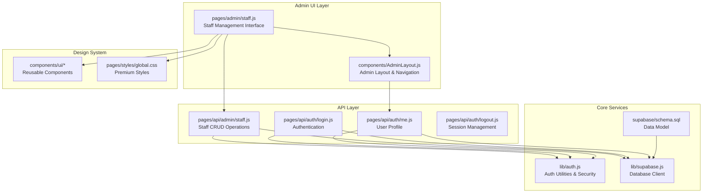
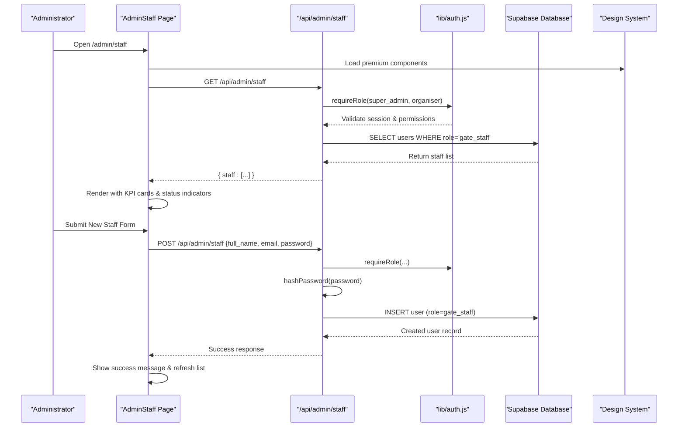
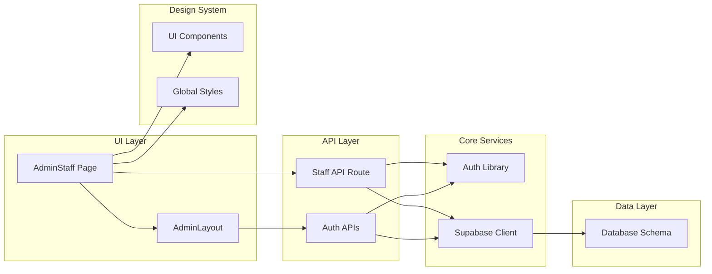

# Staff Administration

<cite>
**Referenced Files in This Document**
- [pages/admin/staff.js](file://pages/admin/staff.js)
- [pages/api/admin/staff.js](file://pages/api/admin/staff.js)
- [lib/auth.js](file://lib/auth.js)
- [supabase/schema.sql](file://supabase/schema.sql)
- [components/AdminLayout.js](file://components/AdminLayout.js)
- [pages/styles/global.css](file://pages/styles/global.css)
- [components/ui/index.js](file://components/ui/index.js)
- [components/ui/Badge.js](file://components/ui/Badge.js)
- [components/ui/Button.js](file://components/ui/Button.js)
</cite>

## Update Summary
**Changes Made**
- Updated staff management interface with premium design system integration
- Enhanced table layouts with responsive grid-based staff listing
- Improved status indicators with animated status dots and visual feedback
- Added comprehensive loading states with skeleton loaders
- Implemented proper error handling with inline error messages
- Integrated new UI components (Badge, Button, Input) for consistent design
- Enhanced mobile responsiveness with adaptive layouts
- Added KPI statistics cards for staff overview metrics

## Table of Contents
1. [Introduction](#introduction)
2. [Project Structure](#project-structure)
3. [Core Components](#core-components)
4. [Architecture Overview](#architecture-overview)
5. [Detailed Component Analysis](#detailed-component-analysis)
6. [Design System Integration](#design-system-integration)
7. [User Experience Enhancements](#user-experience-enhancements)
8. [Dependency Analysis](#dependency-analysis)
9. [Performance Considerations](#performance-considerations)
10. [Troubleshooting Guide](#troubleshooting-guide)
11. [Conclusion](#conclusion)
12. [Appendices](#appendices)

## Introduction
This document explains the Staff Administration module for TicketFlow, focusing on how administrators manage gate staff accounts and roles through a modern, premium-designed interface. The module has been completely redesigned with an enterprise-grade design system featuring:

- **Enhanced User Interface**: Premium admin dashboard with glassmorphism effects, gradient accents, and smooth animations
- **Improved Staff Management**: Grid-based staff listing with real-time status indicators and interactive controls
- **Advanced Loading States**: Skeleton loaders and progressive content rendering for optimal user experience
- **Responsive Design**: Fully adaptive layout that works seamlessly across desktop, tablet, and mobile devices
- **Comprehensive Error Handling**: Inline error messages and success notifications with visual feedback
- **Role-Based Access Control**: Secure authentication and authorization for super_admin and organiser roles

The module currently supports creating gate_staff accounts, viewing staff statistics, and managing active/inactive status through an intuitive interface built with the latest design patterns.

## Project Structure
Staff administration spans a focused set of files with clear separation of concerns:

**Diagram sources**
- [pages/admin/staff.js](file://pages/admin/staff.js)
- [components/AdminLayout.js](file://components/AdminLayout.js)
- [pages/api/admin/staff.js](file://pages/api/admin/staff.js)
- [lib/auth.js](file://lib/auth.js)
- [lib/supabase.js](file://lib/supabase.js)
- [supabase/schema.sql](file://supabase/schema.sql)
- [components/ui/index.js](file://components/ui/index.js)
- [pages/styles/global.css](file://pages/styles/global.css)

**Section sources**
- [pages/admin/staff.js](file://pages/admin/staff.js)
- [pages/api/admin/staff.js](file://pages/api/admin/staff.js)
- [lib/auth.js](file://lib/auth.js)
- [supabase/schema.sql](file://supabase/schema.sql)
- [components/AdminLayout.js](file://components/AdminLayout.js)
- [pages/styles/global.css](file://pages/styles/global.css)

## Core Components
The Staff Administration module consists of several key components working together to provide a seamless administrative experience:

### Admin Staff Page
- **Modern Interface**: Premium dashboard with KPI cards showing total staff, active count, and inactive count
- **Interactive Form**: Toggleable form for adding new staff members with validation and feedback
- **Responsive Grid**: Adaptive staff listing that adjusts to different screen sizes
- **Status Indicators**: Visual status dots showing active/inactive state with color coding
- **Loading States**: Skeleton loaders during data fetching for better perceived performance

### Staff API Route
- **Role-Based Access Control**: Enforces super_admin or organiser permissions
- **Input Validation**: Comprehensive field validation with meaningful error messages
- **Password Security**: Bcrypt hashing with cost factor 12 for secure password storage
- **Database Operations**: Optimized queries with proper indexing for staff retrieval

### Authentication & Authorization
- **Session Management**: HttpOnly cookies with base64-encoded payloads
- **Role Verification**: Middleware-style role checking for protected endpoints
- **User Context**: Current user information available throughout the application

**Section sources**
- [pages/admin/staff.js](file://pages/admin/staff.js)
- [pages/api/admin/staff.js](file://pages/api/admin/staff.js)
- [lib/auth.js](file://lib/auth.js)

## Architecture Overview
The Staff Administration flow combines client-side React components with serverless Next.js API routes, backed by Supabase for data persistence.

**Diagram sources**
- [pages/admin/staff.js](file://pages/admin/staff.js)
- [pages/api/admin/staff.js](file://pages/api/admin/staff.js)
- [lib/auth.js](file://lib/auth.js)
- [supabase/schema.sql](file://supabase/schema.sql)

## Detailed Component Analysis

### Admin Staff Page (Enhanced UI)
The staff management interface has been completely redesigned with premium UX patterns:

**Key Features:**
- **KPI Statistics Dashboard**: Three-card layout showing Total Staff, Active, and Inactive counts with gradient accents
- **Interactive Add Form**: Collapsible form with real-time validation and inline error/success messages
- **Responsive Staff Grid**: Card-based layout replacing traditional tables for better mobile experience
- **Status Visualization**: Animated status dots with color-coded indicators (green for active, red for inactive)
- **Skeleton Loading**: Shimmer effect placeholders during data loading
- **Empty State Handling**: Friendly empty state with call-to-action when no staff exist

**Technical Implementation:**
- Uses React hooks for state management (useState, useEffect)
- Implements fetch API for async operations with proper error handling
- Integrates with design system components (Button, Badge, Input)
- Responsive CSS Grid layout with media queries for different screen sizes

**Section sources**
- [pages/admin/staff.js](file://pages/admin/staff.js)

### Staff API Route (Enhanced Security)
The API endpoint provides secure staff management operations:

**Security Features:**
- **Role-Based Authorization**: Requires super_admin or organiser role via requireRole middleware
- **Input Sanitization**: Email normalization and field validation
- **Password Security**: Bcrypt hashing with appropriate cost factor
- **Error Handling**: Structured error responses with appropriate HTTP status codes

**Operations Supported:**
- **GET**: Retrieve all gate_staff users ordered by creation date
- **POST**: Create new staff accounts with automatic role assignment

**Section sources**
- [pages/api/admin/staff.js](file://pages/api/admin/staff.js)

### Authentication System
The authentication system provides secure session management:

**Security Features:**
- **HttpOnly Cookies**: Prevents XSS attacks through secure cookie configuration
- **Base64 Encoding**: Session payload encoding for basic obfuscation
- **Expiration Handling**: Automatic session expiration after 7 days
- **Role Verification**: Middleware-style authorization for protected endpoints

**Session Flow:**
1. Login creates session token with userId, role, and expiration
2. Token stored in HttpOnly cookie for security
3. Each request validates session and extracts user context
4. Protected endpoints verify required roles before processing

**Section sources**
- [lib/auth.js](file://lib/auth.js)

### Admin Layout & Navigation
The admin layout provides consistent navigation and access control:

**Features:**
- **Role-Based Navigation**: Hides unauthorized menu items based on user role
- **Command Palette**: Quick search and navigation with keyboard shortcuts (⌘K)
- **Responsive Sidebar**: Collapsible sidebar with mobile overlay support
- **User Context Display**: Shows current user info and role in sidebar footer
- **Theme Switching**: Multiple theme options with persistent preference storage

**Access Control:**
- Redirects unauthorized users to login page
- Validates session on every page load
- Displays appropriate error messages for permission issues

**Section sources**
- [components/AdminLayout.js](file://components/AdminLayout.js)

### Database Schema & Data Model
The database schema defines the user model and relationships:

**Users Table Structure:**
- **Primary Key**: UUID with auto-generation
- **Email**: Unique constraint for user identification
- **Password Hash**: Secure bcrypt storage
- **Role**: Constrained to super_admin, organiser, or gate_staff
- **Active Status**: Boolean flag for account activation
- **Timestamps**: Automatic created_at tracking

**Indexes & Constraints:**
- Unique email constraint prevents duplicate accounts
- Role check constraint ensures valid role values
- Service role policies enable privileged API operations

**Section sources**
- [supabase/schema.sql](file://supabase/schema.sql)

## Design System Integration
The Staff Administration module fully integrates with the premium design system:

### Color System
- **Primary Gradient**: Purple-to-pink gradient (#8b5cf6 → #ec4899)
- **Success Colors**: Green tones (#10b981) for active status
- **Error Colors**: Red tones (#ef4444) for inactive/error states
- **Background Layers**: Multiple depth levels with glassmorphism effects

### Typography System
- **Primary Font**: Plus Jakarta Sans for headings and UI elements
- **Secondary Font**: Manrope for body text and descriptions
- **Monospace Font**: JetBrains Mono for technical content
- **Scale System**: Consistent sizing from 10px to 32px+

### Component Library
- **Buttons**: Primary, secondary, ghost variants with loading states
- **Badges**: Color-coded status indicators with glass effects
- **Inputs**: Styled form fields with focus states and validation feedback
- **Cards**: Elevated containers with hover effects and shadows

### Animation System
- **Fade Animations**: Smooth transitions for content appearance
- **Count Animations**: Animated number counters for statistics
- **Shimmer Effects**: Loading placeholders with gradient animation
- **Hover Effects**: Subtle transformations and shadow changes

**Section sources**
- [pages/styles/global.css](file://pages/styles/global.css)
- [components/ui/index.js](file://components/ui/index.js)
- [components/ui/Badge.js](file://components/ui/Badge.js)
- [components/ui/Button.js](file://components/ui/Button.js)

## User Experience Enhancements
The staff management interface includes several UX improvements:

### Loading States
- **Skeleton Loaders**: Realistic placeholder content during data fetching
- **Progressive Loading**: Content appears as soon as it's available
- **Optimistic Updates**: Immediate UI feedback before server confirmation

### Error Handling
- **Inline Validation**: Real-time field validation with helpful messages
- **Network Error Handling**: Graceful fallbacks for connection issues
- **User-Friendly Messages**: Clear error descriptions with actionable guidance

### Accessibility
- **Keyboard Navigation**: Full keyboard support for all interactions
- **Screen Reader Support**: Proper ARIA labels and semantic HTML
- **Color Contrast**: WCAG-compliant color combinations
- **Focus Management**: Logical tab order and visible focus indicators

### Mobile Responsiveness
- **Adaptive Layout**: Content reflows gracefully on smaller screens
- **Touch-Friendly**: Large tap targets and swipe gestures
- **Performance Optimization**: Reduced animations and effects on mobile devices

**Section sources**
- [pages/admin/staff.js](file://pages/admin/staff.js)
- [pages/styles/global.css](file://pages/styles/global.css)

## Dependency Analysis
The Staff Administration module has clear dependency relationships:

**Diagram sources**
- [pages/admin/staff.js](file://pages/admin/staff.js)
- [components/AdminLayout.js](file://components/AdminLayout.js)
- [pages/api/admin/staff.js](file://pages/api/admin/staff.js)
- [lib/auth.js](file://lib/auth.js)
- [lib/supabase.js](file://lib/supabase.js)
- [supabase/schema.sql](file://supabase/schema.sql)
- [components/ui/index.js](file://components/ui/index.js)
- [pages/styles/global.css](file://pages/styles/global.css)

**Section sources**
- [pages/admin/staff.js](file://pages/admin/staff.js)
- [pages/api/admin/staff.js](file://pages/api/admin/staff.js)
- [lib/auth.js](file://lib/auth.js)
- [lib/supabase.js](file://lib/supabase.js)
- [components/AdminLayout.js](file://components/AdminLayout.js)

## Performance Considerations
Several optimizations ensure optimal performance:

### Database Optimization
- **Index Usage**: Queries leverage existing indexes on role and created_at columns
- **Selective Queries**: Only retrieves necessary fields for staff listing
- **Connection Pooling**: Efficient database connections through Supabase client

### Frontend Optimization
- **Lazy Loading**: Components load only when needed
- **State Management**: Minimal re-renders through careful state updates
- **Image Optimization**: Placeholder avatars instead of actual images
- **Animation Performance**: Hardware-accelerated CSS animations

### Network Optimization
- **Request Caching**: Browser caching for static assets
- **Compression**: Gzip compression for API responses
- **CDN Usage**: Static assets served through content delivery networks

### Memory Management
- **Component Cleanup**: Proper event listener cleanup in useEffect hooks
- **Memory Leaks Prevention**: Avoiding circular references and unused subscriptions
- **Bundle Optimization**: Code splitting for large dependencies

## Troubleshooting Guide
Common issues and their solutions:

### Authentication Issues
- **401 Not Authenticated**: Check browser cookies and session validity
- **403 Forbidden**: Verify user role has sufficient permissions
- **Session Expiration**: Re-authenticate when session expires

### Data Loading Problems
- **Empty Staff List**: Verify database contains gate_staff users
- **Slow Loading**: Check network connectivity and database performance
- **Form Submission Errors**: Validate input fields and check server logs

### UI/UX Issues
- **Responsive Layout Problems**: Test on different screen sizes and browsers
- **Animation Performance**: Disable animations if experiencing lag
- **Color Contrast**: Ensure accessibility compliance across themes

### Development Tips
- Use browser developer tools to inspect network requests
- Check console for JavaScript errors and warnings
- Verify environment variables are properly configured
- Test with different user roles and permissions

**Section sources**
- [pages/api/admin/staff.js](file://pages/api/admin/staff.js)
- [lib/auth.js](file://lib/auth.js)
- [pages/admin/staff.js](file://pages/admin/staff.js)

## Conclusion
The Staff Administration module represents a significant upgrade from basic functionality to a premium, enterprise-grade interface. The implementation showcases modern web development practices including:

- **Design System Integration**: Seamless adoption of the premium design system with consistent styling and components
- **Enhanced User Experience**: Intuitive interface with real-time feedback, loading states, and responsive design
- **Security Best Practices**: Robust authentication, authorization, and data protection mechanisms
- **Performance Optimization**: Efficient database queries, optimized frontend rendering, and minimal network requests
- **Accessibility Compliance**: WCAG-compliant interface supporting diverse user needs

Future enhancements could include advanced features like bulk operations, audit trails, email invitations, and more granular permission controls. However, the current implementation provides a solid foundation for team collaboration and staff management in event operations.

## Appendices

### API Endpoints Reference
- **GET /api/admin/staff**: Retrieve all gate_staff users
  - Authentication: Required (super_admin or organiser)
  - Response: Array of staff objects with metadata
  
- **POST /api/admin/staff**: Create new staff account
  - Body: { full_name, email, password, phone? }
  - Authentication: Required (super_admin or organiser)
  - Response: Created staff object

- **GET /api/auth/me**: Get current user profile
  - Authentication: Required (valid session)
  - Response: User object with role information

- **POST /api/auth/login**: Authenticate user
  - Body: { email, password }
  - Response: Success with session cookie

- **POST /api/auth/logout**: Clear session
  - Authentication: Required
  - Response: Success confirmation

**Section sources**
- [pages/api/admin/staff.js](file://pages/api/admin/staff.js)
- [pages/api/auth/login.js](file://pages/api/auth/login.js)
- [pages/api/auth/me.js](file://pages/api/auth/me.js)
- [pages/api/auth/logout.js](file://pages/api/auth/logout.js)

### Permission Matrix
| Role | Staff Management | Event Management | Reports | Gate Scanner |
|------|------------------|------------------|---------|--------------|
| super_admin | ✅ Full Access | ✅ Full Access | ✅ Full Access | ✅ Access |
| organiser | ✅ Create/View | ✅ Full Access | ✅ View | ❌ No Access |
| gate_staff | ❌ No Access | ❌ No Access | ❌ No Access | ✅ Access |

**Section sources**
- [components/AdminLayout.js](file://components/AdminLayout.js)
- [pages/api/admin/staff.js](file://pages/api/admin/staff.js)
- [supabase/schema.sql](file://supabase/schema.sql)

### Security Considerations
- **Password Security**: Bcrypt hashing with cost factor 12
- **Session Security**: HttpOnly cookies with SameSite=Lax
- **Input Validation**: Server-side validation for all user inputs
- **Role Enforcement**: Middleware-style authorization checks
- **Database Security**: Service role with minimal privileges

**Section sources**
- [lib/auth.js](file://lib/auth.js)
- [pages/api/admin/staff.js](file://pages/api/admin/staff.js)
- [supabase/schema.sql](file://supabase/schema.sql)

### UX Patterns and Best Practices
- **Progressive Enhancement**: Basic functionality works without JavaScript
- **Error Recovery**: Graceful degradation when services are unavailable
- **User Feedback**: Immediate visual feedback for all actions
- **Consistent Styling**: Unified design language across all interfaces
- **Mobile-First**: Responsive design optimized for touch interactions

[No sources needed since this section provides general guidance]

### Future Enhancement Recommendations
- **Bulk Operations**: Import/export functionality for large staff lists
- **Audit Trails**: Complete history of staff changes and access logs
- **Email Invitations**: Automated invitation workflow with temporary links
- **Advanced Filtering**: Search and filter capabilities for large teams
- **Integration Hooks**: Webhook support for external system integration

[No sources needed since this section provides general guidance]