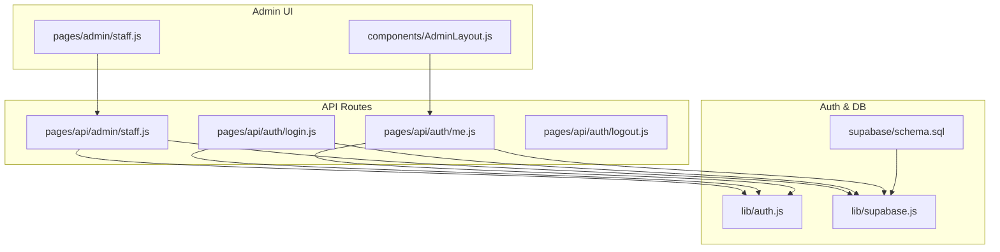
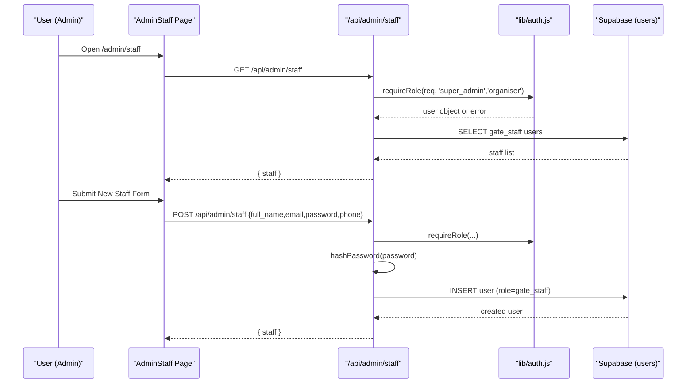
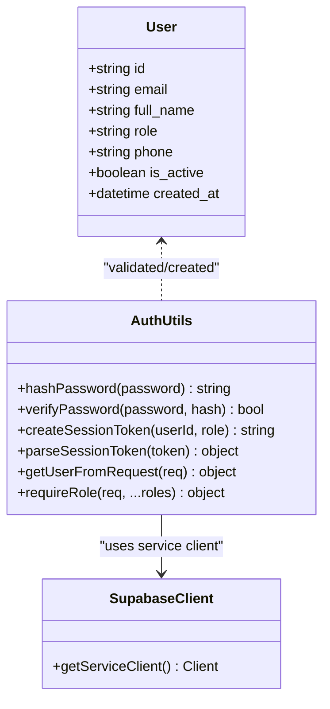
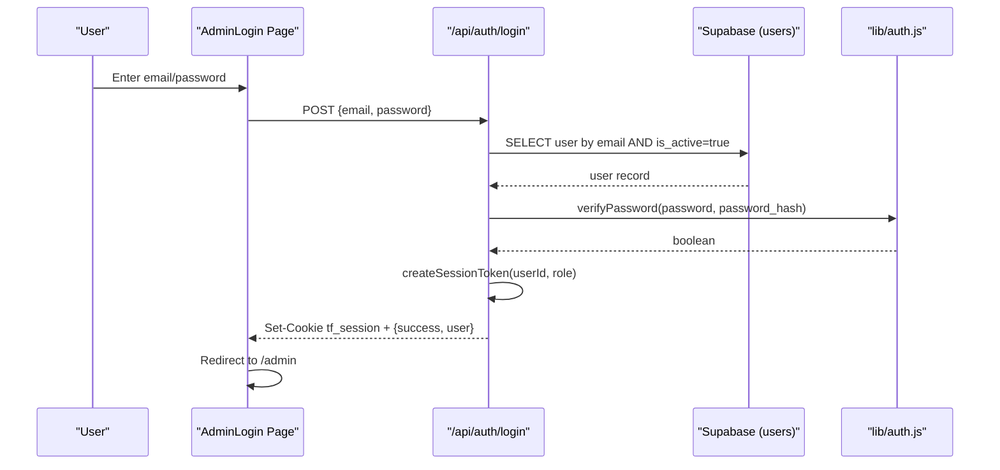
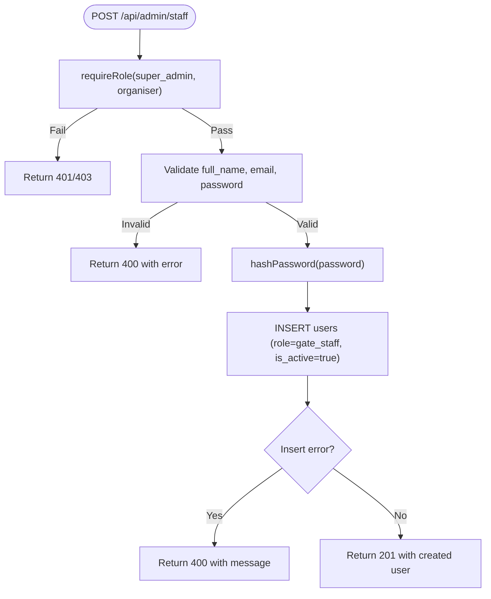
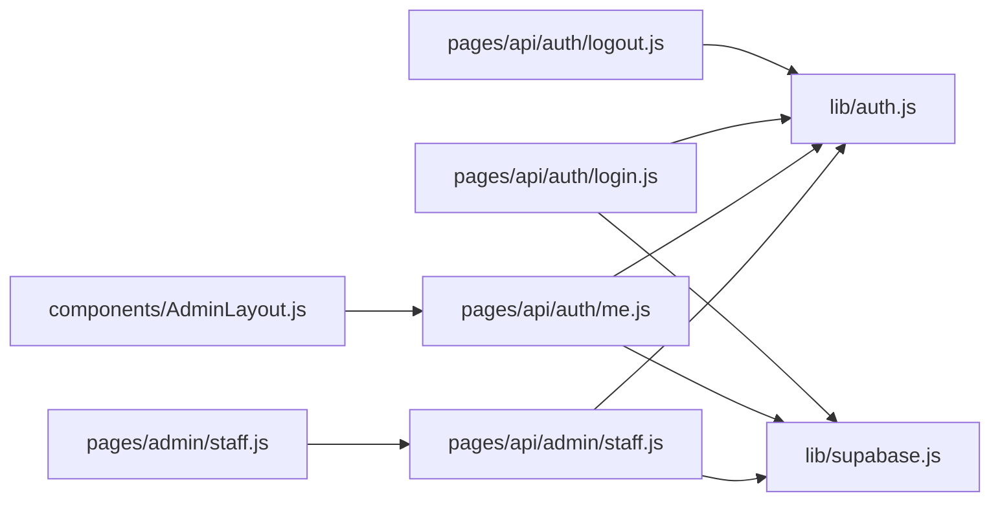

# Staff Administration

<cite>
**Referenced Files in This Document**
- [pages/admin/staff.js](file://pages/admin/staff.js)
- [pages/api/admin/staff.js](file://pages/api/admin/staff.js)
- [lib/auth.js](file://lib/auth.js)
- [supabase/schema.sql](file://supabase/schema.sql)
- [components/AdminLayout.js](file://components/AdminLayout.js)
- [pages/admin/login.js](file://pages/admin/login.js)
- [pages/api/auth/login.js](file://pages/api/auth/login.js)
- [pages/api/auth/me.js](file://pages/api/auth/me.js)
- [pages/api/auth/logout.js](file://pages/api/auth/logout.js)
- [lib/supabase.js](file://lib/supabase.js)
</cite>

## Table of Contents
1. [Introduction](#introduction)
2. [Project Structure](#project-structure)
3. [Core Components](#core-components)
4. [Architecture Overview](#architecture-overview)
5. [Detailed Component Analysis](#detailed-component-analysis)
6. [Dependency Analysis](#dependency-analysis)
7. [Performance Considerations](#performance-considerations)
8. [Troubleshooting Guide](#troubleshooting-guide)
9. [Conclusion](#conclusion)
10. [Appendices](#appendices)

## Introduction
This document explains the Staff Administration module for TicketFlow, focusing on how administrators manage gate staff accounts and roles. It covers:
- Adding new staff members via the admin UI
- Role-based access control (RBAC) for super_admin and organiser users
- Permission enforcement on API endpoints
- Authentication and session management
- Data model and database constraints
- Current limitations and recommended enhancements (invitations, bulk operations, audit trails, notifications)

The module currently supports creating gate_staff accounts and listing them in the admin panel. Advanced features like invitations, role assignment beyond gate_staff, bulk operations, and audit logging are not implemented yet but are outlined as recommendations.

## Project Structure
Staff administration spans a small set of focused files:
- Admin UI page for managing gate staff
- API route to list and create staff
- Auth utilities for password hashing, session token handling, and role checks
- Database schema defining user roles and constraints
- Admin layout enforcing role-based navigation and authentication

**Diagram sources**
- [pages/admin/staff.js](file://pages/admin/staff.js)
- [components/AdminLayout.js](file://components/AdminLayout.js)
- [pages/api/admin/staff.js](file://pages/api/admin/staff.js)
- [pages/api/auth/login.js](file://pages/api/auth/login.js)
- [pages/api/auth/me.js](file://pages/api/auth/me.js)
- [pages/api/auth/logout.js](file://pages/api/auth/logout.js)
- [lib/auth.js](file://lib/auth.js)
- [lib/supabase.js](file://lib/supabase.js)
- [supabase/schema.sql](file://supabase/schema.sql)

**Section sources**
- [pages/admin/staff.js](file://pages/admin/staff.js)
- [pages/api/admin/staff.js](file://pages/api/admin/staff.js)
- [lib/auth.js](file://lib/auth.js)
- [supabase/schema.sql](file://supabase/schema.sql)
- [components/AdminLayout.js](file://components/AdminLayout.js)
- [pages/admin/login.js](file://pages/admin/login.js)
- [pages/api/auth/login.js](file://pages/api/auth/login.js)
- [pages/api/auth/me.js](file://pages/api/auth/me.js)
- [pages/api/auth/logout.js](file://pages/api/auth/logout.js)
- [lib/supabase.js](file://lib/supabase.js)

## Core Components
- Admin Staff Page: Renders a form to add gate_staff and lists existing staff with active/inactive status.
- Staff API Route: Enforces RBAC, validates input, hashes passwords, and persists users to the database.
- Auth Utilities: Provide password hashing/verification, session token creation/parsing, and role authorization.
- Admin Layout: Validates current user’s role and protects admin routes.
- Database Schema: Defines users table with role constraints and indexes.

Key responsibilities:
- UI collects full_name, email, phone, password; defaults role to gate_staff.
- API enforces that only super_admin or organiser can call staff endpoints.
- Passwords are hashed before storage.
- Session is managed via cookies and validated per request.

**Section sources**
- [pages/admin/staff.js](file://pages/admin/staff.js)
- [pages/api/admin/staff.js](file://pages/api/admin/staff.js)
- [lib/auth.js](file://lib/auth.js)
- [supabase/schema.sql](file://supabase/schema.sql)
- [components/AdminLayout.js](file://components/AdminLayout.js)

## Architecture Overview
The Staff Administration flow combines client-side React pages with serverless Next.js API routes backed by Supabase.

**Diagram sources**
- [pages/admin/staff.js](file://pages/admin/staff.js)
- [pages/api/admin/staff.js](file://pages/api/admin/staff.js)
- [lib/auth.js](file://lib/auth.js)
- [supabase/schema.sql](file://supabase/schema.sql)

## Detailed Component Analysis

### Admin Staff Page (UI)
- Loads staff list on mount via GET /api/admin/staff.
- Displays a toggleable form to add a new gate_staff account.
- On submit, posts full_name, email, phone, password; server assigns role gate_staff.
- Shows loading states and errors inline.

Behavior highlights:
- Default role assignment to gate_staff at the UI layer.
- Basic validation enforced by required fields.
- Error messages surfaced from API responses.

Enhancement opportunities:
- Add role selection dropdown (super_admin, organiser, gate_staff).
- Implement edit/delete functionality.
- Add search/filter and pagination for large teams.

**Section sources**
- [pages/admin/staff.js](file://pages/admin/staff.js)

### Staff API Route
- Requires authenticated super_admin or organiser via requireRole.
- GET returns all users with role gate_staff.
- POST validates required fields, hashes password, inserts into users table, returns created record.
- Returns appropriate HTTP status codes and JSON error objects.

Security considerations:
- Role check prevents unauthorized access.
- Password hashing ensures secure storage.
- Email normalization applied before insert.

Limitations:
- No update or delete endpoints exist.
- No invitation workflow; accounts are created directly.
- No audit trail for changes.

**Section sources**
- [pages/api/admin/staff.js](file://pages/api/admin/staff.js)

### Authentication and Session Management
- Login endpoint verifies credentials against users table and sets an HttpOnly cookie tf_session containing a base64-encoded payload with userId, role, and expiration.
- Me endpoint reads the cookie, decodes it, and returns minimal user profile.
- Logout clears the session cookie.
- requireRole utility enforces role checks on protected endpoints.

Session details:
- Cookie name: tf_session
- Payload: base64 JSON with userId, role, exp (7 days)
- Validation: parseSessionToken checks expiration and integrity

Security notes:
- Cookies are HttpOnly and SameSite=Lax.
- Service role key used server-side for privileged DB operations.

**Section sources**
- [pages/api/auth/login.js](file://pages/api/auth/login.js)
- [pages/api/auth/me.js](file://pages/api/auth/me.js)
- [pages/api/auth/logout.js](file://pages/api/auth/logout.js)
- [lib/auth.js](file://lib/auth.js)
- [lib/supabase.js](file://lib/supabase.js)

### Admin Layout and Access Control
- Fetches current user via /api/auth/me on mount.
- Redirects to login if no valid session or insufficient role (requires super_admin or organiser).
- Displays user info and role in sidebar.

Access control behavior:
- Gate staff cannot access admin routes due to role check in layout.
- Only super_admin and organiser can navigate admin sections.

**Section sources**
- [components/AdminLayout.js](file://components/AdminLayout.js)
- [pages/api/auth/me.js](file://pages/api/auth/me.js)

### Database Schema and Roles
- users table includes role constrained to super_admin, organiser, gate_staff.
- is_active flag indicates account status.
- Indexes optimize common queries (e.g., tickets, events), while users rely on unique email constraint.

Data model implications:
- Role-based permissions enforced at application layer and can be extended with RLS policies.
- Default super_admin seed provided for initial setup.

**Section sources**
- [supabase/schema.sql](file://supabase/schema.sql)

### Class Diagram: Auth and User Model

**Diagram sources**
- [lib/auth.js](file://lib/auth.js)
- [lib/supabase.js](file://lib/supabase.js)
- [supabase/schema.sql](file://supabase/schema.sql)

### Sequence Diagram: Login Flow

**Diagram sources**
- [pages/admin/login.js](file://pages/admin/login.js)
- [pages/api/auth/login.js](file://pages/api/auth/login.js)
- [lib/auth.js](file://lib/auth.js)
- [supabase/schema.sql](file://supabase/schema.sql)

### Flowchart: Staff Creation Algorithm

**Diagram sources**
- [pages/api/admin/staff.js](file://pages/api/admin/staff.js)
- [lib/auth.js](file://lib/auth.js)

## Dependency Analysis
- AdminStaff page depends on /api/admin/staff for data and mutations.
- Staff API depends on lib/auth for role checks and password hashing, and lib/supabase for DB access.
- AdminLayout depends on /api/auth/me to validate sessions and roles.
- All auth endpoints depend on lib/auth for session parsing and verification.
- Database interactions rely on Supabase service role client for privileged operations.

**Diagram sources**
- [pages/admin/staff.js](file://pages/admin/staff.js)
- [pages/api/admin/staff.js](file://pages/api/admin/staff.js)
- [lib/auth.js](file://lib/auth.js)
- [lib/supabase.js](file://lib/supabase.js)
- [components/AdminLayout.js](file://components/AdminLayout.js)
- [pages/api/auth/me.js](file://pages/api/auth/me.js)
- [pages/api/auth/login.js](file://pages/api/auth/login.js)
- [pages/api/auth/logout.js](file://pages/api/auth/logout.js)

**Section sources**
- [pages/admin/staff.js](file://pages/admin/staff.js)
- [pages/api/admin/staff.js](file://pages/api/admin/staff.js)
- [lib/auth.js](file://lib/auth.js)
- [lib/supabase.js](file://lib/supabase.js)
- [components/AdminLayout.js](file://components/AdminLayout.js)
- [pages/api/auth/me.js](file://pages/api/auth/me.js)
- [pages/api/auth/login.js](file://pages/api/auth/login.js)
- [pages/api/auth/logout.js](file://pages/api/auth/logout.js)

## Performance Considerations
- The staff list query filters by role gate_staff and orders by created_at; ensure indexing on role and created_at if dataset grows.
- Password hashing uses bcrypt with cost factor 12; acceptable for moderate traffic but consider caching strategies for repeated validations if needed.
- Session tokens are short-lived (7 days); minimize re-authentication overhead by refreshing user profile efficiently.
- Avoid unnecessary re-renders in the admin UI by memoizing lists and using optimistic updates where appropriate.

[No sources needed since this section provides general guidance]

## Troubleshooting Guide
Common issues and resolutions:
- 401 Not authenticated: Missing or invalid tf_session cookie; ensure login succeeded and cookies are enabled.
- 403 Insufficient permissions: Current user role is not super_admin or organiser; verify role in users table.
- 400 Bad Request: Missing required fields (full_name, email, password) during staff creation; validate inputs on the client side.
- Network errors: Check environment variables for Supabase URL and keys; ensure service role key is configured server-side.

Operational tips:
- Use browser dev tools to inspect cookies and network requests.
- Verify Supabase connection and service role key configuration.
- Confirm users table constraints and indexes align with queries.

**Section sources**
- [pages/api/admin/staff.js](file://pages/api/admin/staff.js)
- [lib/auth.js](file://lib/auth.js)
- [lib/supabase.js](file://lib/supabase.js)

## Conclusion
The Staff Administration module provides a secure foundation for managing gate_staff accounts with role-based access control and robust authentication. While current capabilities focus on creating and listing gate_staff, future enhancements should include:
- Invitation workflows with email notifications
- Role assignment flexibility beyond gate_staff
- Edit/delete operations and bulk actions
- Audit trails for compliance and accountability
- Enhanced permission matrices and optional RLS policies

These improvements will strengthen security, usability, and operational oversight for team collaboration.

[No sources needed since this section summarizes without analyzing specific files]

## Appendices

### API Endpoints Summary
- GET /api/admin/staff
  - Purpose: List gate_staff users
  - Auth: super_admin or organiser
  - Response: { staff: [{ id, email, full_name, phone, is_active, created_at }] }
  - Errors: 401/403 (auth), 400 (server error)

- POST /api/admin/staff
  - Purpose: Create a new gate_staff account
  - Body: { full_name, email, password, phone? }
  - Auth: super_admin or organiser
  - Response: { staff: { ...user } }
  - Errors: 400 (validation/server), 401/403 (auth)

- POST /api/auth/login
  - Purpose: Authenticate and set session cookie
  - Body: { email, password }
  - Response: { success: true, user: { id, email, full_name, role } }, Set-Cookie: tf_session
  - Errors: 400, 401, 500

- GET /api/auth/me
  - Purpose: Get current user profile
  - Auth: Valid tf_session
  - Response: { user: { id, email, full_name, role, phone } }
  - Errors: 401, 500

- POST /api/auth/logout
  - Purpose: Clear session cookie
  - Response: { success: true }

**Section sources**
- [pages/api/admin/staff.js](file://pages/api/admin/staff.js)
- [pages/api/auth/login.js](file://pages/api/auth/login.js)
- [pages/api/auth/me.js](file://pages/api/auth/me.js)
- [pages/api/auth/logout.js](file://pages/api/auth/logout.js)

### Permission Matrix
- super_admin: Full admin access; can manage staff and other admin functions.
- organiser: Can manage staff (current implementation allows super_admin and organiser to access staff endpoints).
- gate_staff: Cannot access admin panel; used for event check-in operations.

Current enforcement:
- AdminLayout restricts navigation to super_admin and organiser.
- Staff API requires super_admin or organiser.

Recommendations:
- Introduce granular permissions (e.g., manage_staff, view_reports).
- Implement RLS policies for fine-grained row-level access.

**Section sources**
- [components/AdminLayout.js](file://components/AdminLayout.js)
- [pages/api/admin/staff.js](file://pages/api/admin/staff.js)
- [supabase/schema.sql](file://supabase/schema.sql)

### Security Considerations
- Passwords are hashed with bcrypt before storage.
- Session tokens are stored in HttpOnly cookies with SameSite=Lax.
- Service role key is used server-side for privileged DB operations.
- Input validation occurs on both client and server sides.

Best practices:
- Rotate secrets and service keys regularly.
- Monitor failed login attempts and implement rate limiting.
- Enable audit logging for sensitive operations.

**Section sources**
- [lib/auth.js](file://lib/auth.js)
- [pages/api/auth/login.js](file://pages/api/auth/login.js)
- [lib/supabase.js](file://lib/supabase.js)

### UX Patterns for Team Collaboration
- Inline error messages and loading states improve feedback.
- Clear role indicators in the sidebar help users understand permissions.
- Simple forms reduce cognitive load when adding staff.

Enhancements:
- Add confirmation dialogs for destructive actions.
- Provide tooltips explaining roles and permissions.
- Implement toast notifications for successful operations.

[No sources needed since this section provides general guidance]

### Notification Systems and Audit Trails
Current state:
- No email notifications for invitations or account creation.
- No audit logs for staff changes.

Recommended approach:
- Integrate an email provider (e.g., SendGrid) to send invitation emails with temporary links.
- Create an audit_logs table recording user_id, action, target_user_id, timestamp, and metadata.
- Trigger background jobs to handle notifications and logging asynchronously.

[No sources needed since this section provides general guidance]