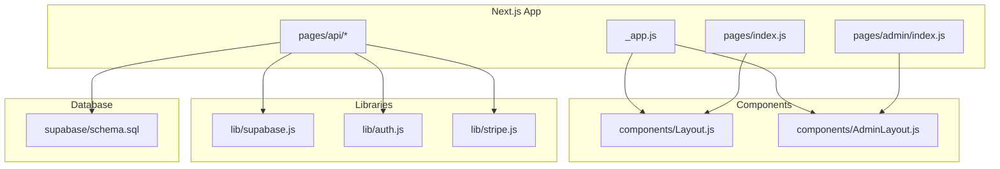
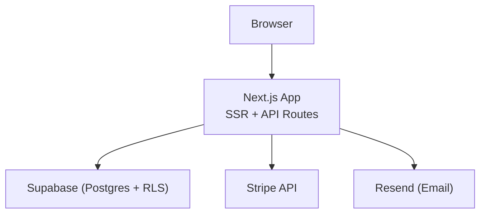
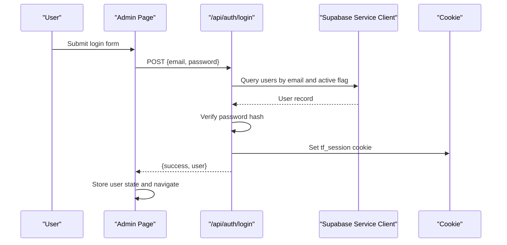
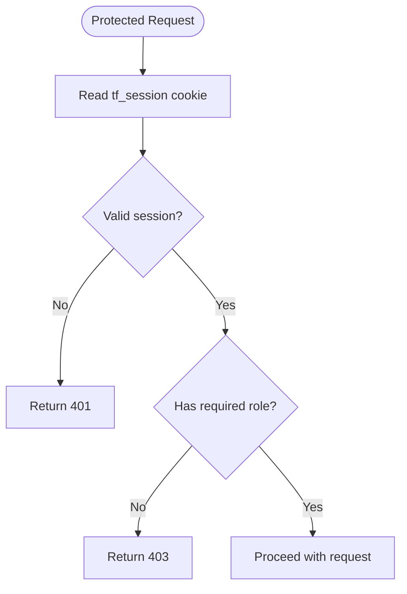
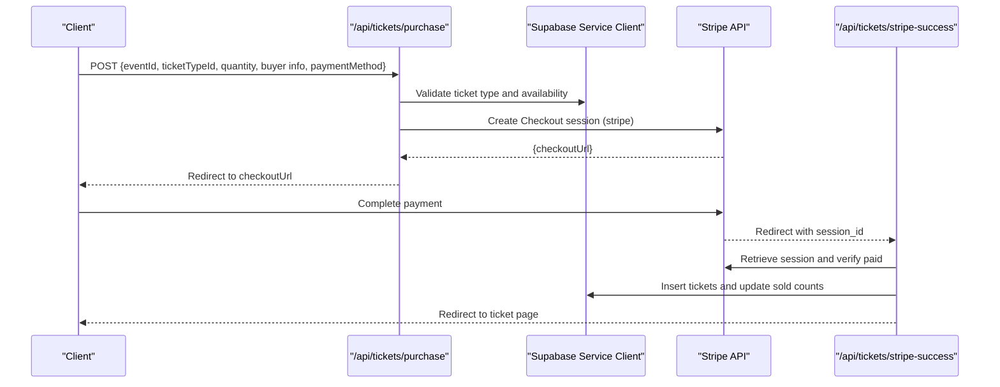
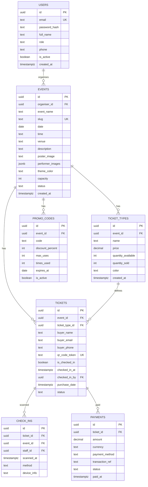
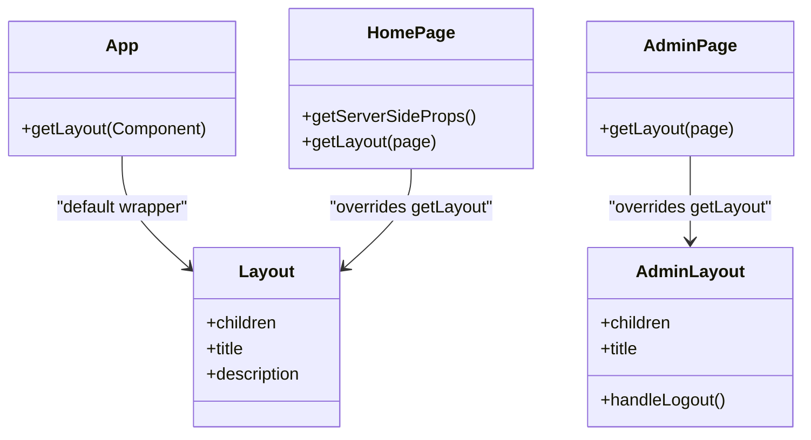
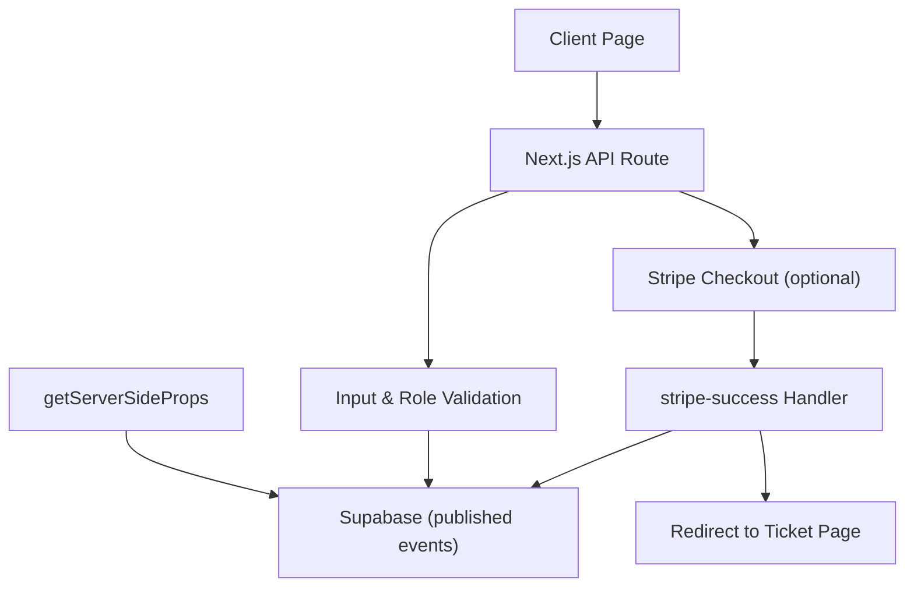

# Architecture Overview

<cite>
**Referenced Files in This Document**
- [package.json](file://package.json)
- [next.config.js](file://next.config.js)
- [pages/_app.js](file://pages/_app.js)
- [components/Layout.js](file://components/Layout.js)
- [components/AdminLayout.js](file://components/AdminLayout.js)
- [lib/supabase.js](file://lib/supabase.js)
- [lib/auth.js](file://lib/auth.js)
- [lib/stripe.js](file://lib/stripe.js)
- [supabase/schema.sql](file://supabase/schema.sql)
- [pages/index.js](file://pages/index.js)
- [pages/admin/index.js](file://pages/admin/index.js)
- [pages/api/auth/login.js](file://pages/api/auth/login.js)
- [pages/api/auth/me.js](file://pages/api/auth/me.js)
- [pages/api/tickets/purchase.js](file://pages/api/tickets/purchase.js)
- [pages/api/tickets/stripe-success.js](file://pages/api/tickets/stripe-success.js)
</cite>

## Table of Contents
1. Introduction
2. Project Structure
3. Core Components
4. Architecture Overview
5. Detailed Component Analysis
6. Dependency Analysis
7. Performance Considerations
8. Troubleshooting Guide
9. Conclusion

## Introduction
TicketFlow is a Next.js application with server-side rendering and API routes that provides a modern ticketing platform for events. It separates frontend pages, reusable UI components, backend API routes, and the database layer. Data flows from client requests through Next.js API routes to Supabase, with Stripe handling payments and Resend available for email notifications. Authentication uses cookies with role-based access control for admin and gate staff areas.

## Project Structure
The project follows Next.js conventions:
- pages/: App entry points, layouts, and API routes
- components/: Reusable UI and layout wrappers
- lib/: Shared utilities (Supabase clients, auth helpers, Stripe client)
- supabase/: Database schema and policies
- next.config.js: Next.js configuration for strict mode and image domains



**Diagram sources**
- [pages/_app.js:1-14](file://pages/_app.js#L1-L14)
- [components/Layout.js:1-281](file://components/Layout.js#L1-L281)
- [components/AdminLayout.js:1-194](file://components/AdminLayout.js#L1-L194)
- [lib/supabase.js:1-23](file://lib/supabase.js#L1-L23)
- [lib/auth.js:1-47](file://lib/auth.js#L1-L47)
- [lib/stripe.js:1-6](file://lib/stripe.js#L1-L6)
- [supabase/schema.sql:1-166](file://supabase/schema.sql#L1-L166)
- [pages/index.js:1-753](file://pages/index.js#L1-L753)
- [pages/admin/index.js:1-585](file://pages/admin/index.js#L1-L585)

**Section sources**
- [package.json:1-24](file://package.json#L1-L24)
- [next.config.js:1-14](file://next.config.js#L1-L14)
- [pages/_app.js:1-14](file://pages/_app.js#L1-L14)

## Core Components
- Layout and AdminLayout provide consistent page shells, navigation, and theme management.
- _app.js wraps all pages with ToastProvider and a default Layout; pages can override getLayout for custom layouts.
- Supabase client exposes public and service-role clients for secure server-side operations.
- Auth module handles password hashing/verification, session token creation/parsing, and role enforcement.
- Stripe client initializes the payment SDK for checkout sessions.

Key responsibilities:
- Frontend pages render content and call API routes for data mutations.
- API routes enforce authentication and authorization, interact with Supabase via service-role client, and integrate with Stripe.
- Database schema defines entities and RLS policies for public read access on published events.

**Section sources**
- [components/Layout.js:1-281](file://components/Layout.js#L1-L281)
- [components/AdminLayout.js:1-194](file://components/AdminLayout.js#L1-L194)
- [pages/_app.js:1-14](file://pages/_app.js#L1-L14)
- [lib/supabase.js:1-23](file://lib/supabase.js#L1-L23)
- [lib/auth.js:1-47](file://lib/auth.js#L1-L47)
- [lib/stripe.js:1-6](file://lib/stripe.js#L1-L6)
- [supabase/schema.sql:1-166](file://supabase/schema.sql#L1-L166)

## Architecture Overview
High-level architecture:
- Client browser renders React components via Next.js SSR/CSR.
- Pages call Next.js API routes for authenticated operations.
- API routes use Supabase service-role client to perform privileged DB operations.
- Payments flow through Stripe Checkout; success webhook redirects back to TicketFlow to finalize tickets.



[No sources needed since this diagram shows conceptual workflow, not actual code structure]

## Detailed Component Analysis

### Authentication Flow and Session Management
Authentication is cookie-based with a signed session payload containing userId and role. Login verifies credentials against Supabase users table, sets an HttpOnly cookie, and returns user info. The /api/auth/me endpoint reads the cookie and returns current user details. Admin pages validate roles client-side and redirect unauthorized users.



**Diagram sources**
- [pages/api/auth/login.js:1-31](file://pages/api/auth/login.js#L1-L31)
- [lib/auth.js:1-47](file://lib/auth.js#L1-L47)
- [lib/supabase.js:1-23](file://lib/supabase.js#L1-L23)

**Section sources**
- [pages/api/auth/login.js:1-31](file://pages/api/auth/login.js#L1-L31)
- [pages/api/auth/me.js:1-19](file://pages/api/auth/me.js#L1-L19)
- [lib/auth.js:1-47](file://lib/auth.js#L1-L47)

### Role-Based Access Control
- requireRole helper enforces minimum roles for protected endpoints.
- AdminLayout checks current user role on mount and redirects if insufficient.
- Database RLS policies allow public read access to published events and ticket types.



**Diagram sources**
- [lib/auth.js:1-47](file://lib/auth.js#L1-L47)
- [components/AdminLayout.js:1-194](file://components/AdminLayout.js#L1-L194)
- [supabase/schema.sql:120-154](file://supabase/schema.sql#L120-L154)

**Section sources**
- [lib/auth.js:1-47](file://lib/auth.js#L1-L47)
- [components/AdminLayout.js:1-194](file://components/AdminLayout.js#L1-L194)
- [supabase/schema.sql:120-154](file://supabase/schema.sql#L120-L154)

### Ticket Purchase Flow (Stripe)
Purchase route validates inputs, checks availability, applies promo codes, and creates a Stripe Checkout session when using card payments. On success, stripe-success finalizes ticket creation and records payment.



**Diagram sources**
- [pages/api/tickets/purchase.js:1-123](file://pages/api/tickets/purchase.js#L1-L123)
- [pages/api/tickets/stripe-success.js:1-55](file://pages/api/tickets/stripe-success.js#L1-L55)
- [lib/supabase.js:1-23](file://lib/supabase.js#L1-L23)
- [lib/stripe.js:1-6](file://lib/stripe.js#L1-L6)

**Section sources**
- [pages/api/tickets/purchase.js:1-123](file://pages/api/tickets/purchase.js#L1-L123)
- [pages/api/tickets/stripe-success.js:1-55](file://pages/api/tickets/stripe-success.js#L1-L55)

### Data Models and Relationships
Core entities include users, events, ticket_types, tickets, check_ins, payments, and promo_codes. RLS policies enable public read access for published events and their ticket types. Indexes optimize common queries.



**Diagram sources**
- [supabase/schema.sql:1-166](file://supabase/schema.sql#L1-L166)

**Section sources**
- [supabase/schema.sql:1-166](file://supabase/schema.sql#L1-L166)

### Component Hierarchy and Layouts
Layout components wrap page-specific content. _app.js provides a default Layout and ToastProvider; AdminLayout adds sidebar navigation and role checks.



**Diagram sources**
- [pages/_app.js:1-14](file://pages/_app.js#L1-L14)
- [components/Layout.js:1-281](file://components/Layout.js#L1-L281)
- [components/AdminLayout.js:1-194](file://components/AdminLayout.js#L1-L194)
- [pages/index.js:726-753](file://pages/index.js#L726-L753)
- [pages/admin/index.js:584-585](file://pages/admin/index.js#L584-L585)

**Section sources**
- [pages/_app.js:1-14](file://pages/_app.js#L1-L14)
- [components/Layout.js:1-281](file://components/Layout.js#L1-L281)
- [components/AdminLayout.js:1-194](file://components/AdminLayout.js#L1-L194)
- [pages/index.js:726-753](file://pages/index.js#L726-L753)
- [pages/admin/index.js:584-585](file://pages/admin/index.js#L584-L585)

### Data Flow Patterns
- Server-side rendering fetches published events directly from Supabase using the service-role client in getServerSideProps.
- Client-side interactions call API routes for authenticated actions (login, purchase).
- API routes validate inputs, enforce roles, and mutate data via Supabase service-role client.
- Stripe Checkout offloads payment processing; success handler finalizes ticket issuance and records payments.



**Diagram sources**
- [pages/index.js:726-753](file://pages/index.js#L726-L753)
- [pages/api/tickets/purchase.js:1-123](file://pages/api/tickets/purchase.js#L1-L123)
- [pages/api/tickets/stripe-success.js:1-55](file://pages/api/tickets/stripe-success.js#L1-L55)
- [lib/supabase.js:1-23](file://lib/supabase.js#L1-L23)

**Section sources**
- [pages/index.js:726-753](file://pages/index.js#L726-L753)
- [pages/api/tickets/purchase.js:1-123](file://pages/api/tickets/purchase.js#L1-L123)
- [pages/api/tickets/stripe-success.js:1-55](file://pages/api/tickets/stripe-success.js#L1-L55)

## Dependency Analysis
External dependencies include Next.js, React, Supabase JS, Stripe SDK, bcryptjs, qrcode.react, and Resend. Configuration allows remote images from Unsplash and Supabase domains.

```mermaid
graph TB
Pkg["package.json"]
Next["next"]
React["react, react-dom"]
Supabase["@supabase/supabase-js"]
Stripe["@stripe/react-stripe-js", "stripe"]
Bcrypt["bcryptjs"]
QR["qrcode.react"]
Resend["resend"]
Config["next.config.js"]
Pkg --> Next
Pkg --> React
Pkg --> Supabase
Pkg --> Stripe
Pkg --> Bcrypt
Pkg --> QR
Pkg --> Resend
Config --> Next
```

**Diagram sources**
- [package.json:1-24](file://package.json#L1-L24)
- [next.config.js:1-14](file://next.config.js#L1-L14)

**Section sources**
- [package.json:1-24](file://package.json#L1-L24)
- [next.config.js:1-14](file://next.config.js#L1-L14)

## Performance Considerations
- Use SSR for initial event listings to improve SEO and perceived performance.
- Leverage Supabase indexes defined in schema for fast lookups (slug, status, tokens).
- Minimize client-side state by fetching only necessary data and using efficient filtering.
- Defer heavy operations (e.g., Stripe Checkout) to server-side API routes.
- Avoid unnecessary re-renders in layouts by memoizing stable values and avoiding frequent state updates.

[No sources needed since this section provides general guidance]

## Troubleshooting Guide
Common issues and resolutions:
- Missing environment variables: Ensure NEXT_PUBLIC_SUPABASE_URL, NEXT_PUBLIC_SUPABASE_ANON_KEY, SUPABASE_SERVICE_ROLE_KEY, STRIPE_SECRET_KEY are set.
- Authentication failures: Verify user is active and password hash matches; ensure cookie tf_session is present and valid.
- Payment errors: Confirm Stripe session retrieval succeeds and payment_status is paid before creating tickets.
- Permission denied: Check RLS policies and ensure service-role client is used in API routes.

**Section sources**
- [lib/supabase.js:1-23](file://lib/supabase.js#L1-L23)
- [pages/api/auth/login.js:1-31](file://pages/api/auth/login.js#L1-L31)
- [pages/api/tickets/stripe-success.js:1-55](file://pages/api/tickets/stripe-success.js#L1-L55)
- [supabase/schema.sql:120-154](file://supabase/schema.sql#L120-L154)

## Conclusion
TicketFlow’s architecture cleanly separates concerns across Next.js pages, API routes, and Supabase, with robust authentication and role-based access control. Stripe integration ensures secure payments, while Resend remains available for email workflows. The design supports scalability through server-side data fetching, indexed queries, and clear separation of client and server responsibilities.

[No sources needed since this section summarizes without analyzing specific files]