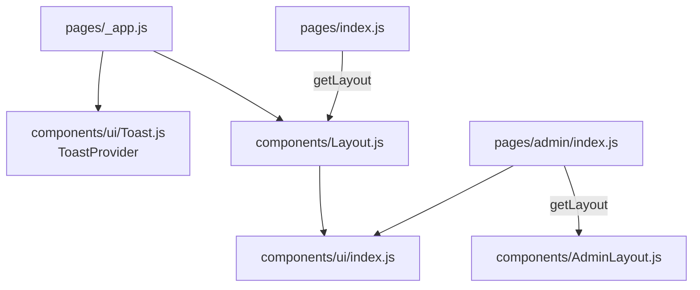
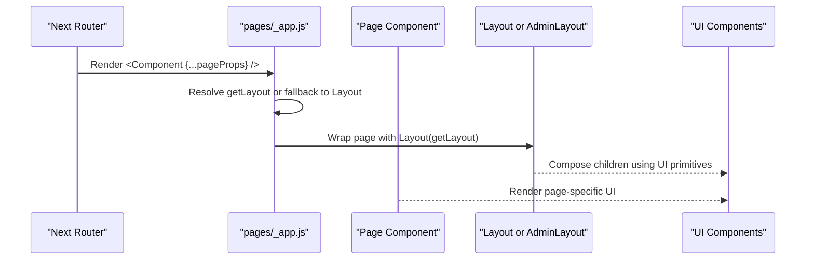
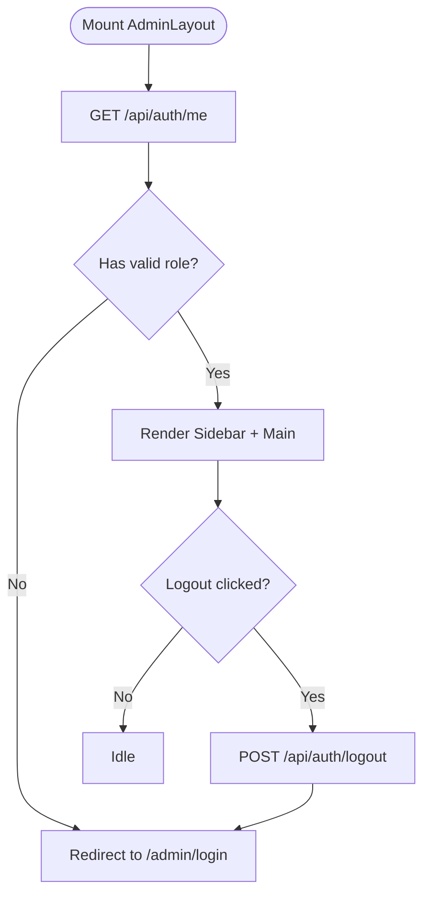
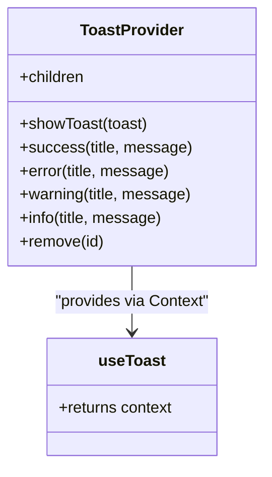
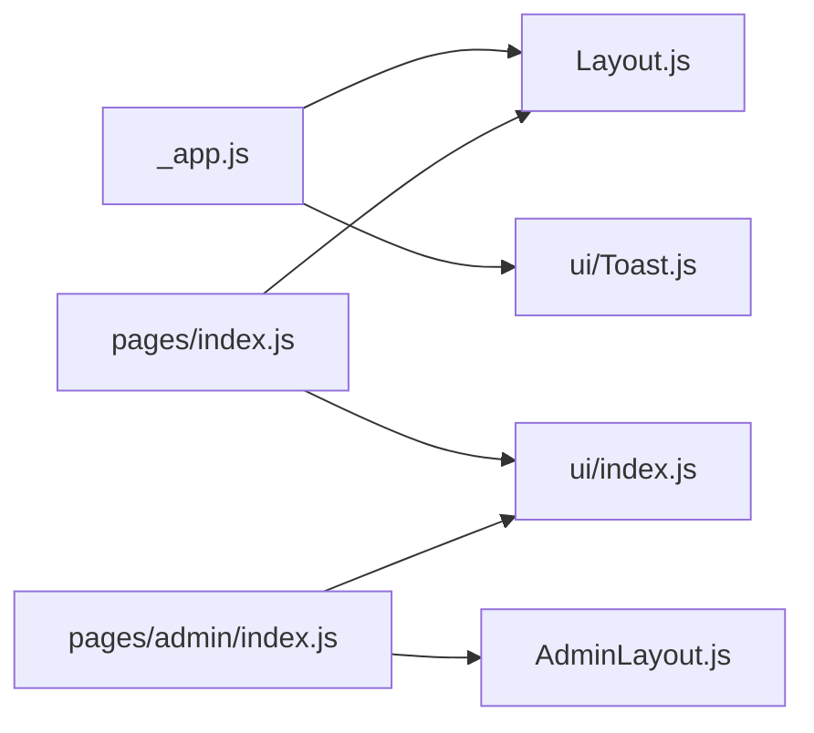

# Component Hierarchy & Structure

<cite>
**Referenced Files in This Document**
- [components/Layout.js](file://components/Layout.js)
- [components/AdminLayout.js](file://components/AdminLayout.js)
- [components/ui/index.js](file://components/ui/index.js)
- [components/ui/Button.js](file://components/ui/Button.js)
- [components/ui/Card.js](file://components/ui/Card.js)
- [components/ui/Input.js](file://components/ui/Input.js)
- [components/ui/Toast.js](file://components/ui/Toast.js)
- [components/ui/Badge.js](file://components/ui/Badge.js)
- [components/ui/Progress.js](file://components/ui/Progress.js)
- [components/ui/Skeleton.js](file://components/ui/Skeleton.js)
- [components/ui/StepIndicator.js](file://components/ui/StepIndicator.js)
- [components/ui/CountdownTimer.js](file://components/ui/CountdownTimer.js)
- [pages/_app.js](file://pages/_app.js)
- [pages/index.js](file://pages/index.js)
- [pages/admin/index.js](file://pages/admin/index.js)
</cite>

## Table of Contents
1. Introduction
2. Project Structure
3. Core Components
4. Architecture Overview
5. Detailed Component Analysis
6. Dependency Analysis
7. Performance Considerations
8. Troubleshooting Guide
9. Conclusion

## Introduction
This document explains TicketFlow’s component hierarchy and structure, focusing on how Layout components wrap page-specific content and how reusable UI components are organized under the ui folder. It covers composition patterns, prop drilling strategies, state management approaches (including Context), naming conventions, file organization, and best practices for creating new components.

## Project Structure
TicketFlow follows a Next.js layout-based architecture:
- pages/_app.js is the application root that injects global providers and selects a per-page layout via getLayout.
- Public-facing pages use components/Layout.js to render navigation, theme switching, and footer.
- Administrative pages use components/AdminLayout.js to render a sidebar, role-based access checks, and admin-specific navigation.
- Reusable UI primitives live under components/ui with an index barrel exporting common components.

**Diagram sources**
- [pages/_app.js:1-14](file://pages/_app.js#L1-L14)
- [components/Layout.js:13-280](file://components/Layout.js#L13-L280)
- [components/AdminLayout.js:13-193](file://components/AdminLayout.js#L13-L193)
- [components/ui/index.js:1-10](file://components/ui/index.js#L1-L10)
- [pages/index.js:752-753](file://pages/index.js#L752-L753)
- [pages/admin/index.js:584-585](file://pages/admin/index.js#L584-L585)

**Section sources**
- [pages/_app.js:1-14](file://pages/_app.js#L1-L14)
- [components/Layout.js:13-280](file://components/Layout.js#L13-L280)
- [components/AdminLayout.js:13-193](file://components/AdminLayout.js#L13-L193)
- [components/ui/index.js:1-10](file://components/ui/index.js#L1-L10)
- [pages/index.js:752-753](file://pages/index.js#L752-L753)
- [pages/admin/index.js:584-585](file://pages/admin/index.js#L584-L585)

## Core Components
- Layout (public): Provides head metadata, animated background mesh, responsive navigation, theme switcher persisted in localStorage, and a consistent footer. It hides chrome for admin/checkin routes.
- AdminLayout (admin): Enforces authentication and role checks, renders a sticky sidebar with navigation, user info, logout, and a main content area.
- UI Primitives: Button, Card, Input, Badge, Progress, Skeleton, StepIndicator, CountdownTimer, and Toast (with provider and hook).

Key responsibilities:
- Layout manages public site chrome and theme persistence.
- AdminLayout manages admin chrome and access control.
- UI components encapsulate presentation and small interactions; shared state like toasts is exposed via Context.

**Section sources**
- [components/Layout.js:13-280](file://components/Layout.js#L13-L280)
- [components/AdminLayout.js:13-193](file://components/AdminLayout.js#L13-L193)
- [components/ui/Button.js:18-73](file://components/ui/Button.js#L18-L73)
- [components/ui/Card.js:1-32](file://components/ui/Card.js#L1-L32)
- [components/ui/Input.js:1-48](file://components/ui/Input.js#L1-L48)
- [components/ui/Badge.js:11-29](file://components/ui/Badge.js#L11-L29)
- [components/ui/Progress.js:1-38](file://components/ui/Progress.js#L1-L38)
- [components/ui/Skeleton.js:10-47](file://components/ui/Skeleton.js#L10-L47)
- [components/ui/StepIndicator.js:1-23](file://components/ui/StepIndicator.js#L1-L23)
- [components/ui/CountdownTimer.js:15-108](file://components/ui/CountdownTimer.js#L15-L108)
- [components/ui/Toast.js:5-83](file://components/ui/Toast.js#L5-L83)

## Architecture Overview
The app uses a two-layer layout strategy:
- Global layer: _app.js wraps all pages with ToastProvider and resolves a per-page layout via getLayout. If not defined, it falls back to the default Layout.
- Page layer: Each page defines its own getLayout to choose between Layout and AdminLayout.

**Diagram sources**
- [pages/_app.js:5-11](file://pages/_app.js#L5-L11)
- [pages/index.js:752-753](file://pages/index.js#L752-L753)
- [pages/admin/index.js:584-585](file://pages/admin/index.js#L584-L585)

## Detailed Component Analysis

### Layout (Public)
Responsibilities:
- Head metadata injection and favicon.
- Animated background mesh and responsive navigation.
- Theme selection persisted to localStorage and applied via data-theme attribute.
- Conditional hiding of chrome for admin/checkin routes.
- Footer with links and social icons.

Composition pattern:
- Accepts children and optional title/description props.
- Uses local state for theme menu, scroll detection, and mobile menu toggling.

Best practices:
- Keep route-based visibility logic centralized.
- Persist user preferences in localStorage with minimal re-renders.

**Section sources**
- [components/Layout.js:13-280](file://components/Layout.js#L13-L280)

### AdminLayout (Admin)
Responsibilities:
- Role-based access control by fetching current user and validating roles.
- Sidebar navigation with active state based on router pathname.
- User info display and logout flow.
- Main content area for admin pages.

Access control flow:
- On mount, fetch /api/auth/me; if no user or invalid role, redirect to login.
- Logout calls /api/auth/logout and redirects to login.

**Diagram sources**
- [components/AdminLayout.js:17-33](file://components/AdminLayout.js#L17-L33)

**Section sources**
- [components/AdminLayout.js:13-193](file://components/AdminLayout.js#L13-L193)

### UI Components
Common patterns:
- Props-driven styling via className and style objects.
- Variants and sizes mapped to CSS classes (e.g., Button variants/sizes).
- Small internal state for interactivity (e.g., loading indicators, hover effects).
- Accessibility attributes where appropriate (e.g., aria-invalid, role).

Examples:
- Button: variant/size mapping, loading spinner, full-width support.
- Card: glass vs solid styles, lift/accent options, click-through behavior.
- Input: label/error/helper text, error border color, accessibility.
- Badge: variant mapping and optional icon slot.
- Progress: percentage calculation, optional label rendering.
- Skeleton: multiple variants and count support for lists.
- StepIndicator: step states and labels.
- CountdownTimer: interval-based updates and expiration callback.

**Section sources**
- [components/ui/Button.js:18-73](file://components/ui/Button.js#L18-L73)
- [components/ui/Card.js:1-32](file://components/ui/Card.js#L1-L32)
- [components/ui/Input.js:1-48](file://components/ui/Input.js#L1-L48)
- [components/ui/Badge.js:11-29](file://components/ui/Badge.js#L11-L29)
- [components/ui/Progress.js:1-38](file://components/ui/Progress.js#L1-L38)
- [components/ui/Skeleton.js:10-47](file://components/ui/Skeleton.js#L10-L47)
- [components/ui/StepIndicator.js:1-23](file://components/ui/StepIndicator.js#L1-L23)
- [components/ui/CountdownTimer.js:15-108](file://components/ui/CountdownTimer.js#L15-L108)

### Toast Context (Global Notifications)
Pattern:
- Provider maintains a list of toasts and exposes methods to show/remove.
- Convenience helpers for success/error/warning/info.
- Hook useToast throws if used outside provider.

Usage:
- Wrapped at app level in _app.js.
- Any descendant can call showToast or convenience methods.

**Diagram sources**
- [components/ui/Toast.js:5-83](file://components/ui/Toast.js#L5-L83)
- [pages/_app.js:3-11](file://pages/_app.js#L3-L11)

**Section sources**
- [components/ui/Toast.js:5-83](file://components/ui/Toast.js#L5-L83)
- [pages/_app.js:3-11](file://pages/_app.js#L3-L11)

### Page Composition Patterns
- Public home page composes many UI primitives and defines getLayout to use Layout.
- Admin dashboard composes UI primitives and defines getLayout to use AdminLayout.

Prop drilling examples:
- Home passes helper functions and event handlers down to nested card components.
- Admin dashboard passes router and event data to row/card components.

Context usage:
- ToastProvider provides global notifications without prop drilling.

**Section sources**
- [pages/index.js:1-753](file://pages/index.js#L1-L753)
- [pages/admin/index.js:1-585](file://pages/admin/index.js#L1-L585)

## Dependency Analysis
High-level relationships:
- _app.js depends on Layout and ToastProvider.
- Pages depend on their respective Layout and UI components.
- UI components are independent and exported via a barrel index.

**Diagram sources**
- [pages/_app.js:1-14](file://pages/_app.js#L1-L14)
- [components/Layout.js:13-280](file://components/Layout.js#L13-L280)
- [components/AdminLayout.js:13-193](file://components/AdminLayout.js#L13-L193)
- [components/ui/index.js:1-10](file://components/ui/index.js#L1-L10)
- [pages/index.js:752-753](file://pages/index.js#L752-L753)
- [pages/admin/index.js:584-585](file://pages/admin/index.js#L584-L585)

**Section sources**
- [pages/_app.js:1-14](file://pages/_app.js#L1-L14)
- [components/ui/index.js:1-10](file://components/ui/index.js#L1-L10)

## Performance Considerations
- Prefer memoization for derived lists and heavy computations in pages (e.g., useMemo for filtered/sorted events).
- Use passive scroll listeners to avoid jank.
- Avoid unnecessary re-renders by keeping state close to where it’s used and lifting only when needed.
- Leverage skeleton placeholders for perceived performance during async loads.
- Minimize DOM mutations in toast removal by batching state updates and using timeouts.

[No sources needed since this section provides general guidance]

## Troubleshooting Guide
Common issues and resolutions:
- Admin pages redirect unexpectedly: Ensure the user has a valid role; verify /api/auth/me returns expected payload.
- Toast errors: Confirm useToast is called within ToastProvider scope; otherwise it throws.
- Theme not persisting: Check localStorage availability and ensure data-theme attribute is set on the root element.
- Navigation active state incorrect: Verify router.pathname matches expected href prefixes.

**Section sources**
- [components/AdminLayout.js:17-33](file://components/AdminLayout.js#L17-L33)
- [components/ui/Toast.js:79-83](file://components/ui/Toast.js#L79-L83)
- [components/Layout.js:24-41](file://components/Layout.js#L24-L41)
- [components/AdminLayout.js:86-88](file://components/AdminLayout.js#L86-L88)

## Conclusion
TicketFlow’s component architecture cleanly separates public and administrative experiences through dedicated Layout components, while a rich set of UI primitives ensures consistency and reusability. Context is used judiciously for cross-cutting concerns like notifications. The getLayout pattern enables flexible per-page layouts, and the ui barrel simplifies imports. Following the naming conventions, composition patterns, and best practices outlined here will help maintain clarity and scalability as the codebase grows.