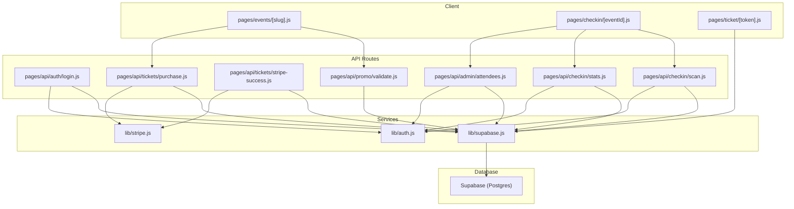
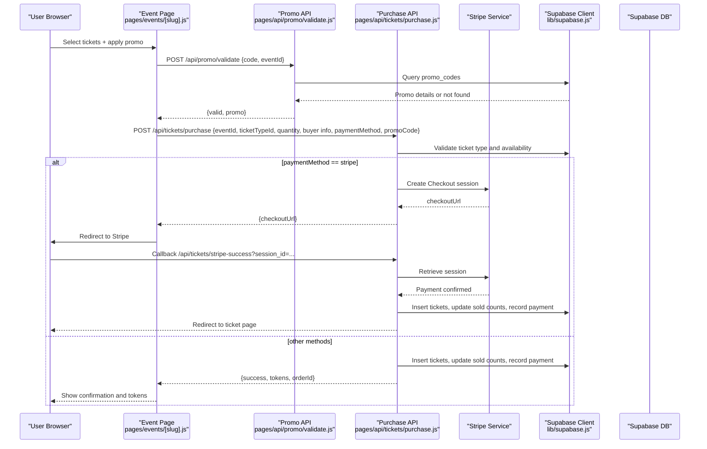
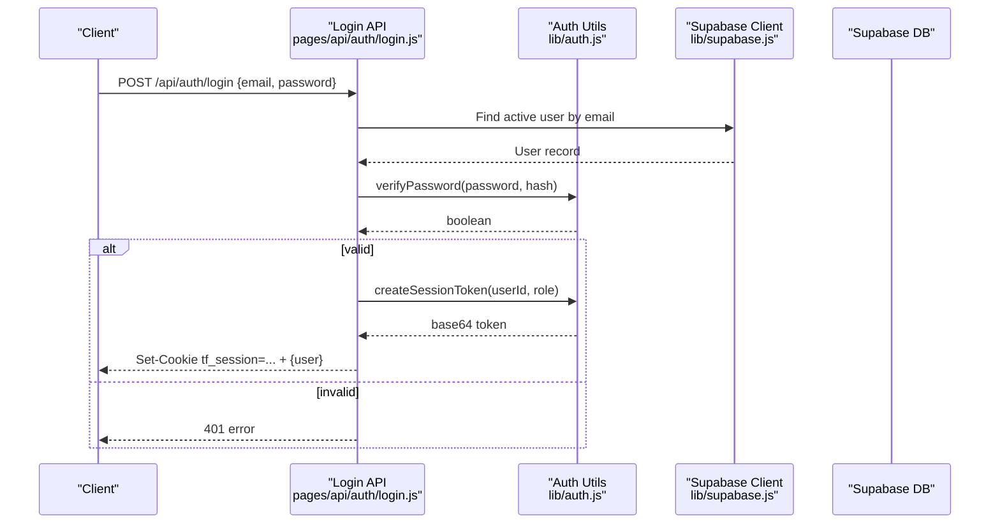
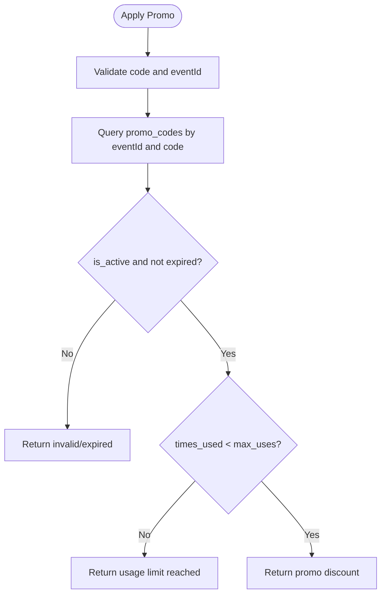
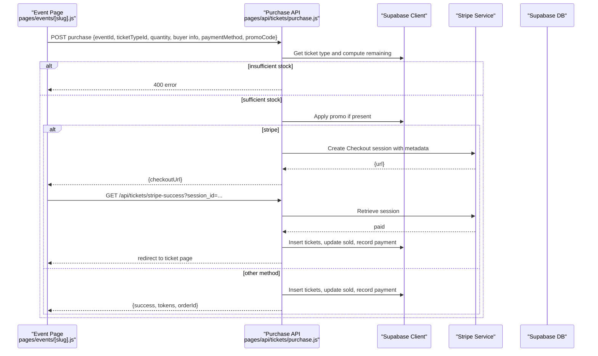
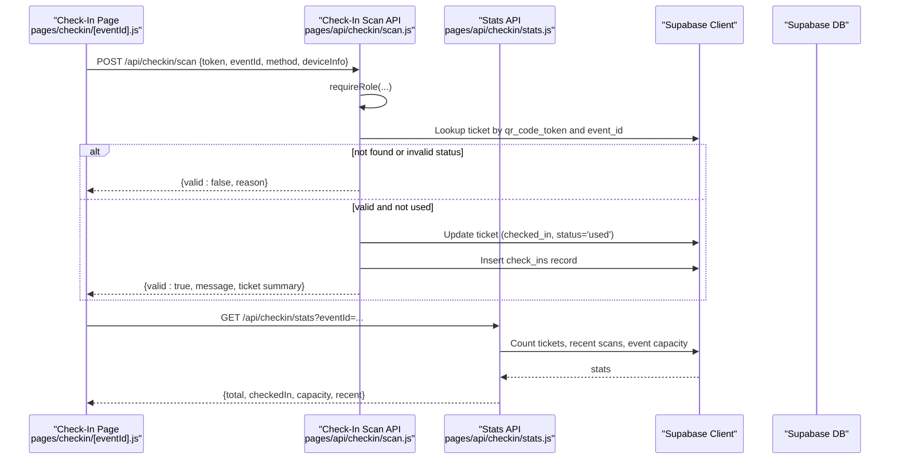
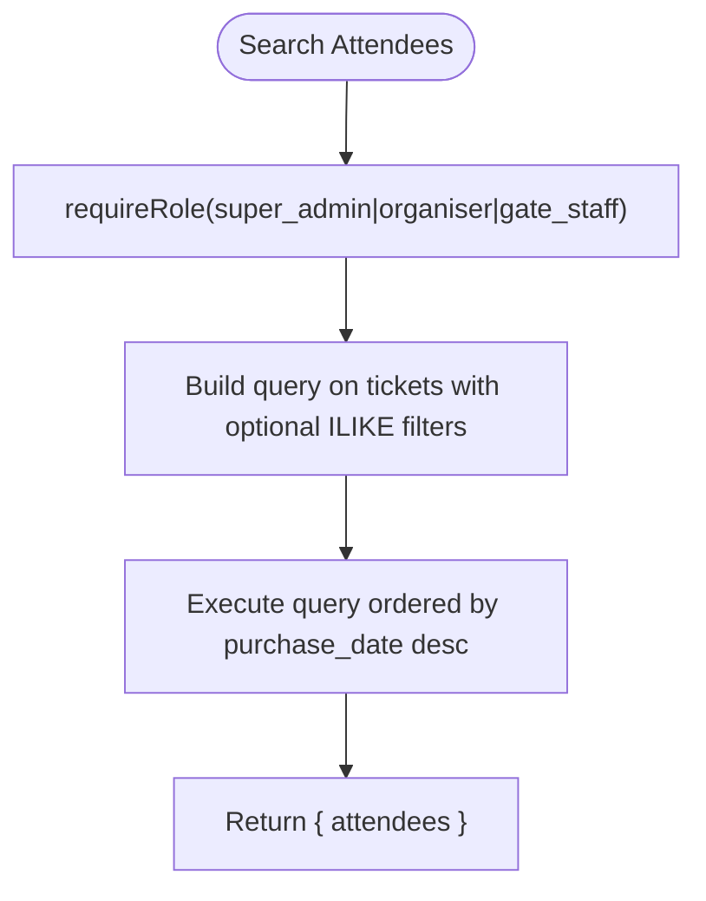
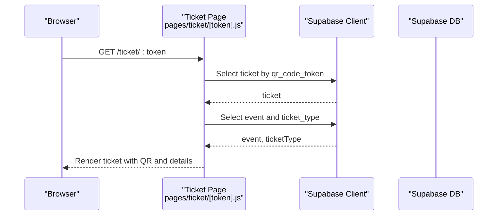
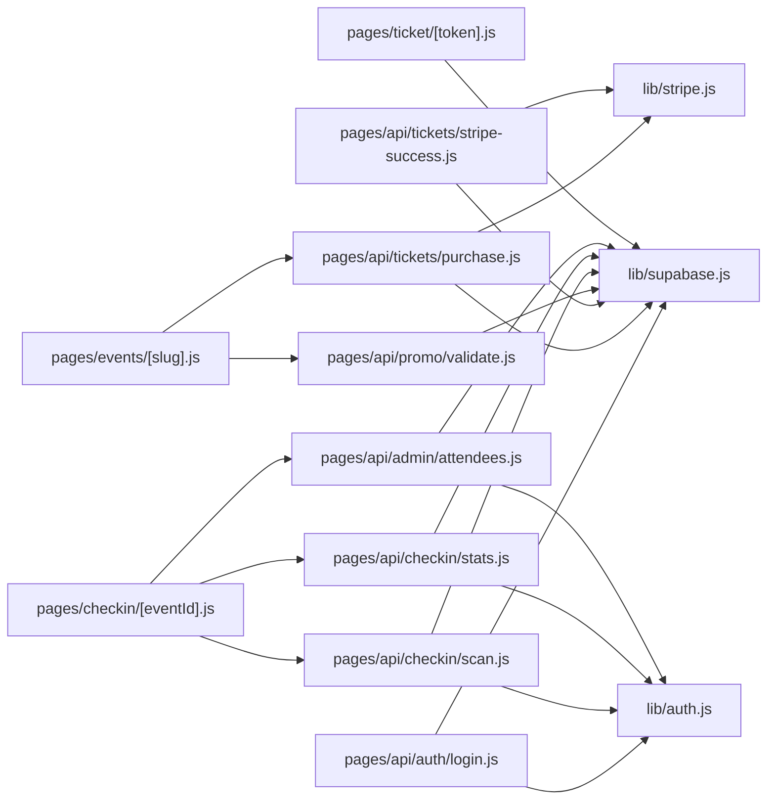

# Data Flow Patterns

<cite>
**Referenced Files in This Document**
- [supabase.js](file://lib/supabase.js)
- [auth.js](file://lib/auth.js)
- [_app.js](file://pages/_app.js)
- [schema.sql](file://supabase/schema.sql)
- [login.js](file://pages/api/auth/login.js)
- [purchase.js](file://pages/api/tickets/purchase.js)
- [stripe-success.js](file://pages/api/tickets/stripe-success.js)
- [validate.js](file://pages/api/promo/validate.js)
- [scan.js](file://pages/api/checkin/scan.js)
- [stats.js](file://pages/api/checkin/stats.js)
- [attendees.js](file://pages/api/admin/attendees.js)
- [events/[slug].js](file://pages/events/[slug].js)
- [checkin/[eventId].js](file://pages/checkin/[eventId].js)
- [ticket/[token].js](file://pages/ticket/[token].js)
- [stripe.js](file://lib/stripe.js)
</cite>

## Table of Contents
1. [Introduction](#introduction)
2. [Project Structure](#project-structure)
3. [Core Components](#core-components)
4. [Architecture Overview](#architecture-overview)
5. [Detailed Component Analysis](#detailed-component-analysis)
6. [Dependency Analysis](#dependency-analysis)
7. [Performance Considerations](#performance-considerations)
8. [Troubleshooting Guide](#troubleshooting-guide)
9. [Conclusion](#conclusion)

## Introduction
This document explains TicketFlow’s data flow patterns from client requests through Next.js pages and API routes to Supabase database operations and back. It covers authentication with session cookies, role-based authorization, error handling, loading states, optimistic updates, caching strategies, real-time considerations, and performance optimizations. It also provides concrete examples for event fetching, ticket purchase processing, and check-in validation.

## Project Structure
TicketFlow is a Next.js application with:
- Client-side pages that orchestrate user interactions and UI state
- Serverless API routes that enforce authorization, validate inputs, and perform database operations via Supabase
- A shared Supabase client configuration and an admin service-role client for privileged server-side access
- A Supabase schema defining entities such as users, events, ticket types, tickets, check-ins, payments, and promo codes

**Diagram sources**
- [events/[slug].js](file://pages/events/[slug].js)
- [checkin/[eventId].js](file://pages/checkin/[eventId].js)
- [ticket/[token].js](file://pages/ticket/[token].js)
- [login.js](file://pages/api/auth/login.js)
- [purchase.js](file://pages/api/tickets/purchase.js)
- [stripe-success.js](file://pages/api/tickets/stripe-success.js)
- [validate.js](file://pages/api/promo/validate.js)
- [scan.js](file://pages/api/checkin/scan.js)
- [stats.js](file://pages/api/checkin/stats.js)
- [attendees.js](file://pages/api/admin/attendees.js)
- [supabase.js](file://lib/supabase.js)
- [auth.js](file://lib/auth.js)
- [stripe.js](file://lib/stripe.js)

**Section sources**
- [supabase.js](file://lib/supabase.js)
- [auth.js](file://lib/auth.js)
- [schema.sql](file://supabase/schema.sql)

## Core Components
- Supabase client layer: Provides both anonymous and service-role clients for secure server-side operations.
- Authentication utilities: Password hashing/verification, session token creation/parse, and role enforcement middleware.
- Stripe integration: Centralized Stripe client for payment flows.
- Pages and API routes: Orchestrate request/response lifecycle, enforce roles, validate inputs, and persist data.

Key responsibilities:
- lib/supabase.js: Expose createClient and getServiceClient for DB access.
- lib/auth.js: Session cookie handling and requireRole guard.
- lib/stripe.js: Stripe SDK initialization.
- pages/*: UI and SSR/SSG where applicable; API routes handle business logic.

**Section sources**
- [supabase.js](file://lib/supabase.js)
- [auth.js](file://lib/auth.js)
- [stripe.js](file://lib/stripe.js)

## Architecture Overview
The system follows a layered architecture:
- Presentation layer (Next.js pages) manages UI state and user interactions.
- API routes act as the application controller, enforcing authZ, validating payloads, and orchestrating services.
- Services include Supabase client calls and Stripe integrations.
- Database layer is Supabase Postgres with RLS policies and indexes.

**Diagram sources**
- [events/[slug].js](file://pages/events/[slug].js)
- [validate.js](file://pages/api/promo/validate.js)
- [purchase.js](file://pages/api/tickets/purchase.js)
- [stripe-success.js](file://pages/api/tickets/stripe-success.js)
- [supabase.js](file://lib/supabase.js)

## Detailed Component Analysis

### Authentication and Authorization Flow
- Login endpoint validates credentials against Supabase users table using bcrypt verification and sets an HttpOnly session cookie.
- Subsequent requests parse the cookie to identify the user and enforce roles via requireRole.
- Role checks are enforced on sensitive endpoints like check-in scanning and attendee search.

**Diagram sources**
- [login.js](file://pages/api/auth/login.js)
- [auth.js](file://lib/auth.js)
- [supabase.js](file://lib/supabase.js)

**Section sources**
- [login.js](file://pages/api/auth/login.js)
- [auth.js](file://lib/auth.js)

### Event Fetching and Promo Validation
- The event page renders event details and supports promo code validation.
- Promo validation queries promo_codes for active, non-expired codes within usage limits.

**Diagram sources**
- [events/[slug].js](file://pages/events/[slug].js)
- [validate.js](file://pages/api/promo/validate.js)

**Section sources**
- [events/[slug].js](file://pages/events/[slug].js)
- [validate.js](file://pages/api/promo/validate.js)

### Ticket Purchase Processing
- Validates ticket type and availability.
- Applies promo discount if provided.
- For Stripe: creates a Checkout session with metadata containing pre-generated tokens and buyer info.
- For other payment methods: immediately creates tickets, updates sold counts, and records payment.

**Diagram sources**
- [events/[slug].js](file://pages/events/[slug].js)
- [purchase.js](file://pages/api/tickets/purchase.js)
- [stripe-success.js](file://pages/api/tickets/stripe-success.js)
- [supabase.js](file://lib/supabase.js)

**Section sources**
- [purchase.js](file://pages/api/tickets/purchase.js)
- [stripe-success.js](file://pages/api/tickets/stripe-success.js)

### Check-In Validation Flow
- Gate staff scan or manually enter ticket tokens.
- API enforces role-based access and validates ticket status and event association.
- On success, marks ticket as checked-in, records check-in entry, and returns concise feedback.

**Diagram sources**
- [checkin/[eventId].js](file://pages/checkin/[eventId].js)
- [scan.js](file://pages/api/checkin/scan.js)
- [stats.js](file://pages/api/checkin/stats.js)
- [supabase.js](file://lib/supabase.js)

**Section sources**
- [scan.js](file://pages/api/checkin/scan.js)
- [stats.js](file://pages/api/checkin/stats.js)
- [checkin/[eventId].js](file://pages/checkin/[eventId].js)

### Attendee Search and Admin Access
- Admin and gate staff can search attendees by name, email, phone, or token.
- Requires appropriate role; returns matching tickets with ticket type details.

**Diagram sources**
- [attendees.js](file://pages/api/admin/attendees.js)

**Section sources**
- [attendees.js](file://pages/api/admin/attendees.js)

### Ticket Display Page
- Server-side fetches ticket by token and related event and ticket type.
- Renders QR code and share/print actions.

**Diagram sources**
- [ticket/[token].js](file://pages/ticket/[token].js)
- [supabase.js](file://lib/supabase.js)

**Section sources**
- [ticket/[token].js](file://pages/ticket/[token].js)

## Dependency Analysis
- API routes depend on lib/supabase.js for DB access and lib/auth.js for role enforcement.
- Purchase flow depends on lib/stripe.js for payment orchestration.
- Pages call API routes for all mutations and protected reads.
- Supabase schema defines relationships and constraints; RLS policies restrict public access to published events and associated ticket types.

**Diagram sources**
- [login.js](file://pages/api/auth/login.js)
- [purchase.js](file://pages/api/tickets/purchase.js)
- [stripe-success.js](file://pages/api/tickets/stripe-success.js)
- [validate.js](file://pages/api/promo/validate.js)
- [scan.js](file://pages/api/checkin/scan.js)
- [stats.js](file://pages/api/checkin/stats.js)
- [attendees.js](file://pages/api/admin/attendees.js)
- [events/[slug].js](file://pages/events/[slug].js)
- [checkin/[eventId].js](file://pages/checkin/[eventId].js)
- [ticket/[token].js](file://pages/ticket/[token].js)
- [supabase.js](file://lib/supabase.js)
- [auth.js](file://lib/auth.js)
- [stripe.js](file://lib/stripe.js)

**Section sources**
- [schema.sql](file://supabase/schema.sql)

## Performance Considerations
- Use service-role client only in API routes to bypass RLS when necessary and reduce client-side overhead.
- Leverage Supabase indexes defined in schema (e.g., idx_tickets_token, idx_events_slug) for fast lookups.
- Batch operations where possible (e.g., insert multiple tickets in one call).
- Avoid heavy client-side computations; offload to server when feasible.
- For real-time dashboards, consider polling intervals tuned to operational needs (e.g., check-in stats every 10 seconds).
- Cache static or semi-static data at the edge or CDN level (event listings) to reduce DB load.

[No sources needed since this section provides general guidance]

## Troubleshooting Guide
Common issues and resolutions:
- Missing environment variables: Ensure NEXT_PUBLIC_SUPABASE_URL, NEXT_PUBLIC_SUPABASE_ANON_KEY, and SUPABASE_SERVICE_ROLE_KEY are set.
- Invalid credentials: Verify user is active and password matches stored hash.
- Insufficient permissions: Confirm user role includes required permission for the endpoint.
- Payment failures: Inspect Stripe session retrieval and ensure metadata contains expected fields.
- Check-in errors: Validate token belongs to the specified event and ticket is not already used or cancelled.

Error handling patterns:
- API routes return consistent JSON error objects with HTTP status codes.
- Client pages display errors via toast notifications and inline messages.
- Loading states prevent duplicate submissions and provide user feedback.

**Section sources**
- [login.js](file://pages/api/auth/login.js)
- [purchase.js](file://pages/api/tickets/purchase.js)
- [stripe-success.js](file://pages/api/tickets/stripe-success.js)
- [scan.js](file://pages/api/checkin/scan.js)
- [events/[slug].js](file://pages/events/[slug].js)
- [checkin/[eventId].js](file://pages/checkin/[eventId].js)

## Conclusion
TicketFlow implements a clear separation of concerns between UI, API routes, and data services. Authentication uses HttpOnly cookies with role enforcement, while database operations leverage Supabase with service-role privileges for security. Payment flows integrate Stripe securely, and check-in workflows enforce strict validation and auditability. The design supports scalable data operations, robust error handling, and opportunities for caching and real-time updates.