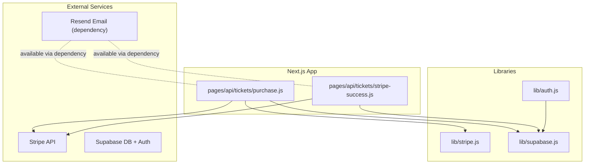
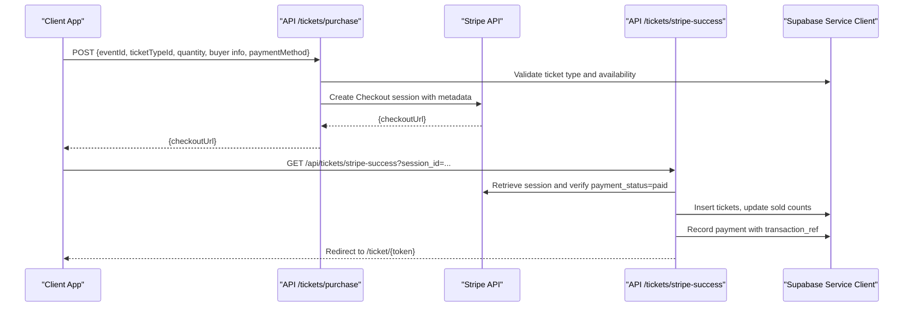
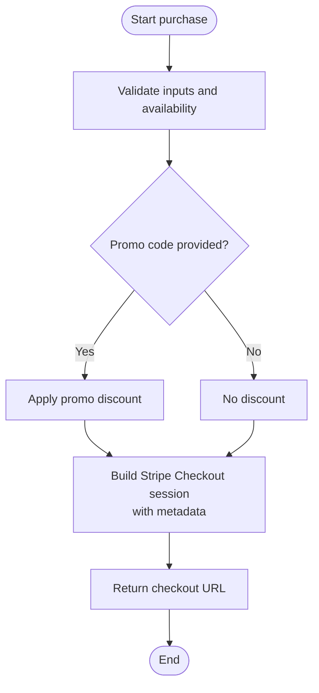
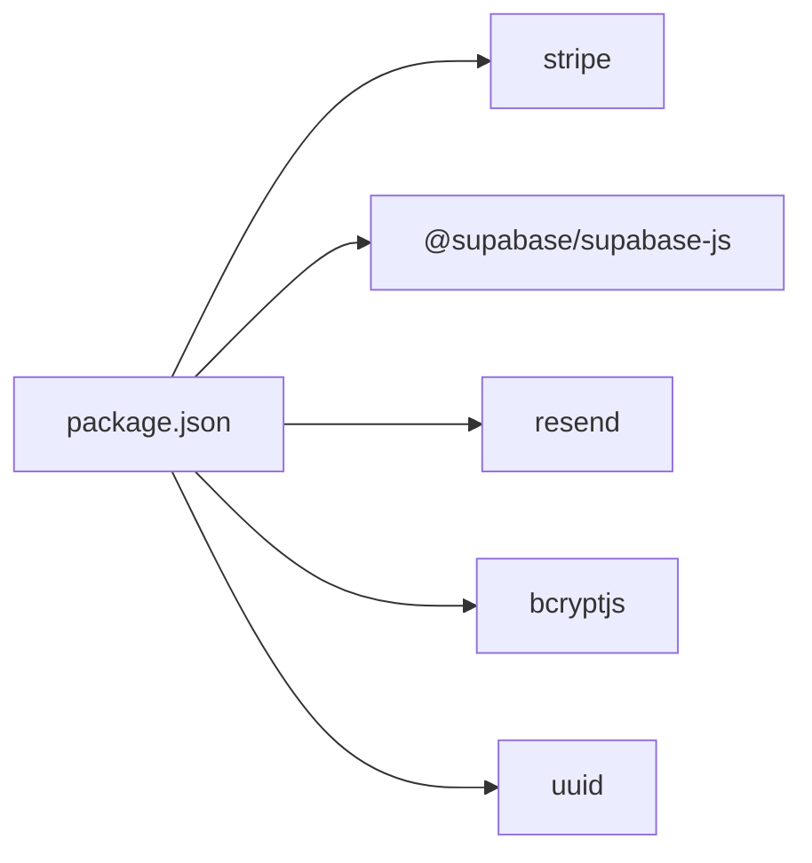

# External Integrations

<cite>
**Referenced Files in This Document**
- [lib/stripe.js](file://lib/stripe.js)
- [lib/supabase.js](file://lib/supabase.js)
- [lib/auth.js](file://lib/auth.js)
- [pages/api/tickets/purchase.js](file://pages/api/tickets/purchase.js)
- [pages/api/tickets/stripe-success.js](file://pages/api/tickets/stripe-success.js)
- [supabase/schema.sql](file://supabase/schema.sql)
- [package.json](file://package.json)
</cite>

## Table of Contents
1. [Introduction](#introduction)
2. [Project Structure](#project-structure)
3. [Core Components](#core-components)
4. [Architecture Overview](#architecture-overview)
5. [Detailed Component Analysis](#detailed-component-analysis)
6. [Dependency Analysis](#dependency-analysis)
7. [Performance Considerations](#performance-considerations)
8. [Troubleshooting Guide](#troubleshooting-guide)
9. [Conclusion](#conclusion)
10. [Appendices](#appendices)

## Introduction
This document explains TicketFlow’s external service integrations with a focus on:
- Stripe payment integration for checkout, success handling, and payment confirmation
- Supabase database connection setup, authentication helpers, and real-time capabilities
- Email integration using the Resend package (present in dependencies), including where to implement ticket delivery and notifications
- Error handling strategies, retry mechanisms, and fallback procedures for external service failures
- Configuration requirements, environment variables, and troubleshooting guidance
- Security considerations for API keys, webhooks, and data synchronization

The goal is to provide both technical depth and accessible explanations for developers and operators.

## Project Structure
TicketFlow uses a Next.js app structure with serverless API routes under pages/api and shared libraries under lib. External integrations are primarily implemented in:
- lib/stripe.js: Stripe client initialization
- lib/supabase.js: Supabase client and admin service-role client
- pages/api/tickets/purchase.js: Purchase flow and Stripe Checkout session creation
- pages/api/tickets/stripe-success.js: Post-payment confirmation and ticket issuance
- supabase/schema.sql: Database schema used by Supabase
- package.json: Dependencies including stripe, @supabase/supabase-js, and resend

**Diagram sources**
- [pages/api/tickets/purchase.js:1-123](file://pages/api/tickets/purchase.js#L1-L123)
- [pages/api/tickets/stripe-success.js:1-55](file://pages/api/tickets/stripe-success.js#L1-L55)
- [lib/stripe.js:1-6](file://lib/stripe.js#L1-L6)
- [lib/supabase.js:1-23](file://lib/supabase.js#L1-L23)
- [lib/auth.js:1-47](file://lib/auth.js#L1-L47)
- [package.json:1-24](file://package.json#L1-L24)

**Section sources**
- [package.json:1-24](file://package.json#L1-L24)

## Core Components
- Stripe client: Initialized in lib/stripe.js with an API version and secret key from environment.
- Supabase clients: Public anon client and server-side service-role client in lib/supabase.js.
- Authentication utilities: Password hashing/verification and session token helpers in lib/auth.js.
- Purchase API: Creates Stripe Checkout sessions or issues tickets directly for non-Stripe methods in pages/api/tickets/purchase.js.
- Success handler: Verifies payment and persists tickets and payments in pages/api/tickets/stripe-success.js.
- Schema: Defines tables for users, events, ticket_types, tickets, check_ins, payments, promo_codes in supabase/schema.sql.

Key responsibilities:
- Payment orchestration and metadata management
- Secure server-side operations using service-role client
- Idempotent ticket creation and payment recording
- Role-based access control and session parsing for admin endpoints

**Section sources**
- [lib/stripe.js:1-6](file://lib/stripe.js#L1-L6)
- [lib/supabase.js:1-23](file://lib/supabase.js#L1-L23)
- [lib/auth.js:1-47](file://lib/auth.js#L1-L47)
- [pages/api/tickets/purchase.js:1-123](file://pages/api/tickets/purchase.js#L1-L123)
- [pages/api/tickets/stripe-success.js:1-55](file://pages/api/tickets/stripe-success.js#L1-L55)
- [supabase/schema.sql:1-166](file://supabase/schema.sql#L1-L166)

## Architecture Overview
The payment architecture centers around Stripe Checkout and a server-side success callback that finalizes ticket issuance and records payments.

**Diagram sources**
- [pages/api/tickets/purchase.js:1-123](file://pages/api/tickets/purchase.js#L1-L123)
- [pages/api/tickets/stripe-success.js:1-55](file://pages/api/tickets/stripe-success.js#L1-L55)
- [lib/supabase.js:1-23](file://lib/supabase.js#L1-L23)

## Detailed Component Analysis

### Stripe Integration
- Client initialization: Uses a secret key and sets a specific API version.
- Checkout session creation: Builds line items, currency, mode, success/cancel URLs, customer email, and rich metadata (event, ticket type, quantity, buyer details, tokens, discount).
- Success verification: Retrieves session, checks payment status, computes discounted price, inserts tickets, updates sold counts, records payment with transaction reference, and redirects to the first ticket page.

**Diagram sources**
- [pages/api/tickets/purchase.js:1-123](file://pages/api/tickets/purchase.js#L1-L123)

Security and reliability notes:
- Always use server-side secret key; never expose it to the client.
- Store only necessary metadata in Stripe session to minimize risk.
- Verify payment status server-side before issuing tickets.

**Section sources**
- [lib/stripe.js:1-6](file://lib/stripe.js#L1-L6)
- [pages/api/tickets/purchase.js:1-123](file://pages/api/tickets/purchase.js#L1-L123)
- [pages/api/tickets/stripe-success.js:1-55](file://pages/api/tickets/stripe-success.js#L1-L55)

### Webhook Handling and Payment Confirmation
Current implementation relies on the Stripe Checkout success redirect to finalize purchases. There is no dedicated webhook endpoint in the repository. Recommended approach:
- Implement a secure webhook endpoint to handle events like checkout.session.completed, payment_intent.succeeded, and charge.failed.
- Verify webhook signatures using Stripe’s library and standardwebhooks (present in dependencies).
- Use idempotency keys to prevent duplicate ticket issuance.
- On failure, log errors and queue retries with exponential backoff.

Operational guidance:
- Route webhooks to a dedicated serverless function.
- Validate event types and payloads.
- Persist raw events for auditability.
- Emit internal events for downstream processing (e.g., email delivery).

[No sources needed since this section provides recommended practices not present in current files]

### Supabase Database Connection and Real-Time Capabilities
- Public client: Created with NEXT_PUBLIC_SUPABASE_URL and NEXT_PUBLIC_SUPABASE_ANON_KEY.
- Admin client: getServiceClient() uses SUPABASE_SERVICE_ROLE_KEY for server-side privileged operations.
- Schema: Includes users, events, ticket_types, tickets, check_ins, payments, promo_codes with RLS policies and indexes.

Real-time usage patterns:
- Subscribe to changes on tickets or check_ins for live dashboards.
- Use Row Level Security policies to restrict public reads to published events.
- Prefer service-role client for write paths in API routes.

**Section sources**
- [lib/supabase.js:1-23](file://lib/supabase.js#L1-L23)
- [supabase/schema.sql:1-166](file://supabase/schema.sql#L1-L166)

### Authentication Integration
- Password hashing and verification via bcryptjs.
- Simple session token stored in cookies for admin flows.
- getUserFromRequest parses cookie and validates expiration.
- requireRole enforces role-based access for protected endpoints.

Integration recommendations:
- For production, prefer Supabase Auth or NextAuth for robust identity management.
- Keep session secrets secure and rotate regularly.
- Enforce HTTPS and secure cookie flags.

**Section sources**
- [lib/auth.js:1-47](file://lib/auth.js#L1-L47)

### Email Integration with Resend
Resend is included as a dependency but there is no email-sending implementation in the current codebase. To integrate:
- Add a server-side utility to send emails using the Resend SDK.
- Trigger emails after successful ticket issuance (purchase success path or webhook completion).
- Include ticket details, QR code link, and event information.

Implementation suggestions:
- Create a reusable sendEmail function that accepts template data and recipient list.
- Handle rate limits and retries with exponential backoff.
- Log delivery status and errors for observability.

[No sources needed since this section outlines planned integration based on dependency presence]

## Dependency Analysis
External dependencies relevant to integrations:
- stripe: Payment processing and session management
- @supabase/supabase-js: Database and auth client
- resend: Email sending capability
- bcryptjs: Password hashing
- uuid: Unique token generation for tickets

**Diagram sources**
- [package.json:1-24](file://package.json#L1-L24)

**Section sources**
- [package.json:1-24](file://package.json#L1-L24)

## Performance Considerations
- Minimize network calls: Batch ticket insertions and avoid per-ticket round-trips where possible.
- Use service-role client for writes to bypass RLS overhead when appropriate.
- Cache frequently read data (events, ticket types) at the edge if supported by your hosting platform.
- Ensure proper indexing on high-cardinality columns (qr_code_token, buyer_email, event_id) as defined in schema.
- Avoid heavy computations in request handlers; offload to background jobs if needed.

[No sources needed since this section provides general guidance]

## Troubleshooting Guide
Common issues and resolutions:
- Missing environment variables:
  - STRIPE_SECRET_KEY: Required for Stripe operations
  - NEXT_PUBLIC_SUPABASE_URL and NEXT_PUBLIC_SUPABASE_ANON_KEY: Required for public client
  - SUPABASE_SERVICE_ROLE_KEY: Required for admin client
  - NEXT_PUBLIC_SITE_URL: Used for success/cancel URLs
- Payment failures:
  - Verify session retrieval and payment_status in success handler
  - Check Stripe dashboard for failed payments and error messages
- Database errors:
  - Inspect Supabase logs for constraint violations or permission issues
  - Confirm RLS policies allow intended operations
- Email delivery:
  - Validate Resend API key configuration
  - Monitor bounce and delivery reports

Error handling patterns:
- Centralized try/catch blocks in API routes return consistent error responses
- Redirects with query parameters indicate user-facing errors
- Logging with console.error for server-side diagnostics

**Section sources**
- [pages/api/tickets/purchase.js:1-123](file://pages/api/tickets/purchase.js#L1-L123)
- [pages/api/tickets/stripe-success.js:1-55](file://pages/api/tickets/stripe-success.js#L1-L55)
- [lib/supabase.js:1-23](file://lib/supabase.js#L1-L23)

## Conclusion
TicketFlow integrates Stripe for payments and Supabase for data and authentication. The current flow uses Stripe Checkout with a success redirect to finalize purchases. While Resend is available for email, implementation is pending. Robust webhook handling, idempotency, and comprehensive error handling should be added to ensure reliability and security. Proper configuration of environment variables and adherence to security best practices are essential for production readiness.

[No sources needed since this section summarizes without analyzing specific files]

## Appendices

### Environment Variables Reference
- STRIPE_SECRET_KEY: Secret key for Stripe API
- NEXT_PUBLIC_SUPABASE_URL: Supabase project URL
- NEXT_PUBLIC_SUPABASE_ANON_KEY: Anon key for client-side access
- SUPABASE_SERVICE_ROLE_KEY: Service role key for server-side privileged operations
- NEXT_PUBLIC_SITE_URL: Base site URL for success/cancel redirects

[No sources needed since this section lists configuration items derived from code analysis]

### Data Model Overview
Tables include users, events, ticket_types, tickets, check_ins, payments, promo_codes with relationships and constraints as defined in schema.

**Section sources**
- [supabase/schema.sql:1-166](file://supabase/schema.sql#L1-L166)