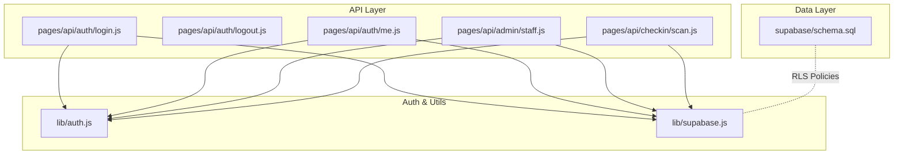
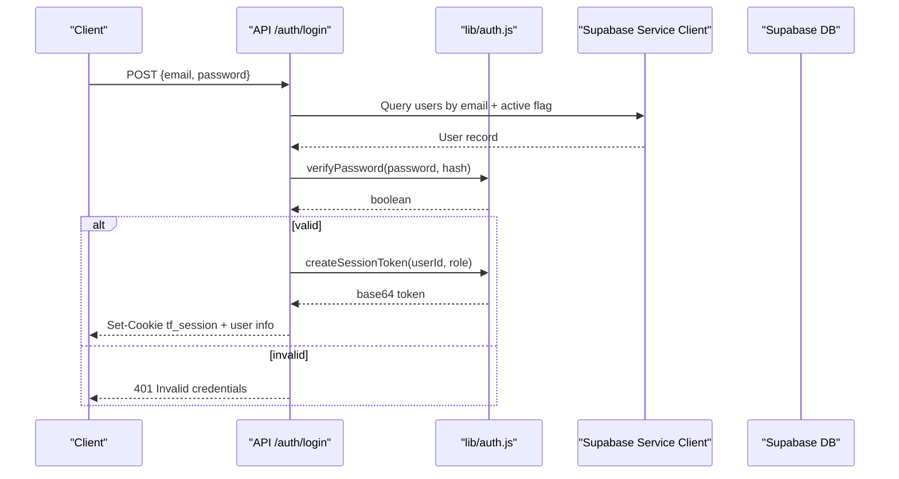
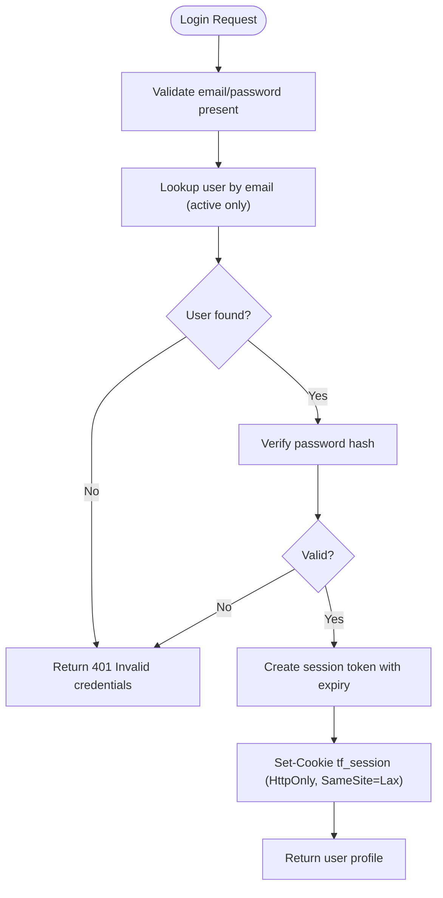
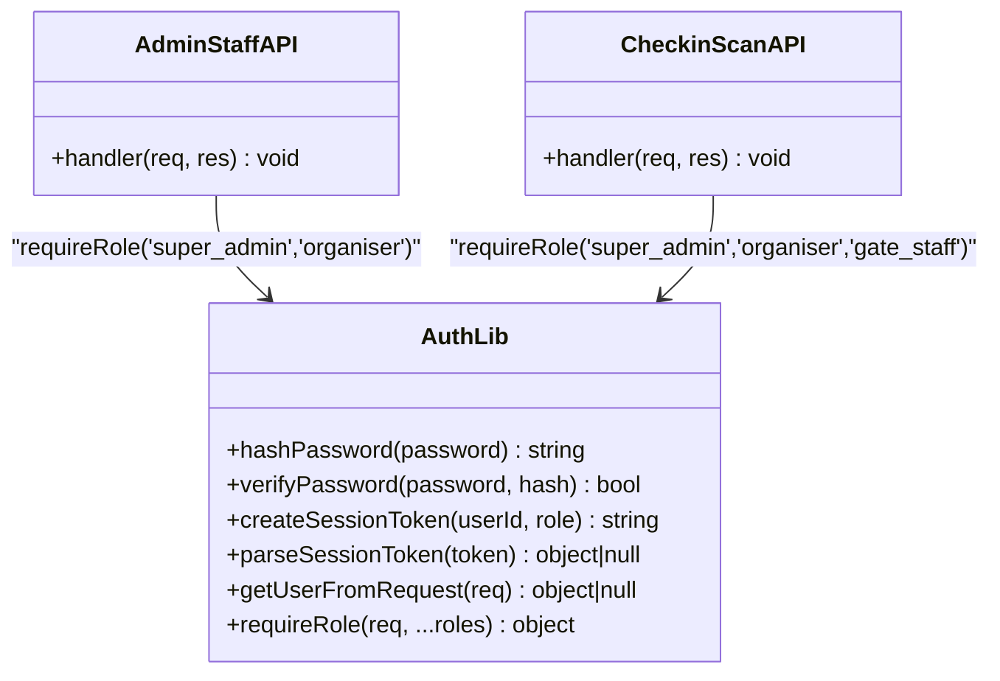
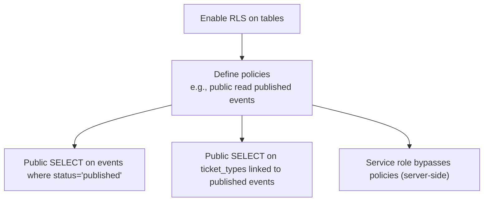
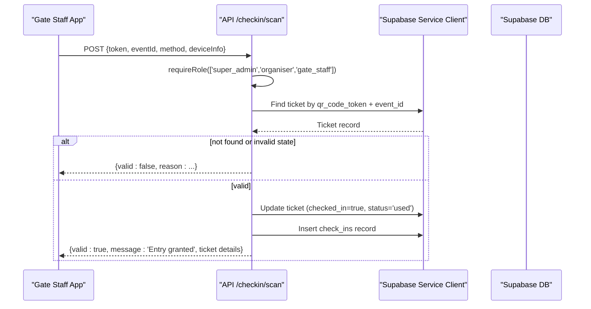
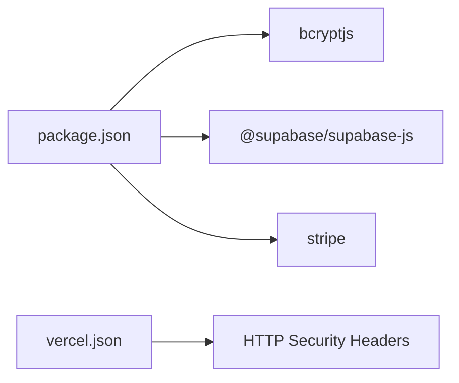

# Security Architecture

<cite>
**Referenced Files in This Document**
- [lib/auth.js](file://lib/auth.js)
- [lib/supabase.js](file://lib/supabase.js)
- [supabase/schema.sql](file://supabase/schema.sql)
- [pages/api/auth/login.js](file://pages/api/auth/login.js)
- [pages/api/auth/logout.js](file://pages/api/auth/logout.js)
- [pages/api/auth/me.js](file://pages/api/auth/me.js)
- [pages/api/admin/staff.js](file://pages/api/admin/staff.js)
- [pages/api/checkin/scan.js](file://pages/api/checkin/scan.js)
- [vercel.json](file://vercel.json)
- [package.json](file://package.json)
</cite>

## Table of Contents
1. Introduction
2. Project Structure
3. Core Components
4. Architecture Overview
5. Detailed Component Analysis
6. Dependency Analysis
7. Performance Considerations
8. Troubleshooting Guide
9. Conclusion
10. Appendices

## Introduction
This document explains TicketFlow’s security architecture with a focus on authentication, authorization, and data protection. It covers:
- Session-based authentication using a secure cookie token (JWT-like payload)
- Role-based access control (RBAC) for super_admin, organiser, and gate_staff
- Supabase Row-Level Security (RLS) policies to enforce fine-grained data access
- Input validation and error handling patterns
- HTTP security headers and environment variable management
- Secure deployment considerations

The goal is to provide both a high-level understanding and detailed implementation references for developers and operators.

## Project Structure
Security-related code is primarily located in:
- lib/auth.js: Password hashing, session token creation/parsing, role enforcement
- lib/supabase.js: Supabase client configuration (anon and service role keys)
- supabase/schema.sql: Database schema, constraints, indexes, and RLS policies
- pages/api/*: API routes implementing authentication, RBAC checks, and business logic
- vercel.json: Deployment-time HTTP security headers
- package.json: Dependencies including bcryptjs and Supabase client

**Diagram sources**
- [pages/api/auth/login.js:1-31](file://pages/api/auth/login.js#L1-L31)
- [pages/api/auth/logout.js:1-5](file://pages/api/auth/logout.js#L1-L5)
- [pages/api/auth/me.js:1-19](file://pages/api/auth/me.js#L1-L19)
- [pages/api/admin/staff.js:1-28](file://pages/api/admin/staff.js#L1-L28)
- [pages/api/checkin/scan.js:1-44](file://pages/api/checkin/scan.js#L1-L44)
- [lib/auth.js:1-47](file://lib/auth.js#L1-L47)
- [lib/supabase.js:1-23](file://lib/supabase.js#L1-L23)
- [supabase/schema.sql:120-143](file://supabase/schema.sql#L120-L143)

**Section sources**
- [lib/auth.js:1-47](file://lib/auth.js#L1-L47)
- [lib/supabase.js:1-23](file://lib/supabase.js#L1-L23)
- [supabase/schema.sql:1-166](file://supabase/schema.sql#L1-L166)
- [vercel.json:1-18](file://vercel.json#L1-L18)
- [package.json:1-24](file://package.json#L1-L24)

## Core Components
- Authentication and session management
  - Password hashing and verification via bcryptjs
  - Session token creation and parsing with expiration
  - Cookie-based session retrieval and validation
- Authorization (RBAC)
  - requireRole enforces allowed roles per endpoint
  - Roles: super_admin, organiser, gate_staff
- Data protection
  - Supabase service role client used server-side
  - RLS policies restrict row-level access
- Input validation and error handling
  - Minimal input checks at API boundaries
  - Consistent error responses and status codes

**Section sources**
- [lib/auth.js:1-47](file://lib/auth.js#L1-L47)
- [pages/api/auth/login.js:1-31](file://pages/api/auth/login.js#L1-L31)
- [pages/api/auth/me.js:1-19](file://pages/api/auth/me.js#L1-L19)
- [pages/api/admin/staff.js:1-28](file://pages/api/admin/staff.js#L1-L28)
- [pages/api/checkin/scan.js:1-44](file://pages/api/checkin/scan.js#L1-L44)
- [supabase/schema.sql:120-143](file://supabase/schema.sql#L120-L143)

## Architecture Overview
TicketFlow uses a layered security model:
- API layer validates requests, enforces roles, and delegates data operations to Supabase
- Supabase enforces RLS policies to prevent unauthorized row access
- Cookies carry session tokens; sensitive keys are kept server-side

**Diagram sources**
- [pages/api/auth/login.js:1-31](file://pages/api/auth/login.js#L1-L31)
- [lib/auth.js:1-47](file://lib/auth.js#L1-L47)
- [lib/supabase.js:1-23](file://lib/supabase.js#L1-L23)

## Detailed Component Analysis

### Authentication and Session Management
- Passwords are hashed with bcryptjs before storage and verified during login
- Session token contains userId, role, and expiration; stored in an HttpOnly, SameSite=Lax cookie
- Logout clears the session cookie

**Diagram sources**
- [pages/api/auth/login.js:1-31](file://pages/api/auth/login.js#L1-L31)
- [lib/auth.js:1-47](file://lib/auth.js#L1-L47)

**Section sources**
- [lib/auth.js:1-47](file://lib/auth.js#L1-L47)
- [pages/api/auth/login.js:1-31](file://pages/api/auth/login.js#L1-L31)
- [pages/api/auth/logout.js:1-5](file://pages/api/auth/logout.js#L1-L5)

### Role-Based Access Control (RBAC)
- requireRole extracts the current user from cookies and checks if their role is permitted
- Endpoints explicitly declare allowed roles
- Example usage: admin staff management allows super_admin or organiser; check-in allows super_admin, organiser, or gate_staff

**Diagram sources**
- [lib/auth.js:1-47](file://lib/auth.js#L1-L47)
- [pages/api/admin/staff.js:1-28](file://pages/api/admin/staff.js#L1-L28)
- [pages/api/checkin/scan.js:1-44](file://pages/api/checkin/scan.js#L1-L44)

**Section sources**
- [lib/auth.js:1-47](file://lib/auth.js#L1-L47)
- [pages/api/admin/staff.js:1-28](file://pages/api/admin/staff.js#L1-L28)
- [pages/api/checkin/scan.js:1-44](file://pages/api/checkin/scan.js#L1-L44)

### Supabase Row-Level Security (RLS)
- RLS is enabled across core tables
- Public read policies allow viewing published events and related ticket types
- Service role client is used server-side for privileged operations
- Policies can be extended to further restrict access based on authenticated user context

**Diagram sources**
- [supabase/schema.sql:120-143](file://supabase/schema.sql#L120-L143)

**Section sources**
- [supabase/schema.sql:120-143](file://supabase/schema.sql#L120-L143)
- [lib/supabase.js:1-23](file://lib/supabase.js#L1-L23)

### Check-In Flow Security
- Requires one of three roles
- Validates token and eventId
- Prevents duplicate check-ins and handles cancelled/refunded tickets
- Records check-in metadata and updates ticket status atomically

**Diagram sources**
- [pages/api/checkin/scan.js:1-44](file://pages/api/checkin/scan.js#L1-L44)
- [lib/auth.js:1-47](file://lib/auth.js#L1-L47)
- [lib/supabase.js:1-23](file://lib/supabase.js#L1-L23)

**Section sources**
- [pages/api/checkin/scan.js:1-44](file://pages/api/checkin/scan.js#L1-L44)

### Me Endpoint (Authenticated User Profile)
- Reads session from cookies
- Returns minimal user fields using service role client

**Section sources**
- [pages/api/auth/me.js:1-19](file://pages/api/auth/me.js#L1-L19)
- [lib/auth.js:1-47](file://lib/auth.js#L1-L47)
- [lib/supabase.js:1-23](file://lib/supabase.js#L1-L23)

### Admin Staff Management
- Enforces RBAC for creating/listing gate_staff accounts
- Hashes passwords before insertion
- Returns consistent error responses

**Section sources**
- [pages/api/admin/staff.js:1-28](file://pages/api/admin/staff.js#L1-L28)
- [lib/auth.js:1-47](file://lib/auth.js#L1-L47)

## Dependency Analysis
Key dependencies and their security implications:
- bcryptjs: Used for secure password hashing
- @supabase/supabase-js: Database client; service role key must remain server-only
- stripe: Payment integration; secret key must be server-only
- Next.js/Vercel: Framework and deployment platform

**Diagram sources**
- [package.json:1-24](file://package.json#L1-L24)
- [vercel.json:1-18](file://vercel.json#L1-L18)

**Section sources**
- [package.json:1-24](file://package.json#L1-L24)
- [vercel.json:1-18](file://vercel.json#L1-L18)

## Performance Considerations
- Use parameterized queries (via Supabase client) to avoid SQL injection and ensure efficient execution
- Indexes defined in schema support common queries (e.g., qr_code_token, event_id)
- Avoid returning excessive data; select only required fields
- Cache non-sensitive reads where appropriate (e.g., published events)

[No sources needed since this section provides general guidance]

## Troubleshooting Guide
Common issues and mitigations:
- Missing environment variables: Ensure NEXT_PUBLIC_SUPABASE_URL, NEXT_PUBLIC_SUPABASE_ANON_KEY, SUPABASE_SERVICE_ROLE_KEY, STRIPE_SECRET_KEY, and NEXT_PUBLIC_SITE_URL are set
- Cookie not sent: Verify SameSite and domain settings; ensure HTTPS in production for secure cookies
- Permission denied: Confirm requireRole includes the correct roles for the endpoint
- RLS policy errors: Review policies in schema.sql and ensure service role client is used server-side

**Section sources**
- [lib/supabase.js:1-23](file://lib/supabase.js#L1-L23)
- [vercel.json:1-18](file://vercel.json#L1-L18)
- [supabase/schema.sql:120-143](file://supabase/schema.sql#L120-L143)

## Conclusion
TicketFlow implements a robust, multi-layered security approach:
- Secure session cookies with expiration and HttpOnly/SameSite flags
- RBAC enforced at API boundaries
- Supabase RLS for fine-grained data protection
- Server-only secrets and safe client usage
- HTTP security headers at the edge

To strengthen further, consider adopting a dedicated auth provider (e.g., Supabase Auth), adding CSRF tokens for state-changing endpoints, and expanding RLS policies to cover all sensitive operations.

[No sources needed since this section summarizes without analyzing specific files]

## Appendices

### Environment Variables and Secrets Management
- NEXT_PUBLIC_SUPABASE_URL: Supabase project URL (public)
- NEXT_PUBLIC_SUPABASE_ANON_KEY: Anon key for client-side (public)
- SUPABASE_SERVICE_ROLE_KEY: Service role key (server-only, never expose to client)
- STRIPE_SECRET_KEY: Stripe secret key (server-only)
- NEXT_PUBLIC_SITE_URL: Base site URL for redirects and QR generation

Best practices:
- Store secrets in platform-specific secret managers (e.g., Vercel env vars)
- Never commit secrets to version control
- Rotate keys regularly and audit access logs

**Section sources**
- [lib/supabase.js:1-23](file://lib/supabase.js#L1-L23)
- [vercel.json:1-18](file://vercel.json#L1-L18)

### Input Validation and Error Handling
- Validate presence and basic format of required fields at API entry points
- Normalize inputs (e.g., lowercase email, trim whitespace)
- Return consistent JSON error structures with appropriate HTTP status codes
- Avoid leaking internal errors to clients

**Section sources**
- [pages/api/auth/login.js:1-31](file://pages/api/auth/login.js#L1-L31)
- [pages/api/admin/staff.js:1-28](file://pages/api/admin/staff.js#L1-L28)
- [pages/api/checkin/scan.js:1-44](file://pages/api/checkin/scan.js#L1-L44)

### XSS Protection and CSRF Mitigation
- HTTP headers configured at the edge:
  - X-Content-Type-Options: nosniff
  - X-Frame-Options: DENY
  - X-XSS-Protection: 1; mode=block
- Recommendations:
  - Implement Content-Security-Policy (CSP) to restrict script sources
  - Add CSRF tokens for state-changing endpoints when using cookies
  - Sanitize any user-generated content rendered in HTML

**Section sources**
- [vercel.json:1-18](file://vercel.json#L1-L18)

### SQL Injection Prevention
- Use parameterized queries through Supabase client
- Avoid string concatenation for SQL
- Apply least privilege: use anon key for client-side reads and service role key only server-side

**Section sources**
- [lib/supabase.js:1-23](file://lib/supabase.js#L1-L23)
- [supabase/schema.sql:120-143](file://supabase/schema.sql#L120-L143)