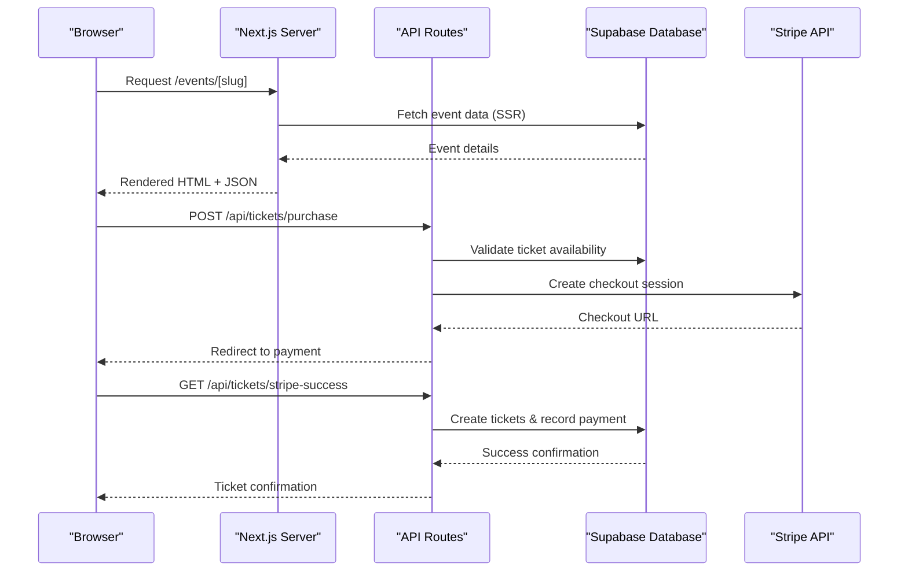
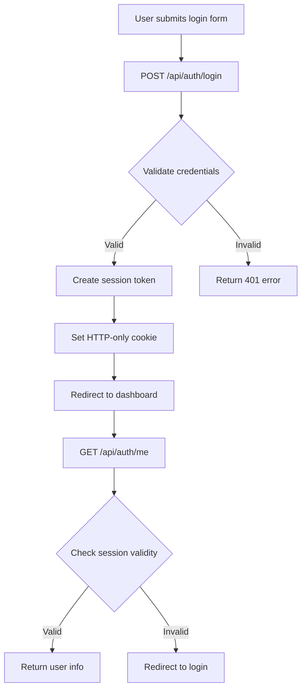
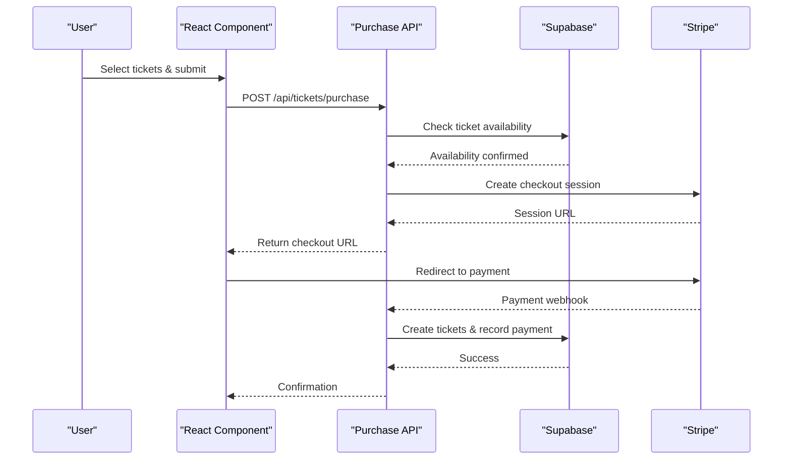
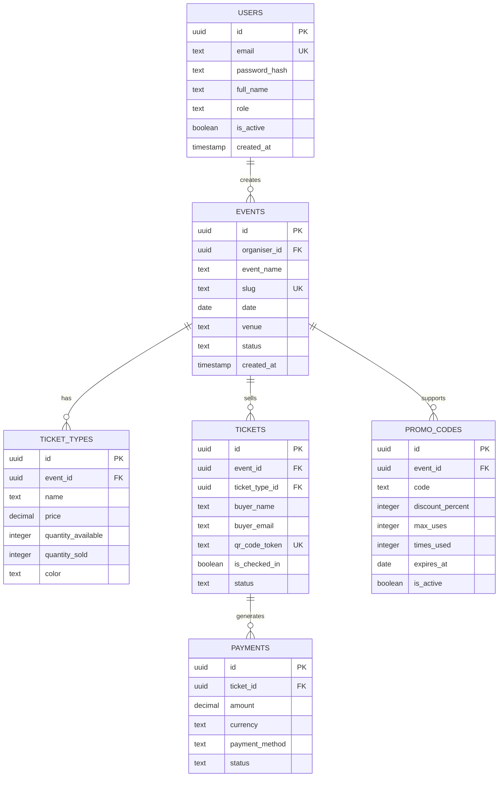
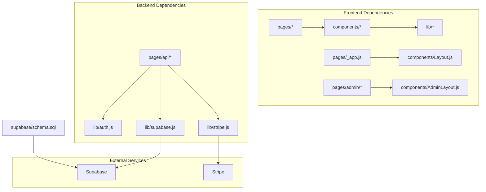

# System Architecture

<cite>
**Referenced Files in This Document**
- [package.json](file://package.json)
- [next.config.js](file://next.config.js)
- [vercel.json](file://vercel.json)
- [pages/_app.js](file://pages/_app.js)
- [pages/_document.js](file://pages/_document.js)
- [components/Layout.js](file://components/Layout.js)
- [components/AdminLayout.js](file://components/AdminLayout.js)
- [pages/index.js](file://pages/index.js)
- [pages/admin/index.js](file://pages/admin/index.js)
- [lib/supabase.js](file://lib/supabase.js)
- [lib/auth.js](file://lib/auth.js)
- [lib/stripe.js](file://lib/stripe.js)
- [pages/api/auth/login.js](file://pages/api/auth/login.js)
- [pages/api/tickets/purchase.js](file://pages/api/tickets/purchase.js)
- [supabase/schema.sql](file://supabase/schema.sql)
</cite>

## Table of Contents
1. Introduction
2. Project Structure
3. Core Components
4. Architecture Overview
5. Detailed Component Analysis
6. Dependency Analysis
7. Performance Considerations
8. Troubleshooting Guide
9. Conclusion

## Introduction
TicketFlow is a Next.js-based full-stack ticketing platform that combines server-side rendering (SSR), component-driven UI, and API routes to deliver fast, secure, and scalable event discovery and ticket purchasing. The application separates concerns across:
- Frontend presentation layer: React components and pages for user experiences
- Backend business logic: API routes handling authentication, payments, and data operations
- Data access layer: Supabase client with service role credentials for secure server-side queries

This architecture ensures SEO-friendly pages via SSR, responsive UI through reusable components, and robust backend operations via centralized API endpoints.

## Project Structure
The project follows Next.js conventions with clear separation between pages, components, API routes, and shared libraries:
- pages/: Contains all route handlers and views, including API endpoints under pages/api/
- components/: Reusable UI elements and layout wrappers
- lib/: Shared utilities for authentication, database clients, and payment integrations
- supabase/: Database schema definitions and policies

```mermaid
graph TB
subgraph "Next.js App"
A["_app.js"] --> B["Layout.js"]
C["_document.js"] --> D["Global Styles"]
E["index.js"] --> F["UI Components"]
G["admin/index.js"] --> H["AdminLayout.js"]
end
subgraph "API Routes"
I["api/auth/login.js"] --> J["lib/auth.js"]
K["api/tickets/purchase.js"] --> L["lib/supabase.js"]
M["lib/stripe.js"] --> N["Stripe API"]
end
subgraph "Data Layer"
O["lib/supabase.js"] --> P["Supabase Client"]
Q["schema.sql"] --> R["Database Tables"]
end
F --> O
H --> I
K --> M
```

**Diagram sources**
- [pages/_app.js:1-14](file://pages/_app.js#L1-L14)
- [components/Layout.js:1-281](file://components/Layout.js#L1-L281)
- [pages/index.js:1-753](file://pages/index.js#L1-L753)
- [pages/admin/index.js:1-585](file://pages/admin/index.js#L1-L585)
- [lib/supabase.js:1-23](file://lib/supabase.js#L1-L23)
- [lib/auth.js:1-47](file://lib/auth.js#L1-L47)
- [lib/stripe.js:1-6](file://lib/stripe.js#L1-L6)
- [supabase/schema.sql:1-166](file://supabase/schema.sql#L1-L166)

**Section sources**
- [package.json:1-24](file://package.json#L1-L24)
- [next.config.js:1-14](file://next.config.js#L1-L14)
- [vercel.json:1-18](file://vercel.json#L1-L18)

## Core Components
The application is built around several key architectural patterns:

### Layout System
- **Layout.js**: Main application wrapper providing navigation, theme management, and global styling
- **AdminLayout.js**: Specialized layout for admin dashboard with sidebar navigation and role-based access control

### Page Components
- **index.js**: Landing page with SSR data fetching from Supabase, event filtering, and interactive features
- **admin/index.js**: Dashboard displaying analytics, statistics, and quick actions for event management

### API Routes
- **Authentication**: Login/logout functionality with session management
- **Ticket Purchase**: Payment processing with Stripe integration and ticket generation
- **Admin Operations**: Event management, staff management, and reporting endpoints

### Library Modules
- **Supabase Client**: Database connectivity with both public and service role clients
- **Auth Utilities**: Password hashing, session token creation, and role validation
- **Stripe Integration**: Payment processing configuration and checkout session management

**Section sources**
- [components/Layout.js:1-281](file://components/Layout.js#L1-L281)
- [components/AdminLayout.js:1-194](file://components/AdminLayout.js#L1-L194)
- [pages/index.js:1-753](file://pages/index.js#L1-L753)
- [pages/admin/index.js:1-585](file://pages/admin/index.js#L1-L585)
- [lib/supabase.js:1-23](file://lib/supabase.js#L1-L23)
- [lib/auth.js:1-47](file://lib/auth.js#L1-L47)
- [lib/stripe.js:1-6](file://lib/stripe.js#L1-L6)

## Architecture Overview
TicketFlow implements a modern full-stack architecture leveraging Next.js capabilities:

**Diagram sources**
- [pages/index.js:726-750](file://pages/index.js#L726-L750)
- [pages/api/tickets/purchase.js:1-123](file://pages/api/tickets/purchase.js#L1-L123)
- [lib/supabase.js:1-23](file://lib/supabase.js#L1-L23)
- [lib/stripe.js:1-6](file://lib/stripe.js#L1-L6)

The architecture follows these key principles:
- **Server-Side Rendering**: Pages fetch data on the server for optimal performance and SEO
- **Component-Based UI**: Reusable components ensure consistency and maintainability
- **API-First Design**: All business logic is exposed through well-defined API endpoints
- **Security by Default**: Service role credentials only used server-side, proper input validation

## Detailed Component Analysis

### Authentication Flow
The authentication system uses cookie-based sessions with role-based access control:

**Diagram sources**
- [pages/api/auth/login.js:1-31](file://pages/api/auth/login.js#L1-L31)
- [lib/auth.js:1-47](file://lib/auth.js#L1-L47)

**Section sources**
- [pages/api/auth/login.js:1-31](file://pages/api/auth/login.js#L1-L31)
- [lib/auth.js:1-47](file://lib/auth.js#L1-L47)

### Ticket Purchase Process
The ticket purchase flow integrates multiple services for secure transactions:

**Diagram sources**
- [pages/api/tickets/purchase.js:1-123](file://pages/api/tickets/purchase.js#L1-L123)
- [lib/stripe.js:1-6](file://lib/stripe.js#L1-L6)

**Section sources**
- [pages/api/tickets/purchase.js:1-123](file://pages/api/tickets/purchase.js#L1-L123)
- [lib/stripe.js:1-6](file://lib/stripe.js#L1-L6)

### Database Schema and Security
The application uses Supabase with comprehensive security policies:

**Diagram sources**
- [supabase/schema.sql:1-166](file://supabase/schema.sql#L1-L166)

**Section sources**
- [supabase/schema.sql:1-166](file://supabase/schema.sql#L1-L166)

## Dependency Analysis
The application maintains clear dependency relationships between components:

**Diagram sources**
- [pages/_app.js:1-14](file://pages/_app.js#L1-L14)
- [components/Layout.js:1-281](file://components/Layout.js#L1-L281)
- [lib/supabase.js:1-23](file://lib/supabase.js#L1-L23)
- [lib/auth.js:1-47](file://lib/auth.js#L1-L47)
- [lib/stripe.js:1-6](file://lib/stripe.js#L1-L6)

Key dependency patterns:
- **Loose Coupling**: Components import only what they need
- **Centralized Configuration**: Environment variables managed through Next.js config
- **Service Abstraction**: External services accessed through dedicated modules
- **Error Boundaries**: Proper error handling throughout the stack

**Section sources**
- [package.json:1-24](file://package.json#L1-L24)
- [next.config.js:1-14](file://next.config.js#L1-L14)

## Performance Considerations
TicketFlow implements several performance optimization strategies:

### Server-Side Rendering Benefits
- **SEO Optimization**: Pages are pre-rendered on the server for better search engine indexing
- **Faster Time-to-First-Byte**: Initial HTML is served immediately without waiting for JavaScript
- **Reduced Client-Side Processing**: Heavy data fetching happens on the server

### Code Splitting Strategy
- **Automatic Code Splitting**: Next.js automatically splits code by route
- **Component-Level Optimization**: Large components can be dynamically imported
- **Asset Optimization**: Images and fonts are optimized through Next.js Image component

### Caching Strategies
- **Static Site Generation**: For content that doesn't change frequently
- **API Response Caching**: Database queries can be cached at various levels
- **Browser Caching**: Static assets are cached using appropriate headers

### Database Performance
- **Index Optimization**: Strategic indexes on frequently queried columns
- **Query Optimization**: Efficient Supabase queries with proper filtering
- **Connection Pooling**: Supabase client manages connection pooling automatically

[No sources needed since this section provides general guidance]

## Troubleshooting Guide
Common issues and their solutions:

### Authentication Problems
- **Session Issues**: Verify cookie settings and domain configuration
- **Role Validation**: Ensure proper role checks in protected routes
- **Password Hashing**: Confirm bcrypt configuration and salt rounds

### Database Connection Errors
- **Environment Variables**: Check Supabase URL and keys configuration
- **Service Role Permissions**: Verify RLS policies and service role access
- **Connection Limits**: Monitor Supabase connection usage

### Payment Processing Issues
- **Stripe Configuration**: Validate API keys and webhook setup
- **Checkout Sessions**: Ensure proper metadata and redirect URLs
- **Payment Verification**: Implement proper webhook handlers

### Performance Issues
- **Large Bundle Sizes**: Analyze bundle with Next.js analyzer
- **Database Query Performance**: Use Supabase query logs
- **Image Optimization**: Configure proper image sizes and formats

**Section sources**
- [lib/auth.js:1-47](file://lib/auth.js#L1-L47)
- [lib/supabase.js:1-23](file://lib/supabase.js#L1-L23)
- [lib/stripe.js:1-6](file://lib/stripe.js#L1-L6)

## Conclusion
TicketFlow demonstrates a well-architected Next.js application that effectively separates concerns between frontend presentation, backend business logic, and data access layers. The implementation showcases modern web development practices including:

- **Scalable Architecture**: Clear separation of concerns enables easy scaling and maintenance
- **Security Best Practices**: Proper authentication, authorization, and data protection
- **Performance Optimization**: SSR, code splitting, and efficient database queries
- **Developer Experience**: Modular structure and reusable components

The system successfully balances user experience with technical requirements, providing a solid foundation for future enhancements and scaling needs.

[No sources needed since this section summarizes without analyzing specific files]