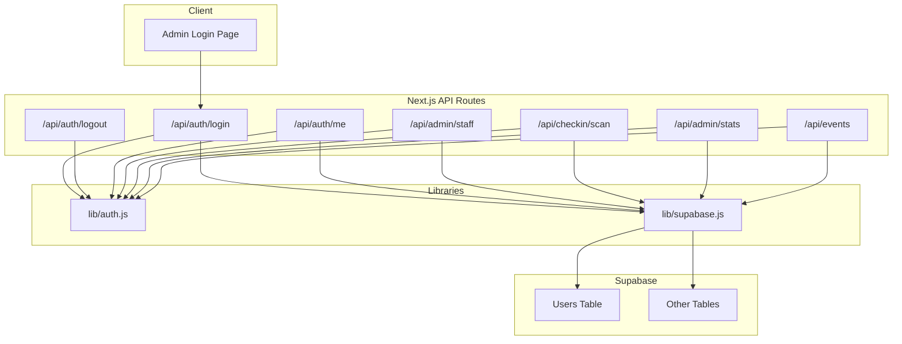
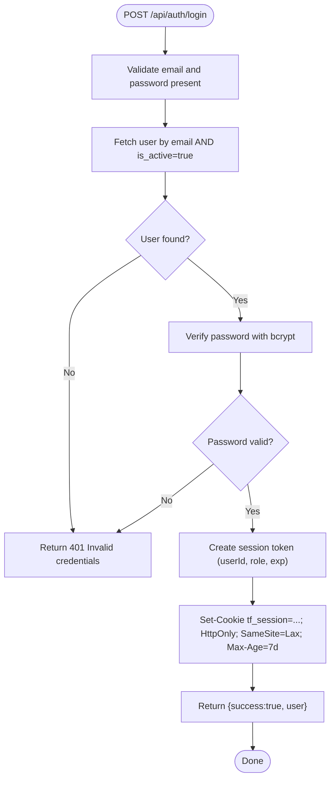
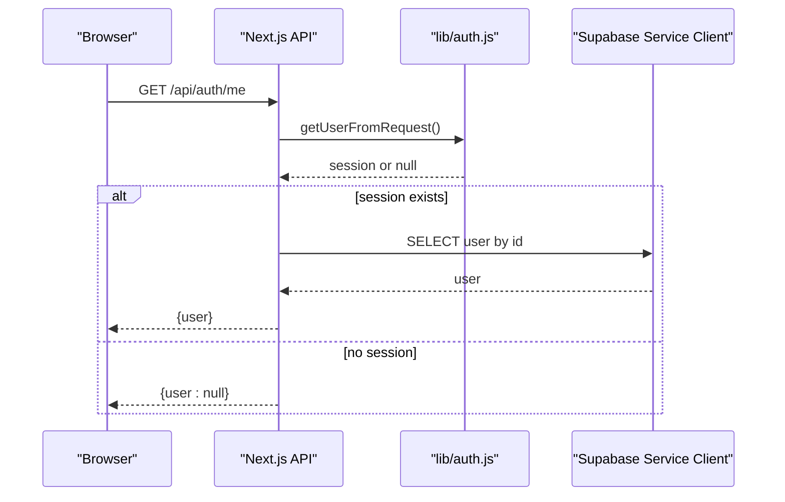
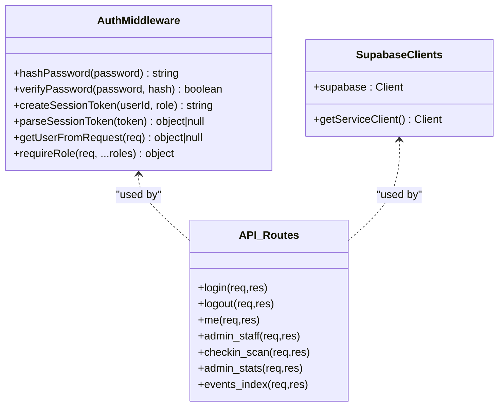
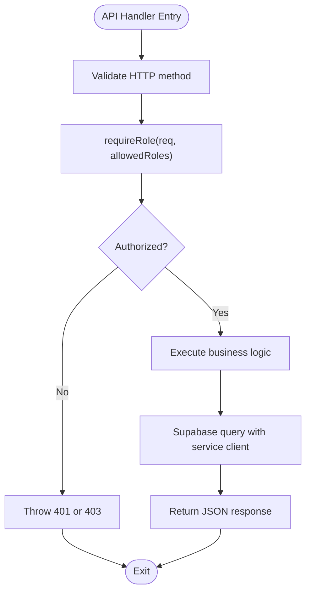
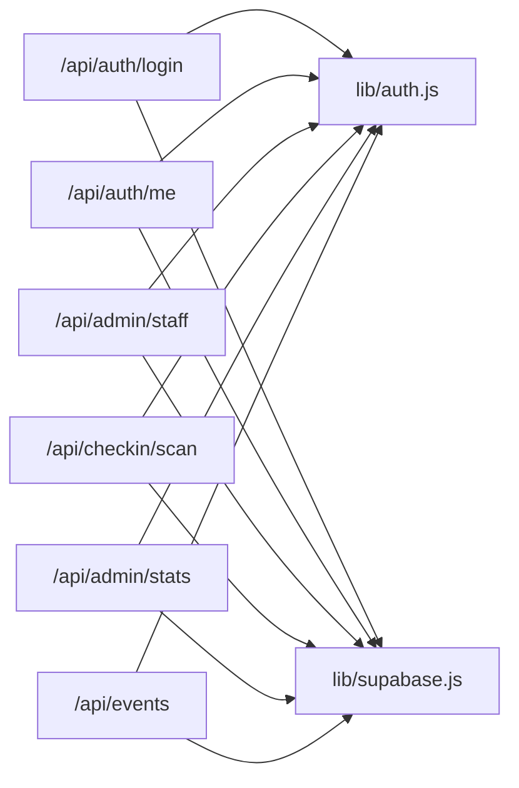

# Authentication & Authorization

<cite>
**Referenced Files in This Document**
- [auth.js](file://lib/auth.js)
- [supabase.js](file://lib/supabase.js)
- [login.js](file://pages/api/auth/login.js)
- [logout.js](file://pages/api/auth/logout.js)
- [me.js](file://pages/api/auth/me.js)
- [staff.js](file://pages/api/admin/staff.js)
- [scan.js](file://pages/api/checkin/scan.js)
- [stats.js](file://pages/api/admin/stats.js)
- [events_index.js](file://pages/api/events/index.js)
- [schema.sql](file://supabase/schema.sql)
- [package.json](file://package.json)
</cite>

## Table of Contents
1. [Introduction](#introduction)
2. [Project Structure](#project-structure)
3. [Core Components](#core-components)
4. [Architecture Overview](#architecture-overview)
5. [Detailed Component Analysis](#detailed-component-analysis)
6. [Dependency Analysis](#dependency-analysis)
7. [Performance Considerations](#performance-considerations)
8. [Troubleshooting Guide](#troubleshooting-guide)
9. [Conclusion](#conclusion)
10. [Appendices](#appendices)

## Introduction
This document explains TicketFlow’s authentication and authorization system, focusing on:
- Session-based authentication using a secure cookie token (not JWT), with bcrypt password hashing
- Role-based access control across three roles: super_admin, organiser, gate_staff
- Integration with Supabase for user data and business logic
- Protected routes via API middleware patterns
- Security best practices, token expiration handling, and common pitfalls

Note: Although the objective mentions JWT, this codebase implements a Base64-encoded session payload stored in an HttpOnly cookie. The flow is analogous to JWT in that it carries identity and role claims, but it is not cryptographically signed or verified as a JWT.

## Project Structure
The authentication and authorization features are implemented across:
- lib/auth.js: Password hashing, session token creation/parsing, and role enforcement middleware
- lib/supabase.js: Supabase client configuration (anon and service role)
- pages/api/auth/*: Login, logout, and current user endpoints
- pages/api/admin/* and pages/api/checkin/*: Examples of protected endpoints enforcing roles
- supabase/schema.sql: Database schema including users table and role constraints



**Diagram sources**
- [login.js:1-31](file://pages/api/auth/login.js#L1-L31)
- [logout.js:1-5](file://pages/api/auth/logout.js#L1-L5)
- [me.js:1-19](file://pages/api/auth/me.js#L1-L19)
- [staff.js:1-28](file://pages/api/admin/staff.js#L1-L28)
- [scan.js:1-44](file://pages/api/checkin/scan.js#L1-L44)
- [stats.js:1-41](file://pages/api/admin/stats.js#L1-L41)
- [events_index.js:1-42](file://pages/api/events/index.js#L1-L42)
- [auth.js:1-47](file://lib/auth.js#L1-L47)
- [supabase.js:1-23](file://lib/supabase.js#L1-L23)

**Section sources**
- [auth.js:1-47](file://lib/auth.js#L1-L47)
- [supabase.js:1-23](file://lib/supabase.js#L1-L23)
- [login.js:1-31](file://pages/api/auth/login.js#L1-L31)
- [logout.js:1-5](file://pages/api/auth/logout.js#L1-L5)
- [me.js:1-19](file://pages/api/auth/me.js#L1-L19)
- [staff.js:1-28](file://pages/api/admin/staff.js#L1-L28)
- [scan.js:1-44](file://pages/api/checkin/scan.js#L1-L44)
- [stats.js:1-41](file://pages/api/admin/stats.js#L1-L41)
- [events_index.js:1-42](file://pages/api/events/index.js#L1-L42)
- [schema.sql:1-166](file://supabase/schema.sql#L1-L166)

## Core Components
- Password hashing and verification: bcryptjs with salt rounds configured
- Session token: Base64-encoded JSON payload containing userId, role, and expiration; stored in an HttpOnly cookie named tf_session
- Middleware-like function requireRole: extracts user from cookies, validates presence and role, throws standardized errors
- Supabase clients: anon client for public reads, service role client for privileged server-side operations

Key responsibilities:
- auth.js: hashPassword, verifyPassword, createSessionToken, parseSessionToken, getUserFromRequest, requireRole
- supabase.js: create anon and service-role clients
- API routes: enforce HTTP methods, validate inputs, call requireRole, interact with Supabase

**Section sources**
- [auth.js:1-47](file://lib/auth.js#L1-L47)
- [supabase.js:1-23](file://lib/supabase.js#L1-L23)

## Architecture Overview
TicketFlow uses a simple, secure session model:
- Client submits credentials to /api/auth/login
- Server verifies password against hashed value in Supabase
- On success, server sets an HttpOnly cookie with a Base64 session token
- Subsequent requests include the cookie; requireRole extracts and validates the session
- Protected endpoints enforce role checks before processing

```mermaid
sequenceDiagram
participant Client as "Browser"
participant API as "Next.js API"
participant Auth as "lib/auth.js"
participant SB as "Supabase Service Client"
Client->>API : POST /api/auth/login {email,password}
API->>SB : SELECT user by email AND is_active=true
SB-->>API : user record
API->>Auth : verifyPassword(password, password_hash)
Auth-->>API : boolean
alt valid
API->>API : createSessionToken(userId, role)
API-->>Client : Set-Cookie tf_session=...; HttpOnly; SameSite=Lax; Max-Age=7d
API-->>Client : {success : true, user : {id,email,full_name,role}}
else invalid
API-->>Client : 401 Invalid credentials
end
Client->>API : GET /api/admin/stats
API->>Auth : requireRole(req, 'super_admin','organiser')
Auth-->>API : user object or throw 401/403
API->>SB : Query stats based on user.role
SB-->>API : stats data
API-->>Client : {totalRevenue,totalTicketsSold,...}
```

**Diagram sources**
- [login.js:1-31](file://pages/api/auth/login.js#L1-L31)
- [auth.js:1-47](file://lib/auth.js#L1-L47)
- [stats.js:1-41](file://pages/api/admin/stats.js#L1-L41)

## Detailed Component Analysis

### Authentication Flow (Login)
- Validates method and required fields
- Retrieves active user by email from Supabase
- Verifies password using bcrypt
- Creates session token and sets secure cookie
- Returns minimal user profile

Security notes:
- Cookie flags: Path=/, HttpOnly, SameSite=Lax, Max-Age=7 days
- No sensitive data in response beyond necessary user fields



**Diagram sources**
- [login.js:1-31](file://pages/api/auth/login.js#L1-L31)
- [auth.js:1-47](file://lib/auth.js#L1-L47)

**Section sources**
- [login.js:1-31](file://pages/api/auth/login.js#L1-L31)
- [auth.js:1-47](file://lib/auth.js#L1-L47)

### Logout Flow
- Clears the session cookie by setting Max-Age=0
- Returns success response

```mermaid
sequenceDiagram
participant Client as "Browser"
participant API as "Next.js API"
Client->>API : GET /api/auth/logout
API-->>Client : Set-Cookie tf_session=; Max-Age=0
API-->>Client : {success : true}
```

**Diagram sources**
- [logout.js:1-5](file://pages/api/auth/logout.js#L1-L5)

**Section sources**
- [logout.js:1-5](file://pages/api/auth/logout.js#L1-L5)

### Current User Endpoint (/me)
- Reads session from cookies
- If present, fetches full user details from Supabase
- Returns user or null



**Diagram sources**
- [me.js:1-19](file://pages/api/auth/me.js#L1-L19)
- [auth.js:1-47](file://lib/auth.js#L1-L47)

**Section sources**
- [me.js:1-19](file://pages/api/auth/me.js#L1-L19)
- [auth.js:1-47](file://lib/auth.js#L1-L47)

### Role-Based Access Control (RBAC)
Roles enforced:
- super_admin: Full administrative access
- organiser: Event management within their own events
- gate_staff: Check-in operations at events

Examples:
- Admin staff management requires super_admin or organiser
- Check-in scanning requires super_admin, organiser, or gate_staff
- Stats endpoint filters events by organiser_id for non-super_admin users



**Diagram sources**
- [auth.js:1-47](file://lib/auth.js#L1-L47)
- [supabase.js:1-23](file://lib/supabase.js#L1-L23)
- [staff.js:1-28](file://pages/api/admin/staff.js#L1-L28)
- [scan.js:1-44](file://pages/api/checkin/scan.js#L1-L44)
- [stats.js:1-41](file://pages/api/admin/stats.js#L1-L41)
- [events_index.js:1-42](file://pages/api/events/index.js#L1-L42)

**Section sources**
- [staff.js:1-28](file://pages/api/admin/staff.js#L1-L28)
- [scan.js:1-44](file://pages/api/checkin/scan.js#L1-L44)
- [stats.js:1-41](file://pages/api/admin/stats.js#L1-L41)
- [events_index.js:1-42](file://pages/api/events/index.js#L1-L42)
- [auth.js:1-47](file://lib/auth.js#L1-L47)

### Password Hashing with bcryptjs
- Uses bcrypt.hash with a cost factor of 12
- Uses bcrypt.compare for verification
- Ensures passwords are never stored in plaintext

Best practices observed:
- Consistent hashing and comparison functions
- Centralized in lib/auth.js for reuse

**Section sources**
- [auth.js:1-12](file://lib/auth.js#L1-L12)
- [package.json:1-24](file://package.json#L1-L24)

### Secure Session Storage
- Session token is Base64-encoded JSON with userId, role, and expiration timestamp
- Stored in an HttpOnly cookie to prevent client-side access
- SameSite=Lax reduces CSRF risk
- Max-Age set to 7 days for session lifetime

Expiration handling:
- parseSessionToken checks exp against current time and returns null if expired
- requireRole will treat expired sessions as unauthenticated

**Section sources**
- [auth.js:14-28](file://lib/auth.js#L14-L28)
- [login.js:23-25](file://pages/api/auth/login.js#L23-L25)
- [logout.js:1-5](file://pages/api/auth/logout.js#L1-L5)

### Protected Routes and Middleware Patterns
Protected endpoints demonstrate consistent patterns:
- Method validation
- Input validation
- requireRole enforcement
- Supabase queries using service role client
- Standardized error responses

Examples:
- /api/admin/staff: Requires super_admin or organiser
- /api/checkin/scan: Requires super_admin, organiser, or gate_staff
- /api/admin/stats: Requires super_admin or organiser; filters by organiser_id for organisers



**Diagram sources**
- [staff.js:1-28](file://pages/api/admin/staff.js#L1-L28)
- [scan.js:1-44](file://pages/api/checkin/scan.js#L1-L44)
- [stats.js:1-41](file://pages/api/admin/stats.js#L1-L41)
- [auth.js:38-47](file://lib/auth.js#L38-L47)

**Section sources**
- [staff.js:1-28](file://pages/api/admin/staff.js#L1-L28)
- [scan.js:1-44](file://pages/api/checkin/scan.js#L1-L44)
- [stats.js:1-41](file://pages/api/admin/stats.js#L1-L41)
- [auth.js:38-47](file://lib/auth.js#L38-L47)

### Supabase Integration
- Anon client used for public reads where appropriate
- Service role client used for all server-side mutations and privileged reads
- Schema enforces role values and relationships

Key schema elements:
- users table includes role constraint with allowed values
- tickets and check_ins track check-in state and audit trails
- Row-level security enabled; service role bypasses policies

**Section sources**
- [supabase.js:1-23](file://lib/supabase.js#L1-L23)
- [schema.sql:1-166](file://supabase/schema.sql#L1-L166)

## Dependency Analysis
- API routes depend on lib/auth.js for authentication and authorization helpers
- API routes depend on lib/supabase.js for database access
- Database schema defines role constraints and relationships



**Diagram sources**
- [login.js:1-31](file://pages/api/auth/login.js#L1-L31)
- [me.js:1-19](file://pages/api/auth/me.js#L1-L19)
- [staff.js:1-28](file://pages/api/admin/staff.js#L1-L28)
- [scan.js:1-44](file://pages/api/checkin/scan.js#L1-L44)
- [stats.js:1-41](file://pages/api/admin/stats.js#L1-L41)
- [events_index.js:1-42](file://pages/api/events/index.js#L1-L42)
- [auth.js:1-47](file://lib/auth.js#L1-L47)
- [supabase.js:1-23](file://lib/supabase.js#L1-L23)

**Section sources**
- [auth.js:1-47](file://lib/auth.js#L1-L47)
- [supabase.js:1-23](file://lib/supabase.js#L1-L23)

## Performance Considerations
- bcrypt cost factor 12 balances security and latency; consider profiling under load
- Single-row Supabase queries per request minimize overhead
- Avoid unnecessary joins; use selective field projections
- Cache frequently accessed read-only data at the application layer if needed

[No sources needed since this section provides general guidance]

## Troubleshooting Guide
Common issues and resolutions:
- Missing environment variables for Supabase: Ensure NEXT_PUBLIC_SUPABASE_URL and NEXT_PUBLIC_SUPABASE_ANON_KEY are set; service role key SUPABASE_SERVICE_ROLE_KEY must be available server-side
- Expired sessions: parseSessionToken returns null when exp < Date.now(); re-authenticate via login
- Incorrect role: requireRole throws 403 if user role not in allowed list; verify user.role in Supabase
- Cookie not sent: Ensure cookies are included in cross-origin requests; configure credentials appropriately on client side
- Invalid credentials: Verify email normalization and is_active flag; ensure password matches stored hash

**Section sources**
- [supabase.js:1-23](file://lib/supabase.js#L1-L23)
- [auth.js:14-47](file://lib/auth.js#L14-L47)
- [login.js:1-31](file://pages/api/auth/login.js#L1-L31)

## Conclusion
TicketFlow’s authentication and authorization system combines:
- Secure password hashing with bcryptjs
- Simple, robust session tokens stored in HttpOnly cookies
- Clear role-based access control for super_admin, organiser, and gate_staff
- Consistent middleware-like pattern using requireRole
- Supabase integration with service role client for privileged operations

For production hardening:
- Replace Base64 session tokens with signed JWTs or a dedicated auth provider (e.g., NextAuth or Supabase Auth)
- Enforce HTTPS and add Secure flag to cookies
- Implement refresh tokens and short-lived access tokens
- Add rate limiting and brute-force protection on login
- Audit and rotate secrets regularly

[No sources needed since this section summarizes without analyzing specific files]

## Appendices

### Role Permissions Matrix
- super_admin: Full access to admin endpoints, statistics, and user management
- organiser: Manage events they own; limited admin capabilities
- gate_staff: Perform check-ins and scan tickets at events

**Section sources**
- [schema.sql:10-19](file://supabase/schema.sql#L10-L19)
- [staff.js:1-28](file://pages/api/admin/staff.js#L1-L28)
- [scan.js:1-44](file://pages/api/checkin/scan.js#L1-L44)
- [stats.js:1-41](file://pages/api/admin/stats.js#L1-L41)

### Example: Implementing Protected Routes
Pattern summary:
- Validate HTTP method
- Call requireRole with allowed roles
- Execute business logic with Supabase service client
- Return standardized JSON responses

Reference paths:
- Protected route example: [staff.js:1-28](file://pages/api/admin/staff.js#L1-L28)
- Another protected route: [scan.js:1-44](file://pages/api/checkin/scan.js#L1-L44)
- Role-scoped data filtering: [stats.js:1-41](file://pages/api/admin/stats.js#L1-L41)

**Section sources**
- [staff.js:1-28](file://pages/api/admin/staff.js#L1-L28)
- [scan.js:1-44](file://pages/api/checkin/scan.js#L1-L44)
- [stats.js:1-41](file://pages/api/admin/stats.js#L1-L41)

### Token Expiration Handling
- Sessions expire after 7 days (Max-Age)
- parseSessionToken checks exp timestamp and invalidates expired sessions
- Clients should handle 401 responses by redirecting to login

**Section sources**
- [auth.js:14-28](file://lib/auth.js#L14-L28)
- [login.js:23-25](file://pages/api/auth/login.js#L23-L25)

### Security Best Practices Checklist
- Use HttpOnly and SameSite cookies
- Enforce HTTPS in production
- Validate and sanitize all inputs
- Use service role client only server-side
- Rotate secrets and keys regularly
- Monitor failed login attempts and implement rate limiting

**Section sources**
- [auth.js:14-28](file://lib/auth.js#L14-L28)
- [supabase.js:1-23](file://lib/supabase.js#L1-L23)