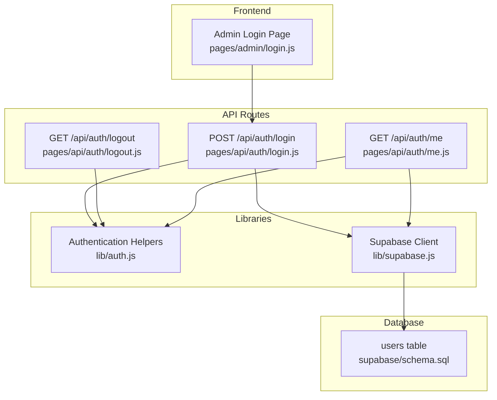
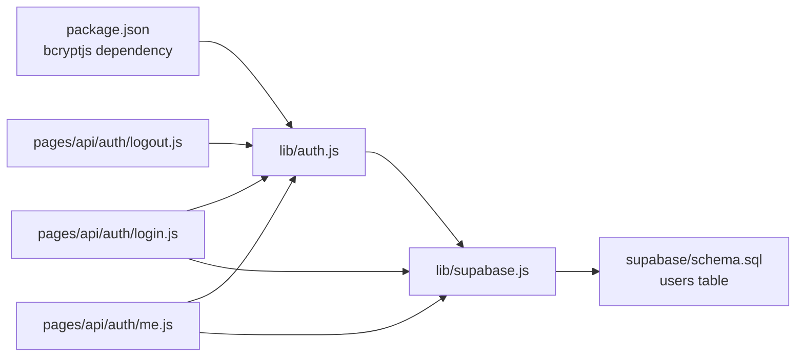

# Authentication Flow

<cite>
**Referenced Files in This Document**
- [auth.js](file://lib/auth.js)
- [login.js](file://pages/api/auth/login.js)
- [logout.js](file://pages/api/auth/logout.js)
- [me.js](file://pages/api/auth/me.js)
- [supabase.js](file://lib/supabase.js)
- [schema.sql](file://supabase/schema.sql)
- [package.json](file://package.json)
- [admin/login.js](file://pages/admin/login.js)
</cite>

## Table of Contents
1. [Introduction](#introduction)
2. [Project Structure](#project-structure)
3. [Core Components](#core-components)
4. [Architecture Overview](#architecture-overview)
5. [Detailed Component Analysis](#detailed-component-analysis)
6. [Dependency Analysis](#dependency-analysis)
7. [Performance Considerations](#performance-considerations)
8. [Troubleshooting Guide](#troubleshooting-guide)
9. [Conclusion](#conclusion)

## Introduction
This document explains TicketFlow’s authentication flow end-to-end: from user input on the login page to server-side password verification, session token creation, cookie-based session management, and logout. It also covers security considerations such as secure cookie settings, CSRF protection, and session hijacking prevention. The implementation uses bcryptjs for password hashing (salt rounds: 12), base64-encoded session tokens, and cookies for session persistence.

## Project Structure
The authentication logic is implemented across a small set of focused files:
- lib/auth.js: Password hashing/verification, session token creation/parsing, and helpers to extract user from request cookies and enforce roles.
- pages/api/auth/login.js: POST endpoint that authenticates users and sets the session cookie.
- pages/api/auth/logout.js: Endpoint that clears the session cookie.
- pages/api/auth/me.js: Endpoint that returns the current user based on the session cookie.
- lib/supabase.js: Supabase client configuration and service role client used by API routes.
- supabase/schema.sql: Database schema including the users table with password_hash and role fields.
- package.json: Declares bcryptjs dependency.
- pages/admin/login.js: Frontend form that calls the login API.



**Diagram sources**
- [admin/login.js:1-67](file://pages/admin/login.js#L1-L67)
- [login.js:1-31](file://pages/api/auth/login.js#L1-L31)
- [logout.js:1-5](file://pages/api/auth/logout.js#L1-L5)
- [me.js:1-19](file://pages/api/auth/me.js#L1-L19)
- [auth.js:1-47](file://lib/auth.js#L1-L47)
- [supabase.js:1-23](file://lib/supabase.js#L1-L23)
- [schema.sql:10-19](file://supabase/schema.sql#L10-L19)

**Section sources**
- [auth.js:1-47](file://lib/auth.js#L1-L47)
- [login.js:1-31](file://pages/api/auth/login.js#L1-L31)
- [logout.js:1-5](file://pages/api/auth/logout.js#L1-L5)
- [me.js:1-19](file://pages/api/auth/me.js#L1-L19)
- [supabase.js:1-23](file://lib/supabase.js#L1-L23)
- [schema.sql:10-19](file://supabase/schema.sql#L10-L19)
- [package.json:1-24](file://package.json#L1-L24)
- [admin/login.js:1-67](file://pages/admin/login.js#L1-L67)

## Core Components
- Password hashing and verification: Uses bcryptjs with salt rounds set to 12 for secure password storage and comparison.
- Session token: A JSON payload containing userId, role, and expiration timestamp (exp) is base64-encoded and stored in an HttpOnly cookie named tf_session.
- Cookie parsing and validation: Extracts and decodes the cookie, validates expiration, and returns the user context.
- Role enforcement: Utility to require specific roles and return appropriate error codes when unauthorized or insufficient permissions are detected.
- API endpoints:
  - Login: Validates credentials, creates a session token, sets the cookie, and returns minimal user info.
  - Logout: Clears the session cookie.
  - Me: Returns the authenticated user profile based on the session cookie.

**Section sources**
- [auth.js:1-47](file://lib/auth.js#L1-L47)
- [login.js:1-31](file://pages/api/auth/login.js#L1-L31)
- [logout.js:1-5](file://pages/api/auth/logout.js#L1-L5)
- [me.js:1-19](file://pages/api/auth/me.js#L1-L19)

## Architecture Overview
The authentication architecture follows a straightforward flow:
- The admin login page sends a POST request with email and password to the login API.
- The login API queries the users table via Supabase, verifies the password using bcryptjs, generates a session token, and sets it as an HttpOnly cookie.
- Subsequent requests include the cookie; the me endpoint and other protected routes parse and validate the session token to identify the user and enforce roles.
- Logout clears the session cookie to terminate the session.

```mermaid
sequenceDiagram
participant User as "Browser"
participant AdminLogin as "Admin Login Page<br/>pages/admin/login.js"
participant LoginAPI as "POST /api/auth/login<br/>pages/api/auth/login.js"
participant Supabase as "Supabase Service Client<br/>lib/supabase.js"
participant DB as "Users Table<br/>supabase/schema.sql"
participant AuthLib as "Auth Helpers<br/>lib/auth.js"
User->>AdminLogin : Enter email/password and submit
AdminLogin->>LoginAPI : POST {email, password}
LoginAPI->>Supabase : Query users by email and active status
Supabase->>DB : SELECT * FROM users WHERE email=? AND is_active=true
DB-->>Supabase : User record
Supabase-->>LoginAPI : User object
LoginAPI->>AuthLib : verifyPassword(password, password_hash)
AuthLib-->>LoginAPI : boolean result
alt Valid credentials
LoginAPI->>AuthLib : createSessionToken(userId, role)
AuthLib-->>LoginAPI : base64 token
LoginAPI->>User : Set-Cookie tf_session=...; Path=/; HttpOnly; SameSite=Lax; Max-Age=604800
LoginAPI-->>AdminLogin : {success : true, user : {id,email,full_name,role}}
AdminLogin-->>User : Redirect to /admin
else Invalid credentials
LoginAPI-->>AdminLogin : {error : "Invalid credentials"}
end
```

**Diagram sources**
- [admin/login.js:11-23](file://pages/admin/login.js#L11-L23)
- [login.js:4-30](file://pages/api/auth/login.js#L4-L30)
- [auth.js:9-18](file://lib/auth.js#L9-L18)
- [supabase.js:15-22](file://lib/supabase.js#L15-L22)
- [schema.sql:10-19](file://supabase/schema.sql#L10-L19)

## Detailed Component Analysis

### Password Hashing and Verification
- hashPassword: Generates a bcrypt hash with salt rounds set to 12.
- verifyPassword: Compares a plaintext password against a stored bcrypt hash.

Security notes:
- Salt rounds 12 provide strong resistance against brute-force attacks while remaining practical for typical workloads.
- Always store only the hash, never the plaintext password.

**Section sources**
- [auth.js:4-12](file://lib/auth.js#L4-L12)
- [package.json:14-14](file://package.json#L14-L14)

### Session Token Creation and Parsing
- createSessionToken: Builds a JSON payload with userId, role, and exp (expiration timestamp). Encodes it as base64.
- parseSessionToken: Decodes the base64 token, parses JSON, checks expiration, and returns the payload if valid.

Token structure:
- userId: Unique identifier of the authenticated user.
- role: One of super_admin, organiser, gate_staff.
- exp: Expiration timestamp in milliseconds (7 days from creation).

Cookie details:
- Name: tf_session
- Attributes: Path=/, HttpOnly, SameSite=Lax, Max-Age=604800 (7 days)

**Section sources**
- [auth.js:14-28](file://lib/auth.js#L14-L28)
- [login.js:23-25](file://pages/api/auth/login.js#L23-L25)

### Cookie-Based Session Management
- getUserFromRequest: Reads the cookie header, extracts tf_session, decodes it, and parses the token.
- requireRole: Ensures the user is authenticated and has one of the required roles; throws standardized errors for 401 (unauthenticated) and 403 (insufficient permissions).

Implementation notes:
- Cookies are HttpOnly to prevent client-side script access.
- SameSite=Lax mitigates CSRF risks for cross-site requests.
- For stricter CSRF protection, consider adding a CSRF token and validating it on state-changing endpoints.

**Section sources**
- [auth.js:30-46](file://lib/auth.js#L30-L46)

### Login Endpoint (/api/auth/login)
Workflow:
- Validates HTTP method and presence of email and password.
- Queries Supabase for an active user by normalized email.
- Verifies password using bcryptjs.
- Creates a session token and sets the cookie.
- Returns minimal user data.

Error handling:
- Returns 400 for missing inputs.
- Returns 401 for invalid credentials.
- Returns 500 for unexpected server errors.

**Section sources**
- [login.js:4-30](file://pages/api/auth/login.js#L4-L30)
- [supabase.js:15-22](file://lib/supabase.js#L15-L22)
- [schema.sql:10-19](file://supabase/schema.sql#L10-L19)

### Logout Endpoint (/api/auth/logout)
Behavior:
- Sets the tf_session cookie with Max-Age=0 to expire immediately.
- Returns success response.

Note:
- This clears the cookie on the client. If you need server-side invalidation, maintain a deny list or short-lived tokens with rotation.

**Section sources**
- [logout.js:1-5](file://pages/api/auth/logout.js#L1-L5)

### Current User Endpoint (/api/auth/me)
Behavior:
- Parses the session cookie to get the user context.
- Fetches the user profile from Supabase using the userId from the token.
- Returns the user object or null if not authenticated.

Use cases:
- Protect routes by checking this endpoint’s response.
- Display user-specific UI elements based on role.

**Section sources**
- [me.js:1-19](file://pages/api/auth/me.js#L1-L19)
- [auth.js:30-36](file://lib/auth.js#L30-L36)

### Frontend Login Form (Admin Login Page)
Behavior:
- Collects email and password.
- Sends POST request to /api/auth/login.
- On success, redirects to /admin.
- Displays errors on failure.

Integration points:
- Relies on cookies being set by the login API.
- Should handle network errors and display user-friendly messages.

**Section sources**
- [admin/login.js:11-23](file://pages/admin/login.js#L11-L23)

### Database Schema (Users Table)
Key fields relevant to authentication:
- id: UUID primary key.
- email: Unique email address.
- password_hash: Bcrypt hash string.
- role: Enum-like constraint restricting values to super_admin, organiser, gate_staff.
- is_active: Boolean flag to disable accounts.

Indexes and policies:
- Row-level security enabled; service role used by API routes has full access.

**Section sources**
- [schema.sql:10-19](file://supabase/schema.sql#L10-L19)

## Dependency Analysis
The authentication system depends on:
- bcryptjs for password hashing and verification.
- Supabase client for database operations.
- Next.js API routes for server-side logic.
- Browser cookies for session persistence.



**Diagram sources**
- [package.json:14-14](file://package.json#L14-L14)
- [auth.js:1-47](file://lib/auth.js#L1-L47)
- [supabase.js:1-23](file://lib/supabase.js#L1-L23)
- [login.js:1-31](file://pages/api/auth/login.js#L1-L31)
- [logout.js:1-5](file://pages/api/auth/logout.js#L1-L5)
- [me.js:1-19](file://pages/api/auth/me.js#L1-L19)
- [schema.sql:10-19](file://supabase/schema.sql#L10-L19)

**Section sources**
- [package.json:1-24](file://package.json#L1-L24)
- [auth.js:1-47](file://lib/auth.js#L1-L47)
- [supabase.js:1-23](file://lib/supabase.js#L1-L23)
- [login.js:1-31](file://pages/api/auth/login.js#L1-L31)
- [logout.js:1-5](file://pages/api/auth/logout.js#L1-L5)
- [me.js:1-19](file://pages/api/auth/me.js#L1-L19)
- [schema.sql:10-19](file://supabase/schema.sql#L10-L19)

## Performance Considerations
- bcrypt cost factor: Salt rounds 12 balances security and performance. Monitor CPU usage under load and adjust if necessary.
- Token size: Base64-encoded JSON payloads are small; negligible overhead.
- Database queries: Ensure proper indexing on email and is_active columns to speed up lookups.
- Cookie parsing: Lightweight regex matching; avoid heavy processing per request.

[No sources needed since this section provides general guidance]

## Troubleshooting Guide
Common issues and resolutions:
- Missing environment variables: Ensure NEXT_PUBLIC_SUPABASE_URL, NEXT_PUBLIC_SUPABASE_ANON_KEY, and SUPABASE_SERVICE_ROLE_KEY are configured.
- Invalid credentials: Verify email normalization and is_active flag; ensure password_hash matches bcrypt format.
- Cookie not set: Check browser console and Network tab; confirm Set-Cookie headers and attributes (HttpOnly, SameSite, Max-Age).
- Session expired: Tokens expire after 7 days; re-authenticate or refresh the token.
- Role errors: Use requireRole to enforce permissions; ensure user.role matches expected values.

**Section sources**
- [supabase.js:3-8](file://lib/supabase.js#L3-L8)
- [login.js:4-30](file://pages/api/auth/login.js#L4-L30)
- [auth.js:30-46](file://lib/auth.js#L30-L46)

## Conclusion
TicketFlow implements a secure, cookie-based authentication flow using bcryptjs for password hashing and base64-encoded session tokens. The login endpoint validates credentials, sets an HttpOnly cookie with safe attributes, and subsequent requests use the token to identify users and enforce roles. Logout clears the session cookie. For production hardening, consider adding CSRF tokens, rotating tokens, and implementing server-side session invalidation.

[No sources needed since this section summarizes without analyzing specific files]