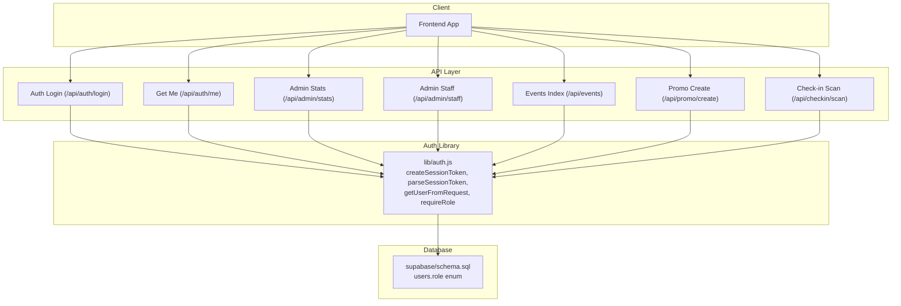
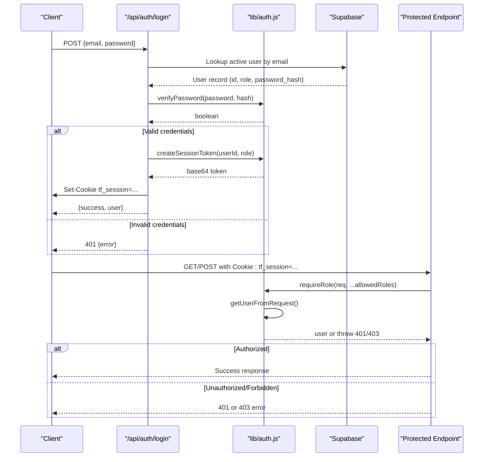
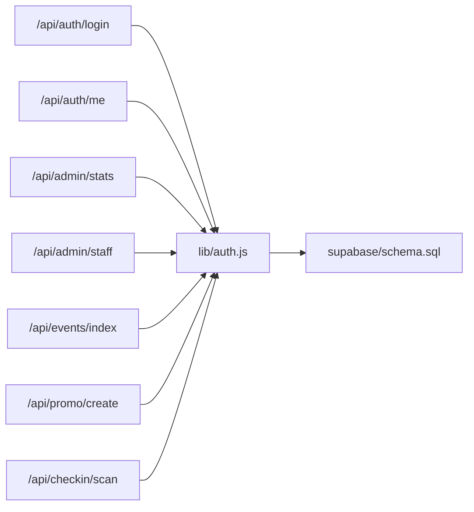

# Role-Based Access Control

<cite>
**Referenced Files in This Document**
- [auth.js](file://lib/auth.js)
- [login.js](file://pages/api/auth/login.js)
- [me.js](file://pages/api/auth/me.js)
- [scan.js](file://pages/api/checkin/scan.js)
- [stats.js](file://pages/api/admin/stats.js)
- [staff.js](file://pages/api/admin/staff.js)
- [events_index.js](file://pages/api/events/index.js)
- [promo_create.js](file://pages/api/promo/create.js)
- [schema.sql](file://supabase/schema.sql)
</cite>

## Table of Contents
1. [Introduction](#introduction)
2. [Project Structure](#project-structure)
3. [Core Components](#core-components)
4. [Architecture Overview](#architecture-overview)
5. [Detailed Component Analysis](#detailed-component-analysis)
6. [Dependency Analysis](#dependency-analysis)
7. [Performance Considerations](#performance-considerations)
8. [Troubleshooting Guide](#troubleshooting-guide)
9. [Conclusion](#conclusion)

## Introduction
This document explains TicketFlow’s three-tier role-based access control (RBAC) system and how it is enforced across API endpoints. The system defines three roles:
- super_admin: full system access
- organiser: event management and related operations
- gate_staff: check-in operations at events

The core authorization mechanism is the requireRole middleware function, which validates a user’s session token and enforces role-based permissions. It returns HTTP 401 for unauthenticated requests and HTTP 403 when a user lacks sufficient permissions. Roles are stored within a session cookie and validated on each request.

## Project Structure
TicketFlow implements RBAC primarily through:
- A shared authentication library that creates/parses session tokens and enforces role checks
- API routes that call requireRole to protect endpoints
- A database schema that constrains valid roles

**Diagram sources**
- [login.js:1-31](file://pages/api/auth/login.js#L1-L31)
- [me.js:1-19](file://pages/api/auth/me.js#L1-L19)
- [stats.js:1-41](file://pages/api/admin/stats.js#L1-L41)
- [staff.js:1-27](file://pages/api/admin/staff.js#L1-L27)
- [events_index.js:1-42](file://pages/api/events/index.js#L1-L42)
- [promo_create.js:1-23](file://pages/api/promo/create.js#L1-L23)
- [scan.js:1-44](file://pages/api/checkin/scan.js#L1-L44)
- [auth.js:1-47](file://lib/auth.js#L1-L47)
- [schema.sql:10-19](file://supabase/schema.sql#L10-L19)

**Section sources**
- [auth.js:1-47](file://lib/auth.js#L1-L47)
- [schema.sql:10-19](file://supabase/schema.sql#L10-L19)

## Core Components
- Session token creation and parsing:
  - createSessionToken generates a base64-encoded payload containing userId, role, and expiration time
  - parseSessionToken decodes and validates the token, returning null if expired or malformed
- Request user extraction:
  - getUserFromRequest reads the tf_session cookie from incoming requests and parses it into a user object
- Authorization middleware:
  - requireRole extracts the user, ensures authentication, and validates that the user’s role is included in the allowed list; throws with status 401 or 403 accordingly

Key behaviors:
- Unauthenticated requests receive HTTP 401
- Authenticated users without required roles receive HTTP 403
- Successful validation returns the user object with userId and role

**Section sources**
- [auth.js:14-46](file://lib/auth.js#L14-L46)

## Architecture Overview
The RBAC flow spans login, session propagation, and per-request authorization:

**Diagram sources**
- [login.js:1-31](file://pages/api/auth/login.js#L1-L31)
- [auth.js:14-46](file://lib/auth.js#L14-L46)
- [scan.js:1-44](file://pages/api/checkin/scan.js#L1-L44)

## Detailed Component Analysis

### Authentication and Session Management
- Login endpoint:
  - Validates credentials against the users table
  - On success, sets an HttpOnly cookie named tf_session with a base64-encoded token containing userId, role, and expiration
  - Returns user metadata including role for client-side UI decisions
- Get Me endpoint:
  - Reads the session cookie, validates it, and returns current user details from the database

Practical implications:
- Clients must include the cookie automatically on subsequent requests
- The role field in the token determines access to protected routes

**Section sources**
- [login.js:1-31](file://pages/api/auth/login.js#L1-L31)
- [me.js:1-19](file://pages/api/auth/me.js#L1-L19)
- [auth.js:14-28](file://lib/auth.js#L14-L28)

### Authorization Middleware: requireRole
- Extracts user from the request cookie
- If no user is found, throws with status 401
- If roles are specified and the user’s role is not included, throws with status 403
- Otherwise returns the user object

Error handling:
- Endpoints catch thrown errors and respond with the appropriate HTTP status code and message

Usage patterns:
- Protect admin-only endpoints with requireRole(req, 'super_admin')
- Protect event management endpoints with requireRole(req, 'super_admin', 'organiser')
- Protect check-in endpoints with requireRole(req, 'super_admin', 'organiser', 'gate_staff')

**Section sources**
- [auth.js:38-46](file://lib/auth.js#L38-L46)

### Role Hierarchy and Permissions
- super_admin: Full system access; can manage all resources and users
- organiser: Event-centric permissions; can create/manage events and promotions, view stats, and manage gate staff
- gate_staff: Operational permissions; limited to check-in scanning and related read-only operations

Evidence from endpoints:
- Admin stats: requires super_admin or organiser
- Admin staff: requires super_admin or organiser
- Events index (write): requires super_admin or organiser
- Promo create: requires super_admin or organiser
- Check-in scan: requires super_admin, organiser, or gate_staff

Role storage and validation:
- The users table enforces role values via a constraint
- The session token carries the role, which is validated on every request

**Section sources**
- [stats.js:1-41](file://pages/api/admin/stats.js#L1-L41)
- [staff.js:1-27](file://pages/api/admin/staff.js#L1-L27)
- [events_index.js:1-42](file://pages/api/events/index.js#L1-L42)
- [promo_create.js:1-23](file://pages/api/promo/create.js#L1-L23)
- [scan.js:1-44](file://pages/api/checkin/scan.js#L1-L44)
- [schema.sql:10-19](file://supabase/schema.sql#L10-L19)

### Practical Examples of Protected Routes

#### Example 1: Protecting an Admin-Only Route
- Import requireRole
- Call requireRole with allowed roles at the start of the handler
- Catch and return appropriate HTTP status codes

Implementation references:
- Admin stats endpoint demonstrates requiring super_admin or organiser

**Section sources**
- [stats.js:1-41](file://pages/api/admin/stats.js#L1-L41)

#### Example 2: Checking User Roles in API Endpoints
- After requireRole succeeds, use user.role or user.userId for further logic
- For example, filter data based on organiser_id for non-super_admin users

Implementation references:
- Admin stats filters events by organiser_id when the user is not a super_admin

**Section sources**
- [stats.js:7-13](file://pages/api/admin/stats.js#L7-L13)

#### Example 3: Handling Authorization Errors
- Catch blocks should map thrown errors to HTTP responses using err.status and err.message
- Ensure consistent error payloads for clients

Implementation references:
- Multiple endpoints follow this pattern to return 401 or 403

**Section sources**
- [staff.js:24-26](file://pages/api/admin/staff.js#L24-L26)
- [scan.js:40-43](file://pages/api/checkin/scan.js#L40-L43)

### Check-in Operations and Gate Staff Permissions
- The check-in scan endpoint allows super_admin, organiser, and gate_staff
- On successful authorization, the endpoint updates ticket status and records the check-in with staff_id

Security considerations:
- Only authenticated users with appropriate roles can mark tickets as checked in
- The staff_id is recorded for auditability

**Section sources**
- [scan.js:1-44](file://pages/api/checkin/scan.js#L1-L44)

## Dependency Analysis
The RBAC system has clear dependencies:
- API routes depend on lib/auth.js for session parsing and role enforcement
- The login endpoint depends on lib/auth.js for token creation
- The database schema constrains valid roles and supports RLS policies

**Diagram sources**
- [login.js:1-31](file://pages/api/auth/login.js#L1-L31)
- [me.js:1-19](file://pages/api/auth/me.js#L1-L19)
- [stats.js:1-41](file://pages/api/admin/stats.js#L1-L41)
- [staff.js:1-27](file://pages/api/admin/staff.js#L1-L27)
- [events_index.js:1-42](file://pages/api/events/index.js#L1-L42)
- [promo_create.js:1-23](file://pages/api/promo/create.js#L1-L23)
- [scan.js:1-44](file://pages/api/checkin/scan.js#L1-L44)
- [auth.js:1-47](file://lib/auth.js#L1-L47)
- [schema.sql:10-19](file://supabase/schema.sql#L10-L19)

**Section sources**
- [auth.js:1-47](file://lib/auth.js#L1-L47)
- [schema.sql:10-19](file://supabase/schema.sql#L10-L19)

## Performance Considerations
- Token parsing is lightweight (base64 decode and JSON parse), minimizing overhead per request
- Database queries are scoped by role where applicable (e.g., filtering events by organiser_id)
- Avoid unnecessary role checks by centralizing authorization in requireRole
- Keep cookies small and secure (HttpOnly, SameSite=Lax) to reduce bandwidth and improve security

[No sources needed since this section provides general guidance]

## Troubleshooting Guide
Common issues and resolutions:
- 401 Not authenticated:
  - Ensure the tf_session cookie is present and valid
  - Verify the token is not expired
  - Confirm the login endpoint successfully set the cookie
- 403 Insufficient permissions:
  - Check that the user’s role matches one of the allowed roles for the endpoint
  - Validate the users table role value is correct
- Error handling:
  - Ensure catch blocks return err.status and err.message consistently

References:
- requireRole throws structured errors with status and message
- Endpoints map these errors to HTTP responses

**Section sources**
- [auth.js:38-46](file://lib/auth.js#L38-L46)
- [staff.js:24-26](file://pages/api/admin/staff.js#L24-L26)
- [scan.js:40-43](file://pages/api/checkin/scan.js#L40-L43)

## Conclusion
TicketFlow’s RBAC system is implemented through a simple yet robust approach:
- Sessions are stored in HttpOnly cookies with embedded role information
- requireRole enforces authentication and authorization consistently across endpoints
- Roles are constrained at the database level and propagated securely in tokens
- Clear separation of responsibilities enables scalable permission management

By following the documented patterns—using requireRole, handling 401/403 errors, and respecting role constraints—you can implement secure, maintainable access controls across the application.

[No sources needed since this section summarizes without analyzing specific files]