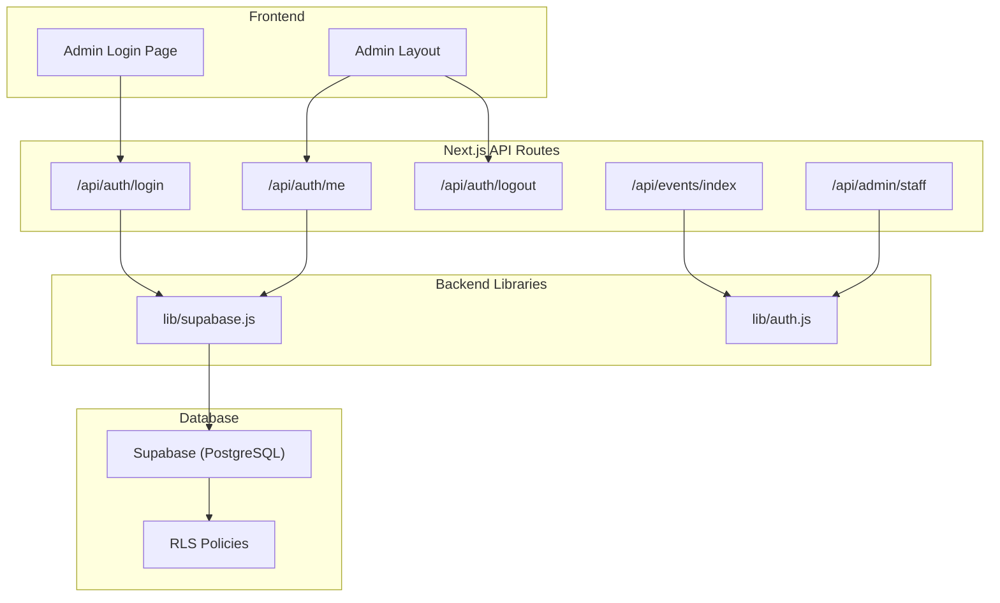
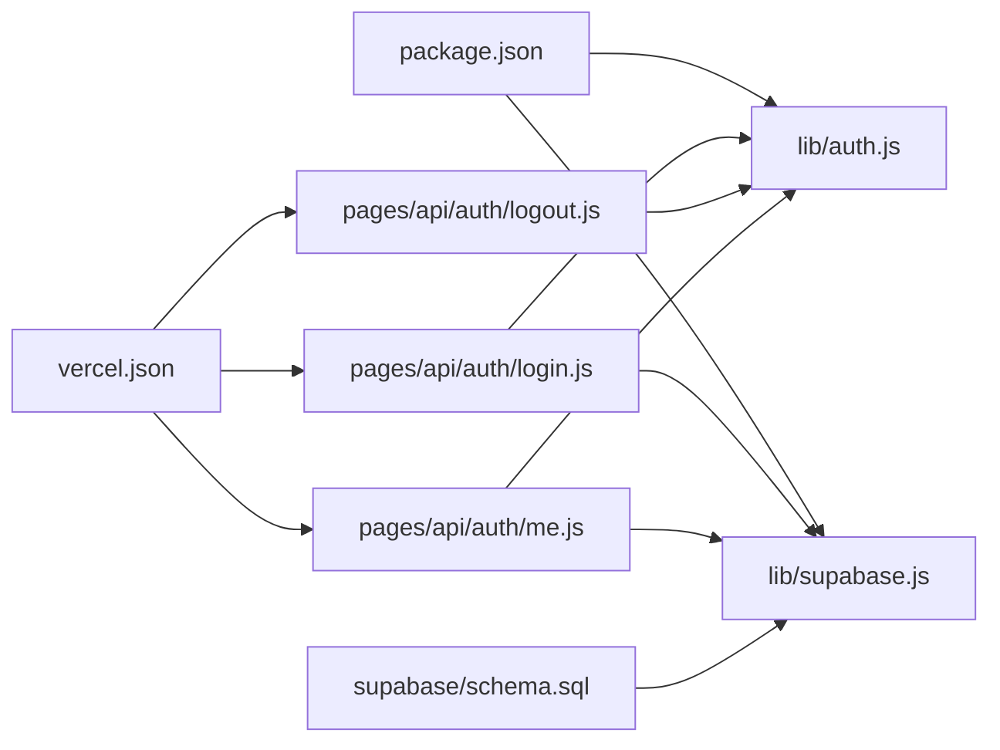
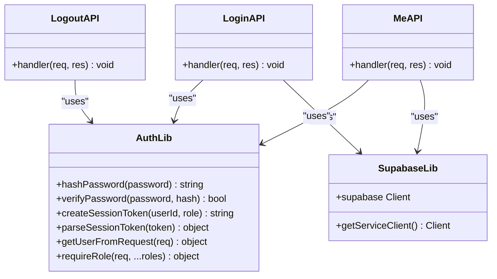
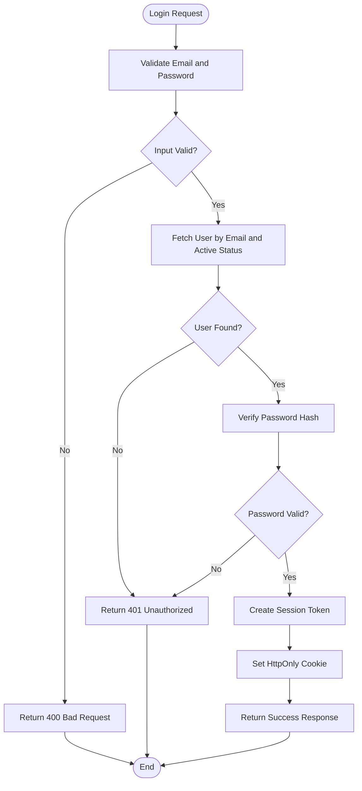

# Security Implementation

<cite>
**Referenced Files in This Document**
- [lib/auth.js](file://lib/auth.js)
- [lib/supabase.js](file://lib/supabase.js)
- [pages/api/auth/login.js](file://pages/api/auth/login.js)
- [pages/api/auth/logout.js](file://pages/api/auth/logout.js)
- [pages/api/auth/me.js](file://pages/api/auth/me.js)
- [supabase/schema.sql](file://supabase/schema.sql)
- [vercel.json](file://vercel.json)
- [package.json](file://package.json)
- [components/AdminLayout.js](file://components/AdminLayout.js)
</cite>

## Table of Contents
1. Introduction
2. Project Structure
3. Core Components
4. Architecture Overview
5. Detailed Component Analysis
6. Dependency Analysis
7. Performance Considerations
8. Troubleshooting Guide
9. Conclusion
10. Appendices

## Introduction
This document provides comprehensive security documentation for TicketFlow’s authentication and authorization implementation. It covers password hashing with bcryptjs, secure cookie configuration, XSS/CSRF protections, integration with Supabase Row Level Security (RLS), and guidance on rate limiting, brute force protection, audit logging, common vulnerabilities and mitigations, secure coding practices, and security testing strategies. The goal is to help developers understand current controls and identify areas for improvement to meet production-grade security standards.

## Project Structure
TicketFlow uses a Next.js API routes architecture with server-side authentication logic and Supabase as the data layer. Authentication flows are implemented via API endpoints that set HttpOnly cookies for session management. Authorization is enforced both at the application level (role checks) and at the database level (Supabase RLS policies).



**Diagram sources**
- [pages/api/auth/login.js:1-31](file://pages/api/auth/login.js#L1-L31)
- [pages/api/auth/logout.js:1-5](file://pages/api/auth/logout.js#L1-L5)
- [pages/api/auth/me.js:1-19](file://pages/api/auth/me.js#L1-L19)
- [lib/auth.js:1-47](file://lib/auth.js#L1-L47)
- [lib/supabase.js:1-23](file://lib/supabase.js#L1-L23)
- [supabase/schema.sql:120-142](file://supabase/schema.sql#L120-L142)

**Section sources**
- [pages/api/auth/login.js:1-31](file://pages/api/auth/login.js#L1-L31)
- [pages/api/auth/logout.js:1-5](file://pages/api/auth/logout.js#L1-L5)
- [pages/api/auth/me.js:1-19](file://pages/api/auth/me.js#L1-L19)
- [lib/auth.js:1-47](file://lib/auth.js#L1-L47)
- [lib/supabase.js:1-23](file://lib/supabase.js#L1-L23)
- [supabase/schema.sql:120-142](file://supabase/schema.sql#L120-L142)

## Core Components
- Password hashing and verification: Implemented using bcryptjs with salt rounds configured for secure hashing.
- Session token creation and parsing: Base64-encoded JSON payload with expiration; stored in an HttpOnly cookie.
- Role-based authorization: Middleware-like function enforces required roles for protected endpoints.
- Supabase client usage: Service role client used server-side for privileged operations.
- RLS policies: Database-level access control enabling fine-grained row visibility.

Key responsibilities:
- lib/auth.js: Hashing, verification, session token handling, role enforcement.
- lib/supabase.js: Client initialization and service role client factory.
- API routes: Authentication endpoints and protected resource handlers.
- schema.sql: RLS enablement and policies.

**Section sources**
- [lib/auth.js:1-47](file://lib/auth.js#L1-L47)
- [lib/supabase.js:1-23](file://lib/supabase.js#L1-L23)
- [pages/api/auth/login.js:1-31](file://pages/api/auth/login.js#L1-L31)
- [pages/api/auth/logout.js:1-5](file://pages/api/auth/logout.js#L1-L5)
- [pages/api/auth/me.js:1-19](file://pages/api/auth/me.js#L1-L19)
- [supabase/schema.sql:120-142](file://supabase/schema.sql#L120-L142)

## Architecture Overview
The authentication flow uses a custom session cookie approach:
- Login endpoint validates credentials against Supabase users table, verifies password hash, sets an HttpOnly cookie with a session token.
- Protected endpoints parse the cookie, validate expiration, and enforce role requirements.
- Supabase RLS policies provide additional database-level restrictions.

```mermaid
sequenceDiagram
participant Browser as "Browser"
participant AdminPage as "Admin Login Page"
participant LoginAPI as "/api/auth/login"
participant AuthLib as "lib/auth.js"
participant SupabaseLib as "lib/supabase.js"
participant DB as "Supabase (users)"
Browser->>AdminPage : Submit email/password
AdminPage->>LoginAPI : POST /api/auth/login {email, password}
LoginAPI->>SupabaseLib : Query user by email + active flag
SupabaseLib-->>LoginAPI : User record
LoginAPI->>AuthLib : verifyPassword(password, password_hash)
AuthLib-->>LoginAPI : boolean result
alt Valid credentials
LoginAPI->>AuthLib : createSessionToken(userId, role)
AuthLib-->>LoginAPI : base64 token
LoginAPI-->>Browser : Set-Cookie tf_session=...; HttpOnly; SameSite=Lax; Max-Age=...
LoginAPI-->>Browser : {success, user}
else Invalid credentials
LoginAPI-->>Browser : {error}
end
```

**Diagram sources**
- [pages/api/auth/login.js:1-31](file://pages/api/auth/login.js#L1-L31)
- [lib/auth.js:1-47](file://lib/auth.js#L1-L47)
- [lib/supabase.js:1-23](file://lib/supabase.js#L1-L23)
- [supabase/schema.sql:1-19](file://supabase/schema.sql#L1-L19)

## Detailed Component Analysis

### Password Security with bcryptjs
- Salt rounds: Configured to a secure value suitable for modern hardware.
- Hashing: Used when creating or updating user passwords.
- Verification: Used during login to compare provided password against stored hash.

Recommendations:
- Ensure consistent use of the same salt rounds across all hashing operations.
- Avoid logging or exposing hashes.
- Rotate secrets and monitor performance impacts as rounds increase.

**Section sources**
- [lib/auth.js:1-12](file://lib/auth.js#L1-L12)
- [package.json:1-24](file://package.json#L1-L24)

### Secure Cookie Configuration
- HttpOnly flag: Prevents JavaScript access to the session cookie, mitigating XSS theft.
- SameSite attribute: Set to Lax to reduce CSRF risk while allowing top-level navigations.
- Max-Age: Defines session lifetime; ensure it aligns with security policy.
- Missing Secure flag: Not present in current implementation; consider enabling HTTPS-only delivery in production.

Logout behavior:
- Clears the session cookie by setting Max-Age to zero.

**Section sources**
- [pages/api/auth/login.js:1-31](file://pages/api/auth/login.js#L1-L31)
- [pages/api/auth/logout.js:1-5](file://pages/api/auth/logout.js#L1-L5)

### XSS and CSRF Protection Measures
- HTTP security headers: X-Content-Type-Options, X-Frame-Options, X-XSS-Protection applied to API routes via Vercel configuration.
- Content-Type validation: API routes should enforce strict content types and input validation.
- CSRF mitigation: Using HttpOnly cookies reduces exposure; adding SameSite helps. For sensitive state-changing requests, consider additional CSRF tokens if cross-site requests are expected.

**Section sources**
- [vercel.json:1-17](file://vercel.json#L1-L17)
- [pages/api/auth/login.js:1-31](file://pages/api/auth/login.js#L1-L31)

### Integration with Supabase Row Level Security (RLS)
- RLS enabled across tables to restrict row-level access based on policies.
- Public read policies allow viewing published events and related ticket types.
- Service role client bypasses RLS for server-side operations; ensure only trusted server code uses it.

Complementary authorization:
- Application-level role checks enforce business logic permissions.
- RLS policies act as a final safeguard at the database layer.

**Section sources**
- [supabase/schema.sql:120-142](file://supabase/schema.sql#L120-L142)
- [lib/supabase.js:1-23](file://lib/supabase.js#L1-L23)

### Rate Limiting and Brute Force Protection
Current status:
- No explicit rate limiting or brute force protection is implemented in the authentication endpoints.

Recommended measures:
- Implement per-IP and per-email rate limiting on login attempts.
- Introduce exponential backoff and account lockout after repeated failures.
- Use a centralized rate limiter (e.g., Redis-backed) for distributed deployments.
- Monitor and alert on anomalous login patterns.

[No sources needed since this section provides general guidance]

### Audit Logging for Security Events
Current status:
- Basic error logging exists in API routes; no dedicated audit trail for auth events.

Recommended measures:
- Log successful and failed login attempts with timestamps, IP addresses, and user identifiers (where appropriate).
- Store logs securely with retention policies and integrity checks.
- Separate operational logs from sensitive payloads; avoid logging secrets or full credentials.

[No sources needed since this section provides general guidance]

### Common Vulnerabilities and Mitigations
- Insecure session storage: Current session token is base64-encoded without cryptographic signing. Recommendation: Sign and optionally encrypt tokens or use a mature auth provider.
- Missing Secure cookie flag: Add Secure flag to enforce HTTPS-only transmission.
- Lack of CSRF tokens: Consider implementing CSRF tokens for sensitive actions if cross-site requests are necessary.
- Overprivileged service role usage: Restrict service role usage to minimal necessary operations and scope queries carefully.
- Insufficient input validation: Enforce strict schemas and sanitize inputs before processing.

[No sources needed since this section provides general guidance]

### Secure Coding Practices for Authentication Flows
- Validate and normalize inputs (e.g., lowercase and trim emails).
- Use constant-time comparisons where applicable (bcrypt handles this internally).
- Avoid returning detailed error messages that leak information about valid users.
- Centralize authorization checks with reusable middleware functions.
- Keep dependencies updated and monitor for known vulnerabilities.

**Section sources**
- [pages/api/auth/login.js:1-31](file://pages/api/auth/login.js#L1-L31)
- [pages/api/admin/staff.js:1-28](file://pages/api/admin/staff.js#L1-L28)

### Security Testing Strategies
- Unit tests for password hashing and verification functions.
- Integration tests for API endpoints covering success and failure paths.
- Security-focused tests:
  - Verify HttpOnly and SameSite flags on cookies.
  - Validate HTTP security headers.
  - Test RLS policies with different roles and scenarios.
  - Simulate brute force attacks to confirm rate limiting behavior.
- Penetration testing: Focus on authentication bypass, privilege escalation, and injection flaws.

[No sources needed since this section provides general guidance]

## Dependency Analysis
Authentication and authorization depend on:
- bcryptjs for password hashing.
- Supabase client for database interactions.
- Next.js API routes for request handling.
- Vercel configuration for HTTP headers.



**Diagram sources**
- [package.json:1-24](file://package.json#L1-L24)
- [lib/auth.js:1-47](file://lib/auth.js#L1-L47)
- [lib/supabase.js:1-23](file://lib/supabase.js#L1-L23)
- [pages/api/auth/login.js:1-31](file://pages/api/auth/login.js#L1-L31)
- [pages/api/auth/logout.js:1-5](file://pages/api/auth/logout.js#L1-L5)
- [pages/api/auth/me.js:1-19](file://pages/api/auth/me.js#L1-L19)
- [supabase/schema.sql:120-142](file://supabase/schema.sql#L120-L142)
- [vercel.json:1-17](file://vercel.json#L1-L17)

**Section sources**
- [package.json:1-24](file://package.json#L1-L24)
- [lib/auth.js:1-47](file://lib/auth.js#L1-L47)
- [lib/supabase.js:1-23](file://lib/supabase.js#L1-L23)
- [pages/api/auth/login.js:1-31](file://pages/api/auth/login.js#L1-L31)
- [pages/api/auth/logout.js:1-5](file://pages/api/auth/logout.js#L1-L5)
- [pages/api/auth/me.js:1-19](file://pages/api/auth/me.js#L1-L19)
- [supabase/schema.sql:120-142](file://supabase/schema.sql#L120-L142)
- [vercel.json:1-17](file://vercel.json#L1-L17)

## Performance Considerations
- Password hashing cost: Adjust bcrypt salt rounds based on server capacity and latency targets.
- Database queries: Ensure proper indexing and query optimization for user lookups and event listings.
- Cookie parsing: Minimal overhead; ensure efficient parsing in high-throughput environments.
- Rate limiting: Choose scalable backends (e.g., Redis) to handle concurrent requests.

[No sources needed since this section provides general guidance]

## Troubleshooting Guide
Common issues and resolutions:
- Invalid credentials errors:
  - Verify email normalization and active status checks.
  - Confirm password hash matches the stored value.
- Session not recognized:
  - Check cookie presence, expiration, and parsing logic.
  - Ensure HttpOnly and SameSite flags are correctly set.
- RLS policy violations:
  - Review policies for the specific table and operation.
  - Validate service role usage and query scoping.
- Missing environment variables:
  - Ensure Supabase URL and keys are configured.
  - Verify service role key availability for server-side operations.

**Section sources**
- [pages/api/auth/login.js:1-31](file://pages/api/auth/login.js#L1-L31)
- [lib/auth.js:1-47](file://lib/auth.js#L1-L47)
- [lib/supabase.js:1-23](file://lib/supabase.js#L1-L23)
- [supabase/schema.sql:120-142](file://supabase/schema.sql#L120-L142)

## Conclusion
TicketFlow implements foundational authentication and authorization controls using bcryptjs for password hashing, HttpOnly cookies for session management, and Supabase RLS for database-level access control. While these measures provide a solid baseline, enhancements such as signed/encrypted sessions, Secure cookie flags, rate limiting, brute force protection, and comprehensive audit logging are recommended to achieve production-grade security. Continuous testing and monitoring will further strengthen the system’s resilience against threats.

[No sources needed since this section summarizes without analyzing specific files]

## Appendices

### Class Diagram: Authentication Utilities


**Diagram sources**
- [lib/auth.js:1-47](file://lib/auth.js#L1-L47)
- [lib/supabase.js:1-23](file://lib/supabase.js#L1-L23)
- [pages/api/auth/login.js:1-31](file://pages/api/auth/login.js#L1-L31)
- [pages/api/auth/logout.js:1-5](file://pages/api/auth/logout.js#L1-L5)
- [pages/api/auth/me.js:1-19](file://pages/api/auth/me.js#L1-L19)

### Flowchart: Login Process


**Diagram sources**
- [pages/api/auth/login.js:1-31](file://pages/api/auth/login.js#L1-L31)
- [lib/auth.js:1-47](file://lib/auth.js#L1-L47)
- [lib/supabase.js:1-23](file://lib/supabase.js#L1-L23)