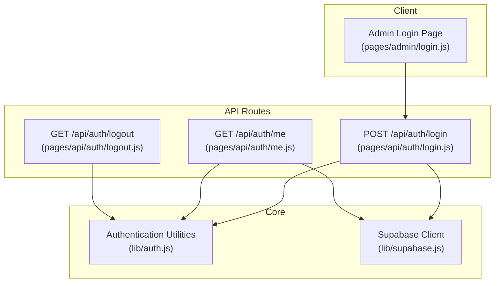
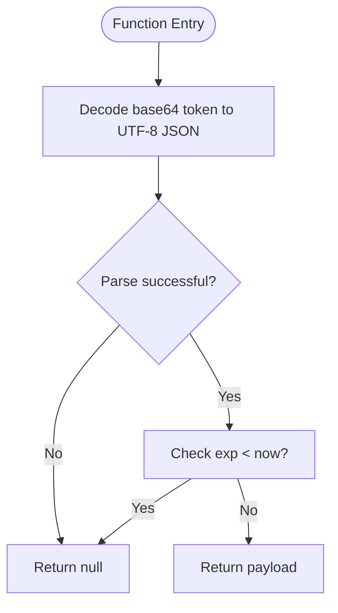
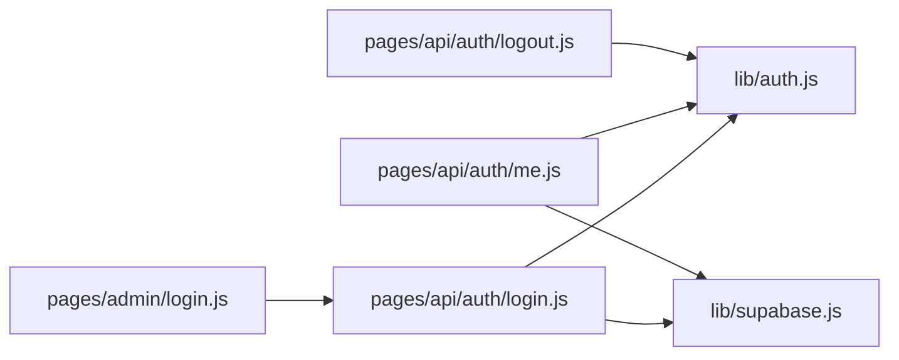

# Session Management

<cite>
**Referenced Files in This Document**
- [lib/auth.js](file://lib/auth.js)
- [pages/api/auth/login.js](file://pages/api/auth/login.js)
- [pages/api/auth/logout.js](file://pages/api/auth/logout.js)
- [pages/api/auth/me.js](file://pages/api/auth/me.js)
- [lib/supabase.js](file://lib/supabase.js)
- [pages/admin/login.js](file://pages/admin/login.js)
</cite>

## Table of Contents
1. Introduction
2. Project Structure
3. Core Components
4. Architecture Overview
5. Detailed Component Analysis
6. Dependency Analysis
7. Performance Considerations
8. Troubleshooting Guide
9. Conclusion
10. Appendices

## Introduction
This document explains TicketFlow’s custom session management system. It focuses on how sessions are represented as base64-encoded JSON payloads, how cookies are set and parsed, and how protected endpoints validate user identity and roles. You will learn how the login flow creates a session cookie, how the me endpoint returns current user information, and how to extend session data, implement token refresh, and handle expiration gracefully. Security best practices for cookie configuration, token storage, and validation are included.

## Project Structure
The session system is implemented across a small set of focused files:
- Authentication utilities and helpers live in lib/auth.js.
- API routes for authentication live under pages/api/auth/.
- Supabase client setup lives in lib/supabase.js.
- The admin login page triggers the authentication flow.



**Diagram sources**
- [pages/admin/login.js](file://pages/admin/login.js)
- [pages/api/auth/login.js](file://pages/api/auth/login.js)
- [pages/api/auth/logout.js](file://pages/api/auth/logout.js)
- [pages/api/auth/me.js](file://pages/api/auth/me.js)
- [lib/auth.js](file://lib/auth.js)
- [lib/supabase.js](file://lib/supabase.js)

**Section sources**
- [lib/auth.js](file://lib/auth.js)
- [pages/api/auth/login.js](file://pages/api/auth/login.js)
- [pages/api/auth/logout.js](file://pages/api/auth/logout.js)
- [pages/api/auth/me.js](file://pages/api/auth/me.js)
- [lib/supabase.js](file://lib/supabase.js)
- [pages/admin/login.js](file://pages/admin/login.js)

## Core Components
- createSessionToken(userId, role): Encodes a JSON payload containing userId, role, and an expiration timestamp into a base64 string.
- parseSessionToken(token): Decodes and validates the token payload, returning null if expired or malformed.
- getUserFromRequest(req): Extracts the tf_session cookie from the request, decodes it, and parses the token.
- requireRole(req, ...roles): Middleware-like helper that enforces authentication and role checks; throws with appropriate HTTP status codes.

These functions provide the foundation for creating, validating, and consuming sessions across API routes.

**Section sources**
- [lib/auth.js](file://lib/auth.js)

## Architecture Overview
The session lifecycle spans three main flows:
- Login: Authenticates credentials, sets a secure HttpOnly cookie with the session token, and returns minimal user info.
- Me: Reads the cookie, validates the session, and fetches full user details from the database.
- Logout: Clears the session cookie.

```mermaid
sequenceDiagram
participant Client as "Admin Login Page"
participant LoginAPI as "/api/auth/login"
participant AuthLib as "lib/auth.js"
participant Supabase as "Supabase Client"
participant Browser as "Browser Cookie Store"
Client->>LoginAPI : POST {email, password}
LoginAPI->>Supabase : Query user by email + active flag
Supabase-->>LoginAPI : User record
LoginAPI->>AuthLib : verifyPassword(password, hash)
AuthLib-->>LoginAPI : boolean
LoginAPI->>AuthLib : createSessionToken(userId, role)
AuthLib-->>LoginAPI : base64(JSON{userId,role,exp})
LoginAPI->>Browser : Set-Cookie tf_session=... (HttpOnly, SameSite=Lax, Max-Age=7d)
LoginAPI-->>Client : {success, user}
Client->>LoginAPI : GET /api/auth/me
LoginAPI->>AuthLib : getUserFromRequest(req)
AuthLib-->>LoginAPI : session or null
alt session exists
LoginAPI->>Supabase : Select user by id
Supabase-->>LoginAPI : user object
LoginAPI-->>Client : {user}
else no session
LoginAPI-->>Client : {user : null} 401
end
Client->>LoginAPI : GET /api/auth/logout
LoginAPI->>Browser : Set-Cookie tf_session=; Max-Age=0
LoginAPI-->>Client : {success : true}
```

**Diagram sources**
- [pages/api/auth/login.js](file://pages/api/auth/login.js)
- [pages/api/auth/me.js](file://pages/api/auth/me.js)
- [pages/api/auth/logout.js](file://pages/api/auth/logout.js)
- [lib/auth.js](file://lib/auth.js)
- [lib/supabase.js](file://lib/supabase.js)

## Detailed Component Analysis

### Custom Session Token Implementation
- Payload structure: A JSON object containing userId, role, and exp (expiration timestamp).
- Encoding: Base64 encoding of the JSON string.
- Expiration: Calculated as current time plus seven days.
- Validation: parseSessionToken decodes and checks expiration; returns null on invalid/expired tokens.

Security considerations:
- Tokens are stored in HttpOnly cookies to prevent JavaScript access.
- Cookies use SameSite=Lax and Path=/ to limit exposure and scope.
- No cryptographic signature is applied; treat tokens as opaque identifiers and avoid trusting client-side modifications.

Extending session data:
- Add fields to the payload in createSessionToken (e.g., tenantId, permissions).
- Ensure parseSessionToken remains resilient to unknown fields.
- Update any downstream logic that consumes session data accordingly.

Token refresh mechanism:
- Implement a dedicated endpoint (e.g., /api/auth/refresh) that accepts the existing tf_session cookie, verifies it via parseSessionToken, and issues a new cookie with an updated expiration.
- Optionally rotate the token value on refresh to mitigate replay risks.

Graceful expiration handling:
- Clients should check the response of /api/auth/me; if user is null, redirect to login.
- On 401 responses from protected endpoints, prompt re-authentication or call the refresh endpoint before retrying.

**Section sources**
- [lib/auth.js](file://lib/auth.js)

### getUserFromRequest Function
Purpose:
- Extracts the tf_session cookie from req.headers.cookie using a regular expression.
- Decodes the cookie value and passes it to parseSessionToken.
- Returns the parsed session payload or null if missing/invalid.

Behavior highlights:
- Safe fallback when cookie header is absent.
- URL-decoding ensures compatibility with encoded cookie values.
- Delegates all parsing/validation to parseSessionToken.

Usage:
- Called by /api/auth/me to determine current user context.
- Used internally by requireRole to enforce authentication and authorization.

**Section sources**
- [lib/auth.js](file://lib/auth.js)

### parseSessionToken Function
Purpose:
- Decodes the base64 token to JSON.
- Validates expiration against current time.
- Returns the payload if valid; otherwise returns null.

Error handling:
- Catches decoding or parsing errors and returns null.
- Ensures robustness against malformed or tampered tokens.

Validation flow:


**Diagram sources**
- [lib/auth.js](file://lib/auth.js)

**Section sources**
- [lib/auth.js](file://lib/auth.js)

### me Endpoint (/api/auth/me)
Responsibilities:
- Retrieves the session via getUserFromRequest.
- If no session, responds with 401 and { user: null }.
- Otherwise, queries the users table for the full profile and returns it.

Data returned:
- A user object containing id, email, full_name, role, phone.

Error handling:
- Database errors result in a 500 response with { user: null }.

Client guidance:
- Treat { user: null } as unauthenticated; redirect to login or trigger refresh.

**Section sources**
- [pages/api/auth/me.js](file://pages/api/auth/me.js)
- [lib/auth.js](file://lib/auth.js)
- [lib/supabase.js](file://lib/supabase.js)

### Login Flow (/api/auth/login)
Responsibilities:
- Accepts email and password.
- Validates credentials against the users table and password hash.
- Creates a session token and sets the tf_session cookie.
- Returns minimal user info.

Cookie configuration:
- Name: tf_session
- Attributes: Path=/, HttpOnly, SameSite=Lax, Max-Age=7 days
- Value: URL-encoded base64 token

Security notes:
- Password verification uses bcrypt.
- Only active users can authenticate.
- Avoid logging sensitive data.

**Section sources**
- [pages/api/auth/login.js](file://pages/api/auth/login.js)
- [lib/auth.js](file://lib/auth.js)
- [lib/supabase.js](file://lib/supabase.js)

### Logout Flow (/api/auth/logout)
Responsibilities:
- Clears the tf_session cookie by setting Max-Age=0.
- Responds with success.

Best practices:
- Always clear cookies server-side during logout.
- Invalidate server-side sessions if you maintain one (not used here).

**Section sources**
- [pages/api/auth/logout.js](file://pages/api/auth/logout.js)

### Role Enforcement (requireRole)
Responsibilities:
- Calls getUserFromRequest to obtain the session.
- Throws a 401 error if not authenticated.
- Throws a 403 error if the user lacks required roles.
- Returns the user object on success.

Usage pattern:
- Wrap protected endpoints with requireRole to ensure only authorized users proceed.

Example usage:
- Admin endpoints like attendees, stats, events, and checkin scan use requireRole to restrict access.

**Section sources**
- [lib/auth.js](file://lib/auth.js)

## Dependency Analysis
The session system has clear dependencies:
- API routes depend on lib/auth.js for token creation/parsing and role enforcement.
- Authentication endpoints depend on lib/supabase.js for database access.
- The client (admin login page) interacts with the login API and relies on browser cookies for subsequent requests.



**Diagram sources**
- [pages/admin/login.js](file://pages/admin/login.js)
- [pages/api/auth/login.js](file://pages/api/auth/login.js)
- [pages/api/auth/me.js](file://pages/api/auth/me.js)
- [pages/api/auth/logout.js](file://pages/api/auth/logout.js)
- [lib/auth.js](file://lib/auth.js)
- [lib/supabase.js](file://lib/supabase.js)

**Section sources**
- [lib/auth.js](file://lib/auth.js)
- [lib/supabase.js](file://lib/supabase.js)
- [pages/api/auth/login.js](file://pages/api/auth/login.js)
- [pages/api/auth/me.js](file://pages/api/auth/me.js)
- [pages/api/auth/logout.js](file://pages/api/auth/logout.js)
- [pages/admin/login.js](file://pages/admin/login.js)

## Performance Considerations
- Token parsing is lightweight: base64 decode and JSON parse operations are fast and suitable for every request.
- Database queries in /api/auth/me are minimal and indexed by user id; ensure proper indexing on the users table.
- Avoid heavy computations in middleware; keep requireRole synchronous and simple.
- Consider caching frequently accessed user profiles if read-heavy workloads emerge.

[No sources needed since this section provides general guidance]

## Troubleshooting Guide
Common issues and resolutions:
- Missing or invalid session:
  - Verify the tf_session cookie is present and not expired.
  - Ensure parseSessionToken returns a valid payload.
- 401 Unauthorized on protected endpoints:
  - Confirm getUserFromRequest extracts the cookie correctly.
  - Check that the client sends cookies with requests (same origin or proper CORS settings).
- 403 Forbidden:
  - Validate that the user’s role matches the required roles in requireRole.
- Logout not working:
  - Ensure the logout endpoint clears the cookie with Max-Age=0.
  - Confirm the client does not reuse stale state after logout.

Operational tips:
- Log detailed errors in development but sanitize logs in production.
- Use consistent error shapes across endpoints for predictable client handling.

**Section sources**
- [lib/auth.js](file://lib/auth.js)
- [pages/api/auth/me.js](file://pages/api/auth/me.js)
- [pages/api/auth/login.js](file://pages/api/auth/login.js)
- [pages/api/auth/logout.js](file://pages/api/auth/logout.js)

## Conclusion
TicketFlow’s session management uses a simple, effective approach: base64-encoded JSON tokens stored in HttpOnly cookies, validated server-side, and enforced through a role-based middleware. The login flow sets the session cookie, the me endpoint retrieves current user details, and logout clears the cookie. Extensibility is straightforward—add fields to the token payload, implement a refresh endpoint, and handle expiration gracefully on the client. For production, consider adding cryptographic signing and rotation to strengthen security.

[No sources needed since this section summarizes without analyzing specific files]

## Appendices

### Security Best Practices
Cookie configuration:
- Use HttpOnly to prevent JavaScript access.
- Set SameSite=Lax or Strict to mitigate CSRF.
- Restrict Path=/ and consider Secure flag for HTTPS-only environments.
- Set appropriate Max-Age based on risk tolerance.

Token storage:
- Never store tokens in localStorage or sessionStorage.
- Keep tokens server-managed via cookies.

Session validation:
- Always validate expiration and integrity server-side.
- Reject malformed tokens immediately.
- Rotate tokens on privilege changes or refresh.

Additional recommendations:
- Add cryptographic signatures to tokens to detect tampering.
- Implement rate limiting on login and refresh endpoints.
- Monitor failed authentication attempts and enforce lockouts.

[No sources needed since this section provides general guidance]