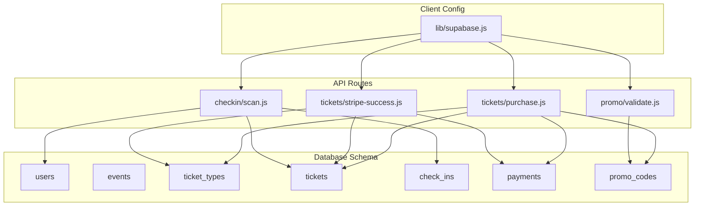
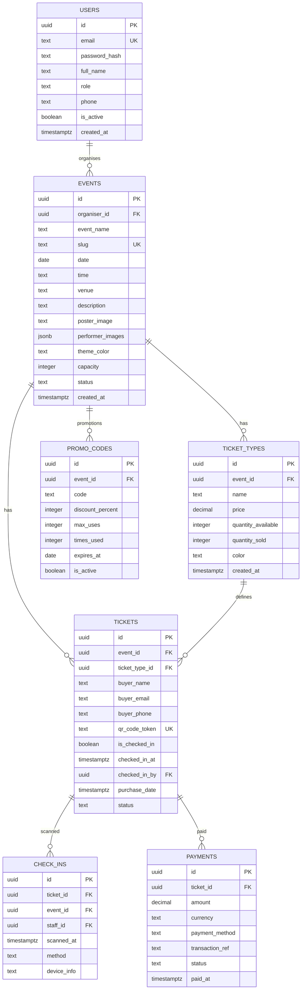
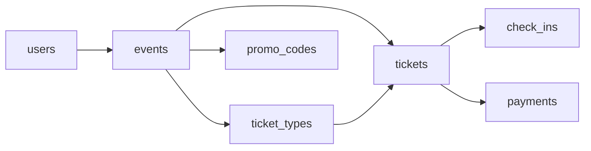

# Core Entities & Tables

<cite>
**Referenced Files in This Document**
- [schema.sql](file://supabase/schema.sql)
- [purchase.js](file://pages/api/tickets/purchase.js)
- [stripe-success.js](file://pages/api/tickets/stripe-success.js)
- [scan.js](file://pages/api/checkin/scan.js)
- [validate.js](file://pages/api/promo/validate.js)
- [supabase.js](file://lib/supabase.js)
</cite>

## Table of Contents
1. [Introduction](#introduction)
2. [Project Structure](#project-structure)
3. [Core Components](#core-components)
4. [Architecture Overview](#architecture-overview)
5. [Detailed Component Analysis](#detailed-component-analysis)
6. [Dependency Analysis](#dependency-analysis)
7. [Performance Considerations](#performance-considerations)
8. [Troubleshooting Guide](#troubleshooting-guide)
9. [Conclusion](#conclusion)
10. [Appendices](#appendices)

## Introduction
This document provides a comprehensive data model for TicketFlow’s core database entities. It details the seven main tables: users, events, ticket_types, tickets, check_ins, payments, and promo_codes. For each entity, we describe field definitions, data types, constraints, business rules, and how they represent real-world concepts in the ticketing workflow. We also explain the UUID primary key strategy, timestamp fields, default values, validation rules, and provide sample data examples to illustrate usage.

## Project Structure
The database schema is defined in a single SQL file under the Supabase directory. The application interacts with these entities through API routes that perform purchases, validate promo codes, and process check-ins. A shared client configuration initializes both public and service-role clients for secure server-side operations.

**Diagram sources**
- [schema.sql](file://supabase/schema.sql)
- [purchase.js](file://pages/api/tickets/purchase.js)
- [stripe-success.js](file://pages/api/tickets/stripe-success.js)
- [scan.js](file://pages/api/checkin/scan.js)
- [validate.js](file://pages/api/promo/validate.js)
- [supabase.js](file://lib/supabase.js)

**Section sources**
- [schema.sql](file://supabase/schema.sql)
- [purchase.js](file://pages/api/tickets/purchase.js)
- [stripe-success.js](file://pages/api/tickets/stripe-success.js)
- [scan.js](file://pages/api/checkin/scan.js)
- [validate.js](file://pages/api/promo/validate.js)
- [supabase.js](file://lib/supabase.js)

## Core Components
TicketFlow’s data model centers around seven entities that together support event creation, ticket type management, purchase flows, payment recording, promotional discounts, and gate check-in tracking. Each table uses UUIDs as primary keys and timestamps for auditability. Constraints enforce valid states and relationships across entities.

Key aspects:
- UUID primary keys generated via uuid_generate_v4()
- TIMESTAMPTZ fields for created_at, purchase_date, scanned_at, paid_at, checked_in_at
- CHECK constraints for enumerated statuses and methods
- Foreign key references with ON DELETE behaviors (CASCADE or SET NULL)
- Indexes on frequently queried columns (e.g., slug, qr_code_token, buyer_email)

**Section sources**
- [schema.sql](file://supabase/schema.sql)

## Architecture Overview
The data model supports a clear lifecycle:
- Organizers create events and define ticket types.
- Buyers purchase tickets; payments are recorded and tickets issued with unique QR tokens.
- Promo codes can reduce prices during purchase.
- Gate staff scan tickets at entry, creating check-in records and updating ticket status.

**Diagram sources**
- [schema.sql](file://supabase/schema.sql)

## Detailed Component Analysis

### Users
Purpose: Represents system participants including super admins, organizers, and gate staff. Roles control access and permissions.

Fields and constraints:
- id: UUID primary key, auto-generated
- email: TEXT UNIQUE NOT NULL
- password_hash: TEXT NOT NULL
- full_name: TEXT NOT NULL
- role: TEXT NOT NULL with allowed values: super_admin, organiser, gate_staff
- phone: TEXT (optional)
- is_active: BOOLEAN DEFAULT TRUE
- created_at: TIMESTAMPTZ DEFAULT NOW()

Business rules:
- Role must be one of the allowed values.
- Email uniqueness enforced.
- Default active status.

Sample data example:
- id: "a1b2c3d4-e5f6-7890-abcd-ef1234567890"
- email: "admin@tiketflow.com"
- password_hash: "$2a$12$LQv3c1yqBWVHxkd0LHAkCOYz6TtxMQyCg8bKSwAuGr3YFP3B7l0kq"
- full_name: "Super Admin"
- role: "super_admin"
- phone: "+1234567890"
- is_active: true
- created_at: "2024-01-01T12:00:00Z"

Validation rules:
- Role restricted by CHECK constraint.
- Email must be unique.

Default values:
- is_active defaults to TRUE.
- created_at defaults to current timestamp.

Usage in workflow:
- Organizer creates events.
- Gate staff scan tickets and are recorded in check_ins.

**Section sources**
- [schema.sql](file://supabase/schema.sql)

### Events
Purpose: Represents an event with metadata such as name, date, venue, and status. Supports public visibility when published.

Fields and constraints:
- id: UUID PRIMARY KEY DEFAULT uuid_generate_v4()
- organiser_id: UUID REFERENCES users(id) ON DELETE SET NULL
- event_name: TEXT NOT NULL
- slug: TEXT UNIQUE NOT NULL
- date: DATE NOT NULL
- time: TEXT (optional)
- venue: TEXT NOT NULL
- description: TEXT (optional)
- poster_image: TEXT (optional)
- performer_images: JSONB DEFAULT '[]'
- theme_color: TEXT DEFAULT '#e94560'
- capacity: INTEGER DEFAULT 0
- status: TEXT NOT NULL DEFAULT 'draft' with allowed values: draft, published, sold_out, completed, cancelled
- created_at: TIMESTAMPTZ DEFAULT NOW()

Business rules:
- Slug uniqueness enforced.
- Status constrained to predefined values.
- Public read policy allows selecting only published events.

Sample data example:
- id: "e1a2b3c4-d5e6-f789-abcd-ef1234567890"
- organiser_id: "a1b2c3d4-e5f6-7890-abcd-ef1234567890"
- event_name: "Rock Festival"
- slug: "rock-festival-2024"
- date: "2024-06-15"
- time: "18:00"
- venue: "City Arena"
- description: "Annual rock music festival"
- poster_image: "https://example.com/poster.jpg"
- performer_images: ["https://example.com/performer1.jpg", "https://example.com/performer2.jpg"]
- theme_color: "#e94560"
- capacity: 5000
- status: "published"
- created_at: "2024-01-10T09:00:00Z"

Validation rules:
- Status restricted by CHECK constraint.
- Slug must be unique.

Default values:
- status defaults to 'draft'.
- performer_images defaults to empty array.
- theme_color defaults to '#e94560'.
- created_at defaults to current timestamp.

Usage in workflow:
- Defines available ticket types and controls public visibility.

**Section sources**
- [schema.sql](file://supabase/schema.sql)

### Ticket Types
Purpose: Defines pricing and availability for different admission categories per event.

Fields and constraints:
- id: UUID PRIMARY KEY DEFAULT uuid_generate_v4()
- event_id: UUID NOT NULL REFERENCES events(id) ON DELETE CASCADE
- name: TEXT NOT NULL
- price: DECIMAL(10,2) NOT NULL DEFAULT 0
- quantity_available: INTEGER NOT NULL DEFAULT 0
- quantity_sold: INTEGER NOT NULL DEFAULT 0
- color: TEXT DEFAULT '#e94560'
- created_at: TIMESTAMPTZ DEFAULT NOW()

Business rules:
- Availability tracked via quantity_available and quantity_sold.
- Price stored with two decimal precision.

Sample data example:
- id: "t1a2b3c4-d5e6-f789-abcd-ef1234567890"
- event_id: "e1a2b3c4-d5e6-f789-abcd-ef1234567890"
- name: "General Admission"
- price: 50.00
- quantity_available: 1000
- quantity_sold: 0
- color: "#e94560"
- created_at: "2024-01-10T09:00:00Z"

Validation rules:
- None beyond NOT NULL and numeric precision.

Default values:
- price defaults to 0.
- quantity_available and quantity_sold default to 0.
- color defaults to '#e94560'.
- created_at defaults to current timestamp.

Usage in workflow:
- Used during purchase to calculate unit price and update quantity_sold.

**Section sources**
- [schema.sql](file://supabase/schema.sql)
- [purchase.js](file://pages/api/tickets/purchase.js)
- [stripe-success.js](file://pages/api/tickets/stripe-success.js)

### Tickets
Purpose: Represents individual admissions purchased by buyers, with QR token for entry and status tracking.

Fields and constraints:
- id: UUID PRIMARY KEY DEFAULT uuid_generate_v4()
- event_id: UUID NOT NULL REFERENCES events(id) ON DELETE CASCADE
- ticket_type_id: UUID NOT NULL REFERENCES ticket_types(id) ON DELETE CASCADE
- buyer_name: TEXT NOT NULL
- buyer_email: TEXT NOT NULL
- buyer_phone: TEXT (optional)
- qr_code_token: TEXT UNIQUE NOT NULL
- is_checked_in: BOOLEAN DEFAULT FALSE
- checked_in_at: TIMESTAMPTZ (nullable)
- checked_in_by: UUID REFERENCES users(id) ON DELETE SET NULL
- purchase_date: TIMESTAMPTZ DEFAULT NOW()
- status: TEXT NOT NULL DEFAULT 'active' with allowed values: active, used, cancelled, refunded

Business rules:
- Unique QR token per ticket.
- Status transitions managed by workflows (purchase, check-in, refund).
- Check-in updates is_checked_in, checked_in_at, checked_in_by, and status to 'used'.

Sample data example:
- id: "tk1a2b3c4-d5e6-f789-abcd-ef1234567890"
- event_id: "e1a2b3c4-d5e6-f789-abcd-ef1234567890"
- ticket_type_id: "t1a2b3c4-d5e6-f789-abcd-ef1234567890"
- buyer_name: "Jane Doe"
- buyer_email: "jane@example.com"
- buyer_phone: "+1234567890"
- qr_code_token: "qr-token-unique-12345"
- is_checked_in: false
- checked_in_at: null
- checked_in_by: null
- purchase_date: "2024-01-15T10:30:00Z"
- status: "active"

Validation rules:
- Status restricted by CHECK constraint.
- qr_code_token must be unique.

Default values:
- is_checked_in defaults to FALSE.
- purchase_date defaults to current timestamp.
- status defaults to 'active'.

Usage in workflow:
- Created during purchase flow; updated upon check-in; referenced by payments and check-ins.

**Section sources**
- [schema.sql](file://supabase/schema.sql)
- [purchase.js](file://pages/api/tickets/purchase.js)
- [stripe-success.js](file://pages/api/tickets/stripe-success.js)
- [scan.js](file://pages/api/checkin/scan.js)

### Check-Ins
Purpose: Records gate entry events for tickets, capturing who scanned and how.

Fields and constraints:
- id: UUID PRIMARY KEY DEFAULT uuid_generate_v4()
- ticket_id: UUID NOT NULL REFERENCES tickets(id) ON DELETE CASCADE
- event_id: UUID NOT NULL REFERENCES events(id) ON DELETE CASCADE
- staff_id: UUID REFERENCES users(id) ON DELETE SET NULL
- scanned_at: TIMESTAMPTZ DEFAULT NOW()
- method: TEXT DEFAULT 'qr_scan' with allowed values: qr_scan, manual_search
- device_info: TEXT (optional)

Business rules:
- Method constrained to supported scanning methods.
- Links to both ticket and event for reporting.

Sample data example:
- id: "ci1a2b3c4-d5e6-f789-abcd-ef1234567890"
- ticket_id: "tk1a2b3c4-d5e6-f789-abcd-ef1234567890"
- event_id: "e1a2b3c4-d5e6-f789-abcd-ef1234567890"
- staff_id: "a1b2c3d4-e5f6-7890-abcd-ef1234567890"
- scanned_at: "2024-06-15T18:05:00Z"
- method: "qr_scan"
- device_info: "iPhone 14 Pro"

Validation rules:
- method restricted by CHECK constraint.

Default values:
- scanned_at defaults to current timestamp.
- method defaults to 'qr_scan'.

Usage in workflow:
- Created when a ticket is successfully scanned at the gate; triggers ticket status update to 'used'.

**Section sources**
- [schema.sql](file://supabase/schema.sql)
- [scan.js](file://pages/api/checkin/scan.js)

### Payments
Purpose: Records financial transactions associated with ticket purchases.

Fields and constraints:
- id: UUID PRIMARY KEY DEFAULT uuid_generate_v4()
- ticket_id: UUID NOT NULL REFERENCES tickets(id) ON DELETE CASCADE
- amount: DECIMAL(10,2) NOT NULL
- currency: TEXT DEFAULT 'USD'
- payment_method: TEXT NOT NULL with allowed values: ecocash, visa, mastercard, stripe, paypal
- transaction_ref: TEXT (optional)
- status: TEXT NOT NULL DEFAULT 'pending' with allowed values: pending, completed, failed, refunded
- paid_at: TIMESTAMPTZ (nullable)

Business rules:
- Payment method constrained to supported providers.
- Status reflects transaction lifecycle.

Sample data example:
- id: "pay1a2b3c4-d5e6-f789-abcd-ef1234567890"
- ticket_id: "tk1a2b3c4-d5e6-f789-abcd-ef1234567890"
- amount: 50.00
- currency: "USD"
- payment_method: "stripe"
- transaction_ref: "pi_1234567890abcdef"
- status: "completed"
- paid_at: "2024-01-15T10:35:00Z"

Validation rules:
- payment_method restricted by CHECK constraint.
- status restricted by CHECK constraint.

Default values:
- currency defaults to 'USD'.
- status defaults to 'pending'.

Usage in workflow:
- Created during purchase; Stripe success handler sets status to 'completed' with transaction reference.

**Section sources**
- [schema.sql](file://supabase/schema.sql)
- [purchase.js](file://pages/api/tickets/purchase.js)
- [stripe-success.js](file://pages/api/tickets/stripe-success.js)

### Promo Codes
Purpose: Provides event-specific discount codes with usage limits and expiration.

Fields and constraints:
- id: UUID PRIMARY KEY DEFAULT uuid_generate_v4()
- event_id: UUID NOT NULL REFERENCES events(id) ON DELETE CASCADE
- code: TEXT NOT NULL
- discount_percent: INTEGER NOT NULL with CHECK between 1 and 100
- max_uses: INTEGER NOT NULL DEFAULT 100
- times_used: INTEGER NOT NULL DEFAULT 0
- expires_at: DATE (optional)
- is_active: BOOLEAN DEFAULT TRUE
- UNIQUE(event_id, code)

Business rules:
- Discount percentage constrained to 1–100.
- Code uniqueness per event.
- Usage limited by max_uses and expiration.

Sample data example:
- id: "pc1a2b3c4-d5e6-f789-abcd-ef1234567890"
- event_id: "e1a2b3c4-d5e6-f789-abcd-ef1234567890"
- code: "SUMMER2024"
- discount_percent: 20
- max_uses: 100
- times_used: 0
- expires_at: "2024-07-31"
- is_active: true

Validation rules:
- discount_percent constrained by CHECK.
- Unique combination of event_id and code.

Default values:
- max_uses defaults to 100.
- times_used defaults to 0.
- is_active defaults to TRUE.

Usage in workflow:
- Validated before purchase; applied to reduce unit price; times_used incremented upon use.

**Section sources**
- [schema.sql](file://supabase/schema.sql)
- [purchase.js](file://pages/api/tickets/purchase.js)
- [validate.js](file://pages/api/promo/validate.js)

## Dependency Analysis
The entities form a cohesive relational model with clear dependencies:
- events → ticket_types (one-to-many)
- events → tickets (one-to-many)
- ticket_types → tickets (one-to-many)
- tickets → check_ins (one-to-many)
- tickets → payments (one-to-many)
- events → promo_codes (one-to-many)
- users → events (organiser relationship)
- users → check_ins (staff scanning)

**Diagram sources**
- [schema.sql](file://supabase/schema.sql)

**Section sources**
- [schema.sql](file://supabase/schema.sql)

## Performance Considerations
- Indexes are defined on frequently queried columns:
  - events.slug, events.status
  - tickets.qr_code_token, tickets.buyer_email, tickets.event_id
  - check_ins.event_id
  - payments.ticket_id
- These indexes optimize lookups for ticket validation, event browsing, and reporting queries.
- Use service-role client for server-side operations to bypass row-level security policies where necessary.

[No sources needed since this section provides general guidance]

## Troubleshooting Guide
Common issues and resolutions:
- Missing required fields in purchase requests: Ensure eventId, ticketTypeId, quantity, buyerName, and buyerEmail are provided.
- Invalid promo code: Validate code exists, is active, within usage limit, and not expired.
- Already checked-in ticket: Check is_checked_in flag and checked_in_at timestamp.
- Payment failures: Inspect payment status and transaction_ref; handle retries or refunds as needed.

Operational checks:
- Verify environment variables for Supabase URLs and keys.
- Confirm RLS policies allow intended reads/writes.

**Section sources**
- [purchase.js](file://pages/api/tickets/purchase.js)
- [validate.js](file://pages/api/promo/validate.js)
- [scan.js](file://pages/api/checkin/scan.js)
- [supabase.js](file://lib/supabase.js)

## Conclusion
TicketFlow’s data model provides a robust foundation for managing events, ticket types, purchases, payments, promotions, and check-ins. The use of UUIDs, timestamps, and constraints ensures data integrity and scalability. The API routes implement business logic that aligns with the schema, enabling a seamless ticketing experience from creation to entry.

[No sources needed since this section summarizes without analyzing specific files]

## Appendices

### UUID Primary Key Strategy
- All tables use UUID primary keys generated by uuid_generate_v4().
- Benefits include distributed uniqueness, reduced collision risk, and improved security against enumeration attacks.

### Timestamp Fields
- created_at, purchase_date, scanned_at, paid_at, checked_in_at are TIMESTAMPTZ fields.
- Defaults to current timestamp where applicable.
- Provide audit trails and enable time-based analytics.

### Validation Rules Summary
- Enumerated fields enforced via CHECK constraints:
  - users.role: super_admin, organiser, gate_staff
  - events.status: draft, published, sold_out, completed, cancelled
  - tickets.status: active, used, cancelled, refunded
  - check_ins.method: qr_scan, manual_search
  - payments.payment_method: ecocash, visa, mastercard, stripe, paypal
  - payments.status: pending, completed, failed, refunded
  - promo_codes.discount_percent: 1–100

### Sample Data Examples
- See detailed examples in each entity section above for realistic values and defaults.

**Section sources**
- [schema.sql](file://supabase/schema.sql)