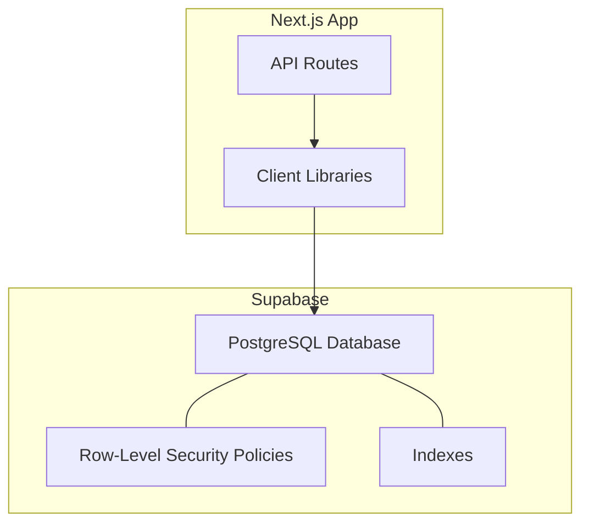
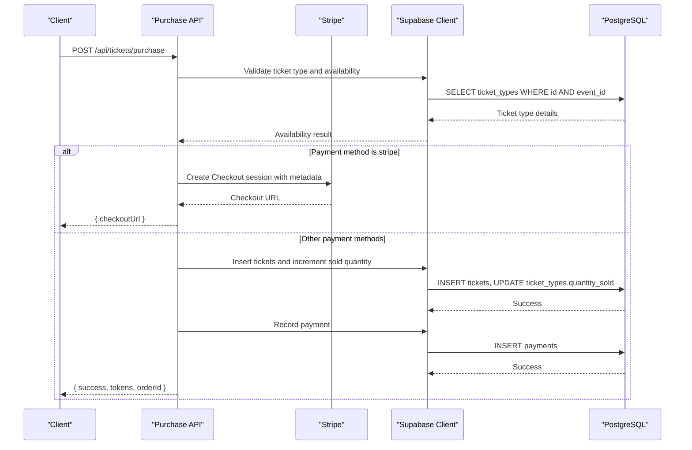
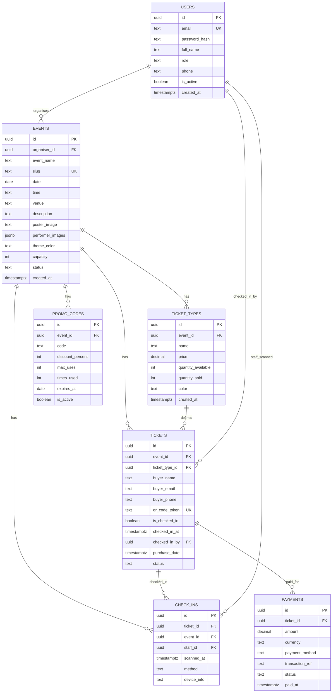
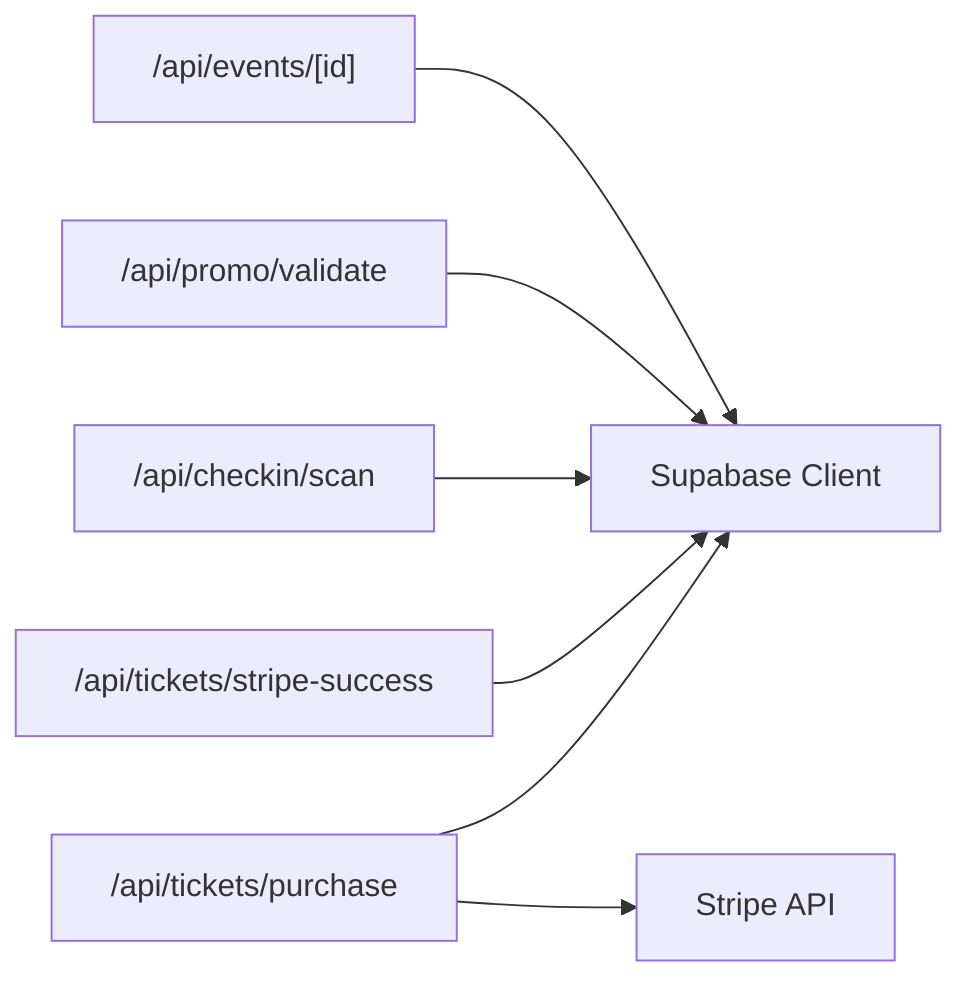

# Database Schema & Design

<cite>
**Referenced Files in This Document**
- [schema.sql](file://supabase/schema.sql)
- [supabase.js](file://lib/supabase.js)
- [purchase.js](file://pages/api/tickets/purchase.js)
- [stripe-success.js](file://pages/api/tickets/stripe-success.js)
- [scan.js](file://pages/api/checkin/scan.js)
- [validate.js](file://pages/api/promo/validate.js)
- [events/[id].js](file://pages/api/events/[id].js)
- [auth.js](file://lib/auth.js)
- [package.json](file://package.json)
</cite>

## Table of Contents
1. [Introduction](#introduction)
2. [Project Structure](#project-structure)
3. [Core Components](#core-components)
4. [Architecture Overview](#architecture-overview)
5. [Detailed Component Analysis](#detailed-component-analysis)
6. [Dependency Analysis](#dependency-analysis)
7. [Performance Considerations](#performance-considerations)
8. [Troubleshooting Guide](#troubleshooting-guide)
9. [Conclusion](#conclusion)
10. [Appendices](#appendices)

## Introduction
This document provides a comprehensive data model and design reference for TicketFlow’s database schema hosted on Supabase. It covers all entities (Users, Events, Ticket Types, Tickets, Check-ins, Payments, Promo Codes), their relationships, field definitions, constraints, indexes, and row-level security policies. It also documents the application’s data flow patterns, validation rules, referential integrity, lifecycle management, backup strategies, migration procedures, and performance optimizations used throughout the system.

## Project Structure
The database schema is defined in a single SQL file under the Supabase directory. The Next.js application interacts with Supabase via client libraries and server-side API routes that enforce business logic and role-based access control.

**Diagram sources**
- [schema.sql:120-154](file://supabase/schema.sql#L120-L154)
- [supabase.js:10-22](file://lib/supabase.js#L10-L22)

**Section sources**
- [schema.sql:1-166](file://supabase/schema.sql#L1-L166)
- [supabase.js:1-23](file://lib/supabase.js#L1-L23)

## Core Components
TicketFlow’s data model centers around seven core tables: users, events, ticket_types, tickets, check_ins, payments, and promo_codes. Each table enforces constraints, uses UUID primary keys, and participates in foreign key relationships to maintain referential integrity. Row-level security policies restrict public and authenticated access appropriately.

Key highlights:
- All IDs are UUIDs generated by uuid_generate_v4().
- Foreign keys cascade deletes where appropriate and set null on delete for staff references.
- CHECK constraints enforce valid enumerations for roles, statuses, payment methods, and discount ranges.
- Unique constraints prevent duplicate slugs, QR tokens, and promo code duplication per event.
- Indexes optimize frequent queries by slug, status, token, email, and foreign keys.

**Section sources**
- [schema.sql:10-117](file://supabase/schema.sql#L10-L117)
- [schema.sql:147-154](file://supabase/schema.sql#L147-L154)

## Architecture Overview
The application uses Supabase as a managed PostgreSQL backend with Row-Level Security. API routes act as the integration layer between the frontend and the database, enforcing business rules such as availability checks, promo code validation, and payment processing.

**Diagram sources**
- [purchase.js:14-117](file://pages/api/tickets/purchase.js#L14-L117)
- [supabase.js:10-22](file://lib/supabase.js#L10-L22)

**Section sources**
- [purchase.js:1-123](file://pages/api/tickets/purchase.js#L1-L123)
- [supabase.js:10-22](file://lib/supabase.js#L10-L22)

## Detailed Component Analysis

### Users
- Purpose: Stores user accounts with authentication-related fields and role-based access.
- Primary Key: id (UUID).
- Notable Fields:
  - email (unique, not null)
  - password_hash (not null)
  - full_name (not null)
  - role (restricted to super_admin, organiser, gate_staff)
  - phone (optional)
  - is_active (default true)
  - created_at (timestamp)
- Constraints:
  - UNIQUE(email)
  - CHECK(role IN (...))
- Relationships:
  - Referenced by events.organiser_id (SET NULL on delete)
  - Referenced by tickets.checked_in_by (SET NULL on delete)
  - Referenced by check_ins.staff_id (SET NULL on delete)
- Security:
  - Row-level security enabled; policies can be added for user-specific access.

**Section sources**
- [schema.sql:10-19](file://supabase/schema.sql#L10-L19)
- [schema.sql:120-128](file://supabase/schema.sql#L120-L128)

### Events
- Purpose: Represents events organized by users.
- Primary Key: id (UUID).
- Notable Fields:
  - organiser_id (FK to users.id)
  - event_name (not null)
  - slug (unique, not null)
  - date (date, not null)
  - time (text, optional)
  - venue (not null)
  - description (text)
  - poster_image (text)
  - performer_images (JSONB array default [])
  - theme_color (text default '#e94560')
  - capacity (integer default 0)
  - status (restricted to draft, published, sold_out, completed, cancelled)
  - created_at (timestamp)
- Constraints:
  - UNIQUE(slug)
  - CHECK(status IN (...))
- Relationships:
  - One-to-many with ticket_types.event_id (CASCADE on delete)
  - One-to-many with tickets.event_id (CASCADE on delete)
  - One-to-many with check_ins.event_id (CASCADE on delete)
  - One-to-many with promo_codes.event_id (CASCADE on delete)
- Indexes:
  - idx_events_slug
  - idx_events_status
- Security:
  - Public read policy allows SELECT when status = 'published'.

**Section sources**
- [schema.sql:24-40](file://supabase/schema.sql#L24-L40)
- [schema.sql:147-148](file://supabase/schema.sql#L147-L148)
- [schema.sql:131-132](file://supabase/schema.sql#L131-L132)

### Ticket Types
- Purpose: Defines ticket categories per event with pricing and inventory.
- Primary Key: id (UUID).
- Notable Fields:
  - event_id (FK to events.id, CASCADE on delete)
  - name (not null)
  - price (decimal(10,2), default 0)
  - quantity_available (integer, default 0)
  - quantity_sold (integer, default 0)
  - color (text default '#e94560')
  - created_at (timestamp)
- Constraints:
  - FK to events(id) with ON DELETE CASCADE
- Relationships:
  - One-to-many with tickets.ticket_type_id (CASCADE on delete)
- Business Logic:
  - Availability computed as quantity_available - quantity_sold during purchase.

**Section sources**
- [schema.sql:45-54](file://supabase/schema.sql#L45-L54)
- [purchase.js:24-25](file://pages/api/tickets/purchase.js#L24-L25)

### Tickets
- Purpose: Individual ticket records linked to events and ticket types.
- Primary Key: id (UUID).
- Notable Fields:
  - event_id (FK to events.id, CASCADE on delete)
  - ticket_type_id (FK to ticket_types.id, CASCADE on delete)
  - buyer_name (not null)
  - buyer_email (not null)
  - buyer_phone (optional)
  - qr_code_token (unique, not null)
  - is_checked_in (boolean default false)
  - checked_in_at (timestamp)
  - checked_in_by (FK to users.id, SET NULL on delete)
  - purchase_date (timestamp default NOW())
  - status (restricted to active, used, cancelled, refunded)
- Constraints:
  - UNIQUE(qr_code_token)
  - CHECK(status IN (...))
- Indexes:
  - idx_tickets_token
  - idx_tickets_email
  - idx_tickets_event
- Relationships:
  - One-to-one with payments.ticket_id (CASCADE on delete)
  - One-to-many with check_ins.ticket_id (CASCADE on delete)
- Security:
  - Row-level security enabled; policies can be added for buyer or admin access.

**Section sources**
- [schema.sql:59-73](file://supabase/schema.sql#L59-L73)
- [schema.sql:149-151](file://supabase/schema.sql#L149-L151)

### Check-ins
- Purpose: Records each entry scan with method and device info.
- Primary Key: id (UUID).
- Notable Fields:
  - ticket_id (FK to tickets.id, CASCADE on delete)
  - event_id (FK to events.id, CASCADE on delete)
  - staff_id (FK to users.id, SET NULL on delete)
  - scanned_at (timestamp default NOW())
  - method (restricted to qr_scan, manual_search)
  - device_info (text)
- Constraints:
  - CHECK(method IN (...))
- Indexes:
  - idx_checkins_event
- Relationships:
  - References tickets and events for auditability.

**Section sources**
- [schema.sql:78-86](file://supabase/schema.sql#L78-L86)
- [schema.sql:152](file://supabase/schema.sql#L152)

### Payments
- Purpose: Tracks payment transactions associated with tickets.
- Primary Key: id (UUID).
- Notable Fields:
  - ticket_id (FK to tickets.id, CASCADE on delete)
  - amount (decimal(10,2), not null)
  - currency (text default 'USD')
  - payment_method (restricted to ecocash, visa, mastercard, stripe, paypal)
  - transaction_ref (text)
  - status (restricted to pending, completed, failed, refunded)
  - paid_at (timestamp)
- Constraints:
  - CHECK(payment_method IN (...))
  - CHECK(status IN (...))
- Indexes:
  - idx_payments_ticket
- Relationships:
  - References tickets for linkage.

**Section sources**
- [schema.sql:91-102](file://supabase/schema.sql#L91-L102)
- [schema.sql:153](file://supabase/schema.sql#L153)

### Promo Codes
- Purpose: Event-specific promotional discounts with usage limits and expiration.
- Primary Key: id (UUID).
- Notable Fields:
  - event_id (FK to events.id, CASCADE on delete)
  - code (text, not null)
  - discount_percent (integer, 1–100)
  - max_uses (integer, default 100)
  - times_used (integer, default 0)
  - expires_at (date)
  - is_active (boolean default true)
- Constraints:
  - UNIQUE(event_id, code)
  - CHECK(discount_percent BETWEEN 1 AND 100)
- Relationships:
  - One-to-many with purchases (via API logic incrementing times_used).

**Section sources**
- [schema.sql:107-117](file://supabase/schema.sql#L107-L117)

### Entity Relationship Diagram

**Diagram sources**
- [schema.sql:10-117](file://supabase/schema.sql#L10-L117)

## Dependency Analysis
The application’s API routes depend on Supabase clients and external services like Stripe. Data flows through well-defined endpoints that validate inputs, enforce business rules, and update the database accordingly.

**Diagram sources**
- [purchase.js:1-123](file://pages/api/tickets/purchase.js#L1-L123)
- [stripe-success.js:1-55](file://pages/api/tickets/stripe-success.js#L1-L55)
- [scan.js:1-44](file://pages/api/checkin/scan.js#L1-L44)
- [validate.js:1-27](file://pages/api/promo/validate.js#L1-L27)
- [events/[id].js:1-42](file://pages/api/events/[id].js#L1-L42)
- [supabase.js:10-22](file://lib/supabase.js#L10-L22)

**Section sources**
- [purchase.js:1-123](file://pages/api/tickets/purchase.js#L1-L123)
- [stripe-success.js:1-55](file://pages/api/tickets/stripe-success.js#L1-L55)
- [scan.js:1-44](file://pages/api/checkin/scan.js#L1-L44)
- [validate.js:1-27](file://pages/api/promo/validate.js#L1-L27)
- [events/[id].js:1-42](file://pages/api/events/[id].js#L1-L42)
- [supabase.js:10-22](file://lib/supabase.js#L10-L22)

## Performance Considerations
- Indexing Strategy:
  - Slug and status indexes on events accelerate listing and filtering.
  - Token, email, and event_id indexes on tickets support fast lookups for QR scanning and buyer queries.
  - Event index on check_ins supports event-scoped analytics.
  - Ticket index on payments supports reconciliation queries.
- Query Patterns:
  - Use selective selects to reduce payload size.
  - Prefer single-row updates for atomic operations (e.g., incrementing quantity_sold).
- Concurrency:
  - For high-volume purchases, consider using database-level locks or triggers to avoid race conditions on availability.
- Caching:
  - Cache published events and ticket types at the edge or CDN level to reduce database load.

[No sources needed since this section provides general guidance]

## Troubleshooting Guide
Common issues and resolutions:
- Missing environment variables:
  - Ensure NEXT_PUBLIC_SUPABASE_URL and NEXT_PUBLIC_SUPABASE_ANON_KEY are set; service role key for server-side operations.
- Authentication failures:
  - Verify session cookies and role checks; ensure requireRole is invoked before protected endpoints.
- Payment errors:
  - Confirm Stripe secret key configuration and webhook handling if integrating webhooks.
- Duplicate QR codes:
  - UNIQUE constraint prevents duplicates; handle insertion errors gracefully.
- Promo code validation:
  - Validate active status, usage limits, and expiration dates; normalize input (trim, uppercase).

**Section sources**
- [supabase.js:6-8](file://lib/supabase.js#L6-L8)
- [auth.js:39-46](file://lib/auth.js#L39-L46)
- [validate.js:18-22](file://pages/api/promo/validate.js#L18-L22)

## Conclusion
TicketFlow’s database schema is designed for clarity, integrity, and scalability. Strong constraints, indexes, and row-level security policies protect data while enabling efficient queries. The API layer enforces business rules and integrates with external services like Stripe. Following the outlined best practices ensures reliable operation and maintainability.

[No sources needed since this section summarizes without analyzing specific files]

## Appendices

### Data Validation Rules and Business Constraints
- Roles: super_admin, organiser, gate_staff.
- Event statuses: draft, published, sold_out, completed, cancelled.
- Ticket statuses: active, used, cancelled, refunded.
- Payment methods: ecocash, visa, mastercard, stripe, paypal.
- Payment statuses: pending, completed, failed, refunded.
- Promo discount range: 1–100 percent.
- Uniqueness: email, slug, qr_code_token, (event_id, code).

**Section sources**
- [schema.sql:15](file://supabase/schema.sql#L15)
- [schema.sql:37-38](file://supabase/schema.sql#L37-L38)
- [schema.sql:71-72](file://supabase/schema.sql#L71-L72)
- [schema.sql:96-100](file://supabase/schema.sql#L96-L100)
- [schema.sql:111](file://supabase/schema.sql#L111)
- [schema.sql:116](file://supabase/schema.sql#L116)

### Referential Integrity and Cascades
- Events cascade deletes to ticket_types, tickets, check_ins, promo_codes.
- Tickets cascade deletes to check_ins and payments.
- Staff references set null on delete to preserve historical data.

**Section sources**
- [schema.sql:47](file://supabase/schema.sql#L47)
- [schema.sql:61-62](file://supabase/schema.sql#L61-L62)
- [schema.sql:80-82](file://supabase/schema.sql#L80-L82)
- [schema.sql:93](file://supabase/schema.sql#L93)

### Row-Level Security Policies
- Public read access to published events.
- Public read access to ticket types for published events.
- Service role bypasses RLS for API routes.

**Section sources**
- [schema.sql:131-139](file://supabase/schema.sql#L131-L139)
- [schema.sql:141-142](file://supabase/schema.sql#L141-L142)

### Data Lifecycle Management
- Creation:
  - Users seeded with default super admin.
  - Events created by organisers; ticket types added per event.
- Purchase Flow:
  - Validate availability, apply promo codes, create tickets, record payments.
- Check-in Flow:
  - Validate ticket status, mark as used, record check-in.
- Deletion:
  - Events cascade delete dependent rows; staff references set null.

**Section sources**
- [schema.sql:158-165](file://supabase/schema.sql#L158-L165)
- [purchase.js:24-117](file://pages/api/tickets/purchase.js#L24-L117)
- [stripe-success.js:27-46](file://pages/api/tickets/stripe-success.js#L27-L46)
- [scan.js:31-33](file://pages/api/checkin/scan.js#L31-L33)

### Backup Strategies
- Use Supabase native backups and point-in-time recovery.
- Export critical tables periodically (users, events, tickets, payments) for compliance.
- Maintain encrypted offsite backups for disaster recovery.

[No sources needed since this section provides general guidance]

### Migration Procedures
- Apply schema changes via SQL migrations in Supabase.
- Test migrations in staging before production deployment.
- Rollback strategy: maintain versioned migration scripts and revert steps.

[No sources needed since this section provides general guidance]

### Performance Optimization Techniques
- Leverage existing indexes for common queries.
- Use batch inserts for bulk ticket creation.
- Avoid N+1 queries by selecting related data efficiently.
- Monitor query performance with Supabase logs and adjust indexes as needed.

[No sources needed since this section provides general guidance]

### Dependencies and Environment
- Supabase client configured via environment variables.
- Stripe integration requires secret key.
- bcrypt used for password hashing.

**Section sources**
- [supabase.js:3-8](file://lib/supabase.js#L3-L8)
- [stripe.js:3](file://lib/stripe.js#L3)
- [auth.js:5-12](file://lib/auth.js#L5-L12)
- [package.json:10-22](file://package.json#L10-L22)