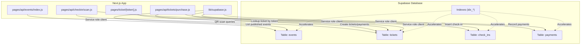
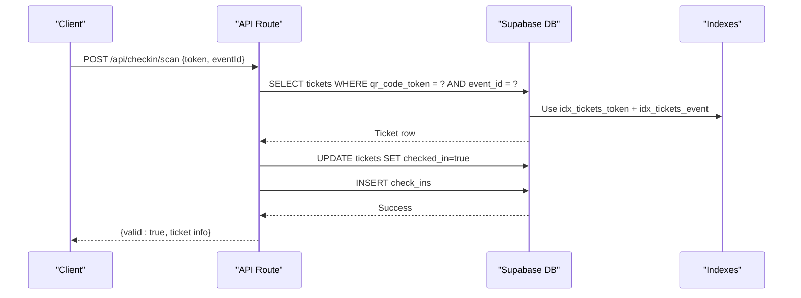
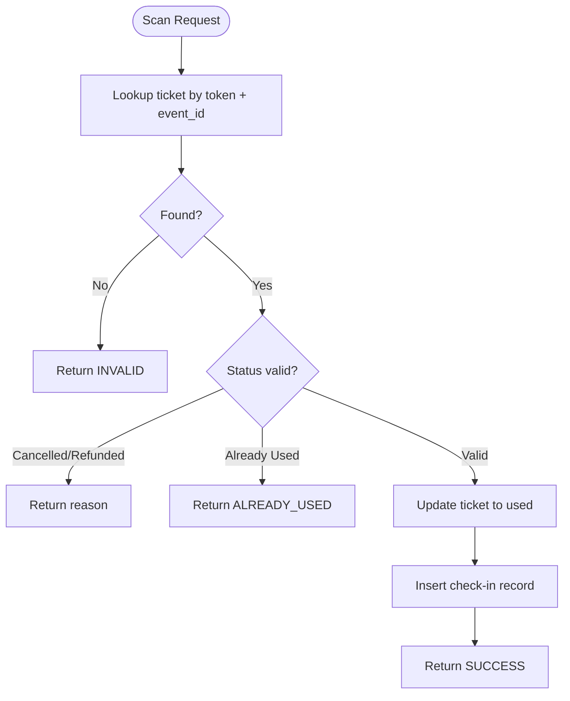
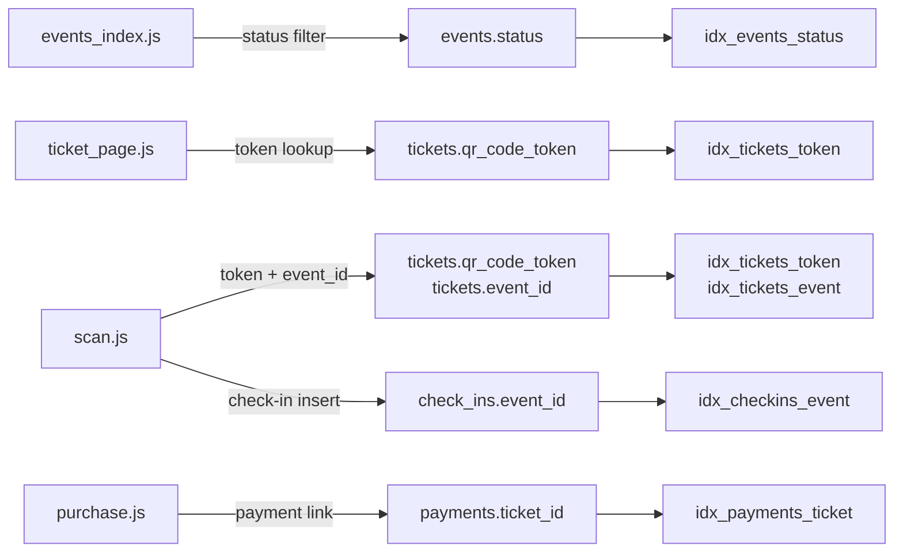

# Indexes & Performance Optimization

<cite>
**Referenced Files in This Document**
- [schema.sql](file://supabase/schema.sql)
- [scan.js](file://pages/api/checkin/scan.js)
- [events_index.js](file://pages/api/events/index.js)
- [purchase.js](file://pages/api/tickets/purchase.js)
- [ticket_page.js](file://pages/ticket/[token].js)
- [supabase.js](file://lib/supabase.js)
</cite>

## Table of Contents
1. [Introduction](#introduction)
2. [Project Structure](#project-structure)
3. [Core Components](#core-components)
4. [Architecture Overview](#architecture-overview)
5. [Detailed Component Analysis](#detailed-component-analysis)
6. [Dependency Analysis](#dependency-analysis)
7. [Performance Considerations](#performance-considerations)
8. [Troubleshooting Guide](#troubleshooting-guide)
9. [Conclusion](#conclusion)
10. [Appendices](#appendices)

## Introduction
This document explains the database indexes and performance optimization strategies implemented in TicketFlow, focusing on how each index supports high-frequency operations such as QR code scanning, event browsing, ticket validation, and payment lookups. It also provides guidance for adding new indexes, monitoring query performance, and scaling considerations for Supabase-backed workloads.

## Project Structure
TicketFlow is a Next.js application backed by Supabase. The database schema and indexes are defined in a single SQL file, while API routes implement the core data access patterns that benefit from these indexes.

**Diagram sources**
- [schema.sql:1-166](file://supabase/schema.sql#L1-L166)
- [scan.js:1-44](file://pages/api/checkin/scan.js#L1-L44)
- [events_index.js:1-42](file://pages/api/events/index.js#L1-L42)
- [purchase.js:1-123](file://pages/api/tickets/purchase.js#L1-L123)
- [ticket_page.js:231-254](file://pages/ticket/[token].js#L231-L254)
- [supabase.js:1-22](file://lib/supabase.js#L1-L22)

**Section sources**
- [schema.sql:1-166](file://supabase/schema.sql#L1-L166)
- [supabase.js:1-22](file://lib/supabase.js#L1-L22)

## Core Components
The following indexes are defined to optimize common query patterns across the application:

- idx_events_slug
- idx_events_status
- idx_tickets_token
- idx_tickets_email
- idx_tickets_event
- idx_checkins_event
- idx_payments_ticket

Each index targets specific fields used frequently in read-heavy or write-heavy paths.

**Section sources**
- [schema.sql:147-153](file://supabase/schema.sql#L147-L153)

## Architecture Overview
At runtime, API routes use the Supabase service role client to perform fast, server-side reads and writes. Indexes reduce full table scans and improve latency for critical flows like event listing, ticket lookup by token, and check-in processing.

**Diagram sources**
- [scan.js:12-33](file://pages/api/checkin/scan.js#L12-L33)
- [schema.sql:147-153](file://supabase/schema.sql#L147-L153)

**Section sources**
- [scan.js:1-44](file://pages/api/checkin/scan.js#L1-L44)
- [schema.sql:147-153](file://supabase/schema.sql#L147-L153)

## Detailed Component Analysis

### Index: idx_events_slug
- Column: events.slug
- Purpose: Optimizes URL-based event discovery via slugs (e.g., /events/[slug]).
- Query pattern: Exact match on slug when loading an event page.
- Rationale: Slugs are unique and frequently used in routing; an index ensures O(log n) lookups instead of full table scans.
- Related usage: Event pages and public listing rely on status filtering; slug indexing complements status filtering for precise retrieval.

**Section sources**
- [schema.sql:147-147](file://supabase/schema.sql#L147-L147)
- [ticket_page.js:231-254](file://pages/ticket/[token].js#L231-L254)

### Index: idx_events_status
- Column: events.status
- Purpose: Accelerates filtering by status (e.g., published).
- Query pattern: List all published events ordered by date.
- Rationale: Public-facing event listings filter heavily on status; this index avoids full table scans and improves ordering performance.

**Section sources**
- [schema.sql:148-148](file://supabase/schema.sql#L148-L148)
- [events_index.js:9-13](file://pages/api/events/index.js#L9-L13)

### Index: idx_tickets_token
- Column: tickets.qr_code_token
- Purpose: Fast lookup of tickets by their unique QR token during validation and display.
- Query pattern: Single-row lookup by token for ticket viewing and check-in validation.
- Rationale: Token lookups occur on every ticket view and at gate scanning; uniqueness and high frequency make this index essential.

**Section sources**
- [schema.sql:149-149](file://supabase/schema.sql#L149-L149)
- [ticket_page.js:239-243](file://pages/ticket/[token].js#L239-L243)
- [scan.js:14-19](file://pages/api/checkin/scan.js#L14-L19)

### Index: idx_tickets_email
- Column: tickets.buyer_email
- Purpose: Supports email-based searches and deduplication (e.g., admin lookups, support workflows).
- Query pattern: Find tickets by buyer email, often combined with event filters.
- Rationale: Email is a natural key for customer support and reporting; indexing reduces scan time for frequent email lookups.

**Section sources**
- [schema.sql:150-150](file://supabase/schema.sql#L150-L150)

### Index: idx_tickets_event
- Column: tickets.event_id
- Purpose: Speeds up per-event ticket queries (e.g., sales reports, check-in counts).
- Query pattern: Filter tickets by event_id for analytics and operational dashboards.
- Rationale: Most administrative queries group or count tickets per event; this index accelerates those aggregations.

**Section sources**
- [schema.sql:151-151](file://supabase/schema.sql#L151-L151)

### Index: idx_checkins_event
- Column: check_ins.event_id
- Purpose: Optimizes counting and listing check-ins per event.
- Query pattern: Count scanned attendees per event, compute attendance metrics.
- Rationale: Check-in tables grow quickly; indexing by event_id enables efficient aggregation without full scans.

**Section sources**
- [schema.sql:152-152](file://supabase/schema.sql#L152-L152)

### Index: idx_payments_ticket
- Column: payments.ticket_id
- Purpose: Accelerates payment lookups tied to a specific ticket.
- Query pattern: Retrieve payment details for a given ticket (e.g., refunds, reconciliation).
- Rationale: Payments are linked to tickets; foreign-key joins and point lookups benefit from this index.

**Section sources**
- [schema.sql:153-153](file://supabase/schema.sql#L153-L153)

### High-Frequency Flows and Index Usage

#### QR Code Scanning Flow
- Steps: Validate ticket by token and event, update status, record check-in.
- Indexes used: idx_tickets_token, idx_tickets_event, idx_checkins_event.
- Impact: Sub-millisecond lookups under load; prevents duplicate entries and ensures consistent state updates.

**Diagram sources**
- [scan.js:12-33](file://pages/api/checkin/scan.js#L12-L33)
- [schema.sql:147-153](file://supabase/schema.sql#L147-L153)

**Section sources**
- [scan.js:1-44](file://pages/api/checkin/scan.js#L1-L44)
- [schema.sql:147-153](file://supabase/schema.sql#L147-L153)

#### Event Browsing Flow
- Steps: Fetch published events with ticket types, ordered by date.
- Indexes used: idx_events_status.
- Impact: Efficient pagination and sorting for large event catalogs.

**Section sources**
- [events_index.js:9-13](file://pages/api/events/index.js#L9-L13)
- [schema.sql:148-148](file://supabase/schema.sql#L148-L148)

#### Ticket Validation Flow
- Steps: Load ticket by token, fetch related event and ticket type.
- Indexes used: idx_tickets_token.
- Impact: Fast rendering of ticket pages and QR codes.

**Section sources**
- [ticket_page.js:239-249](file://pages/ticket/[token].js#L239-L249)
- [schema.sql:149-149](file://supabase/schema.sql#L149-L149)

#### Purchase Flow
- Steps: Validate ticket type availability, optionally apply promo, create tickets, record payment.
- Indexes used: idx_tickets_event (for later analytics), idx_payments_ticket (for payment lookup).
- Impact: Ensures quick availability checks and reliable payment linkage.

**Section sources**
- [purchase.js:15-25](file://pages/api/tickets/purchase.js#L15-L25)
- [purchase.js:96-115](file://pages/api/tickets/purchase.js#L96-L115)
- [schema.sql:151-153](file://supabase/schema.sql#L151-L153)

## Dependency Analysis
The indexes align closely with the most common query patterns in the API layer. The service role client bypasses Row Level Security policies for server-side operations, enabling efficient reads/writes.

**Diagram sources**
- [events_index.js:9-13](file://pages/api/events/index.js#L9-L13)
- [ticket_page.js:239-243](file://pages/ticket/[token].js#L239-L243)
- [scan.js:14-33](file://pages/api/checkin/scan.js#L14-L33)
- [purchase.js:96-115](file://pages/api/tickets/purchase.js#L96-L115)
- [schema.sql:147-153](file://supabase/schema.sql#L147-L153)

**Section sources**
- [supabase.js:15-22](file://lib/supabase.js#L15-L22)
- [schema.sql:122-142](file://supabase/schema.sql#L122-L142)

## Performance Considerations

### When to Add New Indexes
- Frequent exact-match filters on non-primary columns (e.g., buyer_email, method).
- Common join keys not covered by existing indexes (e.g., additional foreign keys).
- Columns used in ORDER BY or GROUP BY that cause sorts/scans on large tables.
- Composite filters that appear together often (e.g., event_id + status).

### Monitoring Query Performance
- Use EXPLAIN ANALYZE on slow queries to confirm index usage and identify bottlenecks.
- Monitor Supabase dashboard for query latency and throughput trends.
- Track lock waits and long-running transactions during peak scanning periods.

### Scaling Considerations
- Partitioning: Consider partitioning check_ins and payments by event_id or time ranges if volumes grow significantly.
- Read replicas: Offload heavy reporting queries to read replicas where supported.
- Connection pooling: Ensure connection limits and pool sizing accommodate concurrent API requests.
- Caching: Cache static event metadata and popular ticket views at the edge or application layer to reduce DB load.

### Query Optimization Techniques
- Select only needed columns to minimize payload size.
- Use composite indexes for multi-column filters (e.g., event_id + status).
- Avoid functions on indexed columns in WHERE clauses; precompute values when possible.
- Batch inserts for bulk operations (e.g., creating multiple tickets).

[No sources needed since this section provides general guidance]

## Troubleshooting Guide

### Symptoms and Likely Causes
- Slow event listing: Missing or outdated stats on events.status; consider reindexing or analyzing table statistics.
- Slow ticket lookup: Verify idx_tickets_token exists and is used; ensure token values are not transformed in queries.
- Check-in delays: Confirm idx_tickets_event and idx_checkins_event are present; monitor for lock contention during updates.
- Payment lookup latency: Ensure idx_payments_ticket is used; avoid unnecessary joins.

### Diagnostic Steps
- Run EXPLAIN ANALYZE on representative queries to validate index usage.
- Check Supabase logs for slow queries and error messages.
- Inspect RLS policies to ensure they do not force full scans.

**Section sources**
- [schema.sql:122-142](file://supabase/schema.sql#L122-L142)
- [schema.sql:147-153](file://supabase/schema.sql#L147-L153)

## Conclusion
The seven indexes in TicketFlow directly target the most frequent and performance-critical query patterns: event browsing by status, ticket lookup by token, per-event ticket and check-in analytics, and payment linkage. Together, they ensure low-latency responses for high-throughput operations like QR scanning and ticket validation. As the system scales, continue to monitor query plans, add composite indexes where appropriate, and consider architectural changes like partitioning and caching to maintain performance.

[No sources needed since this section summarizes without analyzing specific files]

## Appendices

### Index Reference Summary
- idx_events_slug: events(slug)
- idx_events_status: events(status)
- idx_tickets_token: tickets(qr_code_token)
- idx_tickets_email: tickets(buyer_email)
- idx_tickets_event: tickets(event_id)
- idx_checkins_event: check_ins(event_id)
- idx_payments_ticket: payments(ticket_id)

**Section sources**
- [schema.sql:147-153](file://supabase/schema.sql#L147-L153)