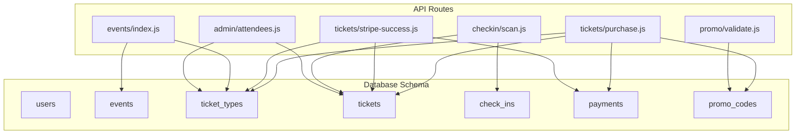
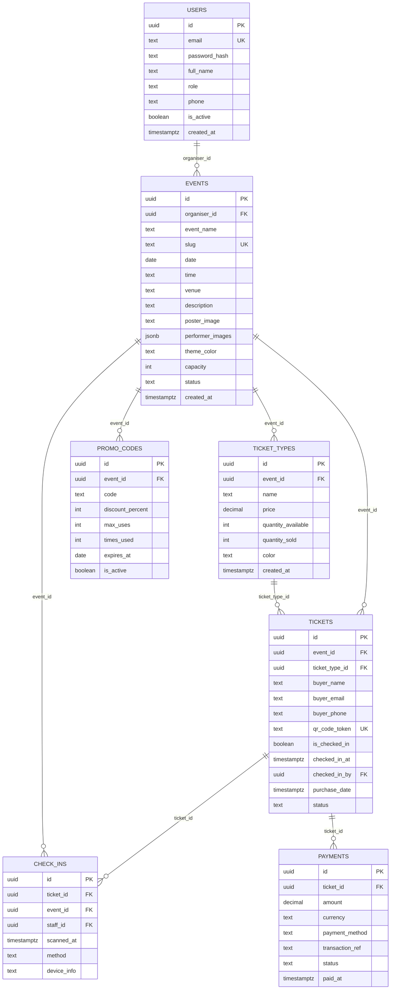
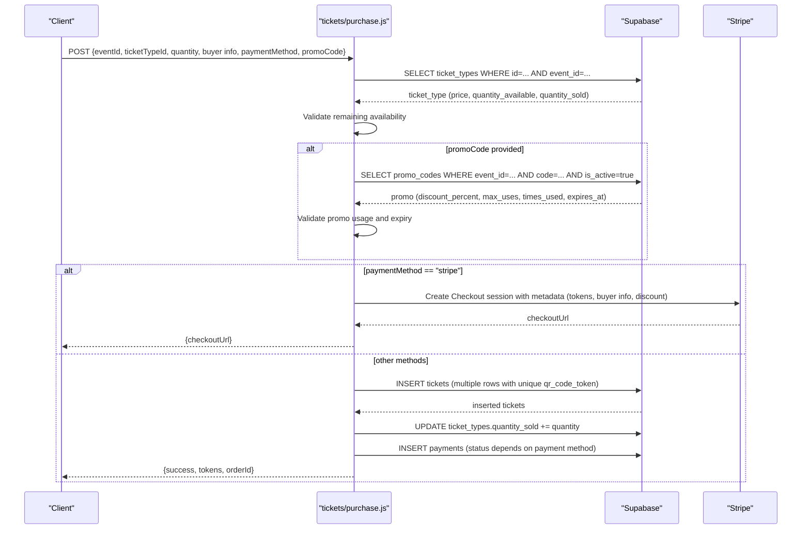
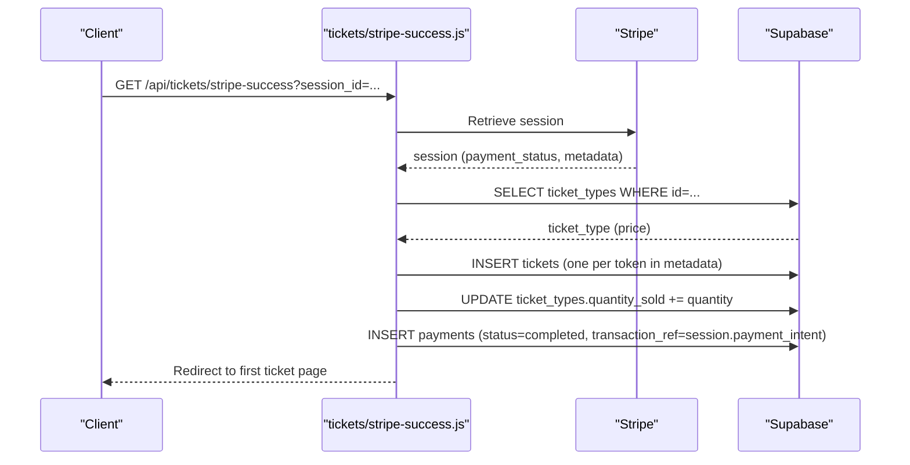
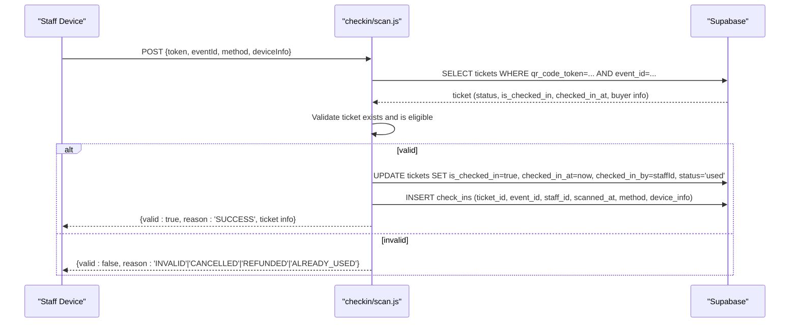
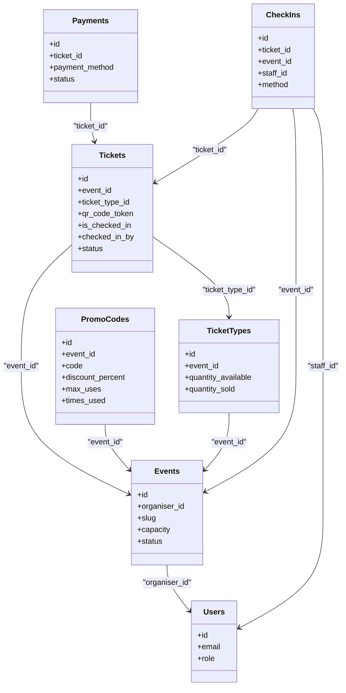
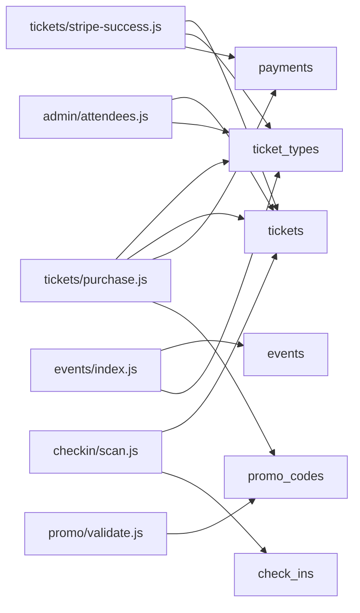

# Relationships & Constraints

<cite>
**Referenced Files in This Document**
- [schema.sql](file://supabase/schema.sql)
- [purchase.js](file://pages/api/tickets/purchase.js)
- [stripe-success.js](file://pages/api/tickets/stripe-success.js)
- [validate.js](file://pages/api/promo/validate.js)
- [scan.js](file://pages/api/checkin/scan.js)
- [events_index.js](file://pages/api/events/index.js)
- [attendees.js](file://pages/api/admin/attendees.js)
</cite>

## Table of Contents
1. [Introduction](#introduction)
2. [Project Structure](#project-structure)
3. [Core Components](#core-components)
4. [Architecture Overview](#architecture-overview)
5. [Detailed Component Analysis](#detailed-component-analysis)
6. [Dependency Analysis](#dependency-analysis)
7. [Performance Considerations](#performance-considerations)
8. [Troubleshooting Guide](#troubleshooting-guide)
9. [Conclusion](#conclusion)

## Introduction
This document explains the database relationships and constraints implemented in TicketFlow, focusing on referential integrity, cascade behaviors, CHECK constraints for status fields, UNIQUE constraints, and business rules enforced at the database level. It also maps how API endpoints interact with these constraints to maintain data consistency during ticket purchases, check-ins, and promotions.

## Project Structure
The relational schema is defined in a single SQL file. The Next.js API routes consume this schema via Supabase client calls to enforce business logic around capacity, discounts, and check-in flows.

**Diagram sources**
- [schema.sql:10-117](file://supabase/schema.sql#L10-L117)
- [purchase.js:1-123](file://pages/api/tickets/purchase.js#L1-L123)
- [stripe-success.js:1-55](file://pages/api/tickets/stripe-success.js#L1-L55)
- [validate.js:1-27](file://pages/api/promo/validate.js#L1-L27)
- [scan.js:1-44](file://pages/api/checkin/scan.js#L1-L44)
- [events_index.js:1-42](file://pages/api/events/index.js#L1-L42)
- [attendees.js:1-29](file://pages/api/admin/attendees.js#L1-L29)

**Section sources**
- [schema.sql:1-166](file://supabase/schema.sql#L1-L166)

## Core Components
TicketFlow’s data model centers around seven tables: users, events, ticket_types, tickets, check_ins, payments, and promo_codes. Relationships are enforced through foreign keys with explicit ON DELETE behaviors (CASCADE or SET NULL), while CHECK and UNIQUE constraints enforce domain rules such as allowed statuses and unique tokens.

Key relationship patterns:
- One-to-many: events → ticket_types; events → tickets; tickets → check_ins; tickets → payments
- Many-to-one: ticket_types → events; tickets → events; tickets → ticket_types; check_ins → tickets; check_ins → events; payments → tickets
- Optional many-to-one: tickets.checked_in_by → users; check_ins.staff_id → users (ON DELETE SET NULL)

Referential integrity guarantees:
- Deleting an event cascades to ticket_types and tickets, ensuring orphaned child records cannot exist.
- Deleting a ticket_type cascades to tickets, preserving referential consistency.
- Deleting a ticket cascades to check_ins and payments, keeping audit trails aligned with ticket lifecycle.
- When referenced users are deleted, references in tickets and check_ins become NULL rather than breaking referential integrity.

Business rules enforced by constraints:
- Status enums: events.status, tickets.status, payments.status, check_ins.method, users.role, payments.payment_method are restricted to predefined values via CHECK constraints.
- Discount range: promo_codes.discount_percent must be between 1 and 100.
- Uniqueness: events.slug, tickets.qr_code_token, and promo_codes(event_id, code) are unique.

**Section sources**
- [schema.sql:10-117](file://supabase/schema.sql#L10-L117)

## Architecture Overview
The following diagram shows how core entities relate and where constraints apply.

**Diagram sources**
- [schema.sql:10-117](file://supabase/schema.sql#L10-L117)

## Detailed Component Analysis

### Foreign Key Relationships and Cascade Behaviors
- events.organiser_id → users.id: ON DELETE SET NULL
  - If an organizer account is removed, events remain but lose the organizer reference.
- ticket_types.event_id → events.id: ON DELETE CASCADE
  - Deleting an event removes all associated ticket types.
- tickets.event_id → events.id: ON DELETE CASCADE
- tickets.ticket_type_id → ticket_types.id: ON DELETE CASCADE
  - Deleting a ticket type removes all its tickets.
- check_ins.ticket_id → tickets.id: ON DELETE CASCADE
- check_ins.event_id → events.id: ON DELETE CASCADE
- check_ins.staff_id → users.id: ON DELETE SET NULL
- payments.ticket_id → tickets.id: ON DELETE CASCADE

These constraints ensure that:
- Child records never outlive their parents unless explicitly allowed (e.g., staff/user references can become NULL).
- Audit trails (check_ins, payments) stay consistent with ticket/event lifecycles.

**Section sources**
- [schema.sql:24-117](file://supabase/schema.sql#L24-L117)

### CHECK Constraints and Status Transitions
- users.role: restricted to super_admin, organiser, gate_staff
- events.status: draft, published, sold_out, completed, cancelled
- tickets.status: active, used, cancelled, refunded
- payments.status: pending, completed, failed, refunded
- payments.payment_method: ecocash, visa, mastercard, stripe, paypal
- check_ins.method: qr_scan, manual_search
- promo_codes.discount_percent: BETWEEN 1 AND 100

Status transitions enforced by application logic:
- Check-in flow sets tickets.status from active to used and records check_ins.
- Payment completion updates payments.status to completed and may set tickets.status accordingly.
- Refund/cancel flows update tickets.status and payments.status consistently.

**Section sources**
- [schema.sql:10-117](file://supabase/schema.sql#L10-L117)
- [scan.js:1-44](file://pages/api/checkin/scan.js#L1-L44)
- [purchase.js:1-123](file://pages/api/tickets/purchase.js#L1-L123)
- [stripe-success.js:1-55](file://pages/api/tickets/stripe-success.js#L1-L55)

### UNIQUE Constraints
- events.slug: ensures unique event identifiers per event.
- tickets.qr_code_token: ensures each ticket has a unique QR token.
- promo_codes(event_id, code): ensures a promo code is unique within an event.

These constraints prevent duplicate entries and collisions in critical identifiers.

**Section sources**
- [schema.sql:24-117](file://supabase/schema.sql#L24-L117)

### Capacity Limits and Business Logic
Capacity enforcement occurs at two levels:
- Event-level capacity: events.capacity provides a global limit.
- Ticket-type-level availability: ticket_types.quantity_available and ticket_types.quantity_sold track per-type availability.

Purchase flow enforces:
- Remaining availability = quantity_available - quantity_sold
- Requested quantity must not exceed remaining availability
- On success, ticket_types.quantity_sold is incremented

Promotion logic:
- Promo codes are validated against event_id, activity, expiration, and usage limits
- discount_percent is constrained to 1–100 by database constraint
- Application increments times_used when applied

Check-in validation:
- Tickets must belong to the specified event
- Tickets cannot be already used, cancelled, or refunded
- Successful check-in updates ticket.is_checked_in, checked_in_at, checked_in_by, and status to used, and creates a check_ins record

**Section sources**
- [purchase.js:1-123](file://pages/api/tickets/purchase.js#L1-L123)
- [validate.js:1-27](file://pages/api/promo/validate.js#L1-L27)
- [scan.js:1-44](file://pages/api/checkin/scan.js#L1-L44)
- [schema.sql:24-117](file://supabase/schema.sql#L24-L117)

### Data Flow Diagrams

#### Purchase Flow with Promotions and Payments

**Diagram sources**
- [purchase.js:1-123](file://pages/api/tickets/purchase.js#L1-L123)
- [schema.sql:45-117](file://supabase/schema.sql#L45-L117)

#### Stripe Success Callback

**Diagram sources**
- [stripe-success.js:1-55](file://pages/api/tickets/stripe-success.js#L1-L55)
- [schema.sql:45-117](file://supabase/schema.sql#L45-L117)

#### Check-in Scan Flow

**Diagram sources**
- [scan.js:1-44](file://pages/api/checkin/scan.js#L1-L44)
- [schema.sql:59-86](file://supabase/schema.sql#L59-L86)

### Class-like Entity Relationships
While not object-oriented, the schema defines clear entity relationships:

**Diagram sources**
- [schema.sql:10-117](file://supabase/schema.sql#L10-L117)

## Dependency Analysis
The API layer depends on the database schema for integrity and validation. Key dependencies include:
- Purchase endpoint depends on ticket_types availability and promo_codes validation.
- Stripe success callback depends on ticket creation and payment recording.
- Check-in endpoint depends on tickets and check_ins integrity.
- Admin endpoints depend on tickets and ticket_types for reporting.

**Diagram sources**
- [purchase.js:1-123](file://pages/api/tickets/purchase.js#L1-L123)
- [stripe-success.js:1-55](file://pages/api/tickets/stripe-success.js#L1-L55)
- [validate.js:1-27](file://pages/api/promo/validate.js#L1-L27)
- [scan.js:1-44](file://pages/api/checkin/scan.js#L1-L44)
- [events_index.js:1-42](file://pages/api/events/index.js#L1-L42)
- [attendees.js:1-29](file://pages/api/admin/attendees.js#L1-L29)

**Section sources**
- [purchase.js:1-123](file://pages/api/tickets/purchase.js#L1-L123)
- [stripe-success.js:1-55](file://pages/api/tickets/stripe-success.js#L1-L55)
- [validate.js:1-27](file://pages/api/promo/validate.js#L1-L27)
- [scan.js:1-44](file://pages/api/checkin/scan.js#L1-L44)
- [events_index.js:1-42](file://pages/api/events/index.js#L1-L42)
- [attendees.js:1-29](file://pages/api/admin/attendees.js#L1-L29)

## Performance Considerations
Indexes are defined to optimize common queries:
- events.slug and events.status for filtering and lookups
- tickets.qr_code_token for fast check-in scans
- tickets.buyer_email for attendee searches
- tickets.event_id for event-specific queries
- check_ins.event_id for event attendance analytics
- payments.ticket_id for payment reconciliation

These indexes support high-throughput operations like scanning tickets and querying attendees efficiently.

**Section sources**
- [schema.sql:147-154](file://supabase/schema.sql#L147-L154)

## Troubleshooting Guide
Common issues and resolutions:
- Duplicate qr_code_token: Occurs if uniqueness constraint is violated; ensure token generation is unique per ticket.
- Invalid promo code: Validate event_id association, activity flag, expiration date, and usage limits.
- Capacity exceeded: Verify ticket_types.quantity_available vs quantity_sold; adjust availability or reject purchase.
- Check-in failures: Ensure ticket belongs to the event, is not already used, and is not cancelled/refunded.
- Payment status mismatches: Confirm payments.status aligns with actual payment gateway responses.

Refer to the relevant API endpoints and schema constraints for detailed error handling.

**Section sources**
- [purchase.js:1-123](file://pages/api/tickets/purchase.js#L1-L123)
- [validate.js:1-27](file://pages/api/promo/validate.js#L1-L27)
- [scan.js:1-44](file://pages/api/checkin/scan.js#L1-L44)
- [schema.sql:10-117](file://supabase/schema.sql#L10-L117)

## Conclusion
TicketFlow’s database design enforces strong referential integrity through foreign keys with explicit cascade behaviors, maintains data consistency via CHECK constraints for status fields and ranges, and prevents duplicates through UNIQUE constraints. The API layer complements these constraints with business logic for capacity management, promotion validation, and check-in workflows. Together, they provide a robust foundation for reliable ticketing operations.