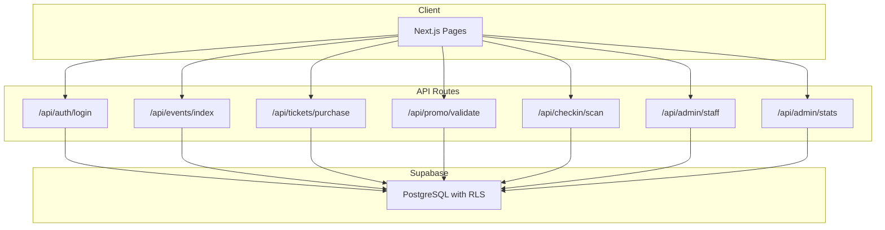
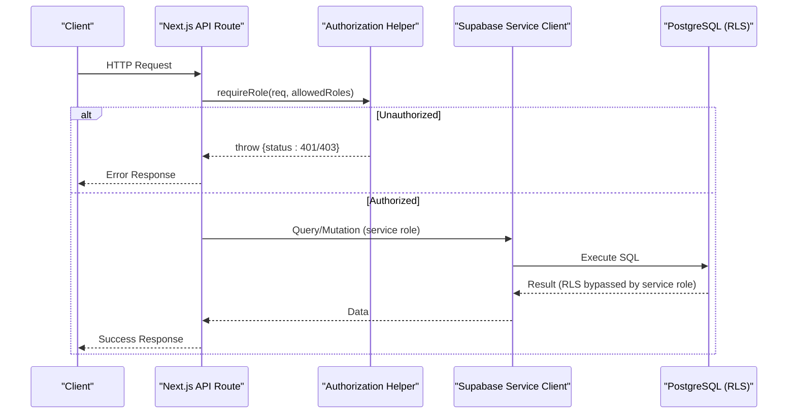
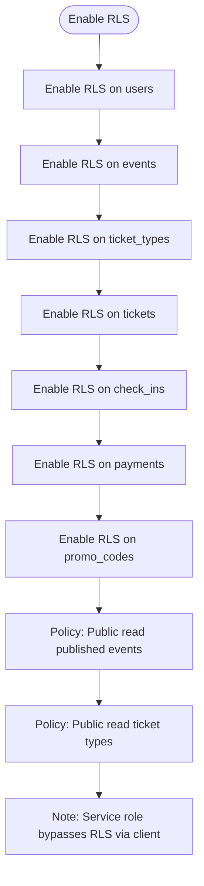
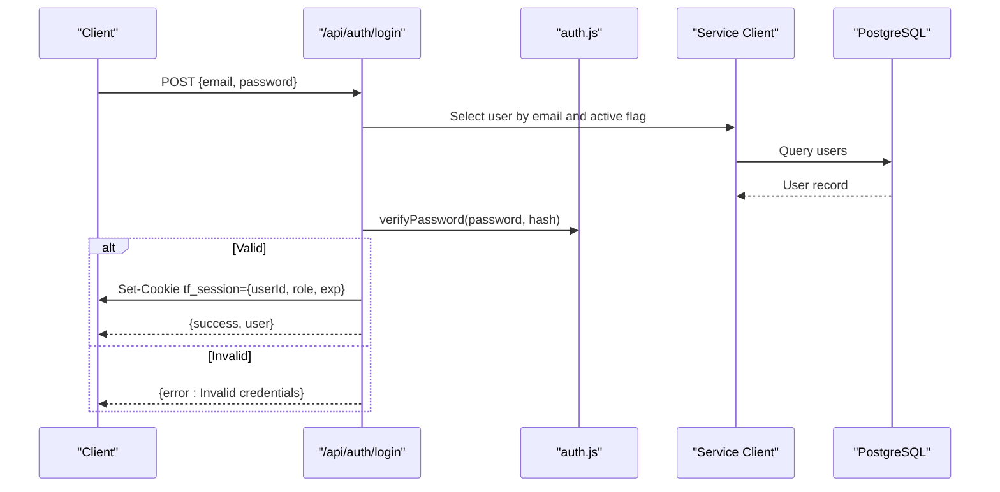
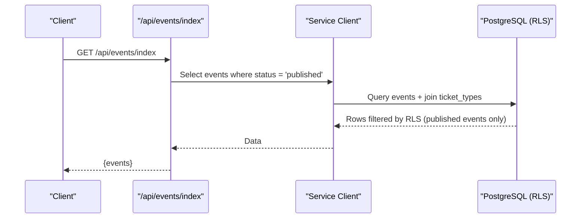
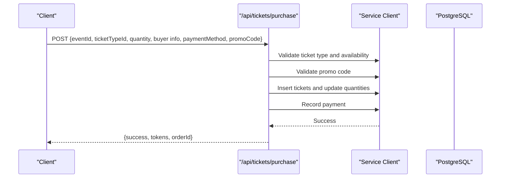
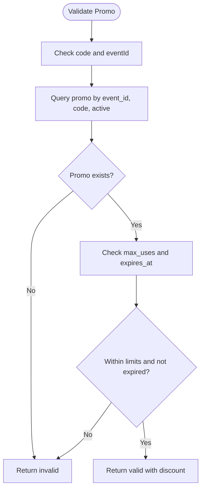
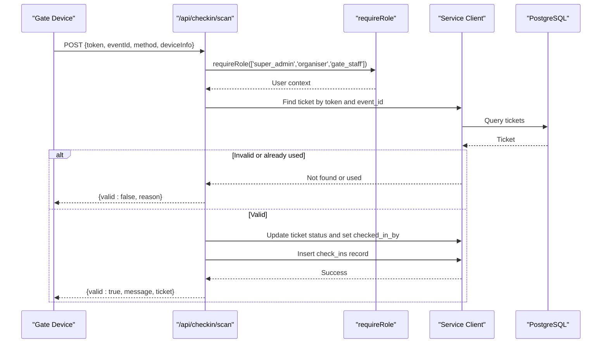
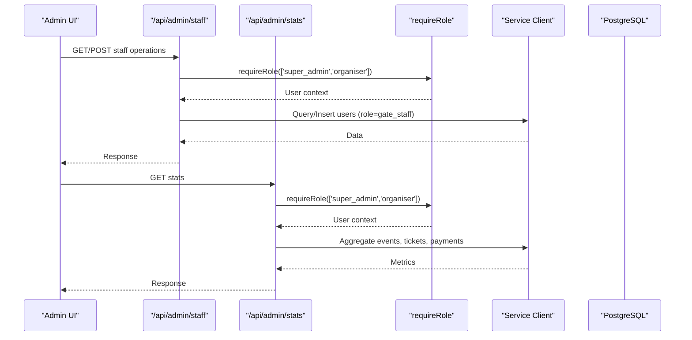
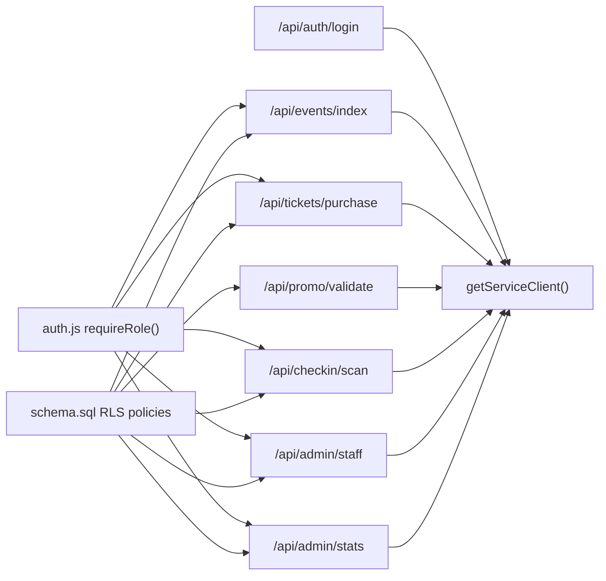

# Row-Level Security Policies

<cite>
**Referenced Files in This Document**
- [schema.sql](file://supabase/schema.sql)
- [supabase.js](file://lib/supabase.js)
- [auth.js](file://lib/auth.js)
- [login.js](file://pages/api/auth/login.js)
- [events/index.js](file://pages/api/events/index.js)
- [tickets/purchase.js](file://pages/api/tickets/purchase.js)
- [promo/validate.js](file://pages/api/promo/validate.js)
- [checkin/scan.js](file://pages/api/checkin/scan.js)
- [admin/staff.js](file://pages/api/admin/staff.js)
- [admin/stats.js](file://pages/api/admin/stats.js)
</cite>

## Table of Contents
1. [Introduction](#introduction)
2. [Project Structure](#project-structure)
3. [Core Components](#core-components)
4. [Architecture Overview](#architecture-overview)
5. [Detailed Component Analysis](#detailed-component-analysis)
6. [Dependency Analysis](#dependency-analysis)
7. [Performance Considerations](#performance-considerations)
8. [Troubleshooting Guide](#troubleshooting-guide)
9. [Conclusion](#conclusion)

## Introduction
This document explains how Supabase Row-Level Security (RLS) is implemented and used within TicketFlow to protect sensitive data and enforce access control across roles: super_admin, organiser, and gate_staff. It details the RLS policies defined for each table, including public read access for published events and ticket types, and clarifies how the service role policy enables API routes to perform privileged operations securely. It also outlines best practices for implementing secure database access and shows how authentication and authorization flows interact with RLS.

## Project Structure
TicketFlow’s security model spans three layers:
- Database layer: RLS policies are declared in the schema definition.
- API layer: Next.js API routes use a service-role client to perform privileged operations after enforcing application-level authorization.
- Client layer: Public endpoints expose only what RLS allows (e.g., published events).

**Section sources**
- [schema.sql:120-143](file://supabase/schema.sql#L120-L143)
- [supabase.js:1-23](file://lib/supabase.js#L1-L23)
- [login.js:1-31](file://pages/api/auth/login.js#L1-L31)
- [events/index.js:1-42](file://pages/api/events/index.js#L1-L42)
- [tickets/purchase.js:1-123](file://pages/api/tickets/purchase.js#L1-L123)
- [promo/validate.js:1-27](file://pages/api/promo/validate.js#L1-L27)
- [checkin/scan.js:1-44](file://pages/api/checkin/scan.js#L1-L44)
- [admin/staff.js:1-28](file://pages/api/admin/staff.js#L1-L28)
- [admin/stats.js:1-41](file://pages/api/admin/stats.js#L1-L41)

## Core Components
- RLS policies enable row-level access control at the database level. They restrict visibility and mutations based on conditions evaluated per row.
- Service role client bypasses RLS for trusted server-side operations executed by API routes.
- Application-level authorization enforces role-based access before invoking database operations.

Key implementation points:
- RLS is enabled for all core tables in the schema.
- Public read policies allow unauthenticated clients to view published events and their ticket types.
- API routes authenticate users via cookies and validate roles using a helper function.
- All database interactions from API routes use the service-role client to ensure consistent behavior independent of RLS.

**Section sources**
- [schema.sql:120-143](file://supabase/schema.sql#L120-L143)
- [supabase.js:15-23](file://lib/supabase.js#L15-L23)
- [auth.js:30-46](file://lib/auth.js#L30-L46)

## Architecture Overview
The system combines application-level authorization with database-level RLS:
- Unauthenticated requests rely on RLS to limit exposure to public data.
- Authenticated requests are validated against required roles in API routes.
- Privileged operations use the service-role client, which bypasses RLS but remains protected by application-level checks.

**Diagram sources**
- [supabase.js:15-23](file://lib/supabase.js#L15-L23)
- [auth.js:38-46](file://lib/auth.js#L38-L46)

**Section sources**
- [supabase.js:1-23](file://lib/supabase.js#L1-L23)
- [auth.js:1-46](file://lib/auth.js#L1-L46)

## Detailed Component Analysis

### RLS Policy Definitions
- RLS is enabled for all tables: users, events, ticket_types, tickets, check_ins, payments, promo_codes.
- Public read policy for events: SELECT allowed when status equals 'published'.
- Public read policy for ticket_types: SELECT allowed when the associated event is published.
- A comment indicates that a service role policy grants full access to all tables for API routes; this is enforced by using the service-role client rather than explicit RLS policies.

**Diagram sources**
- [schema.sql:120-143](file://supabase/schema.sql#L120-L143)

**Section sources**
- [schema.sql:120-143](file://supabase/schema.sql#L120-L143)

### Authentication and Authorization Flow
- Login endpoint validates credentials and issues a session cookie containing user id and role.
- Authorization helper extracts the session cookie, parses it, and enforces required roles.
- API routes call the authorization helper before performing any database operations.

**Diagram sources**
- [login.js:1-31](file://pages/api/auth/login.js#L1-L31)
- [auth.js:1-28](file://lib/auth.js#L1-L28)
- [supabase.js:15-23](file://lib/supabase.js#L15-L23)

**Section sources**
- [login.js:1-31](file://pages/api/auth/login.js#L1-L31)
- [auth.js:1-46](file://lib/auth.js#L1-L46)

### Public Read Access: Events and Ticket Types
- The events index route lists published events and includes related ticket types.
- RLS ensures that even if queries are broad, only rows satisfying the policy conditions are returned.
- For ticket types, the policy checks the parent event’s status to allow public reads.

**Diagram sources**
- [events/index.js:1-42](file://pages/api/events/index.js#L1-L42)
- [schema.sql:130-139](file://supabase/schema.sql#L130-L139)

**Section sources**
- [events/index.js:1-42](file://pages/api/events/index.js#L1-L42)
- [schema.sql:130-139](file://supabase/schema.sql#L130-L139)

### Ticket Purchase Flow and Sensitive Data Protection
- The purchase endpoint validates availability, applies promo codes, and creates tickets and payment records.
- Because it uses the service-role client, it bypasses RLS; however, business logic enforces constraints (availability, promo validity).
- Sensitive buyer information is stored in the tickets table and accessed only through authorized API routes.

**Diagram sources**
- [tickets/purchase.js:1-123](file://pages/api/tickets/purchase.js#L1-L123)

**Section sources**
- [tickets/purchase.js:1-123](file://pages/api/tickets/purchase.js#L1-L123)

### Promo Code Validation
- The validation endpoint checks promo code existence, activity, usage limits, and expiration.
- No RLS policy is needed here because the route uses the service-role client and enforces business rules.

**Diagram sources**
- [promo/validate.js:1-27](file://pages/api/promo/validate.js#L1-L27)

**Section sources**
- [promo/validate.js:1-27](file://pages/api/promo/validate.js#L1-L27)

### Check-in Scanning and Gate Staff Role
- The scan endpoint requires one of super_admin, organiser, or gate_staff roles.
- It verifies ticket validity, prevents duplicate scans, updates ticket status, and records check-ins.
- Uses the service-role client to bypass RLS while relying on application-level authorization.

**Diagram sources**
- [checkin/scan.js:1-44](file://pages/api/checkin/scan.js#L1-L44)

**Section sources**
- [checkin/scan.js:1-44](file://pages/api/checkin/scan.js#L1-L44)

### Admin Operations: Staff Management and Stats
- Staff management requires super_admin or organiser roles and performs CRUD on users with role gate_staff.
- Stats aggregation filters events by organiser_id for non-super admins and computes metrics across tickets and payments.
- Both endpoints use the service-role client and enforce authorization before querying.

**Diagram sources**
- [admin/staff.js:1-28](file://pages/api/admin/staff.js#L1-L28)
- [admin/stats.js:1-41](file://pages/api/admin/stats.js#L1-L41)

**Section sources**
- [admin/staff.js:1-28](file://pages/api/admin/staff.js#L1-L28)
- [admin/stats.js:1-41](file://pages/api/admin/stats.js#L1-L41)

## Dependency Analysis
- API routes depend on:
  - supabase.js getServiceClient() for privileged DB access.
  - auth.js requireRole() for authorization enforcement.
- RLS policies in schema.sql define baseline access controls for public reads and implicitly protect sensitive data.
- The service-role client bypasses RLS; therefore, application-level authorization is critical to prevent unauthorized operations.

**Diagram sources**
- [supabase.js:15-23](file://lib/supabase.js#L15-L23)
- [auth.js:38-46](file://lib/auth.js#L38-L46)
- [schema.sql:120-143](file://supabase/schema.sql#L120-L143)

**Section sources**
- [supabase.js:1-23](file://lib/supabase.js#L1-L23)
- [auth.js:1-46](file://lib/auth.js#L1-L46)
- [schema.sql:120-143](file://supabase/schema.sql#L120-L143)

## Performance Considerations
- RLS policies should be selective and indexed appropriately to avoid full-table scans.
- Use targeted queries in API routes to minimize data transfer and processing overhead.
- Avoid unnecessary joins; leverage Supabase’s query builder to fetch only required fields.
- Cache frequently accessed public data at the edge or CDN where appropriate.

[No sources needed since this section provides general guidance]

## Troubleshooting Guide
Common issues and resolutions:
- Missing environment variables: Ensure NEXT_PUBLIC_SUPABASE_URL, NEXT_PUBLIC_SUPABASE_ANON_KEY, and SUPABASE_SERVICE_ROLE_KEY are configured.
- Authentication failures: Verify cookie parsing and session token expiration handling.
- Authorization errors: Confirm required roles match the user’s role in the session token.
- RLS unexpected results: Review policy conditions and ensure queries align with expected filters.

**Section sources**
- [supabase.js:1-14](file://lib/supabase.js#L1-L14)
- [auth.js:20-28](file://lib/auth.js#L20-L28)
- [auth.js:38-46](file://lib/auth.js#L38-L46)
- [schema.sql:120-143](file://supabase/schema.sql#L120-L143)

## Conclusion
TicketFlow’s security model combines Supabase RLS with robust application-level authorization. Public read access is safely exposed through RLS policies, while sensitive operations are guarded by role checks and executed via the service-role client. Following the documented patterns and best practices ensures secure, maintainable database access aligned with user roles and business requirements.

[No sources needed since this section summarizes without analyzing specific files]