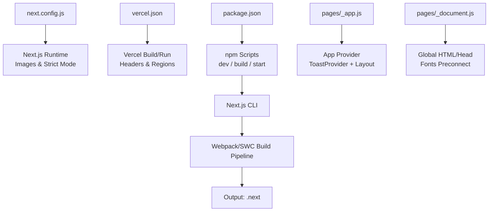
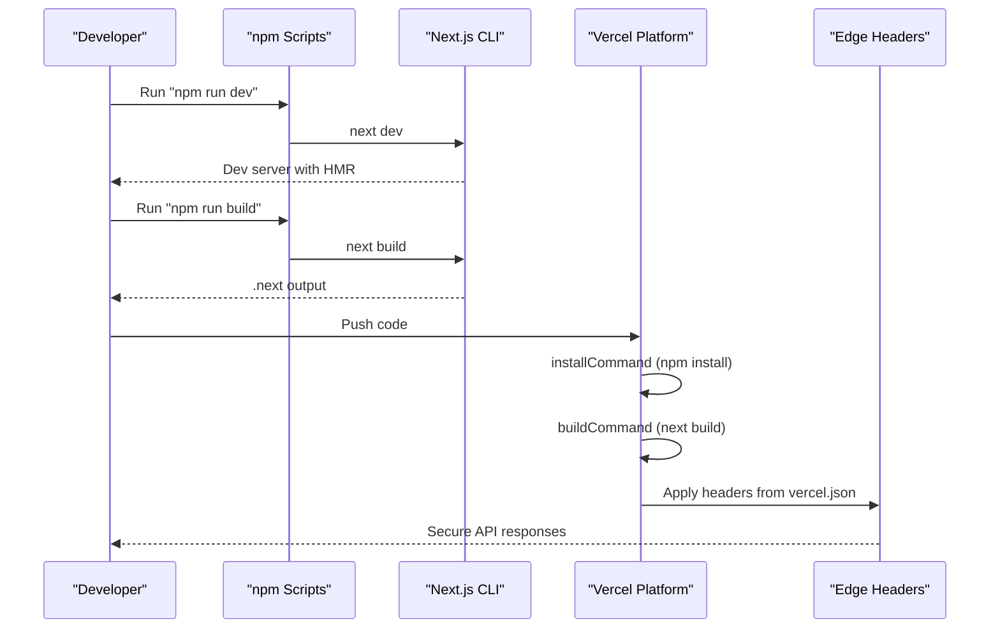
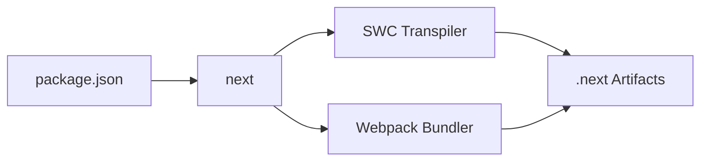

# Build Configuration

<cite>
**Referenced Files in This Document**
- [next.config.js](file://next.config.js)
- [package.json](file://package.json)
- [vercel.json](file://vercel.json)
- [_app.js](file://pages/_app.js)
- [_document.js](file://pages/_document.js)
</cite>

## Table of Contents
1. [Introduction](#introduction)
2. [Project Structure](#project-structure)
3. [Core Components](#core-components)
4. [Architecture Overview](#architecture-overview)
5. [Detailed Component Analysis](#detailed-component-analysis)
6. [Dependency Analysis](#dependency-analysis)
7. [Performance Considerations](#performance-considerations)
8. [Troubleshooting Guide](#troubleshooting-guide)
9. [Conclusion](#conclusion)

## Introduction
This document explains the build configuration for TicketFlow’s Next.js application. It covers next.config.js settings, webpack behavior, custom headers, redirects and rewrites, build optimization options, bundle analysis, performance tuning, package.json scripts, Babel and TypeScript support, asset optimization, build caching strategies, and incremental static regeneration (ISR). The goal is to provide a clear, actionable guide for developers setting up, building, and optimizing the project locally and on Vercel.

## Project Structure
TicketFlow uses a standard Next.js Pages Router structure with minimal build-time configuration:
- next.config.js defines runtime and image optimizations.
- vercel.json configures deployment commands, regions, and API security headers.
- package.json provides development, build, and start scripts.
- pages/_app.js and pages/_document.js customize app-level providers and global HTML/head resources.

**Diagram sources**
- [next.config.js:1-14](file://next.config.js#L1-L14)
- [vercel.json:1-18](file://vercel.json#L1-L18)
- [package.json:1-24](file://package.json#L1-L24)
- [_app.js:1-14](file://pages/_app.js#L1-L14)
- [_document.js:1-22](file://pages/_document.js#L1-L22)

**Section sources**
- [next.config.js:1-14](file://next.config.js#L1-L14)
- [package.json:1-24](file://package.json#L1-L24)
- [vercel.json:1-18](file://vercel.json#L1-L18)
- [_app.js:1-14](file://pages/_app.js#L1-L14)
- [_document.js:1-22](file://pages/_document.js#L1-L22)

## Core Components
- next.config.js: Enables React Strict Mode and configures allowed remote image domains via images.remotePatterns.
- vercel.json: Sets framework, build/start commands, install command, region, and security headers for API routes.
- package.json: Defines npm scripts for dev, build, and production server.
- pages/_app.js: Wraps all pages with ToastProvider and default layout.
- pages/_document.js: Adds preconnect links and Google Fonts stylesheet.

Key implications:
- Image optimization is enabled through Next.js built-in <Image> with strict allowlist for remote patterns.
- Security headers are applied at the edge for API routes during Vercel deployments.
- Development and production workflows are driven by Next.js CLI via npm scripts.

**Section sources**
- [next.config.js:1-14](file://next.config.js#L1-L14)
- [vercel.json:1-18](file://vercel.json#L1-L18)
- [package.json:1-24](file://package.json#L1-L24)
- [_app.js:1-14](file://pages/_app.js#L1-L14)
- [_document.js:1-22](file://pages/_document.js#L1-L22)

## Architecture Overview
The build pipeline is straightforward:
- Local development runs next dev, which starts the Next.js dev server with hot reloading.
- Production builds run next build, producing optimized assets under .next.
- Deployment on Vercel uses vercel.json to orchestrate install, build, and serve commands, and applies headers at the edge.

**Diagram sources**
- [package.json:1-24](file://package.json#L1-L24)
- [vercel.json:1-18](file://vercel.json#L1-L18)

## Detailed Component Analysis

### next.config.js: Image Optimization and Strict Mode
- reactStrictMode: true enables React Strict Mode for better debugging and early error detection.
- images.remotePatterns: Whitelists specific hostnames for remote images, ensuring only trusted sources are used by Next.js Image optimization.

Implications:
- Only images from the configured domains will be processed by Next.js Image.
- RemotePattern rules must include protocol and hostname; wildcard subdomains are supported.

**Section sources**
- [next.config.js:1-14](file://next.config.js#L1-L14)

### vercel.json: Deployment Commands and API Headers
- framework: nextjs signals Vercel to use Next.js conventions.
- buildCommand/devCommand/installCommand: Standard Next.js workflow on Vercel.
- regions: Deploys to iad1 region.
- headers: Applies security headers to all API routes.

Security headers applied:
- X-Content-Type-Options: nosniff
- X-Frame-Options: DENY
- X-XSS-Protection: 1; mode=block

**Section sources**
- [vercel.json:1-18](file://vercel.json#L1-L18)

### package.json: Scripts and Dependencies
Scripts:
- dev: next dev
- build: next build
- start: next start

Dependencies relevant to build/runtime:
- next: ^15.0.0
- react/react-dom: ^19.0.0
- stripe, @stripe/*, resend, uuid, bcryptjs, qrcode.react, @supabase/supabase-js

Notes:
- No explicit Babel or TypeScript tooling is present; Next.js handles transpilation via SWC.
- PostCSS is included via Next.js defaults.

**Section sources**
- [package.json:1-24](file://package.json#L1-L24)

### pages/_app.js: App-Level Providers
- Imports global styles and Layout.
- Wraps each page with ToastProvider and default Layout.
- Ensures consistent UI context across pages.

**Section sources**
- [_app.js:1-14](file://pages/_app.js#L1-L14)

### pages/_document.js: Global HTML and Head
- Adds preconnect links to fonts.googleapis.com and fonts.gstatic.com.
- Loads multiple Google Fonts families via a single stylesheet link.
- Uses Next’s Html, Head, Main, NextScript components.

**Section sources**
- [_document.js:1-22](file://pages/_document.js#L1-L22)

## Dependency Analysis
Build-time dependencies and their roles:
- next: Provides the framework, CLI, and build pipeline.
- react/react-dom: Core UI libraries.
- stripe and @stripe/*: Payment integration.
- resend: Email delivery.
- @supabase/supabase-js: Database/auth client.
- bcryptjs: Password hashing utilities.
- qrcode.react: QR code generation.
- uuid: Unique ID generation.

No explicit webpack customization exists; Next.js manages bundling via SWC and Webpack internally.

[No sources needed since this diagram shows conceptual workflow, not actual code structure]

**Section sources**
- [package.json:1-24](file://package.json#L1-L24)

## Performance Considerations
- Images: Use Next.js Image component with configured remotePatterns to benefit from automatic resizing, lazy loading, and format optimization.
- Fonts: Preconnect to font CDNs and load a combined stylesheet to reduce render-blocking delays.
- Strict Mode: Enabled for improved developer experience and early detection of issues.
- API Headers: Security headers are enforced at the edge for API routes.

Recommendations:
- Keep remotePatterns minimal to avoid unnecessary image processing.
- Monitor bundle size using Next.js built-in reports or third-party tools.
- Prefer server-side data fetching where appropriate to reduce client payload.

**Section sources**
- [next.config.js:1-14](file://next.config.js#L1-L14)
- [_document.js:1-22](file://pages/_document.js#L1-L22)
- [vercel.json:1-18](file://vercel.json#L1-L18)

## Troubleshooting Guide
Common issues and resolutions:
- Images failing to load: Ensure the domain matches images.remotePatterns exactly (protocol and hostname). Wildcard subdomains are supported.
- API security headers missing: Verify vercel.json headers configuration and that requests go through Vercel’s edge.
- Build failures due to Node version: Ensure your environment meets Next.js requirements; Next.js 15 typically requires a recent LTS Node version.
- Font loading delays: Confirm preconnect links are present and network access to Google Fonts is allowed.

**Section sources**
- [next.config.js:1-14](file://next.config.js#L1-L14)
- [vercel.json:1-18](file://vercel.json#L1-L18)
- [_document.js:1-22](file://pages/_document.js#L1-L22)

## Conclusion
TicketFlow’s build configuration is intentionally minimal, leveraging Next.js defaults for optimal performance and developer ergonomics. Customizations focus on image allowlists, global fonts, and API security headers. For advanced needs like custom webpack rules, bundle analysis, or ISR, extend next.config.js accordingly and integrate additional tooling as required.