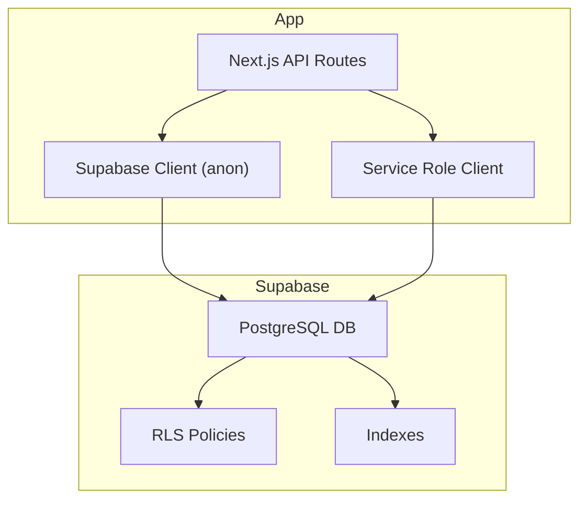
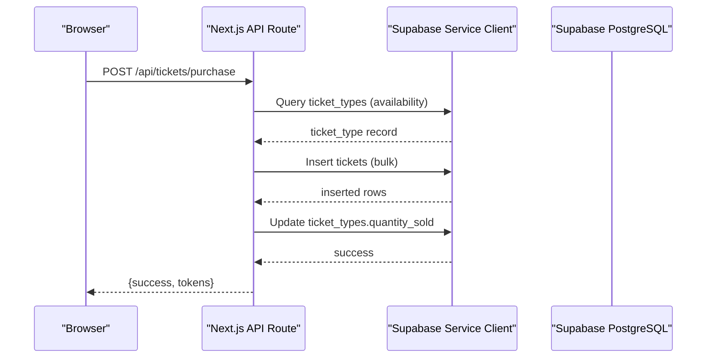
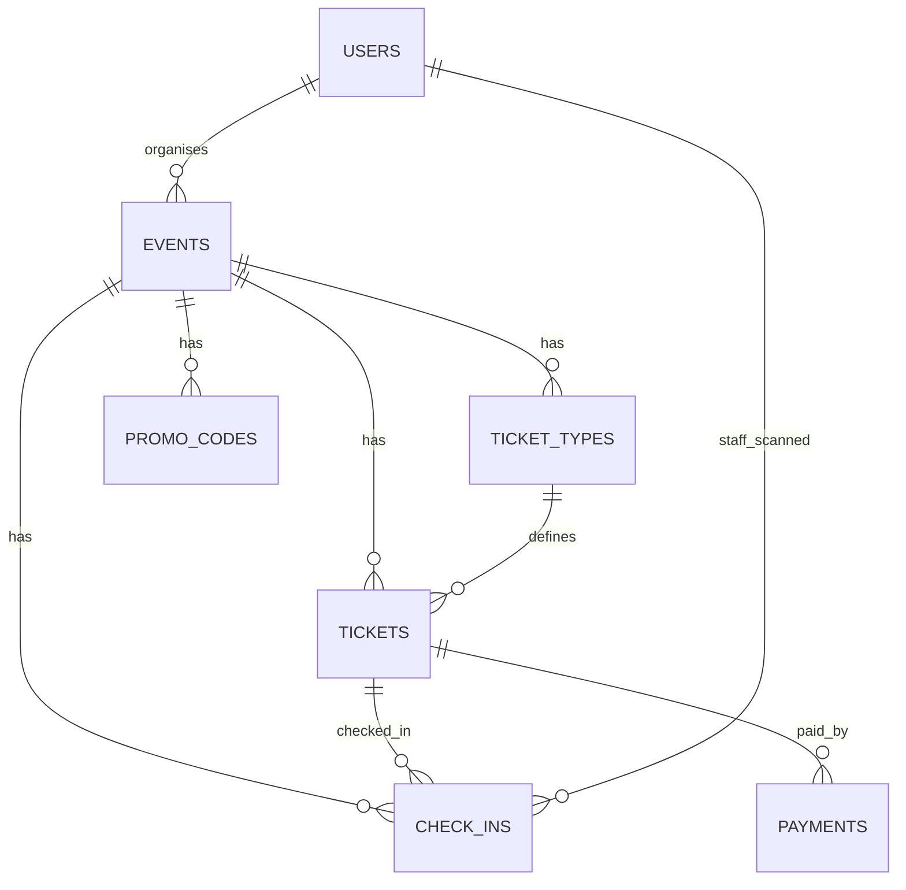
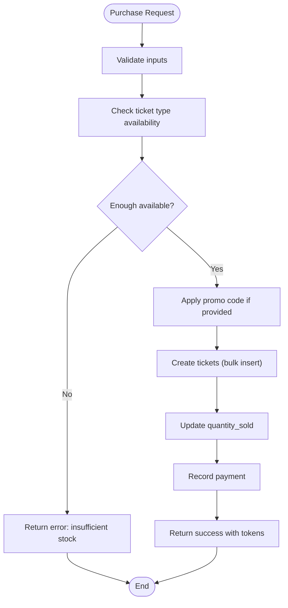
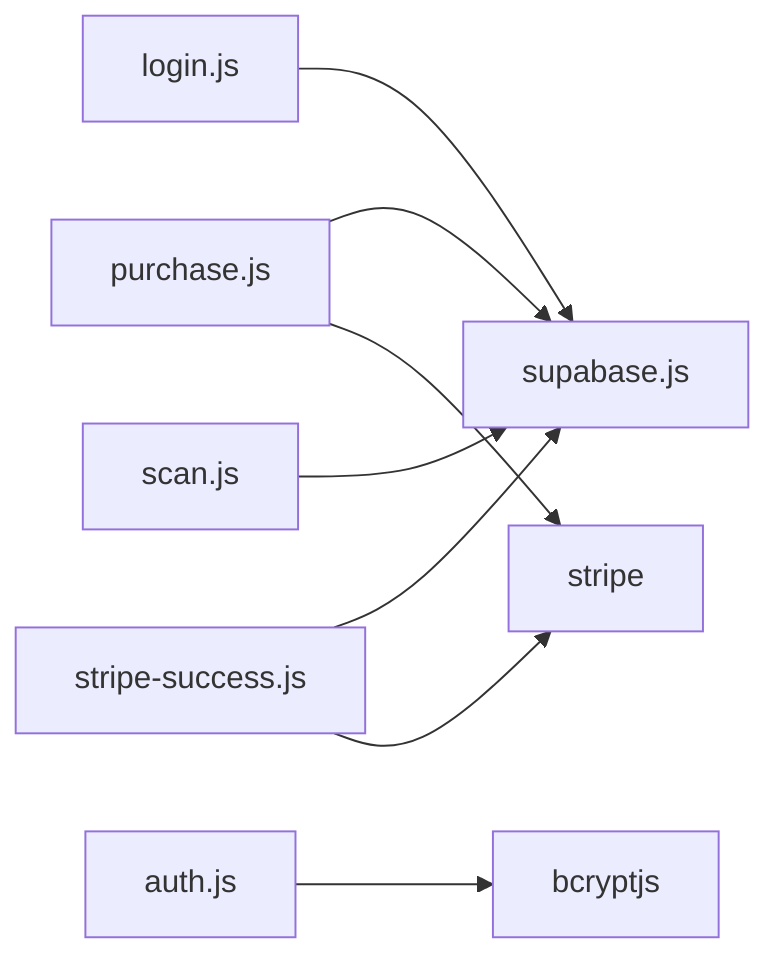

# Database Deployment

<cite>
**Referenced Files in This Document**
- [schema.sql](file://supabase/schema.sql)
- [supabase.js](file://lib/supabase.js)
- [login.js](file://pages/api/auth/login.js)
- [purchase.js](file://pages/api/tickets/purchase.js)
- [stripe-success.js](file://pages/api/tickets/stripe-success.js)
- [scan.js](file://pages/api/checkin/scan.js)
- [auth.js](file://lib/auth.js)
- [package.json](file://package.json)
</cite>

## Table of Contents
1. [Introduction](#introduction)
2. [Project Structure](#project-structure)
3. [Core Components](#core-components)
4. [Architecture Overview](#architecture-overview)
5. [Detailed Component Analysis](#detailed-component-analysis)
6. [Dependency Analysis](#dependency-analysis)
7. [Performance Considerations](#performance-considerations)
8. [Troubleshooting Guide](#troubleshooting-guide)
9. [Conclusion](#conclusion)
10. [Appendices](#appendices)

## Introduction
This document provides comprehensive database deployment guidance for TicketFlow’s Supabase setup. It explains the schema structure, table relationships, constraints, row-level security policies, indexes, and performance considerations. It also covers migration procedures across environments, backup and recovery, data seeding for development, testing strategies, connection pooling behavior, query optimization, monitoring, and troubleshooting common issues.

## Project Structure
The database configuration is centralized in a single SQL schema file under the supabase directory. The application uses the Supabase JavaScript client to interact with the database from both server-side API routes and client code. Environment variables configure the Supabase URL and keys.

**Diagram sources**
- [schema.sql:120-142](file://supabase/schema.sql#L120-L142)
- [schema.sql:147-153](file://supabase/schema.sql#L147-L153)
- [supabase.js:10-22](file://lib/supabase.js#L10-L22)

**Section sources**
- [schema.sql:1-166](file://supabase/schema.sql#L1-L166)
- [supabase.js:1-23](file://lib/supabase.js#L1-L23)

## Core Components
- Schema definition and constraints: All tables, constraints, and defaults are defined in the schema file.
- Row-Level Security (RLS): RLS is enabled on all core tables; public read policies exist for published events and their ticket types.
- Indexes: Performance-critical columns are indexed.
- Clients: An anon client for general access and a service role client for privileged operations in API routes.

Key responsibilities:
- schema.sql: Defines entities, relationships, constraints, RLS policies, indexes, and seed data.
- lib/supabase.js: Exports an anon client and a service-role client used by API routes.
- API routes: Use the service-role client to perform authenticated writes and reads as needed.

**Section sources**
- [schema.sql:10-117](file://supabase/schema.sql#L10-L117)
- [schema.sql:120-142](file://supabase/schema.sql#L120-L142)
- [schema.sql:147-153](file://supabase/schema.sql#L147-L153)
- [supabase.js:10-22](file://lib/supabase.js#L10-L22)

## Architecture Overview
TicketFlow uses a Next.js backend with Supabase-hosted PostgreSQL. API routes use the Supabase JS client with either the anon key or the service role key depending on the operation. RLS enforces fine-grained access control at the database level.

**Diagram sources**
- [purchase.js:14-102](file://pages/api/tickets/purchase.js#L14-L102)
- [supabase.js:16-22](file://lib/supabase.js#L16-L22)

## Detailed Component Analysis

### Schema and Data Model
The schema defines seven core tables with clear relationships and constraints:
- users: Authentication and roles.
- events: Event metadata and status.
- ticket_types: Per-event ticket categories with pricing and availability.
- tickets: Individual tickets linked to event and type.
- check_ins: Check-in records tied to tickets and staff.
- payments: Payment records per ticket.
- promo_codes: Discount codes scoped to events.

Relationships and constraints:
- events.organiser_id references users.id (ON DELETE SET NULL).
- ticket_types.event_id references events.id (ON DELETE CASCADE).
- tickets.event_id references events.id (ON DELETE CASCADE), tickets.ticket_type_id references ticket_types.id (ON DELETE CASCADE).
- check_ins.ticket_id references tickets.id (ON DELETE CASCADE), check_ins.event_id references events.id (ON DELETE CASCADE), check_ins.staff_id references users.id (ON DELETE SET NULL).
- payments.ticket_id references tickets.id (ON DELETE CASCADE).
- promo_codes.event_id references events.id (ON DELETE CASCADE), unique(event_id, code).

Indexes:
- events.slug, events.status
- tickets.qr_code_token, tickets.buyer_email, tickets.event_id
- check_ins.event_id
- payments.ticket_id

Row-Level Security:
- RLS enabled on all tables.
- Public SELECT policy for events where status = 'published'.
- Public SELECT policy for ticket_types where the related event is published.

Seed data:
- Default super admin user inserted if not present.

**Diagram sources**
- [schema.sql:10-117](file://supabase/schema.sql#L10-L117)

**Section sources**
- [schema.sql:10-117](file://supabase/schema.sql#L10-L117)
- [schema.sql:147-153](file://supabase/schema.sql#L147-L153)
- [schema.sql:156-166](file://supabase/schema.sql#L156-L166)

### Row-Level Security Policies
RLS is enabled on all tables. Current policies:
- Public can select published events.
- Public can select ticket types only when associated with a published event.
- Service role bypasses RLS and is used by API routes for privileged operations.

Recommendations:
- Add policies for authenticated users to manage their own tickets and view purchase history.
- Restrict write access to ticket_types and promo_codes to organisers via policies.
- Ensure check_ins and payments are only writable by service role or authorized staff roles.

**Section sources**
- [schema.sql:120-142](file://supabase/schema.sql#L120-L142)

### API Interactions and Transactions
- Login: Uses service role client to fetch user by email and verify password hash.
- Purchase flow: Validates ticket type availability, applies promo codes, creates tickets, updates sold quantities, and records payment.
- Stripe success: On successful payment, creates tickets, updates sold quantities, and records payment details.
- Check-in scan: Validates ticket state, marks as checked in, and logs check-in.

**Diagram sources**
- [purchase.js:14-117](file://pages/api/tickets/purchase.js#L14-L117)

**Section sources**
- [login.js:1-31](file://pages/api/auth/login.js#L1-L31)
- [purchase.js:1-123](file://pages/api/tickets/purchase.js#L1-L123)
- [stripe-success.js:1-55](file://pages/api/tickets/stripe-success.js#L1-L55)
- [scan.js:1-44](file://pages/api/checkin/scan.js#L1-L44)

### Connection Management and Pooling
- Supabase JS client manages connections automatically. In serverless environments (e.g., Vercel), each function invocation may create a new client instance.
- Reuse patterns: Keep client instances at module scope to minimize reinitialization within a process lifetime.
- Service role vs anon: Use anon for read-only/public operations; use service role for privileged writes in API routes.

Best practices:
- Avoid creating clients inside hot paths repeatedly.
- Ensure environment variables are set correctly to prevent placeholder usage.

**Section sources**
- [supabase.js:1-23](file://lib/supabase.js#L1-L23)

## Dependency Analysis
Database dependencies and interactions:
- API routes depend on Supabase client exports.
- Auth utilities rely on bcryptjs for password hashing and session token handling.
- Package dependencies include @supabase/supabase-js and stripe integration.

**Diagram sources**
- [login.js:1-31](file://pages/api/auth/login.js#L1-L31)
- [purchase.js:1-123](file://pages/api/tickets/purchase.js#L1-L123)
- [stripe-success.js:1-55](file://pages/api/tickets/stripe-success.js#L1-L55)
- [scan.js:1-44](file://pages/api/checkin/scan.js#L1-L44)
- [auth.js:1-46](file://lib/auth.js#L1-L46)
- [package.json:10-22](file://package.json#L10-L22)

**Section sources**
- [package.json:10-22](file://package.json#L10-L22)

## Performance Considerations
- Indexes: Existing indexes cover frequent lookups (slug, status, qr_code_token, buyer_email, event_id, event_id on check_ins, ticket_id on payments).
- Queries: Prefer selective WHERE clauses using indexed columns; avoid full-table scans.
- Bulk inserts: Use batch inserts for tickets to reduce round trips.
- RLS overhead: Keep policies simple and indexed-friendly to minimize evaluation cost.
- Monitoring: Enable slow query logging and analyze query plans in Supabase dashboard.

Optimization recommendations:
- Add composite indexes where queries filter on multiple columns (e.g., event_id + status).
- Use EXPLAIN ANALYZE to validate index usage.
- Cache frequently accessed event listings at the application layer if appropriate.

[No sources needed since this section provides general guidance]

## Troubleshooting Guide
Common issues and resolutions:
- Missing environment variables: Ensure NEXT_PUBLIC_SUPABASE_URL, NEXT_PUBLIC_SUPABASE_ANON_KEY, and SUPABASE_SERVICE_ROLE_KEY are configured.
- RLS denials: Verify policies allow the intended operations; use service role for privileged writes.
- Duplicate promo codes: Enforce unique constraint on (event_id, code); handle conflicts gracefully.
- Ticket availability race conditions: Implement optimistic concurrency checks or database-level triggers to prevent overselling.
- Stripe webhook failures: Ensure idempotency and proper error handling when recording payments.
- Slow queries: Review execution plans and add missing indexes.

Operational tips:
- Log errors consistently in API routes.
- Validate inputs before DB operations to fail fast.
- Use transactions for multi-step operations where supported.

**Section sources**
- [supabase.js:6-8](file://lib/supabase.js#L6-L8)
- [schema.sql:120-142](file://supabase/schema.sql#L120-L142)
- [schema.sql:107-117](file://supabase/schema.sql#L107-L117)
- [purchase.js:118-122](file://pages/api/tickets/purchase.js#L118-L122)
- [stripe-success.js:50-54](file://pages/api/tickets/stripe-success.js#L50-L54)

## Conclusion
TicketFlow’s database design is straightforward and secure, leveraging Supabase’s RLS and indexing capabilities. By following the migration, backup, and monitoring guidelines outlined here, teams can deploy confidently across environments while maintaining performance and reliability.

[No sources needed since this section summarizes without analyzing specific files]

## Appendices

### Migration Process Across Environments
- Development:
  - Run schema.sql in Supabase SQL editor to initialize the database.
  - Seed default super admin user.
- Staging/Production:
  - Version-control schema changes and apply via CI/CD pipeline to target Supabase projects.
  - Use Supabase CLI or SQL migrations to roll out changes incrementally.
  - Test migrations against staging before production rollout.

Recommended steps:
- Back up the database before applying migrations.
- Validate schema integrity post-migration.
- Rollback plan: keep previous schema version and revert script ready.

[No sources needed since this section provides general guidance]

### Backup and Recovery Procedures
- Automated backups: Enable Supabase automated backups and point-in-time recovery.
- Manual snapshots: Export critical tables periodically for compliance and disaster recovery.
- Restore process:
  - Provision a fresh Supabase project.
  - Apply schema.sql.
  - Import latest backup snapshot.
  - Verify data integrity and run smoke tests.

[No sources needed since this section provides general guidance]

### Data Seeding for Development
- Default super admin user is seeded via schema.sql.
- Additional seed scripts can be created for test events, ticket types, and sample data.
- Use separate seed datasets for dev, staging, and QA environments.

**Section sources**
- [schema.sql:156-166](file://supabase/schema.sql#L156-L166)

### Testing Strategies
- Unit tests: Validate input validation and business logic in API routes.
- Integration tests: Use a test Supabase project with isolated schema and fixtures.
- Load tests: Simulate high-concurrency purchases to validate availability checks and performance.
- RLS tests: Assert that public policies restrict access appropriately.

[No sources needed since this section provides general guidance]

### Database Connection Pooling and Query Optimization
- Supabase client handles connection lifecycle; reuse client instances where possible.
- Optimize queries by selecting only necessary columns and filtering on indexed fields.
- Monitor query performance using Supabase dashboard and enable slow query logs.

**Section sources**
- [supabase.js:10-22](file://lib/supabase.js#L10-L22)

### Monitoring Setup
- Enable Supabase analytics and query insights.
- Set alerts for failed requests and slow queries.
- Track key metrics: ticket sales rate, check-in throughput, payment success rate.

[No sources needed since this section provides general guidance]