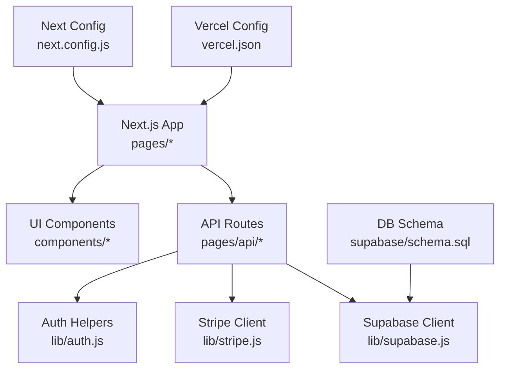
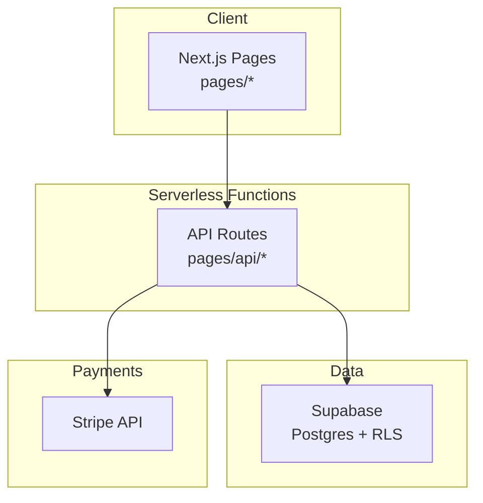
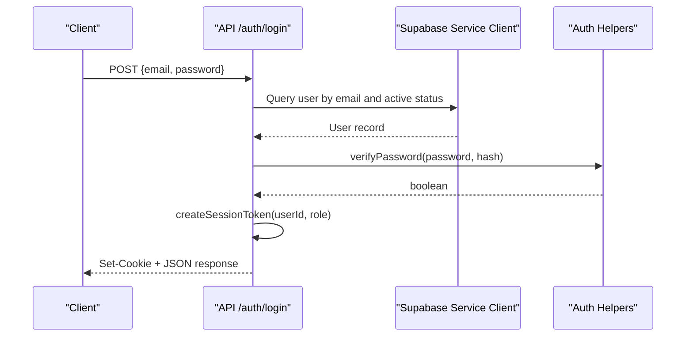
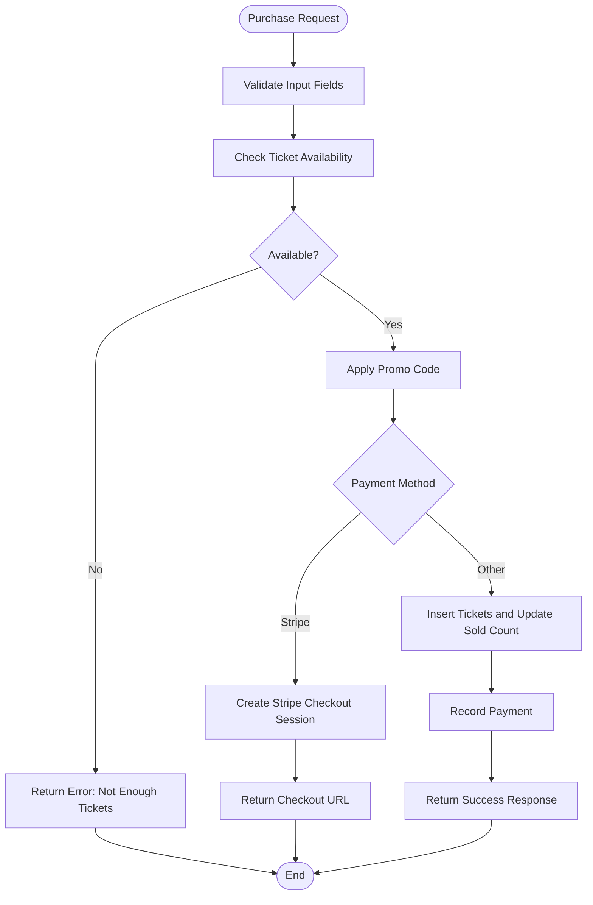

# Deployment & Configuration

<cite>
**Referenced Files in This Document**
- [next.config.js](file://next.config.js)
- [vercel.json](file://vercel.json)
- [package.json](file://package.json)
- [schema.sql](file://supabase/schema.sql)
- [supabase.js](file://lib/supabase.js)
- [auth.js](file://lib/auth.js)
- [stripe.js](file://lib/stripe.js)
- [.gitignore](file://.gitignore)
- [login.js](file://pages/api/auth/login.js)
- [purchase.js](file://pages/api/tickets/purchase.js)
- [_app.js](file://pages/_app.js)
</cite>

## Table of Contents
1. [Introduction](#introduction)
2. [Project Structure](#project-structure)
3. [Core Components](#core-components)
4. [Architecture Overview](#architecture-overview)
5. [Detailed Component Analysis](#detailed-component-analysis)
6. [Dependency Analysis](#dependency-analysis)
7. [Performance Considerations](#performance-considerations)
8. [Troubleshooting Guide](#troubleshooting-guide)
9. [Conclusion](#conclusion)
10. [Appendices](#appendices)

## Introduction
This document provides comprehensive deployment and configuration guidance for TicketFlow, a Next.js application integrated with Supabase for data and Stripe for payments. It covers environment setup across development, staging, and production; Next.js build and optimization settings; Vercel deployment configuration; database schema and security policies; SSL/CDN considerations; monitoring and logging; CI/CD automation; and troubleshooting strategies.

## Project Structure
TicketFlow is organized as a standard Next.js app:
- pages/: API routes and UI pages
- lib/: Shared utilities (Supabase client, authentication helpers, Stripe client)
- components/: Reusable UI components
- supabase/: Database schema definition
- next.config.js: Next.js runtime configuration
- vercel.json: Vercel deployment configuration
- package.json: Dependencies and scripts



**Diagram sources**
- [next.config.js:1-14](file://next.config.js#L1-L14)
- [vercel.json:1-18](file://vercel.json#L1-L18)
- [package.json:1-24](file://package.json#L1-L24)
- [schema.sql:1-166](file://supabase/schema.sql#L1-L166)
- [supabase.js:1-23](file://lib/supabase.js#L1-L23)
- [auth.js:1-47](file://lib/auth.js#L1-L47)
- [stripe.js:1-6](file://lib/stripe.js#L1-L6)

**Section sources**
- [next.config.js:1-14](file://next.config.js#L1-L14)
- [vercel.json:1-18](file://vercel.json#L1-L18)
- [package.json:1-24](file://package.json#L1-L24)

## Core Components
- Next.js Application: Entry point and layout provider are defined in the app entry file.
- Supabase Integration: Client initialization and service role client for server-side operations.
- Authentication: Password hashing, session token creation, and role-based access control.
- Payments: Stripe client initialization and checkout session creation within API routes.

Key responsibilities:
- Environment variables for Supabase and Stripe are consumed at runtime.
- API routes enforce HTTP methods, validate inputs, and interact with Supabase via service role client.
- Security headers are applied to API endpoints via Vercel configuration.

**Section sources**
- [_app.js:1-14](file://pages/_app.js#L1-L14)
- [supabase.js:1-23](file://lib/supabase.js#L1-L23)
- [auth.js:1-47](file://lib/auth.js#L1-L47)
- [stripe.js:1-6](file://lib/stripe.js#L1-L6)
- [login.js:1-31](file://pages/api/auth/login.js#L1-L31)
- [purchase.js:1-123](file://pages/api/tickets/purchase.js#L1-L123)

## Architecture Overview
The system comprises:
- Frontend: Next.js pages and components
- Backend: Next.js API routes
- Data: Supabase Postgres with Row Level Security policies
- Payments: Stripe Checkout sessions
- Deployment: Vercel with custom headers and regions



**Diagram sources**
- [next.config.js:1-14](file://next.config.js#L1-L14)
- [vercel.json:1-18](file://vercel.json#L1-L18)
- [supabase.js:1-23](file://lib/supabase.js#L1-L23)
- [stripe.js:1-6](file://lib/stripe.js#L1-L6)
- [schema.sql:1-166](file://supabase/schema.sql#L1-L166)

## Detailed Component Analysis

### Next.js Configuration and Build
- Strict Mode enabled for safer React behavior.
- Remote image domains configured for Unsplash and Supabase image hosts.
- Build and start scripts provided in package.json.

Optimization notes:
- Ensure images are served from allowed remote patterns.
- Use Next.js built-in optimizations (static generation where applicable).

**Section sources**
- [next.config.js:1-14](file://next.config.js#L1-L14)
- [package.json:1-24](file://package.json#L1-L24)

### Vercel Deployment Configuration
- Framework set to Next.js with explicit build and dev commands.
- Install command specified for dependency resolution.
- Region set to iad1 for deployment location.
- Security headers applied to all API routes.

Environment variables:
- NEXT_PUBLIC_SUPABASE_URL
- NEXT_PUBLIC_SUPABASE_ANON_KEY
- SUPABASE_SERVICE_ROLE_KEY
- STRIPE_SECRET_KEY
- NEXT_PUBLIC_SITE_URL

Domain setup:
- Configure custom domain in Vercel dashboard.
- Ensure NEXT_PUBLIC_SITE_URL matches the deployed domain.

**Section sources**
- [vercel.json:1-18](file://vercel.json#L1-L18)
- [package.json:1-24](file://package.json#L1-L24)

### Supabase Database Setup and Security Policies
Schema includes users, events, ticket_types, tickets, check_ins, payments, promo_codes with constraints and indexes.
Row Level Security (RLS) is enabled on all tables.
Public read policies allow viewing published events and associated ticket types.
Service role key used by API routes for privileged operations.

Indexes improve query performance for common lookups (slug, status, tokens, emails, event_id, etc.).

Security recommendations:
- Restrict RLS policies further based on roles.
- Enforce input validation in API routes.
- Rotate service role keys regularly.

**Section sources**
- [schema.sql:1-166](file://supabase/schema.sql#L1-L166)
- [supabase.js:1-23](file://lib/supabase.js#L1-L23)

### Authentication Flow
- Login endpoint validates email/password against Supabase users table.
- Session token created and stored in an HttpOnly cookie.
- Role-based authorization enforced via requireRole helper.

Security considerations:
- Use HTTPS-only cookies in production.
- Implement CSRF protection if needed.
- Prefer managed auth providers for enhanced security.



**Diagram sources**
- [login.js:1-31](file://pages/api/auth/login.js#L1-L31)
- [auth.js:1-47](file://lib/auth.js#L1-L47)
- [supabase.js:1-23](file://lib/supabase.js#L1-L23)

**Section sources**
- [login.js:1-31](file://pages/api/auth/login.js#L1-L31)
- [auth.js:1-47](file://lib/auth.js#L1-L47)

### Ticket Purchase Flow
- Validates required fields and checks ticket availability.
- Applies promo codes when valid and active.
- Creates Stripe Checkout session for card payments or records immediate purchase for other methods.
- Inserts tickets and updates sold quantities.
- Records payment status accordingly.



**Diagram sources**
- [purchase.js:1-123](file://pages/api/tickets/purchase.js#L1-L123)
- [supabase.js:1-23](file://lib/supabase.js#L1-L23)

**Section sources**
- [purchase.js:1-123](file://pages/api/tickets/purchase.js#L1-L123)

### SSL Certificate Configuration and CDN Setup
- Vercel automatically provisions SSL certificates for custom domains.
- Ensure NEXT_PUBLIC_SITE_URL uses HTTPS.
- CDN caching can be tuned via Vercel headers and Next.js cache-control directives.

Recommendations:
- Enable HSTS and secure headers globally.
- Cache static assets aggressively; invalidate on deployments.
- Use Supabase storage CDN for images.

**Section sources**
- [vercel.json:1-18](file://vercel.json#L1-L18)
- [next.config.js:1-14](file://next.config.js#L1-L14)

### Monitoring, Logging, and Error Tracking
- API routes log errors to console; integrate with external logging services (e.g., Sentry, Logtail).
- Add structured logging for requests, responses, and critical operations.
- Implement error boundaries in React for client-side error tracking.
- Use Vercel logs and analytics for request metrics.

Best practices:
- Mask sensitive data in logs.
- Centralize error reporting with unique correlation IDs.
- Monitor Supabase and Stripe webhooks for failures.

[No sources needed since this section provides general guidance]

### CI/CD Pipeline Setup, Automated Testing, and Deployment Automation
Recommended pipeline steps:
- Lint and type-check code.
- Run unit and integration tests.
- Build the Next.js app.
- Deploy to Vercel using Git integration or CLI.
- Seed Supabase schema and run migrations.
- Notify stakeholders on success/failure.

Tools:
- GitHub Actions or similar for CI/CD.
- Vercel CLI for headless deployments.
- Supabase CLI for schema management.

[No sources needed since this section provides general guidance]

## Dependency Analysis
External dependencies include Next.js, Supabase JS SDK, Stripe SDK, bcryptjs, UUID, QR code generator, and Resend.

```mermaid
graph LR
P["package.json"] --> N["next"]
P --> SJS["@supabase/supabase-js"]
P --> STRIPE["@stripe/react-stripe-js", "@stripe/stripe-js", "stripe"]
P --> BC["bcryptjs"]
P --> UUID["uuid"]
P --> QR["qrcode.react"]
P --> RESEND["resend"]
```

**Diagram sources**
- [package.json:1-24](file://package.json#L1-L24)

**Section sources**
- [package.json:1-24](file://package.json#L1-L24)

## Performance Considerations
- Image optimization: Use Next.js Image component with allowed remote patterns.
- API efficiency: Leverage Supabase indexes and minimize queries.
- Caching: Apply appropriate cache headers for static assets and API responses.
- Serverless cold starts: Keep dependencies minimal and avoid heavy initialization.
- Database: Use prepared statements and batch inserts where possible.

[No sources needed since this section provides general guidance]

## Troubleshooting Guide
Common issues and resolutions:
- Missing environment variables: Verify .env.local and Vercel environment settings.
- Supabase connection errors: Confirm URLs and keys; ensure RLS policies allow access.
- Stripe checkout failures: Validate secret key and webhook signatures.
- CORS and headers: Ensure Vercel headers are applied to API routes.
- Cookie issues: Confirm SameSite and Secure attributes in production.

Debugging tips:
- Inspect Vercel function logs for API route errors.
- Use Supabase dashboard to inspect queries and policies.
- Test Stripe webhooks locally with CLI tools.

**Section sources**
- [.gitignore:1-33](file://.gitignore#L1-L33)
- [vercel.json:1-18](file://vercel.json#L1-L18)
- [supabase.js:1-23](file://lib/supabase.js#L1-L23)
- [stripe.js:1-6](file://lib/stripe.js#L1-L6)

## Conclusion
TicketFlow is a modern Next.js application leveraging Supabase for data and Stripe for payments, deployed on Vercel with robust security headers and optimized image handling. Proper environment configuration, database policies, and monitoring are essential for reliable operation. Follow the guidelines in this document to set up, deploy, and maintain the application across environments effectively.

[No sources needed since this section summarizes without analyzing specific files]

## Appendices

### Environment Variables Reference
- NEXT_PUBLIC_SUPABASE_URL: Supabase project URL
- NEXT_PUBLIC_SUPABASE_ANON_KEY: Public anon key for client usage
- SUPABASE_SERVICE_ROLE_KEY: Privileged key for server-side operations
- STRIPE_SECRET_KEY: Secret key for Stripe API
- NEXT_PUBLIC_SITE_URL: Base URL for redirects and success URLs

[No sources needed since this section provides general guidance]