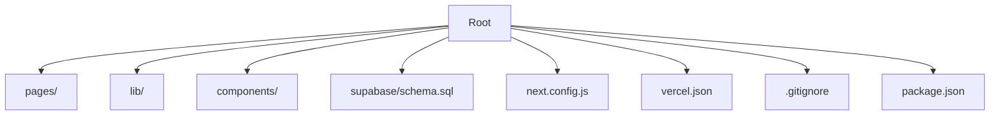
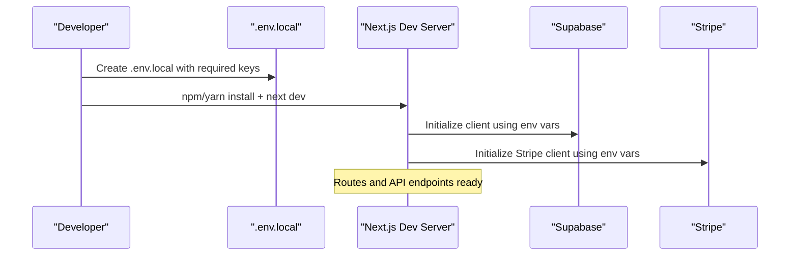
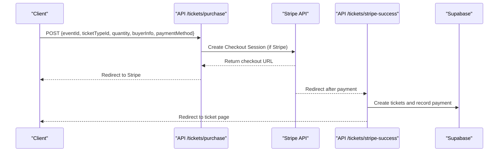
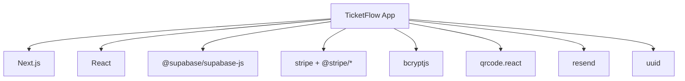

# Environment Setup

<cite>
**Referenced Files in This Document**
- [package.json](file://package.json)
- [next.config.js](file://next.config.js)
- [vercel.json](file://vercel.json)
- [supabase/schema.sql](file://supabase/schema.sql)
- [lib/supabase.js](file://lib/supabase.js)
- [lib/stripe.js](file://lib/stripe.js)
- [lib/auth.js](file://lib/auth.js)
- [pages/api/tickets/purchase.js](file://pages/api/tickets/purchase.js)
- [pages/api/tickets/stripe-success.js](file://pages/api/tickets/stripe-success.js)
- [.gitignore](file://.gitignore)
</cite>

## Table of Contents
1. Introduction
2. Project Structure
3. Core Components
4. Architecture Overview
5. Detailed Component Analysis
6. Dependency Analysis
7. Performance Considerations
8. Troubleshooting Guide
9. Conclusion

## Introduction
This document explains how to set up TicketFlow locally, including prerequisites, environment variables, database setup with Supabase, Stripe configuration, and development workflows. It also covers the project structure and key configuration files so you can run and extend the application confidently.

## Project Structure
TicketFlow is a Next.js application with:
- pages/ for routes and API endpoints
- lib/ for shared client and server utilities (Supabase, Stripe, Auth)
- components/ for UI building blocks
- supabase/schema.sql for database schema
- Configuration files at the root for Next.js and deployment

**Section sources**
- [package.json:1-24](file://package.json#L1-L24)
- [next.config.js:1-14](file://next.config.js#L1-L14)
- [vercel.json:1-18](file://vercel.json#L1-L18)
- [supabase/schema.sql:1-166](file://supabase/schema.sql#L1-L166)

## Core Components
Key runtime dependencies and their roles:
- Next.js: Application framework and routing
- React: UI library
- @supabase/supabase-js: Database and auth client
- stripe and @stripe/*: Payment processing
- bcryptjs: Password hashing
- qrcode.react: QR code generation for tickets
- resend: Email sending capability
- uuid: Unique identifiers

Environment variables are consumed by:
- lib/supabase.js for Supabase clients
- lib/stripe.js for Stripe SDK initialization
- API routes for payment flows and redirects

**Section sources**
- [package.json:10-22](file://package.json#L10-L22)
- [lib/supabase.js:1-23](file://lib/supabase.js#L1-L23)
- [lib/stripe.js:1-6](file://lib/stripe.js#L1-L6)

## Architecture Overview
High-level setup flow:
- Install Node.js and dependencies
- Configure environment variables
- Initialize Supabase project and apply schema
- Set up Stripe account and keys
- Run local dev server

[No sources needed since this diagram shows conceptual workflow, not actual code structure]

## Detailed Component Analysis

### Prerequisites
- Node.js: The package-lock indicates some dependencies require Node >= 20 or >= 22. Use a recent LTS version (e.g., 20.x or 22.x).
- Package manager: npm or yarn
- Database: Supabase project
- Payments: Stripe account

Verify your Node.js version before installing dependencies to avoid peer dependency conflicts.

**Section sources**
- [package-lock.json:97-106](file://package-lock.json#L97-L106)
- [package-lock.json:415-434](file://package-lock.json#L415-L434)

### Installation Steps
1. Clone the repository and open the project directory.
2. Install dependencies:
   - npm install
   - or yarn install
3. Start the development server:
   - npm run dev
   - or yarn dev

The scripts are defined in package.json and use Next.js commands.

**Section sources**
- [package.json:5-9](file://package.json#L5-L9)

### Environment Variables
Create a file named .env.local in the project root. Required variables include:

- NEXT_PUBLIC_SUPABASE_URL: Your Supabase project URL
- NEXT_PUBLIC_SUPABASE_ANON_KEY: Public anon key from Supabase
- SUPABASE_SERVICE_ROLE_KEY: Service role key for server-side operations
- STRIPE_SECRET_KEY: Secret key from Stripe
- NEXT_PUBLIC_SITE_URL: Base URL used for redirects and ticket links

Notes:
- NEXT_PUBLIC_* variables are exposed to the browser; keep secrets out of these.
- .env.local is ignored by Git to prevent accidental commits.

Where they are used:
- Supabase client initialization and service client
- Stripe SDK initialization
- API route redirects and success URLs

**Section sources**
- [lib/supabase.js:3-8](file://lib/supabase.js#L3-L8)
- [lib/supabase.js:16-21](file://lib/supabase.js#L16-L21)
- [lib/stripe.js:3-5](file://lib/stripe.js#L3-L5)
- [pages/api/tickets/purchase.js:49-75](file://pages/api/tickets/purchase.js#L49-L75)
- [pages/api/tickets/stripe-success.js:9-12](file://pages/api/tickets/stripe-success.js#L9-L12)
- [.gitignore:11-16](file://.gitignore#L11-L16)

### Supabase Database Setup
1. Create a new Supabase project.
2. In the SQL editor, run the entire contents of supabase/schema.sql to create tables, policies, indexes, and seed data.
3. Retrieve credentials:
   - Project URL -> NEXT_PUBLIC_SUPABASE_URL
   - Anon public key -> NEXT_PUBLIC_SUPABASE_ANON_KEY
   - Service role secret key -> SUPABASE_SERVICE_ROLE_KEY

Schema highlights:
- Tables: users, events, ticket_types, tickets, check_ins, payments, promo_codes
- Row Level Security enabled on all tables
- Indexes for performance
- Default super admin user seeded

**Section sources**
- [supabase/schema.sql:1-166](file://supabase/schema.sql#L1-L166)

### Stripe Configuration
1. Create a Stripe account and obtain your secret key.
2. Add STRIPE_SECRET_KEY to .env.local.
3. Ensure NEXT_PUBLIC_SITE_URL points to your local or deployed base URL so Stripe checkout redirects work correctly.

Payment flow overview:
- Client calls purchase API with event and ticket details
- If payment method is Stripe, a Checkout session is created
- After successful payment, Stripe redirects to the success endpoint
- Success endpoint verifies payment and creates tickets and records payment

**Diagram sources**
- [pages/api/tickets/purchase.js:47-76](file://pages/api/tickets/purchase.js#L47-L76)
- [pages/api/tickets/stripe-success.js:1-54](file://pages/api/tickets/stripe-success.js#L1-L54)

**Section sources**
- [lib/stripe.js:1-6](file://lib/stripe.js#L1-L6)
- [pages/api/tickets/purchase.js:47-76](file://pages/api/tickets/purchase.js#L47-L76)
- [pages/api/tickets/stripe-success.js:1-54](file://pages/api/tickets/stripe-success.js#L1-L54)

### Authentication Notes
- Password hashing and verification are handled via bcryptjs
- Simple session token creation and parsing are provided for development
- For production, consider using Supabase Auth or a dedicated authentication provider

**Section sources**
- [lib/auth.js:1-47](file://lib/auth.js#L1-L47)

### Next.js and Image Remote Patterns
Remote images are allowed from Unsplash and Supabase domains. Ensure your Supabase storage URLs match these patterns.

**Section sources**
- [next.config.js:4-10](file://next.config.js#L4-L10)

### Deployment Configuration
Vercel configuration specifies the framework, build and dev commands, install command, regions, and security headers for API routes.

**Section sources**
- [vercel.json:1-18](file://vercel.json#L1-L18)

## Dependency Analysis
Key external services and libraries:
- Supabase: Database and optional auth
- Stripe: Payments
- Resend: Email sending (optional depending on usage)
- Next.js and React: Framework and UI

Potential conflicts:
- Some packages require specific Node.js versions. Use Node 20+ to satisfy constraints.
- Peer dependencies for React and Stripe libraries must align with installed versions.

**Section sources**
- [package.json:10-22](file://package.json#L10-L22)
- [package-lock.json:89-96](file://package-lock.json#L89-L96)
- [package-lock.json:97-106](file://package-lock.json#L97-L106)
- [package-lock.json:415-434](file://package-lock.json#L415-L434)

## Performance Considerations
- Database indexes are defined for frequently queried fields (event slug, status, ticket tokens, emails, event IDs).
- Avoid unnecessary re-renders by keeping component state minimal and leveraging Next.js data fetching strategies.
- Use Supabase service role client only on the server side to minimize exposure of privileged keys.

[No sources needed since this section provides general guidance]

## Troubleshooting Guide
Common issues and resolutions:
- Missing environment variables:
  - Symptom: Console warnings about Supabase variables or placeholder clients being used.
  - Fix: Ensure NEXT_PUBLIC_SUPABASE_URL, NEXT_PUBLIC_SUPABASE_ANON_KEY, SUPABASE_SERVICE_ROLE_KEY, STRIPE_SECRET_KEY, and NEXT_PUBLIC_SITE_URL are set in .env.local.
- Supabase connection failures:
  - Verify project URL and keys are correct.
  - Confirm schema has been applied in Supabase SQL editor.
- Stripe redirect errors:
  - Ensure NEXT_PUBLIC_SITE_URL matches the domain where the app runs.
  - Check that STRIPE_SECRET_KEY is valid and active.
- Node.js version errors:
  - Upgrade to Node 20+ to satisfy dependency engine requirements.
- Permission errors on API routes:
  - Confirm service role key is set and RLS policies allow intended operations.

**Section sources**
- [lib/supabase.js:6-8](file://lib/supabase.js#L6-L8)
- [pages/api/tickets/purchase.js:49-75](file://pages/api/tickets/purchase.js#L49-L75)
- [pages/api/tickets/stripe-success.js:9-12](file://pages/api/tickets/stripe-success.js#L9-L12)
- [package-lock.json:97-106](file://package-lock.json#L97-L106)
- [package-lock.json:415-434](file://package-lock.json#L415-L434)

## Conclusion
You now have the complete environment setup guide for TicketFlow. With Node.js, Supabase, and Stripe configured, you can run the app locally, develop features, and deploy to Vercel. Always keep secrets out of version control and validate environment variables during startup to catch misconfigurations early.