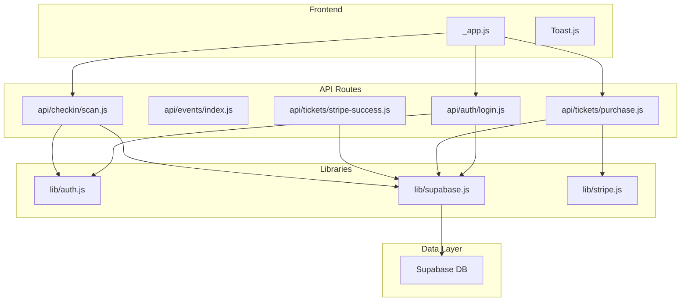
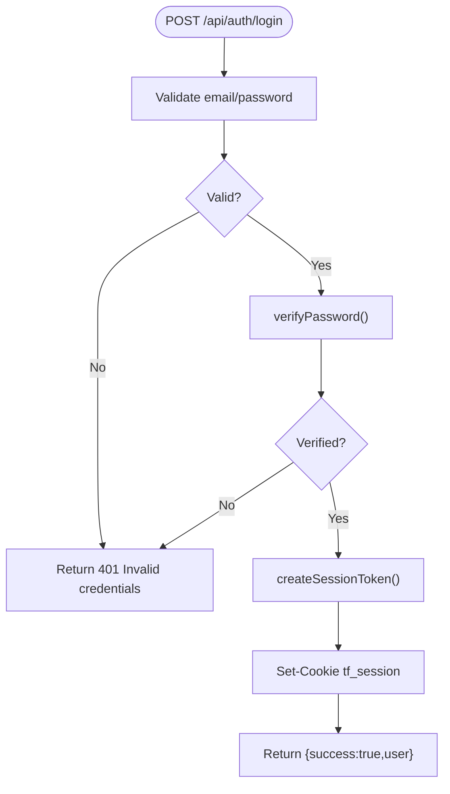
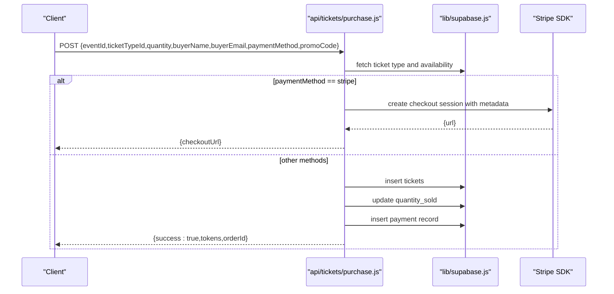
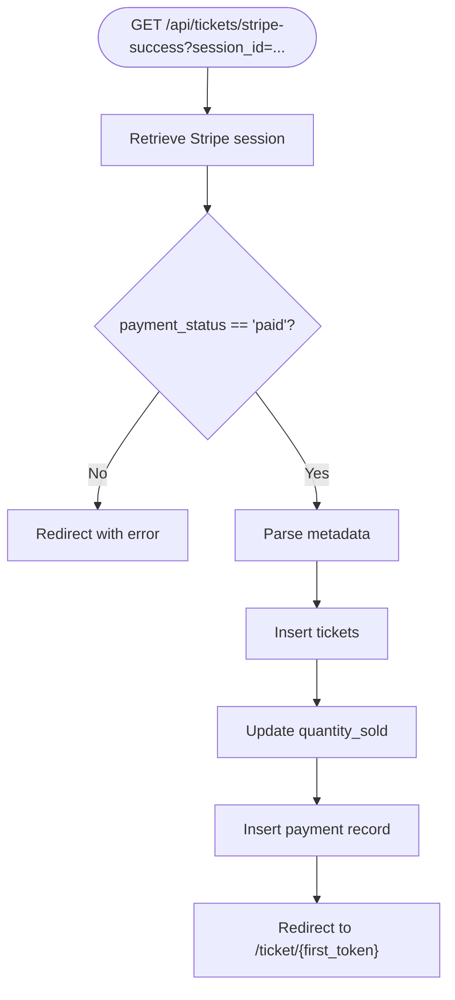
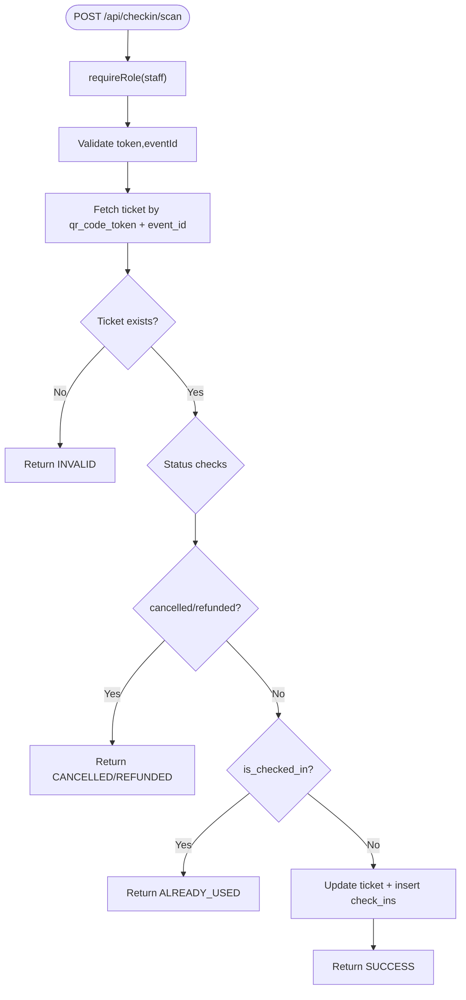
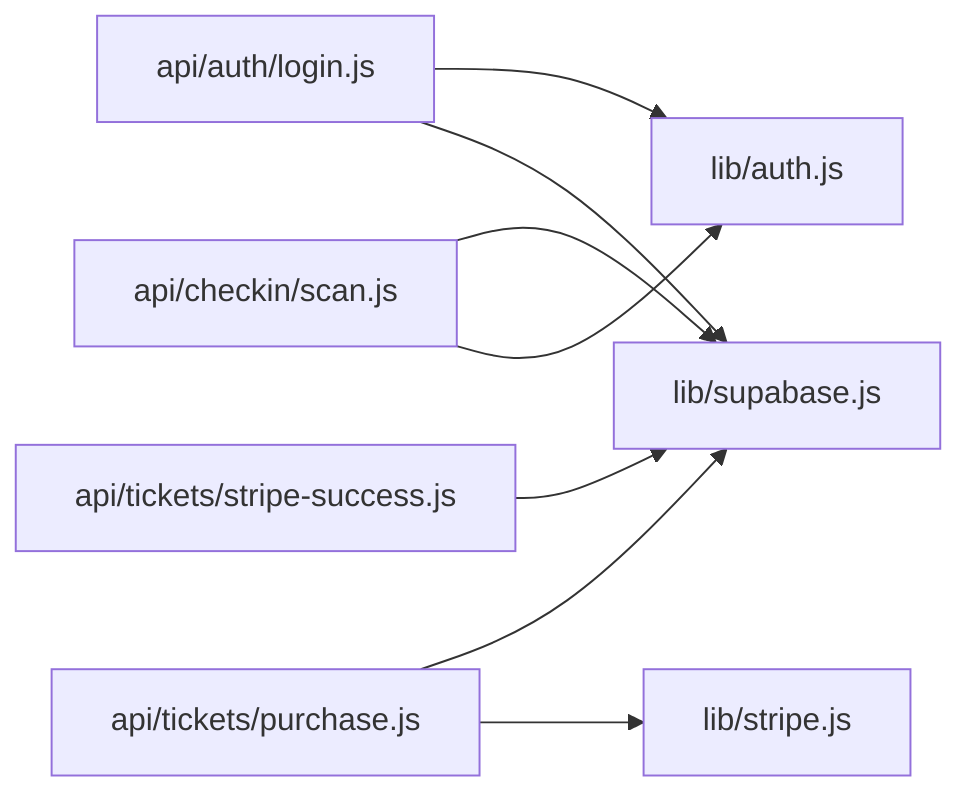
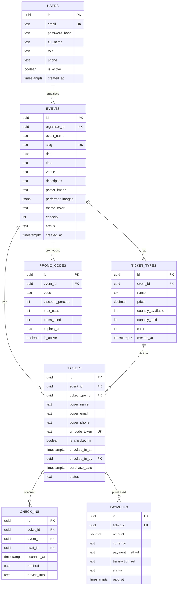

# Monitoring & Logging

<cite>
**Referenced Files in This Document**
- [package.json](file://package.json)
- [pages/_app.js](file://pages/_app.js)
- [components/ui/Toast.js](file://components/ui/Toast.js)
- [lib/auth.js](file://lib/auth.js)
- [lib/supabase.js](file://lib/supabase.js)
- [lib/stripe.js](file://lib/stripe.js)
- [pages/api/auth/login.js](file://pages/api/auth/login.js)
- [pages/api/events/index.js](file://pages/api/events/index.js)
- [pages/api/tickets/purchase.js](file://pages/api/tickets/purchase.js)
- [pages/api/tickets/stripe-success.js](file://pages/api/tickets/stripe-success.js)
- [pages/api/checkin/scan.js](file://pages/api/checkin/scan.js)
- [supabase/schema.sql](file://supabase/schema.sql)
</cite>

## Table of Contents
1. [Introduction](#introduction)
2. [Project Structure](#project-structure)
3. [Core Components](#core-components)
4. [Architecture Overview](#architecture-overview)
5. [Detailed Component Analysis](#detailed-component-analysis)
6. [Dependency Analysis](#dependency-analysis)
7. [Performance Considerations](#performance-considerations)
8. [Troubleshooting Guide](#troubleshooting-guide)
9. [Conclusion](#conclusion)
10. [Appendices](#appendices)

## Introduction
This document defines the monitoring and logging strategy for TicketFlow, covering error tracking, structured logging, performance metrics, alerting, analytics, and incident response. It maps current implementation patterns to recommended enhancements using industry-standard tools such as Sentry (error tracking), OpenTelemetry (metrics/traces), and centralized log aggregation. The guidance is tailored to the Next.js API routes, authentication flows, Stripe payment processing, and Supabase data layer used by TicketFlow.

## Project Structure
TicketFlow is a Next.js application with:
- API routes under pages/api for authentication, events, ticket purchases, Stripe success handling, and check-in scanning.
- Shared libraries for auth, Supabase client configuration, and Stripe initialization.
- UI components including a Toast system for user-facing notifications.
- A Supabase schema defining core entities: users, events, ticket_types, tickets, check_ins, payments, promo_codes.



**Diagram sources**
- [pages/_app.js:1-14](file://pages/_app.js#L1-L14)
- [components/ui/Toast.js:1-84](file://components/ui/Toast.js#L1-L84)
- [pages/api/auth/login.js:1-31](file://pages/api/auth/login.js#L1-L31)
- [pages/api/events/index.js:1-42](file://pages/api/events/index.js#L1-L42)
- [pages/api/tickets/purchase.js:1-123](file://pages/api/tickets/purchase.js#L1-L123)
- [pages/api/tickets/stripe-success.js:1-55](file://pages/api/tickets/stripe-success.js#L1-L55)
- [pages/api/checkin/scan.js:1-44](file://pages/api/checkin/scan.js#L1-L44)
- [lib/auth.js:1-47](file://lib/auth.js#L1-L47)
- [lib/supabase.js:1-23](file://lib/supabase.js#L1-L23)
- [lib/stripe.js:1-6](file://lib/stripe.js#L1-L6)

**Section sources**
- [package.json:1-24](file://package.json#L1-L24)
- [pages/_app.js:1-14](file://pages/_app.js#L1-L14)
- [components/ui/Toast.js:1-84](file://components/ui/Toast.js#L1-L84)
- [lib/auth.js:1-47](file://lib/auth.js#L1-L47)
- [lib/supabase.js:1-23](file://lib/supabase.js#L1-L23)
- [lib/stripe.js:1-6](file://lib/stripe.js#L1-L6)
- [supabase/schema.sql:1-166](file://supabase/schema.sql#L1-L166)

## Core Components
- Authentication utilities: password hashing/verification, session token creation/parsing, role enforcement.
- Supabase client: public and service-role clients with environment validation.
- Stripe client: initialized with secret key and API version.
- API routes: login, events CRUD, ticket purchase, Stripe webhook-like success handler, check-in scanner.
- UI notifications: Toast provider and hooks for user feedback.

Key responsibilities:
- lib/auth.js: secure credential handling and authorization middleware pattern.
- lib/supabase.js: database connectivity and environment checks.
- lib/stripe.js: payment integration entry point.
- API routes: business logic, input validation, external calls, and error responses.
- components/ui/Toast.js: user-facing alerts and errors.

**Section sources**
- [lib/auth.js:1-47](file://lib/auth.js#L1-L47)
- [lib/supabase.js:1-23](file://lib/supabase.js#L1-L23)
- [lib/stripe.js:1-6](file://lib/stripe.js#L1-L6)
- [pages/api/auth/login.js:1-31](file://pages/api/auth/login.js#L1-L31)
- [pages/api/events/index.js:1-42](file://pages/api/events/index.js#L1-L42)
- [pages/api/tickets/purchase.js:1-123](file://pages/api/tickets/purchase.js#L1-L123)
- [pages/api/tickets/stripe-success.js:1-55](file://pages/api/tickets/stripe-success.js#L1-L55)
- [pages/api/checkin/scan.js:1-44](file://pages/api/checkin/scan.js#L1-L44)
- [components/ui/Toast.js:1-84](file://components/ui/Toast.js#L1-L84)

## Architecture Overview
The system follows a typical Next.js serverless API architecture:
- Frontend requests hit API routes.
- API routes validate inputs, enforce roles, call Supabase via service-role client, and integrate with Stripe for payments.
- Errors are caught and returned as JSON; some routes use console.error for diagnostics.
- Success paths persist data and return results or redirect.

```mermaid
sequenceDiagram
participant Client as "Client"
participant API as "Next.js API Route"
participant Auth as "lib/auth.js"
participant Supa as "lib/supabase.js"
participant Stripe as "Stripe SDK"
participant DB as "Supabase DB"
Client->>API : POST /api/auth/login {email,password}
API->>Auth : verifyPassword()
API->>Supa : getServiceClient().from('users').select(...)
Supa-->>API : user record
API-->>Client : Set-Cookie + {success,user}
Note over API,Supa : Errors logged via console.error; no structured logs yet
```

**Diagram sources**
- [pages/api/auth/login.js:1-31](file://pages/api/auth/login.js#L1-L31)
- [lib/auth.js:1-47](file://lib/auth.js#L1-L47)
- [lib/supabase.js:1-23](file://lib/supabase.js#L1-L23)

## Detailed Component Analysis

### Authentication Flow
- Input validation ensures email and password presence.
- Password verification uses bcrypt utilities.
- Session token created and set as HttpOnly cookie.
- Role-based access enforced via requireRole helper.

Recommendations:
- Add structured logs for login attempts (success/failure), including anonymized identifiers.
- Track failed login rate and account lockout thresholds.
- Integrate error tracking to capture stack traces and request context.



**Diagram sources**
- [pages/api/auth/login.js:1-31](file://pages/api/auth/login.js#L1-L31)
- [lib/auth.js:1-47](file://lib/auth.js#L1-L47)

**Section sources**
- [pages/api/auth/login.js:1-31](file://pages/api/auth/login.js#L1-L31)
- [lib/auth.js:1-47](file://lib/auth.js#L1-L47)

### Ticket Purchase Flow
- Validates required fields and availability.
- Applies promo codes if provided.
- For Stripe: creates checkout session with metadata containing event, buyer, tokens, discount.
- For other methods: inserts tickets immediately and records payment.

Recommendations:
- Log purchase intent, promo usage, and payment method selection.
- Capture Stripe session creation success/failure and amounts.
- Track inventory updates and payment recording outcomes.



**Diagram sources**
- [pages/api/tickets/purchase.js:1-123](file://pages/api/tickets/purchase.js#L1-L123)
- [lib/supabase.js:1-23](file://lib/supabase.js#L1-L23)
- [lib/stripe.js:1-6](file://lib/stripe.js#L1-L6)

**Section sources**
- [pages/api/tickets/purchase.js:1-123](file://pages/api/tickets/purchase.js#L1-L123)
- [lib/supabase.js:1-23](file://lib/supabase.js#L1-L23)
- [lib/stripe.js:1-6](file://lib/stripe.js#L1-L6)

### Stripe Success Handler
- Retrieves Stripe session and validates payment status.
- Parses metadata to create tickets and update sold counts.
- Records payment with transaction reference.
- Redirects to first ticket page.

Recommendations:
- Log session retrieval success/failure and payment status.
- Record ticket creation batch size and any failures.
- Ensure idempotency and handle retries gracefully.



**Diagram sources**
- [pages/api/tickets/stripe-success.js:1-55](file://pages/api/tickets/stripe-success.js#L1-L55)

**Section sources**
- [pages/api/tickets/stripe-success.js:1-55](file://pages/api/tickets/stripe-success.js#L1-L55)

### Check-In Scanning
- Enforces staff role via requireRole.
- Validates token and event association.
- Handles invalid, cancelled, refunded, and already-used states.
- Marks ticket checked-in and records check-in event.

Recommendations:
- Log scan attempts with device info and method.
- Track success rates and reasons for failure.
- Monitor throughput and latency at peak check-in times.



**Diagram sources**
- [pages/api/checkin/scan.js:1-44](file://pages/api/checkin/scan.js#L1-L44)
- [lib/auth.js:1-47](file://lib/auth.js#L1-L47)

**Section sources**
- [pages/api/checkin/scan.js:1-44](file://pages/api/checkin/scan.js#L1-L44)
- [lib/auth.js:1-47](file://lib/auth.js#L1-L47)

### Error Tracking Implementation
Current state:
- API routes catch exceptions and log via console.error.
- No dedicated error tracking library is integrated.

Recommended approach:
- Integrate Sentry for both frontend and backend:
  - Initialize Sentry in _app.js for client-side errors and unhandled rejections.
  - Use @sentry/nextjs to instrument API routes and capture server-side errors with request context.
- Tag errors with route names, user roles (anonymized), and operation types (e.g., purchase, checkin).
- Correlate errors with trace IDs from OpenTelemetry.

**Section sources**
- [pages/_app.js:1-14](file://pages/_app.js#L1-L14)
- [pages/api/auth/login.js:1-31](file://pages/api/auth/login.js#L1-L31)
- [pages/api/tickets/purchase.js:1-123](file://pages/api/tickets/purchase.js#L1-L123)
- [pages/api/tickets/stripe-success.js:1-55](file://pages/api/tickets/stripe-success.js#L1-L55)
- [pages/api/checkin/scan.js:1-44](file://pages/api/checkin/scan.js#L1-L44)

### Structured Logging Strategy
Current state:
- Ad-hoc console.error messages without consistent structure.

Recommended approach:
- Adopt a structured logger (e.g., Pino or Winston) with JSON output.
- Standardize log levels: debug, info, warn, error.
- Include contextual fields: requestId, userId (hashed), eventType, route, durationMs, statusCode, errorMessage.
- Redact sensitive data (passwords, tokens, PII).
- Centralize logs via an aggregator (e.g., Vercel Logs, Datadog, CloudWatch, ELK).

Example log categories:
- API lifecycle: request start, validation, DB calls, external calls, response.
- Auth: login attempts, token creation, role checks.
- Payments: Stripe session creation, success handling, payment recording.
- Check-in: scan attempts, outcomes, device info.

**Section sources**
- [lib/supabase.js:1-23](file://lib/supabase.js#L1-L23)
- [pages/api/auth/login.js:1-31](file://pages/api/auth/login.js#L1-L31)
- [pages/api/tickets/purchase.js:1-123](file://pages/api/tickets/purchase.js#L1-L123)
- [pages/api/tickets/stripe-success.js:1-55](file://pages/api/tickets/stripe-success.js#L1-L55)
- [pages/api/checkin/scan.js:1-44](file://pages/api/checkin/scan.js#L1-L44)

### Performance Monitoring and Metrics
Current state:
- No explicit metrics collection or tracing.

Recommended approach:
- Instrument API routes with timing metrics (duration, latency percentiles).
- Track business KPIs:
  - Login success/failure rates.
  - Purchase conversion funnel (intent → checkout → paid).
  - Check-in throughput and failure reasons.
- Use OpenTelemetry to generate traces across Supabase and Stripe calls.
- Export metrics to Prometheus/Grafana or a hosted solution.

Suggested metrics:
- HTTP request count and latency per route.
- Database query durations and error rates.
- Stripe API call latencies and failure rates.
- Business events: ticket sales, promo usage, check-ins.

**Section sources**
- [pages/api/events/index.js:1-42](file://pages/api/events/index.js#L1-L42)
- [pages/api/tickets/purchase.js:1-123](file://pages/api/tickets/purchase.js#L1-L123)
- [pages/api/tickets/stripe-success.js:1-55](file://pages/api/tickets/stripe-success.js#L1-L55)
- [pages/api/checkin/scan.js:1-44](file://pages/api/checkin/scan.js#L1-L44)

### Alerting Setup
Recommended alerts:
- Error rate spikes on critical routes (login, purchase, stripe-success, checkin-scan).
- Payment failures exceeding threshold (e.g., >5% failure rate).
- Check-in scan failures due to invalid/cancelled tickets.
- Database connection errors or high latency.
- Stripe API errors or timeouts.

Alert channels:
- Slack/email for immediate notification.
- PagerDuty/on-call rotation for severe incidents.

**Section sources**
- [pages/api/auth/login.js:1-31](file://pages/api/auth/login.js#L1-L31)
- [pages/api/tickets/purchase.js:1-123](file://pages/api/tickets/purchase.js#L1-L123)
- [pages/api/tickets/stripe-success.js:1-55](file://pages/api/tickets/stripe-success.js#L1-L55)
- [pages/api/checkin/scan.js:1-44](file://pages/api/checkin/scan.js#L1-L44)

### User Analytics and Business Metrics
Recommended events:
- Page views and navigation (events listing, ticket detail).
- Authentication events (login success/failure).
- Purchase funnel steps (add-to-cart, checkout initiated, payment completed).
- Promo code usage and discounts applied.
- Check-in scans and outcomes.

Implementation:
- Use a privacy-friendly analytics tool (e.g., Plausible, PostHog) or custom event pipeline.
- Aggregate metrics for dashboards: revenue, tickets sold, capacity utilization, conversion rates.

**Section sources**
- [pages/api/tickets/purchase.js:1-123](file://pages/api/tickets/purchase.js#L1-L123)
- [pages/api/tickets/stripe-success.js:1-55](file://pages/api/tickets/stripe-success.js#L1-L55)
- [pages/api/checkin/scan.js:1-44](file://pages/api/checkin/scan.js#L1-L44)

### Dashboards, Alerts, and Incident Response
Dashboards:
- Operational: error rates, latency, throughput, dependency health (Supabase, Stripe).
- Business: revenue, tickets sold, promo usage, check-in throughput.
- Security: failed login attempts, unauthorized access attempts.

Incident response:
- Define runbooks for common failures (Stripe API down, DB connectivity issues, high error rates).
- Establish escalation paths and communication templates.
- Conduct post-mortems and track remediation actions.

[No sources needed since this section provides general guidance]

## Dependency Analysis
External dependencies relevant to monitoring and logging:
- Stripe SDK for payment operations.
- Supabase JS client for database interactions.
- Next.js runtime for API routing and serverless execution.

Potential coupling:
- API routes depend on lib/auth, lib/supabase, and lib/stripe.
- Supabase client requires environment variables; missing values trigger warnings.
- Stripe client requires secret keys; placeholder fallbacks exist for development.



**Diagram sources**
- [pages/api/auth/login.js:1-31](file://pages/api/auth/login.js#L1-L31)
- [pages/api/tickets/purchase.js:1-123](file://pages/api/tickets/purchase.js#L1-L123)
- [pages/api/tickets/stripe-success.js:1-55](file://pages/api/tickets/stripe-success.js#L1-L55)
- [pages/api/checkin/scan.js:1-44](file://pages/api/checkin/scan.js#L1-L44)
- [lib/auth.js:1-47](file://lib/auth.js#L1-L47)
- [lib/supabase.js:1-23](file://lib/supabase.js#L1-L23)
- [lib/stripe.js:1-6](file://lib/stripe.js#L1-L6)

**Section sources**
- [package.json:1-24](file://package.json#L1-L24)
- [lib/supabase.js:1-23](file://lib/supabase.js#L1-L23)
- [lib/stripe.js:1-6](file://lib/stripe.js#L1-L6)

## Performance Considerations
- Minimize synchronous operations in API routes; prefer async patterns.
- Cache frequently accessed data where appropriate (e.g., event listings).
- Monitor database query performance and optimize indexes (already defined in schema).
- Rate-limit sensitive endpoints (login, check-in) to prevent abuse.
- Use connection pooling for external services when applicable.

[No sources needed since this section provides general guidance]

## Troubleshooting Guide
Common issues and debugging techniques:
- Missing environment variables: Supabase client warns when not set; ensure .env.local contains NEXT_PUBLIC_SUPABASE_URL, NEXT_PUBLIC_SUPABASE_ANON_KEY, SUPABASE_SERVICE_ROLE_KEY.
- Stripe integration failures: verify STRIPE_SECRET_KEY and API version; inspect session creation logs.
- Authentication errors: validate bcrypt hashes and session token parsing; check cookie settings.
- Check-in anomalies: review ticket statuses and check-in records; confirm staff roles.

Actionable steps:
- Enable structured logging and error tracking.
- Add requestId propagation across layers.
- Inspect Supabase RLS policies and service-role permissions.
- Validate Stripe webhooks and success handlers for idempotency.

**Section sources**
- [lib/supabase.js:1-23](file://lib/supabase.js#L1-L23)
- [lib/stripe.js:1-6](file://lib/stripe.js#L1-L6)
- [lib/auth.js:1-47](file://lib/auth.js#L1-L47)
- [pages/api/auth/login.js:1-31](file://pages/api/auth/login.js#L1-L31)
- [pages/api/checkin/scan.js:1-44](file://pages/api/checkin/scan.js#L1-L44)
- [supabase/schema.sql:1-166](file://supabase/schema.sql#L1-L166)

## Conclusion
TicketFlow currently relies on basic console logging and ad-hoc error handling. To achieve robust observability, implement structured logging, error tracking with Sentry, performance metrics via OpenTelemetry, and centralized log aggregation. Focus on critical paths: authentication, payments, and check-in scanning. Establish dashboards and alerts to proactively detect issues and maintain high availability.

[No sources needed since this section summarizes without analyzing specific files]

## Appendices

### Data Model Reference
Core tables and relationships relevant to monitoring and business metrics:
- users: authentication and roles.
- events, ticket_types: event catalog and pricing.
- tickets: individual ticket instances and check-in status.
- check_ins: audit trail for gate scanning.
- payments: financial records and reconciliation.
- promo_codes: discount campaigns and usage.



**Diagram sources**
- [supabase/schema.sql:1-166](file://supabase/schema.sql#L1-L166)

**Section sources**
- [supabase/schema.sql:1-166](file://supabase/schema.sql#L1-L166)