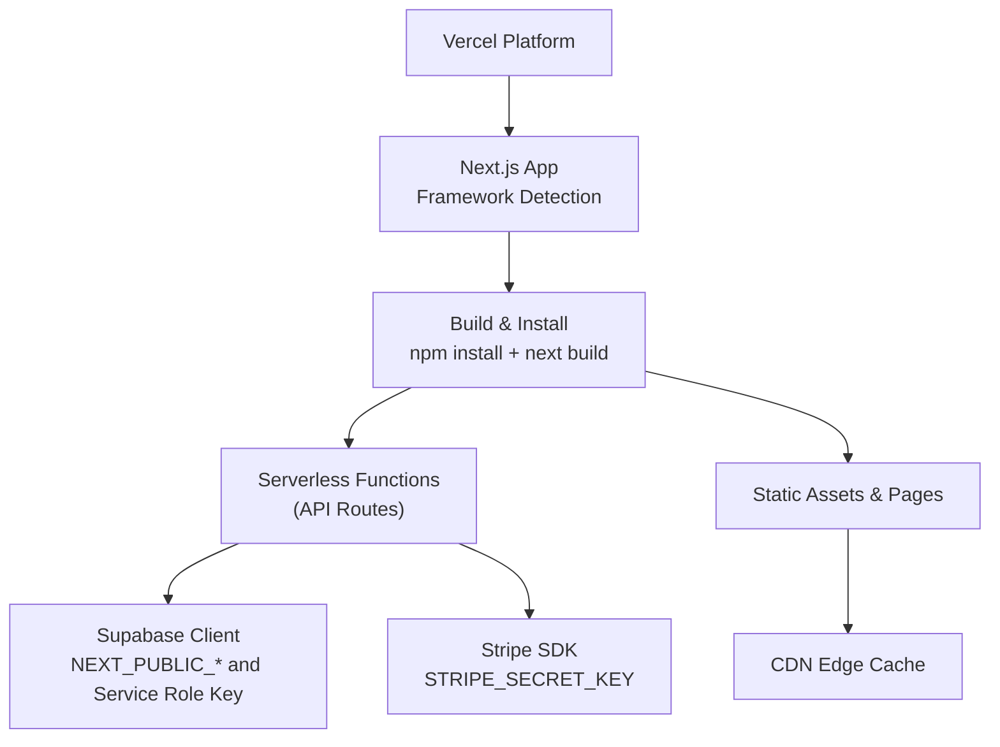
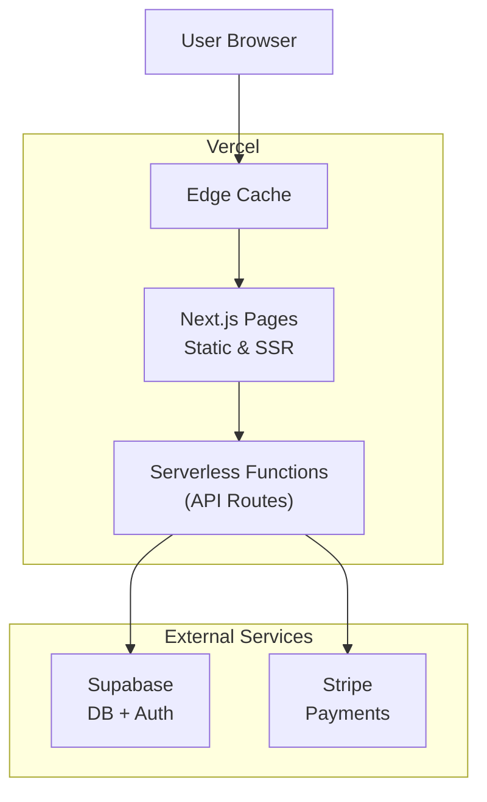
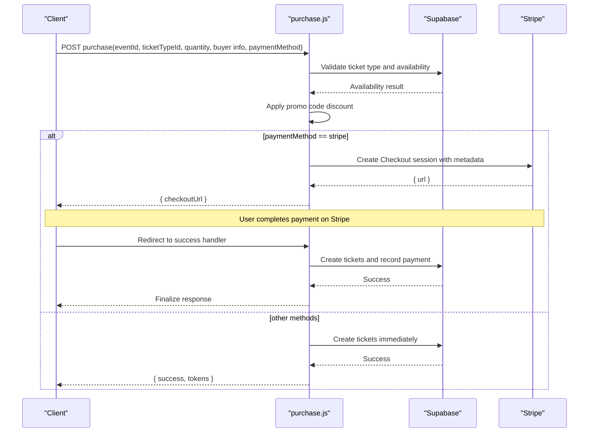
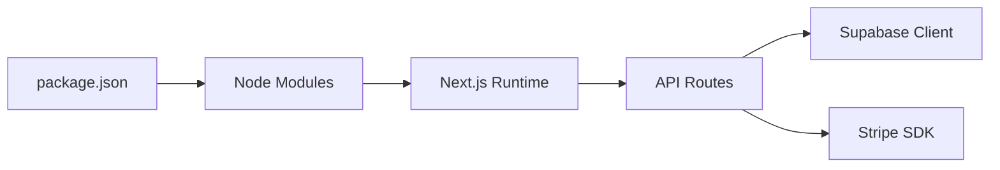

# Vercel Deployment

<cite>
**Referenced Files in This Document**
- [vercel.json](file://vercel.json)
- [next.config.js](file://next.config.js)
- [package.json](file://package.json)
- [.gitignore](file://.gitignore)
- [lib/supabase.js](file://lib/supabase.js)
- [lib/stripe.js](file://lib/stripe.js)
- [pages/api/tickets/purchase.js](file://pages/api/tickets/purchase.js)
- [supabase/schema.sql](file://supabase/schema.sql)
</cite>

## Table of Contents
1. [Introduction](#introduction)
2. [Project Structure](#project-structure)
3. [Core Components](#core-components)
4. [Architecture Overview](#architecture-overview)
5. [Detailed Component Analysis](#detailed-component-analysis)
6. [Dependency Analysis](#dependency-analysis)
7. [Performance Considerations](#performance-considerations)
8. [Troubleshooting Guide](#troubleshooting-guide)
9. [Conclusion](#conclusion)
10. [Appendices](#appendices)

## Introduction
This document provides a comprehensive guide to deploying TicketFlow on Vercel. It covers the vercel.json configuration, environment variables, domain and SSL setup, preview and branch-based deployments, rollback strategies, performance optimization using Vercel’s edge network and caching policies, troubleshooting common issues, and monitoring best practices. The goal is to help both new and experienced users deploy and operate TicketFlow reliably and efficiently on Vercel.

## Project Structure
TicketFlow is a Next.js application with serverless API routes, Supabase integration for data and authentication, and Stripe for payments. Vercel natively supports Next.js projects and will automatically detect the framework from package.json and build settings.

Key files relevant to deployment:
- vercel.json: Vercel-specific configuration (framework, build commands, regions, headers).
- next.config.js: Next.js configuration including image remote patterns.
- package.json: Node scripts and dependencies used by Vercel during install and build.
- .gitignore: Ensures sensitive files like .env are not committed.
- lib/supabase.js and lib/stripe.js: Client initialization requiring environment variables.
- pages/api/tickets/purchase.js: Server-side payment flow using Stripe and Supabase.
- supabase/schema.sql: Database schema to initialize your Supabase project.

**Diagram sources**
- [vercel.json:1-18](file://vercel.json#L1-L18)
- [package.json:1-24](file://package.json#L1-L24)
- [lib/supabase.js:1-23](file://lib/supabase.js#L1-L23)
- [lib/stripe.js:1-6](file://lib/stripe.js#L1-L6)

**Section sources**
- [vercel.json:1-18](file://vercel.json#L1-L18)
- [next.config.js:1-14](file://next.config.js#L1-L14)
- [package.json:1-24](file://package.json#L1-L24)
- [.gitignore:1-33](file://.gitignore#L1-L33)

## Core Components
- Framework and Build: Vercel detects Next.js via package.json and uses the buildCommand defined in vercel.json.
- Regions: Deployment region is set to iad1 in vercel.json; this affects latency and where functions run.
- Security Headers: API routes receive security headers via vercel.json headers configuration.
- Environment Variables:
  - NEXT_PUBLIC_SUPABASE_URL and NEXT_PUBLIC_SUPABASE_ANON_KEY for client-side Supabase access.
  - SUPABASE_SERVICE_ROLE_KEY for server-side privileged operations.
  - STRIPE_SECRET_KEY for Stripe server-side calls.
  - NEXT_PUBLIC_SITE_URL for success/cancel URLs in Stripe checkout.
- Image Optimization: next.config.js allows images from Unsplash and Supabase domains.

**Section sources**
- [vercel.json:1-18](file://vercel.json#L1-L18)
- [next.config.js:1-14](file://next.config.js#L1-L14)
- [lib/supabase.js:1-23](file://lib/supabase.js#L1-L23)
- [lib/stripe.js:1-6](file://lib/stripe.js#L1-L6)
- [pages/api/tickets/purchase.js:1-123](file://pages/api/tickets/purchase.js#L1-L123)

## Architecture Overview
The deployment architecture leverages Vercel’s global edge network and serverless functions. Next.js pages and static assets are cached at the edge, while API routes execute close to users based on configured regions. External services include Supabase for database and auth, and Stripe for payments.

**Diagram sources**
- [vercel.json:1-18](file://vercel.json#L1-L18)
- [package.json:1-24](file://package.json#L1-L24)
- [lib/supabase.js:1-23](file://lib/supabase.js#L1-L23)
- [lib/stripe.js:1-6](file://lib/stripe.js#L1-L6)

## Detailed Component Analysis

### Vercel Configuration (vercel.json)
- Framework detection: nextjs ensures proper build pipeline.
- Build and dev commands: next build and next dev.
- Install command: npm install.
- Regions: iad1 constrains function execution region.
- Headers: Security headers applied to all /api/* routes.

Recommendations:
- Keep regions aligned with target audience or enable Vercel’s automatic routing if needed.
- Add additional headers as required by your security policy.

**Section sources**
- [vercel.json:1-18](file://vercel.json#L1-L18)

### Next.js Configuration (next.config.js)
- React Strict Mode enabled.
- Remote image patterns allow loading images from Unsplash and Supabase domains.

Recommendations:
- Ensure all external image hosts are whitelisted here to avoid runtime errors.
- Consider adding caching headers for images if needed.

**Section sources**
- [next.config.js:1-14](file://next.config.js#L1-L14)

### Environment Variables and Secrets
Required variables:
- NEXT_PUBLIC_SUPABASE_URL: Public Supabase URL.
- NEXT_PUBLIC_SUPABASE_ANON_KEY: Public anon key for client-side access.
- SUPABASE_SERVICE_ROLE_KEY: Privileged service role key for server-side operations.
- STRIPE_SECRET_KEY: Secret key for Stripe server-side calls.
- NEXT_PUBLIC_SITE_URL: Base site URL used in Stripe success/cancel redirects.

Where they are used:
- lib/supabase.js initializes clients with public keys and service role key.
- lib/stripe.js initializes Stripe client with secret key.
- pages/api/tickets/purchase.js constructs Stripe checkout URLs using NEXT_PUBLIC_SITE_URL.

Security guidance:
- Never commit .env files; .gitignore excludes them.
- Configure environment variables in Vercel project settings per environment (development, preview, production).

**Section sources**
- [lib/supabase.js:1-23](file://lib/supabase.js#L1-L23)
- [lib/stripe.js:1-6](file://lib/stripe.js#L1-L6)
- [pages/api/tickets/purchase.js:1-123](file://pages/api/tickets/purchase.js#L1-L123)
- [.gitignore:1-33](file://.gitignore#L1-L33)

### Payment Flow (Stripe Integration)
Sequence overview:
- Client calls purchase API with event and ticket details.
- Server validates availability and applies promo codes.
- If Stripe is selected, server creates a Checkout session with metadata and returns the checkout URL.
- After payment, Stripe redirects to success endpoint which finalizes ticket creation and records payment.

**Diagram sources**
- [pages/api/tickets/purchase.js:1-123](file://pages/api/tickets/purchase.js#L1-L123)
- [lib/stripe.js:1-6](file://lib/stripe.js#L1-L6)
- [lib/supabase.js:1-23](file://lib/supabase.js#L1-L23)

**Section sources**
- [pages/api/tickets/purchase.js:1-123](file://pages/api/tickets/purchase.js#L1-L123)

### Database Schema (Supabase)
- Tables: users, events, ticket_types, tickets, check_ins, payments, promo_codes.
- Row Level Security enabled across tables.
- Indexes optimized for queries (slug, status, qr_code_token, email, event_id, etc.).
- Seed includes a default super admin user.

Operational notes:
- Run schema.sql in your Supabase SQL editor to initialize the database.
- Ensure RLS policies align with your authentication approach.

**Section sources**
- [supabase/schema.sql:1-166](file://supabase/schema.sql#L1-L166)

## Dependency Analysis
TicketFlow depends on:
- Next.js for framework and serverless functions.
- Supabase JS client for database and auth.
- Stripe SDK for payments.
- bcryptjs for password hashing.
- uuid for token generation.

Vercel handles dependency installation via npm install and builds using next build. Ensure all dependencies are listed in package.json.

**Diagram sources**
- [package.json:1-24](file://package.json#L1-L24)
- [lib/supabase.js:1-23](file://lib/supabase.js#L1-L23)
- [lib/stripe.js:1-6](file://lib/stripe.js#L1-L6)

**Section sources**
- [package.json:1-24](file://package.json#L1-L24)

## Performance Considerations
- Edge Network: Vercel caches static assets and can serve SSR responses from the nearest edge location.
- Regions: Current config sets iad1; consider enabling automatic region selection or configuring multiple regions for global audiences.
- API Route Optimization: Keep serverless functions lightweight; offload heavy processing to background jobs if necessary.
- Image Optimization: Use next/image with allowed remote patterns to benefit from Vercel’s image optimization pipeline.
- Caching Policies:
  - Set appropriate cache-control headers for API responses where applicable.
  - Leverage Vercel’s built-in caching for static assets and revalidate dynamic content as needed.

[No sources needed since this section provides general guidance]

## Troubleshooting Guide
Common issues and resolutions:
- Missing environment variables:
  - Symptoms: Supabase client warnings, Stripe initialization failures, incorrect redirect URLs.
  - Resolution: Configure NEXT_PUBLIC_SUPABASE_URL, NEXT_PUBLIC_SUPABASE_ANON_KEY, SUPABASE_SERVICE_ROLE_KEY, STRIPE_SECRET_KEY, and NEXT_PUBLIC_SITE_URL in Vercel project settings.
- Build failures:
  - Symptoms: npm install or next build errors.
  - Resolution: Verify package.json scripts and dependencies; ensure Node version compatibility; check logs in Vercel dashboard.
- CORS or image loading errors:
  - Symptoms: Images fail to load from external domains.
  - Resolution: Whitelist domains in next.config.js remotePatterns.
- API route errors:
  - Symptoms: 500 errors in purchase flow.
  - Resolution: Check Supabase connectivity and permissions; verify STRIPE_SECRET_KEY; review error logs in Vercel Functions logs.

Monitoring setup:
- Use Vercel Analytics and Logs to monitor performance and errors.
- Enable Function logs for detailed debugging of API routes.
- Integrate external monitoring tools (e.g., Sentry) for frontend and backend error tracking.

**Section sources**
- [lib/supabase.js:1-23](file://lib/supabase.js#L1-L23)
- [lib/stripe.js:1-6](file://lib/stripe.js#L1-L6)
- [pages/api/tickets/purchase.js:1-123](file://pages/api/tickets/purchase.js#L1-L123)
- [next.config.js:1-14](file://next.config.js#L1-L14)

## Conclusion
Deploying TicketFlow on Vercel is straightforward thanks to native Next.js support and clear configuration in vercel.json. Properly managing environment variables, configuring domains and SSL, and leveraging Vercel’s edge network and caching will ensure a fast, secure, and scalable deployment. Use preview deployments and branch-based workflows for safe testing, and implement robust monitoring and rollback strategies for reliable operations.

[No sources needed since this section summarizes without analyzing specific files]

## Appendices

### Deployment Process: Repository Connection to Live
- Connect repository to Vercel and select the project root.
- Vercel auto-detects Next.js and reads vercel.json and package.json.
- Configure environment variables in Vercel dashboard per environment.
- Deploy main branch to production; create preview deployments for pull requests.
- Add custom domains and enable SSL in Vercel settings.

**Section sources**
- [vercel.json:1-18](file://vercel.json#L1-L18)
- [package.json:1-24](file://package.json#L1-L24)

### Domain Configuration and SSL Setup
- Add custom domains under Vercel project settings.
- Update DNS records as instructed by Vercel.
- SSL certificates are provisioned automatically once DNS is verified.

[No sources needed since this section provides general guidance]

### Preview Deployments and Branch-Based Deployments
- Each pull request generates a unique preview URL.
- Configure branch deployment rules in Vercel to control which branches deploy to preview or production.
- Use environment-specific variables to isolate previews from production.

[No sources needed since this section provides general guidance]

### Rollback Strategies
- Re-deploy a previous commit from Vercel’s deployments list.
- Use Git tags or branches to pin stable versions.
- Maintain separate environments (dev, preview, prod) with distinct variable sets.

[No sources needed since this section provides general guidance]