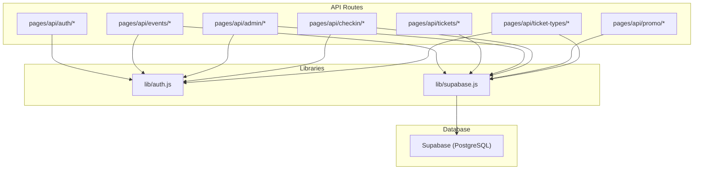
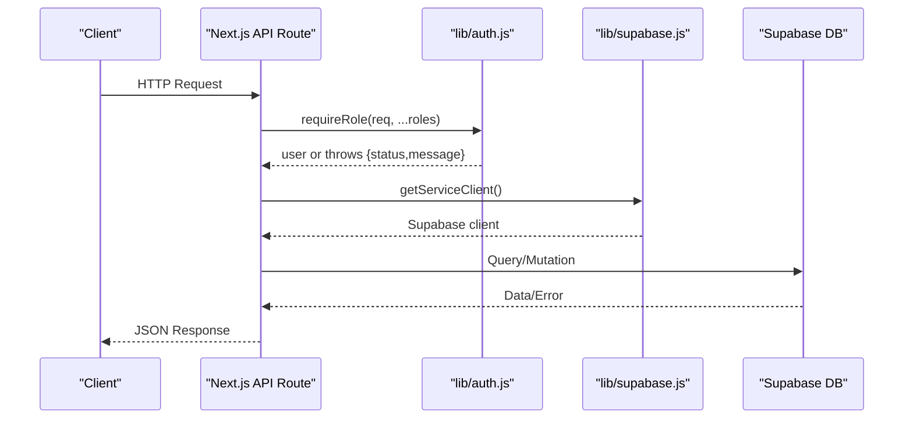
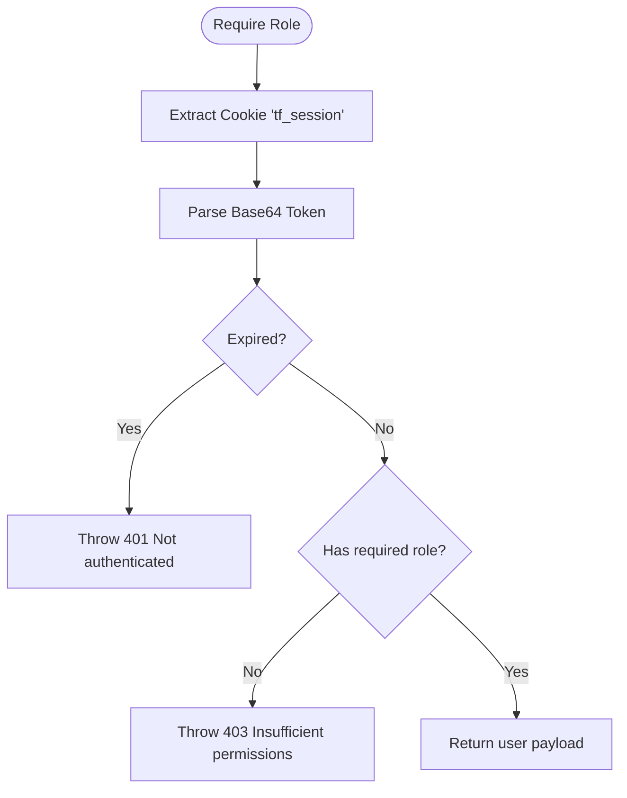
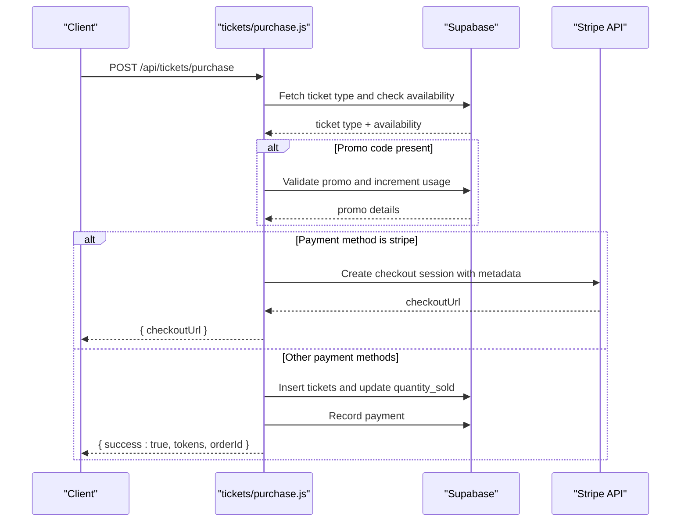
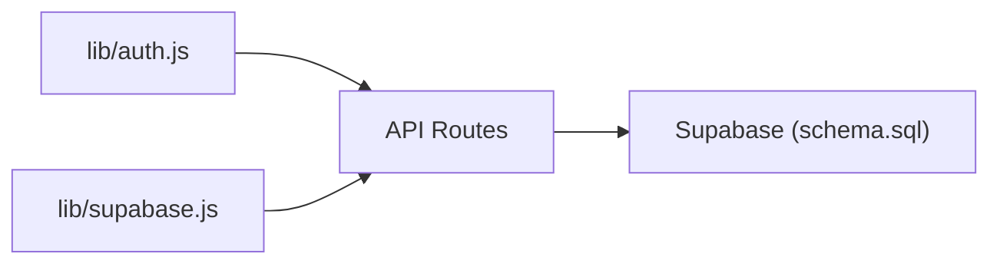

# API Route Development

<cite>
**Referenced Files in This Document**
- [auth.js](file://lib/auth.js)
- [supabase.js](file://lib/supabase.js)
- [login.js](file://pages/api/auth/login.js)
- [me.js](file://pages/api/auth/me.js)
- [events_index.js](file://pages/api/events/index.js)
- [events_id.js](file://pages/api/events/[id].js)
- [tickets_purchase.js](file://pages/api/tickets/purchase.js)
- [stripe_success.js](file://pages/api/tickets/stripe-success.js)
- [checkin_scan.js](file://pages/api/checkin/scan.js)
- [admin_stats.js](file://pages/api/admin/stats.js)
- [admin_staff.js](file://pages/api/admin/staff.js)
- [promo_create.js](file://pages/api/promo/create.js)
- [ticket_types_index.js](file://pages/api/ticket-types/index.js)
- [schema.sql](file://supabase/schema.sql)
- [package.json](file://package.json)
</cite>

## Table of Contents
1. [Introduction](#introduction)
2. [Project Structure](#project-structure)
3. [Core Components](#core-components)
4. [Architecture Overview](#architecture-overview)
5. [Detailed Component Analysis](#detailed-component-analysis)
6. [Dependency Analysis](#dependency-analysis)
7. [Performance Considerations](#performance-considerations)
8. [Troubleshooting Guide](#troubleshooting-guide)
9. [Conclusion](#conclusion)
10. [Appendices](#appendices)

## Introduction
This document provides comprehensive API route development guidelines for TicketFlow’s backend. It covers RESTful design principles, endpoint naming conventions, HTTP method usage, authentication middleware, request validation, response formatting, error handling, status codes, Supabase query patterns, transactional considerations, and best practices for security, rate limiting, file uploads, documentation, testing, and debugging. The guidance is grounded in the existing Next.js API routes and Supabase schema used by TicketFlow.

## Project Structure
TicketFlow uses a Next.js App Router-style API structure under pages/api with feature-based subdirectories:
- Authentication endpoints under pages/api/auth
- Resource endpoints under pages/api/events, tickets, promo, ticket-types
- Admin endpoints under pages/api/admin
- Check-in endpoints under pages/api/checkin
- Shared libraries under lib (authentication helpers and Supabase client)
- Database schema under supabase/schema.sql

**Diagram sources**
- [login.js:1-31](file://pages/api/auth/login.js#L1-L31)
- [events_index.js:1-42](file://pages/api/events/index.js#L1-L42)
- [tickets_purchase.js:1-123](file://pages/api/tickets/purchase.js#L1-L123)
- [checkin_scan.js:1-44](file://pages/api/checkin/scan.js#L1-L44)
- [admin_stats.js:1-41](file://pages/api/admin/stats.js#L1-L41)
- [admin_staff.js:1-28](file://pages/api/admin/staff.js#L1-L28)
- [promo_create.js:1-23](file://pages/api/promo/create.js#L1-L23)
- [ticket_types_index.js:1-49](file://pages/api/ticket-types/index.js#L1-L49)
- [auth.js:1-47](file://lib/auth.js#L1-L47)
- [supabase.js:1-23](file://lib/supabase.js#L1-L23)

**Section sources**
- [login.js:1-31](file://pages/api/auth/login.js#L1-L31)
- [events_index.js:1-42](file://pages/api/events/index.js#L1-L42)
- [tickets_purchase.js:1-123](file://pages/api/tickets/purchase.js#L1-L123)
- [checkin_scan.js:1-44](file://pages/api/checkin/scan.js#L1-L44)
- [admin_stats.js:1-41](file://pages/api/admin/stats.js#L1-L41)
- [admin_staff.js:1-28](file://pages/api/admin/staff.js#L1-L28)
- [promo_create.js:1-23](file://pages/api/promo/create.js#L1-L23)
- [ticket_types_index.js:1-49](file://pages/api/ticket-types/index.js#L1-L49)
- [auth.js:1-47](file://lib/auth.js#L1-L47)
- [supabase.js:1-23](file://lib/supabase.js#L1-L23)

## Core Components
- Authentication utilities: password hashing/verification, session token creation/parsing, role enforcement middleware.
- Supabase clients: anonymous client for public reads and service-role client for privileged server-side operations.
- API handlers: Next.js API route functions that implement REST endpoints with input validation, authorization checks, database queries, and standardized responses.

Key responsibilities:
- Enforce HTTP methods and return appropriate status codes.
- Validate inputs and return consistent error payloads.
- Use service-role client for writes and sensitive reads.
- Apply role-based access control via requireRole.
- Return structured JSON responses with predictable shapes.

**Section sources**
- [auth.js:1-47](file://lib/auth.js#L1-L47)
- [supabase.js:1-23](file://lib/supabase.js#L1-L23)
- [login.js:1-31](file://pages/api/auth/login.js#L1-L31)
- [me.js:1-19](file://pages/api/auth/me.js#L1-L19)
- [events_index.js:1-42](file://pages/api/events/index.js#L1-L42)
- [events_id.js:1-42](file://pages/api/events/[id].js#L1-L42)
- [tickets_purchase.js:1-123](file://pages/api/tickets/purchase.js#L1-L123)
- [checkin_scan.js:1-44](file://pages/api/checkin/scan.js#L1-L44)
- [admin_stats.js:1-41](file://pages/api/admin/stats.js#L1-L41)
- [admin_staff.js:1-28](file://pages/api/admin/staff.js#L1-L28)
- [promo_create.js:1-23](file://pages/api/promo/create.js#L1-L23)
- [ticket_types_index.js:1-49](file://pages/api/ticket-types/index.js#L1-L49)

## Architecture Overview
The API follows a layered approach:
- API routes handle HTTP requests, validate inputs, enforce roles, and orchestrate business logic.
- Libraries encapsulate cross-cutting concerns (auth, Supabase clients).
- Supabase acts as the data layer with RLS policies and indexes defined in the schema.

**Diagram sources**
- [auth.js:38-47](file://lib/auth.js#L38-L47)
- [supabase.js:15-23](file://lib/supabase.js#L15-L23)
- [events_index.js:1-42](file://pages/api/events/index.js#L1-L42)
- [checkin_scan.js:1-44](file://pages/api/checkin/scan.js#L1-L44)

## Detailed Component Analysis

### Authentication Middleware and Session Handling
- Password hashing and verification are provided by bcrypt-based utilities.
- Session tokens are base64-encoded JSON payloads containing userId, role, and expiration; stored in cookies.
- getUserFromRequest extracts and parses the session cookie; requireRole enforces authentication and role checks.

**Diagram sources**
- [auth.js:14-47](file://lib/auth.js#L14-L47)

**Section sources**
- [auth.js:1-47](file://lib/auth.js#L1-L47)

### Supabase Client Usage
- Anonymous client created from environment variables for general use.
- Service-role client for server-side privileged operations (writes, admin reads).
- Environment variables should be configured securely; placeholders are used when missing.

Best practices:
- Always use getServiceClient for mutations and sensitive reads.
- Avoid exposing service keys to the browser.
- Leverage Supabase RLS policies where applicable.

**Section sources**
- [supabase.js:1-23](file://lib/supabase.js#L1-L23)

### Authentication Endpoints
- Login: Validates email/password, sets secure cookie, returns minimal user profile.
- Me: Reads current user profile based on session cookie.

Patterns:
- Method checks with 405 for unsupported methods.
- Input validation returning 400 with descriptive errors.
- Consistent JSON response shape.

**Section sources**
- [login.js:1-31](file://pages/api/auth/login.js#L1-L31)
- [me.js:1-19](file://pages/api/auth/me.js#L1-L19)

### Events API
- List published events (GET) with related ticket types.
- Create event (POST) with role enforcement and field validation.
- Single event CRUD (GET/PUT/DELETE) with slug normalization and protected updates/deletes.

Response standards:
- GET list: { events: [...] }
- GET single: { event: {...} }
- POST create: { event: {...} } with 201
- PUT update: { event: {...} }
- DELETE: { success: true }

Error handling:
- Validation errors: 400 with { error: "..." }
- Not found: 404 with { error: "Event not found" }
- Unauthorized/forbidden: thrown by requireRole and caught to return 401/403

**Section sources**
- [events_index.js:1-42](file://pages/api/events/index.js#L1-L42)
- [events_id.js:1-42](file://pages/api/events/[id].js#L1-L42)

### Tickets Purchase Flow
- Validates required fields and availability.
- Applies promo code if valid and within limits.
- Integrates Stripe Checkout for card payments; otherwise creates tickets immediately for other methods.
- Updates sold quantities and records payments.

**Diagram sources**
- [tickets_purchase.js:1-123](file://pages/api/tickets/purchase.js#L1-L123)

**Section sources**
- [tickets_purchase.js:1-123](file://pages/api/tickets/purchase.js#L1-L123)

### Stripe Success Callback
- Retrieves Stripe session, verifies payment status.
- Creates tickets using pre-generated tokens from metadata.
- Updates ticket type sales count and records payment.
- Redirects to the first ticket page.

Security notes:
- Always verify payment_status server-side.
- Do not trust client-provided amounts; derive from ticket type price and discount.

**Section sources**
- [stripe_success.js:1-55](file://pages/api/tickets/stripe-success.js#L1-L55)

### Check-in Scanning
- Requires staff role; validates token and event association.
- Prevents duplicate scans and invalid states (cancelled/refunded).
- Marks ticket as used and logs check-in record.

Validation outcomes:
- Invalid or wrong event: { valid: false, reason: "INVALID", message: "..." }
- Cancelled/refunded: respective reasons
- Already used: includes last check-in time
- Success: { valid: true, reason: "SUCCESS", message: "Welcome! Entry granted.", ticket: {...} }

**Section sources**
- [checkin_scan.js:1-44](file://pages/api/checkin/scan.js#L1-L44)

### Admin Stats Endpoint
- Aggregates revenue, total tickets sold, and per-event breakdown.
- Filters by organizer scope unless super_admin.
- Uses parallel queries for performance.

Response shape:
- { totalRevenue, totalTicketsSold, totalEvents, events: [{ id, event_name, status, date, capacity, sold, checkedIn }] }

**Section sources**
- [admin_stats.js:1-41](file://pages/api/admin/stats.js#L1-L41)

### Admin Staff Management
- Lists gate staff users.
- Creates new staff with hashed password and default active state.

Validation:
- Required fields enforced; returns 400 on missing fields.

**Section sources**
- [admin_staff.js:1-28](file://pages/api/admin/staff.js#L1-L28)

### Promo Code Creation
- Requires organizer or super_admin role.
- Normalizes code and validates numeric fields.
- Returns created promo with 201 status.

**Section sources**
- [promo_create.js:1-23](file://pages/api/promo/create.js#L1-L23)

### Ticket Types Management
- Supports creating, updating, and deleting ticket types.
- Enforces role checks and validates required fields.
- Returns created/updated resource or success confirmation.

**Section sources**
- [ticket_types_index.js:1-49](file://pages/api/ticket-types/index.js#L1-L49)

## Dependency Analysis
- API routes depend on lib/auth for authentication and role enforcement.
- All write operations and privileged reads use lib/supabase’s getServiceClient.
- Schema defines tables, constraints, RLS policies, and indexes that influence query design and performance.

**Diagram sources**
- [auth.js:1-47](file://lib/auth.js#L1-L47)
- [supabase.js:1-23](file://lib/supabase.js#L1-L23)
- [schema.sql:1-166](file://supabase/schema.sql#L1-L166)

**Section sources**
- [auth.js:1-47](file://lib/auth.js#L1-L47)
- [supabase.js:1-23](file://lib/supabase.js#L1-L23)
- [schema.sql:1-166](file://supabase/schema.sql#L1-L166)

## Performance Considerations
- Use selective selects to minimize payload size (e.g., select specific columns).
- Leverage indexes defined in schema.sql for frequent filters (slug, status, qr_code_token, buyer_email, event_id).
- Parallelize independent queries (as seen in stats aggregation).
- Normalize slugs and avoid unnecessary transformations in hot paths.
- For high-throughput purchases, consider batching inserts and using transactions at the application level to maintain consistency across multiple tables.

[No sources needed since this section provides general guidance]

## Troubleshooting Guide
Common issues and resolutions:
- Missing environment variables for Supabase: ensure NEXT_PUBLIC_SUPABASE_URL and NEXT_PUBLIC_SUPABASE_ANON_KEY are set; service key for server-side operations must be configured securely.
- Authentication failures: verify cookie presence and expiration; confirm role matches required roles.
- Validation errors: ensure all required fields are present and correctly typed; normalize strings (email lowercase, slug hyphenated).
- Database errors: inspect Supabase error messages returned by queries; check constraints and RLS policies.
- Stripe integration: verify payment_status before persisting tickets; ensure metadata contains necessary fields.

Debugging techniques:
- Log errors consistently in catch blocks with meaningful context.
- Use structured error responses with status codes and messages.
- Validate inputs early and fail fast.
- Test endpoints with representative payloads and edge cases.

**Section sources**
- [supabase.js:1-23](file://lib/supabase.js#L1-L23)
- [auth.js:1-47](file://lib/auth.js#L1-L47)
- [login.js:1-31](file://pages/api/auth/login.js#L1-L31)
- [tickets_purchase.js:1-123](file://pages/api/tickets/purchase.js#L1-L123)
- [stripe_success.js:1-55](file://pages/api/tickets/stripe-success.js#L1-L55)

## Conclusion
TicketFlow’s API follows clear RESTful conventions, robust authentication, and consistent error handling. By adhering to these guidelines—method discipline, input validation, role enforcement, structured responses, and careful Supabase usage—you can extend the system safely and predictably. Prioritize security, performance, and testability when adding new endpoints.

[No sources needed since this section summarizes without analyzing specific files]

## Appendices

### RESTful Design Principles and Conventions
- Use nouns for resources (events, tickets, promo-codes, ticket-types).
- Pluralize resource names in URLs.
- Use GET for reads, POST for creation, PUT for updates, DELETE for removal.
- Return appropriate status codes: 200 OK, 201 Created, 400 Bad Request, 401 Unauthorized, 403 Forbidden, 404 Not Found, 405 Method Not Allowed, 500 Internal Server Error.
- Standardize response shapes:
  - Success: { data: ..., success: true } or resource-specific wrappers like { event: ... }, { tickets: ... }
  - Errors: { error: "message" }

### Request Validation Patterns
- Validate presence and types of required fields.
- Normalize inputs (lowercase emails, slugify names).
- Reject unknown fields where appropriate.
- Return 400 with descriptive error messages.

### Response Formatting Standards
- Wrap payloads in named keys for clarity (event, tickets, staff, promo).
- Include success flags where helpful.
- Keep error responses uniform.

### Error Handling Patterns
- Centralize role checks and throw structured errors with status and message.
- Catch database errors and map to user-friendly messages.
- Log internal errors while avoiding leaking sensitive details.

### API Versioning Strategies
- Prefix versioned routes (e.g., /api/v1/...) when breaking changes occur.
- Maintain backward compatibility through deprecation windows.
- Document version differences clearly.

### Database Query Patterns Using Supabase
- Prefer getServiceClient for writes and privileged reads.
- Select only needed columns to reduce payload.
- Use joins via Supabase relational selects where appropriate.
- Leverage indexes for performance-critical queries.

### Transaction Handling
- For multi-step operations (e.g., purchase), batch inserts and updates atomically where possible.
- In case of partial failure, roll back application-level state and return consistent errors.
- Consider Supabase transactions for complex multi-table updates.

### Data Validation
- Enforce constraints at the API layer and rely on DB constraints for safety.
- Validate enums and ranges (e.g., roles, statuses, payment methods).
- Sanitize and escape user inputs.

### Secure API Endpoints
- Never expose secrets; use environment variables.
- Validate and sanitize all inputs.
- Enforce role-based access control consistently.
- Use HTTPS and secure cookies (HttpOnly, SameSite).

### Rate Limiting
- Implement rate limiting at the gateway or middleware layer.
- Track per-IP or per-user request counts.
- Return 429 Too Many Requests when exceeded.

### File Uploads
- Store files in object storage (e.g., Supabase Storage) and store URLs in DB.
- Validate file types and sizes server-side.
- Generate secure, signed URLs for access control.

### API Documentation Standards
- Provide OpenAPI/Swagger specs for endpoints.
- Document request/response schemas, auth requirements, and error codes.
- Keep docs in sync with code changes.

### Testing Approaches
- Unit tests for utility functions (auth helpers).
- Integration tests for API routes against a test Supabase instance.
- Contract tests to ensure request/response shapes remain stable.
- Load tests for critical paths (purchase, check-in).

### Debugging Techniques
- Structured logging with correlation IDs.
- Enable verbose logs in development; redact sensitive data.
- Use Postman/curl scripts for reproducible tests.
- Monitor error rates and latency metrics.

[No sources needed since this section provides general guidance]