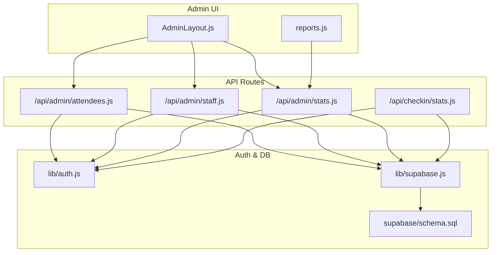
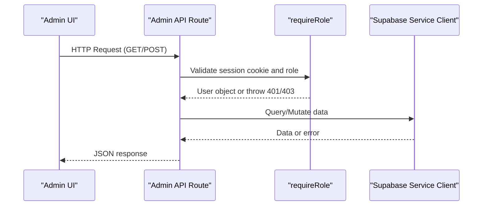
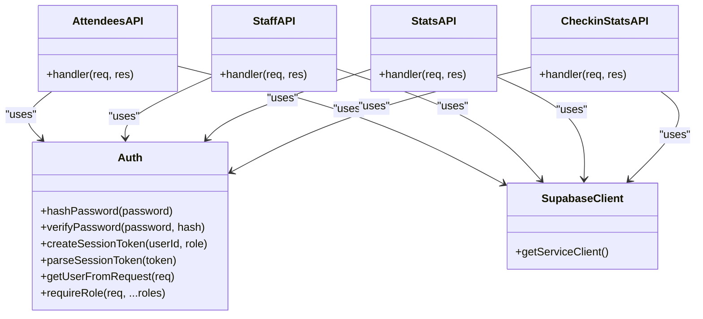

# Admin API Routes

<cite>
**Referenced Files in This Document**
- [attendees.js](file://pages/api/admin/attendees.js)
- [staff.js](file://pages/api/admin/staff.js)
- [stats.js](file://pages/api/admin/stats.js)
- [auth.js](file://lib/auth.js)
- [supabase.js](file://lib/supabase.js)
- [schema.sql](file://supabase/schema.sql)
- [login.js](file://pages/api/auth/login.js)
- [AdminLayout.js](file://components/AdminLayout.js)
- [reports.js](file://pages/admin/reports.js)
- [checkin_stats.js](file://pages/api/checkin/stats.js)
</cite>

## Table of Contents
1. Introduction
2. Project Structure
3. Core Components
4. Architecture Overview
5. Detailed Component Analysis
6. Dependency Analysis
7. Performance Considerations
8. Troubleshooting Guide
9. Conclusion

## Introduction
This document provides detailed documentation for the administrative API routes that power the admin dashboard backend. It covers attendee management, staff administration, and analytics/statistics retrieval. It explains role-based access control (RBAC), data filtering patterns used by the endpoints, and export functionality available from the reports UI. Security measures for admin operations are described, along with guidance on audit logging and performance optimization for large datasets.

## Project Structure
The admin APIs are implemented as Next.js serverless functions under pages/api/admin. They rely on a shared authentication utility and a Supabase service client to perform privileged database operations. The admin UI is composed of React pages that call these endpoints and render dashboards and reports.

**Diagram sources**
- [AdminLayout.js](file://components/AdminLayout.js)
- [reports.js](file://pages/admin/reports.js)
- [attendees.js](file://pages/api/admin/attendees.js)
- [staff.js](file://pages/api/admin/staff.js)
- [stats.js](file://pages/api/admin/stats.js)
- [checkin_stats.js](file://pages/api/checkin/stats.js)
- [auth.js](file://lib/auth.js)
- [supabase.js](file://lib/supabase.js)
- [schema.sql](file://supabase/schema.sql)

**Section sources**
- [AdminLayout.js](file://components/AdminLayout.js)
- [reports.js](file://pages/admin/reports.js)
- [attendees.js](file://pages/api/admin/attendees.js)
- [staff.js](file://pages/api/admin/staff.js)
- [stats.js](file://pages/api/admin/stats.js)
- [checkin_stats.js](file://pages/api/checkin/stats.js)
- [auth.js](file://lib/auth.js)
- [supabase.js](file://lib/supabase.js)
- [schema.sql](file://supabase/schema.sql)

## Core Components
- Authentication and RBAC:
  - Session token creation and parsing
  - Cookie-based session extraction
  - Role enforcement middleware function
- Supabase service client:
  - Privileged client using service role key for admin operations
- Database schema:
  - Users, Events, Tickets, Payments, Check-ins, Promo Codes
  - Indexes and RLS policies

Key responsibilities:
- /api/admin/attendees.js: Retrieve attendees for an event with optional search filtering.
- /api/admin/staff.js: List gate staff and create new staff accounts.
- /api/admin/stats.js: Aggregate revenue, tickets sold, and per-event statistics.
- /api/checkin/stats.js: Provide check-in metrics and recent activity for an event.

**Section sources**
- [auth.js](file://lib/auth.js)
- [supabase.js](file://lib/supabase.js)
- [schema.sql](file://supabase/schema.sql)
- [attendees.js](file://pages/api/admin/attendees.js)
- [staff.js](file://pages/api/admin/staff.js)
- [stats.js](file://pages/api/admin/stats.js)
- [checkin_stats.js](file://pages/api/checkin/stats.js)

## Architecture Overview
The admin APIs follow a consistent pattern:
- Enforce authentication and role checks via requireRole.
- Use a service-role Supabase client to query or mutate data.
- Return structured JSON responses with error handling.

**Diagram sources**
- [auth.js](file://lib/auth.js)
- [supabase.js](file://lib/supabase.js)
- [attendees.js](file://pages/api/admin/attendees.js)
- [staff.js](file://pages/api/admin/staff.js)
- [stats.js](file://pages/api/admin/stats.js)
- [checkin_stats.js](file://pages/api/checkin/stats.js)

## Detailed Component Analysis

### Attendees Endpoint (/api/admin/attendees.js)
Purpose:
- Retrieve all attendees for a given event, optionally filtered by a search term across buyer name, email, phone, and QR code token.

Access Control:
- Requires one of: super_admin, organiser, gate_staff.

Request:
- Method: GET
- Query parameters:
  - eventId (required): Event identifier
  - search (optional): Search string applied to buyer_name, buyer_email, buyer_phone, qr_code_token

Response:
- JSON object with attendees array containing ticket details and associated ticket type metadata.

Error Handling:
- 405 if method not supported
- 400 if eventId missing
- 500 for database errors

Data Filtering Pattern:
- Uses ILIKE substring matching across multiple fields via OR condition.

Performance Notes:
- No pagination; consider adding limit/offset for large events.
- Ensure indexes exist on event_id and relevant text fields for search performance.

Security:
- Uses service-role client; ensure RLS policies do not expose unintended data.
- Avoid returning sensitive fields beyond what is necessary.

Example Usage:
- GET /api/admin/attendees?eventId=EVENT_ID&search=john

**Section sources**
- [attendees.js](file://pages/api/admin/attendees.js)
- [auth.js](file://lib/auth.js)
- [supabase.js](file://lib/supabase.js)
- [schema.sql](file://supabase/schema.sql)

### Staff Endpoint (/api/admin/staff.js)
Purpose:
- List gate staff users and create new gate staff accounts.

Access Control:
- Requires one of: super_admin, organiser.

Requests:
- GET /api/admin/staff
  - Returns list of gate_staff users with id, email, full_name, phone, is_active, created_at.
- POST /api/admin/staff
  - Body fields:
    - full_name (required)
    - email (required)
    - password (required)
    - phone (optional)
  - Creates user with role gate_staff and is_active true. Password is hashed before storage.

Response:
- GET returns { staff: [...] }
- POST returns { staff: {...} } with status 201

Validation:
- Missing required fields return 400 with error message.

Error Handling:
- 405 for unsupported methods
- 400 for validation or DB errors
- 500 for unexpected errors

Security:
- Passwords are hashed using bcrypt with salt rounds configured.
- Email normalized to lowercase and trimmed.

Example Usage:
- GET /api/admin/staff
- POST /api/admin/staff with JSON body { full_name, email, password, phone }

**Section sources**
- [staff.js](file://pages/api/admin/staff.js)
- [auth.js](file://lib/auth.js)
- [supabase.js](file://lib/supabase.js)
- [schema.sql](file://supabase/schema.sql)

### Stats Endpoint (/api/admin/stats.js)
Purpose:
- Aggregate overall and per-event statistics including total revenue, total tickets sold, number of events, and per-event breakdowns.

Access Control:
- Requires one of: super_admin, organiser.
- For non-super_admin users, only their own events are included based on organiser_id.

Processing Flow:
- Fetch events visible to the current user.
- Compute event IDs and fetch payments and tickets concurrently.
- Calculate total revenue from completed payments linked to tickets within those events.
- Count tickets sold excluding cancelled/refunded statuses.
- Build per-event stats: sold count and checked-in count.

Response:
- JSON object with:
  - totalRevenue
  - totalTicketsSold
  - totalEvents
  - events: array of per-event stats including id, event_name, status, date, capacity, sold, checkedIn

Error Handling:
- 405 for unsupported methods
- 500 for unexpected errors

Performance Notes:
- Uses Promise.all to parallelize payments and tickets queries.
- Consider caching results for large datasets or adding time-range filters.

Example Usage:
- GET /api/admin/stats

**Section sources**
- [stats.js](file://pages/api/admin/stats.js)
- [auth.js](file://lib/auth.js)
- [supabase.js](file://lib/supabase.js)
- [schema.sql](file://supabase/schema.sql)

### Check-in Stats Endpoint (/api/checkin/stats.js)
Purpose:
- Provide check-in metrics and recent check-in activity for an event.

Access Control:
- Requires one of: super_admin, organiser, gate_staff.

Request:
- Method: GET
- Query parameter: eventId (required)

Response:
- JSON object with:
  - total: active + checked-in tickets
  - checkedIn: count of checked-in tickets
  - capacity: event capacity
  - eventName: event name
  - recent: last 20 check-ins with ticket and ticket type info

Error Handling:
- 405 for unsupported methods
- 400 if eventId missing
- 500 for unexpected errors

Performance Notes:
- Uses head queries for counts to avoid fetching full rows.
- Recent check-ins limited to 20 entries.

Example Usage:
- GET /api/checkin/stats?eventId=EVENT_ID

**Section sources**
- [checkin_stats.js](file://pages/api/checkin/stats.js)
- [auth.js](file://lib/auth.js)
- [supabase.js](file://lib/supabase.js)
- [schema.sql](file://supabase/schema.sql)

### Authentication and Session Management
- Login flow:
  - Validates credentials against users table.
  - Sets a secure HttpOnly cookie with a base64-encoded session payload containing userId, role, and expiration.
- Session parsing:
  - Extracts cookie value and decodes payload.
  - Validates expiration.
- Role enforcement:
  - requireRole throws 401 if no valid session, 403 if insufficient role.

Security Measures:
- Password hashing with bcrypt.
- Session tokens include expiration.
- Service-role client used only server-side for admin operations.

**Section sources**
- [login.js](file://pages/api/auth/login.js)
- [auth.js](file://lib/auth.js)
- [supabase.js](file://lib/supabase.js)
- [schema.sql](file://supabase/schema.sql)

### Reports Export Functionality
The Reports page provides client-side CSV export of event breakdown data. It constructs a CSV blob from the stats.events array and triggers a download.

Export Behavior:
- Generates CSV with headers: Event, Status, Date, Tickets Sold, Checked In.
- Downloads file named tiketflow-report.csv.

Limitations:
- Export is client-side and depends on the stats endpoint data.
- PDF and Excel exports are disabled in the UI.

Usage:
- Click “Export CSV” button on the Reports page.

**Section sources**
- [reports.js](file://pages/admin/reports.js)
- [stats.js](file://pages/api/admin/stats.js)

## Dependency Analysis
The admin APIs depend on shared utilities and the database schema. The following diagram shows core dependencies and relationships.

**Diagram sources**
- [auth.js](file://lib/auth.js)
- [supabase.js](file://lib/supabase.js)
- [attendees.js](file://pages/api/admin/attendees.js)
- [staff.js](file://pages/api/admin/staff.js)
- [stats.js](file://pages/api/admin/stats.js)
- [checkin_stats.js](file://pages/api/checkin/stats.js)

**Section sources**
- [auth.js](file://lib/auth.js)
- [supabase.js](file://lib/supabase.js)
- [attendees.js](file://pages/api/admin/attendees.js)
- [staff.js](file://pages/api/admin/staff.js)
- [stats.js](file://pages/api/admin/stats.js)
- [checkin_stats.js](file://pages/api/checkin/stats.js)

## Performance Considerations
- Pagination:
  - Attendees endpoint lacks pagination; add limit/offset or cursor-based pagination for large events.
- Query Optimization:
  - Use head queries for counts where possible (as done in check-in stats).
  - Leverage existing indexes on event_id, qr_code_token, buyer_email.
- Concurrency:
  - Parallelize independent queries using Promise.all (as implemented in stats endpoint).
- Caching:
  - Consider server-side caching for stats endpoint responses, especially for aggregated data.
- Data Minimization:
  - Select only necessary fields to reduce payload size.
- Rate Limiting:
  - Implement rate limiting at the API layer to prevent abuse.

[No sources needed since this section provides general guidance]

## Troubleshooting Guide
Common Issues:
- 401 Not authenticated:
  - Ensure tf_session cookie is present and valid.
  - Verify login endpoint sets the cookie correctly.
- 403 Insufficient permissions:
  - Check user role against allowed roles for the endpoint.
- 400 Bad request:
  - Validate required parameters (e.g., eventId for attendees and check-in stats).
  - Ensure POST payloads contain required fields for staff creation.
- 500 Internal server error:
  - Review database connection and service role key configuration.
  - Check Supabase environment variables.

Debugging Tips:
- Log request payloads and query parameters.
- Inspect Supabase client initialization and environment variables.
- Validate schema constraints and indexes.

**Section sources**
- [auth.js](file://lib/auth.js)
- [login.js](file://pages/api/auth/login.js)
- [attendees.js](file://pages/api/admin/attendees.js)
- [staff.js](file://pages/api/admin/staff.js)
- [stats.js](file://pages/api/admin/stats.js)
- [checkin_stats.js](file://pages/api/checkin/stats.js)

## Conclusion
The admin API suite provides robust endpoints for attendee management, staff administration, and analytics aggregation. RBAC is enforced consistently through a shared middleware, and the service-role Supabase client ensures privileged access. While the current implementation offers essential functionality, enhancements such as pagination, caching, and comprehensive audit logging can improve scalability and security for large-scale deployments.

[No sources needed since this section summarizes without analyzing specific files]