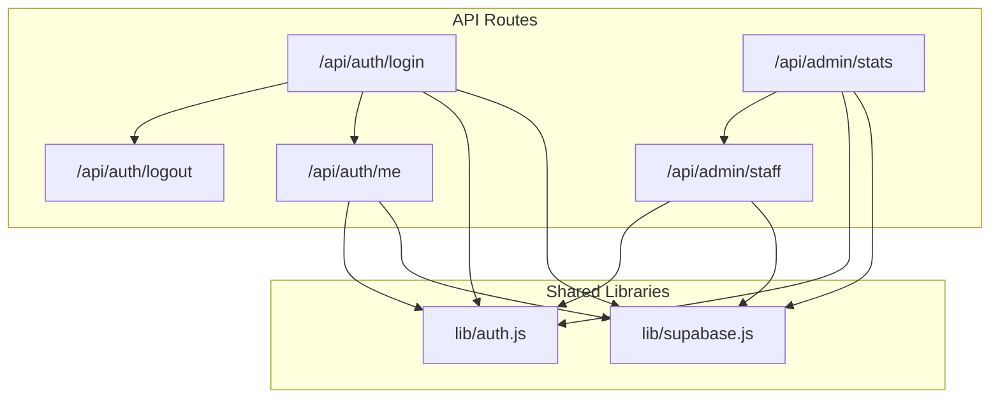
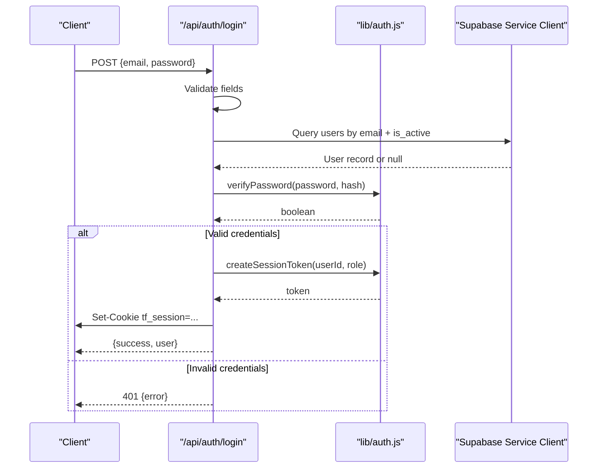
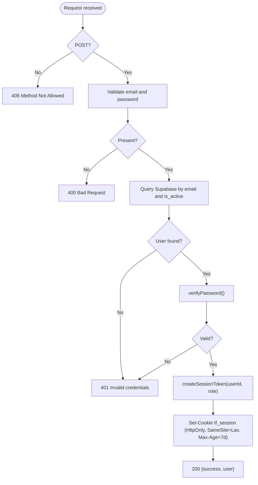
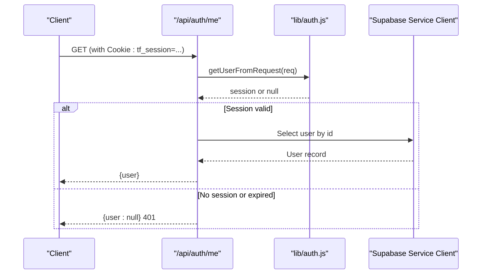
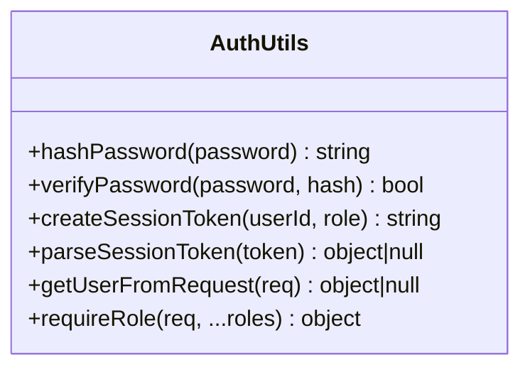
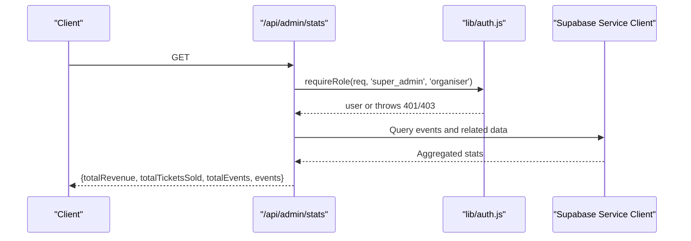
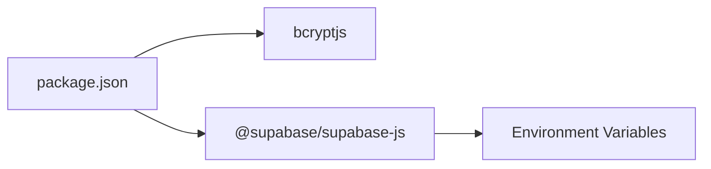

# Authentication Routes

<cite>
**Referenced Files in This Document**
- [login.js](file://pages/api/auth/login.js)
- [logout.js](file://pages/api/auth/logout.js)
- [me.js](file://pages/api/auth/me.js)
- [auth.js](file://lib/auth.js)
- [supabase.js](file://lib/supabase.js)
- [stats.js](file://pages/api/admin/stats.js)
- [staff.js](file://pages/api/admin/staff.js)
- [package.json](file://package.json)
</cite>

## Table of Contents
1. [Introduction](#introduction)
2. [Project Structure](#project-structure)
3. [Core Components](#core-components)
4. [Architecture Overview](#architecture-overview)
5. [Detailed Component Analysis](#detailed-component-analysis)
6. [Dependency Analysis](#dependency-analysis)
7. [Performance Considerations](#performance-considerations)
8. [Troubleshooting Guide](#troubleshooting-guide)
9. [Conclusion](#conclusion)

## Introduction
This document explains the authentication API routes in TicketFlow, focusing on:
- Login endpoint implementation with email/password validation and bcrypt-based password verification
- JWT-like session token generation and storage via HTTP-only cookies
- User role-based access control using a middleware helper
- Logout functionality and session validation
- Error handling patterns for invalid credentials and account status checks
- Security best practices for authentication flows

The system uses Supabase as the data layer and bcryptjs for secure password hashing. Session state is maintained through an HttpOnly cookie containing a base64-encoded payload with user identity and expiration.

## Project Structure
Authentication-related code is organized under:
- pages/api/auth: API endpoints for login, logout, and current user retrieval
- lib/auth.js: Shared utilities for password hashing/verification, session token creation/parsing, and role-based authorization
- lib/supabase.js: Supabase client configuration (service role key for server-side operations)
- pages/api/admin/*: Example protected endpoints demonstrating role-based access control



**Diagram sources**
- [login.js:1-31](file://pages/api/auth/login.js#L1-L31)
- [logout.js:1-5](file://pages/api/auth/logout.js#L1-L5)
- [me.js:1-19](file://pages/api/auth/me.js#L1-L19)
- [auth.js:1-47](file://lib/auth.js#L1-L47)
- [supabase.js:1-23](file://lib/supabase.js#L1-L23)
- [stats.js:1-41](file://pages/api/admin/stats.js#L1-L41)
- [staff.js:1-28](file://pages/api/admin/staff.js#L1-L28)

**Section sources**
- [login.js:1-31](file://pages/api/auth/login.js#L1-L31)
- [logout.js:1-5](file://pages/api/auth/logout.js#L1-L5)
- [me.js:1-19](file://pages/api/auth/me.js#L1-L19)
- [auth.js:1-47](file://lib/auth.js#L1-L47)
- [supabase.js:1-23](file://lib/supabase.js#L1-L23)
- [stats.js:1-41](file://pages/api/admin/stats.js#L1-L41)
- [staff.js:1-28](file://pages/api/admin/staff.js#L1-L28)

## Core Components
- Password hashing and verification: Implemented with bcryptjs to securely hash and compare passwords.
- Session token management: Base64-encoded JSON payload containing userId, role, and expiration; stored in an HttpOnly cookie.
- Request parsing and validation: Email normalization and presence checks before database lookup.
- Role-based access control: Middleware function that validates authentication and required roles.
- Data access: Supabase service-role client used for privileged server-side queries.

Key responsibilities:
- /api/auth/login: Validates input, verifies credentials, sets session cookie, returns minimal user info.
- /api/auth/logout: Clears session cookie.
- /api/auth/me: Reads session cookie, validates it, and returns current user details.
- requireRole: Enforces authentication and role checks for protected endpoints.

**Section sources**
- [auth.js:1-47](file://lib/auth.js#L1-L47)
- [login.js:1-31](file://pages/api/auth/login.js#L1-L31)
- [logout.js:1-5](file://pages/api/auth/logout.js#L1-L5)
- [me.js:1-19](file://pages/api/auth/me.js#L1-L19)

## Architecture Overview
The authentication flow consists of three primary endpoints and shared utilities:



**Diagram sources**
- [login.js:1-31](file://pages/api/auth/login.js#L1-L31)
- [auth.js:1-47](file://lib/auth.js#L1-L47)
- [supabase.js:1-23](file://lib/supabase.js#L1-L23)

## Detailed Component Analysis

### Login Endpoint (/api/auth/login)
Responsibilities:
- Accepts POST requests with email and password
- Normalizes email and enforces presence checks
- Queries Supabase for an active user by email
- Verifies password using bcrypt
- Generates a session token and sets an HttpOnly cookie
- Returns minimal user information

Security considerations:
- Uses bcrypt for password comparison
- Sets HttpOnly and SameSite=Lax cookie flags
- Limits exposed user fields in response
- Checks account activation status

Error handling:
- 400 for missing fields
- 401 for invalid credentials or inactive accounts
- 500 for unexpected errors



**Diagram sources**
- [login.js:1-31](file://pages/api/auth/login.js#L1-L31)
- [auth.js:1-47](file://lib/auth.js#L1-L47)

**Section sources**
- [login.js:1-31](file://pages/api/auth/login.js#L1-L31)
- [auth.js:1-47](file://lib/auth.js#L1-L47)

### Logout Endpoint (/api/auth/logout)
Responsibilities:
- Clears the session cookie by setting an empty value with Max-Age=0
- Returns success response

Behavior:
- No request body validation needed
- Ensures cookie attributes match those set during login for proper clearing

```mermaid
sequenceDiagram
participant Client as "Client"
participant Logout as "/api/auth/logout"
Client->>Logout : GET/POST
Logout->>Client : Set-Cookie tf_session=; Max-Age=0
Logout-->>Client : {success : true}
```

**Diagram sources**
- [logout.js:1-5](file://pages/api/auth/logout.js#L1-L5)

**Section sources**
- [logout.js:1-5](file://pages/api/auth/logout.js#L1-L5)

### Current User Endpoint (/api/auth/me)
Responsibilities:
- Parses session cookie from request headers
- Validates token and expiration
- Retrieves full user details from Supabase
- Returns user object or null if not authenticated

Security considerations:
- Relies on HttpOnly cookie to prevent client-side script access
- Validates token expiration before returning user data



**Diagram sources**
- [me.js:1-19](file://pages/api/auth/me.js#L1-L19)
- [auth.js:1-47](file://lib/auth.js#L1-L47)
- [supabase.js:1-23](file://lib/supabase.js#L1-L23)

**Section sources**
- [me.js:1-19](file://pages/api/auth/me.js#L1-L19)
- [auth.js:1-47](file://lib/auth.js#L1-L47)

### Authentication Utilities (lib/auth.js)
Functions:
- hashPassword(password): Securely hashes passwords using bcrypt with a cost factor
- verifyPassword(password, hash): Compares plaintext password against stored hash
- createSessionToken(userId, role): Encodes user identity and role with expiration into a base64 string
- parseSessionToken(token): Decodes and validates token expiration
- getUserFromRequest(req): Extracts and parses session cookie from request headers
- requireRole(req, ...roles): Middleware that ensures authentication and role authorization

Complexity:
- Password hashing/verification: O(1) per call relative to input size; computational cost depends on bcrypt cost factor
- Token encoding/decoding: O(n) where n is payload length
- Cookie parsing: O(1) regex match

Error handling:
- Throws structured error objects with status codes for middleware usage
- Gracefully handles malformed tokens by returning null



**Diagram sources**
- [auth.js:1-47](file://lib/auth.js#L1-L47)

**Section sources**
- [auth.js:1-47](file://lib/auth.js#L1-L47)

### Protected Route Examples (Admin APIs)
Examples demonstrate how to enforce role-based access control:
- /api/admin/stats: Requires super_admin or organiser roles
- /api/admin/staff: Requires super_admin or organiser roles; supports creating gate_staff users with hashed passwords

Pattern:
- Call requireRole at the start of handlers
- Use returned user object to scope queries (e.g., filter events by organiser_id)
- Catch thrown errors and map to appropriate HTTP responses



**Diagram sources**
- [stats.js:1-41](file://pages/api/admin/stats.js#L1-L41)
- [auth.js:1-47](file://lib/auth.js#L1-L47)

**Section sources**
- [stats.js:1-41](file://pages/api/admin/stats.js#L1-L41)
- [staff.js:1-28](file://pages/api/admin/staff.js#L1-L28)
- [auth.js:1-47](file://lib/auth.js#L1-L47)

## Dependency Analysis
External dependencies relevant to authentication:
- bcryptjs: Used for secure password hashing and verification
- @supabase/supabase-js: Provides service-role client for server-side database access

Environment variables:
- NEXT_PUBLIC_SUPABASE_URL and NEXT_PUBLIC_SUPABASE_ANON_KEY: Public client configuration
- SUPABASE_SERVICE_ROLE_KEY: Privileged server-side client configuration



**Diagram sources**
- [package.json:1-24](file://package.json#L1-L24)
- [supabase.js:1-23](file://lib/supabase.js#L1-L23)

**Section sources**
- [package.json:1-24](file://package.json#L1-L24)
- [supabase.js:1-23](file://lib/supabase.js#L1-L23)

## Performance Considerations
- Password hashing cost: bcrypt cost factor balances security and latency; ensure it is tuned appropriately for your environment
- Database queries: Minimize fields selected and use indexed columns (e.g., email) to reduce query time
- Cookie parsing: Regex matching is lightweight; avoid unnecessary re-parsing
- Token size: Keep payloads small to minimize cookie overhead

[No sources needed since this section provides general guidance]

## Troubleshooting Guide
Common issues and resolutions:
- Missing email or password: Ensure client sends both fields; handler returns 400 when absent
- Invalid credentials: Occurs when user not found, inactive, or password mismatch; verify database records and password hashing
- Account inactive: Users must have is_active=true to log in; update user status accordingly
- Session not present: Confirm cookie is set and sent with subsequent requests; check browser settings and CORS/SameSite configuration
- Expired session: Tokens expire after configured duration; refresh or re-authenticate
- Role insufficient: Protected endpoints throw 403 when user lacks required role; adjust user role or endpoint requirements

Error patterns:
- 400: Validation failures
- 401: Authentication failures or missing session
- 403: Authorization failures (insufficient permissions)
- 405: Unsupported HTTP methods
- 500: Unexpected server errors

**Section sources**
- [login.js:1-31](file://pages/api/auth/login.js#L1-L31)
- [me.js:1-19](file://pages/api/auth/me.js#L1-L19)
- [auth.js:1-47](file://lib/auth.js#L1-L47)
- [stats.js:1-41](file://pages/api/admin/stats.js#L1-L41)

## Conclusion
TicketFlow’s authentication system implements a straightforward yet secure approach:
- Input validation and bcrypt-based password verification protect against common attacks
- HttpOnly cookies store session tokens safely on the client side
- Role-based middleware centralizes authorization logic across protected endpoints
- Clear error handling and consistent response formats simplify client-side integration

For production hardening, consider migrating to a dedicated auth solution (e.g., NextAuth or Supabase Auth), adding CSRF protection, implementing rate limiting, and rotating secrets regularly.

[No sources needed since this section summarizes without analyzing specific files]