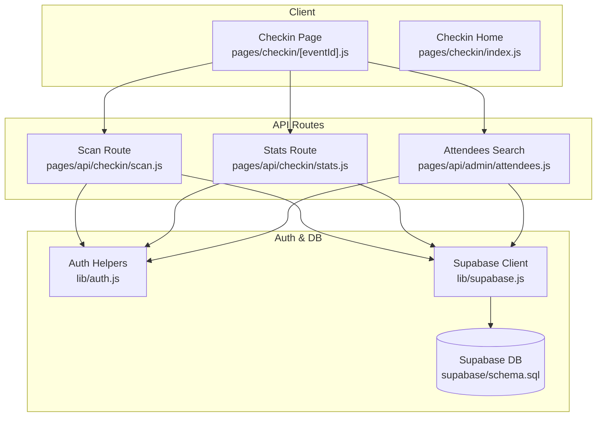
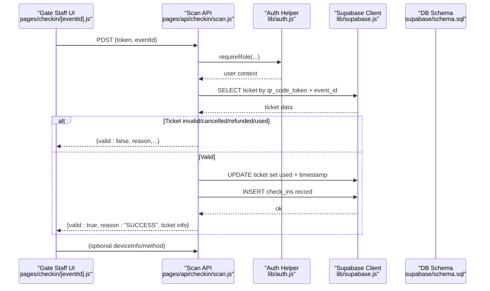
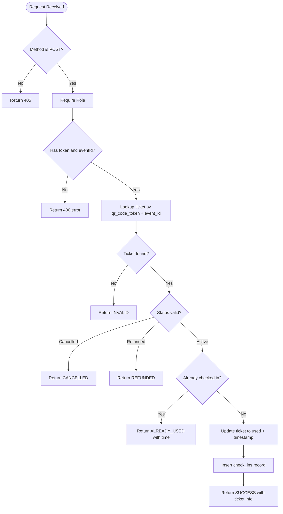
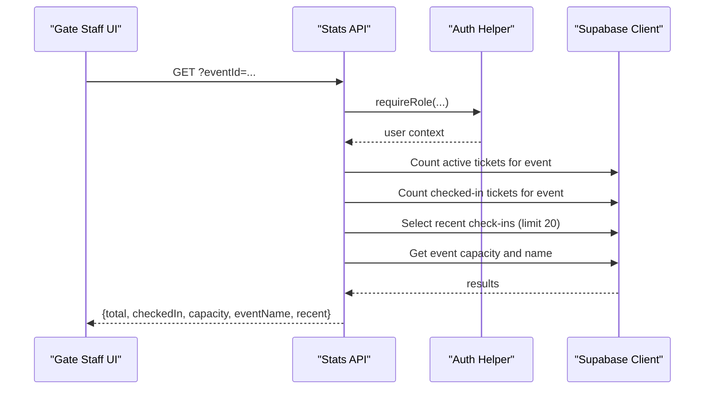
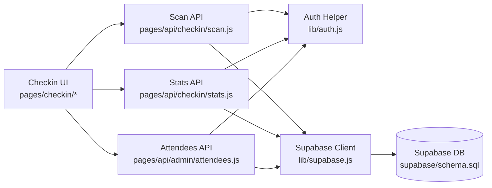

# Check-in Validation Routes

<cite>
**Referenced Files in This Document**
- [scan.js](file://pages/api/checkin/scan.js)
- [stats.js](file://pages/api/checkin/stats.js)
- [attendees.js](file://pages/api/admin/attendees.js)
- [schema.sql](file://supabase/schema.sql)
- [supabase.js](file://lib/supabase.js)
- [auth.js](file://lib/auth.js)
- [checkin index page](file://pages/checkin/index.js)
- [checkin event page](file://pages/checkin/[eventId].js)
</cite>

## Table of Contents
1. [Introduction](#introduction)
2. [Project Structure](#project-structure)
3. [Core Components](#core-components)
4. [Architecture Overview](#architecture-overview)
5. [Detailed Component Analysis](#detailed-component-analysis)
6. [Dependency Analysis](#dependency-analysis)
7. [Performance Considerations](#performance-considerations)
8. [Troubleshooting Guide](#troubleshooting-guide)
9. [Conclusion](#conclusion)

## Introduction
This document explains the check-in validation API routes that power QR code scanning and ticket verification for events. It covers how the scan endpoint validates tickets, prevents duplicate entries, records real-time attendance, and exposes statistics for live monitoring. It also documents the client-side workflow used by gate staff to scan or manually search attendees, refresh stats in real time, and handle edge cases such as invalid or already-used tickets.

## Project Structure
The check-in feature is implemented with:
- Two API routes under pages/api/checkin:
  - POST /api/checkin/scan — validates and processes a ticket scan
  - GET /api/checkin/stats — returns event-level attendance statistics and recent scans
- A gate staff UI under pages/checkin that polls stats and calls the scan endpoint
- Database schema under supabase/schema.sql defining tables for users, events, tickets, check-ins, and related entities
- Authentication helpers under lib/auth.js and Supabase client configuration under lib/supabase.js

**Diagram sources**
- [checkin event page](file://pages/checkin/[eventId].js)
- [checkin index page](file://pages/checkin/index.js)
- [scan.js](file://pages/api/checkin/scan.js)
- [stats.js](file://pages/api/checkin/stats.js)
- [attendees.js](file://pages/api/admin/attendees.js)
- [auth.js](file://lib/auth.js)
- [supabase.js](file://lib/supabase.js)
- [schema.sql](file://supabase/schema.sql)

**Section sources**
- [scan.js](file://pages/api/checkin/scan.js)
- [stats.js](file://pages/api/checkin/stats.js)
- [attendees.js](file://pages/api/admin/attendees.js)
- [schema.sql](file://supabase/schema.sql)
- [supabase.js](file://lib/supabase.js)
- [auth.js](file://lib/auth.js)
- [checkin index page](file://pages/checkin/index.js)
- [checkin event page](file://pages/checkin/[eventId].js)

## Core Components
- Scan endpoint (POST /api/checkin/scan):
  - Requires authenticated staff role
  - Validates token and eventId presence
  - Looks up ticket by qr_code_token and event_id
  - Enforces status checks (cancelled/refunded) and duplicate prevention (already checked in)
  - Updates ticket to used and records a check-in entry
  - Returns success or failure reason codes
- Stats endpoint (GET /api/checkin/stats):
  - Requires authenticated staff role
  - Aggregates total active tickets, currently checked-in count, and capacity
  - Returns recent check-ins with buyer and ticket type info
- Attendees search (GET /api/admin/attendees):
  - Supports searching by name, email, phone, or token for manual check-in flows
- Auth helpers:
  - Session parsing from cookies and role enforcement
- Supabase client:
  - Service role client for server-side privileged access

**Section sources**
- [scan.js](file://pages/api/checkin/scan.js)
- [stats.js](file://pages/api/checkin/stats.js)
- [attendees.js](file://pages/api/admin/attendees.js)
- [auth.js](file://lib/auth.js)
- [supabase.js](file://lib/supabase.js)

## Architecture Overview
The check-in flow combines client-side scanning input with server-side validation and database updates. The gate staff UI polls stats every few seconds to reflect real-time changes.

**Diagram sources**
- [checkin event page](file://pages/checkin/[eventId].js)
- [scan.js](file://pages/api/checkin/scan.js)
- [auth.js](file://lib/auth.js)
- [supabase.js](file://lib/supabase.js)
- [schema.sql](file://supabase/schema.sql)

## Detailed Component Analysis

### Scan Endpoint (POST /api/checkin/scan)
Responsibilities:
- Enforce authentication and role-based access
- Validate request payload (token, eventId)
- Query ticket by unique qr_code_token and matching event_id
- Apply business rules:
  - Reject if not found or wrong event
  - Reject if cancelled or refunded
  - Prevent duplicate entry if already checked in
- On success:
  - Mark ticket as checked in with timestamp and staff id
  - Insert a check-in audit record with method and optional device info
  - Return structured success response including buyer details

Validation workflow:
- Input validation ensures required fields exist
- Single-row query avoids ambiguity and improves performance
- Status checks prevent misuse of invalid tickets
- Duplicate prevention uses is_checked_in flag and recorded timestamp

Error handling:
- Missing fields return 400
- Unauthorized/forbidden errors propagate via auth helper
- Unexpected errors return 500 with message

Edge cases handled:
- Invalid token or mismatched event_id → INVALID
- Cancelled or refunded tickets → CANCELLED or REFUNDED
- Already used tickets → ALREADY_USED with previous check-in time

**Diagram sources**
- [scan.js](file://pages/api/checkin/scan.js)

**Section sources**
- [scan.js](file://pages/api/checkin/scan.js)

### Stats Endpoint (GET /api/checkin/stats)
Responsibilities:
- Enforce authentication and role-based access
- Aggregate counts for total active tickets and currently checked-in tickets
- Fetch recent check-ins with buyer and ticket type details
- Retrieve event capacity and name
- Return consolidated stats object for real-time dashboard

Data aggregation:
- Uses parallel queries for efficiency
- Counts are exact using head queries
- Recent scans limited to last 20 entries ordered by scanned_at

Real-time synchronization:
- Client polls this endpoint periodically to update UI counters and recent list

**Diagram sources**
- [stats.js](file://pages/api/checkin/stats.js)
- [auth.js](file://lib/auth.js)
- [supabase.js](file://lib/supabase.js)

**Section sources**
- [stats.js](file://pages/api/checkin/stats.js)

### Attendees Search (GET /api/admin/attendees)
Responsibilities:
- Enforce authentication and role-based access
- Support filtering by eventId
- Optional search across buyer_name, buyer_email, buyer_phone, and qr_code_token
- Return attendee list with ticket types

Use case:
- Manual lookup when QR scanning fails or for assisted check-in

**Section sources**
- [attendees.js](file://pages/api/admin/attendees.js)

### Client-Side Workflow (Gate Staff UI)
Responsibilities:
- Provide tabs for Scan, Manual Search, and Recent Scans
- Accept QR scanner input or paste token
- Call scan endpoint and display result with color-coded feedback
- Poll stats every 10 seconds to keep counters and recent list fresh
- Handle network errors gracefully

Real-time patterns:
- Interval-based polling for stats
- Immediate refresh after successful scan
- Auto-clearing result messages after timeout

**Section sources**
- [checkin event page](file://pages/checkin/[eventId].js)
- [checkin index page](file://pages/checkin/index.js)

### Data Model and Constraints
Key tables and relationships:
- users: roles include super_admin, organiser, gate_staff
- events: includes capacity and status
- ticket_types: per-event ticket categories
- tickets: unique qr_code_token, checked-in flags and timestamps
- check_ins: audit trail for each scan with method and device info
- payments and promo_codes: present but not directly involved in check-in flow

Indexes:
- Optimized lookups on qr_code_token, event_id, and check-ins by event_id

Row Level Security:
- Policies enable public read for published events and ticket types
- Service role client bypasses RLS for admin operations

**Section sources**
- [schema.sql](file://supabase/schema.sql)

## Dependency Analysis
Component coupling:
- Scan and Stats endpoints depend on auth.js for role enforcement
- Both endpoints use supabase.js service client for privileged DB access
- Client UI depends on both endpoints and polls stats for real-time updates
- Attendees search supports manual workflows and integrates with the same auth and DB layer

Potential circular dependencies:
- None detected; clear separation between client, API routes, and shared libraries

External dependencies:
- Supabase JS client for database operations
- bcryptjs for password hashing (not used in check-in paths)
- Next.js routing and serverless functions

**Diagram sources**
- [checkin event page](file://pages/checkin/[eventId].js)
- [checkin index page](file://pages/checkin/index.js)
- [scan.js](file://pages/api/checkin/scan.js)
- [stats.js](file://pages/api/checkin/stats.js)
- [attendees.js](file://pages/api/admin/attendees.js)
- [auth.js](file://lib/auth.js)
- [supabase.js](file://lib/supabase.js)
- [schema.sql](file://supabase/schema.sql)

**Section sources**
- [scan.js](file://pages/api/checkin/scan.js)
- [stats.js](file://pages/api/checkin/stats.js)
- [attendees.js](file://pages/api/admin/attendees.js)
- [auth.js](file://lib/auth.js)
- [supabase.js](file://lib/supabase.js)
- [schema.sql](file://supabase/schema.sql)

## Performance Considerations
High-volume scanning optimizations:
- Use service role client to avoid RLS overhead and ensure consistent permissions
- Leverage indexes on qr_code_token and event_id for fast lookups
- Keep payloads minimal; only necessary fields sent to scan endpoint
- Avoid heavy computations in API handlers; rely on DB constraints and indexes

Real-time synchronization patterns:
- Poll stats at reasonable intervals (e.g., every 10 seconds) to balance freshness and load
- Debounce rapid repeated scans to reduce redundant requests
- Consider caching frequently accessed event metadata (capacity, name) on the client side

Capacity limits:
- Current implementation does not enforce capacity checks during scan; consider adding a pre-check against event.capacity vs checkedIn before allowing new check-ins
- If enforcing capacity, add atomic checks to prevent race conditions under high concurrency

Network resilience:
- Handle fetch failures gracefully and show user-friendly error messages
- Implement retry logic for transient network issues
- Provide fallback manual search when QR scanning fails

## Troubleshooting Guide
Common issues and resolutions:
- 401 Not authenticated: Ensure session cookie is present and valid; verify role includes super_admin, organiser, or gate_staff
- 403 Insufficient permissions: User role does not match required roles for check-in endpoints
- 400 Missing token or eventId: Validate request body contains required fields
- INVALID ticket: Token not found or not associated with the specified event
- CANCELLED or REFUNDED: Ticket status prohibits entry; inform staff to review ticket history
- ALREADY_USED: Ticket was previously checked in; display previous check-in time to staff
- Network errors: Retry request or switch to manual search; log error details for debugging

Debugging tips:
- Verify Supabase environment variables are configured correctly
- Confirm indexes exist on qr_code_token and event_id
- Review recent check-ins to identify duplicates or anomalies
- Use attendees search to locate tickets by partial information

**Section sources**
- [scan.js](file://pages/api/checkin/scan.js)
- [stats.js](file://pages/api/checkin/stats.js)
- [attendees.js](file://pages/api/admin/attendees.js)
- [auth.js](file://lib/auth.js)
- [supabase.js](file://lib/supabase.js)

## Conclusion
The check-in validation system provides a robust, secure, and efficient workflow for QR code scanning and ticket verification. The scan endpoint enforces critical business rules, prevents duplicate entries, and records real-time attendance. The stats endpoint enables live monitoring and supports high-throughput scenarios through optimized queries and indexing. For production deployments, consider adding capacity enforcement, enhanced error reporting, and additional caching strategies to further improve performance and reliability.