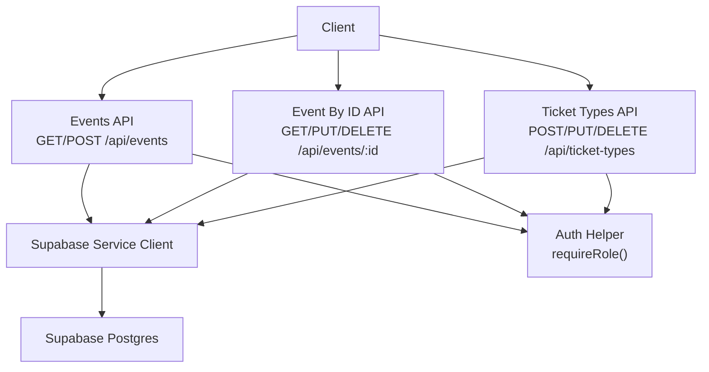
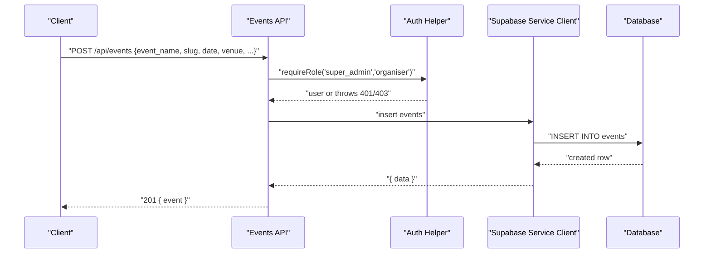
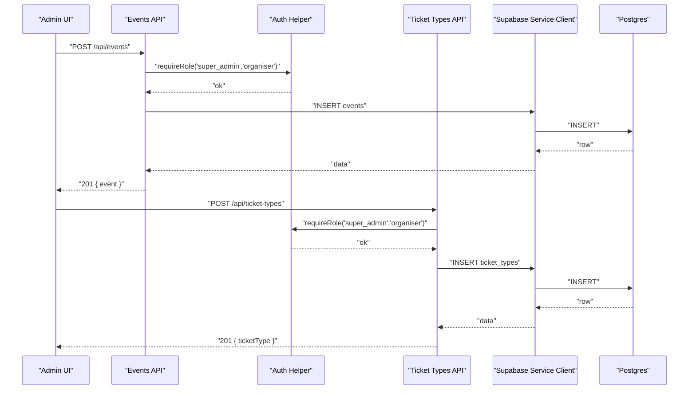
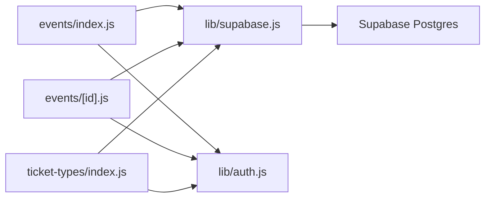
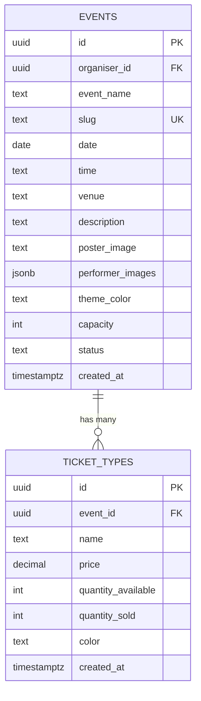

# Data Operation Routes

<cite>
**Referenced Files in This Document**
- [pages/api/events/index.js](file://pages/api/events/index.js)
- [pages/api/events/[id].js](file://pages/api/events/[id].js)
- [pages/api/ticket-types/index.js](file://pages/api/ticket-types/index.js)
- [lib/supabase.js](file://lib/supabase.js)
- [lib/auth.js](file://lib/auth.js)
- [supabase/schema.sql](file://supabase/schema.sql)
- [pages/api/tickets/purchase.js](file://pages/api/tickets/purchase.js)
- [package.json](file://package.json)
</cite>

## Table of Contents
1. [Introduction](#introduction)
2. [Project Structure](#project-structure)
3. [Core Components](#core-components)
4. [Architecture Overview](#architecture-overview)
5. [Detailed Component Analysis](#detailed-component-analysis)
6. [Dependency Analysis](#dependency-analysis)
7. [Performance Considerations](#performance-considerations)
8. [Troubleshooting Guide](#troubleshooting-guide)
9. [Conclusion](#conclusion)
10. [Appendices](#appendices)

## Introduction
This document explains the data operation API routes that implement CRUD operations for events and ticket types. It covers RESTful endpoint design, request/response schemas, Supabase client usage, query optimization, validation, error handling, authorization checks, transaction handling patterns, bulk operations, and performance considerations for data-intensive workflows.

## Project Structure
The API is implemented as Next.js serverless functions under pages/api. The key endpoints for this documentation are:
- Events: GET/POST at /api/events; GET/PUT/DELETE at /api/events/[id]
- Ticket Types: POST/PUT/DELETE at /api/ticket-types

Supabase clients are configured in lib/supabase.js with both an anonymous client and a service role client used by API routes to bypass Row Level Security (RLS) when necessary. Authorization and session parsing live in lib/auth.js. Database schema, constraints, indexes, and RLS policies are defined in supabase/schema.sql.

**Diagram sources**
- [pages/api/events/index.js:1-42](file://pages/api/events/index.js#L1-L42)
- [pages/api/events/[id].js:1-42](file://pages/api/events/[id].js#L1-L42)
- [pages/api/ticket-types/index.js:1-49](file://pages/api/ticket-types/index.js#L1-L49)
- [lib/supabase.js:1-23](file://lib/supabase.js#L1-L23)
- [lib/auth.js:1-47](file://lib/auth.js#L1-L47)

**Section sources**
- [pages/api/events/index.js:1-42](file://pages/api/events/index.js#L1-L42)
- [pages/api/events/[id].js:1-42](file://pages/api/events/[id].js#L1-L42)
- [pages/api/ticket-types/index.js:1-49](file://pages/api/ticket-types/index.js#L1-L49)
- [lib/supabase.js:1-23](file://lib/supabase.js#L1-L23)
- [lib/auth.js:1-47](file://lib/auth.js#L1-L47)
- [supabase/schema.sql:1-166](file://supabase/schema.sql#L1-L166)

## Core Components
- Events API (/api/events): Lists published events (public read), creates new events (authenticated).
- Event By ID API (/api/events/[id]): Reads a single event, updates it, or deletes it (authenticated).
- Ticket Types API (/api/ticket-types): Creates, updates, and deletes ticket types (authenticated).
- Supabase Client: Provides a service-role client for server-side database access.
- Auth Helper: Parses session cookies and enforces role-based authorization.

Key responsibilities:
- Input validation and sanitization before writes.
- Consistent error responses with appropriate HTTP status codes.
- Selective field projection to reduce payload size.
- Role-based authorization using requireRole().

**Section sources**
- [pages/api/events/index.js:1-42](file://pages/api/events/index.js#L1-L42)
- [pages/api/events/[id].js:1-42](file://pages/api/events/[id].js#L1-L42)
- [pages/api/ticket-types/index.js:1-49](file://pages/api/ticket-types/index.js#L1-L49)
- [lib/supabase.js:1-23](file://lib/supabase.js#L1-L23)
- [lib/auth.js:1-47](file://lib/auth.js#L1-L47)

## Architecture Overview
The API follows a thin controller pattern: each route validates input, enforces authorization, performs one or more Supabase queries, and returns a standardized JSON response. The service-role Supabase client bypasses RLS for admin operations, while public reads can rely on RLS policies where applicable.

**Diagram sources**
- [pages/api/events/index.js:18-37](file://pages/api/events/index.js#L18-L37)
- [lib/auth.js:38-46](file://lib/auth.js#L38-L46)
- [lib/supabase.js:15-22](file://lib/supabase.js#L15-L22)

## Detailed Component Analysis

### Events API: List and Create
- GET /api/events
  - Public read of published events.
  - Joins ticket_types fields inline via select projection.
  - Orders by date ascending.
  - Returns { events }.
- POST /api/events
  - Requires super_admin or organiser role.
  - Validates required fields: event_name, slug, date, venue.
  - Normalizes slug to lowercase and hyphenated.
  - Inserts event with defaults for theme_color and capacity, sets status draft.
  - Returns 201 { event }.

Request/Response Schema
- POST body:
  - event_name: string, required
  - slug: string, required
  - date: string (ISO date), required
  - time: string, optional
  - venue: string, required
  - description: string, optional
  - poster_image: string, optional
  - theme_color: string, optional (default '#e94560')
  - capacity: integer, optional (default 0)
- Success response (201):
  - event: object matching events table columns

Error Handling
- Missing fields: 400 { error }
- Supabase errors: 400 { error }
- Unauthorized/forbidden: 401/403 from requireRole

Query Optimization
- Select only needed fields including nested ticket_types fields.
- Filter by status = 'published' to leverage index on status.

Authorization
- requireRole enforces role check before write.

**Section sources**
- [pages/api/events/index.js:7-16](file://pages/api/events/index.js#L7-L16)
- [pages/api/events/index.js:18-37](file://pages/api/events/index.js#L18-L37)
- [lib/auth.js:38-46](file://lib/auth.js#L38-L46)
- [supabase/schema.sql:24-40](file://supabase/schema.sql#L24-L40)
- [supabase/schema.sql:147-148](file://supabase/schema.sql#L147-L148)

### Events API: Read, Update, Delete by ID
- GET /api/events/[id]
  - Returns a single event with all ticket_types.
  - 404 if not found.
- PUT /api/events/[id]
  - Requires super_admin or organiser role.
  - Sanitizes updates: removes id, organiser_id, created_at; normalizes slug.
  - Updates and returns updated event.
- DELETE /api/events/[id]
  - Requires super_admin or organiser role.
  - Deletes event by id.

Request/Response Schema
- GET success: { event }
- PUT success: { event }
- DELETE success: { success: true }

Error Handling
- Not found: 404 { error }
- Validation/update errors: 400 { error }
- Unauthorized/forbidden: 401/403

Authorization
- requireRole enforced for mutations.

**Section sources**
- [pages/api/events/[id].js:8-16](file://pages/api/events/[id].js#L8-L16)
- [pages/api/events/[id].js:18-29](file://pages/api/events/[id].js#L18-L29)
- [pages/api/events/[id].js:31-38](file://pages/api/events/[id].js#L31-L38)
- [lib/auth.js:38-46](file://lib/auth.js#L38-L46)

### Ticket Types API: Create, Update, Delete
- POST /api/ticket-types
  - Requires super_admin or organiser role.
  - Validates required fields: event_id, name, price, quantity_available.
  - Converts price and quantity to numbers; sets quantity_sold to 0; default color.
  - Returns 201 { ticketType }.
- PUT /api/ticket-types
  - Requires super_admin or organiser role.
  - Expects id in body; updates remaining fields.
  - Returns { ticketType }.
- DELETE /api/ticket-types
  - Requires super_admin or organiser role.
  - Expects id in body; deletes ticket type.
  - Returns { success: true }.

Request/Response Schema
- POST body:
  - event_id: uuid, required
  - name: string, required
  - price: number/string, required
  - quantity_available: number/string, required
  - color: string, optional (default '#e94560')
- PUT body:
  - id: uuid, required
  - other fields to update
- DELETE body:
  - id: uuid, required

Error Handling
- Missing fields: 400 { error }
- Supabase errors: 400 { error }
- Unauthorized/forbidden: 401/403

Authorization
- requireRole enforced for all mutations.

**Section sources**
- [pages/api/ticket-types/index.js:7-24](file://pages/api/ticket-types/index.js#L7-L24)
- [pages/api/ticket-types/index.js:26-35](file://pages/api/ticket-types/index.js#L26-L35)
- [pages/api/ticket-types/index.js:37-45](file://pages/api/ticket-types/index.js#L37-L45)
- [lib/auth.js:38-46](file://lib/auth.js#L38-L46)
- [supabase/schema.sql:45-54](file://supabase/schema.sql#L45-L54)

### Supabase Client Usage
- getServiceClient(): Server-only function returning a Supabase client initialized with the service role key. Used across API routes to bypass RLS for administrative operations.
- Environment variables: NEXT_PUBLIC_SUPABASE_URL, NEXT_PUBLIC_SUPABASE_ANON_KEY, SUPABASE_SERVICE_ROLE_KEY.

Best Practices
- Always use getServiceClient() in server-side API routes for privileged operations.
- Keep service role key secure and never expose it to the browser.

**Section sources**
- [lib/supabase.js:1-23](file://lib/supabase.js#L1-L23)

### Authorization and Session Handling
- getUserFromRequest(req): Extracts and parses a base64-encoded session cookie named tf_session.
- requireRole(req, ...roles): Validates presence and expiration of session; checks user role against allowed roles; throws structured error objects with status and message.

Security Notes
- Session token contains userId, role, and expiration; validated server-side.
- For production, consider migrating to a robust auth provider (e.g., Supabase Auth or NextAuth).

**Section sources**
- [lib/auth.js:30-46](file://lib/auth.js#L30-L46)

### Database Schema and Constraints
- events: includes status enum, unique slug, timestamps.
- ticket_types: references events with cascade delete; numeric price and quantities.
- Indexes: idx_events_slug, idx_events_status optimize common queries.
- RLS policies: enable public read of published events and associated ticket types.

Data Integrity
- Foreign keys enforce referential integrity.
- CHECK constraints enforce valid enums and ranges.

**Section sources**
- [supabase/schema.sql:24-54](file://supabase/schema.sql#L24-L54)
- [supabase/schema.sql:147-154](file://supabase/schema.sql#L147-L154)
- [supabase/schema.sql:131-139](file://supabase/schema.sql#L131-L139)

## Architecture Overview
The following diagram maps the runtime flow for creating an event and its ticket types, highlighting authorization, validation, and database interactions.

**Diagram sources**
- [pages/api/events/index.js:18-37](file://pages/api/events/index.js#L18-L37)
- [pages/api/ticket-types/index.js:7-24](file://pages/api/ticket-types/index.js#L7-L24)
- [lib/auth.js:38-46](file://lib/auth.js#L38-L46)
- [lib/supabase.js:15-22](file://lib/supabase.js#L15-L22)

## Detailed Component Analysis

### Query Optimization Patterns
- Field selection: Use explicit select projections to limit returned columns and avoid fetching unnecessary data.
- Filtering: Apply WHERE clauses early (e.g., status = 'published') to leverage indexes.
- Ordering: Order by indexed columns where possible (date, status).
- Nested joins: Fetch related ticket_types inline via select to reduce round-trips.

Examples
- Public list uses .select(`*, ticket_types (...)`) and filters by status.
- Single event fetch selects all ticket_types for display.

**Section sources**
- [pages/api/events/index.js:9-13](file://pages/api/events/index.js#L9-L13)
- [pages/api/events/[id].js:9-13](file://pages/api/events/[id].js#L9-L13)
- [supabase/schema.sql:147-148](file://supabase/schema.sql#L147-L148)

### Data Validation Strategies
- Required field checks return 400 with descriptive messages.
- Type coercion for numeric fields (price, quantity) ensures correct storage.
- Slug normalization prevents inconsistent URLs.

Patterns
- Early return on missing fields.
- Defensive deletion of immutable fields during updates (e.g., id, organiser_id, created_at).

**Section sources**
- [pages/api/events/index.js:21-31](file://pages/api/events/index.js#L21-L31)
- [pages/api/events/[id].js:21-25](file://pages/api/events/[id].js#L21-L25)
- [pages/api/ticket-types/index.js:10-19](file://pages/api/ticket-types/index.js#L10-L19)

### Error Handling Strategy
- Consistent error shape: { error: string }
- Status codes:
  - 400: Bad request/validation errors
  - 401: Not authenticated
  - 403: Insufficient permissions
  - 404: Resource not found
  - 405: Method not allowed
  - 500: Internal server errors
- Catch blocks propagate structured errors with status and message.

**Section sources**
- [pages/api/events/index.js:22-37](file://pages/api/events/index.js#L22-L37)
- [pages/api/events/[id].js:21-38](file://pages/api/events/[id].js#L21-L38)
- [pages/api/ticket-types/index.js:10-45](file://pages/api/ticket-types/index.js#L10-L45)

### Transaction Handling and Bulk Operations
- Current state: No explicit transactions are used in the events or ticket types APIs.
- Related example: Ticket purchase shows multi-step operations (create tickets, increment sold count, record payment) without a transaction wrapper.
- Recommendation: Wrap multi-step writes in a Supabase transaction (or database-level transaction) to ensure atomicity, especially for inventory updates and payment recording.

Bulk Operations
- Inserting multiple tickets in a loop is used in the purchase flow; consider batch inserts for performance.
- Avoid N+1 queries by batching updates where possible.

**Section sources**
- [pages/api/tickets/purchase.js:80-115](file://pages/api/tickets/purchase.js#L80-L115)

### Performance Considerations
- Use indexes: Ensure queries filter by indexed columns (status, slug).
- Limit payloads: Select only needed fields.
- Reduce round-trips: Join related data in a single query where feasible.
- Avoid heavy computation in hot paths; precompute or cache where appropriate.
- Monitor and paginate large result sets.

[No sources needed since this section provides general guidance]

## Dependency Analysis
The API routes depend on:
- Supabase client for database operations
- Auth helper for session parsing and role enforcement
- Database schema for constraints and indexes

**Diagram sources**
- [pages/api/events/index.js:1-6](file://pages/api/events/index.js#L1-L6)
- [pages/api/events/[id].js:1-6](file://pages/api/events/[id].js#L1-L6)
- [pages/api/ticket-types/index.js:1-6](file://pages/api/ticket-types/index.js#L1-L6)
- [lib/supabase.js:1-23](file://lib/supabase.js#L1-L23)
- [lib/auth.js:1-47](file://lib/auth.js#L1-L47)

**Section sources**
- [pages/api/events/index.js:1-6](file://pages/api/events/index.js#L1-L6)
- [pages/api/events/[id].js:1-6](file://pages/api/events/[id].js#L1-L6)
- [pages/api/ticket-types/index.js:1-6](file://pages/api/ticket-types/index.js#L1-L6)
- [lib/supabase.js:1-23](file://lib/supabase.js#L1-L23)
- [lib/auth.js:1-47](file://lib/auth.js#L1-L47)

## Performance Considerations
- Prefer selective SELECT projections to minimize network and memory overhead.
- Leverage existing indexes (status, slug) for filtering and ordering.
- Batch insert operations where possible to reduce round-trips.
- Consider caching frequently accessed read data (e.g., published events) at the edge or application layer.
- Monitor slow queries and add additional indexes if needed.

[No sources needed since this section provides general guidance]

## Troubleshooting Guide
Common issues and resolutions:
- Missing environment variables: Ensure NEXT_PUBLIC_SUPABASE_URL, NEXT_PUBLIC_SUPABASE_ANON_KEY, and SUPABASE_SERVICE_ROLE_KEY are set.
- Authentication failures: Verify session cookie tf_session is present and not expired.
- Permission errors: Confirm user role matches required roles for the endpoint.
- Validation errors: Check required fields and data types in request bodies.
- Database errors: Inspect Supabase error messages and verify schema constraints.

Operational tips:
- Log structured errors with context (endpoint, userId, requestId).
- Add rate limiting for sensitive endpoints in production.
- Validate inputs on both client and server sides.

**Section sources**
- [lib/supabase.js:6-8](file://lib/supabase.js#L6-L8)
- [lib/auth.js:30-46](file://lib/auth.js#L30-L46)
- [pages/api/events/index.js:21-37](file://pages/api/events/index.js#L21-L37)
- [pages/api/events/[id].js:21-38](file://pages/api/events/[id].js#L21-L38)
- [pages/api/ticket-types/index.js:10-45](file://pages/api/ticket-types/index.js#L10-L45)

## Conclusion
The data operation routes implement a clear, consistent pattern for managing events and ticket types. They combine robust validation, role-based authorization, and efficient Supabase queries. To improve reliability and scalability, adopt transactional writes for multi-step operations, standardize error shapes, and continue optimizing queries with proper indexing and selective projections.

[No sources needed since this section summarizes without analyzing specific files]

## Appendices

### REST Endpoints Summary
- GET /api/events
  - Purpose: List published events
  - Auth: None
  - Response: { events }
- POST /api/events
  - Purpose: Create event
  - Auth: super_admin or organiser
  - Request: event_name, slug, date, venue (+ optional fields)
  - Response: { event }
- GET /api/events/[id]
  - Purpose: Get event by id
  - Auth: None
  - Response: { event }
- PUT /api/events/[id]
  - Purpose: Update event
  - Auth: super_admin or organiser
  - Request: Partial update fields
  - Response: { event }
- DELETE /api/events/[id]
  - Purpose: Delete event
  - Auth: super_admin or organiser
  - Response: { success: true }
- POST /api/ticket-types
  - Purpose: Create ticket type
  - Auth: super_admin or organiser
  - Request: event_id, name, price, quantity_available (+ optional color)
  - Response: { ticketType }
- PUT /api/ticket-types
  - Purpose: Update ticket type
  - Auth: super_admin or organiser
  - Request: id + fields to update
  - Response: { ticketType }
- DELETE /api/ticket-types
  - Purpose: Delete ticket type
  - Auth: super_admin or organiser
  - Request: id
  - Response: { success: true }

**Section sources**
- [pages/api/events/index.js:7-37](file://pages/api/events/index.js#L7-L37)
- [pages/api/events/[id].js:8-38](file://pages/api/events/[id].js#L8-L38)
- [pages/api/ticket-types/index.js:7-45](file://pages/api/ticket-types/index.js#L7-L45)

### Data Models

**Diagram sources**
- [supabase/schema.sql:24-54](file://supabase/schema.sql#L24-L54)

### Dependencies
- Supabase JS SDK for database access
- bcryptjs for password hashing
- Stripe integration for payments (in related flows)
- UUID generation for tokens

**Section sources**
- [package.json:10-22](file://package.json#L10-L22)