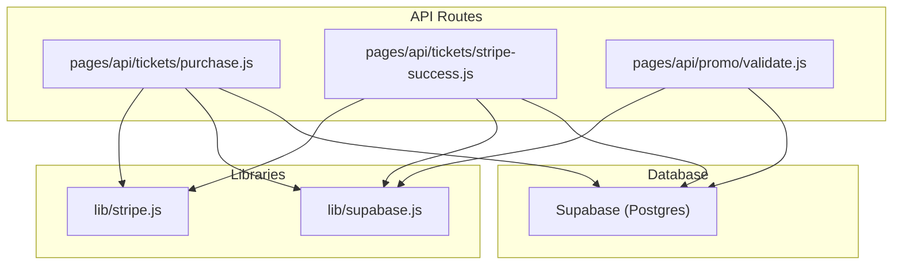
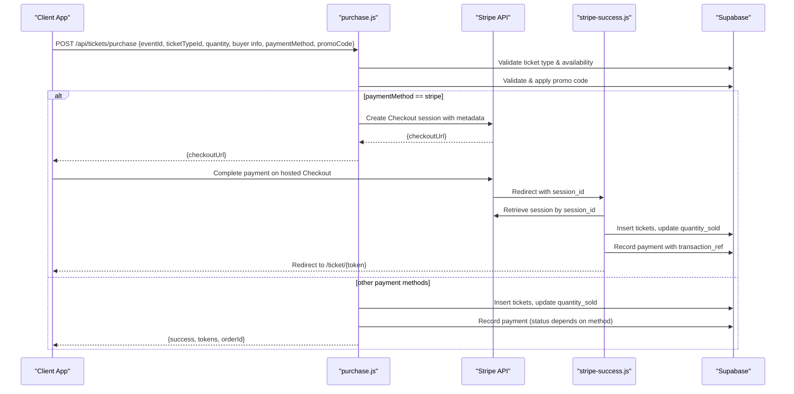
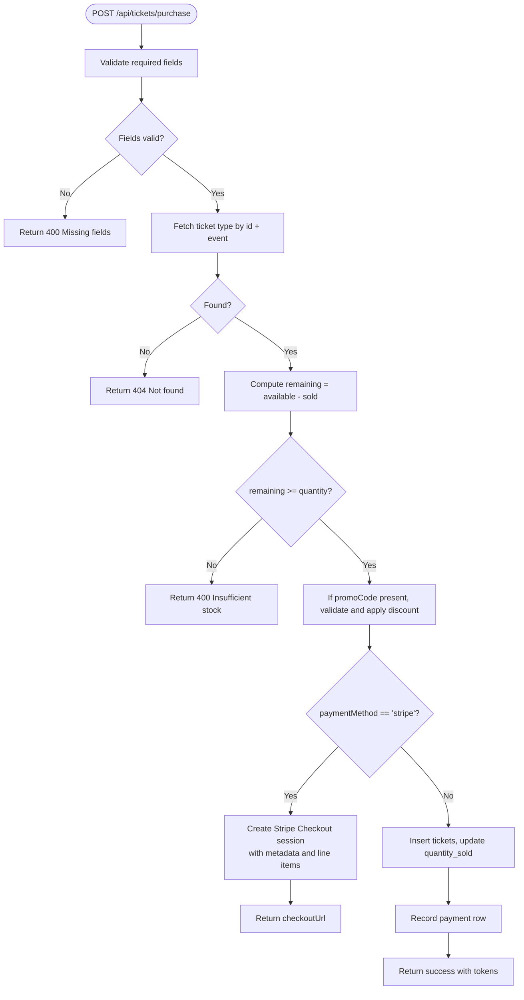
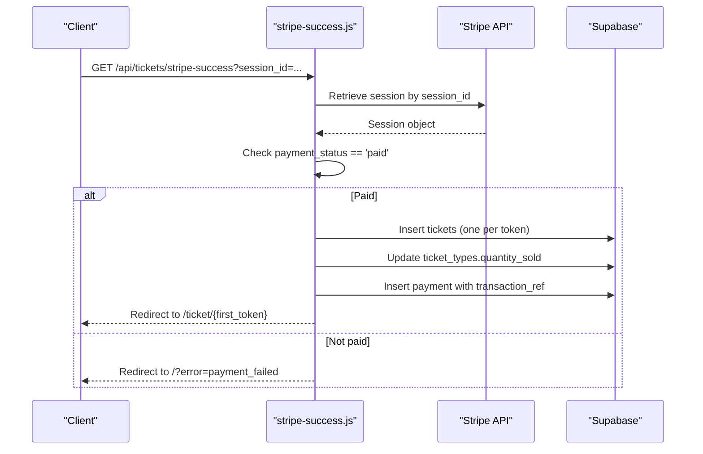
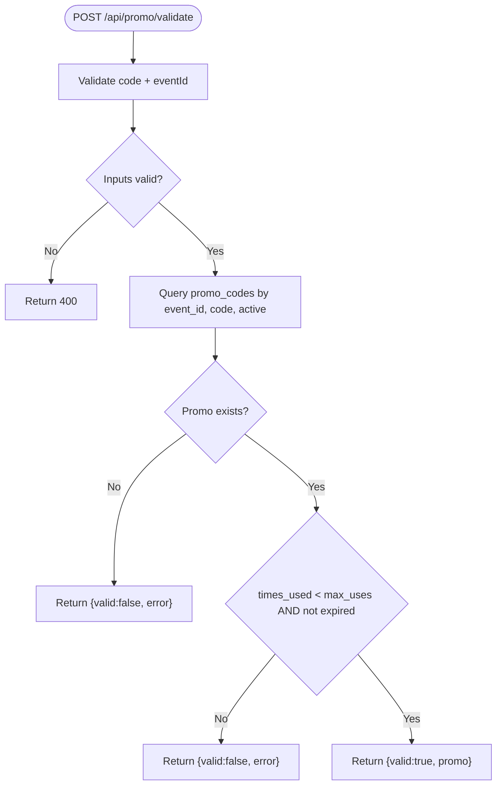
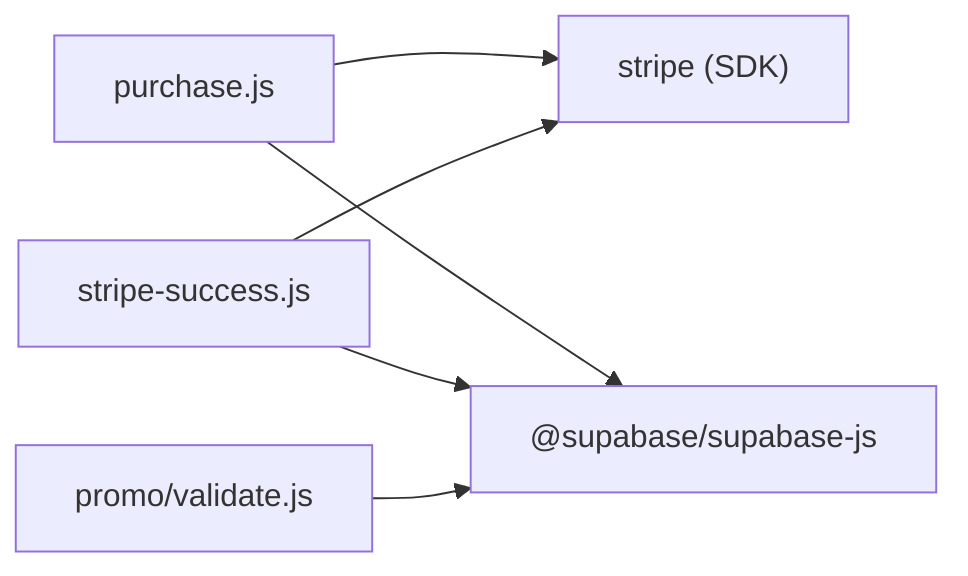
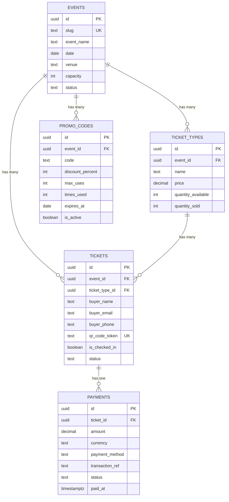

# Payment Processing Routes

<cite>
**Referenced Files in This Document**
- [purchase.js](file://pages/api/tickets/purchase.js)
- [stripe-success.js](file://pages/api/tickets/stripe-success.js)
- [validate.js](file://pages/api/promo/validate.js)
- [schema.sql](file://supabase/schema.sql)
- [stripe.js](file://lib/stripe.js)
- [supabase.js](file://lib/supabase.js)
- [package.json](file://package.json)
</cite>

## Table of Contents
1. [Introduction](#introduction)
2. [Project Structure](#project-structure)
3. [Core Components](#core-components)
4. [Architecture Overview](#architecture-overview)
5. [Detailed Component Analysis](#detailed-component-analysis)
6. [Dependency Analysis](#dependency-analysis)
7. [Performance Considerations](#performance-considerations)
8. [Troubleshooting Guide](#troubleshooting-guide)
9. [Conclusion](#conclusion)
10. [Appendices](#appendices)

## Introduction
This document explains the payment processing API routes that handle ticket purchases and Stripe integration. It covers the purchase flow from cart validation through promo code application, Stripe Checkout session creation, and post-payment confirmation via a success endpoint. It also documents error handling, idempotency considerations, transaction integrity, currency handling, security and PCI compliance guidance, and debugging strategies.

## Project Structure
The payment-related endpoints are implemented as Next.js API routes under pages/api:
- Purchase entry point: pages/api/tickets/purchase.js
- Stripe success callback: pages/api/tickets/stripe-success.js
- Promo code validation: pages/api/promo/validate.js
- Database schema: supabase/schema.sql
- Stripe client helper: lib/stripe.js
- Supabase clients: lib/supabase.js
- Dependencies: package.json

**Diagram sources**
- [purchase.js:1-123](file://pages/api/tickets/purchase.js#L1-L123)
- [stripe-success.js:1-55](file://pages/api/tickets/stripe-success.js#L1-L55)
- [validate.js:1-27](file://pages/api/promo/validate.js#L1-L27)
- [stripe.js:1-6](file://lib/stripe.js#L1-L6)
- [supabase.js:1-23](file://lib/supabase.js#L1-L23)
- [schema.sql:45-117](file://supabase/schema.sql#L45-L117)

**Section sources**
- [purchase.js:1-123](file://pages/api/tickets/purchase.js#L1-L123)
- [stripe-success.js:1-55](file://pages/api/tickets/stripe-success.js#L1-L55)
- [validate.js:1-27](file://pages/api/promo/validate.js#L1-L27)
- [schema.sql:45-117](file://supabase/schema.sql#L45-L117)
- [stripe.js:1-6](file://lib/stripe.js#L1-L6)
- [supabase.js:1-23](file://lib/supabase.js#L1-L23)
- [package.json:1-24](file://package.json#L1-L24)

## Core Components
- Purchase handler: Validates inputs, checks ticket availability, applies promo codes, creates Stripe Checkout sessions for card payments, or issues tickets immediately for other methods.
- Stripe success handler: Verifies payment status, creates tickets, updates sold counts, records payments, and redirects to the first ticket page.
- Promo validation: Validates promo codes against event scope, usage limits, and expiration.
- Stripe client: Initializes Stripe SDK with secret key and API version.
- Supabase client: Provides service-role client for server-side writes.

Key responsibilities:
- Input validation and business rule enforcement
- Discount calculation and promotion accounting
- Secure external payment orchestration via Stripe
- Atomic database updates for inventory and payments
- Clear error responses and safe redirects

**Section sources**
- [purchase.js:1-123](file://pages/api/tickets/purchase.js#L1-L123)
- [stripe-success.js:1-55](file://pages/api/tickets/stripe-success.js#L1-L55)
- [validate.js:1-27](file://pages/api/promo/validate.js#L1-L27)
- [stripe.js:1-6](file://lib/stripe.js#L1-L6)
- [supabase.js:1-23](file://lib/supabase.js#L1-L23)

## Architecture Overview
The purchase flow is split into two primary paths:
- Non-Stripe payments: Tickets are created synchronously and payment recorded immediately.
- Stripe payments: A Checkout session is created; after successful payment, the user is redirected to a success endpoint that finalizes ticket issuance and payment recording.

**Diagram sources**
- [purchase.js:1-123](file://pages/api/tickets/purchase.js#L1-L123)
- [stripe-success.js:1-55](file://pages/api/tickets/stripe-success.js#L1-L55)
- [schema.sql:45-117](file://supabase/schema.sql#L45-L117)

## Detailed Component Analysis

### Purchase Handler (/api/tickets/purchase)
Responsibilities:
- Enforce HTTP method and required fields
- Verify ticket type exists and belongs to the event
- Check remaining availability and reject if insufficient
- Apply promo code if provided, increment usage atomically
- For Stripe: create a Checkout session with line items and metadata
- For non-Stripe: insert tickets, update sold count, record payment

Error handling:
- Returns 400 for missing fields or insufficient stock
- Returns 404 when ticket type not found
- Returns 500 on unexpected errors

Idempotency and concurrency:
- Availability check and reservation are not atomic; concurrent requests can oversell unless protected at the database level (e.g., row-level locking or unique constraints).
- Promo code usage increment is not wrapped in a transaction; race conditions could allow overuse.

Currency handling:
- Line item unit amount is calculated in cents using USD.

Security:
- Uses service-role Supabase client for writes
- Secret keys loaded from environment variables

**Diagram sources**
- [purchase.js:1-123](file://pages/api/tickets/purchase.js#L1-L123)

**Section sources**
- [purchase.js:1-123](file://pages/api/tickets/purchase.js#L1-L123)

### Stripe Success Handler (/api/tickets/stripe-success)
Responsibilities:
- Retrieve Stripe Checkout session by session_id
- Confirm payment_status is paid
- Reconstruct price from ticket type and discount metadata
- Insert tickets and update quantity_sold
- Record payment with transaction reference and timestamp
- Redirect to the first ticket page

Error handling:
- Redirects to home with error query parameters on invalid session or failed payment
- Logs errors and redirects to home with generic failure message

Idempotency:
- No explicit idempotency guard; re-invoking this endpoint could duplicate tickets and payments if called multiple times.

**Diagram sources**
- [stripe-success.js:1-55](file://pages/api/tickets/stripe-success.js#L1-L55)

**Section sources**
- [stripe-success.js:1-55](file://pages/api/tickets/stripe-success.js#L1-L55)

### Promo Code Validation (/api/promo/validate)
Responsibilities:
- Validate presence of code and eventId
- Normalize code casing and trim whitespace
- Ensure promo is active, within usage limits, and not expired
- Return validated discount details

Error handling:
- Returns 400 for missing inputs
- Returns 500 on unexpected errors

**Diagram sources**
- [validate.js:1-27](file://pages/api/promo/validate.js#L1-L27)

**Section sources**
- [validate.js:1-27](file://pages/api/promo/validate.js#L1-L27)

### Stripe Client and Supabase Clients
- Stripe client initializes the SDK with secret key and API version.
- Supabase provides both anonymous and service-role clients; API routes use the service-role client for privileged writes.

Best practices:
- Keep secrets out of source control
- Pin API versions for stability
- Use service-role only on the server side

**Section sources**
- [stripe.js:1-6](file://lib/stripe.js#L1-L6)
- [supabase.js:1-23](file://lib/supabase.js#L1-L23)

## Dependency Analysis
External dependencies relevant to payments:
- stripe SDK for creating Checkout sessions and retrieving sessions
- @supabase/supabase-js for database operations
- uuid for generating unique QR tokens

**Diagram sources**
- [purchase.js:1-123](file://pages/api/tickets/purchase.js#L1-L123)
- [stripe-success.js:1-55](file://pages/api/tickets/stripe-success.js#L1-L55)
- [validate.js:1-27](file://pages/api/promo/validate.js#L1-L27)
- [package.json:1-24](file://package.json#L1-L24)

**Section sources**
- [package.json:1-24](file://package.json#L1-L24)

## Performance Considerations
- Minimize round-trips: The purchase route performs sequential DB reads/writes; consider batching where possible.
- Avoid redundant work: Ensure the success endpoint is idempotent to prevent duplicate inserts on retries.
- Indexing: The schema includes indexes on frequently queried columns such as qr_code_token, buyer_email, event_id, and ticket_id.
- Concurrency: Protect availability checks and promo usage increments with database transactions or row-level locks to prevent overselling and overuse.

[No sources needed since this section provides general guidance]

## Troubleshooting Guide
Common issues and resolutions:
- Missing required fields: Ensure all required fields are included in the purchase request payload.
- Ticket type not found: Verify eventId and ticketTypeId match an existing, published event’s ticket types.
- Insufficient stock: Reduce quantity or verify availability before purchase.
- Invalid or expired promo code: Confirm the code is active, within usage limits, and not expired.
- Stripe payment not completed: The success endpoint requires payment_status to be paid; otherwise, users are redirected with an error.
- Duplicate tickets or payments: Implement idempotency in the success endpoint to avoid reprocessing the same session_id.

Debugging tips:
- Log errors consistently in catch blocks
- Verify environment variables for Stripe secret key and Supabase credentials
- Use Stripe Dashboard to inspect Checkout sessions and payment intents
- Validate database state after each step to ensure consistency

**Section sources**
- [purchase.js:1-123](file://pages/api/tickets/purchase.js#L1-L123)
- [stripe-success.js:1-55](file://pages/api/tickets/stripe-success.js#L1-L55)
- [validate.js:1-27](file://pages/api/promo/validate.js#L1-L27)

## Conclusion
The payment processing routes implement a clear separation between initial purchase validation and post-payment confirmation. While the current implementation handles core flows effectively, it lacks robust idempotency and transactional guarantees for critical operations like availability checks and promo usage. Adding these safeguards will improve reliability, prevent data inconsistencies, and support safer scaling.

[No sources needed since this section summarizes without analyzing specific files]

## Appendices

### Data Model Overview
Key tables involved in payments and ticketing:
- events: Event metadata and status
- ticket_types: Pricing and availability per event
- tickets: Individual ticket records with unique QR tokens
- payments: Payment records linked to tickets
- promo_codes: Promotion rules and usage tracking

**Diagram sources**
- [schema.sql:24-117](file://supabase/schema.sql#L24-L117)

### Security and PCI Compliance Guidance
- Do not handle raw card data in your application; rely on Stripe-hosted Checkout to keep PCI scope minimal.
- Store only necessary customer information in your database; avoid storing sensitive payment details.
- Use HTTPS everywhere and secure environment variables for secrets.
- Validate and sanitize all inputs; enforce least privilege access to the database.
- Monitor and log payment events securely; avoid logging sensitive data.

[No sources needed since this section provides general guidance]

### Error Handling and Retry Logic Recommendations
- Idempotency:
  - In the success endpoint, check for existing payments or tickets by transaction_ref or session_id before inserting.
  - Use database constraints or upserts to prevent duplicates.
- Retries:
  - Implement exponential backoff for transient network failures.
  - Ensure idempotency to safely retry failed operations.
- Transaction integrity:
  - Wrap availability checks and ticket issuance in a single transaction.
  - Use row-level locks or optimistic concurrency controls to prevent overselling.

[No sources needed since this section provides general guidance]

### Currency Conversion and Multi-Currency Support
- Current implementation uses USD exclusively for line items and payment records.
- To support multi-currency:
  - Capture the customer’s preferred currency at checkout.
  - Convert amounts using a reliable exchange rate provider.
  - Store original currency and converted amounts for auditability.
  - Ensure Stripe Checkout is configured with the correct currency.

[No sources needed since this section provides general guidance]

### Webhook Handling for Payment Confirmation
- Recommended approach:
  - Create a dedicated webhook endpoint to receive Stripe events.
  - Verify webhook signatures using Stripe’s signing secret.
  - Handle events such as payment_intent.succeeded and checkout.session.completed.
  - Perform idempotent updates based on event IDs.
  - Acknowledge events promptly and process asynchronously if needed.

[No sources needed since this section provides general guidance]